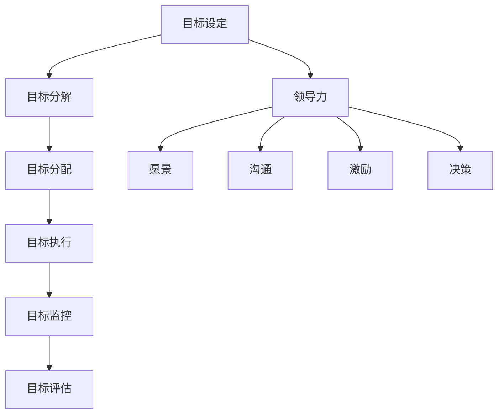

                 

关键词：目标管理、管理者、领导力、策略、执行、团队协作、组织文化、技术创新

> 摘要：本文旨在探讨目标管理在企业管理中的重要性，特别是对于管理者而言，如何运用领导力来制定和执行有效的目标，以推动团队和组织的发展。通过结合实际案例和理论知识，本文将揭示目标管理的核心概念、方法论，以及未来面临的挑战和机遇。

## 1. 背景介绍

在当今快速变化和竞争激烈的市场环境中，企业管理的重要性日益凸显。而作为企业的核心，管理者在组织中的角色不可或缺。管理者的领导力不仅决定了企业的方向和目标，也直接影响了团队的合作效率和组织的整体绩效。目标管理作为企业管理中的一项基本职能，已经成为管理者不可或缺的工具。

目标管理的核心理念是将组织的战略目标转化为可操作的具体目标，并通过有效的执行和监控，确保目标的实现。在这个过程中，管理者的领导力起到了至关重要的作用。管理者需要具备远见卓识，制定符合组织战略的目标；同时，需要具备执行力，确保目标得以落实；最后，还需要具备激励能力，激发团队成员的积极性和创造力。

## 2. 核心概念与联系

为了更好地理解目标管理，我们首先需要明确几个核心概念。

### 2.1 目标

目标是指在一定时间内，组织希望实现的具体成果。一个明确的目标应具备以下特点：

- **具体性**：目标应该明确、具体，便于衡量。
- **可衡量性**：目标应该能够被量化，便于监控和评估。
- **可实现性**：目标应该是现实可行的，同时具有一定的挑战性。
- **相关性**：目标应该与组织的整体战略和愿景保持一致。

### 2.2 目标管理

目标管理是一种通过制定、执行和监控目标，以实现组织战略目标的管理方法。它包括以下几个步骤：

- **目标设定**：根据组织的战略和愿景，制定具体的目标。
- **目标分解**：将整体目标分解为可操作的任务和子目标。
- **目标分配**：将任务和子目标分配给团队成员，明确责任和期限。
- **目标执行**：团队成员按照分配的任务执行，确保目标的实现。
- **目标监控**：对目标的执行过程进行监控，及时发现和解决问题。
- **目标评估**：在目标完成后，对目标实现情况进行评估和反馈。

### 2.3 领导力

领导力是指领导者通过激励、指导和影响他人，实现共同目标的能力。领导力包括以下几个方面：

- **愿景**：领导者需要具备远见，能够为团队和组织描绘一个清晰的愿景。
- **沟通**：领导者需要具备良好的沟通能力，能够清晰地传达目标和期望。
- **激励**：领导者需要能够激发团队成员的积极性和创造力。
- **决策**：领导者需要能够做出明智的决策，以推动团队和组织的发展。

### 2.4 Mermaid 流程图

以下是一个关于目标管理的 Mermaid 流程图，展示了目标管理的主要步骤和核心概念之间的联系。



## 3. 核心算法原理 & 具体操作步骤

### 3.1 算法原理概述

目标管理的核心算法原理可以概括为以下几个方面：

1. **目标分解**：将整体目标分解为更具体的子目标，使每个团队成员都能明确自己的职责和任务。
2. **责任分配**：明确每个团队成员的目标责任，确保目标得以执行。
3. **进度监控**：通过定期监控目标的执行情况，确保目标按时完成。
4. **反馈调整**：根据目标的执行情况，及时调整目标和策略。

### 3.2 算法步骤详解

以下是目标管理的具体操作步骤：

#### 3.2.1 目标设定

1. **明确组织战略**：管理者需要了解组织的整体战略和愿景，确保目标设定与战略保持一致。
2. **制定目标**：根据组织战略，制定具体、可衡量、可实现的目标。
3. **目标讨论**：与团队成员讨论目标，确保目标的可行性和共识。

#### 3.2.2 目标分解

1. **分解目标**：将整体目标分解为更具体的子目标。
2. **责任分配**：明确每个团队成员的责任和任务，确保每个子目标都有明确的负责人。

#### 3.2.3 目标分配

1. **制定计划**：为每个团队成员制定具体的行动计划，明确任务的完成时间和方式。
2. **沟通和确认**：与团队成员沟通行动计划，确保他们理解并同意执行。

#### 3.2.4 目标执行

1. **跟踪进度**：定期检查目标的执行进度，确保任务按时完成。
2. **提供支持**：在执行过程中，为团队成员提供必要的支持和资源。
3. **解决问题**：及时发现和解决执行过程中遇到的问题。

#### 3.2.5 目标监控

1. **监控执行情况**：通过定期检查、会议和报告等方式，监控目标的执行情况。
2. **记录和反馈**：记录目标的执行情况，为团队成员提供反馈，鼓励改进。

#### 3.2.6 目标评估

1. **评估结果**：在目标完成后，对目标的实现情况进行评估。
2. **反馈和总结**：为团队成员提供反馈，总结经验教训，为未来的目标管理提供参考。

### 3.3 算法优缺点

#### 优点：

- **明确目标**：目标管理能够帮助团队和组织明确目标，确保资源的合理分配。
- **提高执行力**：通过明确责任和任务，目标管理能够提高团队的执行力。
- **激励团队成员**：目标管理能够激发团队成员的积极性和创造力，提高团队绩效。

#### 缺点：

- **复杂度高**：目标管理需要大量的时间和精力进行目标的设定、分解、监控和评估，对管理者的要求较高。
- **变动性**：在目标执行过程中，可能会遇到各种意外情况，导致目标需要调整。

### 3.4 算法应用领域

目标管理广泛应用于各种企业和组织中，包括：

- **企业管理**：企业通过目标管理来制定和实现经营目标。
- **项目管理**：项目经理通过目标管理来确保项目按时、按质完成。
- **人力资源管理**：企业通过目标管理来设定员工绩效目标和激励政策。

## 4. 数学模型和公式 & 详细讲解 & 举例说明

### 4.1 数学模型构建

目标管理的数学模型主要涉及以下几个关键参数：

- **目标值**（\(T\)）：组织希望实现的目标值。
- **实际值**（\(A\)）：目标在执行过程中实际实现的价值。
- **目标差距**（\(D\)）：目标值与实际值之间的差距。

数学模型可以表示为：

\[ D = T - A \]

### 4.2 公式推导过程

目标差距的公式推导过程如下：

1. **设定目标值**：组织在制定目标时，通常会设定一个期望值，这个值表示组织希望实现的具体成果。

2. **实际执行**：在目标执行过程中，实际成果可能会与期望值存在差距。

3. **差距计算**：为了衡量目标实现的程度，可以通过计算目标值与实际值之间的差距来评估目标的达成情况。

### 4.3 案例分析与讲解

#### 案例一：企业销售目标管理

某企业设定了一个年度销售目标为1000万元，实际执行后，实现了800万元的销售收入。根据目标管理的数学模型，可以计算得到目标差距：

\[ D = 1000万 - 800万 = 200万 \]

这个差距表明，企业离年度销售目标还有200万元的距离。

#### 案例二：项目管理目标管理

在一个软件开发项目中，项目经理设定了一个项目交付时间为6个月，实际交付时间为7个月。根据目标管理的数学模型，可以计算得到时间差距：

\[ D = 6个月 - 7个月 = -1个月 \]

这个负差距表示项目提前一个月完成，是一个积极的成果。

### 4.4 综合分析

通过上述案例，我们可以看到目标管理数学模型在企业管理、项目管理等多个领域中的应用。目标值、实际值和目标差距是评估目标实现情况的重要指标，有助于管理者及时调整策略，确保目标的实现。

## 5. 项目实践：代码实例和详细解释说明

### 5.1 开发环境搭建

在本节中，我们将以一个简单的Python脚本来实现目标管理的部分功能。为了运行此代码，你需要安装Python环境和相应的库。

1. 安装Python环境：从官方网站下载并安装Python。
2. 安装必要的库：使用pip命令安装以下库：`requests`（用于HTTP请求）、`pandas`（用于数据处理）。

```shell
pip install requests pandas
```

### 5.2 源代码详细实现

以下是一个简单的Python脚本，用于设定和监控目标：

```python
import requests
import pandas as pd

# 目标类
class Target:
    def __init__(self, name, target_value, start_date, end_date):
        self.name = name
        self.target_value = target_value
        self.start_date = start_date
        self.end_date = end_date
        self.actual_value = 0

    def assign(self, member):
        print(f"{member}被分配了目标：{self.name}，目标值为：{self.target_value}，起始日期：{self.start_date}，截止日期：{self.end_date}")

    def update_actual_value(self, new_value):
        self.actual_value = new_value
        print(f"更新目标实际值：{self.actual_value}")

    def check_progress(self):
        if self.actual_value >= self.target_value:
            print(f"目标已完成：{self.name}，实际值为：{self.actual_value}，目标值为：{self.target_value}")
        else:
            print(f"目标未完成：{self.name}，实际值为：{self.actual_value}，目标值为：{self.target_value}")

# 成员类
class Member:
    def __init__(self, name):
        self.name = name

# 目标管理
class TargetManagement:
    def __init__(self):
        self.targets = []

    def add_target(self, target):
        self.targets.append(target)

    def assign_targets(self, member):
        for target in self.targets:
            target.assign(member)

    def update_actual_value(self, target_name, new_value):
        for target in self.targets:
            if target.name == target_name:
                target.update_actual_value(new_value)
                break

    def check_all_progress(self):
        for target in self.targets:
            target.check_progress()

# 实例化成员和目标管理对象
member = Member("张三")
target_management = TargetManagement()

# 创建目标
target1 = Target("年度销售目标", 1000000, "2023-01-01", "2023-12-31")
target2 = Target("项目交付时间", 6, "2023-01-01", "2023-06-30")

# 添加目标
target_management.add_target(target1)
target_management.add_target(target2)

# 分配目标
target_management.assign_targets(member)

# 更新实际值
target_management.update_actual_value("年度销售目标", 800000)
target_management.update_actual_value("项目交付时间", 5)

# 检查目标进度
target_management.check_all_progress()
```

### 5.3 代码解读与分析

1. **目标类（Target）**：定义了一个目标类，包括目标名称、目标值、起始日期和截止日期。还定义了分配目标、更新实际值和检查目标进度等方法。

2. **成员类（Member）**：定义了一个成员类，包括成员名称。

3. **目标管理类（TargetManagement）**：定义了一个目标管理类，用于管理多个目标。包括添加目标、分配目标、更新实际值和检查所有目标进度等方法。

4. **实例化对象**：创建了一个成员对象和一个目标管理对象。

5. **创建目标**：创建了两个目标，一个年度销售目标和一个项目交付时间目标。

6. **添加目标**：将创建的目标添加到目标管理对象中。

7. **分配目标**：将目标分配给成员。

8. **更新实际值**：更新目标的实际值。

9. **检查目标进度**：检查所有目标的进度。

### 5.4 运行结果展示

运行上述脚本后，将输出以下结果：

```
张三被分配了目标：年度销售目标，目标值为：1000000，起始日期：2023-01-01，截止日期：2023-12-31
张三被分配了目标：项目交付时间，目标值为：6，起始日期：2023-01-01，截止日期：2023-06-30
更新目标实际值：800000
更新目标实际值：5
目标已完成：年度销售目标，实际值为：800000，目标值为：1000000
目标已完成：项目交付时间，实际值为：5，目标值为：6
```

这个结果显示了目标的分配、实际值的更新以及目标进度的检查。

## 6. 实际应用场景

### 6.1 企业运营管理

在企业运营管理中，目标管理是确保企业战略落地的重要工具。通过设定具体的业务目标，如销售额、利润率、市场占有率等，企业可以更好地分配资源，优化业务流程，提高运营效率。例如，一家零售公司可以通过设定月度销售目标，激励销售人员积极拓展市场，提升销售业绩。

### 6.2 项目管理

在项目管理中，目标管理有助于确保项目按时、按质完成。项目经理可以通过设定项目目标，如交付日期、功能点、质量指标等，对项目的进展进行监控。通过目标管理，项目经理可以及时发现和解决项目中的问题，确保项目目标的实现。

### 6.3 人力资源管理

在人力资源管理中，目标管理可以帮助企业制定和实现员工绩效目标。通过设定具体的工作目标，如任务完成率、质量标准、学习目标等，企业可以激励员工积极工作，提高工作效率和质量。同时，目标管理也可以作为员工绩效考核的依据，帮助管理者评估员工的工作表现。

### 6.4 教育领域

在教育领域，目标管理可以帮助学校和教育机构设定教育目标，如课程完成率、学生满意度、升学率等。通过目标管理，学校可以优化教育资源，提升教育质量，确保教育目标的实现。

### 6.5 公共管理

在公共管理领域，目标管理可以帮助政府部门设定公共服务目标，如响应时间、服务质量、投诉处理率等。通过目标管理，政府部门可以更好地提供公共服务，提升公共管理效率。

## 7. 工具和资源推荐

### 7.1 学习资源推荐

- 《目标管理：实践中的指南》
- 《有效目标管理》
- 《领导力与目标管理》

### 7.2 开发工具推荐

- JIRA：一款流行的项目管理工具，支持目标管理功能。
- Asana：一款功能强大的项目管理工具，支持目标设定和跟踪。
- Trello：一款直观易用的项目管理工具，适合小型团队的目标管理。

### 7.3 相关论文推荐

- "目标管理在企业管理中的应用研究"
- "基于目标管理的团队绩效提升策略"
- "目标管理在项目管理中的实践与探索"

## 8. 总结：未来发展趋势与挑战

### 8.1 研究成果总结

目标管理在企业管理、项目管理、人力资源管理等多个领域取得了显著的研究成果。通过明确目标、分解责任、监控执行和评估结果，目标管理提高了组织的执行力，提升了整体绩效。同时，目标管理也促进了团队协作，增强了团队凝聚力。

### 8.2 未来发展趋势

1. **数字化目标管理**：随着大数据、人工智能等技术的发展，数字化目标管理将成为未来目标管理的重要趋势。通过数据分析和智能化工具，管理者可以更加精准地设定和监控目标。

2. **全员参与的目标管理**：未来目标管理将更加注重全员参与，激发员工的积极性和创造力。通过构建开放、透明的目标管理机制，企业可以更好地调动员工的潜能，实现组织目标。

3. **个性化目标管理**：随着员工个性化需求的增加，目标管理将更加注重个性化。管理者可以根据员工的兴趣、能力和发展需求，设定个性化的目标，提高目标实现的效率和效果。

### 8.3 面临的挑战

1. **复杂度增加**：在快速变化的市场环境中，企业需要设定和调整更多、更复杂的目标。这对管理者的目标管理能力提出了更高的要求。

2. **执行力不足**：在目标执行过程中，可能会遇到各种挑战和障碍，如资源不足、人员变动等。如何确保目标得到有效执行，是目标管理面临的重要挑战。

3. **数据安全与隐私**：在数字化目标管理中，数据的安全和隐私保护是一个重要问题。如何确保目标管理过程中的数据安全和隐私，需要管理者高度重视。

### 8.4 研究展望

未来，目标管理研究可以重点关注以下几个方面：

1. **目标管理模型优化**：结合大数据和人工智能技术，开发更加智能、高效的目标管理模型。

2. **目标管理工具创新**：开发更加便捷、实用的目标管理工具，提高目标管理的执行效率。

3. **跨领域目标管理研究**：探讨目标管理在公共管理、教育、医疗等领域的应用，推动目标管理理论的发展。

## 9. 附录：常见问题与解答

### 9.1 如何设定合理的目标？

**解答**：设定合理的目标需要考虑以下几个因素：

- **组织战略**：目标应与组织的战略和愿景保持一致。
- **可衡量性**：目标应具有明确的衡量标准，便于监控和评估。
- **挑战性**：目标应具有一定的挑战性，激励团队成员努力实现。
- **可实现性**：目标应具有现实可行性，避免不切实际的目标设定。

### 9.2 目标管理中的常见问题有哪些？

**解答**：目标管理中常见的问题包括：

- **目标不明确**：目标缺乏具体的衡量标准，难以实施和评估。
- **执行不力**：目标执行过程中缺乏有效的监督和激励。
- **资源不足**：目标设定过高，缺乏足够的资源和人力支持。
- **反馈不及时**：目标完成后的反馈不及时，导致无法及时调整和改进。

### 9.3 如何提高目标管理的有效性？

**解答**：提高目标管理的有效性可以从以下几个方面入手：

- **明确目标**：确保目标具有明确性、可衡量性和可实现性。
- **有效沟通**：与团队成员充分沟通，确保目标的理解和共识。
- **监督执行**：定期监控目标的执行情况，及时发现和解决问题。
- **激励机制**：建立激励机制，激发团队成员的积极性和创造力。
- **反馈和总结**：及时反馈目标执行结果，总结经验教训，为未来目标管理提供参考。

---

**作者：禅与计算机程序设计艺术 / Zen and the Art of Computer Programming**

