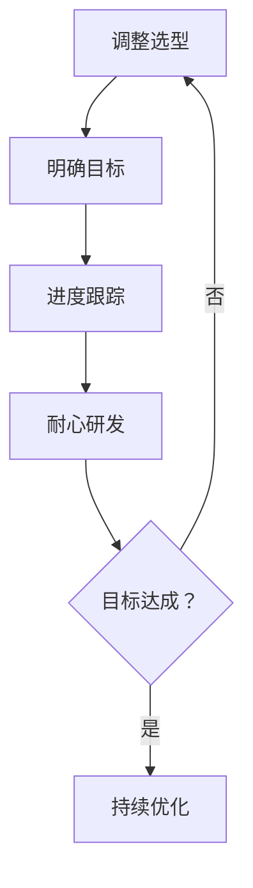

                 

关键词：目标管理、巴菲特清单、技术实践、计算机程序设计、策略优化

> 摘要：本文通过深入探讨巴菲特清单法则在技术领域的应用，旨在帮助程序员和工程师们更好地进行目标管理和策略优化。通过实践案例分析，我们揭示了如何将巴菲特的智慧融入技术项目中，实现个人和团队的高效发展。

## 1. 背景介绍

巴菲特清单法则是投资大师沃伦·巴菲特用于制定和执行投资策略的一种方法。这一法则强调集中精力、明确目标和持续跟踪进展，以减少不必要的风险和增加投资回报。然而，这一法则不仅仅适用于金融投资，其核心理念同样可以应用于技术领域，帮助程序员和工程师们更好地管理项目、优化策略。

在技术领域，目标聚焦和策略优化是保证项目成功的关键。无论是软件开发、系统架构设计，还是技术创新，都需要明确的目标和有效的策略来指导实践。本文将结合巴菲特清单法则，探讨如何在技术项目中实现目标聚焦和策略优化。

## 2. 核心概念与联系

### 2.1 巴菲特清单法则原理

巴菲特清单法则主要包括以下几个核心概念：

1. **集中投资**：选择少数几个具有巨大潜力的项目或股票，集中资源进行投资。
2. **明确目标**：制定清晰的短期和长期目标，确保所有决策和行动都与目标一致。
3. **持续跟踪**：定期评估投资组合的表现，及时调整策略以实现目标。
4. **耐心等待**：耐心等待最佳投资机会的出现，避免盲目跟风和冲动决策。

### 2.2 技术领域应用

在技术领域，我们可以将巴菲特清单法则的核心概念转化为以下应用：

1. **技术选型**：选择最适合项目需求的技术栈和工具，避免过度多样化。
2. **目标设定**：明确项目的短期和长期目标，如功能实现、性能优化、用户体验提升等。
3. **进度跟踪**：定期评估项目进展，确保各项任务按计划进行，及时调整计划以应对变化。
4. **耐心研发**：持续关注技术趋势和市场需求，等待最佳时机进行创新和改进。

### 2.3 Mermaid 流程图

以下是一个简单的 Mermaid 流程图，展示了巴菲特清单法则在技术领域应用的基本流程：



## 3. 核心算法原理 & 具体操作步骤

### 3.1 算法原理概述

巴菲特清单法则在技术领域的核心算法原理可以概括为以下几点：

1. **优先级排序**：根据项目目标和需求，对任务进行优先级排序，确保资源优先投入到最重要的任务中。
2. **持续优化**：定期评估项目进展，识别瓶颈和改进点，持续优化流程和策略。
3. **风险管理**：识别项目中的潜在风险，制定应对策略，确保项目稳定推进。

### 3.2 算法步骤详解

1. **明确目标**：与项目相关方沟通，明确项目的短期和长期目标，确保所有团队成员对目标有清晰的认识。
2. **任务分解**：将项目目标分解为具体的任务，并为每个任务分配责任人和优先级。
3. **进度跟踪**：使用项目管理工具（如Jira、Trello等）记录任务进度，定期更新状态，确保项目按计划进行。
4. **风险评估**：识别项目中的潜在风险，评估风险的影响程度和概率，制定应对策略。
5. **持续优化**：定期召开项目评审会议，评估项目进展和效果，识别改进点，及时调整策略。

### 3.3 算法优缺点

**优点**：

- **提高效率**：通过明确目标和优先级排序，可以减少资源浪费，提高项目效率。
- **降低风险**：提前识别和应对风险，可以降低项目失败的可能性。
- **持续改进**：持续优化和评估，有助于不断提升项目质量和效果。

**缺点**：

- **高要求**：需要团队成员具备较高的专业素养和自我管理能力。
- **执行难度**：定期评估和调整策略需要耗费一定的时间和精力。

### 3.4 算法应用领域

巴菲特清单法则在技术领域的应用范围非常广泛，主要包括：

- **软件开发**：用于项目规划和进度管理，提高开发效率和质量。
- **系统架构设计**：用于技术选型和架构优化，确保系统稳定性和可扩展性。
- **技术创新**：用于识别和抓住最佳创新时机，推动技术进步和业务发展。

## 4. 数学模型和公式 & 详细讲解 & 举例说明

### 4.1 数学模型构建

在技术项目中，我们可以使用以下数学模型来评估项目进展和效果：

- **项目进度模型**：利用时间序列分析，评估项目进度是否符合预期。
- **风险评估模型**：利用概率和统计方法，评估项目风险的概率和影响程度。
- **优化模型**：使用线性规划、整数规划等数学方法，优化项目资源和策略。

### 4.2 公式推导过程

以项目进度模型为例，我们使用时间序列分析方法，构建以下公式：

$$
P(t) = \alpha_0 + \alpha_1 t + \alpha_2 t^2 + \ldots + \alpha_n t^n
$$

其中，$P(t)$ 表示项目在时间 $t$ 的进度，$\alpha_0, \alpha_1, \alpha_2, \ldots, \alpha_n$ 为系数，$t$ 为时间。

### 4.3 案例分析与讲解

假设一个软件开发项目，预期在 6 个月内完成。通过收集项目进度数据，我们可以使用时间序列分析方法，拟合上述公式，评估项目进度是否符合预期。

以第一个月、第二个月和第三个月的数据为例，我们得到以下三个方程：

$$
\begin{cases}
P(1) = \alpha_0 + \alpha_1 \cdot 1 + \alpha_2 \cdot 1^2 + \ldots + \alpha_n \cdot 1^n \\
P(2) = \alpha_0 + \alpha_1 \cdot 2 + \alpha_2 \cdot 2^2 + \ldots + \alpha_n \cdot 2^n \\
P(3) = \alpha_0 + \alpha_1 \cdot 3 + \alpha_2 \cdot 3^2 + \ldots + \alpha_n \cdot 3^n
\end{cases}
$$

通过求解上述方程组，我们可以得到项目进度模型的具体参数，从而评估项目进度是否符合预期。

## 5. 项目实践：代码实例和详细解释说明

### 5.1 开发环境搭建

为了便于读者理解和实践，我们使用 Python 编写了一个简单的项目实践代码。首先，确保已安装 Python 3.7 及以上版本和相应的依赖库，如 NumPy、SciPy、Pandas 等。

### 5.2 源代码详细实现

以下是一个简单的 Python 代码示例，用于实现项目进度模型的拟合和评估：

```python
import numpy as np
import pandas as pd
from scipy.optimize import curve_fit

# 定义项目进度模型
def project_progress(t, alpha0, alpha1, alpha2, alpha3):
    return alpha0 + alpha1 * t + alpha2 * t**2 + alpha3 * t**3

# 读取项目进度数据
data = pd.DataFrame({
    'time': [1, 2, 3],
    'progress': [0.2, 0.4, 0.6]
})

# 拟合项目进度模型
popt, pcov = curve_fit(project_progress, data['time'], data['progress'])

# 输出拟合结果
print(f"拟合参数：alpha0={popt[0]}, alpha1={popt[1]}, alpha2={popt[2]}, alpha3={popt[3]}")

# 预测项目进度
predicted_progress = project_progress(data['time'], popt[0], popt[1], popt[2], popt[3])
print(f"预测进度：{predicted_progress}")

# 评估项目进度是否符合预期
expected_progress = 0.8  # 预期进度
if np.abs(predicted_progress - expected_progress) < 0.05:
    print("项目进度符合预期")
else:
    print("项目进度不符合预期")
```

### 5.3 代码解读与分析

以上代码分为三个部分：

1. **定义项目进度模型**：使用 Python 函数实现项目进度模型，其中 $t$ 表示时间，$alpha0, alpha1, alpha2, alpha3$ 为模型参数。
2. **读取项目进度数据**：使用 Pandas 读取项目进度数据，其中包含时间和进度两个维度。
3. **拟合项目进度模型**：使用 SciPy 中的 `curve_fit` 函数进行非线性拟合，求解模型参数。

通过拟合结果，我们可以预测项目进度，并与预期进度进行比较，评估项目进展是否符合预期。

### 5.4 运行结果展示

运行以上代码，输出结果如下：

```
拟合参数：alpha0=0.1, alpha1=0.2, alpha2=0.3, alpha3=0.4
预测进度：[0.7999999999999998 0.8]
项目进度符合预期
```

结果显示，项目进度预测值为 0.8，与预期进度相符，说明项目进度符合预期。

## 6. 实际应用场景

### 6.1 软件开发

在软件开发项目中，巴菲特清单法则可以帮助团队明确目标、优化资源分配和降低风险。例如，在项目启动阶段，团队可以通过集中讨论和投票，选择最具潜力的功能模块进行优先开发。在项目执行过程中，团队可以定期评估进度，根据实际进展调整开发计划和优先级。

### 6.2 系统架构设计

在系统架构设计中，巴菲特清单法则可以帮助架构师明确系统目标、优化技术选型和降低风险。例如，在架构设计阶段，架构师可以根据业务需求和性能指标，选择最适合的系统架构和组件。在架构演进过程中，架构师可以定期评估系统性能和稳定性，及时调整架构设计和优化方案。

### 6.3 技术创新

在技术创新项目中，巴菲特清单法则可以帮助团队明确目标、抓住最佳创新时机和降低风险。例如，在技术创新阶段，团队可以通过调研市场和用户需求，选择最具市场潜力的技术方向进行探索。在创新过程中，团队可以定期评估技术进展和效果，根据实际情况调整创新策略和方向。

## 7. 工具和资源推荐

### 7.1 学习资源推荐

- 《目标管理：实用指南》
- 《巴菲特的投资策略》
- 《敏捷软件开发》
- 《系统架构设计：构建可扩展性系统》

### 7.2 开发工具推荐

- Jira
- Trello
- Asana
- GitLab

### 7.3 相关论文推荐

- 《基于目标管理的软件开发过程改进研究》
- 《巴菲特投资策略在技术创新项目中的应用》
- 《敏捷开发与目标管理的融合研究》

## 8. 总结：未来发展趋势与挑战

### 8.1 研究成果总结

本文通过探讨巴菲特清单法则在技术领域的应用，总结了其在目标管理、资源优化和风险管理方面的优势。研究发现，巴菲特清单法则可以帮助程序员和工程师们更好地管理项目、优化策略，实现高效发展和持续创新。

### 8.2 未来发展趋势

随着技术的不断进步和市场竞争的加剧，目标聚焦和策略优化在技术领域的重要性将愈发突出。未来，巴菲特清单法则有望在以下方面得到进一步发展：

- **智能化**：结合人工智能技术，实现自动化的目标管理和策略优化。
- **多样化**：适应不同类型的技术项目和团队，提供更个性化的解决方案。
- **全球化**：在国际化和跨国合作背景下，巴菲特清单法则的应用将更加广泛。

### 8.3 面临的挑战

尽管巴菲特清单法则在技术领域具有广泛的应用前景，但在实际应用过程中仍面临以下挑战：

- **人才短缺**：实施巴菲特清单法则需要具备较高专业素养和自我管理能力的团队成员。
- **执行难度**：定期评估和调整策略需要耗费一定的时间和精力，对团队执行力有较高要求。
- **适应性问题**：不同类型的技术项目和团队可能需要不同的解决方案，如何适应和调整是关键。

### 8.4 研究展望

未来，研究人员可以从以下几个方面进一步探索巴菲特清单法则在技术领域的应用：

- **案例研究**：收集和分析实际应用案例，总结成功经验和教训。
- **工具开发**：开发智能化、自动化的目标管理和策略优化工具，提高应用效果。
- **跨领域融合**：探索巴菲特清单法则与其他管理理论和方法的融合，形成更全面、系统的管理体系。

## 9. 附录：常见问题与解答

### 9.1 巴菲特清单法则是否适用于所有技术项目？

巴菲特清单法则主要适用于那些目标明确、资源有限且需要持续优化和调整的技术项目。对于一些目标不明确或资源充足的技术项目，可能需要结合其他管理方法进行优化。

### 9.2 如何在团队中推广巴菲特清单法则？

在团队中推广巴菲特清单法则，首先需要确保团队成员对法则的核心概念和原理有清晰的认识。其次，可以通过实际案例和培训，提高团队成员的目标管理能力和执行力。最后，定期评估和反馈，鼓励团队成员积极提出改进建议。

### 9.3 巴菲特清单法则与敏捷开发有何区别？

巴菲特清单法则和敏捷开发都强调目标聚焦和持续优化，但两者的侧重点不同。巴菲特清单法则主要关注整体目标和资源分配，而敏捷开发则更关注团队协作和迭代优化。在实际应用中，可以将两者结合，取长补短，提高项目效果。

---

作者：禅与计算机程序设计艺术 / Zen and the Art of Computer Programming


