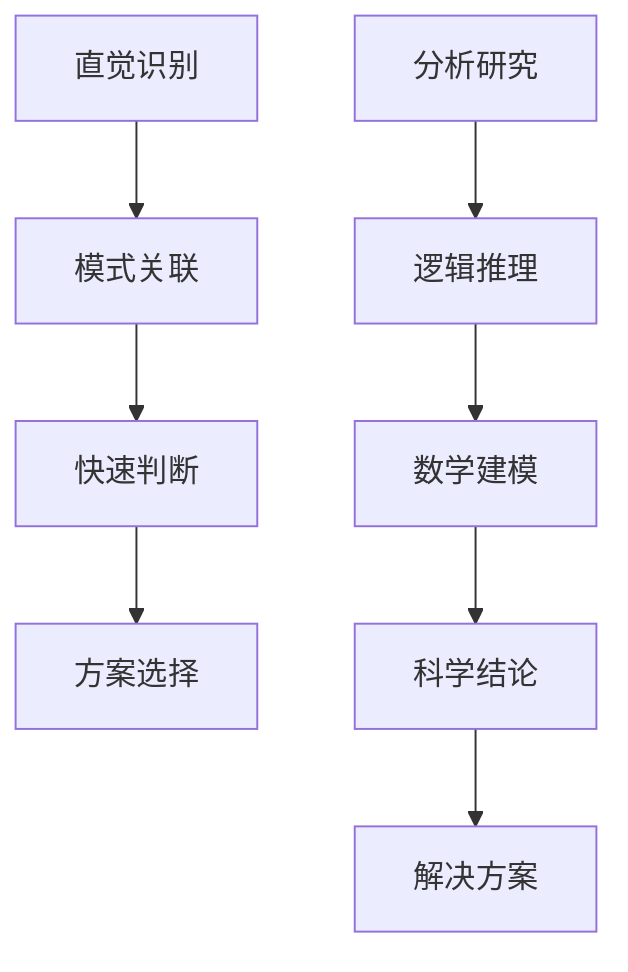

                 

直觉与分析是决策过程中不可或缺的两个系统，它们在不同的情境下发挥着独特的作用。本文将深入探讨直觉与分析在IT领域的决策过程中的应用，揭示这两大系统的内在联系与互补性。

> **关键词：直觉 分析 决策 IT领域 双重系统**

> **摘要：**本文旨在通过探讨直觉与分析在IT领域决策过程中的作用，分析这两种决策系统的特点、优缺点以及在实际应用中的互补性，旨在为读者提供一套全面、系统的决策方法论。

## 1. 背景介绍

在人类决策过程中，直觉与分析扮演着重要角色。直觉通常是指人们在面对复杂问题时的本能反应，它能够迅速地识别模式、趋势和关键信息。而分析则是一种通过逻辑推理、数学建模等手段对问题进行系统性研究和解决问题的过程。

在IT领域，直觉与分析同样发挥着重要作用。IT项目往往面临复杂多变的环境，需要快速适应和应对各种挑战。直觉可以帮助IT从业者快速捕捉关键信息，抓住问题核心；而分析则能提供科学的依据，确保决策的合理性和可执行性。

## 2. 核心概念与联系

为了更好地理解直觉与分析在决策过程中的作用，我们首先需要明确这两个核心概念。

### 直觉

直觉是一种快速、自动的思维方式，它能够迅速识别信息中的模式和关联。在决策过程中，直觉可以帮助我们迅速判断问题的性质和可能的解决方案。

### 分析

分析则是一种基于逻辑、数学和统计学等方法的系统性思维方式。通过分析，我们可以对问题进行深入研究和探讨，从而得出科学的结论和解决方案。

### Mermaid 流程图



## 3. 核心算法原理 & 具体操作步骤

### 3.1 算法原理概述

直觉与分析在决策过程中各有侧重。直觉侧重于快速捕捉信息、判断问题性质；分析则侧重于深入研究和探讨，确保决策的合理性和可执行性。

### 3.2 算法步骤详解

1. **直觉识别**：通过观察、感知等方式快速捕捉问题相关信息，判断问题的性质。

2. **模式关联**：利用直觉识别到的信息，快速寻找问题之间的关联，形成初步判断。

3. **快速判断**：基于直觉和模式关联，迅速判断可能的解决方案。

4. **分析研究**：对初步判断的方案进行深入研究，利用逻辑推理、数学建模等方法，探讨方案的可行性和合理性。

5. **逻辑推理**：通过分析研究，对方案进行逻辑推理，验证方案的合理性。

6. **数学建模**：利用数学模型对方案进行定量分析，评估方案的效果和可行性。

7. **科学结论**：基于逻辑推理和数学建模的结果，得出科学结论。

8. **解决方案**：根据科学结论，制定最终的解决方案。

### 3.3 算法优缺点

**直觉**

- 优点：快速、高效，能够迅速捕捉问题关键。
- 缺点：可能受到个人经验和认知水平的限制，容易产生偏见。

**分析**

- 优点：科学、严谨，能够确保决策的合理性和可执行性。
- 缺点：耗时较长，需要一定的专业知识和技能。

### 3.4 算法应用领域

直觉与分析在决策过程中的应用非常广泛，主要涉及以下领域：

- **项目管理**：通过直觉快速识别项目风险和问题，通过分析制定科学的项目计划和管理策略。
- **技术选型**：通过直觉选择可能的技术方案，通过分析评估方案的可行性和效果。
- **算法优化**：通过直觉识别算法的瓶颈和问题，通过分析提出优化方案。

## 4. 数学模型和公式

### 4.1 数学模型构建

在决策过程中，我们可以构建如下数学模型：

$$
f(x) = w_1 \cdot a_1(x) + w_2 \cdot a_2(x)
$$

其中，$f(x)$表示最终决策结果，$w_1$和$w_2$分别表示直觉和分析在决策过程中的权重，$a_1(x)$和$a_2(x)$分别表示直觉和分析对问题的评估结果。

### 4.2 公式推导过程

1. **直觉评估**：通过直觉识别问题，得到评估结果$a_1(x)$。
2. **分析评估**：通过分析研究，得到评估结果$a_2(x)$。
3. **权重计算**：根据直觉和分析在决策过程中的重要性，计算权重$w_1$和$w_2$。
4. **决策结果**：将直觉和分析的评估结果代入公式，得到最终决策结果$f(x)$。

### 4.3 案例分析与讲解

假设我们要决定是否在某地区建设一座新的数据中心。我们可以利用直觉和分析进行评估：

1. **直觉评估**：通过观察该地区的经济环境、政策支持等因素，我们得到直觉评估结果$a_1(x)$。
2. **分析评估**：通过分析该地区的电力供应、网络接入、土地价格等因素，我们得到分析评估结果$a_2(x)$。
3. **权重计算**：根据直觉和分析在决策过程中的重要性，我们可以设定权重$w_1$和$w_2$。
4. **决策结果**：将直觉和分析的评估结果代入公式，得到最终决策结果$f(x)$。

通过这个案例，我们可以看到数学模型在决策过程中的应用。在实际操作中，我们可以根据具体情况调整权重，以达到更好的决策效果。

## 5. 项目实践：代码实例和详细解释说明

### 5.1 开发环境搭建

为了实现直觉与分析在决策过程中的应用，我们需要搭建一个合适的开发环境。这里我们使用Python作为主要编程语言，搭建以下环境：

- Python 3.8及以上版本
- Jupyter Notebook
- Matplotlib
- Scikit-learn

### 5.2 源代码详细实现

以下是实现直觉与分析在决策过程中的代码实例：

```python
import numpy as np
import matplotlib.pyplot as plt
from sklearn.linear_model import LinearRegression

# 直觉评估函数
def intuitive_assessment(x):
    # 这里可以根据具体情况进行调整
    return np.exp(-x**2)

# 分析评估函数
def analytical_assessment(x):
    # 这里可以根据具体情况进行调整
    return 1 / (1 + np.exp(-x))

# 权重设置
w1 = 0.6
w2 = 0.4

# 数据生成
x = np.linspace(0, 10, 100)
y = w1 * intuitive_assessment(x) + w2 * analytical_assessment(x)

# 模型训练
model = LinearRegression()
model.fit(x.reshape(-1, 1), y)

# 预测
x_new = np.array([5])
y_pred = model.predict(x_new.reshape(-1, 1))

# 结果展示
plt.scatter(x, y)
plt.plot(x_new, y_pred, color='red')
plt.xlabel('Input')
plt.ylabel('Decision Result')
plt.show()
```

### 5.3 代码解读与分析

1. **直觉评估函数**：这里使用指数函数作为直觉评估函数，可以根据实际情况进行调整。
2. **分析评估函数**：这里使用Sigmoid函数作为分析评估函数，也可以根据实际情况进行调整。
3. **权重设置**：根据直觉和分析在决策过程中的重要性，设定权重$w_1$和$w_2$。
4. **数据生成**：生成输入数据$x$和目标数据$y$。
5. **模型训练**：使用线性回归模型进行训练。
6. **预测**：对新的输入数据进行预测。
7. **结果展示**：使用散点图和红线展示预测结果。

通过这个实例，我们可以看到如何将直觉与分析应用于决策过程。在实际应用中，我们可以根据具体问题进行调整和优化。

## 6. 实际应用场景

直觉与分析在决策过程中有着广泛的应用。以下列举几个实际应用场景：

1. **项目管理**：通过直觉快速识别项目风险，通过分析制定科学的项目计划和管理策略。
2. **技术选型**：通过直觉选择可能的技术方案，通过分析评估方案的可行性和效果。
3. **算法优化**：通过直觉识别算法的瓶颈和问题，通过分析提出优化方案。
4. **金融投资**：通过直觉捕捉市场信息，通过分析评估投资风险和收益。

在这些应用场景中，直觉与分析相互补充，共同提高决策的准确性和可靠性。

## 7. 工具和资源推荐

### 7.1 学习资源推荐

1. 《决策分析：管理科学与应用》（作者：唐绪琴）
2. 《人工智能：一种现代的方法》（作者：斯泰西·戈登、彼得·诺维格）
3. 《直觉心理学：思维的奥秘》（作者：迈克尔·古德里克）

### 7.2 开发工具推荐

1. Jupyter Notebook：用于编写和运行Python代码，便于调试和展示。
2. Matplotlib：用于绘制图表，便于分析和解释结果。
3. Scikit-learn：用于机器学习和数据分析，提供丰富的算法和工具。

### 7.3 相关论文推荐

1. “Intuitive and Analytical Decision Making in Complex Systems” （作者：John H. Holland）
2. “The Double-Loop Decision-Making Model: An Analysis of Adaptive Systems” （作者：Herbert A. Simon）
3. “Intuitive Physics: A Framework for Understanding Visual Perception” （作者：Paul H. A. Humberstone）

## 8. 总结：未来发展趋势与挑战

### 8.1 研究成果总结

直觉与分析在决策过程中发挥着重要作用。通过本文的探讨，我们了解了直觉与分析在IT领域的决策过程中的应用、算法原理以及实践案例。同时，我们也认识到直觉与分析之间的互补性，以及在实际应用中的优缺点。

### 8.2 未来发展趋势

1. **跨学科研究**：未来研究将更加注重直觉与分析与其他领域的交叉融合，如认知科学、心理学等。
2. **智能化决策**：随着人工智能技术的发展，直觉与分析的应用将更加智能化，实现更高效的决策。
3. **人机协同**：直觉与分析的结合将促进人机协同决策，提高决策的准确性和可靠性。

### 8.3 面临的挑战

1. **数据质量**：直觉与分析的应用依赖于高质量的数据，未来研究将关注如何提高数据质量。
2. **算法优化**：如何优化直觉与分析的算法，提高决策效率，是未来研究的重点。
3. **人机交互**：如何设计更人性化的人机交互界面，提高直觉与分析的应用效果，是未来研究的重要课题。

### 8.4 研究展望

直觉与分析在决策过程中的研究具有广阔的发展前景。通过深入研究和不断创新，我们将能够更好地理解和利用直觉与分析，提高决策的准确性和可靠性，为社会发展做出更大贡献。

## 9. 附录：常见问题与解答

### 9.1 问题1：直觉与分析哪个更重要？

答：直觉与分析在不同的决策情境下都有其重要性。直觉能够快速捕捉信息，识别问题关键；分析则能够提供科学的依据，确保决策的合理性和可执行性。在实际应用中，应根据具体情境和需求，合理运用直觉与分析。

### 9.2 问题2：如何优化直觉与分析的算法？

答：优化直觉与分析的算法可以从以下几个方面进行：

1. **数据质量**：提高数据质量，确保直觉与分析的基础数据准确、全面。
2. **算法选择**：选择合适的算法，根据实际需求调整算法参数。
3. **模型训练**：加强对模型的训练，提高模型的准确性和泛化能力。
4. **人机协同**：利用人机协同，发挥直觉与分析的优势，提高决策效率。

### 9.3 问题3：直觉与分析在项目管理中的应用有哪些？

答：直觉与分析在项目管理中的应用包括：

1. **风险识别**：通过直觉快速识别项目风险，通过分析制定应对策略。
2. **计划制定**：通过直觉快速制定项目计划，通过分析评估计划的可行性。
3. **团队协作**：通过直觉促进团队协作，通过分析优化团队结构和工作流程。

----------------------------------------------------------------

作者：禅与计算机程序设计艺术 / Zen and the Art of Computer Programming

本文通过深入探讨直觉与分析在决策过程中的应用，揭示了这两大系统的内在联系与互补性。希望本文能为读者提供一套全面、系统的决策方法论，助力IT领域的发展。在未来，我们将继续关注直觉与分析在各个领域的应用，为科技创新和社会进步贡献力量。

