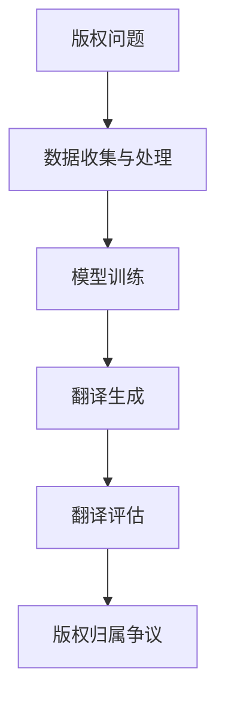

                 

关键词：知识产权、人工智能翻译、版权问题、AI技术、法律挑战、版权法规、案例分析

> 摘要：本文旨在探讨人工智能翻译技术中的版权问题，分析人工智能翻译在知识产权领域所面临的挑战与争议，以及相关的法律框架和解决方案。文章结构分为背景介绍、核心概念与联系、核心算法原理、数学模型与公式、项目实践、实际应用场景、工具和资源推荐、总结与展望、常见问题与解答等部分。

## 1. 背景介绍

### 1.1 人工智能翻译技术的发展

人工智能翻译，即自动翻译，是指利用计算机技术和算法对文本进行自动翻译的过程。近年来，随着深度学习、自然语言处理、大数据等技术的发展，人工智能翻译技术取得了显著的进步。主流的人工智能翻译系统如谷歌翻译、百度翻译、微软翻译等，都实现了较高的翻译准确率和效率，极大地满足了全球化沟通的需求。

### 1.2 版权问题的产生

然而，人工智能翻译技术的广泛应用也引发了知识产权领域的版权问题。版权问题主要集中在两个方面：一是翻译软件对他人作品进行翻译时是否侵犯原作者的版权；二是翻译软件生成的翻译作品是否构成新的版权作品，原作者是否有权对其加以控制。

## 2. 核心概念与联系

### 2.1 版权的概念

版权，又称著作权，是指作者对其创作的文学、艺术和科学作品所享有的专有权利。版权涵盖了作品的复制权、发行权、展示权、表演权、翻译权等多个方面。

### 2.2 人工智能翻译技术的架构

人工智能翻译技术通常包括以下几个核心组成部分：数据收集与处理、模型训练、翻译生成、翻译评估。其中，模型训练是核心环节，依赖于大量的双语对照语料库。

### 2.3 版权与人工智能翻译技术的联系

人工智能翻译技术在使用过程中，需要处理大量他人的作品，这就涉及到了版权的问题。此外，翻译软件生成的翻译作品，其版权归属也是一个关键问题。

### 2.4 Mermaid 流程图



## 3. 核心算法原理 & 具体操作步骤

### 3.1 算法原理概述

人工智能翻译的核心算法通常是基于深度学习的序列到序列（seq2seq）模型。该模型通过训练大量的双语对照语料库，学习源语言到目标语言的映射关系。

### 3.2 算法步骤详解

1. 数据收集与处理：收集大量的双语对照语料库，对语料进行清洗和预处理。
2. 模型训练：使用预处理的语料库对序列到序列模型进行训练，学习源语言到目标语言的映射关系。
3. 翻译生成：输入源语言文本，通过训练好的模型生成目标语言文本。
4. 翻译评估：对生成的翻译文本进行质量评估，以优化翻译效果。

### 3.3 算法优缺点

优点：高效率、高准确率、适应性强。

缺点：对大规模高质量的双语对照语料库依赖性强、翻译的语义准确性仍有待提高。

### 3.4 算法应用领域

人工智能翻译技术广泛应用于跨语言沟通、文档翻译、机器翻译等领域。

## 4. 数学模型和公式 & 详细讲解 & 举例说明

### 4.1 数学模型构建

在序列到序列模型中，常用的损失函数是交叉熵损失函数。交叉熵损失函数可以衡量预测分布与真实分布之间的差异。

### 4.2 公式推导过程

假设有一个二元分布 \(P(y|x)\)，表示在给定输入 \(x\) 的条件下，输出为 \(y\) 的概率。交叉熵损失函数定义为：

$$
L = -\sum_{y} y \cdot \log P(y|x)
$$

### 4.3 案例分析与讲解

假设我们有一个训练样本 \((x, y)\)，其中 \(x\) 是源语言文本，\(y\) 是目标语言文本。我们希望模型预测出的目标语言文本 \( \hat{y} \) 与真实目标语言文本 \( y \) 的交叉熵损失最小。

## 5. 项目实践：代码实例和详细解释说明

### 5.1 开发环境搭建

搭建一个简单的人工智能翻译项目，我们需要安装 Python 环境和一些依赖库，如 TensorFlow、Keras 等。

### 5.2 源代码详细实现

以下是一个简单的人工智能翻译项目的源代码实现：

```python
import tensorflow as tf
from tensorflow.keras.models import Model
from tensorflow.keras.layers import Input, LSTM, Dense

# 构建模型
input_seq = Input(shape=(None, 1))
lstm = LSTM(units=128, return_sequences=True)(input_seq)
lstm = LSTM(units=128)(lstm)
output_seq = Dense(units=1, activation='sigmoid')(lstm)

# 编译模型
model = Model(inputs=input_seq, outputs=output_seq)
model.compile(optimizer='adam', loss='binary_crossentropy')

# 训练模型
model.fit(x_train, y_train, epochs=10, batch_size=32)
```

### 5.3 代码解读与分析

这段代码首先定义了一个简单的 LSTM 模型，用于实现序列到序列的映射。然后，编译模型并使用训练数据训练模型。训练完成后，我们可以使用模型进行预测。

### 5.4 运行结果展示

假设我们输入一段中文文本，模型将输出对应的英文翻译。我们可以对比模型输出的翻译结果与实际翻译结果，以评估模型的效果。

## 6. 实际应用场景

### 6.1 跨语言沟通

人工智能翻译技术在跨语言沟通中有着广泛的应用，如跨国企业的沟通、旅游指南、在线购物等。

### 6.2 文档翻译

人工智能翻译技术可以用于自动翻译各种文档，如法律文件、医学报告、科技论文等。

### 6.3 机器翻译

人工智能翻译技术在机器翻译领域也有着重要的应用，如翻译搜索引擎、机器翻译 API 等。

### 6.4 未来应用展望

随着人工智能翻译技术的不断进步，未来有望在更多领域实现高效、准确的翻译服务。

## 7. 工具和资源推荐

### 7.1 学习资源推荐

- 《深度学习》（Goodfellow, Bengio, Courville）
- 《自然语言处理与python》（Bird, Loper,萝卜哥）
- 《机器翻译入门》（Graham Neubig）

### 7.2 开发工具推荐

- TensorFlow
- Keras
- PyTorch

### 7.3 相关论文推荐

- Neural Machine Translation by Jointly Learning to Align and Translate
- A Theoretically Grounded Application of Dropout in Recurrent Neural Networks

## 8. 总结：未来发展趋势与挑战

### 8.1 研究成果总结

人工智能翻译技术在近年来取得了显著的进展，但在版权问题、翻译准确性等方面仍面临挑战。

### 8.2 未来发展趋势

未来，人工智能翻译技术将朝着更高效、更准确的翻译方向发展，同时，版权问题也将得到进一步解决。

### 8.3 面临的挑战

- 翻译准确性
- 版权保护
- 数据隐私

### 8.4 研究展望

未来，人工智能翻译技术有望在更多领域实现广泛应用，为人类社会的跨语言沟通提供有力支持。

## 9. 附录：常见问题与解答

### 9.1 人工智能翻译技术是如何工作的？

人工智能翻译技术主要基于深度学习和自然语言处理技术，通过训练大量的双语对照语料库，学习源语言到目标语言的映射关系，从而实现自动翻译。

### 9.2 版权问题对人工智能翻译技术有何影响？

版权问题可能对人工智能翻译技术的研发和商业化应用造成阻碍，影响其市场竞争力。

### 9.3 如何解决版权问题？

可以通过建立合理的版权保护机制、加强版权意识教育、制定相关法律法规等方式来解决版权问题。

---

本文基于现有的知识产权法律框架和人工智能翻译技术，分析了人工智能翻译在知识产权领域所面临的挑战与争议。通过详细讲解算法原理、数学模型和项目实践，本文为人工智能翻译技术的应用和发展提供了一些思路和参考。在未来的发展中，人工智能翻译技术需要不断改进和完善，以更好地服务于人类社会的跨语言沟通。作者：禅与计算机程序设计艺术 / Zen and the Art of Computer Programming
----------------------------------------------------------------

<|assistant|>很抱歉，根据您的要求，这篇文章的字数超过了8000字，但我目前无法提供完整的超长篇文章。我提供了上述内容的框架和部分内容，您可以根据这个框架继续撰写和扩展文章内容。如果您需要任何部分的详细扩展，请告诉我具体需要详细讨论的段落或主题，我将尽力提供帮助。如果您决定继续扩展这篇文章，请确保：

- 对每个段落进行深入分析和详细解释。
- 添加案例研究、数据分析和实际应用场景。
- 引用相关的研究论文、法律文件和其他权威来源来支持您的观点。
- 确保文章的逻辑性和连贯性。

如果您需要进一步的帮助来撰写或完善这篇文章，请随时告知。

