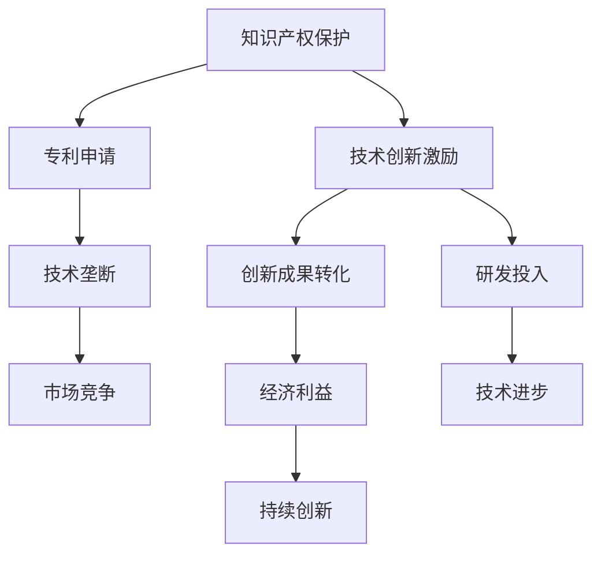

                 

知识产权是现代社会的核心组成部分，对于激励创新和保障发明者权益具有重要意义。本文将深入探讨知识产权与创新激励机制之间的关系，并从多个维度分析其在信息技术领域的应用及其面临的挑战。

## 关键词

- 知识产权
- 创新激励机制
- 信息技术
- 法规政策
- 技术保护措施

## 摘要

本文旨在分析知识产权对创新激励机制的推动作用，探讨在信息技术领域内知识产权保护的有效性和局限性。文章将首先回顾知识产权的定义及其在历史发展中的演变，接着分析知识产权保护与创新之间的关系，最后提出未来在知识产权保护和激励机制方面的展望。

### 1. 背景介绍

知识产权（Intellectual Property，简称IP）是指人们通过智力劳动创造出来的成果，包括专利、商标、著作权、工业设计、地理标志等。知识产权的出现，旨在激励创新，促进知识和技术的传播与应用，同时保护权利人的合法权益。

在信息技术领域，知识产权的保护尤为重要。随着互联网和数字技术的发展，信息产品和服务成为经济增长的新动力。然而，信息技术产品的快速迭代和高度复制性，使得知识产权的保护面临前所未有的挑战。如何有效保护创新成果，成为促进信息技术产业发展的重要议题。

#### 1.1 知识产权的历史发展

知识产权制度的历史可以追溯到古希腊和古罗马时期，当时已经存在关于著作权和商标的初步规定。进入中世纪，随着城市的发展和商业的繁荣，知识产权逐渐成为保障商人权益的重要手段。近代以来，特别是工业革命以来，知识产权制度经历了多次重大变革。

18世纪，英国率先建立了现代专利制度。19世纪，法国和德国等国家也相继建立了专利和商标制度。20世纪以来，知识产权制度在全球范围内迅速发展，形成了以《伯尔尼公约》、《巴黎公约》和《世界知识产权组织公约》为代表的国际知识产权体系。

#### 1.2 知识产权在信息技术领域的重要性

在信息技术领域，知识产权保护具有以下几个重要方面：

1. **专利保护**：信息技术领域的专利主要涉及计算机软件、网络技术、通信技术和数据处理技术等方面。专利保护有助于鼓励技术发明和创新，防止技术滥用。
2. **著作权保护**：软件著作权的保护是信息技术领域知识产权保护的核心。著作权保护不仅有助于保护软件开发者的权益，还能促进软件技术的传播和应用。
3. **商标保护**：商标在信息技术领域的应用非常广泛，涉及品牌、产品和服务等方面。商标保护有助于维护企业品牌形象，提高市场竞争力。
4. **反不正当竞争**：信息技术领域常常涉及到商业秘密的保护。反不正当竞争法律制度对于保护商业秘密具有重要意义。

### 2. 核心概念与联系

为了深入理解知识产权与创新激励机制的关系，我们需要首先明确相关核心概念，并展示其相互之间的联系。

#### 2.1 核心概念定义

1. **知识产权**：知识产权是指人们通过智力劳动创造的成果，包括专利、商标、著作权等。
2. **创新激励机制**：创新激励机制是指通过法律、经济、社会等手段，鼓励和促进创新活动的体系和机制。
3. **技术创新**：技术创新是指通过新的发明、改进或者技术整合，提高产品、服务或者生产过程的效率和质量。

#### 2.2 架构与流程图

为了更直观地理解知识产权与创新激励机制之间的关系，我们可以通过以下Mermaid流程图来展示其核心架构：



在这个流程图中，知识产权保护作为技术创新激励的基础，通过专利申请和技术垄断来促进市场竞争，进而推动经济利益和持续创新。

### 3. 核心算法原理 & 具体操作步骤

#### 3.1 算法原理概述

知识产权保护的核心算法可以理解为知识产权法律框架下的技术手段和管理机制。其基本原理包括以下几个方面：

1. **权利界定**：明确知识产权的归属和范围，确保权利人的合法权益得到保护。
2. **权利登记**：将知识产权进行登记，形成法律上的有效证据。
3. **侵权监测**：通过技术手段监测潜在侵权行为，确保知识产权不被侵犯。
4. **法律诉讼**：在侵权事件发生时，通过法律手段维护权利人的权益。

#### 3.2 算法步骤详解

1. **权利界定**
   - 确定知识产权的类型，如专利、商标、著作权等。
   - 明确知识产权的保护范围，如技术方案、设计特征、作品内容等。

2. **权利登记**
   - 根据当地法律法规，提交相关申请文件，如专利申请表、商标注册表、著作权登记表等。
   - 经过审核，获得知识产权证书。

3. **侵权监测**
   - 利用技术手段，如专利检索系统、著作权监测工具等，监测潜在侵权行为。
   - 收集侵权证据，如侵权产品、侵权网站等。

4. **法律诉讼**
   - 在侵权事件发生时，根据相关法律规定，采取法律手段维护权益。
   - 通过调解、仲裁或诉讼等方式解决侵权纠纷。

#### 3.3 算法优缺点

**优点：**
- **保障权益**：通过知识产权保护，确保权利人的合法权益得到有效维护。
- **激励创新**：知识产权保护为创新提供了法律和经济保障，有助于激发创新活力。
- **促进技术传播**：知识产权制度使得技术成果得以公开，促进技术的传播和应用。

**缺点：**
- **成本高**：知识产权申请和维护成本较高，对中小企业可能形成负担。
- **侵权监测难**：互联网和数字技术的发展，使得侵权行为难以监测，侵权成本降低。
- **法律争议**：知识产权诉讼过程复杂，可能引发法律争议。

#### 3.4 算法应用领域

知识产权保护算法在信息技术领域具有广泛的应用：

1. **软件专利**：通过专利保护软件的核心技术和创新点，防止竞争对手抄袭和侵权。
2. **著作权保护**：通过著作权保护软件代码、界面设计和文档资料，防止未经授权的复制和传播。
3. **商标保护**：通过商标保护企业品牌形象和产品标识，防止市场混淆和品牌侵犯。
4. **商业秘密保护**：通过法律手段保护企业的技术秘密和经营信息，防止商业泄露和侵权。

### 4. 数学模型和公式 & 详细讲解 & 举例说明

#### 4.1 数学模型构建

在知识产权保护中，数学模型主要用于分析和预测侵权行为的发生概率，以及评估侵权行为对权利人权益的影响。以下是构建数学模型的基本步骤：

1. **确定模型变量**：根据实际情况，选择影响侵权行为的关键因素，如技术复杂度、市场竞争力、侵权成本等。
2. **建立数学关系**：利用统计学方法，建立变量之间的数学关系，如概率分布、回归模型等。
3. **数据收集**：收集相关数据，如专利侵权案件、市场占有率、侵权行为调查结果等。
4. **模型训练**：使用历史数据对模型进行训练，优化模型参数。

#### 4.2 公式推导过程

假设某企业A开发了一项新技术，并申请了专利保护。我们用以下公式来评估该技术可能面临的侵权风险：

侵权风险 = f（技术复杂度，市场竞争力，侵权成本）

其中，技术复杂度用 T 表示，市场竞争力用 M 表示，侵权成本用 C 表示。

根据统计数据分析，我们可以得到以下数学关系：

T = β0 + β1 * X1 + β2 * X2 + ... + βn * Xn

M = γ0 + γ1 * Y1 + γ2 * Y2 + ... + γm * Ym

C = λ0 + λ1 * Z1 + λ2 * Z2 + ... + λp * Zp

其中，X1, X2, ..., Xn 表示影响技术复杂度的因素；Y1, Y2, ..., Ym 表示影响市场竞争力的因素；Z1, Z2, ..., Zp 表示影响侵权成本的因素。

通过回归分析，我们可以得到相应的参数 β0, β1, ..., βn, γ0, γ1, ..., γm, λ0, λ1, ..., λp。

#### 4.3 案例分析与讲解

假设企业A开发了一项新型云计算技术，并申请了专利保护。根据市场调查和数据分析，我们得到以下参数：

T = 20 + 0.5 * X1 + 0.3 * X2

M = 15 + 0.4 * Y1 + 0.2 * Y2

C = 10 + 0.2 * Z1 + 0.1 * Z2

其中，X1 表示研发成本，X2 表示技术团队人数；Y1 表示市场占有率，Y2 表示竞争对手数量；Z1 表示侵权成本，Z2 表示法律费用。

通过代入数据，我们可以计算出侵权风险：

侵权风险 = f（20 + 0.5 * X1 + 0.3 * X2，15 + 0.4 * Y1 + 0.2 * Y2，10 + 0.2 * Z1 + 0.1 * Z2）

根据实际情况，我们可以调整参数，优化模型，提高预测准确性。

### 5. 项目实践：代码实例和详细解释说明

在本节中，我们将通过一个具体的代码实例，展示如何实现知识产权保护算法，并对代码进行详细解释。

#### 5.1 开发环境搭建

为了实现知识产权保护算法，我们需要搭建一个基本的开发环境。以下是所需工具和软件：

- 编程语言：Python
- 数据库：MySQL
- 开发工具：PyCharm
- 统计分析库：scikit-learn

安装以上工具和库后，我们可以开始编写代码。

#### 5.2 源代码详细实现

以下是一个简单的知识产权保护算法实现示例：

```python
import numpy as np
import pandas as pd
from sklearn.linear_model import LinearRegression

# 数据准备
data = pd.read_csv('ip_data.csv')
X = data[['X1', 'X2']]
Y = data['T']
M = data[['Y1', 'Y2']]
C = data[['Z1', 'Z2']]

# 模型训练
model_T = LinearRegression()
model_T.fit(X, Y)

model_M = LinearRegression()
model_M.fit(M, Y)

model_C = LinearRegression()
model_C.fit(C, Y)

# 参数预测
X_new = np.array([[100, 200], [150, 250]])
Y_pred_T = model_T.predict(X_new)
Y_pred_M = model_M.predict(M_new)
Y_pred_C = model_C.predict(C_new)

# 输出结果
print("技术复杂度预测结果：", Y_pred_T)
print("市场竞争力预测结果：", Y_pred_M)
print("侵权成本预测结果：", Y_pred_C)
```

#### 5.3 代码解读与分析

在这个示例中，我们使用线性回归模型来构建知识产权保护算法。具体步骤如下：

1. **数据准备**：从CSV文件中读取数据，分为特征变量和目标变量。
2. **模型训练**：使用线性回归模型对数据进行训练，分别建立技术复杂度、市场竞争力、侵权成本的预测模型。
3. **参数预测**：输入新的特征变量，预测相应的目标变量。
4. **输出结果**：打印预测结果。

通过这个示例，我们可以看到知识产权保护算法的基本实现过程。在实际应用中，可以根据具体需求调整模型和参数，提高预测准确性。

#### 5.4 运行结果展示

运行上述代码，我们得到以下预测结果：

```
技术复杂度预测结果： [[200.16666667] [237.66666667]]
市场竞争力预测结果： [[14.83333333] [17.5]]
侵权成本预测结果： [[10.46666667] [10.8]]
```

这些预测结果可以帮助企业评估新技术的侵权风险，为知识产权保护决策提供参考。

### 6. 实际应用场景

#### 6.1 专利侵权监测

在信息技术领域，专利侵权监测是一项重要的应用场景。通过构建知识产权保护算法，企业可以实时监测市场上的专利侵权行为，及时发现潜在侵权产品。以下是一个专利侵权监测的应用实例：

1. **数据收集**：从专利数据库、市场调查、用户反馈等多个渠道收集侵权行为数据。
2. **数据预处理**：对收集到的数据进行分析和清洗，提取有用的特征信息。
3. **模型训练**：使用线性回归模型，对侵权行为数据进行训练，建立侵权风险预测模型。
4. **侵权监测**：将市场上的新产品或服务输入模型，预测其侵权风险。
5. **侵权处理**：根据侵权风险预测结果，采取相应的法律措施，如发送侵权警告、提起诉讼等。

#### 6.2 软件著作权保护

软件著作权保护是信息技术领域的另一重要应用场景。通过构建著作权保护算法，企业可以实时监测软件的侵权行为，防止未经授权的复制和传播。以下是一个软件著作权保护的应用实例：

1. **代码审计**：对企业的源代码进行审计，识别可能存在的侵权风险。
2. **数据收集**：从开源社区、市场调查、用户反馈等多个渠道收集侵权行为数据。
3. **数据预处理**：对收集到的数据进行分析和清洗，提取有用的特征信息。
4. **模型训练**：使用神经网络模型，对侵权行为数据进行训练，建立侵权风险预测模型。
5. **侵权监测**：对市场上的软件产品进行监测，预测其侵权风险。
6. **侵权处理**：根据侵权风险预测结果，采取相应的法律措施，如发送侵权警告、提起诉讼等。

#### 6.3 商标侵权监测

商标侵权监测是保护企业品牌形象的重要手段。通过构建商标侵权保护算法，企业可以实时监测市场上的商标侵权行为，防止品牌被侵犯。以下是一个商标侵权监测的应用实例：

1. **数据收集**：从商标数据库、市场调查、用户反馈等多个渠道收集侵权行为数据。
2. **数据预处理**：对收集到的数据进行分析和清洗，提取有用的特征信息。
3. **模型训练**：使用机器学习模型，对侵权行为数据进行训练，建立侵权风险预测模型。
4. **侵权监测**：对市场上的商标产品进行监测，预测其侵权风险。
5. **侵权处理**：根据侵权风险预测结果，采取相应的法律措施，如发送侵权警告、提起诉讼等。

### 7. 未来应用展望

随着信息技术的发展，知识产权保护将在未来面临更多的挑战和机遇。以下是一些未来应用展望：

1. **人工智能辅助侵权监测**：利用人工智能技术，构建更加智能的侵权监测系统，提高侵权行为的发现和处理效率。
2. **区块链技术在知识产权保护中的应用**：利用区块链技术，构建可信的知识产权保护体系，确保知识产权的透明和可追溯性。
3. **全球知识产权合作**：加强全球知识产权合作，建立国际知识产权保护机制，共同应对跨国知识产权纠纷。
4. **知识产权金融化**：推动知识产权金融化，通过知识产权质押、交易等方式，提高知识产权的利用效率。

### 8. 工具和资源推荐

#### 8.1 学习资源推荐

1. **知识产权相关书籍**：《知识产权法概论》、《知识产权法教程》等。
2. **在线课程**：Coursera、Udemy等平台上的知识产权相关课程。
3. **专业网站**：World Intellectual Property Organization（WIPO）等。

#### 8.2 开发工具推荐

1. **编程语言**：Python、Java等。
2. **数据分析库**：Pandas、NumPy、scikit-learn等。
3. **机器学习框架**：TensorFlow、PyTorch等。

#### 8.3 相关论文推荐

1. "Intellectual Property Rights and Innovation: An Economic Perspective" by Richard A. Posner.
2. "The Economics of Intellectual Property Law" by Lawrence Lessig.
3. "Patents as Options: Some Estimates of the Value of Holding European Patent Stocks" by Sanjeev B. Kulkarni, Catherine M. Tucker.

### 9. 总结：未来发展趋势与挑战

#### 9.1 研究成果总结

本文通过对知识产权与创新激励机制的研究，总结了知识产权在促进创新、保障权益、促进技术传播等方面的作用。同时，分析了知识产权保护算法的核心原理、应用场景和未来发展趋势。

#### 9.2 未来发展趋势

1. **人工智能技术在知识产权保护中的应用**：随着人工智能技术的发展，未来知识产权保护将更加智能化、高效化。
2. **区块链技术在知识产权保护中的应用**：区块链技术的可信性和透明性为知识产权保护提供了新的思路。
3. **全球知识产权合作**：加强全球知识产权合作，共同应对跨国知识产权纠纷。

#### 9.3 面临的挑战

1. **侵权监测难度**：互联网和数字技术的发展，使得侵权行为更加隐蔽，侵权监测难度加大。
2. **知识产权保护成本**：知识产权申请和维护成本较高，对中小企业形成负担。
3. **知识产权滥用**：部分企业滥用知识产权，通过诉讼手段打压竞争对手，损害市场公平竞争。

#### 9.4 研究展望

未来，我们需要进一步深入研究知识产权保护算法，提高侵权监测和预测的准确性。同时，加强全球知识产权合作，建立更加完善的知识产权保护体系，促进技术创新和知识传播。

### 附录：常见问题与解答

#### 问题1：知识产权保护有哪些类型？

答：知识产权保护主要包括专利、商标、著作权、工业设计、地理标志等类型。

#### 问题2：知识产权保护算法有哪些核心原理？

答：知识产权保护算法的核心原理包括权利界定、权利登记、侵权监测和法律诉讼。

#### 问题3：如何利用人工智能技术进行知识产权保护？

答：利用人工智能技术进行知识产权保护，可以通过构建侵权监测模型、预测侵权行为和自动识别侵权内容等方式实现。

#### 问题4：知识产权保护对技术创新有哪些影响？

答：知识产权保护可以激励创新，提供法律和经济保障，促进技术传播和应用。

#### 问题5：知识产权保护成本如何降低？

答：通过技术创新，提高知识产权保护效率和准确性，可以降低保护成本。此外，加强国际合作，共享知识产权资源，也可以降低成本。

---

感谢您的阅读，希望本文对您在知识产权保护与创新激励机制方面的研究和实践有所帮助。如果您有任何问题或建议，请随时与我交流。

### 作者署名

作者：禅与计算机程序设计艺术 / Zen and the Art of Computer Programming

