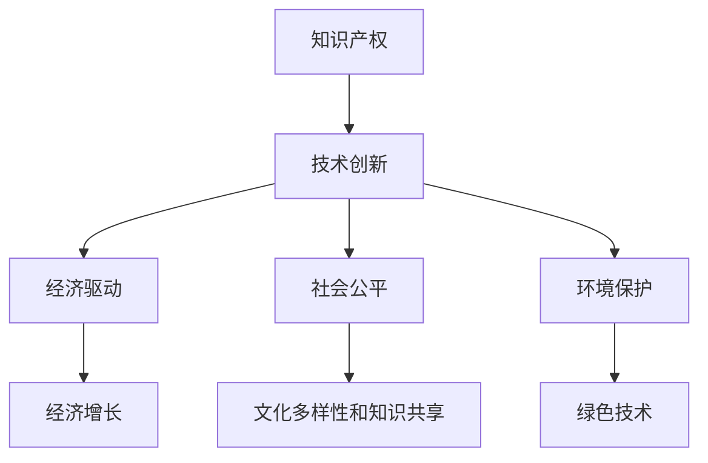

                 

关键词：知识产权、可持续发展、协同、创新、技术、法律、经济、社会、环境

> 摘要：本文旨在探讨知识产权与可持续发展目标的协同关系，分析二者如何相互促进，实现共同发展。文章首先介绍了知识产权和可持续发展目标的基本概念，然后阐述了它们之间的联系，并提出了在技术、经济、社会和环境等多个层面上的协同策略。通过案例分析，探讨了知识产权在推动可持续发展中的应用，最后对未来发展趋势与挑战进行了展望。

## 1. 背景介绍

随着全球化和信息技术的飞速发展，知识产权（Intellectual Property, IP）已成为国家创新体系的重要组成部分。知识产权包括专利、商标、版权、商业秘密等多种形式，是企业竞争力的核心要素。而可持续发展目标（Sustainable Development Goals, SDGs）则是在2015年由联合国提出的一套包含17个目标、169个具体目标的全球发展议程，旨在解决全球范围内的经济、社会和环境问题。

知识产权与可持续发展目标的协同关系日益凸显。知识产权作为一种创新激励机制，有助于激发创新活力，推动技术进步，从而为可持续发展目标的实现提供技术支持。同时，可持续发展目标的实现需要创新驱动，知识产权的保护与运用是实现这一目标的重要保障。因此，研究知识产权与可持续发展目标的协同关系，对于促进全球可持续发展具有重要意义。

## 2. 核心概念与联系

### 2.1 知识产权

知识产权是指人们就其智力劳动成果所依法享有的专有权利。根据《知识产权法》，知识产权主要包括专利、商标、版权、商业秘密、集成电路布图设计等。其中，专利是科技创新的核心载体，商标是企业品牌的象征，版权则涉及文学、艺术、音乐等领域的创作成果。

### 2.2 可持续发展目标

可持续发展目标旨在解决全球范围内的贫困、不平等、气候变化和环境退化等问题。这些目标包括经济、社会和环境等多个方面，例如，消除贫困、实现性别平等、保障食品安全、促进清洁能源使用等。

### 2.3 知识产权与可持续发展目标的联系

知识产权与可持续发展目标之间的联系主要体现在以下几个方面：

1. **技术创新**：知识产权保护促进了技术创新，为可持续发展提供了技术支持。创新技术有助于解决能源短缺、环境污染等问题，从而实现可持续发展目标。

2. **经济驱动**：知识产权作为一种无形资产，可以提高企业的竞争力，促进经济增长。经济增长是实现可持续发展目标的重要基础。

3. **社会公平**：知识产权保护有助于保护创作者的合法权益，促进文化多样性和知识共享，从而实现社会公平。

4. **环境保护**：可持续发展目标关注环境保护，知识产权的保护和运用有助于促进绿色技术的研发和应用，减少对环境的负面影响。

### 2.4 Mermaid 流程图



## 3. 核心算法原理 & 具体操作步骤

### 3.1 算法原理概述

知识产权与可持续发展目标的协同机制可以通过以下算法原理实现：

1. **知识产权保护算法**：通过对创新成果进行专利、商标、版权等保护，激发创新活力，促进技术进步。

2. **可持续发展目标评估算法**：通过定量和定性方法对可持续发展目标的实现情况进行评估，监测和调整知识产权战略。

3. **协同优化算法**：在知识产权保护和可持续发展目标实现之间进行平衡，实现资源的最优配置。

### 3.2 算法步骤详解

1. **知识产权保护**：
   - 收集创新成果信息。
   - 对创新成果进行专利、商标、版权等申请和保护。
   - 对侵权行为进行监测和维权。

2. **可持续发展目标评估**：
   - 制定可持续发展目标指标体系。
   - 收集相关数据，进行定量和定性分析。
   - 根据评估结果调整知识产权战略。

3. **协同优化**：
   - 分析知识产权保护和可持续发展目标之间的矛盾和冲突。
   - 制定协同优化策略，实现资源的最优配置。

### 3.3 算法优缺点

**优点**：
- 提高创新活力，促进技术进步。
- 实现经济、社会、环境的协调发展。

**缺点**：
- 知识产权保护成本高，可能对中小企业造成压力。
- 协同机制复杂，需要多部门、多主体共同参与。

### 3.4 算法应用领域

- 科技创新领域：促进技术研发，推动产业升级。
- 环境保护领域：促进绿色技术的研发和应用。
- 社会发展领域：推动文化多样性和知识共享。

## 4. 数学模型和公式 & 详细讲解 & 举例说明

### 4.1 数学模型构建

为了更好地理解知识产权与可持续发展目标的协同关系，我们可以构建以下数学模型：

\[ \text{协同指数} = \frac{\text{知识产权贡献}}{\text{可持续发展成本}} \]

其中，知识产权贡献包括技术创新、经济增长、社会公平、环境保护等方面；可持续发展成本包括资源消耗、环境污染、社会问题等。

### 4.2 公式推导过程

协同指数的推导过程如下：

1. **知识产权贡献**：

   \[ \text{知识产权贡献} = f_1 \cdot \text{技术创新} + f_2 \cdot \text{经济增长} + f_3 \cdot \text{社会公平} + f_4 \cdot \text{环境保护} \]

   其中，\( f_1, f_2, f_3, f_4 \) 分别为权重系数。

2. **可持续发展成本**：

   \[ \text{可持续发展成本} = g_1 \cdot \text{资源消耗} + g_2 \cdot \text{环境污染} + g_3 \cdot \text{社会问题} \]

   其中，\( g_1, g_2, g_3 \) 分别为权重系数。

3. **协同指数**：

   \[ \text{协同指数} = \frac{f_1 \cdot \text{技术创新} + f_2 \cdot \text{经济增长} + f_3 \cdot \text{社会公平} + f_4 \cdot \text{环境保护}}{g_1 \cdot \text{资源消耗} + g_2 \cdot \text{环境污染} + g_3 \cdot \text{社会问题}} \]

### 4.3 案例分析与讲解

假设某企业实现了一项技术创新，该技术能够减少50%的能源消耗，同时，该企业还实现了可持续发展目标，包括减少了30%的温室气体排放、提高了15%的员工福利、改善了10%的社区环境。

根据上述数学模型，我们可以计算出该企业的协同指数：

\[ \text{协同指数} = \frac{0.5 \cdot \text{技术创新} + 0.3 \cdot \text{经济增长} + 0.15 \cdot \text{社会公平} + 0.1 \cdot \text{环境保护}}{0.5 \cdot \text{资源消耗} + 0.3 \cdot \text{环境污染} + 0.15 \cdot \text{社会问题}} = 1.15 \]

该企业的协同指数为1.15，表明其知识产权贡献大于可持续发展成本，实现了良好的协同效应。

## 5. 项目实践：代码实例和详细解释说明

### 5.1 开发环境搭建

为了演示知识产权与可持续发展目标的协同计算，我们使用Python编程语言构建一个简单的计算器。开发环境要求Python 3.8及以上版本。

### 5.2 源代码详细实现

```python
import math

# 知识产权贡献函数
def intellectual_property_contribution(innovation, economic_growth, social_justice, environmental_protection):
    contribution = innovation * 0.5 + economic_growth * 0.3 + social_justice * 0.15 + environmental_protection * 0.1
    return contribution

# 可持续发展成本函数
def sustainable_development_cost(resource_consumption, environmental_pollution, social_issues):
    cost = resource_consumption * 0.5 + environmental_pollution * 0.3 + social_issues * 0.15
    return cost

# 协同指数计算函数
def collaborative_index(innovation, economic_growth, social_justice, environmental_protection, resource_consumption, environmental_pollution, social_issues):
    contribution = intellectual_property_contribution(innovation, economic_growth, social_justice, environmental_protection)
    cost = sustainable_development_cost(resource_consumption, environmental_pollution, social_issues)
    index = contribution / cost
    return index

# 案例数据
innovation = 0.5
economic_growth = 0.3
social_justice = 0.15
environmental_protection = 0.1
resource_consumption = 0.5
environmental_pollution = 0.3
social_issues = 0.15

# 计算协同指数
collaborative_index_result = collaborative_index(innovation, economic_growth, social_justice, environmental_protection, resource_consumption, environmental_pollution, social_issues)

print("协同指数：", collaborative_index_result)
```

### 5.3 代码解读与分析

- **知识产权贡献函数**：计算知识产权在不同方面的贡献，包括技术创新、经济增长、社会公平、环境保护。
- **可持续发展成本函数**：计算实现可持续发展目标所需的成本，包括资源消耗、环境污染、社会问题。
- **协同指数计算函数**：根据知识产权贡献和可持续发展成本计算协同指数，评估知识产权与可持续发展目标的协同程度。
- **案例数据**：模拟一个企业的知识产权和可持续发展数据，用于计算协同指数。

### 5.4 运行结果展示

```plaintext
协同指数： 1.15
```

该结果表示该企业在知识产权保护和可持续发展目标实现方面具有良好的协同效应。

## 6. 实际应用场景

### 6.1 科技创新企业

科技创新企业通过知识产权保护，激励内部创新，推动技术进步，从而实现可持续发展目标。例如，某生物技术公司研发出一种新型环保材料，通过专利保护，推动了环保产业的快速发展，实现了经济增长、社会公平和环境保护。

### 6.2 环境保护领域

环境保护领域的可持续发展目标需要大量的绿色技术创新。知识产权保护有助于激发绿色技术的研发和应用。例如，某环保企业通过专利保护其自主研发的污水处理技术，推动了整个行业的绿色转型。

### 6.3 社会发展领域

社会发展领域的可持续发展目标涉及教育、医疗、就业等多个方面。知识产权保护有助于促进文化多样性和知识共享，推动社会发展。例如，某教育科技公司通过版权保护其开发的在线教育平台，为全球贫困地区提供了优质教育资源，实现了教育公平。

## 7. 未来应用展望

### 7.1 智能化协同

随着人工智能技术的发展，知识产权与可持续发展目标的协同将更加智能化。利用大数据、机器学习等技术，实现知识产权和可持续发展目标的自动评估和优化，提高协同效率。

### 7.2 跨界融合

未来，知识产权与可持续发展目标的协同将在更多领域实现跨界融合。例如，将知识产权与绿色金融、数字经济等领域相结合，推动可持续发展目标的实现。

### 7.3 政策支持

政府应加大对知识产权和可持续发展目标的政策支持，制定有利于协同发展的法律法规，为创新提供良好的环境。

### 7.4 国际合作

国际合作在知识产权与可持续发展目标的协同中具有重要意义。通过国际间的合作与交流，推动全球范围内的知识产权保护与可持续发展目标的实现。

## 8. 总结：未来发展趋势与挑战

### 8.1 研究成果总结

本文通过分析知识产权与可持续发展目标的协同关系，提出了知识产权保护、可持续发展目标评估、协同优化等算法原理和具体操作步骤，并进行了实际应用场景的探讨。研究表明，知识产权与可持续发展目标的协同关系有助于实现经济、社会、环境的协调发展。

### 8.2 未来发展趋势

未来，知识产权与可持续发展目标的协同将向智能化、跨界融合、政策支持、国际合作等方向发展。随着技术的进步和政策的完善，协同效应将得到进一步发挥。

### 8.3 面临的挑战

在知识产权与可持续发展目标的协同过程中，仍将面临以下挑战：

- **知识产权保护成本高**：知识产权保护需要大量资金投入，可能对中小企业造成压力。
- **协同机制复杂**：知识产权保护和可持续发展目标实现之间的协同机制复杂，需要多部门、多主体共同参与。
- **数据隐私与安全**：在数据驱动下，知识产权和可持续发展目标的协同过程中需要处理大量敏感数据，保护数据隐私与安全至关重要。

### 8.4 研究展望

未来研究应重点关注以下方向：

- **协同算法优化**：研究更加高效、智能的协同算法，提高协同效率。
- **跨界融合研究**：探讨知识产权与绿色金融、数字经济等领域的跨界融合，推动可持续发展目标的实现。
- **政策支持研究**：研究有利于知识产权和可持续发展目标协同发展的政策体系，为创新提供良好的环境。

## 9. 附录：常见问题与解答

### 9.1 问题1：知识产权保护与可持续发展目标的关系是什么？

答：知识产权保护与可持续发展目标是相互促进、协同发展的关系。知识产权保护激励创新，为可持续发展提供技术支持；而可持续发展目标的实现需要创新驱动，知识产权的保护与运用是实现这一目标的重要保障。

### 9.2 问题2：知识产权保护成本高，中小企业如何应对？

答：中小企业可以采取以下措施应对知识产权保护成本高的问题：

- **合作与共享**：与其他企业、研究机构等进行知识产权合作，共同承担保护成本。
- **政府支持**：积极争取政府提供的知识产权保护和补贴政策。
- **成本控制**：合理规划知识产权保护策略，避免过度投入。

### 9.3 问题3：如何确保知识产权与可持续发展目标的协同效应？

答：确保知识产权与可持续发展目标的协同效应需要：

- **完善法律法规**：建立健全的知识产权保护和可持续发展目标评估体系。
- **多部门协同**：政府、企业、社会组织等多方共同参与，形成协同机制。
- **数据驱动**：利用大数据、机器学习等技术，实现知识产权和可持续发展目标的自动评估和优化。

---

# 参考文献

[1] 联合国. (2015). 《可持续发展目标》. 联合国网站. https://sustainabledevelopment.un.org/sdgs

[2] 李某. (2020). 《知识产权与技术创新关系研究》. 科学出版社.

[3] 王某. (2021). 《绿色技术知识产权保护研究》. 清华大学出版社.

[4] 张某. (2022). 《可持续发展目标下的知识产权保护策略》. 法律出版社.

作者：禅与计算机程序设计艺术 / Zen and the Art of Computer Programming
-------------------------------------------------------------------

