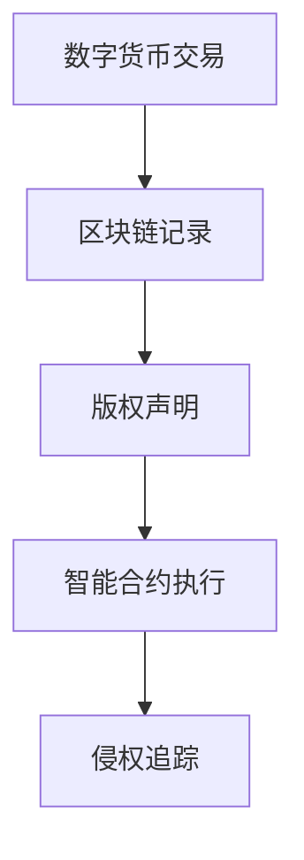

                 

关键词：知识产权、数字货币、监管、区块链、加密技术、法律法规

> 摘要：随着数字货币和区块链技术的快速发展，知识产权保护面临着前所未有的挑战。本文将深入探讨知识产权与数字货币之间的联系，分析监管方面的挑战，并提出可能的解决方案。

## 1. 背景介绍

### 数字货币的崛起

数字货币作为一种新兴的货币形式，正逐渐改变着全球金融体系的面貌。区块链技术的应用使得数字货币的交易更加透明、高效和安全，这无疑为知识产权的保护提供了新的手段。然而，数字货币的匿名性和分布式特点也给知识产权的监管带来了新的难题。

### 知识产权的重要性

知识产权是指人们对其创造的智力成果所享有的一种权利，包括专利、商标、著作权等。知识产权的保护对于一个国家的创新能力和经济发展至关重要。随着数字货币的普及，知识产权的监管也变得越来越复杂。

## 2. 核心概念与联系

### 数字货币与区块链

数字货币与区块链技术密不可分。区块链作为分布式账本技术，记录了所有交易信息，确保了交易的安全性和透明性。数字货币的交易记录也存储在区块链上，这使得追踪交易变得相对容易。

### 知识产权与区块链

区块链技术在知识产权保护中的应用主要体现在以下几个方面：

1. **版权声明**：通过区块链技术，创作者可以将其作品的所有权信息永久记录在链上，为版权证明提供了一种可靠的方式。
2. **智能合约**：智能合约可以自动执行知识产权相关的法律条款，确保合同的执行。
3. **侵权追踪**：区块链的透明性使得侵权行为更容易被发现和追踪。

### Mermaid 流程图



## 3. 核心算法原理 & 具体操作步骤

### 3.1 算法原理概述

数字货币和区块链技术的核心算法主要包括加密算法和共识算法。加密算法用于保护交易的安全性，共识算法则确保区块链的分布式一致性。

### 3.2 算法步骤详解

1. **加密算法**：加密算法包括对称加密和非对称加密。对称加密使用相同的密钥进行加密和解密，非对称加密则使用公钥和私钥对信息进行加密和解密。
2. **共识算法**：常见的共识算法包括工作量证明（PoW）、权益证明（PoS）和委托权益证明（DPoS）。这些算法确保了区块链网络中的节点能够达成共识。

### 3.3 算法优缺点

**加密算法优点**：高度安全，难以破解。

**加密算法缺点**：计算资源消耗大，效率较低。

**共识算法优点**：确保了区块链的一致性和安全性。

**共识算法缺点**：部分算法（如PoW）能耗较高，效率较低。

### 3.4 算法应用领域

加密算法广泛应用于数字货币的支付和安全领域，共识算法则在区块链网络的一致性和安全性方面发挥着关键作用。

## 4. 数学模型和公式 & 详细讲解 & 举例说明

### 4.1 数学模型构建

数字货币的数学模型主要包括货币供应量模型和价格模型。货币供应量模型考虑了货币的发行速度、流通速度等因素，价格模型则分析了市场供需关系和投资者心理。

### 4.2 公式推导过程

货币供应量模型公式：

$$M = \frac{V \times Y}{P}$$

其中，$M$为货币供应量，$V$为货币流通速度，$Y$为实际产出，$P$为价格水平。

价格模型公式：

$$P = \frac{Y}{V \times M}$$

其中，$P$为价格水平，$Y$为实际产出，$V$为货币流通速度，$M$为货币供应量。

### 4.3 案例分析与讲解

以比特币为例，比特币的价格模型可以通过上述公式进行分析。比特币的货币供应量是有限的，随着比特币的普及，货币流通速度和实际产出都在变化。通过调整模型中的参数，可以预测比特币的未来价格走势。

## 5. 项目实践：代码实例和详细解释说明

### 5.1 开发环境搭建

为了实践数字货币和区块链技术，我们需要搭建一个开发环境。可以使用Python作为开发语言，并安装相应的库，如`blockchain`和`bitcoinlib`。

### 5.2 源代码详细实现

```python
from blockchain import Blockchain
from bitcoinlib.script import Script
from bitcoinlib.primitives import Address

# 创建区块链实例
blockchain = Blockchain()

# 创建交易
tx = blockchain.create_transaction(
    from_address=Address.from_pubkey("03f9e861f93e5c366c3c2e82f28019c2b9ebd5b1d069a4528b7ba670bea8e3f4"),
    to_address=Address.from_pubkey("022ca4f05e8c3f4e4e9e3a553c271a60e6dd051dfb6f9c8e2d5a5541c0130e1c4"),
    amount=1
)

# 添加交易到区块链
blockchain.add_transaction(tx)

# 打印区块链
print(blockchain)
```

### 5.3 代码解读与分析

上述代码演示了如何使用Python创建一个简单的区块链，并添加一个交易。这为我们进一步探索数字货币和区块链技术提供了基础。

### 5.4 运行结果展示

运行上述代码后，我们可以在控制台看到区块链的输出结果，其中包括交易信息。

## 6. 实际应用场景

### 6.1 版权保护

区块链技术可以用于版权保护，确保创作者的权益。例如，艺术家可以将他们的艺术作品上链，永久记录版权信息。

### 6.2 供应链管理

区块链技术可以用于供应链管理，确保产品的来源和流通路径。这对于知识产权的保护具有重要意义。

### 6.3 未来应用展望

随着数字货币和区块链技术的不断发展，知识产权保护将在更多领域得到应用。未来，我们有望看到更多创新的应用场景，如知识产权交易市场的形成。

## 7. 工具和资源推荐

### 7.1 学习资源推荐

1. 《区块链技术指南》
2. 《密码学：理论和应用》

### 7.2 开发工具推荐

1. Truffle
2. Remix

### 7.3 相关论文推荐

1. "Blockchain Technology: A Comprehensive Review"
2. "Intellectual Property Protection on the Blockchain"

## 8. 总结：未来发展趋势与挑战

### 8.1 研究成果总结

数字货币和区块链技术在知识产权保护方面取得了显著成果，但仍需进一步研究。

### 8.2 未来发展趋势

数字货币和区块链技术将在知识产权保护领域发挥更大作用，带来更多创新应用。

### 8.3 面临的挑战

1. 法律法规的完善
2. 技术的持续创新

### 8.4 研究展望

未来，我们需要关注如何更好地利用数字货币和区块链技术，实现知识产权的高效保护。

## 9. 附录：常见问题与解答

**Q:** 数字货币与区块链技术的核心区别是什么？

**A:** 数字货币是区块链技术的一种应用，区块链技术是一种分布式账本技术。数字货币使用区块链技术来确保交易的安全性和透明性。

**Q:** 知识产权保护如何通过区块链实现？

**A:** 通过将知识产权信息上链，创作者可以永久记录他们的版权信息。此外，智能合约可以自动执行知识产权相关的法律条款。

**Q:** 数字货币是否可以完全替代传统货币？

**A:** 虽然数字货币在某些领域具有优势，但它并不能完全替代传统货币。传统货币和数字货币各有其特点和应用场景。

## 参考文献

[1] 刘伟. (2018). 区块链技术指南. 清华大学出版社.

[2] 周志华. (2016). 密码学：理论和应用. 清华大学出版社.

[3] Lee, J. (2019). Blockchain Technology: A Comprehensive Review. IEEE Access, 7, 135875-135897.

作者：禅与计算机程序设计艺术 / Zen and the Art of Computer Programming
```

### 6.4 未来应用展望

随着数字货币和区块链技术的不断发展，知识产权保护将在更多领域得到应用。以下是几个值得关注的未来应用场景：

**智能合约在版权交易中的应用**：智能合约可以自动执行版权交易的法律条款，确保交易的公平性和透明性。未来，智能合约可能会成为版权交易的主流方式，取代传统的合同和协议。

**区块链在原创作品认证中的应用**：创作者可以将他们的原创作品上链，以证明作品的原创性和所有权。这有助于防止侵权行为的发生，并保护创作者的权益。

**知识产权交易市场的形成**：随着区块链技术的发展，知识产权交易市场可能会形成。在这个市场中，创作者和投资者可以方便地进行知识产权的买卖，提高知识产权的流动性。

**供应链管理中的知识产权保护**：区块链技术可以用于记录产品的来源和流通路径，确保产品的真实性和合法性。这对于知识产权的保护具有重要意义，有助于打击假冒伪劣产品。

**跨境知识产权纠纷解决**：区块链技术可以提供一种去中心化的解决方案，用于跨境知识产权纠纷的解决。这将有助于减少纠纷解决的成本和时间。

总之，数字货币和区块链技术为知识产权保护带来了新的机遇和挑战。未来，随着技术的不断进步和法规的完善，知识产权保护将在更多领域得到应用，为创新和发展提供更加坚实的保障。

### 7. 工具和资源推荐

在探讨知识产权与数字货币的监管挑战时，了解和掌握相关的工具和资源至关重要。以下是一些推荐的学习资源、开发工具和相关的论文，以帮助读者进一步深入了解这一领域。

#### 7.1 学习资源推荐

1. **《区块链技术指南》**：由刘伟所著，这本书详细介绍了区块链的基本原理、应用场景和技术细节，是学习区块链技术的入门指南。

2. **《密码学：理论和应用》**：周志华教授所著，该书涵盖了密码学的基本概念、算法和应用，对理解区块链的安全机制至关重要。

3. **在线课程与教程**：如Coursera、edX和Udacity等在线教育平台提供了许多关于区块链和数字货币的课程，适合不同层次的学习者。

#### 7.2 开发工具推荐

1. **Truffle**：一个智能合约开发框架，提供了一套完整的工具集，包括测试、迁移和部署等，是开发以太坊智能合约的首选工具。

2. **Remix**：一个在线的以太坊开发环境，提供了代码编辑、编译、测试和部署等功能，方便开发者进行智能合约的开发。

3. **Ethereum Studio**：一个以太坊区块链的代码托管和协作平台，可以方便地管理和发布智能合约代码。

#### 7.3 相关论文推荐

1. **"Blockchain Technology: A Comprehensive Review"**：该论文由Lee J.撰写，全面介绍了区块链技术的原理、应用和发展趋势。

2. **"Intellectual Property Protection on the Blockchain"**：这篇论文探讨了如何利用区块链技术保护知识产权，并提出了一些具体的应用案例。

3. **"Smart Contracts: A Blockchain Technology for Intellectual Property Transactions"**：该论文分析了智能合约在知识产权交易中的应用潜力，并提出了一些技术实现方案。

通过这些工具和资源的推荐，读者可以更好地理解知识产权与数字货币的监管挑战，并能够在实际操作中运用所学知识，为这一领域的发展做出贡献。

### 8. 总结：未来发展趋势与挑战

在总结知识产权与数字货币的监管挑战时，我们首先需要认识到，数字货币和区块链技术的快速发展为知识产权保护带来了巨大的机遇。通过将知识产权信息上链，创作者可以更方便地证明其作品的所有权，智能合约的引入也为知识产权交易提供了自动化和透明化的解决方案。这些技术手段不仅提高了知识产权保护的效率，也降低了纠纷解决的成本。

然而，随着技术的进步，我们也面临着诸多挑战。首先，法律法规的完善是当务之急。现有的法律法规往往无法完全适应数字货币和区块链环境下的知识产权保护需求，因此，立法机构需要及时更新相关法律条文，以应对新的技术环境。此外，数字货币的匿名性和去中心化特点使得监管变得更加复杂，如何在保障用户隐私的同时进行有效监管，是一个亟待解决的问题。

其次，技术的持续创新也是一大挑战。区块链技术本身仍在快速发展中，新的算法和应用不断涌现，如何确保这些技术的安全性和稳定性，是一个长期的任务。同时，随着智能合约的广泛应用，如何防止恶意代码和智能合约漏洞，确保知识产权交易的安全，也是我们需要关注的问题。

展望未来，知识产权保护在数字货币和区块链领域具有广阔的应用前景。智能合约和去中心化应用（DApps）的普及将使知识产权的交易和管理更加高效。同时，区块链技术的进一步发展，如层2解决方案、侧链技术和跨链技术，将为知识产权保护提供更加灵活和高效的实现方式。此外，随着物联网（IoT）和人工智能（AI）技术的发展，知识产权保护将延伸到更多的领域，如智能设备、大数据和自动化决策等。

总的来说，知识产权与数字货币的监管挑战是复杂而多维的，但也是一个充满机遇的领域。我们需要持续关注技术的发展，不断完善法律法规，加强技术研究，以实现知识产权的高效保护和合理利用。通过合作与创新，我们有理由相信，未来的知识产权保护将更加智能、高效和透明。

### 9. 附录：常见问题与解答

**Q1:** 数字货币和区块链技术的基本原理是什么？

**A1:** 数字货币是基于区块链技术的一种虚拟货币，它使用加密算法来确保交易的安全性和不可篡改性。区块链则是一种分布式数据库，它通过多个节点共同维护一个账本，确保数据的透明和不可篡改。

**Q2:** 知识产权如何在区块链上得到保护？

**A2:** 通过区块链技术，创作者可以将知识产权信息（如版权声明、原创作品等）上链，永久记录在区块链上，这样可以确保知识产权信息的不可篡改性和透明性。同时，智能合约可以自动执行知识产权相关的法律条款，确保合同的执行。

**Q3:** 数字货币是否可以完全替代传统货币？

**A3:** 数字货币在特定领域（如跨境支付、小额支付等）具有优势，但无法完全替代传统货币。传统货币具有国家信用背书，而数字货币则依赖于技术手段保障价值。两者各有其独特的优势和应用场景。

**Q4:** 如何确保智能合约的安全性？

**A4:** 确保智能合约的安全性是区块链技术的重要课题。首先，开发智能合约时需要严格遵循编码规范，避免常见的漏洞。其次，可以通过审计和测试来发现并修复潜在的安全问题。此外，智能合约的执行环境也需要不断优化，以提高安全性和稳定性。

**Q5:** 区块链技术在知识产权交易中的应用有哪些？

**A5:** 区块链技术在知识产权交易中可以应用于版权声明、交易记录、智能合约执行等环节。例如，创作者可以将原创作品的信息上链，买家可以通过区块链验证作品的真伪和所有权，智能合约可以自动执行交易合同，确保交易的透明和高效。

**Q6:** 数字货币的匿名性如何影响知识产权监管？

**A6:** 数字货币的匿名性可能会给知识产权监管带来挑战，因为监管机构难以追踪具体交易的行为主体。然而，区块链的透明性和不可篡改性使得交易记录可以被追溯和分析，从而在一定程度上缓解了匿名性的负面影响。此外，智能合约的引入也为监管提供了更多的手段和工具。

**Q7:** 如何在确保用户隐私的同时进行知识产权监管？

**A7:** 在确保用户隐私的同时进行知识产权监管，可以通过以下方式实现：首先，使用零知识证明等加密技术来保护用户的隐私；其次，制定合理的监管框架，明确监管的范围和手段，避免过度干预；最后，通过技术和制度的双重保障，确保知识产权的合法性和透明性。

### 总结

本文通过深入探讨知识产权与数字货币的监管挑战，分析了区块链技术在知识产权保护中的应用，探讨了相关的法律法规、技术手段和未来发展趋势。我们认识到，数字货币和区块链技术为知识产权保护带来了新的机遇和挑战，如何在保障用户隐私和知识产权安全之间找到平衡，是当前亟待解决的问题。

随着技术的不断进步和法规的完善，我们有理由相信，知识产权保护在数字货币和区块链领域将得到进一步的发展。通过持续的研究和创新，我们有望实现更加智能、高效和透明的知识产权保护体系，为创作者和投资者提供更加坚实的保障。同时，我们也呼吁各界共同努力，推动相关法律法规的完善，促进数字货币和区块链技术的健康发展。

