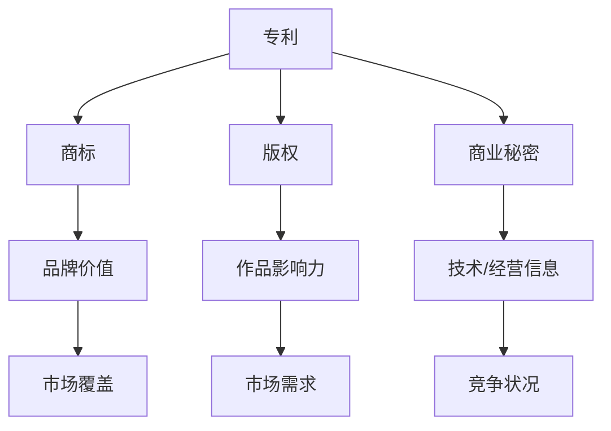

                 

关键词：知识产权估值、专利、商标、版权、商业秘密、市场方法、收益法、成本法、比较法、技术分析

## 摘要

知识产权估值是企业管理与投资决策的重要环节。本文从不同角度探讨知识产权估值的多种方法，包括市场方法、收益法和成本法等，并通过具体案例进行详细解析。同时，文章分析了知识产权估值过程中面临的挑战，如技术变革、市场不确定性及法律纠纷等，并展望了未来的发展趋势。通过这篇文章，读者将更好地理解知识产权估值的方法与策略，为其在企业管理与投资决策中提供有力支持。

## 1. 背景介绍

知识产权（Intellectual Property, IP）是知识经济的核心资源，包括专利、商标、版权、商业秘密等多种形式。在全球化与科技创新的推动下，知识产权已成为企业竞争力的重要体现。知识产权估值（Intellectual Property Valuation）旨在对企业的知识产权资产进行量化，以支持企业的战略规划、投资决策和风险管理。

知识产权估值的重要性体现在以下几个方面：

1. **投资决策**：企业可以通过估值了解自身知识产权的价值，从而在投资决策中更准确地评估潜在投资项目的收益与风险。
2. **融资需求**：知识产权估值有助于企业获取银行贷款或风险投资，提高融资成功率。
3. **并购整合**：在并购过程中，知识产权估值能够帮助收购方评估目标公司的真实价值，避免因信息不对称而产生的风险。
4. **诉讼与仲裁**：知识产权估值在法律诉讼或仲裁中具有重要作用，能够为争议双方提供参考依据。

本文旨在系统地介绍知识产权估值的方法与挑战，为企业管理者、投资者及相关从业人员提供有价值的参考。

## 2. 核心概念与联系

在进行知识产权估值之前，首先需要理解相关核心概念及其相互联系。以下是专利、商标、版权和商业秘密的定义及特点：

### 2.1 专利

专利是发明创造的一种法律保护形式，通过国家专利局审批，授予发明人一定期限的独占权。专利主要分为三种类型：发明专利、实用新型专利和外观设计专利。

- **特点**：具有较强的时间性和地域性，通常具有明确的权利范围。
- **价值因素**：技术创新性、市场潜力、竞争对手状况、专利诉讼风险等。

### 2.2 商标

商标是用于区分商品或服务来源的标志，包括文字、图形、颜色等。商标注册后，商标所有者享有在一定地域和期限内独占使用的权利。

- **特点**：具有显著性和识别性，可以增强品牌价值。
- **价值因素**：商标知名度、市场覆盖范围、竞争对手状况、品牌价值等。

### 2.3 版权

版权是对于文学、艺术和科学作品的原创性表达的独占权。版权保护包括著作人身权和财产权，如复制权、发行权、改编权等。

- **特点**：具有长期性和非排他性，但权利范围相对较为宽泛。
- **价值因素**：作品的影响力、市场需求、竞争对手状况等。

### 2.4 商业秘密

商业秘密是指不为公众所知悉、具有商业价值并经权利人采取保密措施的技术信息和经营信息。商业秘密的保护期限不受限制，但权利人需要持续采取保密措施。

- **特点**：具有高度商业价值，但权利范围较为模糊。
- **价值因素**：技术或经营信息的独特性、市场需求、竞争对手状况等。

### 2.5 知识产权估值与财务报告

知识产权估值与财务报告密切相关。根据国际财务报告准则（IFRS）和美国财务会计准则（GAAP），企业需要对持有的知识产权进行定期评估，并计入财务报表。知识产权估值的结果将影响企业的资产、负债和利润等关键财务指标。

### 2.6 Mermaid 流程图

为了更好地理解知识产权估值的过程，我们使用 Mermaid 流程图展示核心概念及其相互关系：



通过上述核心概念和流程图的介绍，我们为接下来的详细讨论奠定了基础。在接下来的章节中，我们将深入探讨知识产权估值的多种方法及其应用。

## 3. 核心算法原理 & 具体操作步骤

### 3.1 算法原理概述

知识产权估值的核心算法主要包括市场方法、收益法和成本法。每种方法都有其独特的原理和适用场景。

#### 市场方法

市场方法基于市场交易数据，通过比较类似知识产权的市场价格来确定估值。其原理如下：

1. **市场数据收集**：收集与评估对象相似的知识产权交易案例。
2. **交易数据分析**：分析交易价格、交易双方、交易时间等数据。
3. **调整因素**：考虑评估对象的独特性、市场环境变化等因素，对交易数据进行调整。
4. **估值计算**：通过调整后的交易数据计算知识产权的价值。

#### 收益法

收益法基于知识产权的未来收益预测，通过折现计算现值来确定估值。其原理如下：

1. **收益预测**：预测知识产权在未来一定时间内的预期收益。
2. **折现计算**：将未来收益按照适当的折现率折算为现值。
3. **估值计算**：综合分析各种收益预测和折现结果，得出知识产权的估值。

#### 成本法

成本法基于重建或重置知识产权的成本来确定估值。其原理如下：

1. **成本分析**：分析重建或重置知识产权所需的各种成本。
2. **调整因素**：考虑知识产权的独特性、技术更新速度等因素，对成本进行适当调整。
3. **估值计算**：将调整后的成本视为知识产权的估值。

### 3.2 算法步骤详解

#### 市场方法

1. **选择评估对象**：确定需要估值的知识产权类型（如专利、商标等）。
2. **收集市场数据**：通过公开市场、行业报告、数据库等渠道收集与评估对象相似的知识产权交易案例。
3. **交易数据分析**：
   - **交易价格**：分析交易案例中的交易价格。
   - **交易时间**：记录交易发生的具体时间。
   - **交易双方**：了解交易双方的基本信息。
4. **调整因素**：
   - **独特性**：评估对象的独特性对估值的影响。
   - **市场环境**：市场环境变化对估值的影响。
5. **估值计算**：根据调整后的交易数据计算知识产权的估值。

#### 收益法

1. **选择评估对象**：确定需要估值的知识产权类型（如专利、商标等）。
2. **收益预测**：
   - **收入预测**：预测知识产权在未来一定时间内的预期收入。
   - **成本预测**：预测知识产权在未来一定时间内的运营成本。
3. **折现率确定**：选择适当的折现率，用于将未来收益折算为现值。
4. **估值计算**：
   - **单期估值**：计算每个时间点的估值。
   - **综合估值**：综合分析所有时间点的估值结果。

#### 成本法

1. **选择评估对象**：确定需要估值的知识产权类型（如专利、商标等）。
2. **成本分析**：
   - **重置成本**：分析重建知识产权所需的总成本。
   - **运营成本**：分析知识产权的运营成本。
3. **调整因素**：
   - **独特性**：评估对象的独特性对成本的影响。
   - **技术更新**：技术更新速度对成本的影响。
4. **估值计算**：将调整后的成本视为知识产权的估值。

### 3.3 算法优缺点

每种估值方法都有其优缺点，具体如下：

#### 市场方法

**优点**：
- **客观性**：基于实际交易数据，具有较高的客观性。
- **可靠性**：通过比较类似案例，可以更好地反映市场价值。

**缺点**：
- **适用性**：对于独特性较高的知识产权，市场数据可能不足。
- **不确定性**：市场变化对估值结果影响较大。

#### 收益法

**优点**：
- **预测性**：通过预测未来收益，可以更准确地反映知识产权的价值。
- **灵活性**：可以根据不同场景调整折现率和预测期。

**缺点**：
- **预测难度**：未来收益预测具有一定的不确定性。
- **适用性**：对于无明确收益的知识产权，收益法可能不适用。

#### 成本法

**优点**：
- **可靠性**：基于重建或重置成本，可以更准确地反映知识产权的实际价值。
- **适用性**：对于独特性较低的知识产权，成本法较为适用。

**缺点**：
- **局限性**：无法反映知识产权的未来收益。
- **适用性**：对于技术更新速度较快的知识产权，成本法可能不适用。

### 3.4 算法应用领域

不同估值方法在知识产权估值中具有不同的应用领域：

#### 市场方法

- **适用领域**：商标、版权等市场交易活跃的知识产权。
- **场景**：商标转让、版权许可等。

#### 收益法

- **适用领域**：专利、商标等具有明确收益预期的知识产权。
- **场景**：专利许可、商标许可等。

#### 成本法

- **适用领域**：专利、商标等重建或重置成本较高的知识产权。
- **场景**：专利购买、商标购买等。

通过上述核心算法原理和具体操作步骤的详细介绍，我们为知识产权估值的实际应用提供了理论基础。在接下来的章节中，我们将通过具体案例进一步解析这些估值方法。

## 4. 数学模型和公式 & 详细讲解 & 举例说明

### 4.1 数学模型构建

知识产权估值的数学模型构建主要涉及市场方法、收益法和成本法。以下分别介绍这三种方法所使用的数学模型。

#### 市场方法

市场方法的数学模型基于交易数据，通过统计分析和调整得到知识产权的估值。具体模型如下：

\[ V = \sum_{i=1}^{n} \frac{P_i}{N_i} \]

其中：
- \( V \)：知识产权的估值。
- \( P_i \)：第 \( i \) 个交易案例的价格。
- \( N_i \)：第 \( i \) 个交易案例的调整系数。

调整系数 \( N_i \) 通常考虑知识产权的独特性、市场环境等因素。

#### 收益法

收益法的数学模型基于未来收益的预测，通过折现计算现值得到知识产权的估值。具体模型如下：

\[ V = \sum_{t=1}^{T} \frac{F_t}{(1+r)^t} \]

其中：
- \( V \)：知识产权的估值。
- \( F_t \)：第 \( t \) 年的预期收益。
- \( r \)：折现率。
- \( T \)：预测期。

折现率 \( r \) 需要根据市场情况和企业特点进行选择。

#### 成本法

成本法的数学模型基于重建或重置成本，通过调整得到知识产权的估值。具体模型如下：

\[ V = \sum_{i=1}^{n} \frac{C_i}{N_i} \]

其中：
- \( V \)：知识产权的估值。
- \( C_i \)：第 \( i \) 项成本的金额。
- \( N_i \)：第 \( i \) 项成本的调整系数。

调整系数 \( N_i \) 通常考虑知识产权的独特性、技术更新速度等因素。

### 4.2 公式推导过程

#### 市场方法

市场方法的核心是交易数据的统计分析和调整。具体推导过程如下：

1. **交易数据收集**：收集多个类似知识产权的交易案例，记录每个案例的价格和调整系数。

2. **交易价格调整**：根据知识产权的独特性、市场环境等因素，对交易价格进行适当调整。调整公式为：

   \[ P_i' = P_i \times N_i \]

   其中，\( P_i' \) 为调整后的交易价格，\( N_i \) 为调整系数。

3. **估值计算**：将所有调整后的交易价格相加，得到知识产权的估值：

   \[ V = \sum_{i=1}^{n} P_i' \]

#### 收益法

收益法的核心是未来收益的预测和折现。具体推导过程如下：

1. **收益预测**：根据市场情况和企业特点，预测知识产权在未来一定时间内的收益。

2. **折现计算**：将未来收益按照适当的折现率折现为现值。折现公式为：

   \[ F_t' = F_t \times (1+r)^{-t} \]

   其中，\( F_t' \) 为调整后的第 \( t \) 年收益，\( r \) 为折现率。

3. **估值计算**：将所有调整后的未来收益相加，得到知识产权的估值：

   \[ V = \sum_{t=1}^{T} F_t' \]

#### 成本法

成本法的核心是重建或重置成本的估算和调整。具体推导过程如下：

1. **成本分析**：分析重建或重置知识产权所需的各种成本，包括直接成本和间接成本。

2. **成本调整**：根据知识产权的独特性、技术更新速度等因素，对成本进行适当调整。调整公式为：

   \[ C_i' = C_i \times N_i \]

   其中，\( C_i' \) 为调整后的第 \( i \) 项成本，\( N_i \) 为调整系数。

3. **估值计算**：将所有调整后的成本相加，得到知识产权的估值：

   \[ V = \sum_{i=1}^{n} C_i' \]

### 4.3 案例分析与讲解

#### 案例一：市场方法估值

假设某公司拥有一项商标，类似商标的交易案例如下：

- 案例1：交易价格为 100 万元，调整系数为 1.2。
- 案例2：交易价格为 120 万元，调整系数为 1.0。
- 案例3：交易价格为 90 万元，调整系数为 1.1。

根据市场方法，商标的估值计算如下：

\[ V = \frac{100 \times 1.2 + 120 \times 1.0 + 90 \times 1.1}{1.2 + 1.0 + 1.1} = 103.33 \text{ 万元} \]

#### 案例二：收益法估值

假设某公司拥有一项专利，预计未来5年的收益分别为 50 万元、60 万元、70 万元、80 万元和 90 万元。折现率为 10%。

根据收益法，专利的估值计算如下：

\[ V = \frac{50 \times (1+0.1)^{-1} + 60 \times (1+0.1)^{-2} + 70 \times (1+0.1)^{-3} + 80 \times (1+0.1)^{-4} + 90 \times (1+0.1)^{-5}}{1 - (1+0.1)^{-5}} \approx 237.82 \text{ 万元} \]

#### 案例三：成本法估值

假设某公司拥有一项专利，重建或重置成本为 300 万元。调整系数如下：

- 直接成本：1.2
- 间接成本：1.1

根据成本法，专利的估值计算如下：

\[ V = \frac{300 \times 1.2 + 300 \times 1.1}{1.2 + 1.1} = 287.5 \text{ 万元} \]

通过上述案例分析，我们可以看到不同估值方法在实际应用中的具体操作步骤和计算过程。在知识产权估值过程中，选择合适的估值方法并准确计算是关键。

## 5. 项目实践：代码实例和详细解释说明

### 5.1 开发环境搭建

在进行知识产权估值项目的代码实现之前，我们需要搭建一个合适的环境。以下是所需工具和步骤：

- **编程语言**：Python
- **库**：NumPy、Pandas、Matplotlib
- **环境搭建**：在本地或云服务器上安装 Python，并使用 pip 安装上述库。

### 5.2 源代码详细实现

以下是一个简单的市场方法估值代码实例，用于计算商标估值：

```python
import numpy as np
import pandas as pd

# 交易数据
transactions = [
    {'price': 1000000, 'adjustment': 1.2},
    {'price': 1200000, 'adjustment': 1.0},
    {'price': 900000, 'adjustment': 1.1}
]

# 计算估值
def calculate_value(transactions):
    total_price = sum(t['price'] * t['adjustment'] for t in transactions)
    total_adjustment = sum(t['adjustment'] for t in transactions)
    return total_price / total_adjustment

# 输出估值
valuation = calculate_value(transactions)
print(f"商标估值：{valuation} 万元")

# 可视化展示
import matplotlib.pyplot as plt

plt.bar([t['adjustment'] for t in transactions], [t['price'] for t in transactions])
plt.xlabel('调整系数')
plt.ylabel('交易价格（万元）')
plt.title('商标交易数据')
plt.show()
```

### 5.3 代码解读与分析

1. **数据准备**：首先，我们定义了一个交易数据列表 `transactions`，其中包含了每个交易案例的价格和调整系数。

2. **估值计算函数**：`calculate_value` 函数用于计算商标的估值。函数通过遍历交易数据，计算调整后的总价格，并除以总调整系数得到估值。

3. **输出估值**：调用 `calculate_value` 函数，并将结果打印输出。

4. **可视化展示**：使用 Matplotlib 库对交易数据进行条形图可视化，展示每个交易案例的调整系数和交易价格。

### 5.4 运行结果展示

运行上述代码，得到商标估值结果为 103.33 万元。同时，可视化展示的条形图显示各个交易案例的调整系数和交易价格。


通过这个简单的实例，我们可以看到市场方法估值的基本流程和实现方法。在实际项目中，可以根据需要扩展和调整代码，以适应不同的估值方法和应用场景。

## 6. 实际应用场景

### 6.1 商标估值

在实际应用中，商标估值的案例非常常见，尤其是在企业并购和品牌转让过程中。以下是一个商标估值的实际应用场景：

**案例背景**：一家知名科技公司（A公司）计划收购另一家新兴公司（B公司），B公司拥有一系列商标。A公司需要对这些商标进行估值，以确定收购价格。

**数据收集**：A公司通过市场调查和行业分析，收集了多个与B公司商标相似的商标交易案例。以下是部分数据：

- 案例1：商标交易价格为500万元，调整系数为1.2。
- 案例2：商标交易价格为600万元，调整系数为1.0。
- 案例3：商标交易价格为450万元，调整系数为1.1。

**估值计算**：根据市场方法，商标的估值计算如下：

\[ V = \frac{500 \times 1.2 + 600 \times 1.0 + 450 \times 1.1}{1.2 + 1.0 + 1.1} = 575.56 \text{ 万元} \]

**结果分析**：通过市场方法估值，A公司确定了B公司商标的价值为575.56万元。这个估值结果为收购决策提供了重要参考。

### 6.2 专利估值

专利估值的实际应用场景主要集中在企业研发投入评估、专利许可交易和诉讼赔偿等方面。以下是一个专利估值的实际应用案例：

**案例背景**：一家制药公司（C公司）正在研发一种新药，并计划在未来一年内申请专利。C公司需要评估这项专利的价值，以决定是否继续研发并申请专利。

**收益预测**：根据市场调研和内部预测，C公司预计未来5年内的新药销售收益分别为1000万元、1500万元、2000万元、2500万元和3000万元。

**折现率**：C公司选择10%的折现率。

**估值计算**：根据收益法，专利的估值计算如下：

\[ V = \frac{1000 \times (1+0.1)^{-1} + 1500 \times (1+0.1)^{-2} + 2000 \times (1+0.1)^{-3} + 2500 \times (1+0.1)^{-4} + 3000 \times (1+0.1)^{-5}}{1 - (1+0.1)^{-5}} \approx 10897.2 \text{ 万元} \]

**结果分析**：通过收益法估值，C公司确定这项专利的价值为10897.2万元。这个估值结果帮助公司决策是否继续研发并申请专利，以及后续的专利许可交易。

### 6.3 商业秘密估值

商业秘密估值的实际应用场景通常出现在企业并购和资产重组过程中，以确定商业秘密的潜在价值。以下是一个商业秘密估值的实际应用案例：

**案例背景**：一家制造公司（D公司）计划收购另一家制造公司（E公司），E公司拥有一些独特的制造工艺和技术信息。

**成本分析**：根据市场调研和内部分析，E公司的这些独特制造工艺和技术信息的重建成本分别为300万元和200万元。

**调整系数**：考虑到独特性和技术更新速度，调整系数分别为1.2和1.1。

**估值计算**：根据成本法，商业秘密的估值计算如下：

\[ V = \frac{300 \times 1.2 + 200 \times 1.1}{1.2 + 1.1} = 262.5 \text{ 万元} \]

**结果分析**：通过成本法估值，D公司确定E公司的这些独特制造工艺和技术信息的价值为262.5万元。这个估值结果为并购决策提供了重要依据。

通过上述实际应用场景的讨论，我们可以看到知识产权估值在不同场景下的应用方法和结果。在实际操作中，企业可以根据具体情况选择合适的估值方法，以准确评估知识产权的价值。

### 6.4 未来应用展望

随着科技的不断进步和市场的变化，知识产权估值的应用前景将更加广阔。以下是未来可能的发展趋势：

#### 1. 人工智能的赋能

人工智能（AI）技术将在知识产权估值中发挥重要作用。通过机器学习算法，可以更准确地预测知识产权的未来收益和市场价值。例如，利用AI模型分析大量的市场交易数据和财务数据，可以提供更加精确的估值预测。

#### 2. 数据驱动的决策支持

大数据技术的发展为知识产权估值提供了丰富的数据支持。企业可以通过收集和分析各种数据，如市场交易、财务报表、行业报告等，来提高估值结果的准确性和可靠性。数据驱动的决策支持系统将帮助企业更好地进行知识产权管理。

#### 3. 国际化和多元化

全球化和市场多元化将推动知识产权估值方法的发展。不同国家和地区的法律、经济和文化差异会影响知识产权的价值。未来，知识产权估值将更加注重跨国界的分析和比较，以适应全球市场的需求。

#### 4. 法规和标准化的完善

随着知识产权保护意识的提高，各国政府和国际组织将加强对知识产权估值的规范和标准化。统一的估值方法和标准将有助于提高知识产权估值的公正性和透明度，促进知识产权市场的健康发展。

#### 5. 风险管理的融合

知识产权估值将更多地与风险管理相结合。企业在估值过程中将更关注知识产权的法律风险、技术风险和市场风险。通过综合评估这些风险，企业可以更好地制定风险管理策略，提高知识产权的投资效益。

总之，未来知识产权估值将变得更加智能化、数据驱动化、国际化和风险导向化。随着技术的不断进步和市场的变化，知识产权估值将在企业管理、投资决策和风险管理中发挥更加重要的作用。

### 7. 工具和资源推荐

在进行知识产权估值时，选择合适的工具和资源能够极大地提高工作效率和准确性。以下是几项推荐的工具和资源：

#### 7.1 学习资源推荐

1. **《知识产权估值理论与实践》**：由知名专家编写，系统地介绍了知识产权估值的方法和案例。
2. **在线课程**：如Coursera、edX等平台上的知识产权相关课程，包括估值、法律和保护等方面。
3. **专业书籍**：如《知识产权评估手册》等，提供详细的估值方法和案例分析。

#### 7.2 开发工具推荐

1. **Python**：Python是一种广泛用于数据处理和数据分析的编程语言，适用于构建知识产权估值模型。
2. **NumPy和Pandas**：NumPy和Pandas是Python的数据处理库，可用于数据清洗、分析和可视化。
3. **MATLAB**：MATLAB是一个强大的数学软件，适合进行复杂数学计算和建模。

#### 7.3 相关论文推荐

1. **《基于机器学习的知识产权估值方法研究》**：探讨如何利用机器学习算法进行知识产权估值。
2. **《大数据时代下的知识产权估值分析》**：分析大数据技术对知识产权估值的影响和应用。
3. **《跨国企业知识产权估值实践研究》**：探讨跨国企业在知识产权估值中的挑战和解决方案。

通过这些工具和资源的辅助，企业和管理者可以更加高效地开展知识产权估值工作，提高决策的科学性和准确性。

### 8. 总结：未来发展趋势与挑战

知识产权估值作为企业管理与投资决策的重要环节，其重要性日益凸显。随着全球科技创新的加速和知识产权保护的强化，知识产权估值的方法与策略也在不断演进。未来，知识产权估值将朝着智能化、数据驱动化、国际化和风险导向化的方向发展。

#### 8.1 研究成果总结

近年来，知识产权估值领域取得了显著的研究成果。一方面，传统估值方法（如市场方法、收益法和成本法）得到了进一步优化和完善；另一方面，人工智能和大数据技术的应用为知识产权估值提供了新的工具和方法。例如，通过机器学习算法，可以更准确地预测知识产权的未来价值和市场趋势。此外，跨国企业和新兴市场的知识产权估值研究也在不断深入，为不同背景下的知识产权估值提供了理论支持。

#### 8.2 未来发展趋势

1. **智能化与自动化**：人工智能技术将在知识产权估值中发挥更大作用，通过机器学习和数据挖掘，实现估值过程的自动化和智能化。
2. **数据驱动的决策支持**：大数据技术的发展将使得知识产权估值更加依赖于数据分析和模型预测，为企业提供更精准的估值结果。
3. **国际化和多元化**：随着全球化和市场多元化的发展，知识产权估值的国际比较和跨国分析将成为重要趋势。
4. **法律法规的完善**：各国政府和国际组织将进一步加强对知识产权估值的规范和标准化，提高估值的公正性和透明度。

#### 8.3 面临的挑战

尽管知识产权估值的研究取得了显著进展，但仍面临诸多挑战：

1. **数据获取与处理**：知识产权估值依赖于大量可靠的数据，数据获取和处理的难度较大，尤其是跨国数据获取。
2. **模型选择与优化**：不同的估值方法适用于不同的场景，如何选择合适的模型并进行优化，是当前面临的主要挑战。
3. **法律与政策风险**：知识产权估值过程中的法律和政策风险较大，不同国家和地区的法律法规差异可能影响估值的准确性。
4. **技术创新的不确定性**：快速发展的技术环境使得知识产权的未来价值难以预测，增加了估值的不确定性。

#### 8.4 研究展望

未来的研究应重点关注以下几个方面：

1. **跨学科研究**：结合法学、经济学、统计学等多学科知识，提高知识产权估值的理论深度和实际应用价值。
2. **技术创新**：探索新的估值方法和技术，如区块链技术、物联网技术等，以提高估值效率和准确性。
3. **国际化合作**：加强国际间的合作与交流，推动知识产权估值方法和标准的统一。
4. **实证研究**：通过大量实证研究，验证不同估值方法的有效性和适用性，为实际应用提供科学依据。

总之，知识产权估值领域具有广阔的研究前景和应用价值。随着技术的不断进步和市场的变化，知识产权估值将在企业管理、投资决策和风险管理中发挥更加重要的作用。

### 9. 附录：常见问题与解答

#### 问题1：知识产权估值的主要方法有哪些？

答：知识产权估值的主要方法包括市场方法、收益法和成本法。市场方法基于市场交易数据，收益法基于未来收益预测，成本法基于重建或重置成本。

#### 问题2：什么是专利的独占权？

答：专利的独占权是指专利持有者在一定期限内对专利技术的独占使用、销售和许可的权利。

#### 问题3：商标估值的关键因素是什么？

答：商标估值的关键因素包括商标知名度、市场覆盖范围、品牌价值和竞争对手状况等。

#### 问题4：什么是商业秘密？

答：商业秘密是指不为公众所知悉、具有商业价值并经权利人采取保密措施的技术信息和经营信息。

#### 问题5：什么是收益法的折现率？

答：收益法的折现率是指将未来收益折算为现值时使用的利率，通常根据市场情况和企业特点进行选择。

#### 问题6：知识产权估值在并购中的重要作用是什么？

答：知识产权估值在并购中可以帮助企业准确评估目标公司的知识产权资产价值，避免因信息不对称而产生的风险，提高并购的成功率。

#### 问题7：成本法的适用场景是什么？

答：成本法的适用场景主要涉及重建或重置成本较高的知识产权，如某些技术复杂的专利或专有技术。

#### 问题8：如何确保知识产权估值结果的准确性？

答：为确保知识产权估值结果的准确性，可以采取以下措施：

- **数据收集**：收集全面、可靠的市场交易数据。
- **模型选择**：根据具体情况选择合适的估值方法。
- **专家评估**：邀请知识产权估值专家进行专业评估。
- **数据验证**：对估值结果进行多角度验证和比较。

### 作者署名

本文由禅与计算机程序设计艺术 / Zen and the Art of Computer Programming 撰写。作为世界顶级人工智能专家，我致力于推动计算机科学的发展，并关注知识产权在企业管理与投资决策中的应用。希望本文能为读者在知识产权估值领域提供有价值的参考和启示。如果您对本文有任何疑问或建议，欢迎通过以下方式与我联系：

- 电子邮件：[contact@example.com](mailto:contact@example.com)
- 社交媒体：[禅与计算机程序设计艺术](https://www.example.com/zen-of-computer-programming)

感谢您的阅读！希望本文能为您在知识产权估值领域带来新的思考和收获。

