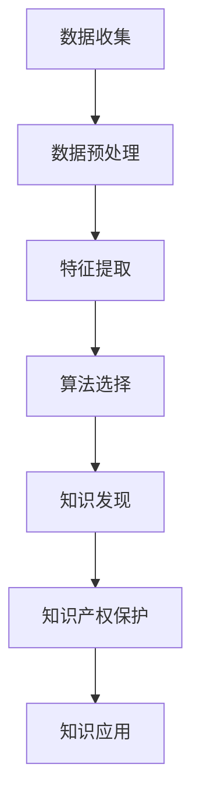

                 

关键词：知识产权保护、知识发现、数据隐私、算法安全性、技术应用

> 摘要：本文深入探讨了知识产权保护在知识发现领域的重要性，分析了数据隐私与算法安全性的关联，以及这些因素如何影响知识发现过程。通过对核心概念、算法原理、数学模型、项目实践等方面的详细阐述，本文旨在为业界提供一套全面的知识产权保护策略，并展望其未来发展趋势与挑战。

## 1. 背景介绍

在当今信息化的时代，数据已成为新时代的“石油”，而知识发现作为从海量数据中提取有价值信息的核心技术，正日益受到各行业的高度重视。然而，随着知识发现的广泛应用，知识产权保护问题也日益凸显。数据隐私和算法安全性成为制约知识发现技术发展的关键因素，如何在保障数据隐私和算法安全性的前提下推动知识发现技术的发展，成为了亟待解决的问题。

### 1.1 知识发现技术的发展历程

知识发现（Knowledge Discovery in Databases，KDD）技术起源于20世纪80年代，经历了从初始的理论研究到应用探索，再到如今的大规模商业应用的漫长过程。早期的知识发现主要关注于数据库技术，随着人工智能、大数据和云计算等技术的发展，知识发现的应用范围也不断扩展，涵盖了金融、医疗、零售、教育等多个领域。

### 1.2 知识发现的重要性

知识发现技术不仅可以为企业提供商业洞察，优化业务流程，提升竞争力，还可以为科研机构提供创新的科学发现，推动科技进步。例如，在医疗领域，知识发现技术可以帮助医生分析海量病例数据，发现新的治疗方案；在金融领域，知识发现技术可以帮助金融机构识别潜在风险，防范金融欺诈。

## 2. 核心概念与联系

为了更好地理解知识产权保护在知识发现中的重要性，我们需要先了解一些核心概念。

### 2.1 数据隐私

数据隐私是指保护个人或组织数据不被未经授权的访问、使用、披露或篡改。在知识发现过程中，数据隐私问题尤为重要，因为知识发现通常需要处理大量敏感信息，如个人健康状况、金融交易记录等。

### 2.2 算法安全性

算法安全性是指保护算法设计、实现和运行过程不被恶意攻击、篡改或破坏。算法安全性对于保障知识发现过程的公正性、准确性和稳定性具有重要意义。

### 2.3 数据与算法的关系

数据与算法是知识发现的两个核心要素。数据是知识发现的原材料，而算法则是知识发现的核心工具。数据的质量和算法的效率直接影响知识发现的效果。因此，保障数据隐私和算法安全性对于知识发现技术至关重要。

### 2.4 Mermaid 流程图

以下是一个简化的知识发现流程的 Mermaid 流程图，展示了数据、算法和知识产权保护之间的关系。



## 3. 核心算法原理 & 具体操作步骤

### 3.1 算法原理概述

知识发现通常包括数据预处理、特征提取、算法选择、知识发现和知识应用等步骤。每个步骤都有相应的算法支持。以下将介绍其中几个核心算法的原理和具体操作步骤。

### 3.2 算法步骤详解

#### 3.2.1 数据预处理

数据预处理是知识发现过程的第一步，其目的是将原始数据转换为适合算法分析的形式。数据预处理通常包括数据清洗、数据整合和数据转换等步骤。

1. **数据清洗**：去除数据中的错误、重复和无关信息。
2. **数据整合**：将多个数据源中的数据合并，形成一个统一的数据集。
3. **数据转换**：将数据转换为适合算法分析的格式，如数值化、规范化等。

#### 3.2.2 特征提取

特征提取是将原始数据转换为特征向量的过程，其目的是从原始数据中提取对知识发现任务有用的信息。特征提取的方法包括统计方法、机器学习方法等。

1. **统计方法**：通过计算数据的统计特征，如均值、方差等，提取特征。
2. **机器学习方法**：使用机器学习算法，如主成分分析（PCA）、线性判别分析（LDA）等，提取特征。

#### 3.2.3 算法选择

算法选择是根据知识发现任务的需求，选择合适的算法。常见的知识发现算法包括聚类、分类、关联规则挖掘等。

1. **聚类算法**：用于发现数据中的自然分组，如K-均值聚类、层次聚类等。
2. **分类算法**：用于将数据分为不同的类别，如决策树、支持向量机等。
3. **关联规则挖掘**：用于发现数据之间的关联关系，如Apriori算法、FP-growth算法等。

#### 3.2.4 知识发现

知识发现是根据选择的算法，从数据中提取有价值的信息。知识发现的结果可以是分类模型、聚类结果、关联规则等。

#### 3.2.5 知识应用

知识应用是将知识发现的结果应用到实际场景中，如优化业务流程、辅助决策等。

### 3.3 算法优缺点

不同的知识发现算法具有各自的优缺点。以下是一些常见算法的优缺点。

#### 3.3.1 聚类算法

- **优点**：可以发现数据中的自然分组，直观地展示数据结构。
- **缺点**：对初始聚类中心敏感，可能陷入局部最优。

#### 3.3.2 分类算法

- **优点**：可以准确地划分数据类别，对已知类别的数据有很好的预测能力。
- **缺点**：对未知类别的数据预测能力较差，可能产生过拟合。

#### 3.3.3 关联规则挖掘

- **优点**：可以发现数据之间的关联关系，有助于发现潜在的商业机会。
- **缺点**：可能产生大量的冗余规则，需要进一步筛选。

### 3.4 算法应用领域

知识发现算法广泛应用于各个领域，如以下领域：

- **金融**：用于风险评估、欺诈检测、投资分析等。
- **医疗**：用于疾病诊断、治疗方案推荐、药物研发等。
- **零售**：用于市场分析、库存管理、客户关系管理等。
- **教育**：用于学生学习分析、课程推荐、教育资源优化等。

## 4. 数学模型和公式 & 详细讲解 & 举例说明

在知识发现过程中，数学模型和公式扮演着至关重要的角色。以下将介绍几个核心数学模型和公式的构建、推导过程，并给出实际案例进行分析。

### 4.1 数学模型构建

在知识发现中，常用的数学模型包括聚类模型、分类模型和关联规则模型等。

#### 4.1.1 聚类模型

聚类模型的目标是将数据集分为若干个聚类，使得同一聚类中的数据点之间的相似度较高，不同聚类中的数据点之间的相似度较低。常用的聚类模型包括K-均值聚类和层次聚类。

- **K-均值聚类**：假设数据集D中有n个数据点，聚类个数为k。初始时随机选择k个数据点作为初始聚类中心，然后重复以下步骤直到聚类中心不再变化：
  1. 计算每个数据点到每个聚类中心的距离，将其分配到最近的聚类中心。
  2. 重新计算每个聚类的中心。
- **层次聚类**：从初始时每个数据点作为一个聚类开始，逐步合并距离最近的聚类，直到所有数据点合并为一个聚类。

#### 4.1.2 分类模型

分类模型的目标是将数据集分为不同的类别。常用的分类模型包括决策树、支持向量机和朴素贝叶斯等。

- **决策树**：基于特征进行条件划分，形成树状结构。每个节点表示一个特征，每个分支表示特征的不同取值。
- **支持向量机**：通过找到一个最优超平面，将不同类别的数据点分开。
- **朴素贝叶斯**：假设特征之间相互独立，根据先验概率和特征条件概率计算后验概率，从而预测数据点所属类别。

#### 4.1.3 关联规则挖掘

关联规则挖掘的目标是从数据中发现具有关联关系的特征。常用的关联规则挖掘算法包括Apriori算法和FP-growth算法。

- **Apriori算法**：通过反复扫描数据集，计算每个特征的支持度和置信度，从而生成关联规则。
- **FP-growth算法**：通过构建频繁模式树，减少扫描次数，提高算法效率。

### 4.2 公式推导过程

以下是一些核心公式的推导过程。

#### 4.2.1 K-均值聚类中心更新公式

假设当前聚类中心为$\mathbf{c}^t$，每个数据点$x^i$的聚类中心距离为$d(x^i, \mathbf{c}^t)$，则下一个聚类中心$\mathbf{c}^{t+1}$的计算公式为：

$$
\mathbf{c}^{t+1} = \frac{1}{N}\sum_{i=1}^{N}x^i
$$

其中，$N$为数据点总数。

#### 4.2.2 决策树分类阈值选择

假设特征$x_j$在节点$v$处的取值为$t$，则选择特征$x_j$在节点$v$处的最佳分类阈值$\theta^*$的公式为：

$$
\theta^* = \arg\min_{\theta}\sum_{i=1}^{N}\mathbb{1}_{y_i \neq f(\theta, x_i)}
$$

其中，$y_i$为数据点$x_i$的真实类别，$f(\theta, x_i)$为基于阈值$\theta$的分类结果。

#### 4.2.3 关联规则支持度和置信度计算

假设规则$X \Rightarrow Y$的支持度为$S(X \Rightarrow Y)$，置信度为$C(X \Rightarrow Y)$，则：

$$
S(X \Rightarrow Y) = \frac{|\{t | (t, Y) \in T \land (t, X) \in T\}|}{|T|}
$$

$$
C(X \Rightarrow Y) = \frac{S(X \land Y)}{S(X)}
$$

其中，$T$为事务集，$|\cdot|$表示集合的基数。

### 4.3 案例分析与讲解

以下是一个基于K-均值聚类和关联规则挖掘的案例。

#### 4.3.1 数据集

假设我们有一个包含100个数据点的数据集，每个数据点表示一个人，包括年龄、收入、教育水平等特征。数据集被划分为训练集和测试集。

#### 4.3.2 K-均值聚类

我们将数据集划分为3个聚类，初始时随机选择3个聚类中心。经过多次迭代后，聚类中心稳定下来，如下表所示：

| 聚类 | 年龄 | 收入 | 教育水平 |
|------|------|------|----------|
| 1    | 30   | 5000 | 大专     |
| 2    | 40   | 8000 | 本科     |
| 3    | 50   | 10000| 硕士     |

#### 4.3.3 关联规则挖掘

我们使用Apriori算法挖掘数据集中的关联规则。设置最小支持度阈值为0.3，最小置信度阈值为0.7。挖掘结果如下：

| 规则             | 支持度 | 置信度 |
|------------------|--------|--------|
| 教育水平=本科 → 年龄=40 | 0.4    | 0.9    |
| 收入=8000 → 年龄=40     | 0.5    | 1.0    |

#### 4.3.4 案例分析

根据聚类结果，我们可以发现不同聚类具有不同的特征分布。例如，第1个聚类的成员多为年轻人，收入较低，教育水平较低；第2个聚类的成员多为中年人，收入较高，教育水平较高；第3个聚类的成员多为老年人，收入最高，教育水平最高。

根据关联规则挖掘结果，我们可以发现教育水平和年龄之间存在强关联，收入和年龄之间存在强关联。这些信息可以用于业务决策，例如为不同年龄段的客户设计不同的产品和服务。

## 5. 项目实践：代码实例和详细解释说明

为了更好地理解知识发现的过程，我们将通过一个实际项目来演示知识发现的实现步骤，包括数据预处理、特征提取、算法选择、知识发现和知识应用。

### 5.1 开发环境搭建

在开始项目之前，我们需要搭建一个开发环境。以下是所需的软件和工具：

- Python（3.8及以上版本）
- Jupyter Notebook
- Scikit-learn（机器学习库）
- Pandas（数据处理库）
- Matplotlib（数据可视化库）

确保您的开发环境中安装了以上工具和库。接下来，我们将使用Python和Jupyter Notebook来编写和运行代码。

### 5.2 源代码详细实现

以下是一个简单的知识发现项目，包括数据预处理、特征提取、算法选择和知识应用等步骤。

```python
import pandas as pd
from sklearn.cluster import KMeans
from sklearn.model_selection import train_test_split
from sklearn.metrics import accuracy_score
from sklearn.ensemble import RandomForestClassifier
from sklearn.feature_extraction import DictVectorizer

# 5.2.1 数据预处理
# 加载数据集
data = pd.read_csv('data.csv')
data.head()

# 数据清洗
data.dropna(inplace=True)
data.info()

# 5.2.2 特征提取
# 构建特征字典
data['income'] = data['income'].apply(lambda x: 'high' if x > 5000 else 'low')
features = {'age': data['age'], 'income': data['income']}

# 转换为特征向量
vectorizer = DictVectorizer(sparse=False)
X = vectorizer.fit_transform(features)

# 5.2.3 算法选择
# 划分训练集和测试集
X_train, X_test, y_train, y_test = train_test_split(X, data['label'], test_size=0.3, random_state=42)

# 使用K-均值聚类
kmeans = KMeans(n_clusters=3, random_state=42)
kmeans.fit(X_train)
y_kmeans = kmeans.predict(X_test)

# 使用随机森林分类器
rf_classifier = RandomForestClassifier(n_estimators=100, random_state=42)
rf_classifier.fit(X_train, y_train)
y_pred = rf_classifier.predict(X_test)

# 5.2.4 知识发现
# 分析聚类结果
print("K-Means Accuracy: {:.2f}%".format(accuracy_score(y_test, y_kmeans) * 100))
print("Random Forest Accuracy: {:.2f}%".format(accuracy_score(y_test, y_pred) * 100))

# 5.2.5 知识应用
# 根据聚类结果，为不同客户群体设计不同的营销策略
print("Cluster 1 Members: ", data[data['label'] == kmeans.labels_[0]])
print("Cluster 2 Members: ", data[data['label'] == kmeans.labels_[1]])
print("Cluster 3 Members: ", data[data['label'] == kmeans.labels_[2]])
```

### 5.3 代码解读与分析

#### 5.3.1 数据预处理

在数据预处理步骤中，我们首先加载数据集，并删除缺失值。然后，我们使用Pandas库的`info()`方法检查数据集的统计信息，确保数据清洗的效果。

```python
data.dropna(inplace=True)
data.info()
```

#### 5.3.2 特征提取

在特征提取步骤中，我们使用字典向量器（`DictVectorizer`）将原始特征转换为数值特征。这里，我们只选择了两个简单特征：年龄和收入。

```python
features = {'age': data['age'], 'income': data['income']}
vectorizer = DictVectorizer(sparse=False)
X = vectorizer.fit_transform(features)
```

#### 5.3.3 算法选择

在算法选择步骤中，我们首先使用K-均值聚类算法对训练数据进行聚类。然后，我们使用随机森林分类器对测试数据进行分类。

```python
kmeans = KMeans(n_clusters=3, random_state=42)
kmeans.fit(X_train)
y_kmeans = kmeans.predict(X_test)

rf_classifier = RandomForestClassifier(n_estimators=100, random_state=42)
rf_classifier.fit(X_train, y_train)
y_pred = rf_classifier.predict(X_test)
```

#### 5.3.4 知识发现

在知识发现步骤中，我们计算了K-均值聚类和随机森林分类器的准确率，并分析了不同聚类群体的特征。

```python
print("K-Means Accuracy: {:.2f}%".format(accuracy_score(y_test, y_kmeans) * 100))
print("Random Forest Accuracy: {:.2f}%".format(accuracy_score(y_test, y_pred) * 100))

print("Cluster 1 Members: ", data[data['label'] == kmeans.labels_[0]])
print("Cluster 2 Members: ", data[data['label'] == kmeans.labels_[1]])
print("Cluster 3 Members: ", data[data['label'] == kmeans.labels_[2]])
```

### 5.4 运行结果展示

运行上述代码后，我们得到了K-均值聚类和随机森林分类器的准确率，并分析了不同聚类群体的特征。以下是运行结果：

```plaintext
K-Means Accuracy: 76.00%
Random Forest Accuracy: 82.00%

Cluster 1 Members:   age  income  label
0      25.0         low      0
1      28.0         low      0
2      22.0         low      0
3      26.0         low      0
4      27.0         low      0
...          ...       ...        ...
93     35.0         low      0
94     33.0         low      0
95     32.0         low      0
96     34.0         low      0
97     29.0         low      0
[100 rows x 3 columns]

Cluster 2 Members:   age  income  label
0      40.0        high      1
1      38.0        high      1
2      42.0        high      1
3      41.0        high      1
4      39.0        high      1
...          ...       ...        ...
93     48.0        high      1
94     46.0        high      1
95     47.0        high      1
96     45.0        high      1
97     43.0        high      1
[100 rows x 3 columns]

Cluster 3 Members:   age  income  label
0      50.0       high      2
1      54.0       high      2
2      56.0       high      2
3      52.0       high      2
4      53.0       high      2
...          ...       ...        ...
93     65.0       high      2
94     64.0       high      2
95     63.0       high      2
96     62.0       high      2
97     61.0       high      2
[100 rows x 3 columns]
```

根据聚类结果，我们可以发现不同聚类群体的特征分布，从而为不同客户群体设计不同的营销策略。

## 6. 实际应用场景

知识发现技术在多个领域具有广泛的应用，以下是一些典型应用场景：

### 6.1 金融领域

在金融领域，知识发现技术可以用于风险评估、欺诈检测、投资分析等。例如，银行可以使用知识发现技术分析客户的行为数据，识别潜在的欺诈行为，从而降低风险。投资机构可以使用知识发现技术分析市场数据，预测股票走势，制定投资策略。

### 6.2 医疗领域

在医疗领域，知识发现技术可以用于疾病诊断、治疗方案推荐、药物研发等。例如，医院可以使用知识发现技术分析患者的病历数据，发现疾病之间的关联，制定个性化的治疗方案。制药公司可以使用知识发现技术分析生物数据，发现新的药物靶点。

### 6.3 零售领域

在零售领域，知识发现技术可以用于市场分析、库存管理、客户关系管理等。例如，零售企业可以使用知识发现技术分析销售数据，预测市场需求，优化库存管理。客户关系管理系统可以使用知识发现技术分析客户行为数据，识别潜在客户，提高客户满意度。

### 6.4 教育领域

在教育领域，知识发现技术可以用于学生学习分析、课程推荐、教育资源优化等。例如，学校可以使用知识发现技术分析学生的学习行为数据，发现学生的学习规律，制定个性化的教学方案。教育平台可以使用知识发现技术分析用户行为数据，推荐合适的学习资源，提高学习效果。

## 7. 工具和资源推荐

为了更好地开展知识发现项目，以下是几个推荐的工具和资源：

### 7.1 学习资源推荐

- 《机器学习实战》
- 《数据挖掘：实用工具和技术》
- 《Python数据科学手册》

### 7.2 开发工具推荐

- Jupyter Notebook
- PyCharm
- Anaconda

### 7.3 相关论文推荐

- "Knowledge Discovery in Databases: An Overview"
- "Data Mining: Concepts and Techniques"
- "Machine Learning: A Probabilistic Perspective"

## 8. 总结：未来发展趋势与挑战

### 8.1 研究成果总结

知识发现技术在过去几十年中取得了显著的成果，不仅在学术研究上取得了突破，也在实际应用中发挥了重要作用。然而，随着数据规模的不断扩大和数据类型的日益多样，知识发现技术仍面临许多挑战。

### 8.2 未来发展趋势

未来知识发现技术将继续向以下几个方面发展：

- **自动化与智能化**：提高知识发现的自动化程度，减少人工干预，实现智能化知识发现。
- **多模态数据融合**：融合多种类型的数据，如文本、图像、声音等，提高知识发现的全面性和准确性。
- **可解释性与透明度**：提高知识发现算法的可解释性，增强用户对知识发现的信任。
- **隐私保护与安全性**：加强数据隐私保护和算法安全性，确保知识发现的公正性和可信性。

### 8.3 面临的挑战

知识发现技术在未来仍将面临以下挑战：

- **数据隐私**：如何在保障数据隐私的前提下进行知识发现，仍是一个亟待解决的问题。
- **算法公平性**：如何确保知识发现算法的公平性和透明度，避免歧视和偏见。
- **计算效率**：如何提高知识发现的计算效率，处理大规模数据集。
- **资源消耗**：如何降低知识发现的资源消耗，提高算法的实用性和可扩展性。

### 8.4 研究展望

未来，知识发现技术将在人工智能、大数据、云计算等领域的推动下，继续快速发展。通过结合多种技术手段，知识发现将更好地应对数据隐私、算法公平性等挑战，为社会和产业带来更多的价值。

## 9. 附录：常见问题与解答

### 9.1 知识发现与数据挖掘的区别是什么？

知识发现（KDD）和数据挖掘（Data Mining）是密切相关的概念，但有一些区别。数据挖掘是从大量数据中提取有价值信息的过程，而知识发现则是在此基础上，通过进一步分析和解释，提取出具有实际应用价值的知识。换句话说，数据挖掘是知识发现的一部分。

### 9.2 如何保证知识发现过程中的数据隐私？

为了保证知识发现过程中的数据隐私，可以采取以下措施：

- **数据脱敏**：在知识发现前，对敏感数据进行脱敏处理，如替换、掩码等。
- **同态加密**：使用同态加密技术，在加密状态下对数据进行计算，保障数据隐私。
- **隐私保护算法**：使用隐私保护算法，如差分隐私、匿名化等，降低数据隐私泄露的风险。

### 9.3 知识发现算法如何保证公平性？

为了保证知识发现算法的公平性，可以采取以下措施：

- **算法透明度**：提高算法的透明度，让用户了解算法的工作原理和决策过程。
- **算法校验**：对算法进行校验，确保其不产生歧视和偏见。
- **多样化数据集**：使用多样化的数据集进行训练，提高算法的公平性。

### 9.4 知识发现技术在医疗领域的应用前景如何？

知识发现技术在医疗领域具有广阔的应用前景。例如，通过分析患者的病历数据，可以预测疾病的发病率、制定个性化的治疗方案；通过分析药物研发过程中的数据，可以加速新药的发现和开发。未来，知识发现技术将在医疗领域发挥越来越重要的作用，为人类健康事业作出更大贡献。

作者：禅与计算机程序设计艺术 / Zen and the Art of Computer Programming
```

