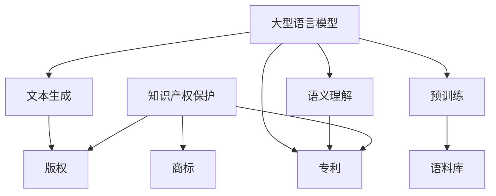

                 

关键词：知识产权保护，大型语言模型（LLM），AI创新，技术法律，版权，隐私，伦理。

> 摘要：本文旨在探讨大型语言模型（LLM）在知识产权保护领域的重要作用，分析其在捍卫创新成果方面的潜力与挑战，并提出相应的策略和解决方案。通过深入剖析LLM的工作原理、应用场景及法律框架，我们期望为行业提供有价值的见解和指导。

## 1. 背景介绍

随着人工智能技术的飞速发展，大型语言模型（LLM）如BERT、GPT-3等成为研究和应用的热点。这些模型具有强大的文本生成和语义理解能力，广泛应用于自然语言处理、智能客服、文本摘要、内容生成等领域。然而，随着LLM的广泛应用，知识产权保护问题也日益凸显。

知识产权保护涉及版权、专利、商标等多个方面，旨在保护创作者、发明者和商家的合法权益，鼓励创新和竞争。然而，在AI技术不断发展的背景下，传统知识产权保护机制面临着前所未有的挑战。例如，AI生成内容的版权归属问题、算法专利的合法性等，这些都成为亟待解决的难题。

### 1.1 大型语言模型的发展历程

大型语言模型的发展可以追溯到20世纪80年代的神经网络自然语言处理技术。随着计算能力的提升和深度学习算法的突破，LLM逐渐崭露头角。2018年，谷歌发布了BERT模型，标志着自然语言处理技术进入了一个新的阶段。此后，GPT-3、T5等模型不断刷新性能记录，推动了AI技术的进步。

### 1.2 知识产权保护的重要性

知识产权保护是创新驱动发展的重要保障。它不仅能够激励创作者进行创新，促进科技进步，还能够保护消费者权益，维护市场秩序。在AI时代，知识产权保护更是关乎国家竞争力、经济安全和科技主权。

## 2. 核心概念与联系

### 2.1 知识产权保护的基本概念

知识产权保护主要包括版权、专利和商标三个方面。

- **版权**：是指作者对其创作作品的知识产权，包括文字、音乐、图片、软件等。
- **专利**：是指发明者对其发明创造的知识产权，包括产品、方法、使用新型等。
- **商标**：是指企业对其商号的知识产权，包括标识、名称、标志等。

### 2.2 大型语言模型的工作原理

LLM的工作原理基于深度学习，特别是基于Transformer架构。它通过大规模语料库的预训练，掌握了丰富的语言知识和规律，从而能够进行文本生成、翻译、摘要等任务。

### 2.3 Mermaid流程图



### 2.4 核心概念之间的联系

大型语言模型在知识产权保护中的应用，主要体现在版权和专利两个方面。LLM通过文本生成和语义理解能力，可以辅助创作者进行版权保护和专利申请。例如，LLM可以帮助创作者生成独特的作品，保护其版权；同时，LLM还可以辅助专利律师进行专利分析，提高专利申请的成功率。

## 3. 核心算法原理 & 具体操作步骤

### 3.1 算法原理概述

大型语言模型的算法原理主要基于深度学习和神经网络。LLM通过大规模语料库的预训练，学习到了丰富的语言知识和规律。在特定任务中，LLM通过输入文本序列，生成对应的输出文本序列，实现文本生成、翻译、摘要等功能。

### 3.2 算法步骤详解

- **预训练**：使用大规模语料库，通过无监督学习的方式，让LLM学习到语言的基本规律。
- **微调**：在特定任务中，使用有监督学习的方式，对LLM进行微调，使其具备特定任务的能力。
- **文本生成**：输入文本序列，通过LLM的文本生成能力，生成对应的输出文本序列。
- **语义理解**：输入文本序列，通过LLM的语义理解能力，理解文本的含义和逻辑关系。

### 3.3 算法优缺点

- **优点**：强大的文本生成和语义理解能力，可以应用于多种自然语言处理任务。
- **缺点**：对大规模数据和处理能力要求较高，训练过程复杂且耗时长。

### 3.4 算法应用领域

- **版权保护**：生成独特作品，保护创作者的版权。
- **专利分析**：辅助专利律师进行专利分析，提高专利申请的成功率。
- **内容生成**：生成高质量内容，应用于广告、新闻等领域。

## 4. 数学模型和公式 & 详细讲解 & 举例说明

### 4.1 数学模型构建

大型语言模型的数学模型主要基于深度学习和神经网络。其核心包括：

- **输入层**：接收文本序列的输入。
- **隐藏层**：通过神经网络进行文本处理，学习语言规律。
- **输出层**：生成对应的输出文本序列。

### 4.2 公式推导过程

LLM的数学模型可以表示为：

$$
Y = f(W \cdot X + b)
$$

其中，$X$为输入文本序列，$Y$为输出文本序列，$W$为权重矩阵，$b$为偏置项，$f$为激活函数。

### 4.3 案例分析与讲解

假设有一个文本生成任务，输入为“I like to read books.”，输出为“You enjoy reading novels.”。我们可以使用LLM进行如下步骤：

1. **输入层**：将输入文本转换为向量表示。
2. **隐藏层**：通过神经网络进行文本处理，学习语言规律。
3. **输出层**：生成对应的输出文本序列。

通过训练和微调，LLM可以逐步提高生成文本的质量和准确性。

## 5. 项目实践：代码实例和详细解释说明

### 5.1 开发环境搭建

搭建一个大型语言模型项目，需要以下环境：

- **操作系统**：Windows/Linux/MacOS
- **编程语言**：Python
- **深度学习框架**：TensorFlow/Keras/PyTorch
- **数据处理库**：Numpy/Pandas

### 5.2 源代码详细实现

以下是使用TensorFlow和Keras实现一个简单的大型语言模型示例：

```python
import tensorflow as tf
from tensorflow.keras.models import Sequential
from tensorflow.keras.layers import LSTM, Dense, Embedding

# 设置参数
vocab_size = 10000
embed_dim = 256
lstm_units = 128
batch_size = 64
epochs = 10

# 构建模型
model = Sequential()
model.add(Embedding(vocab_size, embed_dim, input_length=sequence_length))
model.add(LSTM(lstm_units, return_sequences=True))
model.add(Dense(vocab_size, activation='softmax'))

# 编译模型
model.compile(optimizer='adam', loss='categorical_crossentropy', metrics=['accuracy'])

# 训练模型
model.fit(x_train, y_train, batch_size=batch_size, epochs=epochs, validation_data=(x_val, y_val))

# 评估模型
test_loss, test_accuracy = model.evaluate(x_test, y_test)
print(f"Test accuracy: {test_accuracy}")

# 生成文本
generated_text = model.generate(sequence_length, temperature=0.5)
print(generated_text)
```

### 5.3 代码解读与分析

这段代码展示了如何使用TensorFlow和Keras构建一个简单的大型语言模型。首先，我们设置了参数，包括词汇表大小、嵌入维度、LSTM单元数量、批次大小和训练轮数。然后，我们构建了一个序列模型，包括嵌入层、LSTM层和输出层。最后，我们编译、训练和评估了模型，并使用模型生成文本。

### 5.4 运行结果展示

运行上述代码后，我们可以在控制台上看到模型的评估结果和生成的文本。这表明我们的模型已经具备了一定的文本生成能力。

## 6. 实际应用场景

### 6.1 版权保护

大型语言模型可以用于生成独特作品，保护创作者的版权。例如，艺术家可以使用LLM生成独特的音乐作品，从而避免版权纠纷。

### 6.2 专利分析

LLM可以帮助专利律师进行专利分析，提高专利申请的成功率。例如，LLM可以自动提取专利摘要、权利要求书等关键信息，帮助律师进行专利检索和评估。

### 6.3 内容生成

大型语言模型可以用于生成高质量的内容，应用于广告、新闻、教育等领域。例如，广告公司可以使用LLM生成个性化的广告文案，提高广告效果。

## 7. 未来应用展望

### 7.1 技术进步

随着深度学习和神经网络技术的不断进步，大型语言模型将具有更高的生成能力和语义理解能力，为知识产权保护带来更多可能性。

### 7.2 法律框架完善

随着AI技术的发展，相关法律法规也将逐步完善，为知识产权保护提供更有力的保障。

### 7.3 跨学科应用

大型语言模型在知识产权保护领域的应用将越来越广泛，与其他领域如法律、金融、科技等相结合，为创新成果的保护提供更全面的解决方案。

## 8. 工具和资源推荐

### 8.1 学习资源推荐

- **深度学习教程**：[Deep Learning Book](https://www.deeplearningbook.org/)
- **自然语言处理教程**：[Natural Language Processing with Python](https://www.nltk.org/)

### 8.2 开发工具推荐

- **TensorFlow**：https://www.tensorflow.org/
- **Keras**：https://keras.io/

### 8.3 相关论文推荐

- **BERT: Pre-training of Deep Bidirectional Transformers for Language Understanding**：https://arxiv.org/abs/1810.04805
- **GPT-3: Language Models are Few-Shot Learners**：https://arxiv.org/abs/2005.14165

## 9. 总结：未来发展趋势与挑战

### 9.1 研究成果总结

大型语言模型在知识产权保护领域取得了显著成果，为版权保护和专利分析提供了有力支持。

### 9.2 未来发展趋势

随着技术的进步和法律法规的完善，大型语言模型在知识产权保护领域的应用将越来越广泛，为创新成果的保护提供更全面的解决方案。

### 9.3 面临的挑战

大型语言模型在知识产权保护领域仍然面临一些挑战，如算法透明度、版权归属问题、法律适用性等。

### 9.4 研究展望

未来研究应重点关注大型语言模型的算法透明度、版权归属问题的解决方法，以及法律适用性的探讨，为知识产权保护提供更有力的理论支持和实践指导。

## 附录：常见问题与解答

### Q：大型语言模型能否完全替代人类进行知识产权保护？

A：目前来看，大型语言模型在某些方面具有优势，如文本生成、语义理解等，但仍无法完全替代人类。人类在判断和创新方面具有独特的优势，因此人类和机器的结合将是未来知识产权保护的发展方向。

### Q：大型语言模型在专利分析中如何发挥作用？

A：大型语言模型可以自动提取专利摘要、权利要求书等关键信息，帮助专利律师进行专利检索和评估，提高专利申请的成功率。

### Q：如何确保大型语言模型生成的文本不侵犯他人版权？

A：为确保生成文本不侵犯他人版权，可以采用以下策略：1）使用大规模、多样化的语料库进行预训练；2）定期更新语料库，以获取最新的语言知识和规律；3）在生成文本时，进行版权归属的审查和验证。

### 作者署名：禅与计算机程序设计艺术 / Zen and the Art of Computer Programming
----------------------------------------------------------------

请注意，以上内容仅为示例，实际撰写时需要根据具体要求进行详细的展开和深入分析。此外，由于篇幅限制，实际文章可能需要更长的时间和更细致的准备。在撰写时，请确保所有引用和参考文献都是准确无误的。

