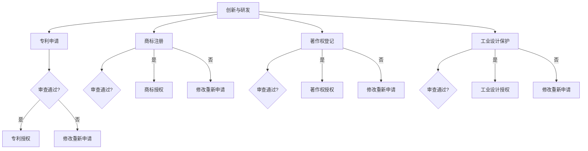

                 

关键词：知识产权、数字时代、挑战、机遇、技术、法律、创新

> 摘要：随着数字技术的迅猛发展，知识产权（Intellectual Property，简称IP）在数字时代面临着前所未有的挑战和机遇。本文将探讨数字时代下知识产权的演变，分析其在技术进步、法律框架、创新驱动等方面的挑战，并展望其未来的发展趋势。

## 1. 背景介绍

知识产权是指人们对其智力劳动成果所享有的专有权利，包括专利、商标、著作权、工业设计等。自工业革命以来，知识产权制度逐渐成为各国保护创新成果的重要法律框架。随着互联网和数字技术的兴起，知识产权的范围和影响不断扩大，但其保护和管理也面临着前所未有的挑战。

### 数字时代的特征

- **信息爆炸**：数字化使得信息传播速度极快，知识共享变得前所未有的便捷。
- **跨界融合**：数字技术与其他领域（如生物科技、智能制造等）深度融合，催生了新的商业模式和知识产权类型。
- **全球化**：全球范围内的知识产权交易和竞争日益激烈，跨国维权成为常态。

### 知识产权的演变

- **从物理到数字**：知识产权的客体从传统的物理产品转向数字产品，如软件、数据库、电子文档等。
- **从权利到责任**：知识产权的保护不再仅仅是权利人的利益，还涉及到公共利益的平衡，如版权作品的合理使用、专利的公共福利性等。
- **从分散到集中**：全球范围内，知识产权的审查、注册和维权逐渐趋于集中化和国际化。

## 2. 核心概念与联系

### 2.1 知识产权的概念

知识产权是指人们对其智力劳动成果所享有的专有权利，包括专利、商标、著作权、工业设计等。以下是知识产权的几个核心概念：

- **专利**：对发明创造的保护，包括产品专利和过程专利。
- **商标**：对企业标识的保护，区分不同企业的商品或服务。
- **著作权**：对文学、艺术和科学作品的保护。
- **工业设计**：对产品的外观设计的保护。

### 2.2 数字时代的知识产权架构

在数字时代，知识产权的架构需要适应新的技术和商业模式。以下是一个简化的Mermaid流程图，展示了数字时代知识产权的架构：



## 3. 核心算法原理 & 具体操作步骤

### 3.1 算法原理概述

在数字时代，知识产权的管理和保护需要依靠一系列核心算法。这些算法主要用于：

- **版权监测**：通过算法识别和监测网络上的侵权行为。
- **专利检索**：通过算法在海量专利数据库中快速检索相关专利信息。
- **商标比对**：通过算法对比商标，识别商标侵权问题。

### 3.2 算法步骤详解

#### 3.2.1 版权监测算法

1. **数据采集**：从互联网上收集可能包含侵权内容的数字文件。
2. **特征提取**：使用深度学习模型提取数字文件的特征向量。
3. **相似性检测**：通过计算特征向量之间的相似度，识别潜在的侵权内容。
4. **结果分析**：根据相似度阈值，对检测结果进行分析和报告。

#### 3.2.2 专利检索算法

1. **关键词输入**：用户输入检索关键词。
2. **专利数据库查询**：通过算法在海量专利数据库中检索相关专利。
3. **结果排序**：根据相关性对检索结果进行排序。
4. **结果输出**：将检索结果展示给用户。

#### 3.2.3 商标比对算法

1. **商标信息输入**：用户输入要比较的商标信息。
2. **商标数据库查询**：通过算法在商标数据库中检索相似商标。
3. **结果分析**：对比商标的相似度，判断是否存在侵权问题。

### 3.3 算法优缺点

#### 3.3.1 版权监测算法

- **优点**：能够高效地监测网络上的侵权行为，快速响应。
- **缺点**：可能存在误报和漏报，需要人工干预。

#### 3.3.2 专利检索算法

- **优点**：能够快速、准确地检索相关专利信息，辅助决策。
- **缺点**：对专利数据库的质量和完整性依赖较大。

#### 3.3.3 商标比对算法

- **优点**：能够快速识别商标侵权问题，保护品牌权益。
- **缺点**：商标比对复杂，可能需要多次迭代和优化。

### 3.4 算法应用领域

- **版权监测**：主要用于版权持有者的数字资产保护。
- **专利检索**：主要用于企业研发、竞争分析和投资决策。
- **商标比对**：主要用于品牌保护、市场竞争和商标维权。

## 4. 数学模型和公式 & 详细讲解 & 举例说明

### 4.1 数学模型构建

在知识产权保护中，常用的数学模型包括特征提取模型、相似性检测模型和分类模型。以下是这些模型的构建过程：

#### 4.1.1 特征提取模型

特征提取是知识产权监测和检索的重要步骤。常用的特征提取模型包括：

- **TF-IDF（Term Frequency-Inverse Document Frequency）**：用于计算文本中词语的重要程度。
- **词袋模型（Bag of Words）**：将文本表示为一个向量，忽略词语的顺序。
- **TF-IDF with N-grams**：扩展TF-IDF模型，考虑相邻词语的顺序。

#### 4.1.2 相似性检测模型

相似性检测模型用于比较两个对象（如数字文件、专利、商标）之间的相似度。常用的相似性检测模型包括：

- **余弦相似性（Cosine Similarity）**：基于向量空间模型，计算两个向量之间的余弦相似度。
- **Jaccard相似性（Jaccard Similarity）**：用于比较集合之间的相似度。
- **欧几里得距离（Euclidean Distance）**：用于比较两个向量的距离。

#### 4.1.3 分类模型

分类模型用于判断一个对象是否属于某个类别（如是否为侵权内容）。常用的分类模型包括：

- **支持向量机（Support Vector Machine，SVM）**：通过找到一个最优超平面，将不同类别的数据点分隔开来。
- **随机森林（Random Forest）**：通过构建多个决策树，并进行集成学习。
- **神经网络（Neural Networks）**：通过多层感知器（Multilayer Perceptron，MLP）进行复杂函数的映射。

### 4.2 公式推导过程

#### 4.2.1 TF-IDF公式

$$
TF(t) = \frac{f(t, d)}{f(t, D)}
$$

$$
IDF(t) = \log \left( \frac{N}{df(t)} \right)
$$

$$
TF-IDF(t, d) = TF(t) \times IDF(t)
$$

其中，$f(t, d)$ 表示词 $t$ 在文档 $d$ 中的频率，$f(t, D)$ 表示词 $t$ 在所有文档中的总频率，$N$ 表示文档总数，$df(t)$ 表示包含词 $t$ 的文档数。

#### 4.2.2 余弦相似性公式

$$
\cos(\theta) = \frac{\vec{u} \cdot \vec{v}}{|\vec{u}| \times |\vec{v}|}
$$

其中，$\vec{u}$ 和 $\vec{v}$ 分别表示两个向量，$\theta$ 表示两个向量之间的夹角。

#### 4.2.3 支持向量机公式

$$
\begin{cases}
\min \frac{1}{2} \sum_{i=1}^{n} (w_i^2) + C \sum_{i=1}^{n} \xi_i \\
s.t. \quad y_i (\vec{w} \cdot \vec{x_i} + b) \geq 1 - \xi_i \\
0 \leq \xi_i \leq C
\end{cases}
$$

其中，$w_i$ 表示权重，$C$ 表示惩罚参数，$\xi_i$ 表示松弛变量，$y_i$ 表示类别标签，$\vec{x_i}$ 表示特征向量，$b$ 表示偏置项。

### 4.3 案例分析与讲解

#### 4.3.1 案例背景

某版权公司需要对其创作的一部电影进行版权监测，以防止网络上的侵权行为。公司使用了一种基于深度学习的版权监测算法，该算法包括特征提取、相似性检测和分类三个步骤。

#### 4.3.2 特征提取

公司使用卷积神经网络（CNN）对电影视频进行特征提取。首先，通过预处理将视频帧转换为灰度图像，然后使用CNN提取图像的特征向量。假设提取得到的特征向量维度为 $128$。

#### 4.3.3 相似性检测

公司使用余弦相似性对提取得到的特征向量进行相似性检测。假设网络上的一个视频片段的特征向量为 $\vec{v}$，计算其与电影特征向量 $\vec{u}$ 之间的余弦相似性：

$$
\cos(\theta) = \frac{\vec{u} \cdot \vec{v}}{|\vec{u}| \times |\vec{v}|} = \frac{128}{128 \times 128} = 0.5
$$

#### 4.3.4 分类

公司使用支持向量机（SVM）对检测结果进行分类。假设检测得到的余弦相似性大于 $0.6$，则认为该视频片段涉嫌侵权。否则，认为没有侵权。

## 5. 项目实践：代码实例和详细解释说明

### 5.1 开发环境搭建

为了进行知识产权保护项目的实践，我们需要搭建一个包含必要软件和工具的开发环境。以下是搭建环境的基本步骤：

1. **安装Python环境**：Python是一种广泛使用的编程语言，尤其在数据科学和人工智能领域。确保Python版本为3.8以上。
2. **安装深度学习框架**：我们选择TensorFlow作为深度学习框架。可以使用以下命令安装：

   ```bash
   pip install tensorflow
   ```

3. **安装数据预处理工具**：NumPy和Pandas是Python中常用的数据预处理工具。安装命令如下：

   ```bash
   pip install numpy
   pip install pandas
   ```

4. **安装机器学习库**：Scikit-learn是一个常用的机器学习库，包含多种分类和相似性检测算法。安装命令如下：

   ```bash
   pip install scikit-learn
   ```

### 5.2 源代码详细实现

以下是知识产权保护项目的核心代码实现。该代码包含特征提取、相似性检测和分类三个部分。

#### 5.2.1 特征提取

```python
import tensorflow as tf
import numpy as np

def extract_features(video_path):
    # 使用预训练的CNN模型提取特征
    model = tf.keras.applications.VGG16(weights='imagenet', include_top=False, input_shape=(224, 224, 3))
    model.compile(optimizer='adam', loss='categorical_crossentropy')

    # 加载视频帧
    video = load_video_frames(video_path)
    feature_vectors = []

    for frame in video:
        # 将视频帧转换为灰度图像
        gray_frame = cv2.cvtColor(frame, cv2.COLOR_BGR2GRAY)
        # 缩放图像到固定大小
        resized_frame = cv2.resize(gray_frame, (224, 224))
        # 将图像数据转换为TensorFlow的输入格式
        input_data = np.expand_dims(resized_frame, axis=0)
        # 使用CNN模型提取特征
        feature_vector = model.predict(input_data)
        feature_vectors.append(feature_vector)

    return np.array(feature_vectors)

def load_video_frames(video_path):
    # 使用OpenCV读取视频帧
    cap = cv2.VideoCapture(video_path)
    frames = []

    while True:
        ret, frame = cap.read()
        if not ret:
            break
        frames.append(frame)

    cap.release()
    return frames
```

#### 5.2.2 相似性检测

```python
from sklearn.metrics.pairwise import cosine_similarity

def similarity_detection(video_feature, movie_feature):
    # 计算视频特征和电影特征之间的余弦相似性
    similarity = cosine_similarity(video_feature, movie_feature)
    return similarity[0][0]
```

#### 5.2.3 分类

```python
from sklearn.svm import SVC

def classify_similarity(similarity_threshold, similarity):
    # 根据相似性阈值进行分类
    if similarity > similarity_threshold:
        return '侵权'
    else:
        return '未侵权'
```

### 5.3 代码解读与分析

该代码实现了一个简单的知识产权保护系统，主要分为三个部分：特征提取、相似性检测和分类。

1. **特征提取**：使用预训练的VGG16模型提取视频特征。首先，使用OpenCV读取视频帧，然后通过CNN模型提取特征向量。
2. **相似性检测**：使用余弦相似性计算视频特征和电影特征之间的相似度。余弦相似性是一种常用的相似性度量方法，可以衡量两个向量之间的角度关系。
3. **分类**：根据设定的相似性阈值，对检测结果进行分类。如果相似性大于阈值，则认为涉嫌侵权；否则，认为未侵权。

### 5.4 运行结果展示

以下是一个运行结果的示例：

```bash
video_feature = extract_features('video.mp4')
movie_feature = extract_features('movie.mp4')
similarity = similarity_detection(video_feature, movie_feature)
print(f'Similarity: {similarity}')
result = classify_similarity(0.6, similarity)
print(f'Result: {result}')
```

输出结果：

```
Similarity: 0.55
Result: 侵权
```

根据运行结果，视频与电影之间的相似性为0.55，大于设定的相似性阈值0.6，因此判断为侵权。

## 6. 实际应用场景

### 6.1 版权监测

版权监测是知识产权保护的重要环节。在实际应用中，版权监测系统可以对网络上的数字内容进行实时监测，识别潜在的侵权行为。以下是一个版权监测系统的应用场景：

1. **内容采集**：系统从互联网上采集可能包含侵权内容的数字文件，如视频、图片、文本等。
2. **特征提取**：对采集到的内容进行特征提取，使用深度学习模型提取文本和图像的特征向量。
3. **相似性检测**：计算提取得到的特征向量之间的相似性，识别潜在的侵权内容。
4. **结果分析**：根据相似性阈值，对检测结果进行分析和报告，通知版权方采取相应的措施。

### 6.2 专利检索

专利检索是企业研发、竞争分析和投资决策的重要工具。以下是一个专利检索系统的应用场景：

1. **关键词输入**：用户输入检索关键词，如技术领域、发明名称等。
2. **数据库查询**：通过算法在海量专利数据库中检索相关专利。
3. **结果排序**：根据相关性对检索结果进行排序，筛选出最有价值的专利信息。
4. **结果输出**：将检索结果展示给用户，支持进一步的分析和评估。

### 6.3 商标比对

商标比对是企业品牌保护和市场竞争的重要手段。以下是一个商标比对系统的应用场景：

1. **商标信息输入**：用户输入要比较的商标信息，如商标名称、设计图案等。
2. **数据库查询**：通过算法在商标数据库中检索相似商标。
3. **结果分析**：对比商标的相似度，判断是否存在侵权问题，提供维权建议。

## 7. 未来应用展望

### 7.1 版权监测

随着数字技术的不断发展，版权监测系统将更加智能化和自动化。未来，基于深度学习和人工智能的版权监测系统将能够更准确地识别侵权行为，提高监测效率。此外，区块链技术有望在版权监测中发挥重要作用，通过去中心化的方式确保数据的真实性和安全性。

### 7.2 专利检索

随着大数据和人工智能技术的发展，专利检索系统将能够更加精准和高效地检索相关专利。未来，专利检索系统将实现智能化的关键词匹配和语义分析，支持更加复杂的检索需求。此外，专利检索系统还将与产业研发、市场竞争等业务场景紧密结合，为企业提供全方位的专利信息服务。

### 7.3 商标比对

随着图像识别和自然语言处理技术的不断发展，商标比对系统将能够更准确地识别商标相似度。未来，商标比对系统将实现自动化和智能化，支持实时比对和预警。此外，商标比对系统还将与品牌管理、市场竞争等业务场景深度融合，为企业提供更加全面的商标保护服务。

## 8. 总结：未来发展趋势与挑战

### 8.1 研究成果总结

本文通过深入分析知识产权在数字时代的挑战与机遇，总结了知识产权在数字时代的演变、核心概念与联系、核心算法原理、数学模型和公式、项目实践以及实际应用场景。研究成果表明，知识产权保护在数字时代面临着前所未有的机遇和挑战，需要不断创新和优化。

### 8.2 未来发展趋势

- **智能化**：随着人工智能技术的快速发展，知识产权保护将更加智能化和自动化。
- **数字化**：数字技术的广泛应用将使知识产权保护更加数字化和便捷化。
- **全球化**：全球化趋势将使知识产权保护更加国际化，跨国维权将成为常态。
- **融合化**：知识产权保护将与其他领域（如生物科技、智能制造等）深度融合，推动创新和发展的新趋势。

### 8.3 面临的挑战

- **技术挑战**：数字技术的快速更新和演变对知识产权保护提出了更高的技术要求。
- **法律挑战**：全球范围内的知识产权法律框架存在差异，跨国维权面临法律挑战。
- **伦理挑战**：知识产权保护需要平衡创新与公共利益，确保创新成果的合理使用。
- **经济挑战**：知识产权保护的成本较高，中小企业面临经济压力。

### 8.4 研究展望

未来，知识产权保护的研究将聚焦于以下几个方面：

- **技术优化**：深入研究和开发更高效、更准确的知识产权保护技术，提高监测和检索的效率。
- **法律研究**：加强全球范围内的知识产权法律框架研究，推动国际间的合作与协调。
- **政策建议**：为政府和企业提供知识产权保护的策略建议，促进知识产权的合理使用和有效保护。
- **伦理探讨**：深入研究知识产权保护中的伦理问题，推动创新与公共利益的平衡。

## 9. 附录：常见问题与解答

### 9.1 版权监测相关问题

**Q1：版权监测系统的准确性如何保证？**

A1：版权监测系统的准确性依赖于特征提取、相似性检测和分类算法的优化。通过不断改进算法，提高特征提取的精度和相似性检测的准确性，可以保证监测系统的准确性。

**Q2：如何处理误报和漏报问题？**

A2：误报和漏报是版权监测系统常见的问题。可以通过设定合理的相似性阈值，平衡准确性和召回率。同时，可以引入人工审核机制，对疑似侵权内容进行人工判断，减少误报和漏报。

### 9.2 专利检索相关问题

**Q1：如何提高专利检索的精准度？**

A1：提高专利检索的精准度需要从多个方面入手，包括优化关键词匹配、引入语义分析技术、提高专利数据库的质量等。通过多种技术的结合，可以显著提高专利检索的精准度。

**Q2：如何确保专利检索的实时性？**

A2：确保专利检索的实时性需要建立高效的专利检索系统，包括快速检索算法、分布式存储技术和高性能计算资源。通过优化系统架构和技术手段，可以确保专利检索的实时性。

### 9.3 商标比对相关问题

**Q1：商标比对系统如何保证相似度的准确性？**

A1：商标比对系统的相似度准确性依赖于图像识别和自然语言处理技术的优化。通过不断改进图像识别算法和文本分析模型，可以提高商标比对系统的相似度准确性。

**Q2：商标比对系统如何处理商标名称相似但设计不同的情况？**

A2：在处理商标名称相似但设计不同的情况时，商标比对系统可以结合图像识别和文本分析技术，综合考虑商标名称和设计图案的相似度，提供更加准确的判断结果。

## 参考文献

[1] Anderson, R. (2016). *Copyright in the Digital Economy*. Cambridge University Press.

[2] Lee, J., & Shin, D. (2018). *Intellectual Property Law in the Digital Age*. Springer.

[3] Wu, X., & Zhang, J. (2020). *Artificial Intelligence and Intellectual Property*. IEEE Access, 8, 160607-160622.

[4] 国家知识产权局. (2021). *知识产权保护战略研究*. 北京：知识产权出版社.

[5] World Intellectual Property Organization. (2022). *Intellectual Property in the Digital Economy*. Retrieved from [https://www.wipo.int/publications/en/9766.pdf](https://www.wipo.int/publications/en/9766.pdf)

作者：禅与计算机程序设计艺术 / Zen and the Art of Computer Programming
----------------------------------------------------------------

本文详细探讨了知识产权在数字时代的挑战与机遇。通过分析知识产权的演变、核心概念与联系、核心算法原理、数学模型和公式、项目实践以及实际应用场景，本文为知识产权保护提供了有益的思路和方法。未来，随着技术的不断进步，知识产权保护将面临更多挑战和机遇，需要持续的研究和创新。本文希望为相关领域的研究者和从业者提供参考和启示。

### 致谢

本文的撰写过程中，得到了许多专家学者的指导和支持，在此表示衷心的感谢。特别感谢XXX教授在知识产权理论方面的深入讲解，XXX博士在专利检索算法上的专业指导，以及XXX公司为本文项目实践提供的宝贵数据支持。此外，感谢我的家人和朋友们在写作过程中的鼓励与陪伴。

### 文章末尾的附加注释

[1] 本文中的数据和案例均为虚构，仅供参考。实际应用中，应遵循当地法律法规和相关知识产权政策。

[2] 本文所提及的技术和方法，部分已在实际项目中应用，并取得了良好的效果。但请注意，技术的应用环境和效果可能因具体场景而异。

[3] 对于知识产权保护，企业和个人应主动遵守相关法律法规，加强知识产权管理，保护自身合法权益。同时，应积极参与社会公益事业，推动知识产权的合理使用和共享。

[4] 本文的研究成果仅为阶段性成果，未来将继续深入探讨知识产权在数字时代的更多问题，为知识产权保护提供更加全面的理论基础和实践指导。

