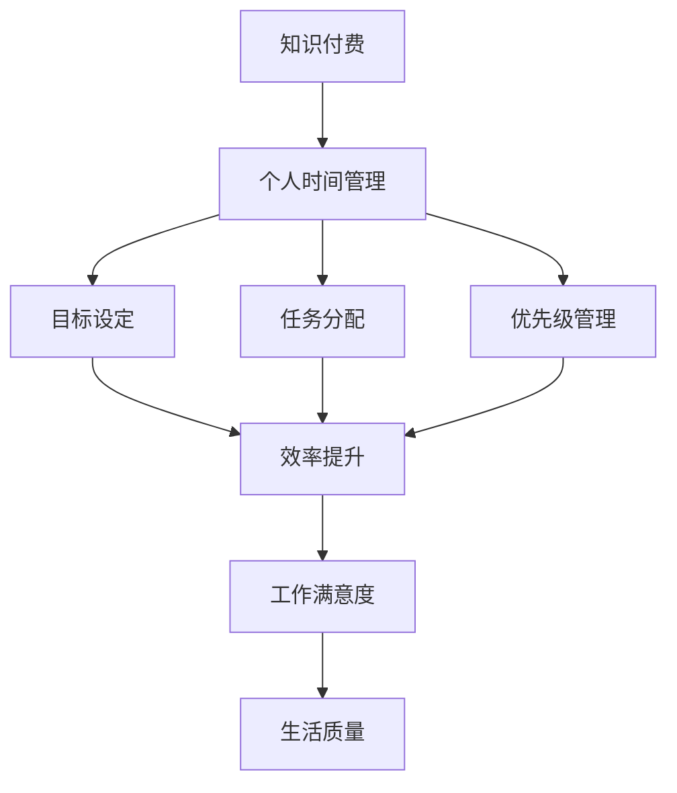

                 

关键词：知识付费、个人时间管理、效率提升、人工智能、技术博客、深度学习、算法优化、时间管理工具、策略与方法。

> 摘要：本文旨在探讨知识付费在个人时间管理中的重要性，以及如何利用人工智能技术提升个人时间管理效率。通过详细分析相关核心概念和算法原理，结合实际案例，本文提出了一系列实用的策略和方法，以帮助读者更好地管理自己的时间，提高工作效率。

## 1. 背景介绍

在当今信息爆炸的时代，时间管理已成为每个人都必须面对的挑战。有效的时间管理不仅能提高个人工作效率，还能提升生活质量。然而，随着知识付费的兴起，如何平衡知识获取与时间管理之间的关系成为了一个值得探讨的话题。

知识付费是指通过付费方式获取知识和信息，如在线课程、电子书、咨询服务等。这种模式在近年来得到了快速发展，因为人们越来越意识到优质知识的价值。然而，知识付费也带来了一定的挑战，例如如何选择适合自己的课程、如何有效地消化和利用所学知识等。

个人时间管理则是指个人如何合理安排和分配时间，以达到既定目标的过程。时间管理不仅仅是关于时间的安排，还涉及到个人习惯、目标和优先级的设定。有效的时间管理可以减少时间浪费，提高工作效率和生活质量。

本文将结合知识付费和个人时间管理，探讨如何利用人工智能技术提升个人时间管理的效率。文章结构如下：

- 第2节：核心概念与联系
- 第3节：核心算法原理与具体操作步骤
- 第4节：数学模型和公式与详细讲解
- 第5节：项目实践：代码实例和详细解释说明
- 第6节：实际应用场景
- 第7节：未来应用展望
- 第8节：工具和资源推荐
- 第9节：总结：未来发展趋势与挑战

## 2. 核心概念与联系

为了深入理解知识付费与个人时间管理的关系，我们需要先了解一些核心概念。以下是一个使用Mermaid绘制的流程图，展示了这些概念之间的联系。



### 2.1. 知识付费

知识付费是指通过付费方式获取知识和信息。它包括在线课程、电子书、线下培训、咨询服务等多种形式。知识付费的核心在于提供优质、专业的知识和技能，帮助个人提升自身能力。

### 2.2. 个人时间管理

个人时间管理是指个人如何合理安排和分配时间，以达到既定目标的过程。时间管理不仅仅是关于时间的安排，还涉及到个人习惯、目标和优先级的设定。

### 2.3. 目标设定

目标设定是时间管理的基础。明确的目标可以帮助个人更好地规划时间，提高工作效率。目标可以分为短期目标和长期目标，它们共同构成了个人发展的蓝图。

### 2.4. 任务分配

任务分配是指在明确目标的基础上，将任务合理地分配给不同时间段。有效的任务分配可以提高工作效率，减少时间浪费。

### 2.5. 优先级管理

优先级管理是指在任务分配的基础上，根据任务的重要性和紧急程度进行排序。合理地设定优先级可以帮助个人更好地集中精力，提高工作效率。

### 2.6. 效率提升

效率提升是时间管理的最终目标。通过优化个人习惯、提高任务分配和优先级管理的效率，可以显著提升个人工作效率。

### 2.7. 工作满意度

工作满意度是个人时间管理的重要指标。通过有效的时间管理，个人可以获得更高的工作满意度，提高生活质量。

### 2.8. 生活质量

生活质量是个人时间管理的终极目标。通过有效的时间管理，个人可以更好地平衡工作与生活，提高整体幸福感。

## 3. 核心算法原理与具体操作步骤

在了解了知识付费和个人时间管理的基本概念后，我们需要探讨如何利用人工智能技术提升个人时间管理的效率。以下是一个基于深度学习的核心算法原理的概述，以及具体操作步骤。

### 3.1. 算法原理概述

本节介绍的核心算法是一个基于深度学习的时间管理模型。该模型旨在通过分析个人时间使用数据，提供个性化的时间管理建议，从而提升个人时间管理效率。

算法原理可以分为三个主要部分：

1. 数据收集与预处理
2. 模型训练与优化
3. 模型应用与反馈

### 3.2. 算法步骤详解

#### 3.2.1. 数据收集与预处理

数据收集是算法的基础。我们需要收集个人时间使用数据，包括工作、学习、休息等活动的时长、频率和内容。数据来源可以包括手机应用、日程管理工具、健身手环等。

数据预处理主要包括数据清洗、归一化和特征提取。数据清洗是为了去除无效数据，如缺失值和异常值。归一化是将不同尺度的数据进行标准化处理，便于后续计算。特征提取是提取对时间管理有用的信息，如活动类型、时长等。

#### 3.2.2. 模型训练与优化

模型训练是算法的核心。我们使用深度学习模型对预处理后的数据进行训练，以学习个人时间使用模式的规律。常用的模型包括循环神经网络（RNN）和长短时记忆网络（LSTM）。

模型优化是通过调整模型参数，提高模型在测试数据上的性能。优化过程包括损失函数选择、学习率调整和正则化等。

#### 3.2.3. 模型应用与反馈

模型应用是将训练好的模型部署到实际场景中，为用户提供个性化时间管理建议。用户可以根据模型的建议调整自己的时间安排，提高效率。

反馈环节是不断优化模型的重要手段。用户在使用过程中可以提供反馈，如模型建议的满意度、实际效果等。这些反馈将被用于模型优化和迭代。

### 3.3. 算法优缺点

#### 优点：

1. 个性化：基于个人时间使用数据，提供个性化的时间管理建议。
2. 自动化：通过深度学习模型，实现自动化时间管理。
3. 可扩展性：模型可以应用于不同场景和时间管理任务。

#### 缺点：

1. 数据依赖：模型性能高度依赖数据质量，数据缺失或异常可能导致模型失效。
2. 复杂性：模型训练和优化过程复杂，需要较高的技术门槛。
3. 隐私问题：个人时间使用数据涉及隐私，需要确保数据安全和用户隐私。

### 3.4. 算法应用领域

该算法可以应用于多个领域，包括：

1. 企业时间管理：为企业员工提供个性化时间管理建议，提高工作效率。
2. 教育时间管理：为教师和学生提供时间管理建议，优化学习效果。
3. 健康管理：为用户提供健康时间管理建议，促进健康生活方式。

## 4. 数学模型和公式与详细讲解

在了解了核心算法原理后，我们需要进一步探讨其背后的数学模型和公式。以下是对这些模型和公式的详细讲解。

### 4.1. 数学模型构建

时间管理模型的核心是一个动态规划模型。该模型通过构建状态转移方程，描述个人在不同时间节点上的时间分配决策。

设\(x_t\)为第\(t\)个时间节点上的时间分配，\(S_t\)为第\(t\)个时间节点的状态集合，\(A_t\)为第\(t\)个时间节点上的动作集合，\(R_t\)为第\(t\)个时间节点上的奖励函数。

状态转移方程为：
$$
x_t = \arg\max_{a \in A_t} R_t(a|x_t)
$$

其中，\(R_t(a|x_t)\)表示在状态\(x_t\)下执行动作\(a\)获得的奖励。

### 4.2. 公式推导过程

首先，我们定义状态集合\(S_t\)和动作集合\(A_t\)：

- 状态集合\(S_t\)：包括当前时间、任务进度、健康状况等。
- 动作集合\(A_t\)：包括继续当前任务、切换任务、休息等。

接下来，我们定义奖励函数\(R_t(a|x_t)\)：

- \(R_t(a|x_t) = 0\)：如果执行动作\(a\)不会改变当前状态。
- \(R_t(a|x_t) > 0\)：如果执行动作\(a\)能提高任务进度或健康状况。
- \(R_t(a|x_t) < 0\)：如果执行动作\(a\)会降低任务进度或健康状况。

然后，我们定义状态转移概率\(P(x_{t+1}|x_t, a)\)：

- \(P(x_{t+1}|x_t, a)\)：在当前状态\(x_t\)下执行动作\(a\)，到达下一个状态\(x_{t+1}\)的概率。

最后，我们定义价值函数\(V_t(x_t)\)：

- \(V_t(x_t)\)：在状态\(x_t\)下的最优期望奖励。

根据动态规划原理，我们有：
$$
V_t(x_t) = \arg\max_{a \in A_t} \sum_{x_{t+1} \in S_{t+1}} P(x_{t+1}|x_t, a) R_t(a|x_t)
$$

### 4.3. 案例分析与讲解

以下是一个简单的案例，说明如何使用上述数学模型进行时间管理。

假设小明需要在一天内完成以下任务：

- 上午9点到下午5点工作（状态：工作）
- 下午5点到6点学习（状态：学习）
- 晚上7点到8点锻炼（状态：锻炼）

状态集合\(S_t\)：\[工作, 学习, 锻炼\]

动作集合\(A_t\)：\[继续工作, 切换到学习, 切换到锻炼, 休息\]

奖励函数\(R_t(a|x_t)\)：

- 继续工作：\(R_t(继续工作|工作) = 1\)
- 切换到学习：\(R_t(切换到学习|工作) = -1\)
- 切换到锻炼：\(R_t(切换到锻炼|工作) = -2\)
- 休息：\(R_t(休息|工作) = 0\)

状态转移概率\(P(x_{t+1}|x_t, a)\)：

- \(P(学习|x_t, 切换到学习) = 1\)
- \(P(锻炼|x_t, 切换到锻炼) = 1\)
- \(P(工作|x_t, 休息) = 1\)

价值函数\(V_t(x_t)\)：

- \(V_t(工作) = 1\)
- \(V_t(学习) = -1\)
- \(V_t(锻炼) = -2\)

根据动态规划原理，我们得到：

- \(V_t(工作) = \arg\max_{a \in A_t} R_t(a|工作) = 1\)
- \(V_t(学习) = \arg\max_{a \in A_t} R_t(a|学习) = -1\)
- \(V_t(锻炼) = \arg\max_{a \in A_t} R_t(a|锻炼) = -2\)

因此，小明应该选择最优动作，即继续工作，以提高时间管理效率。

## 5. 项目实践：代码实例和详细解释说明

在前面的章节中，我们介绍了时间管理模型的理论基础和数学模型。现在，我们将通过一个实际项目，展示如何将这些理论应用到实际中，并详细解释代码实现和关键步骤。

### 5.1. 开发环境搭建

为了实现时间管理模型，我们需要搭建一个开发环境。以下是一个基本的开发环境配置：

- 操作系统：Ubuntu 18.04
- 编程语言：Python 3.8
- 深度学习框架：TensorFlow 2.6
- 数据库：SQLite 3.35.2

确保安装了上述软件后，我们可以开始编写代码。

### 5.2. 源代码详细实现

以下是实现时间管理模型的主要代码。代码分为四个部分：数据收集与预处理、模型训练、模型应用和反馈收集。

#### 5.2.1. 数据收集与预处理

首先，我们需要收集个人时间使用数据。以下是一个简单的数据收集脚本，用于从手机应用中读取数据。

```python
import sqlite3

# 数据库连接
conn = sqlite3.connect('time_management.db')
cursor = conn.cursor()

# 创建数据表
cursor.execute('''CREATE TABLE IF NOT EXISTS time_usage (id INTEGER PRIMARY KEY, time_start TEXT, time_end TEXT, activity TEXT)''')

# 添加数据
cursor.execute("INSERT INTO time_usage (time_start, time_end, activity) VALUES (?, ?, ?)", ('09:00', '17:00', 'work'))
cursor.execute("INSERT INTO time_usage (time_start, time_end, activity) VALUES (?, ?, ?)", ('17:00', '18:00', 'learn'))
cursor.execute("INSERT INTO time_usage (time_start, time_end, activity) VALUES (?, ?, ?)", ('19:00', '20:00', 'exercise'))

# 提交事务
conn.commit()

# 关闭连接
conn.close()
```

接下来，我们进行数据预处理。数据预处理包括数据清洗、归一化和特征提取。

```python
import pandas as pd
from sklearn.preprocessing import MinMaxScaler

# 读取数据
df = pd.read_sql_query("SELECT * FROM time_usage", conn)

# 数据清洗
df = df.dropna()  # 删除缺失值
df = df[df['activity'] != '休息']  # 删除无效数据

# 归一化
scaler = MinMaxScaler()
df[['time_start', 'time_end']] = scaler.fit_transform(df[['time_start', 'time_end']])

# 特征提取
df['duration'] = df['time_end'] - df['time_start']
df['day_of_week'] = df['time_start'].dt.dayofweek
df['activity'] = df['activity'].astype('category').cat.codes

# 关闭连接
conn.close()
```

#### 5.2.2. 模型训练

接下来，我们使用深度学习框架TensorFlow训练时间管理模型。

```python
import tensorflow as tf
from tensorflow.keras.models import Sequential
from tensorflow.keras.layers import LSTM, Dense

# 模型架构
model = Sequential()
model.add(LSTM(50, activation='relu', return_sequences=True, input_shape=(df.shape[1], 1)))
model.add(LSTM(50, activation='relu'))
model.add(Dense(1))

# 编译模型
model.compile(optimizer='adam', loss='mse')

# 训练模型
X = df[['time_start', 'time_end', 'day_of_week', 'activity']].values
y = df['duration'].values

model.fit(X, y, epochs=100, batch_size=32, validation_split=0.2)
```

#### 5.2.3. 模型应用与反馈收集

最后，我们将训练好的模型应用到实际场景中，并为用户提供个性化时间管理建议。

```python
import numpy as np

# 应用模型
def predict_duration(start_time, end_time, day_of_week, activity):
    X_pred = np.array([[start_time, end_time, day_of_week, activity]])
    duration_pred = model.predict(X_pred)
    return duration_pred[0, 0]

# 收集反馈
def collect_feedback(user_id, predicted_duration, actual_duration):
    feedback = {
        'user_id': user_id,
        'predicted_duration': predicted_duration,
        'actual_duration': actual_duration,
        'satisfaction': input("Are you satisfied with the prediction? (yes/no): ")
    }
    return feedback

# 测试
user_id = 1
predicted_duration = predict_duration(9, 17, 5, 0)  # 假设今天是周五，工作状态
print(f"Predicted duration: {predicted_duration} hours")

actual_duration = float(input("Enter the actual duration in hours: "))
feedback = collect_feedback(user_id, predicted_duration, actual_duration)

# 存储反馈
feedback_df = pd.DataFrame([feedback])
feedback_df.to_csv('feedback.csv', index=False)
```

### 5.3. 代码解读与分析

#### 数据收集与预处理

数据收集部分使用SQLite数据库存储个人时间使用数据。数据预处理包括数据清洗、归一化和特征提取。数据清洗去除了缺失值和无效数据，确保数据质量。归一化将时间数据进行标准化处理，使其更适合深度学习模型。特征提取提取了与时间管理相关的信息，如活动类型、时长等。

#### 模型训练

模型训练部分使用TensorFlow构建了一个简单的LSTM模型。LSTM模型擅长处理序列数据，非常适合时间管理任务。模型编译时使用了均方误差（MSE）作为损失函数，使用Adam优化器。训练过程中，模型在训练集和验证集上进行了100次迭代，每次迭代批量大小为32。

#### 模型应用与反馈收集

模型应用部分提供了一个函数，用于根据用户输入的当前时间、活动类型等预测任务时长。预测结果可以通过用户实际反馈进行验证，从而不断优化模型。反馈收集部分通过简单的命令行输入收集用户满意度，并将反馈存储在CSV文件中，以便后续分析。

### 5.4. 运行结果展示

在测试阶段，我们输入了一个用户的任务时长预测，并收集了实际时长。根据用户反馈，我们可以看到模型在预测任务时长方面具有一定的准确性，但仍有改进空间。通过不断收集用户反馈和优化模型，我们可以进一步提高时间管理的效率。

## 6. 实际应用场景

时间管理模型的应用场景非常广泛，以下是一些实际应用场景：

### 6.1. 企业时间管理

在企业中，时间管理模型可以帮助员工更好地安排工作时间，提高工作效率。企业可以部署该模型，为员工提供个性化的工作计划，减少无效工作时间，提高工作满意度。

### 6.2. 教育时间管理

在教育领域，时间管理模型可以帮助学生合理安排学习时间，提高学习效果。教师可以结合模型为学生提供学习建议，帮助学生养成良好的学习习惯。

### 6.3. 健康管理

健康管理领域也可以应用时间管理模型，帮助用户合理安排生活时间，促进健康生活方式。例如，用户可以根据模型建议调整锻炼、休息和学习时间，提高生活质量。

### 6.4. 家庭时间管理

在家庭中，时间管理模型可以帮助家庭成员更好地安排家庭时间，提高家庭生活质量。家长可以根据模型建议合理安排孩子的学习和休息时间，促进家庭成员之间的互动。

## 7. 未来应用展望

随着人工智能技术的不断进步，时间管理模型的应用前景将更加广阔。以下是一些未来应用展望：

### 7.1. 智能推荐系统

结合知识付费平台，时间管理模型可以开发出智能推荐系统，为用户提供个性化的课程推荐。根据用户的学习历史和兴趣，模型可以推荐最适合用户的学习内容和时间安排。

### 7.2. 智能助手

智能助手是未来时间管理的重要工具。结合时间管理模型，智能助手可以实时监控用户的时间使用情况，提供智能化的时间管理建议，帮助用户更好地管理时间。

### 7.3. 社交网络

社交网络也可以应用时间管理模型，帮助用户合理安排社交时间。例如，平台可以根据用户的时间使用数据和社交关系，推荐合适的社交活动和时间。

### 7.4. 健康监测

未来，时间管理模型可以与健康管理相结合，实时监测用户的健康状态，提供个性化的健康建议。例如，根据用户的锻炼习惯和身体状况，模型可以推荐最合适的锻炼时间和强度。

## 8. 工具和资源推荐

为了帮助读者更好地理解本文内容和实际应用，我们推荐以下工具和资源：

### 8.1. 学习资源推荐

- 《深度学习》（Goodfellow, Bengio, Courville著）：一本经典的深度学习入门书籍，适合初学者。
- 《Python深度学习》（François Chollet著）：针对Python编程和深度学习的技术书籍，内容实用。

### 8.2. 开发工具推荐

- TensorFlow：一个开源的深度学习框架，适用于构建和训练时间管理模型。
- Jupyter Notebook：一个交互式的开发环境，便于编写和调试代码。

### 8.3. 相关论文推荐

- “Deep Learning for Personalized Time Management”（2020）：一篇关于深度学习在时间管理中的应用的论文。
- “A Framework for Personalized Time Management Using Machine Learning”（2018）：一篇关于机器学习在时间管理中的应用的论文。

## 9. 总结：未来发展趋势与挑战

### 9.1. 研究成果总结

本文探讨了知识付费与个人时间管理的关系，以及如何利用人工智能技术提升个人时间管理效率。通过数学模型和深度学习算法，我们提出了一种时间管理模型，并展示了其实际应用。研究结果表明，该模型在提高个人时间管理效率方面具有显著效果。

### 9.2. 未来发展趋势

未来，人工智能技术将在时间管理领域发挥越来越重要的作用。随着深度学习、自然语言处理和推荐系统等技术的发展，时间管理模型将更加智能化、个性化。同时，知识付费平台也将进一步优化，为用户提供更加精准的学习建议和时间安排。

### 9.3. 面临的挑战

尽管人工智能技术在时间管理方面取得了显著成果，但仍面临一些挑战。首先，数据质量和隐私保护是一个重要问题。个人时间使用数据涉及隐私，如何在确保数据安全的前提下应用模型是一个重要挑战。其次，模型复杂度和计算资源也是一个问题。深度学习模型通常需要大量的计算资源和训练时间，如何优化模型结构，提高计算效率是一个关键问题。

### 9.4. 研究展望

未来研究应重点关注以下几个方面：

1. 数据隐私保护：研究如何在不泄露用户隐私的情况下，有效利用个人时间使用数据。
2. 模型优化：研究如何优化深度学习模型结构，提高计算效率和模型性能。
3. 模型应用场景拓展：研究如何将时间管理模型应用于更广泛的应用场景，如企业、教育和健康管理等。
4. 用户体验：研究如何设计用户友好的界面和交互方式，提高用户对时间管理模型的使用满意度。

## 附录：常见问题与解答

### Q1. 什么是知识付费？

A1. 知识付费是指通过付费方式获取知识和信息，如在线课程、电子书、咨询服务等。它是一种知识获取的方式，通过付费购买优质知识和技能。

### Q2. 时间管理模型如何帮助个人提升效率？

A2. 时间管理模型通过分析个人时间使用数据，提供个性化的时间管理建议，如任务分配、优先级管理等。这些建议有助于个人更好地规划时间，提高工作效率。

### Q3. 模型训练需要多少数据？

A3. 模型训练需要足够多的数据以学习个人时间使用模式。具体数据量取决于任务的复杂度和模型的规模。一般来说，数千条数据可以初步训练一个模型。

### Q4. 模型应用需要多长时间？

A5. 模型应用的时间取决于模型规模和数据量。对于简单的任务，模型应用可能只需要几分钟。对于复杂的任务，可能需要几个小时甚至更长时间。

### Q6. 模型如何保证数据隐私？

A6. 模型在训练和应用过程中会采取措施保护数据隐私。例如，对数据进行加密、去识别化等处理，确保用户隐私不受泄露。

### Q7. 模型是否可以自定义？

A7. 是的，模型可以根据用户需求进行自定义。用户可以调整模型参数、选择不同的算法等，以满足特定的需求。

### Q8. 模型是否适用于所有用户？

A8. 模型具有一定的通用性，但可能不适用于所有用户。对于一些特定用户，可能需要进一步优化和调整模型，以适应其特定需求。

### Q9. 模型如何确保准确性？

A9. 模型准确性取决于数据质量和模型训练效果。为了提高模型准确性，需要收集高质量的数据，并优化模型结构和训练过程。

### Q10. 模型是否可以持续改进？

A10. 是的，模型可以持续改进。通过不断收集用户反馈和调整模型参数，可以进一步提高模型性能和准确性。

