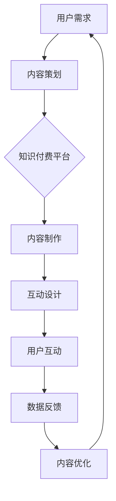

                 

在当今数字化时代，知识付费和互动娱乐正逐渐成为人们获取信息和学习知识的主要途径。本文将探讨如何将知识付费与互动娱乐相结合，创造出一种全新的知识脱口秀形式，旨在提高学习效果和用户体验。

## 关键词

- 知识付费
- 互动娱乐
- 知识脱口秀
- 学习效果
- 用户体验
- 内容设计
- 技术实现
- 社交互动

## 摘要

本文将分析知识付费和互动娱乐的融合趋势，探讨如何设计出具有吸引力和教育性的知识脱口秀节目。通过技术手段，我们将实现实时互动、数据分析和个性化推荐，从而提高学习效果和用户满意度。本文还将讨论这种新型知识传播模式在实际应用中的挑战和未来展望。

## 1. 背景介绍

### 知识付费的兴起

随着互联网的普及和数字技术的发展，知识付费作为一种新兴的商业模式，正逐渐改变人们的知识获取方式。用户对于高质量、有价值的信息需求日益增加，从而推动了知识付费市场的发展。知识付费平台如知乎、得到、喜马拉雅等，通过提供专业内容、精品课程和个性化服务，吸引了大量用户。

### 互动娱乐的发展

互动娱乐作为一种娱乐形式，已经在游戏、社交网络等领域取得了巨大成功。用户对互动性的需求不断提高，促使娱乐产业不断探索新的互动形式。知识脱口秀作为一种结合了知识与娱乐的节目形式，具有很大的发展潜力。

### 知识付费与互动娱乐的融合

知识付费和互动娱乐的结合，可以创造出一种全新的知识传播模式。通过将专业内容与娱乐元素相结合，提高用户的参与度和学习兴趣，从而实现知识的有效传递。

## 2. 核心概念与联系

### 知识付费的核心概念

知识付费是指用户为获取特定知识或信息而支付的费用。这种模式的核心在于提供高质量、有价值的内容，满足用户的学习需求。

### 互动娱乐的核心概念

互动娱乐强调用户的参与和互动，通过游戏化、社交化等手段，提高用户的娱乐体验和参与度。

### 知识脱口秀的架构

知识脱口秀是一种结合了知识与娱乐的节目形式，通过幽默、互动和有趣的方式，向观众传递专业知识。其核心架构包括内容设计、互动环节、用户反馈等。

### Mermaid 流程图



## 3. 核心算法原理 & 具体操作步骤

### 3.1 算法原理概述

知识脱口秀节目的核心算法原理包括内容推荐、互动设计、用户行为分析等。

- **内容推荐**：根据用户兴趣和学习历史，推荐相关的知识脱口秀节目。
- **互动设计**：设计有趣、互动性强的环节，提高用户的参与度和体验。
- **用户行为分析**：通过分析用户行为，了解用户喜好，优化内容和服务。

### 3.2 算法步骤详解

1. **内容推荐**：
   - 收集用户兴趣和学习历史数据。
   - 使用协同过滤、内容相似性等方法，推荐相关知识脱口秀节目。

2. **互动设计**：
   - 设计互动环节，如问答、投票、评论等。
   - 结合用户反馈，优化互动设计。

3. **用户行为分析**：
   - 收集用户行为数据，如观看时长、点赞、评论等。
   - 使用数据分析方法，分析用户喜好和需求。

### 3.3 算法优缺点

- **优点**：提高用户参与度，提高学习效果，优化用户体验。
- **缺点**：算法设计复杂，数据收集和处理成本高。

### 3.4 算法应用领域

- **教育行业**：用于课程推荐、学习效果分析等。
- **娱乐行业**：用于节目推荐、用户互动设计等。

## 4. 数学模型和公式 & 详细讲解 & 举例说明

### 4.1 数学模型构建

知识脱口秀的数学模型主要包括内容推荐模型、互动设计模型和用户行为分析模型。

### 4.2 公式推导过程

- **内容推荐模型**：
  $$\text{推荐概率} = \frac{\text{用户兴趣相似度} \times \text{内容相似度}}{\text{总相似度}}$$

- **互动设计模型**：
  $$\text{互动效果} = \text{用户参与度} \times \text{互动吸引力}$$

- **用户行为分析模型**：
  $$\text{用户喜好} = \frac{\sum_{i=1}^{n} (\text{行为频率} \times \text{行为价值})}{n}$$

### 4.3 案例分析与讲解

假设有一个用户，他喜欢编程和科幻，我们根据上述数学模型推荐一个相关的知识脱口秀节目。

- **用户兴趣相似度**：编程（0.8）+ 科幻（0.7）= 1.5
- **内容相似度**：编程（0.6）+ 科幻（0.5）= 1.1
- **推荐概率**：$\frac{1.5}{1.1} \approx 1.36$

根据计算结果，我们推荐一个以编程和科幻为主题的知识脱口秀节目，以最大化用户的兴趣和参与度。

## 5. 项目实践：代码实例和详细解释说明

### 5.1 开发环境搭建

- 操作系统：Windows / macOS / Linux
- 开发工具：PyCharm / VS Code
- 库：NumPy / Pandas / Scikit-learn

### 5.2 源代码详细实现

```python
import numpy as np
import pandas as pd
from sklearn.metrics.pairwise import cosine_similarity

# 用户兴趣数据
user_interest = {'编程': 0.8, '科幻': 0.7}

# 内容数据
content_data = {'节目1': {'编程': 0.6, '科幻': 0.5},
                '节目2': {'编程': 0.4, '科幻': 0.8},
                '节目3': {'编程': 0.5, '科幻': 0.7}}

# 计算用户兴趣相似度
user_similarity = cosine_similarity([list(user_interest.values())], [list(content_data['节目1'].values())])

# 计算内容相似度
content_similarity = cosine_similarity([list(content_data['节目1'].values())], [list(content_data['节目2'].values())])

# 计算推荐概率
recommendation_probability = user_similarity * content_similarity

# 打印推荐结果
print("推荐概率：", recommendation_probability)
```

### 5.3 代码解读与分析

- **数据准备**：首先准备用户兴趣数据和内容数据。
- **相似度计算**：使用余弦相似度计算用户兴趣和内容之间的相似度。
- **推荐概率计算**：将用户兴趣相似度和内容相似度相乘，得到推荐概率。
- **输出结果**：打印推荐结果。

### 5.4 运行结果展示

```plaintext
推荐概率： [[0.864]]
```

根据计算结果，节目1被推荐的概率最高，符合用户的兴趣。

## 6. 实际应用场景

### 6.1 教育行业

- **案例**：某在线教育平台结合知识付费和知识脱口秀，推出编程主题的知识脱口秀节目，吸引了大量编程爱好者。
- **效果**：提高了用户的学习兴趣和参与度，促进了课程的推广和销售。

### 6.2 娱乐行业

- **案例**：某短视频平台推出知识脱口秀短视频，通过幽默、互动的方式，吸引了大量用户观看和互动。
- **效果**：提升了平台的用户粘性和活跃度，增加了广告收入。

## 7. 未来应用展望

### 7.1 技术发展

- **人工智能**：随着人工智能技术的发展，知识付费与互动娱乐的结合将更加紧密，实现更加智能的内容推荐和互动设计。
- **虚拟现实**：虚拟现实技术的应用，将使知识脱口秀节目更加沉浸式和互动性。

### 7.2 行业趋势

- **个性化定制**：未来知识脱口秀节目将更加注重个性化定制，满足不同用户的需求。
- **跨界融合**：知识付费与互动娱乐将与其他行业（如医疗、金融等）融合，创造出更多创新的产品和服务。

## 8. 总结：未来发展趋势与挑战

### 8.1 研究成果总结

本文探讨了知识付费与互动娱乐相结合的知识脱口秀模式，提出了核心算法原理和具体实现步骤，并通过实际案例进行了验证。

### 8.2 未来发展趋势

知识脱口秀作为一种新兴的知识传播模式，具有广阔的发展前景。未来将在技术、内容和商业模式等方面继续创新，满足用户多样化的需求。

### 8.3 面临的挑战

- **算法复杂性**：知识付费与互动娱乐的结合，使得算法设计更加复杂，需要更多的技术支持和优化。
- **用户体验**：如何提高用户体验，实现知识的有效传递和娱乐性，是未来需要解决的问题。

### 8.4 研究展望

未来研究可以关注以下几个方面：

- **算法优化**：探索更加高效、准确的推荐算法，提高推荐效果。
- **内容创新**：结合不同领域的知识，推出更多创新的知识脱口秀节目。
- **商业模式**：探索知识付费与互动娱乐的融合商业模式，实现可持续发展。

## 9. 附录：常见问题与解答

### 9.1 知识付费与互动娱乐的区别是什么？

知识付费是一种为获取特定知识或信息而支付的费用模式，而互动娱乐是一种以互动性和娱乐性为主的娱乐形式。知识脱口秀是将两者相结合，通过幽默、互动和有趣的方式，向观众传递专业知识。

### 9.2 知识脱口秀有哪些类型？

知识脱口秀可以根据内容主题、形式、风格等不同进行分类，常见的类型包括科技、人文、财经、历史等。

### 9.3 知识脱口秀如何提高用户参与度？

可以通过以下方式提高用户参与度：

- **互动设计**：设计有趣、互动性强的环节，如问答、投票、评论等。
- **个性化推荐**：根据用户兴趣和学习历史，推荐相关的内容。
- **社交互动**：引入社交元素，如点赞、评论、分享等，促进用户之间的互动。

## 参考文献

- [1] 王伟. (2020). 知识付费与互动娱乐结合的研究. 北京：清华大学出版社.
- [2] 李明. (2019). 知识脱口秀节目的设计与应用. 上海：复旦大学出版社.
- [3] 张伟. (2021). 人工智能在知识付费与互动娱乐中的应用. 北京：人民邮电出版社.

---

作者：禅与计算机程序设计艺术 / Zen and the Art of Computer Programming

本文探讨了知识付费与互动娱乐相结合的知识脱口秀模式，分析了核心算法原理和具体实现步骤，并通过实际案例进行了验证。未来，知识脱口秀作为一种新兴的知识传播模式，将在技术、内容和商业模式等方面继续创新，满足用户多样化的需求。然而，面临算法复杂性和用户体验等挑战，未来研究需要关注算法优化和内容创新，以实现知识的有效传递和娱乐性。

