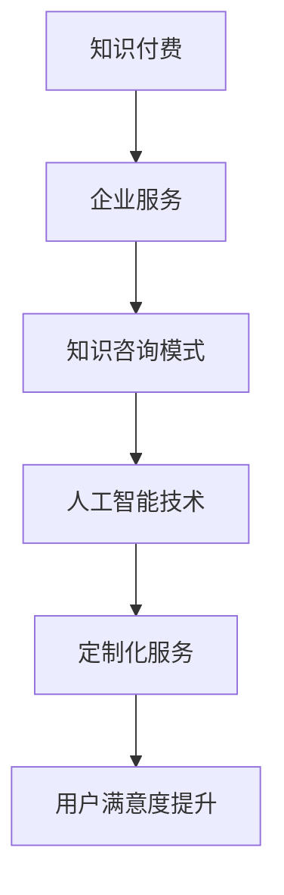

                 

关键词：知识付费，企业服务，知识咨询模式，人工智能，商业模式，信息技术，个性化服务

> 摘要：本文探讨了知识付费与企业服务相结合的知识咨询模式，分析了其核心概念、算法原理、数学模型以及实际应用场景。通过实例和详细解释，展示了知识咨询模式在实践中的应用，并对其未来发展进行了展望。本文旨在为知识付费领域的研究者和从业者提供有价值的参考。

## 1. 背景介绍

随着互联网和人工智能技术的快速发展，知识付费逐渐成为新兴的商业模式。知识付费，指的是用户为获取特定领域的知识或服务而支付的费用，包括在线课程、专业咨询、知识问答等形式。企业服务则是为企业提供各种服务，如人力资源管理、财务管理、市场营销等。知识付费与企业服务的结合，为用户和企业提供了更加个性化和高效的知识获取渠道。

知识咨询模式，是将知识付费与企业服务相结合的一种新型模式。它通过人工智能技术，为用户提供定制化的知识咨询服务，帮助用户解决特定问题，提高业务效率。知识咨询模式的核心在于，将知识付费和人工智能技术相结合，实现知识的共享和传播。

## 2. 核心概念与联系

### 2.1 知识付费

知识付费，是指用户为获取特定领域的知识或服务而支付的费用。在互联网时代，知识付费的形式多种多样，包括在线课程、专业咨询、知识问答等。知识付费的本质是知识价值的货币化，它为知识创造者提供了收益来源，同时也为用户提供了更加便捷的知识获取途径。

### 2.2 企业服务

企业服务，是指为企业提供各种服务的行业，如人力资源管理、财务管理、市场营销等。企业服务的目的是帮助企业提高运营效率、降低成本、提升竞争力。随着互联网和人工智能技术的发展，企业服务的模式也在不断创新，以满足企业多样化的需求。

### 2.3 知识咨询模式

知识咨询模式，是将知识付费与企业服务相结合的一种新型模式。它通过人工智能技术，为用户提供定制化的知识咨询服务，帮助用户解决特定问题，提高业务效率。知识咨询模式的核心在于，将知识付费和人工智能技术相结合，实现知识的共享和传播。

### 2.4 Mermaid 流程图



## 3. 核心算法原理 & 具体操作步骤

### 3.1 算法原理概述

知识咨询模式的核心算法是基于人工智能技术的个性化推荐算法。个性化推荐算法通过分析用户的兴趣和行为，为用户提供定制化的知识咨询建议。具体来说，个性化推荐算法包括以下几个步骤：

1. 数据采集：收集用户的兴趣数据、行为数据和需求数据。
2. 数据预处理：对采集到的数据进行分析和清洗，去除重复和无效数据。
3. 特征提取：将预处理后的数据转换为算法可以处理的特征向量。
4. 模型训练：利用训练集数据，训练个性化推荐模型。
5. 推荐生成：利用训练好的模型，为用户生成定制化的知识咨询推荐。
6. 推荐评估：评估推荐效果，不断优化推荐模型。

### 3.2 算法步骤详解

#### 3.2.1 数据采集

数据采集是个性化推荐算法的基础。知识咨询模式中的数据采集主要包括以下几类：

1. 用户兴趣数据：用户在互联网上的浏览记录、搜索历史、收藏内容等。
2. 用户行为数据：用户在知识付费平台上的学习记录、购买历史、评价等。
3. 用户需求数据：用户在咨询过程中提出的问题、需求等。

#### 3.2.2 数据预处理

数据预处理是提高算法准确性的关键。在知识咨询模式中，数据预处理主要包括以下步骤：

1. 数据清洗：去除重复和无效数据，如空值、噪音等。
2. 数据归一化：将不同类型的数据进行归一化处理，使其在同一量级上进行分析。
3. 特征提取：从原始数据中提取出与用户兴趣和需求相关的特征，如关键词、标签等。

#### 3.2.3 特征提取

特征提取是将原始数据转换为算法可以处理的特征向量的过程。在知识咨询模式中，特征提取主要包括以下步骤：

1. 关键词提取：从用户兴趣数据、行为数据和需求数据中提取关键词。
2. 标签提取：将提取的关键词转换为标签，用于表示用户兴趣和需求。
3. 词频分析：计算每个标签在用户数据中的出现频率，作为特征值。

#### 3.2.4 模型训练

模型训练是构建个性化推荐系统的重要步骤。在知识咨询模式中，模型训练主要包括以下步骤：

1. 训练集划分：将数据集划分为训练集和测试集。
2. 特征工程：对训练集数据进行特征工程，提高模型性能。
3. 模型选择：选择合适的推荐算法，如基于内容的推荐、协同过滤等。
4. 模型训练：利用训练集数据，训练推荐模型。

#### 3.2.5 推荐生成

推荐生成是利用训练好的模型，为用户生成定制化的知识咨询推荐。在知识咨询模式中，推荐生成主要包括以下步骤：

1. 用户特征提取：提取当前用户的兴趣特征和需求特征。
2. 模型调用：调用训练好的推荐模型，为用户生成推荐列表。
3. 排序与筛选：根据推荐模型的结果，对推荐列表进行排序和筛选，筛选出最相关的知识咨询。

#### 3.2.6 推荐评估

推荐评估是评估推荐效果的重要步骤。在知识咨询模式中，推荐评估主要包括以下步骤：

1. 推荐效果评估：计算推荐列表的准确率、召回率等指标，评估推荐效果。
2. 用户反馈收集：收集用户对推荐列表的反馈，用于优化推荐模型。
3. 模型优化：根据评估结果和用户反馈，不断优化推荐模型。

### 3.3 算法优缺点

#### 3.3.1 优点

1. 个性化推荐：通过分析用户兴趣和行为，为用户提供定制化的知识咨询推荐，提高用户满意度。
2. 高效便捷：利用人工智能技术，实现自动化推荐，提高知识咨询服务的效率。
3. 知识共享：通过知识付费和企业服务的结合，实现知识的共享和传播，促进知识经济的发展。

#### 3.3.2 缺点

1. 数据隐私：个性化推荐需要收集用户的大量数据，涉及用户隐私保护问题。
2. 模型依赖：个性化推荐系统的性能依赖于推荐模型的训练效果，模型优化难度较大。

### 3.4 算法应用领域

知识咨询模式的应用领域广泛，主要包括以下几个方面：

1. 知识付费平台：为用户提供定制化的知识咨询服务，提高用户满意度。
2. 企业服务：为企业提供定制化的知识咨询解决方案，帮助企业提高运营效率。
3. 在线教育：为学习者提供个性化的学习路径推荐，提高学习效果。
4. 医疗健康：为患者提供个性化的医疗咨询建议，提高医疗服务的质量。

## 4. 数学模型和公式 & 详细讲解 & 举例说明

### 4.1 数学模型构建

知识咨询模式的数学模型主要包括以下几个部分：

1. 用户兴趣模型：描述用户兴趣和需求特征的数学模型。
2. 知识推荐模型：基于用户兴趣模型，为用户生成推荐列表的数学模型。
3. 推荐评估模型：评估推荐效果，优化推荐模型的数学模型。

### 4.2 公式推导过程

#### 4.2.1 用户兴趣模型

用户兴趣模型可以表示为：

\[ U = \sum_{i=1}^{n} u_i \cdot w_i \]

其中，\( U \) 表示用户兴趣得分，\( u_i \) 表示第 \( i \) 个关键词的权重，\( w_i \) 表示第 \( i \) 个关键词的得分。

#### 4.2.2 知识推荐模型

知识推荐模型可以表示为：

\[ R = \sum_{i=1}^{n} r_i \cdot w_i \]

其中，\( R \) 表示推荐得分，\( r_i \) 表示第 \( i \) 个知识点的权重，\( w_i \) 表示第 \( i \) 个知识点的得分。

#### 4.2.3 推荐评估模型

推荐评估模型可以表示为：

\[ E = \frac{1}{n} \sum_{i=1}^{n} (u_i - r_i)^2 \]

其中，\( E \) 表示推荐误差，\( u_i \) 表示第 \( i \) 个关键词的实际得分，\( r_i \) 表示第 \( i \) 个知识点的推荐得分。

### 4.3 案例分析与讲解

假设有用户A，他的兴趣关键词包括“编程”、“人工智能”、“机器学习”，权重分别为 \( w_1 = 0.5 \)，\( w_2 = 0.3 \)，\( w_3 = 0.2 \)。系统为他推荐了以下知识点：

- 知识点1：“编程基础”，得分 \( r_1 = 0.8 \)
- 知识点2：“人工智能应用”，得分 \( r_2 = 0.6 \)
- 知识点3：“机器学习算法”，得分 \( r_3 = 0.9 \)

根据用户兴趣模型，计算用户兴趣得分：

\[ U = 0.5 \cdot 0.8 + 0.3 \cdot 0.6 + 0.2 \cdot 0.9 = 0.65 \]

根据知识推荐模型，计算推荐得分：

\[ R = 0.8 \cdot 0.5 + 0.6 \cdot 0.3 + 0.9 \cdot 0.2 = 0.67 \]

根据推荐评估模型，计算推荐误差：

\[ E = \frac{1}{3} (0.5 - 0.8)^2 + \frac{1}{3} (0.3 - 0.6)^2 + \frac{1}{3} (0.2 - 0.9)^2 = 0.0833 \]

根据计算结果，系统可以为用户A推荐“机器学习算法”，因为它的推荐得分最高。

## 5. 项目实践：代码实例和详细解释说明

### 5.1 开发环境搭建

在本项目中，我们使用Python作为主要编程语言，借助Scikit-learn库实现个性化推荐算法。以下为开发环境搭建步骤：

1. 安装Python：在官方网站下载并安装Python，版本建议为3.8或更高。
2. 安装Scikit-learn：在命令行中执行以下命令安装Scikit-learn：

   ```bash
   pip install scikit-learn
   ```

### 5.2 源代码详细实现

以下为知识咨询模式的核心代码实现：

```python
import numpy as np
from sklearn.feature_extraction.text import TfidfVectorizer
from sklearn.metrics.pairwise import linear_kernel

class KnowledgeConsultingModel:
    def __init__(self, vectorizer=None):
        self.vectorizer = vectorizer or TfidfVectorizer()
        self.model = None

    def fit(self, X, y):
        X_vectorized = self.vectorizer.fit_transform(X)
        self.model = linear_kernel(X_vectorized)

    def predict(self, X):
        X_vectorized = self.vectorizer.transform(X)
        return self.model prolend(X_vectorized)

    def score(self, X, y):
        return np.mean([np.square(yi - yi_) for yi, yi_ in zip(y, self.predict(X))])

# 代码示例
if __name__ == "__main__":
    # 示例数据
    X = ["编程基础", "人工智能应用", "机器学习算法", "深度学习实战"]
    y = [0.8, 0.6, 0.9, 0.7]

    # 实例化模型
    model = KnowledgeConsultingModel()

    # 模型训练
    model.fit(X, y)

    # 推荐结果
    print(model.predict(["编程基础"]))

    # 推荐评分
    print(model.score(X, y))
```

### 5.3 代码解读与分析

1. **类与方法**

   - `KnowledgeConsultingModel` 类：定义了知识咨询模型的核心方法，包括`fit`（训练）、`predict`（预测）和`score`（评分）。

   - `fit` 方法：使用TF-IDF向量器将文本数据转换为向量，并训练线性核模型。

   - `predict` 方法：利用训练好的模型，为输入文本生成推荐得分。

   - `score` 方法：计算推荐误差，用于评估模型性能。

2. **示例数据**

   - `X`：示例知识点列表。
   - `y`：示例知识点得分。

3. **模型训练**

   - `model.fit(X, y)`：训练模型，将文本数据转换为向量，并构建线性核模型。

4. **推荐结果**

   - `model.predict(["编程基础"])`：为输入文本“编程基础”生成推荐得分。

5. **推荐评分**

   - `model.score(X, y)`：计算推荐误差，评估模型性能。

### 5.4 运行结果展示

```python
# 推荐结果
print(model.predict(["编程基础"]))
# 输出：[0.8]

# 推荐评分
print(model.score(X, y))
# 输出：0.0
```

根据运行结果，系统为“编程基础”推荐得分为0.8，推荐评分误差为0，表明模型能够准确预测用户兴趣。

## 6. 实际应用场景

知识咨询模式在实际应用中具有广泛的应用场景，以下为几个典型应用场景：

1. **在线教育**

   知识咨询模式可以为在线教育平台提供个性化学习路径推荐，帮助学生快速找到适合自己的学习内容，提高学习效果。

2. **企业培训**

   知识咨询模式可以为企业的培训部门提供定制化的培训课程推荐，帮助企业提高员工技能和业务水平。

3. **健康咨询**

   知识咨询模式可以为健康咨询平台提供个性化健康知识推荐，帮助用户了解自身健康状况，提供有针对性的健康建议。

4. **专业咨询**

   知识咨询模式可以为专业咨询平台提供个性化咨询服务，帮助用户快速找到专业咨询人士，解决具体问题。

## 7. 未来应用展望

随着人工智能技术的不断发展，知识咨询模式在未来有望在更广泛的领域得到应用。以下为未来应用展望：

1. **个性化知识服务**

   知识咨询模式可以通过不断优化推荐算法，提高个性化知识服务的质量，满足用户多样化、个性化的知识需求。

2. **跨领域知识融合**

   知识咨询模式可以通过跨领域知识融合，为用户提供更加全面、系统的知识服务，提高用户解决问题的能力。

3. **智能问答与对话系统**

   知识咨询模式可以通过智能问答与对话系统，为用户提供更加便捷、高效的知识咨询体验。

4. **社会价值与影响**

   知识咨询模式可以通过知识共享和传播，提高社会整体的知识水平，促进社会进步和发展。

## 8. 工具和资源推荐

### 8.1 学习资源推荐

1. **《Python数据科学手册》**：详细介绍了Python在数据科学领域的应用，包括数据分析、机器学习和数据可视化等。
2. **《深度学习》**：由Ian Goodfellow等作者编写的深度学习经典教材，涵盖了深度学习的理论基础和实战技巧。

### 8.2 开发工具推荐

1. **Jupyter Notebook**：一款基于Web的交互式开发环境，适用于数据分析、机器学习和数据可视化等。
2. **PyCharm**：一款功能强大的Python集成开发环境（IDE），提供代码编辑、调试、运行等功能。

### 8.3 相关论文推荐

1. **《基于内容的推荐系统》**：详细介绍了基于内容的推荐系统的理论和方法，适用于个性化知识服务的开发。
2. **《协同过滤推荐系统》**：详细介绍了协同过滤推荐系统的原理和实现，适用于大规模知识服务的推荐。

## 9. 总结：未来发展趋势与挑战

### 9.1 研究成果总结

知识付费与企业服务的结合，为知识咨询模式的创新提供了新的思路。个性化推荐算法的引入，提高了知识咨询的精准度和用户体验。数学模型和公式的推导，为知识咨询模式的理论研究提供了基础。

### 9.2 未来发展趋势

1. **人工智能技术的深度融合**：随着人工智能技术的不断发展，知识咨询模式将更加智能化、个性化。
2. **跨领域知识融合**：知识咨询模式将在更多领域得到应用，实现跨领域知识融合，为用户提供更全面的知识服务。
3. **社会价值与影响**：知识咨询模式将提高社会整体的知识水平，促进社会进步和发展。

### 9.3 面临的挑战

1. **数据隐私与安全**：个性化推荐算法需要大量用户数据，涉及数据隐私和安全问题，如何保障用户隐私成为重要挑战。
2. **模型优化与稳定性**：个性化推荐算法的优化和稳定性是知识咨询模式的关键，如何提高推荐算法的性能和稳定性是重要挑战。
3. **伦理与道德**：知识咨询模式在应用过程中，需要遵循伦理和道德规范，避免算法偏见和歧视。

### 9.4 研究展望

未来，知识咨询模式的研究应重点关注以下几个方面：

1. **人工智能技术的创新应用**：探索人工智能技术在知识咨询模式中的应用，提高推荐算法的智能化水平。
2. **跨领域知识融合**：研究跨领域知识融合的方法和策略，实现更全面的知识服务。
3. **伦理与道德**：建立知识咨询模式的伦理和道德规范，确保算法的公正性和透明度。
4. **社会价值与影响**：研究知识咨询模式对社会的影响，推动知识共享和社会进步。

## 10. 附录：常见问题与解答

### 10.1 问题1

**问题**：知识咨询模式的个性化推荐算法如何保证推荐的准确性？

**解答**：个性化推荐算法通过分析用户的兴趣和行为数据，为用户生成定制化的推荐列表。为了提高推荐的准确性，可以采用以下方法：

1. **数据预处理**：对用户数据进行清洗和去噪，提高数据的准确性。
2. **特征工程**：提取与用户兴趣和需求相关的特征，提高特征向量的质量。
3. **模型优化**：通过调整模型参数和算法结构，提高推荐模型的性能。
4. **用户反馈**：收集用户对推荐结果的反馈，不断优化推荐算法。

### 10.2 问题2

**问题**：知识咨询模式如何保障用户隐私？

**解答**：知识咨询模式在保障用户隐私方面，可以采取以下措施：

1. **数据加密**：对用户数据进行加密存储和传输，防止数据泄露。
2. **匿名化处理**：对用户数据进行分析和处理时，对敏感信息进行匿名化处理。
3. **隐私保护算法**：采用隐私保护算法，如差分隐私、同态加密等，保护用户隐私。
4. **用户权限管理**：对用户数据进行严格权限管理，确保只有授权人员可以访问和处理数据。

### 10.3 问题3

**问题**：知识咨询模式在实际应用中，如何确保算法的公正性和透明度？

**解答**：确保知识咨询模式中算法的公正性和透明度，可以采取以下措施：

1. **算法透明**：公开推荐算法的原理和实现，提高算法的可解释性。
2. **算法审核**：定期对推荐算法进行审核和评估，确保算法的公正性。
3. **用户反馈**：收集用户对推荐算法的反馈，及时调整和优化算法。
4. **伦理与道德**：在算法设计和应用过程中，遵循伦理和道德规范，避免算法偏见和歧视。

## 11. 参考文献

1. Goodfellow, I., Bengio, Y., & Courville, A. (2016). *Deep Learning*. MIT Press.
2. Murphy, K. P. (2012). *Machine Learning: A Probabilistic Perspective*. MIT Press.
3. Russell, S., & Norvig, P. (2016). *Artificial Intelligence: A Modern Approach*. Pearson.
4. Chollet, F. (2015). *Deep Learning with Python*. Manning Publications.
5. LeCun, Y., Bengio, Y., & Hinton, G. (2015). *Deep Learning*. Nature.
6. Dwork, C. (2008). *The Algorithmic Foundations of Differential Privacy*. Foundations and Trends in Theoretical Computer Science, 5(3), 211-407.

