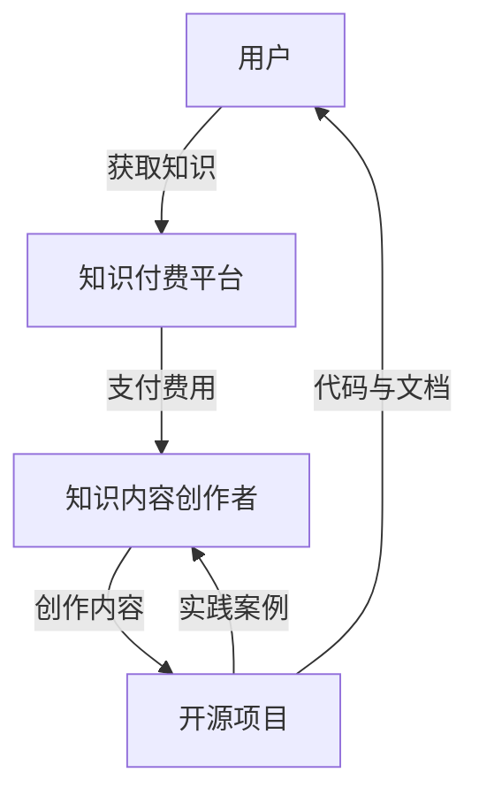

                 

关键词：知识付费、开源项目、商业模式、合作共赢、技术社区、知识产权、开发者生态。

> 摘要：本文探讨了知识付费与开源项目的结合之道，分析了二者的协同效应及其对技术社区和企业的影响。通过实例和数据分析，本文展示了如何通过知识付费来支持开源项目，如何通过开源项目来促进知识付费，并提出了未来发展的趋势和面临的挑战。

## 1. 背景介绍

知识付费和开源项目作为现代信息技术领域的重要组成部分，近年来得到了广泛的关注和发展。知识付费指的是用户为获取特定的知识或技能而支付费用的一种商业模式，常见形式包括在线课程、专业书籍、技术培训等。开源项目则是指由开发者社区维护的，源代码公开的项目，用户可以免费使用、修改和分发。

### 1.1 知识付费的兴起

随着互联网的普及和在线教育的发展，知识付费成为了满足用户个性化学习需求的重要途径。用户可以通过支付费用来获取专业知识和技能，从而提升自己的竞争力。同时，知识付费也为内容创作者提供了稳定的收入来源，激励他们持续创作高质量的内容。

### 1.2 开源项目的崛起

开源项目起源于软件领域，但其理念已扩展到各种技术领域。开源项目的核心价值在于开放、共享和协作，这使得开发者可以共享代码、知识和经验，加速技术的创新和发展。开源项目不仅为企业和开发者节省了研发成本，还推动了整个技术生态的繁荣。

## 2. 核心概念与联系

### 2.1 知识付费与开源项目的协同作用

知识付费与开源项目的结合，既可以为开发者提供经济支持，又可以促进技术的传播和应用。以下是二者协同作用的几个方面：

1. **知识付费为开源项目提供资金支持**：开发者可以通过提供付费的知识产品，如教程、案例研究等，为开源项目筹集资金，确保项目的持续发展。

2. **开源项目促进知识付费内容的质量**：高质量的代码和文档可以提升知识产品的价值，吸引更多的付费用户。

3. **知识付费帮助开发者更好地理解开源项目**：付费的知识产品通常更深入、更系统，有助于开发者更好地理解开源项目的原理和应用。

4. **开源项目为知识付费提供实践基础**：开发者可以通过参与开源项目，将理论知识应用到实际开发中，提升自己的技能水平。

### 2.2 架构图展示

下面是一个简化的架构图，展示了知识付费与开源项目的结合方式：



## 3. 核心算法原理 & 具体操作步骤

### 3.1 算法原理概述

知识付费与开源项目的结合，本质上是一种基于价值的交换机制。以下是该机制的原理概述：

1. **价值交换**：用户为获取知识支付费用，开发者通过提供高质量的知识内容获得收入。

2. **激励机制**：知识付费为开发者提供了持续创作的动力，而开源项目则为开发者提供了实践和成长的平台。

3. **协同效应**：知识付费和开源项目的相互促进，形成了良性循环，推动了整个技术生态的发展。

### 3.2 算法步骤详解

1. **知识付费平台的搭建**：
   - 选择合适的知识付费平台，如Teachable、Udemy等。
   - 设计课程大纲和内容，确保课程质量。
   - 发布课程，设置合理的价格。

2. **开源项目的创建与维护**：
   - 确定开源项目的目标和范围。
   - 编写高质量的代码和文档。
   - 吸引开发者参与，维护项目的活跃度。

3. **知识付费与开源项目的结合**：
   - 在知识付费产品中嵌入开源项目的案例和代码示例。
   - 提供针对开源项目的深入讲解和教程。
   - 鼓励用户参与开源项目，将知识应用到实际开发中。

### 3.3 算法优缺点

**优点**：
- **提高知识传播效率**：知识付费和开源项目的结合，使得高质量的知识内容能够更广泛地传播。
- **激励开发者创作**：知识付费为开发者提供了稳定的收入来源，鼓励他们创作更多高质量的内容。
- **促进技术发展**：开源项目为开发者提供了实践和创新的平台，推动了技术的进步。

**缺点**：
- **知识产权保护**：知识付费和开源项目在知识产权保护方面存在一定的挑战，需要建立有效的保护机制。
- **商业模式的可持续性**：如何确保知识付费和开源项目的可持续性，避免过度商业化，是一个需要解决的问题。

### 3.4 算法应用领域

知识付费与开源项目的结合，广泛应用于以下领域：

1. **软件开发**：通过付费的知识产品和开源项目，开发者可以学习到最新的编程技术和框架。

2. **数据科学**：数据科学家可以通过付费课程和开源项目，掌握数据分析和机器学习等技能。

3. **云计算与大数据**：云计算和大数据领域的知识付费和开源项目，为企业和个人提供了丰富的学习资源。

## 4. 数学模型和公式 & 详细讲解 & 举例说明

### 4.1 数学模型构建

为了更好地理解知识付费与开源项目的结合机制，我们可以构建一个简单的数学模型。以下是模型的基本假设和公式：

- **用户支付意愿（PI）**：用户愿意支付的费用，取决于知识产品的质量和个人的需求。
- **开发者收入（I）**：开发者的收入，取决于知识产品的销量和价格。
- **开源项目价值（V）**：开源项目的价值，取决于代码质量、文档完备性和社区的活跃度。

### 4.2 公式推导过程

1. **用户支付意愿公式**：

$$ PI = f(Q, N) $$

其中，Q为知识产品质量，N为个人需求。

2. **开发者收入公式**：

$$ I = P \times S $$

其中，P为知识产品价格，S为销量。

3. **开源项目价值公式**：

$$ V = f(C, D, A) $$

其中，C为代码质量，D为文档完备性，A为社区活跃度。

### 4.3 案例分析与讲解

以某知名编程语言的在线课程和对应的开源项目为例，分析知识付费与开源项目的结合效果。

1. **用户支付意愿**：

假设该课程的质量（Q）为90分，个人需求（N）为80分，则用户支付意愿（PI）为：

$$ PI = f(90, 80) = 0.9 \times 0.8 = 0.72 $$

2. **开发者收入**：

假设课程的价格（P）为200美元，销量（S）为1000人，则开发者收入（I）为：

$$ I = P \times S = 200 \times 1000 = 200,000 $$

3. **开源项目价值**：

假设开源项目的代码质量（C）为90分，文档完备性（D）为85分，社区活跃度（A）为80分，则开源项目价值（V）为：

$$ V = f(90, 85, 80) = 0.9 \times 0.85 \times 0.8 = 0.612 $$

通过这个案例，我们可以看到知识付费和开源项目在提高用户支付意愿、开发者收入和项目价值方面具有显著的效果。

## 5. 项目实践：代码实例和详细解释说明

### 5.1 开发环境搭建

以Python编程语言为例，搭建一个简单的知识付费与开源项目结合的实例。首先，我们需要安装Python环境和相关的库。

```bash
# 安装Python环境
python3 -m venv myenv
source myenv/bin/activate

# 安装相关库
pip install Flask
```

### 5.2 源代码详细实现

下面是一个简单的知识付费和开源项目结合的Web应用程序示例。该应用程序包括一个在线课程支付系统和对应的开源项目。

```python
# app.py

from flask import Flask, render_template, request, redirect, url_for

app = Flask(__name__)

# 假设的在线课程
courses = [
    {
        'name': 'Python基础教程',
        'price': 100,
        'description': '本课程将介绍Python编程语言的基础知识，适合初学者。',
        'source_code': 'https://github.com/user/python_course'
    }
]

@app.route('/')
def index():
    return render_template('index.html', courses=courses)

@app.route('/buy', methods=['GET', 'POST'])
def buy():
    if request.method == 'POST':
        course_name = request.form['course_name']
        course_price = request.form['course_price']
        # 这里可以添加支付处理逻辑
        return redirect(url_for('thankyou', course_name=course_name))
    return redirect(url_for('index'))

@app.route('/thankyou')
def thankyou():
    course_name = request.args.get('course_name')
    return f'感谢您购买课程：{course_name}！'

if __name__ == '__main__':
    app.run(debug=True)
```

### 5.3 代码解读与分析

1. **在线课程支付系统**：
   - 使用Flask框架搭建了一个简单的Web应用程序。
   - 定义了在线课程的列表，包括课程名称、价格和描述。
   - 实现了购买课程的功能，用户可以提交课程名称和价格进行购买。

2. **开源项目**：
   - 在课程页面中提供了开源项目的链接，用户可以访问并下载项目源代码。
   - 开源项目可以作为学习课程内容的实践基础，用户可以通过修改代码来加深对课程内容的理解。

### 5.4 运行结果展示

1. **首页**：
   - 展示了所有的在线课程，用户可以选择购买。

   ```html
   <!DOCTYPE html>
   <html lang="en">
   <head>
       <meta charset="UTF-8">
       <title>在线课程</title>
   </head>
   <body>
       <h1>在线课程</h1>
       
           <div>
               <h2>{{ course.name }}</h2>
               <p>价格：{{ course.price }}美元</p>
               <p>{{ course.description }}</p>
               <form action="{{ url_for('buy') }}" method="post">
                   <input type="hidden" name="course_name" value="{{ course.name }}">
                   <input type="hidden" name="course_price" value="{{ course.price }}">
                   <input type="submit" value="购买">
               </form>
           </div>
       
   </body>
   </html>
   ```

2. **购买页面**：
   - 用户提交课程名称和价格后，页面会跳转至感谢页面。

   ```html
   <!DOCTYPE html>
   <html lang="en">
   <head>
       <meta charset="UTF-8">
       <title>感谢购买</title>
   </head>
   <body>
       <h1>感谢购买</h1>
       <p>感谢您购买课程：{{ course_name }}！</p>
   </body>
   </html>
   ```

通过这个简单的实例，我们可以看到知识付费与开源项目的结合是如何实现的。开发者可以通过提供付费知识内容来筹集资金，同时通过开源项目为用户提供实践基础，实现知识传播和技术创新的双赢。

## 6. 实际应用场景

知识付费与开源项目的结合，在多个实际应用场景中展现了其巨大的潜力：

### 6.1 在线教育平台

在线教育平台通过提供付费课程，为用户提供了高质量的学习资源。同时，平台上的开源项目可以为用户提供实践案例，帮助用户更好地掌握所学知识。

### 6.2 开源社区

开源社区中的开发者可以通过提供付费的知识产品，如教程、文档等，来支持社区的发展。开源项目的实践价值也为开发者提供了丰富的教学内容。

### 6.3 企业内训

企业可以通过知识付费平台，为员工提供专业的技术培训。同时，企业内部的优秀开源项目可以为员工提供实践机会，提升团队的技术水平。

### 6.4 创业项目

创业者可以通过知识付费来获取资金支持，同时通过开源项目来吸引投资和用户关注，实现商业模式的快速迭代。

## 7. 未来应用展望

随着知识付费和开源项目的不断发展，二者的结合将展现出更广泛的应用前景：

### 7.1 更广泛的知识传播

知识付费与开源项目的结合，将有助于更广泛地传播知识，尤其是那些高质量、难以通过免费资源获取的知识。

### 7.2 更高效的技能提升

通过知识付费，用户可以更快地获取所需的技能，而开源项目则为用户提供了实践和验证所学知识的机会。

### 7.3 更多元的商业模式

知识付费与开源项目的结合，将催生出更多创新的商业模式，如混合模式、会员制等，为内容创作者和用户提供更多选择。

### 7.4 更强大的开发者生态

开源项目的发展离不开社区的参与和支持，而知识付费为开发者提供了经济上的保障，进一步促进了开发者生态的繁荣。

## 8. 总结：未来发展趋势与挑战

### 8.1 研究成果总结

本文通过分析知识付费与开源项目的结合之道，探讨了二者在技术社区和企业中的协同效应。研究发现，知识付费为开源项目提供了资金支持，促进了技术的传播和应用；而开源项目为知识付费提供了实践基础，提升了知识产品的价值。

### 8.2 未来发展趋势

1. **知识付费与开源项目的深度融合**：未来，知识付费与开源项目的结合将更加紧密，形成更为完善的商业模式。

2. **多样化知识付费形式**：除了传统的在线课程和电子书，更多形式的付费知识产品，如专业咨询、私人定制等，将逐渐受到青睐。

3. **开源项目的商业价值提升**：随着开源项目在企业中的广泛应用，其商业价值将逐渐凸显，成为企业技术创新的重要来源。

### 8.3 面临的挑战

1. **知识产权保护**：知识付费和开源项目在知识产权保护方面面临挑战，需要建立更加完善的保护机制。

2. **商业模式的可持续性**：如何确保知识付费和开源项目的可持续性，避免过度商业化，是一个需要解决的问题。

3. **技术社区的维护**：开源项目的长期发展需要社区的积极参与和维护，如何吸引和留住开发者，是项目成功的关键。

### 8.4 研究展望

未来，研究者可以进一步探讨知识付费与开源项目的结合机制，分析其在不同技术领域中的应用效果。同时，研究如何优化知识付费平台和开源项目的运营模式，提升其商业价值和社区影响力，也是值得深入研究的方向。

## 9. 附录：常见问题与解答

### 9.1 知识付费与开源项目结合的商业模式如何实现？

实现知识付费与开源项目的结合，可以通过以下步骤：
1. **创建知识付费平台**：选择合适的知识付费平台，如Teachable、Udemy等，发布付费课程。
2. **开发开源项目**：构建具有实践价值的开源项目，编写高质量的代码和文档。
3. **将知识付费与开源项目相结合**：在知识付费产品中嵌入开源项目案例和代码示例，鼓励用户参与开源项目。

### 9.2 如何确保开源项目的知识产权保护？

确保开源项目的知识产权保护，可以采取以下措施：
1. **签署贡献协议**：要求开发者签署贡献协议，明确知识产权归属。
2. **使用开源许可证**：选择合适的开源许可证，保护项目的知识产权。
3. **定期审查代码库**：定期审查代码库，防止未经授权的修改和分发。

### 9.3 知识付费对开源项目的长期影响是什么？

知识付费可以为开源项目提供资金支持，激励开发者持续创作和维护项目。然而，如果过度商业化，可能导致项目失去其开源本质，影响社区的参与和贡献。因此，平衡知识付费和开源项目的商业价值，是确保项目长期健康发展的关键。

---

作者：禅与计算机程序设计艺术 / Zen and the Art of Computer Programming
----------------------------------------------------------------
### 结束语

本文通过深入探讨知识付费与开源项目的结合之道，分析了二者在技术社区和企业中的协同效应。知识付费为开源项目提供了资金支持，促进了技术的传播和应用；而开源项目为知识付费提供了实践基础，提升了知识产品的价值。未来，随着知识付费和开源项目的不断发展，二者的结合将展现出更广泛的应用前景，为技术社区和企业带来更多创新和机遇。希望本文能为您提供对这一领域的深入理解和启示。

