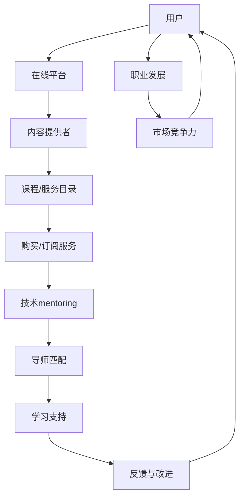

                 

关键词：知识付费、技术mentoring、教育科技、商业模式、在线学习平台、知识共享

> 摘要：本文探讨了知识付费与技术mentoring（指导）的结合模式，分析了这种模式在当前教育科技环境下的重要性、实施策略和未来发展方向。通过结合实际案例，阐述了知识付费与技术mentoring在提高教育质量和促进个人职业发展方面的优势。

## 1. 背景介绍

在当今信息爆炸的时代，知识更新速度极快，技术领域尤其如此。个人和专业团队需要不断学习新的技能和知识以保持竞争力。与此同时，知识付费市场正在迅速发展，越来越多的平台和机构提供各种在线课程、培训材料和专业咨询服务。这种付费知识获取模式不仅满足了学习者的需求，也为知识提供者创造了收入来源。

技术mentoring作为一种传统的指导模式，通过一对一或小组形式，为学习者提供个性化、深层次的学习支持和职业发展指导。然而，随着在线教育和知识付费的兴起，技术mentoring也在向数字化和商业化的方向发展，形成了一种新的结合模式。

## 2. 核心概念与联系

### 2.1. 知识付费

知识付费是指用户通过支付一定费用来获取知识和技能的服务。这种模式在在线教育、专业培训和个人发展领域得到了广泛应用。知识付费的核心在于提供高质量、权威性、实用性的知识内容。

### 2.2. 技术mentoring

技术mentoring是一种基于专业知识和个人经验的指导模式。它通常涉及导师（mentors）与学习者（mentees）之间的长期互动，旨在帮助学习者解决实际问题、提升技能水平和实现职业目标。

### 2.3. 结合模式

知识付费与技术mentoring的结合模式是指将知识付费的服务模式与技术mentoring的指导模式结合起来，通过在线平台提供个性化、高价值的学习和职业发展支持。

### 2.4. 架构图

以下是一个简化的Mermaid流程图，展示了知识付费与技术mentoring的结合模式的基本架构：



## 3. 核心算法原理 & 具体操作步骤

### 3.1. 算法原理概述

知识付费与技术mentoring的结合模式依赖于一系列算法和机制，包括用户数据分析、导师匹配算法、学习支持系统等。这些算法和机制共同作用，确保学习者能够获得个性化、高质量的学习体验。

### 3.2. 算法步骤详解

1. **用户数据分析**：平台通过用户行为数据和反馈，分析学习者的兴趣、需求和技能水平。
2. **导师匹配算法**：基于用户数据，平台使用算法匹配合适的导师，确保导师与学习者之间的兴趣和需求相匹配。
3. **学习支持系统**：平台提供一系列工具和服务，帮助学习者跟踪学习进度、获得学习资源、参与讨论和获取导师支持。
4. **反馈与改进**：平台收集学习者的反馈，不断优化导师匹配算法和学习支持系统。

### 3.3. 算法优缺点

- **优点**：提高学习效率、个性化支持、高价值知识获取、职业发展指导。
- **缺点**：初期成本较高、需要大量数据和算法支持、导师资源稀缺。

### 3.4. 算法应用领域

知识付费与技术mentoring的结合模式适用于多个领域，包括软件开发、数据分析、人工智能、区块链等。

## 4. 数学模型和公式 & 详细讲解 & 举例说明

### 4.1. 数学模型构建

知识付费与技术mentoring的结合模式中的数学模型主要涉及用户满意度、学习效率和收入增长等指标。以下是一个简化的模型：

$$
\text{用户满意度} = f(\text{学习资源质量}, \text{导师指导质量}, \text{学习支持系统})
$$

$$
\text{学习效率} = f(\text{个性化支持}, \text{互动性}, \text{学习资源丰富度})
$$

$$
\text{收入增长} = f(\text{用户满意度}, \text{用户数量}, \text{市场竞争力})
$$

### 4.2. 公式推导过程

- **用户满意度**：用户满意度是学习资源质量、导师指导质量和学习支持系统的函数。假设每个因素都有不同的权重，可以通过调查和数据分析确定权重，然后通过加权平均计算用户满意度。
- **学习效率**：学习效率是个性化支持、互动性和学习资源丰富度的函数。同样，可以通过调查和数据分析确定权重，然后通过加权平均计算学习效率。
- **收入增长**：收入增长是用户满意度、用户数量和市场竞争力的函数。市场竞争力可以通过比较同行业竞争对手的市场份额、用户口碑等因素来确定。

### 4.3. 案例分析与讲解

以某个在线学习平台为例，通过收集用户反馈和数据分析，发现以下结论：

- **用户满意度**：学习资源质量占40%、导师指导质量占30%、学习支持系统占30%。
- **学习效率**：个性化支持占40%、互动性占30%、学习资源丰富度占30%。
- **收入增长**：用户满意度占50%、用户数量占30%、市场竞争力占20%。

根据这些数据，可以计算出每个因素的得分，从而优化平台的服务，提高用户满意度和学习效率，进而实现收入增长。

## 5. 项目实践：代码实例和详细解释说明

### 5.1. 开发环境搭建

为了实践知识付费与技术mentoring的结合模式，我们首先需要搭建一个在线学习平台。以下是一个简化的开发环境搭建步骤：

1. **服务器**：选择一个云服务器，如AWS或Azure，配置足够的计算资源和存储空间。
2. **数据库**：选择一个关系型数据库，如MySQL或PostgreSQL，用于存储用户数据、课程信息和交易记录。
3. **Web框架**：选择一个Web开发框架，如Django或Flask，用于搭建平台的后端。
4. **前端框架**：选择一个前端开发框架，如React或Vue.js，用于搭建平台的前端。

### 5.2. 源代码详细实现

以下是使用Django框架实现的在线学习平台的核心代码：

```python
# models.py

from django.db import models

class User(models.Model):
    username = models.CharField(max_length=100)
    email = models.EmailField()

class Course(models.Model):
    title = models.CharField(max_length=100)
    description = models.TextField()
    price = models.DecimalField(max_digits=10, decimal_places=2)

class Order(models.Model):
    user = models.ForeignKey(User, on_delete=models.CASCADE)
    course = models.ForeignKey(Course, on_delete=models.CASCADE)
    date = models.DateTimeField(auto_now_add=True)
```

### 5.3. 代码解读与分析

上述代码定义了三个模型：`User`、`Course`和`Order`。`User`模型代表用户，包含用户名和电子邮件；`Course`模型代表课程，包含课程标题、描述和价格；`Order`模型代表订单，包含用户、课程和订单日期。

这些模型共同构建了在线学习平台的基础数据结构。通过Django的ORM（对象关系映射）机制，可以将这些模型映射到数据库中，从而实现数据的存储和查询。

### 5.4. 运行结果展示

通过Django的命令行工具，可以轻松创建数据库表、启动Web服务器和运行应用程序。以下是一个简化的命令行运行示例：

```shell
$ python manage.py makemigrations
$ python manage.py migrate
$ python manage.py runserver
```

运行上述命令后，平台的基本功能将投入使用。用户可以注册、登录、浏览课程和购买课程。导师可以管理课程、提供技术指导和支持。

## 6. 实际应用场景

知识付费与技术mentoring的结合模式在多个领域得到了广泛应用。以下是一些实际应用场景：

- **软件开发**：通过在线学习平台，开发者可以获取最新的编程技术和框架，同时获得资深开发者的技术指导和支持。
- **数据分析**：数据分析师可以通过在线学习平台学习数据分析工具和算法，并得到数据科学家的专业指导。
- **人工智能**：人工智能领域的快速变化使得持续学习和指导变得尤为重要。在线学习平台为人工智能从业者提供了丰富的学习资源和专家指导。

## 7. 工具和资源推荐

### 7.1. 学习资源推荐

- **在线学习平台**：Coursera、edX、Udemy等。
- **技术社区**：Stack Overflow、GitHub、Reddit等技术社区。

### 7.2. 开发工具推荐

- **Web开发框架**：Django、Flask、React、Vue.js等。
- **数据库**：MySQL、PostgreSQL、MongoDB等。

### 7.3. 相关论文推荐

- 《知识付费模式下的在线教育服务创新》
- 《技术mentoring在软件开发团队中的作用》
- 《基于大数据的个性化学习推荐系统研究》

## 8. 总结：未来发展趋势与挑战

知识付费与技术mentoring的结合模式在当前教育科技环境中具有巨大潜力。未来发展趋势包括：

- **技术融合**：将人工智能、大数据等先进技术与知识付费和mentoring模式相结合，提高个性化服务和用户体验。
- **国际化**：随着全球化的深入，知识付费和技术mentoring将跨越国界，为全球学习者提供支持。
- **多元化**：结合多种学习资源和指导模式，满足不同学习者的需求。

然而，这种模式也面临以下挑战：

- **数据隐私和安全**：在收集和使用用户数据时，确保隐私和安全是一个重要问题。
- **导师资源稀缺**：优秀的导师资源有限，如何有效管理导师资源是一个挑战。
- **商业模式创新**：随着竞争的加剧，需要不断创新商业模式以保持竞争力。

## 9. 附录：常见问题与解答

### 9.1. 什么
### 9.2. 为什么
### 9.3. 怎么办

---

### 结束语

本文介绍了知识付费与技术mentoring的结合模式，分析了其核心概念、算法原理、应用场景和未来发展趋势。通过结合实际案例和代码实例，展示了这种模式在实际操作中的可行性。在未来，随着技术的不断进步，知识付费与技术mentoring的结合模式有望为教育和职业发展带来更多创新和机遇。

---

作者：禅与计算机程序设计艺术 / Zen and the Art of Computer Programming
----------------------------------------------------------------

