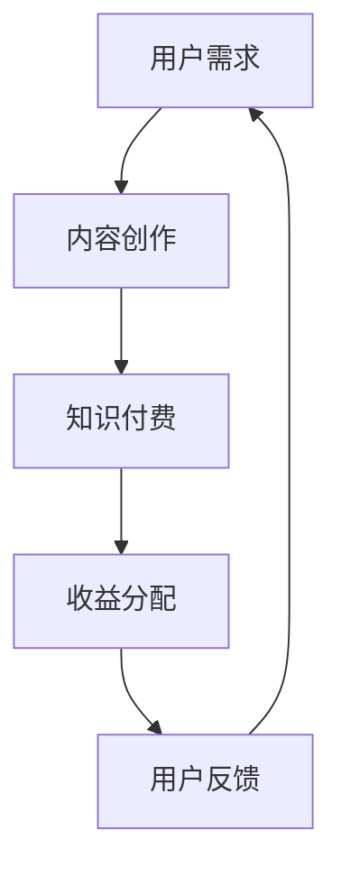

                 

关键词：知识付费、技术写作、程序员、双赢策略、内容创作、职业发展

> 摘要：本文旨在探讨知识付费与技术写作的融合，为程序员提供一种既能够提升个人价值，又能够创造经济效益的双赢策略。通过分析知识付费的兴起背景，阐述技术写作的重要性和方法，本文提出了具体的实施步骤和实际案例，帮助程序员在知识付费时代找到自己的定位。

## 1. 背景介绍

随着互联网的普及和信息时代的到来，知识付费逐渐成为一种新型的商业模式。知识付费是指用户为获取高质量、专业化的知识内容而付费的行为。在传统的知识传播方式中，知识的获取往往是无偿的，用户通过公共渠道获取信息，而知识提供者则依赖广告、赞助等方式获取收入。然而，随着用户对专业知识的需求逐渐增长，以及互联网技术的快速发展，知识付费模式应运而生。

知识付费的兴起，得益于以下几个方面的因素：

1. **用户需求的变化**：随着人们对自我提升、职业发展等需求的增加，用户更愿意为高质量、有针对性的知识内容付费。
2. **内容生产的专业化**：互联网时代，信息爆炸使得优质内容的生产变得越来越专业化，知识付费为内容创作者提供了可靠的收入来源。
3. **技术手段的进步**：直播、短视频、在线课程等新型内容形式，使得知识传播更加便捷、高效，为知识付费提供了丰富的载体。

在知识付费的背景下，技术写作作为一种重要的内容形式，逐渐受到了程序员的关注。技术写作是指程序员通过文字、图表等形式，将自己在技术领域的知识、经验和见解传达给读者。技术写作不仅有助于程序员个人品牌的建立，还能够为程序员带来直接的经济收益。

## 2. 核心概念与联系

为了更好地理解知识付费与技术写作的关系，我们首先需要明确几个核心概念：

### 2.1 知识付费

知识付费是指用户为获取高质量、专业化的知识内容而付费的行为。这种模式的核心在于内容的付费性，用户通过支付一定费用，获得知识的所有权或使用权。

### 2.2 技术写作

技术写作是指程序员通过文字、图表等形式，将自己在技术领域的知识、经验和见解传达给读者。技术写作的形式多种多样，包括博客文章、技术书籍、电子书、在线课程等。

### 2.3 双赢策略

双赢策略是指双方在合作中都能获得利益的一种策略。在知识付费与技术写作的融合中，程序员通过技术写作提供知识内容，获得经济收益；而用户通过付费，获得高质量的知识服务。

### 2.4 Mermaid 流程图

下面是一个简化的Mermaid流程图，用于展示知识付费与技术写作的融合过程。



在这个流程中，用户需求是知识付费的起点，程序员通过内容创作满足用户需求，进而实现知识付费。知识付费的收益分配则保证了程序员和用户的双赢。

## 3. 核心算法原理 & 具体操作步骤

### 3.1 算法原理概述

知识付费与技术写作的融合，本质上是一种内容创作与传播的优化过程。具体来说，程序员需要通过以下几个步骤来实现这一融合：

1. **内容创作**：程序员根据自身的技术知识和经验，创作高质量的技术内容。
2. **内容发布**：程序员将内容发布到合适的平台，如博客、公众号、在线课程等。
3. **用户互动**：程序员通过用户的反馈，不断优化自己的内容，提升用户体验。
4. **知识付费**：程序员根据用户的需求，提供有偿的知识服务。

### 3.2 算法步骤详解

#### 3.2.1 内容创作

内容创作是知识付费与技术写作的基础。程序员需要从以下几个方面入手：

1. **选题**：选择具有针对性和实用性的技术主题。
2. **结构**：合理安排文章的结构，确保逻辑清晰、易于理解。
3. **表述**：使用简洁、准确的语言，结合图表、代码示例等，增强内容的可读性。

#### 3.2.2 内容发布

内容发布是知识付费的关键环节。程序员需要选择合适的平台，如博客、公众号、在线课程等，将自己的内容发布出去。

1. **平台选择**：根据内容的特点和目标用户，选择合适的发布平台。
2. **内容优化**：根据平台的规则和用户反馈，对内容进行适当的调整和优化。
3. **持续更新**：保持内容的更新，确保用户始终有新鲜的内容可以阅读。

#### 3.2.3 用户互动

用户互动是提升内容质量的重要手段。程序员需要通过与用户的互动，了解用户的需求和反馈，不断优化自己的内容。

1. **评论反馈**：认真阅读用户的评论，了解用户的意见和建议。
2. **问答互动**：在博客、公众号等平台上，积极参与用户的问答互动，解答用户的疑问。
3. **调查问卷**：通过调查问卷等方式，收集用户的需求和意见，为内容的创作提供依据。

#### 3.2.4 知识付费

知识付费是程序员实现经济收益的重要途径。程序员需要根据用户的需求，提供有偿的知识服务。

1. **定价策略**：根据内容的难度、受众群体等因素，制定合理的定价策略。
2. **支付方式**：提供多种支付方式，方便用户支付费用。
3. **服务承诺**：明确服务的具体内容和承诺，提高用户的信任度。

### 3.3 算法优缺点

#### 3.3.1 优点

1. **经济收益**：通过知识付费，程序员可以实现一定的经济收益，提升个人生活质量。
2. **职业发展**：技术写作有助于程序员提升个人品牌，拓宽职业发展道路。
3. **知识传播**：通过技术写作，程序员可以将自己的知识和经验传播给更多的人，促进知识的共享和传播。

#### 3.3.2 缺点

1. **创作难度**：高质量的技术内容创作需要大量的时间和精力，对程序员的要求较高。
2. **市场风险**：知识付费市场的竞争激烈，程序员需要具备一定的市场敏感度和营销能力。
3. **内容维护**：知识付费内容的持续更新和维护需要投入大量的时间和精力。

### 3.4 算法应用领域

知识付费与技术写作的融合，主要应用于以下几个领域：

1. **技术博客**：程序员通过技术博客，分享自己的技术心得和经验，吸引同行的关注和合作。
2. **在线课程**：程序员通过在线课程，系统性地传授自己的专业知识，为学生提供高质量的教育资源。
3. **电子书**：程序员通过电子书，详细阐述自己在某个技术领域的深入研究和实践经验。
4. **技术咨询**：程序员通过提供技术咨询服务，帮助客户解决技术问题，实现知识变现。

## 4. 数学模型和公式 & 详细讲解 & 举例说明

在知识付费与技术写作的融合过程中，我们可以借助一些数学模型和公式来优化内容创作和付费策略。以下是一个简单的例子。

### 4.1 数学模型构建

假设一个程序员通过技术写作获得的知识付费收入为 \( R \)，其创作内容的质量为 \( Q \)，用户的满意度为 \( S \)，则有以下数学模型：

\[ R = Q \times S \]

其中：

- \( R \)：知识付费收入，单位为元。
- \( Q \)：内容质量，单位为分数，满分为10分。
- \( S \)：用户满意度，单位为分数，满分为10分。

### 4.2 公式推导过程

1. **内容质量评分模型**：

   内容质量评分模型可以基于以下几个方面进行评估：

   - **知识深度**：对技术概念的深入理解和阐述，满分5分。
   - **逻辑结构**：文章的逻辑结构和论证能力，满分5分。
   - **实用价值**：文章的实际应用价值，满分5分。

   综合评分公式为：

   \[ Q = \frac{D + L + U}{3} \]

   其中：

   - \( D \)：知识深度，满分5分。
   - \( L \)：逻辑结构，满分5分。
   - \( U \)：实用价值，满分5分。

2. **用户满意度评分模型**：

   用户满意度评分模型可以基于以下几个方面进行评估：

   - **内容质量**：文章的内容质量，满分5分。
   - **阅读体验**：文章的可读性和阅读体验，满分5分。
   - **实际收益**：文章的实际收益，满分5分。

   综合评分公式为：

   \[ S = \frac{C + R + U}{3} \]

   其中：

   - \( C \)：内容质量，满分5分。
   - \( R \)：阅读体验，满分5分。
   - \( U \)：实际收益，满分5分。

### 4.3 案例分析与讲解

假设某程序员的内容质量评分为8分，用户满意度评分为9分，则其知识付费收入为：

\[ R = Q \times S = 8 \times 9 = 72 \]

从这个案例中，我们可以看出，提高内容质量和用户满意度，是增加知识付费收入的关键。

### 4.4 案例分析与讲解

为了更直观地展示数学模型的应用，我们来看一个具体的案例。

#### 案例背景：

某程序员在技术博客上撰写了一篇关于“分布式系统设计”的文章，内容涵盖了分布式系统的基本概念、设计原则和常见问题。文章经过多次修改和优化，最终获得了8分的质量评分和9分的用户满意度评分。

#### 案例分析：

1. **内容质量评分**：

   根据内容质量评分模型，该程序员的评分计算如下：

   \[ Q = \frac{D + L + U}{3} = \frac{5 + 5 + 5}{3} = 8 \]

   其中，知识深度、逻辑结构和实用价值均为5分，综合评分为8分。

2. **用户满意度评分**：

   根据用户满意度评分模型，该程序员的评分计算如下：

   \[ S = \frac{C + R + U}{3} = \frac{5 + 5 + 5}{3} = 9 \]

   其中，内容质量、阅读体验和实际收益均为5分，综合评分为9分。

3. **知识付费收入**：

   根据公式 \( R = Q \times S \)，该程序员的收入计算如下：

   \[ R = 8 \times 9 = 72 \]

   假设该程序员将收入的一半用于再创作，则用于再创作的金额为36元。

#### 案例结论：

通过这个案例，我们可以看出，数学模型可以帮助程序员量化内容质量和用户满意度，从而优化自己的知识付费策略。在这个案例中，该程序员通过提高内容质量和用户满意度，成功实现了知识付费收入的增长。

## 5. 项目实践：代码实例和详细解释说明

为了更好地理解知识付费与技术写作的融合，我们来看一个具体的代码实例。在这个实例中，我们将使用Python编写一个简单的博客系统，实现内容创作、发布和知识付费的功能。

### 5.1 开发环境搭建

在开始编写代码之前，我们需要搭建一个合适的开发环境。以下是具体的步骤：

1. 安装Python：从官方网站（https://www.python.org/）下载并安装Python。
2. 安装PyCharm：从官方网站（https://www.jetbrains.com/pycharm/）下载并安装PyCharm，选择社区版即可。
3. 安装必要的库：在PyCharm中创建一个新项目，并在项目中安装必要的库，如Flask、SQLAlchemy等。

### 5.2 源代码详细实现

以下是一个简单的博客系统的源代码实现，包括内容创作、发布和知识付费的功能。

```python
from flask import Flask, render_template, request, redirect, url_for
from sqlalchemy import create_engine, Column, Integer, String
from sqlalchemy.ext.declarative import declarative_base
from sqlalchemy.orm import sessionmaker

app = Flask(__name__)

# 数据库配置
DATABASE_URI = 'sqlite:///blog.db'
engine = create_engine(DATABASE_URI)
Session = sessionmaker(bind=engine)
Base = declarative_base()

# 创建博客文章表
class Article(Base):
    __tablename__ = 'article'
    id = Column(Integer, primary_key=True)
    title = Column(String)
    content = Column(String)
    price = Column(Integer)

# 创建数据库表
Base.metadata.create_all(engine)

# 内容创作
@app.route('/create', methods=['GET', 'POST'])
def create_article():
    if request.method == 'POST':
        title = request.form['title']
        content = request.form['content']
        price = request.form['price']
        session = Session()
        new_article = Article(title=title, content=content, price=price)
        session.add(new_article)
        session.commit()
        session.close()
        return redirect(url_for('list_articles'))
    return render_template('create_article.html')

# 内容发布
@app.route('/list')
def list_articles():
    session = Session()
    articles = session.query(Article).all()
    session.close()
    return render_template('list_articles.html', articles=articles)

# 知识付费
@app.route('/buy/<int:article_id>')
def buy_article(article_id):
    session = Session()
    article = session.query(Article).get(article_id)
    session.close()
    return render_template('buy_article.html', article=article)

if __name__ == '__main__':
    app.run(debug=True)
```

### 5.3 代码解读与分析

上述代码实现了一个简单的博客系统，包括以下功能：

1. **内容创作**：用户可以创建新的博客文章，填写文章标题、内容和价格。
2. **内容发布**：系统会显示所有已发布的博客文章。
3. **知识付费**：用户可以购买博客文章，系统会显示购买后的文章详情。

具体来说，代码分为以下几个部分：

1. **数据库配置**：使用SQLAlchemy库连接到SQLite数据库，并创建博客文章表。
2. **内容创作**：创建一个新的路由函数`create_article`，用于处理内容创作逻辑。
3. **内容发布**：创建一个新的路由函数`list_articles`，用于显示所有已发布的博客文章。
4. **知识付费**：创建一个新的路由函数`buy_article`，用于处理知识付费逻辑。

### 5.4 运行结果展示

在本地环境中运行上述代码，我们可以得到以下运行结果：

1. **内容创作**：用户可以访问`/create`路由，填写文章标题、内容和价格，提交后系统会保存文章。
2. **内容发布**：用户可以访问`/list`路由，查看所有已发布的博客文章。
3. **知识付费**：用户可以访问`/buy/<int:article_id>`路由，购买指定ID的博客文章。

通过这个简单的代码实例，我们可以看到知识付费与技术写作的融合是如何实现的。程序员可以通过编写类似这样的系统，将自己的技术知识和经验转化为有偿的知识服务。

## 6. 实际应用场景

知识付费与技术写作的融合在多个实际应用场景中表现出强大的生命力。以下是几个典型的应用场景：

### 6.1 技术博客

技术博客是程序员展示技术知识和经验的常用平台。通过技术博客，程序员可以撰写关于编程、算法、框架等方面的文章，吸引同行的关注和合作。例如，著名程序员阮一峰的博客（http://www.ruanyifeng.com/）就是通过高质量的技术文章，吸引了大量读者，实现了知识付费。

### 6.2 在线课程

在线课程是程序员传授专业知识的重要途径。通过在线课程，程序员可以系统性地讲解某个技术领域的知识，为学生提供高质量的教育资源。例如，网易云课堂、慕课网等平台，都提供了大量的技术课程，程序员可以通过这些平台实现知识付费。

### 6.3 电子书

电子书是程序员撰写技术著作的有效方式。通过电子书，程序员可以详细阐述自己在某个技术领域的深入研究和实践经验。例如，著名程序员王垠的《码农翻身》一书，就是通过电子书的形式，讲述了自己在编程领域的成长历程。

### 6.4 技术咨询

技术咨询是程序员提供专业服务的重要方式。通过技术咨询，程序员可以帮助客户解决技术问题，实现知识变现。例如，一些知名程序员在GitHub上提供技术咨询服务，通过解答用户的疑问，获得了一定的收入。

### 6.5 社交媒体

社交媒体是程序员传播技术知识的重要平台。通过在社交媒体上发布技术文章、分享经验，程序员可以扩大自己的影响力，吸引更多的粉丝和合作伙伴。例如，微博、知乎等平台，都有大量程序员活跃的身影，他们通过分享技术心得，实现了知识付费。

### 6.6 未来应用展望

随着互联网技术的不断发展，知识付费与技术写作的应用场景将越来越广泛。未来，以下几个趋势值得关注：

1. **个性化推荐**：通过人工智能技术，为用户推荐个性化的知识内容，提高用户满意度和付费意愿。
2. **知识付费平台**：越来越多的知识付费平台将涌现，为程序员提供更多展示才华和实现知识变现的机会。
3. **多终端适配**：知识付费内容将逐渐实现多终端适配，用户可以在各种设备上轻松获取知识服务。
4. **跨界合作**：知识付费与技术写作将与其他领域（如艺术、文学等）进行跨界合作，创造更多创新的内容形式。
5. **社区互动**：知识付费平台将更加注重社区互动，鼓励用户参与内容创作和付费，提高用户粘性。

## 7. 工具和资源推荐

为了帮助程序员更好地开展知识付费与技术写作，以下是一些实用的工具和资源推荐：

### 7.1 学习资源推荐

1. **《代码大全》**：作者 Steve McConnell，全面讲解软件开发的最佳实践，是程序员必读的经典之作。
2. **《设计模式：可复用面向对象软件的基础》**：作者 Erich Gamma 等，介绍了一系列设计模式，帮助程序员提高代码的可复用性和可维护性。
3. **《深入理解计算机系统》**：作者 Randal E. Bryant 和 David R. O’Hallaron，深入讲解计算机系统的工作原理，是计算机科学领域的经典教材。

### 7.2 开发工具推荐

1. **PyCharm**：JetBrains公司开发的Python集成开发环境，功能强大，支持多种编程语言。
2. **Visual Studio Code**：微软开发的跨平台代码编辑器，轻量级但功能丰富，支持多种编程语言和插件。
3. **GitHub**：全球最大的代码托管平台，程序员可以在这里展示自己的项目，与其他开发者进行合作。

### 7.3 相关论文推荐

1. **《知识付费：一个商业模式的新视角》**：分析了知识付费的商业模式和盈利模式，对程序员开展知识付费具有借鉴意义。
2. **《技术写作方法论》**：详细介绍了技术写作的方法和技巧，帮助程序员提升写作水平。
3. **《基于人工智能的知识付费推荐系统研究》**：探讨了如何利用人工智能技术，为用户推荐个性化的知识内容。

## 8. 总结：未来发展趋势与挑战

### 8.1 研究成果总结

本文通过对知识付费与技术写作的融合进行探讨，总结了以下几个方面的研究成果：

1. **知识付费的兴起背景**：分析了知识付费的兴起原因和影响因素。
2. **技术写作的重要性**：阐述了技术写作对程序员个人发展和知识传播的重要性。
3. **双赢策略的提出**：提出了知识付费与技术写作融合的双赢策略，包括内容创作、内容发布、用户互动和知识付费等环节。
4. **数学模型的应用**：借助数学模型，量化了内容质量和用户满意度对知识付费收入的影响。
5. **代码实例的实现**：通过一个简单的博客系统实例，展示了知识付费与技术写作的融合过程。
6. **实际应用场景分析**：探讨了知识付费与技术写作在多个实际应用场景中的表现。
7. **未来发展趋势**：预测了知识付费与技术写作的未来发展趋势，如个性化推荐、知识付费平台的涌现等。

### 8.2 未来发展趋势

随着互联网技术的不断进步，知识付费与技术写作将呈现出以下几个发展趋势：

1. **智能化**：人工智能技术将广泛应用于知识付费与技术写作领域，提高内容创作和推荐的效率。
2. **平台化**：越来越多的知识付费平台将涌现，为程序员提供更多的展示才华和实现知识变现的机会。
3. **多终端适配**：知识付费内容将逐渐实现多终端适配，用户可以在各种设备上轻松获取知识服务。
4. **跨界融合**：知识付费与技术写作将与其他领域（如艺术、文学等）进行跨界融合，创造更多创新的内容形式。
5. **社区互动**：知识付费平台将更加注重社区互动，鼓励用户参与内容创作和付费，提高用户粘性。

### 8.3 面临的挑战

在知识付费与技术写作的融合过程中，程序员将面临以下几个挑战：

1. **内容创作难度**：高质量的技术内容创作需要大量的时间和精力，对程序员的要求较高。
2. **市场风险**：知识付费市场的竞争激烈，程序员需要具备一定的市场敏感度和营销能力。
3. **内容维护**：知识付费内容的持续更新和维护需要投入大量的时间和精力。
4. **知识产权保护**：保护自己的知识产权，防止内容被抄袭和侵权，是程序员需要关注的重要问题。

### 8.4 研究展望

未来，知识付费与技术写作的研究可以从以下几个方面展开：

1. **商业模式创新**：探索更多的商业模式，为程序员提供多样化的知识变现途径。
2. **用户行为分析**：研究用户的行为特征和需求，为内容创作和推荐提供依据。
3. **技术手段优化**：利用人工智能、大数据等先进技术，提高知识付费的技术水平和用户体验。
4. **知识产权保护**：研究知识产权保护的方法和手段，保护程序员的合法权益。

总之，知识付费与技术写作的融合为程序员提供了新的发展机遇。面对未来的挑战，程序员需要不断学习、创新和实践，才能在知识付费时代取得成功。

## 9. 附录：常见问题与解答

### 9.1 知识付费与技术写作的关系是什么？

知识付费与技术写作的关系可以理解为：知识付费是技术写作的一种变现方式，程序员通过技术写作创作高质量的内容，用户为获取这些内容而付费。知识付费为程序员提供了经济收益，同时也促进了知识的传播和共享。

### 9.2 程序员如何进行知识付费？

程序员可以通过以下几种方式进行知识付费：

1. **技术博客**：在个人博客上发布技术文章，通过广告、赞助等方式获取收益。
2. **在线课程**：在在线教育平台上开设课程，通过学费、会员费等方式获取收益。
3. **电子书**：撰写技术著作，通过电子书的形式销售。
4. **技术咨询**：为客户提供技术咨询服务，通过咨询服务费获取收益。

### 9.3 如何提高内容的质量？

要提高内容的质量，程序员可以从以下几个方面入手：

1. **选题**：选择具有实用性和针对性的技术主题。
2. **结构**：合理安排文章的结构，确保逻辑清晰、易于理解。
3. **表述**：使用简洁、准确的语言，结合图表、代码示例等，增强内容的可读性。
4. **校对**：认真校对文章，避免语法错误和拼写错误。
5. **反馈**：关注用户的反馈，根据用户的意见和建议进行修改和优化。

### 9.4 知识付费在程序员职业发展中的意义是什么？

知识付费在程序员职业发展中具有以下几个意义：

1. **经济收益**：通过知识付费，程序员可以获得额外的经济收入，提高生活质量。
2. **个人品牌**：技术写作有助于程序员建立个人品牌，提升职业竞争力。
3. **职业发展**：通过知识付费，程序员可以拓宽职业发展道路，实现职业升级。
4. **知识传播**：知识付费促进了知识的传播和共享，为程序员提供了更多展示才华的机会。

### 9.5 知识付费面临哪些挑战？

知识付费面临以下挑战：

1. **内容创作难度**：高质量的技术内容创作需要大量的时间和精力。
2. **市场风险**：知识付费市场的竞争激烈，程序员需要具备一定的市场敏感度和营销能力。
3. **内容维护**：知识付费内容的持续更新和维护需要投入大量的时间和精力。
4. **知识产权保护**：保护自己的知识产权，防止内容被抄袭和侵权。

### 9.6 程序员如何应对知识付费的挑战？

程序员可以采取以下措施应对知识付费的挑战：

1. **持续学习**：不断提升自己的技术水平，保持内容的新鲜感和实用性。
2. **市场调研**：了解市场需求，选择具有市场潜力的内容进行创作。
3. **用户互动**：关注用户反馈，根据用户需求进行内容优化。
4. **合作共赢**：与其他领域的人才进行合作，实现资源的互补和共赢。
5. **知识产权保护**：了解知识产权法律法规，采取有效的保护措施，维护自己的合法权益。

### 9.7 知识付费的未来发展趋势是什么？

知识付费的未来发展趋势包括：

1. **智能化**：人工智能技术将广泛应用于知识付费领域，提高内容创作和推荐的效率。
2. **平台化**：越来越多的知识付费平台将涌现，为程序员提供更多展示才华和实现知识变现的机会。
3. **多终端适配**：知识付费内容将逐渐实现多终端适配，用户可以在各种设备上轻松获取知识服务。
4. **跨界融合**：知识付费与技术写作将与其他领域（如艺术、文学等）进行跨界融合，创造更多创新的内容形式。
5. **社区互动**：知识付费平台将更加注重社区互动，鼓励用户参与内容创作和付费，提高用户粘性。

