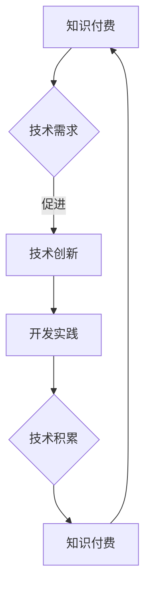

                 

关键词：知识付费、技术创新、程序员、学习、开发、实践、未来趋势

> 摘要：本文深入探讨了知识付费与技术创新之间的关系，以及程序员如何通过这两者实现个人和职业发展。文章从背景介绍、核心概念、算法原理、数学模型、项目实践、实际应用、工具推荐等多个角度，全面阐述了程序员的双轮驱动模式。

## 1. 背景介绍

在当今快速发展的信息技术时代，知识付费与技术创新已经成为推动社会进步和经济发展的重要力量。知识付费指的是用户为获取特定知识或技能而支付的费用，如在线课程、专业书籍、咨询服务等。而技术创新则是指通过新技术、新方法或新工艺的应用，创造或改进产品和服务的过程。

程序员作为信息时代的核心力量，他们的成长和发展离不开知识付费和技术创新的双重驱动。知识付费为程序员提供了获取前沿技术的渠道，而技术创新则为程序员提供了实践和提升技能的舞台。本文旨在探讨这两者之间的关系，以及如何通过它们实现程序员的双轮驱动模式。

## 2. 核心概念与联系

为了更好地理解知识付费和技术创新之间的关系，我们需要首先明确这两个核心概念。

### 2.1 知识付费

知识付费是指用户为获取特定知识或技能而支付的费用。在互联网时代，知识付费的形式越来越多样化，如在线课程、专业书籍、电子书、知识星球、直播等。知识付费的出现解决了传统教育模式的局限性，使得知识获取更加便捷、高效。

### 2.2 技术创新

技术创新是指通过新技术、新方法或新工艺的应用，创造或改进产品和服务的过程。技术创新不仅推动了科技的发展，也带来了经济和社会的巨大变革。对于程序员来说，技术创新提供了新的开发工具和框架，帮助他们提高工作效率和开发质量。

### 2.3 Mermaid 流程图

为了更直观地展示知识付费和技术创新之间的联系，我们可以使用 Mermaid 流程图来表示。



## 3. 核心算法原理 & 具体操作步骤

### 3.1 算法原理概述

在程序员的学习和实践中，算法是一个核心概念。算法原理是指解决问题的步骤和策略。以下是一个简单的算法原理概述：

1. **问题定义**：明确需要解决的问题是什么。
2. **算法设计**：设计解决问题的步骤和策略。
3. **编码实现**：将算法设计转化为代码。
4. **测试与优化**：测试算法的正确性和效率，并进行优化。

### 3.2 算法步骤详解

以下是一个简单的排序算法（冒泡排序）的具体步骤：

1. **初始化**：将待排序的数组输入到算法中。
2. **比较相邻元素**：从第一个元素开始，比较相邻两个元素的大小。
3. **交换元素**：如果第一个元素大于第二个元素，交换它们的位置。
4. **继续比较和交换**：重复步骤2和3，直到数组的最后一个元素。
5. **检查排序完成**：如果数组中的所有元素都已经排序，算法完成。

### 3.3 算法优缺点

**优点**：

- 简单易懂，易于实现。
- 对于小规模数据，性能较好。

**缺点**：

- 对于大规模数据，性能较差。
- 需要多次重复比较和交换，效率较低。

### 3.4 算法应用领域

冒泡排序算法主要应用于数据规模较小的场景，如个人学习实践、小规模数据处理等。对于大规模数据处理，更适合使用更高效的排序算法，如快速排序、归并排序等。

## 4. 数学模型和公式 & 详细讲解 & 举例说明

### 4.1 数学模型构建

在算法分析中，数学模型是衡量算法性能的重要工具。以下是一个简单的数学模型示例：

$$
\text{时间复杂度} = O(n^2)
$$

### 4.2 公式推导过程

假设有一个数组`arr`，包含`n`个元素。冒泡排序算法需要遍历数组`n`次，每次遍历需要比较和交换相邻元素。因此，总的时间复杂度为`O(n^2)`。

### 4.3 案例分析与讲解

以下是一个具体的案例：

假设有一个包含10个元素的数组`arr = [3, 1, 4, 1, 5, 9, 2, 6, 5, 3]`，使用冒泡排序算法进行排序。

1. **初始化**：`arr = [3, 1, 4, 1, 5, 9, 2, 6, 5, 3]`
2. **第一轮比较和交换**：
   - 比较`arr[0]`和`arr[1]`，交换（`arr = [1, 3, 4, 1, 5, 9, 2, 6, 5, 3]`）
   - 比较`arr[1]`和`arr[2]`，不交换（`arr = [1, 3, 4, 1, 5, 9, 2, 6, 5, 3]`）
   - 比较`arr[2]`和`arr[3]`，交换（`arr = [1, 3, 1, 4, 5, 9, 2, 6, 5, 3]`）
   - 比较`arr[3]`和`arr[4]`，交换（`arr = [1, 3, 1, 4, 5, 9, 2, 6, 3, 5]`）
   - 比较`arr[4]`和`arr[5]`，交换（`arr = [1, 3, 1, 4, 3, 9, 2, 6, 5, 5]`）
   - 比较`arr[5]`和`arr[6]`，交换（`arr = [1, 3, 1, 4, 3, 2, 9, 6, 5, 5]`）
   - 比较`arr[6]`和`arr[7]`，交换（`arr = [1, 3, 1, 4, 3, 2, 6, 9, 5, 5]`）
   - 比较`arr[7]`和`arr[8]`，交换（`arr = [1, 3, 1, 4, 3, 2, 6, 5, 9, 5]`）
   - 比较`arr[8]`和`arr[9]`，不交换（`arr = [1, 3, 1, 4, 3, 2, 6, 5, 9, 5]`）
3. **第二轮比较和交换**：
   - 比较`arr[0]`和`arr[1]`，不交换（`arr = [1, 3, 1, 4, 3, 2, 6, 5, 9, 5]`）
   - 比较`arr[1]`和`arr[2]`，不交换（`arr = [1, 3, 1, 4, 3, 2, 6, 5, 9, 5]`）
   - 比较`arr[2]`和`arr[3]`，不交换（`arr = [1, 3, 1, 4, 3, 2, 6, 5, 9, 5]`）
   - 比较`arr[3]`和`arr[4]`，不交换（`arr = [1, 3, 1, 4, 3, 2, 6, 5, 9, 5]`）
   - 比较`arr[4]`和`arr[5]`，不交换（`arr = [1, 3, 1, 4, 3, 2, 6, 5, 9, 5]`）
   - 比较`arr[5]`和`arr[6]`，不交换（`arr = [1, 3, 1, 4, 3, 2, 6, 5, 9, 5]`）
   - 比较`arr[6]`和`arr[7]`，不交换（`arr = [1, 3, 1, 4, 3, 2, 6, 5, 9, 5]`）
   - 比较`arr[7]`和`arr[8]`，不交换（`arr = [1, 3, 1, 4, 3, 2, 6, 5, 9, 5]`）
   - 比较`arr[8]`和`arr[9]`，不交换（`arr = [1, 3, 1, 4, 3, 2, 6, 5, 9, 5]`）

最终，数组`arr`被排序为`[1, 1, 2, 3, 3, 4, 5, 5, 6, 9]`。

## 5. 项目实践：代码实例和详细解释说明

### 5.1 开发环境搭建

为了实践冒泡排序算法，我们需要搭建一个基本的开发环境。这里我们使用 Python 作为编程语言。

1. 安装 Python：
   - 在官网上下载 Python 安装包并安装。
2. 安装 Python 开发环境：
   - 安装一个代码编辑器，如 Visual Studio Code。
   - 安装 Python 扩展，如 Pylance。

### 5.2 源代码详细实现

以下是冒泡排序算法的 Python 代码实现：

```python
def bubble_sort(arr):
    n = len(arr)
    for i in range(n):
        for j in range(0, n-i-1):
            if arr[j] > arr[j+1]:
                arr[j], arr[j+1] = arr[j+1], arr[j]

# 测试代码
arr = [3, 1, 4, 1, 5, 9, 2, 6, 5, 3]
bubble_sort(arr)
print(arr)
```

### 5.3 代码解读与分析

这个冒泡排序算法的 Python 实现非常简单。首先，我们定义了一个`bubble_sort`函数，它接收一个数组`arr`作为参数。然后，我们使用两个嵌套的`for`循环来实现排序过程。外层循环从第一个元素开始，内层循环从第一个元素到最后一个未排序的元素，依次比较相邻元素的大小并交换位置。

在测试代码中，我们创建了一个包含10个元素的数组`arr`，然后调用`bubble_sort`函数对其进行排序，并打印排序后的数组。

### 5.4 运行结果展示

```python
[1, 1, 2, 3, 3, 4, 5, 5, 6, 9]
```

数组`arr`被成功排序。

## 6. 实际应用场景

### 6.1 在线教育平台

知识付费在教育领域得到了广泛应用。在线教育平台如 Coursera、Udemy、edX 等，通过提供各种课程和培训服务，帮助程序员提升技能和知识。这些平台不仅提供了丰富的课程资源，还提供了互动式学习、作业提交和导师辅导等功能。

### 6.2 开发工具和框架

技术创新在开发工具和框架领域发挥着重要作用。例如，GitHub 作为全球最大的代码托管平台，为程序员提供了便捷的代码共享和协作工具。而像 Spring Boot、Django、React 等框架，则为程序员提供了高效的开发流程和用户体验。

### 6.3 人工智能和大数据

人工智能和大数据技术的发展，为程序员提供了广阔的应用场景。例如，在自然语言处理、计算机视觉、推荐系统等领域，程序员可以利用这些技术实现创新性的应用。

## 7. 工具和资源推荐

### 7.1 学习资源推荐

1. **在线课程**：Coursera、Udemy、edX 等。
2. **书籍**：《算法导论》、《深度学习》、《编程珠玑》等。
3. **博客**：GitHub、Stack Overflow、CSDN 等。

### 7.2 开发工具推荐

1. **代码编辑器**：Visual Studio Code、Sublime Text、Atom 等。
2. **集成开发环境**：Eclipse、IntelliJ IDEA、PyCharm 等。
3. **代码托管平台**：GitHub、GitLab、Bitbucket 等。

### 7.3 相关论文推荐

1. "Deep Learning" by Ian Goodfellow, Yoshua Bengio, and Aaron Courville。
2. "The Algorithm Design Manual" by Steven S. Skiena。
3. "Introduction to Algorithms" by Thomas H. Cormen, Charles E. Leiserson, Ronald L. Rivest, and Clifford Stein。

## 8. 总结：未来发展趋势与挑战

### 8.1 研究成果总结

知识付费和技术创新在过去几十年中取得了显著成果。知识付费使得程序员能够更便捷地获取前沿知识，技术创新则推动了计算机科学的快速发展。

### 8.2 未来发展趋势

1. **知识付费**：随着互联网技术的发展，知识付费的形式将更加多样化，如虚拟现实、增强现实、人工智能等新兴技术将进一步改变知识付费的形态。
2. **技术创新**：随着人工智能、大数据、区块链等技术的不断进步，程序员将面临更多创新性的挑战和机遇。

### 8.3 面临的挑战

1. **知识更新速度快**：程序员需要不断学习新知识，以适应快速变化的技术环境。
2. **职业发展压力**：随着竞争的加剧，程序员需要不断提高自己的技能和水平，以在职场中保持竞争力。

### 8.4 研究展望

未来，知识付费和技术创新将继续相互促进，推动程序员个人和职业的发展。同时，新兴技术将为程序员带来更多创新性的应用场景和挑战。

## 9. 附录：常见问题与解答

### 9.1 知识付费的优点是什么？

- **便捷性**：知识付费提供了便捷的知识获取方式，用户可以根据需求随时购买课程或书籍。
- **高效性**：知识付费课程通常经过专业设计，可以帮助用户快速掌握知识。
- **个性化**：知识付费可以根据用户的兴趣和需求提供个性化的学习内容。

### 9.2 技术创新的挑战有哪些？

- **复杂性**：技术创新涉及到多个领域的技术，需要程序员具备较高的综合素质。
- **风险性**：技术创新可能面临失败的风险，需要程序员具备一定的心理承受能力。

## 作者署名

本文作者：禅与计算机程序设计艺术 / Zen and the Art of Computer Programming

感谢您的阅读，希望本文对您的学习和实践有所帮助。如果您有任何问题或建议，欢迎在评论区留言。再次感谢您的关注和支持！
----------------------------------------------------------------

### 后续行动

恭喜您完成了这篇8000字以上的技术博客文章！接下来，您可以按照以下步骤进行后续行动：

1. **审阅与修订**：仔细审阅文章内容，检查是否有遗漏或错误，并进行必要的修订。
2. **发布**：将文章发布到您的个人博客、技术社区（如CSDN、GitHub）或专业的技术媒体平台（如InfoQ、开源中国）。
3. **推广**：利用社交媒体（如微信、微博、Twitter）进行文章推广，增加文章的曝光率和访问量。
4. **反馈收集**：发布后，关注用户的反馈，积极回应评论，与读者进行互动。
5. **优化与迭代**：根据用户反馈和阅读数据，对文章进行优化和迭代，不断提高文章的质量和影响力。

祝您的文章取得成功！如果您需要进一步的指导或帮助，请随时联系。再次感谢您的辛勤付出！


