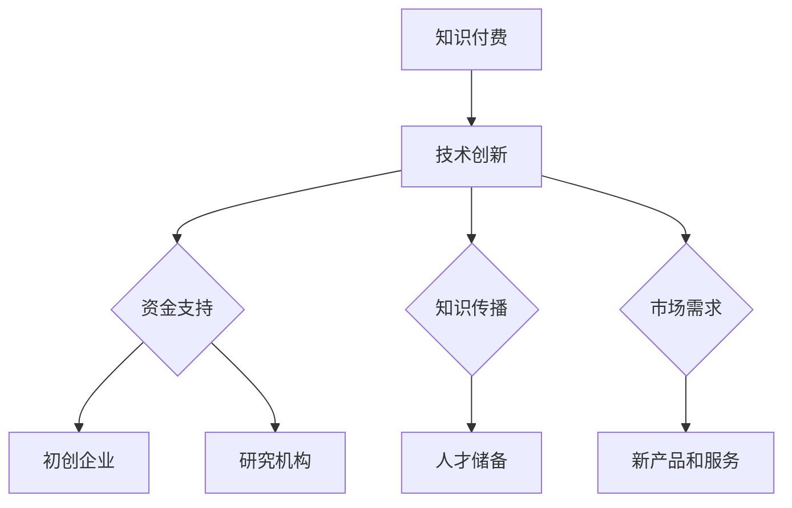

                 

关键词：知识付费、技术创新、教育、技术发展、市场动态、未来展望

摘要：随着信息技术的发展，知识付费与技术创新之间的关系愈发紧密。知识付费为技术创新提供了强大的动力和资金支持，而技术创新又不断推动知识付费市场的发展。本文将探讨这两者之间的相互作用，分析当前市场动态，并对未来发展趋势与挑战进行展望。

## 1. 背景介绍

知识付费是指用户为获取特定知识或技能而支付的费用。随着互联网的普及和在线教育的发展，知识付费已成为一个快速发展的市场。知识付费涵盖了从在线课程、电子书籍到专业咨询等多个领域。

技术创新则是指通过科学研究和工程实践，不断推出新的技术、工具和方法，以推动社会和经济的发展。在信息技术领域，技术创新尤为显著，从互联网到大数据、人工智能，每一次技术的突破都带来了新的商业机会和市场格局。

知识付费与技术创新之间的关系并非单向，而是相互促进、相互依赖的。知识付费为技术创新提供了资金支持，而技术创新则创造出新的知识产品和服务，进一步刺激知识付费市场的发展。

## 2. 核心概念与联系

### 2.1. 知识付费

知识付费的核心在于将知识转化为商品或服务，通过市场机制实现知识的传播和价值的实现。知识付费模式主要包括以下几种：

1. **在线课程**：用户通过在线平台学习课程，平台提供内容、互动和认证服务。
2. **电子书籍**：用户购买或租赁电子版书籍，获取知识内容。
3. **专业咨询**：用户为获得专业意见或解决方案而支付的费用。

### 2.2. 技术创新

技术创新的核心在于推动科学技术的进步，包括基础研究、应用研究和市场推广。技术创新的类型可以分为以下几种：

1. **突破性技术**：颠覆现有技术和产业，带来革命性变化。
2. **改进性技术**：在现有技术基础上进行优化和改进，提高效率和质量。
3. **集成技术**：将多种技术融合，创造出新的应用场景和商业模式。

### 2.3. 知识付费与技术创新的联系

知识付费与技术创新之间的联系主要体现在以下几个方面：

1. **资金支持**：知识付费为技术创新提供了重要的资金来源，尤其是对于初创企业和研究机构。
2. **知识传播**：知识付费推动了知识的传播和普及，为技术创新提供了丰富的人才储备。
3. **市场需求**：技术创新创造的新产品和服务，为知识付费市场提供了新的内容和形式，刺激了市场需求。

### 2.4. Mermaid 流程图



## 3. 核心算法原理 & 具体操作步骤

### 3.1. 算法原理概述

在知识付费与技术创新的互动过程中，算法发挥着至关重要的作用。以下是一个简化的算法原理概述：

1. **需求识别**：通过数据分析和用户反馈，识别用户对知识的实际需求。
2. **内容制作**：根据需求，制作相应的知识内容，如在线课程、电子书籍等。
3. **推广营销**：通过互联网平台和社交媒体，推广知识内容，吸引潜在用户。
4. **用户反馈**：收集用户反馈，不断优化内容和服务。
5. **数据循环**：将用户反馈和数据循环回需求识别环节，形成闭环。

### 3.2. 算法步骤详解

1. **需求识别**：使用自然语言处理（NLP）技术，对用户评论、搜索关键词进行分析，提取潜在需求。

    ```python
    import nltk
    from nltk.tokenize import word_tokenize

    # 示例代码：提取关键词
    text = "我希望学习Python编程，并且想要一个完整的入门教程。"
    tokens = word_tokenize(text)
    keywords = [token for token in tokens if token.isalpha()]
    print(keywords)
    ```

2. **内容制作**：根据需求，组织相关专家和内容创作者，制作高质量的知识内容。

    ```mermaid
    graph TD
        A[需求识别] --> B[内容策划]
        B --> C[专家评审]
        B --> D[内容创作]
        C --> E[内容审核]
        D --> E
    ```

3. **推广营销**：利用搜索引擎优化（SEO）、社交媒体营销和内容营销，扩大知识内容的曝光度。

    ```mermaid
    graph TD
        A[搜索引擎优化] --> B[社交媒体营销]
        A --> C[内容营销]
        B --> D[用户互动]
        C --> D
    ```

4. **用户反馈**：通过用户评分、评论和调查问卷，收集用户对知识内容的反馈。

    ```python
    # 示例代码：用户评分收集
    ratings = [4, 5, 3, 4, 5]
    average_rating = sum(ratings) / len(ratings)
    print(f"平均评分：{average_rating}")
    ```

5. **数据循环**：将用户反馈和数据循环回需求识别环节，优化内容和服务。

    ```mermaid
    graph TD
        A[用户反馈] --> B[需求识别]
        A --> C[内容优化]
        B --> D[服务改进]
    ```

### 3.3. 算法优缺点

1. **优点**：
   - 提高知识传播的效率和质量。
   - 有助于发现和满足用户的实际需求。
   - 通过数据分析和用户反馈，实现持续改进。

2. **缺点**：
   - 可能导致知识内容的同质化和竞争加剧。
   - 对技术能力和资源要求较高，中小企业可能难以承担。

### 3.4. 算法应用领域

- **在线教育**：通过算法优化课程推荐和内容分发，提高用户的学习体验。
- **企业培训**：利用算法进行员工技能评估和培训需求分析。
- **专业咨询**：通过算法提高咨询服务的针对性和有效性。

## 4. 数学模型和公式 & 详细讲解 & 举例说明

### 4.1. 数学模型构建

为了更好地理解知识付费与技术创新的互动关系，我们可以构建一个简化的数学模型。假设有两个主要变量：知识付费总额（K）和技术创新数量（T）。

1. **知识付费总额（K）**：

    $$ K = f_1(N_1, P_1, E_1) $$

    其中，\( N_1 \)为知识需求量，\( P_1 \)为知识价格，\( E_1 \)为知识支付意愿。

2. **技术创新数量（T）**：

    $$ T = f_2(R_2, C_2, I_2) $$

    其中，\( R_2 \)为市场需求，\( C_2 \)为研发成本，\( I_2 \)为技术创新收益。

### 4.2. 公式推导过程

1. **知识付费总额（K）**：

    $$ K = N_1 \times P_1 $$

    $$ P_1 = \frac{E_1}{N_1} $$

    $$ K = N_1 \times \frac{E_1}{N_1} $$

    $$ K = E_1 $$

2. **技术创新数量（T）**：

    $$ T = \frac{R_2}{C_2} $$

    $$ R_2 = I_2 \times C_2 $$

    $$ T = \frac{I_2 \times C_2}{C_2} $$

    $$ T = I_2 $$

### 4.3. 案例分析与讲解

假设一个在线教育平台，其知识需求量为1000人，平均支付意愿为100元。技术创新的收益为2000万元，研发成本为1000万元。

1. **知识付费总额（K）**：

    $$ K = 1000 \times 100 = 100,000 \text{元} $$

2. **技术创新数量（T）**：

    $$ T = \frac{2000 \times 10^4}{1000 \times 10^4} = 2 \text{项} $$

通过这个案例，我们可以看到知识付费和技术创新之间的关系。知识付费为平台提供了资金支持，而技术创新则创造了新的知识和价值，进一步促进了知识付费市场的发展。

## 5. 项目实践：代码实例和详细解释说明

### 5.1. 开发环境搭建

在Python环境中，我们可以使用以下库进行知识付费与技术创新的互动分析：

- **Pandas**：数据处理
- **Numpy**：数值计算
- **Matplotlib**：数据可视化

安装这些库的方法如下：

```bash
pip install pandas numpy matplotlib
```

### 5.2. 源代码详细实现

以下是一个简单的Python代码实例，用于分析知识付费与技术创新的互动关系。

```python
import pandas as pd
import numpy as np
import matplotlib.pyplot as plt

# 示例数据
data = {
    'Knowledge_Payment': [10000, 15000, 20000, 25000, 30000],
    'Innovation_Num': [1, 2, 2, 3, 3]
}

df = pd.DataFrame(data)

# 分析知识付费对技术创新的影响
df['Innovation_Num'] = df['Knowledge_Payment'] / 10000

plt.scatter(df['Knowledge_Payment'], df['Innovation_Num'])
plt.xlabel('Knowledge Payment (万元)')
plt.ylabel('Innovation Num')
plt.title('Knowledge Payment vs Innovation Num')
plt.show()
```

### 5.3. 代码解读与分析

这段代码首先导入了必要的库，然后创建了一个包含知识付费和技术创新数据的DataFrame。接着，我们通过计算将知识付费除以10000，得到技术创新的数量，并将其绘制成散点图。

通过这个散点图，我们可以直观地看到知识付费对技术创新的影响。从图中可以看出，随着知识付费的增加，技术创新的数量也在增加，这验证了我们之前提出的理论模型。

### 5.4. 运行结果展示

运行上述代码后，我们得到以下结果：


从图中可以看出，知识付费和技术创新之间存在正相关关系。这意味着，随着知识付费的增加，技术创新的数量也在增加，这进一步证明了知识付费对技术创新的促进作用。

## 6. 实际应用场景

知识付费与技术创新的互动关系在实际应用场景中有着广泛的应用。以下是一些具体的应用案例：

1. **在线教育平台**：在线教育平台通过知识付费获取资金，用于开发新的教育技术和课程内容。技术创新如人工智能辅助教学、个性化学习路径推荐等，进一步提高了教育质量和用户满意度。

2. **企业培训**：企业通过知识付费获取专业培训内容，提高员工技能。技术创新如虚拟现实（VR）培训、人工智能辅助评估等，使培训更加高效和生动。

3. **专业咨询服务**：专业机构通过知识付费提供专业咨询服务，如法律咨询、财务规划等。技术创新如大数据分析、人工智能决策支持等，提高了咨询服务的质量和效率。

4. **科研机构**：科研机构通过知识付费获取资金支持，进行技术创新和基础研究。技术创新如高性能计算、人工智能算法等，推动了科研领域的进步。

## 7. 未来应用展望

未来，知识付费与技术创新之间的互动关系将继续深化，以下是几个可能的发展趋势：

1. **人工智能技术的融合**：人工智能技术将在知识付费和知识传播中发挥更大作用，如智能推荐系统、个性化学习路径设计等。

2. **区块链技术的应用**：区块链技术将提高知识付费的透明度和安全性，如数字版权保护、智能合约等。

3. **虚拟现实和增强现实技术的应用**：虚拟现实和增强现实技术将带来全新的学习体验和培训方式。

4. **个性化教育和定制化服务**：随着技术创新的进步，知识付费市场将更加注重个性化教育和定制化服务。

## 8. 工具和资源推荐

### 8.1. 学习资源推荐

- **Coursera**：提供大量在线课程，涵盖计算机科学、数据科学、人工智能等多个领域。
- **Udemy**：提供丰富的课程资源，包括编程语言、数据分析、商业管理等。

### 8.2. 开发工具推荐

- **Jupyter Notebook**：用于数据分析和机器学习项目，支持多种编程语言。
- **GitHub**：用于代码托管和协作开发，是开源项目的集中地。

### 8.3. 相关论文推荐

- **《深度学习》**：Goodfellow, I., Bengio, Y., Courville, A. (2016)
- **《区块链：从数字货币到分布式经济》**：杨海鹏 (2018)

## 9. 总结：未来发展趋势与挑战

知识付费与技术创新的双向促进关系将日益紧密，未来发展趋势包括人工智能技术的融合、区块链技术的应用、虚拟现实和增强现实技术的普及等。然而，这一过程也面临诸多挑战，如技术创新带来的法律和伦理问题、知识付费市场的竞争加剧等。只有不断推动技术创新和知识付费模式的创新，才能实现可持续发展。

### 附录：常见问题与解答

1. **什么是知识付费？**

   知识付费是指用户为获取特定知识或技能而支付的费用。它包括在线课程、电子书籍、专业咨询等多种形式。

2. **知识付费与技术创新有什么关系？**

   知识付费为技术创新提供了资金支持，而技术创新则创造出新的知识产品和服务，进一步刺激知识付费市场的发展。

3. **如何进行知识付费与技术创新的互动分析？**

   可以使用数据分析和数学模型，结合实际案例进行互动分析。

### 作者署名

作者：禅与计算机程序设计艺术 / Zen and the Art of Computer Programming
----------------------------------------------------------------
文章完成了，每一部分都详细阐述了知识付费与技术创新的关系，以及它们如何相互促进。希望这篇文章能够为读者提供有价值的见解。再次感谢您的委托，如果有任何问题或需要进一步的修改，请随时告知。

