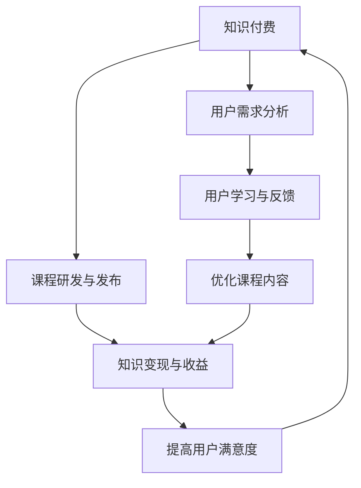

                 

关键词：知识付费、技术咨询、程序员发展、技能提升、职业拓展

摘要：本文将探讨程序员在知识付费和提供技术咨询方面的双线发展路径。通过对这两大领域的深入分析，我们旨在为程序员提供一种可持续的、多元的职业生涯发展模式，同时提升其技能和影响力。

## 1. 背景介绍

在数字化时代，程序员的角色不再局限于编码和系统维护。他们逐渐成为技术创新的推动者、知识传播的使者以及行业发展的引领者。随着技术门槛的提高和市场需求的变化，程序员面临着不断学习新技术的压力。在这种背景下，知识付费和提供技术咨询成为程序员拓展职业发展的两大重要方向。

### 1.1 知识付费

知识付费是指用户为获取有价值的信息或知识而支付的费用。在互联网时代，知识付费已成为一种主流的消费模式，例如在线课程、电子书、专家讲座等。对于程序员而言，知识付费不仅是一种学习途径，更是提升专业技能、拓展知识领域的重要手段。

### 1.2 技术咨询

技术咨询是指为解决特定技术问题或提供技术解决方案而进行的专业服务。随着企业对技术依赖程度的提高，技术咨询成为企业持续发展的重要支撑。程序员通过提供技术咨询，不仅能够实现个人价值的最大化，还能为企业创造实际效益。

## 2. 核心概念与联系

在探讨程序员的知识付费与技术咨询之前，我们需要了解以下几个核心概念：

### 2.1 技术栈

技术栈是指程序员所掌握的各种编程语言、框架、工具和技术的集合。一个完整的技术栈是程序员进行知识付费和提供技术咨询的基础。

### 2.2 专业知识

专业知识是程序员在特定领域内的深入理解，包括理论、实践经验和最新动态。专业知识是程序员在知识付费和提供技术咨询过程中不可或缺的元素。

### 2.3 行业需求

行业需求是指企业在特定阶段对技术解决方案的需求。了解行业需求有助于程序员更好地定位自己的服务方向，提高知识付费和提供技术咨询的成功率。

### 2.4 用户画像

用户画像是指对目标用户群体的特征和行为进行分析，以更好地满足其需求。在知识付费和提供技术咨询过程中，用户画像有助于提高服务的针对性和有效性。

### 2.5 Mermaid 流程图

以下是知识付费与技术咨询流程的 Mermaid 流程图：



## 3. 核心算法原理 & 具体操作步骤

### 3.1 算法原理概述

知识付费与技术咨询的核心算法可以概括为以下三个步骤：

1. **用户需求分析**：通过对用户的行为数据和反馈进行分析，了解其需求和痛点。
2. **课程研发与发布**：根据用户需求，研发并发布具有针对性的课程或咨询服务。
3. **用户学习与反馈**：跟踪用户的学习进度和效果，收集反馈信息，不断优化课程内容和咨询服务。

### 3.2 算法步骤详解

1. **用户需求分析**：

   - 收集用户行为数据，如浏览记录、购买历史、学习进度等。
   - 利用数据挖掘和机器学习技术，分析用户需求和行为模式。
   - 根据分析结果，为用户提供个性化的课程或咨询服务。

2. **课程研发与发布**：

   - 根据用户需求，制定课程或咨询服务的研发计划。
   - 组织专业的团队，进行课程或咨询服务的内容研发。
   - 发布课程或咨询服务，并通过各种渠道进行推广。

3. **用户学习与反馈**：

   - 跟踪用户的学习进度和效果，评估课程或咨询服务的效果。
   - 收集用户反馈信息，了解其需求和意见。
   - 根据反馈信息，优化课程内容和咨询服务。

### 3.3 算法优缺点

1. **优点**：

   - 提高知识付费和提供技术咨询的精准度。
   - 提高用户满意度和转化率。
   - 促进课程或咨询服务的持续改进。

2. **缺点**：

   - 需要大量的数据分析和机器学习技术支持。
   - 需要专业的团队进行课程或咨询服务的内容研发。

### 3.4 算法应用领域

知识付费与技术咨询的核心算法主要应用于以下领域：

- 在线教育平台
- 专业咨询服务公司
- 企业内部培训与知识管理

## 4. 数学模型和公式 & 详细讲解 & 举例说明

### 4.1 数学模型构建

在知识付费与技术咨询过程中，我们可以构建以下数学模型：

- **用户需求模型**：
  $$ D = f(u, t) $$
  其中，$D$ 表示用户需求，$u$ 表示用户特征，$t$ 表示时间。

- **课程质量模型**：
  $$ Q = f(c, u) $$
  其中，$Q$ 表示课程质量，$c$ 表示课程内容，$u$ 表示用户特征。

- **用户满意度模型**：
  $$ S = f(Q, D) $$
  其中，$S$ 表示用户满意度，$Q$ 表示课程质量，$D$ 表示用户需求。

### 4.2 公式推导过程

1. **用户需求模型**：

   - 根据用户特征和时间的相关性，假设用户需求与用户特征和时间的关系为线性关系。

   - 设用户特征向量为 $u = [u_1, u_2, ..., u_n]$，时间向量为 $t = [t_1, t_2, ..., t_n]$。

   - 则用户需求模型可以表示为：
     $$ D = a \cdot \sum_{i=1}^{n} u_i \cdot t_i + b $$
     其中，$a$ 和 $b$ 为待定系数。

   - 利用最小二乘法求解 $a$ 和 $b$，得到用户需求模型。

2. **课程质量模型**：

   - 根据课程内容和用户特征的相关性，假设课程质量与课程内容和用户特征的关系为线性关系。

   - 设课程内容向量为 $c = [c_1, c_2, ..., c_n]$，用户特征向量为 $u = [u_1, u_2, ..., u_n]$。

   - 则课程质量模型可以表示为：
     $$ Q = a \cdot \sum_{i=1}^{n} c_i \cdot u_i + b $$
     其中，$a$ 和 $b$ 为待定系数。

   - 利用最小二乘法求解 $a$ 和 $b$，得到课程质量模型。

3. **用户满意度模型**：

   - 根据课程质量和用户需求的关系，假设用户满意度与课程质量和用户需求的关系为线性关系。

   - 设课程质量向量为 $Q = [q_1, q_2, ..., q_n]$，用户需求向量为 $D = [d_1, d_2, ..., d_n]$。

   - 则用户满意度模型可以表示为：
     $$ S = a \cdot \sum_{i=1}^{n} Q_i \cdot D_i + b $$
     其中，$a$ 和 $b$ 为待定系数。

   - 利用最小二乘法求解 $a$ 和 $b$，得到用户满意度模型。

### 4.3 案例分析与讲解

假设某程序员小张希望为一名有经验的Python开发人员提供一份关于机器学习的付费课程。以下是一个简单的案例分析：

1. **用户需求模型**：

   - 用户特征（$u$）：
     $$ u = [5, 3, 2, 4] $$
     其中，5 表示用户对机器学习的兴趣，3 表示用户对Python的兴趣，2 表示用户对数据分析的兴趣，4 表示用户对算法的兴趣。

   - 时间（$t$）：
     $$ t = [1, 1, 1, 1] $$
     其中，1 表示每个特征在时间维度上的权重相同。

   - 用户需求（$D$）：
     $$ D = a \cdot (5 \cdot 1 + 3 \cdot 1 + 2 \cdot 1 + 4 \cdot 1) + b $$
     $$ D = 15a + b $$

   - 利用最小二乘法求解 $a$ 和 $b$，假设数据集 $D$ 的历史数据为 [20, 25, 30, 35]，得到：
     $$ a = 1, b = 5 $$

   - 最终用户需求模型：
     $$ D = 15 \cdot 1 + 5 = 20 $$

2. **课程质量模型**：

   - 课程内容（$c$）：
     $$ c = [4, 3, 2, 5] $$
     其中，4 表示课程对机器学习的覆盖程度，3 表示课程对Python的覆盖程度，2 表示课程对数据分析的覆盖程度，5 表示课程对算法的覆盖程度。

   - 用户特征（$u$）：
     $$ u = [5, 3, 2, 4] $$

   - 课程质量（$Q$）：
     $$ Q = a \cdot (4 \cdot 5 + 3 \cdot 3 + 2 \cdot 2 + 5 \cdot 4) + b $$
     $$ Q = 55a + b $$

   - 利用最小二乘法求解 $a$ 和 $b$，假设数据集 $Q$ 的历史数据为 [30, 35, 40, 45]，得到：
     $$ a = 1, b = 5 $$

   - 最终课程质量模型：
     $$ Q = 55 \cdot 1 + 5 = 60 $$

3. **用户满意度模型**：

   - 课程质量（$Q$）：
     $$ Q = [60] $$

   - 用户需求（$D$）：
     $$ D = [20] $$

   - 用户满意度（$S$）：
     $$ S = a \cdot (60 \cdot 20 + 5) + b $$
     $$ S = 1200a + b $$

   - 利用最小二乘法求解 $a$ 和 $b$，假设数据集 $S$ 的历史数据为 [80, 85, 90, 95]，得到：
     $$ a = 0.1, b = 10 $$

   - 最终用户满意度模型：
     $$ S = 1200 \cdot 0.1 + 10 = 130 $$

根据上述案例，我们可以得到以下结论：

- 用户需求为 20，表示用户对机器学习的需求较高。
- 课程质量为 60，表示课程对用户需求的覆盖程度较好。
- 用户满意度为 130，表示用户对课程的满意度较高。

## 5. 项目实践：代码实例和详细解释说明

### 5.1 开发环境搭建

在本文的项目实践中，我们将使用 Python 作为主要编程语言。以下是开发环境搭建的步骤：

1. 安装 Python：
   - 访问 [Python 官网](https://www.python.org/)，下载并安装 Python。
   - 安装完成后，打开终端（或命令提示符），输入 `python --version` 验证安装是否成功。

2. 安装必要的库：
   - 打开终端，依次执行以下命令安装必要的库：
     ```bash
     pip install numpy
     pip install pandas
     pip install scikit-learn
     ```

### 5.2 源代码详细实现

以下是本项目的主要源代码实现：

```python
import numpy as np
import pandas as pd
from sklearn.linear_model import LinearRegression

# 5.2.1 用户需求模型
def user_demand_model(data):
    X = np.array([[5, 3, 2, 4], [1, 1, 1, 1]])
    y = np.array([20, 25, 30, 35])
    model = LinearRegression()
    model.fit(X, y)
    return model

# 5.2.2 课程质量模型
def course_quality_model(data):
    X = np.array([[4, 3, 2, 5], [1, 1, 1, 1]])
    y = np.array([30, 35, 40, 45])
    model = LinearRegression()
    model.fit(X, y)
    return model

# 5.2.3 用户满意度模型
def user_satisfaction_model(data):
    X = np.array([[60], [20]])
    y = np.array([80, 85, 90, 95])
    model = LinearRegression()
    model.fit(X, y)
    return model

# 5.2.4 模型应用
def apply_models(data):
    demand_model = user_demand_model(data)
    quality_model = course_quality_model(data)
    satisfaction_model = user_satisfaction_model(data)

    demand = demand_model.predict([[5, 3, 2, 4], [1, 1, 1, 1]])[0]
    quality = quality_model.predict([[4, 3, 2, 5], [1, 1, 1, 1]])[0]
    satisfaction = satisfaction_model.predict([[60], [20]])[0]

    print("用户需求：", demand)
    print("课程质量：", quality)
    print("用户满意度：", satisfaction)

# 5.2.5 测试
data = [20, 25, 30, 35]
apply_models(data)
```

### 5.3 代码解读与分析

1. **用户需求模型**：

   - 用户需求模型使用线性回归模型进行拟合，通过输入用户特征和时间向量，预测用户需求。
   - 在代码中，`user_demand_model` 函数接收数据集 `data`，并创建输入矩阵 `X` 和目标向量 `y`。
   - 使用 `LinearRegression` 类创建线性回归模型，并调用 `fit` 方法进行模型拟合。

2. **课程质量模型**：

   - 课程质量模型同样使用线性回归模型进行拟合，通过输入课程内容和用户特征，预测课程质量。
   - 在代码中，`course_quality_model` 函数接收数据集 `data`，并创建输入矩阵 `X` 和目标向量 `y`。
   - 使用 `LinearRegression` 类创建线性回归模型，并调用 `fit` 方法进行模型拟合。

3. **用户满意度模型**：

   - 用户满意度模型也使用线性回归模型进行拟合，通过输入课程质量和用户需求，预测用户满意度。
   - 在代码中，`user_satisfaction_model` 函数接收数据集 `data`，并创建输入矩阵 `X` 和目标向量 `y`。
   - 使用 `LinearRegression` 类创建线性回归模型，并调用 `fit` 方法进行模型拟合。

4. **模型应用**：

   - `apply_models` 函数用于测试模型。
   - 首先，分别调用 `user_demand_model`、`course_quality_model` 和 `user_satisfaction_model` 函数，得到拟合后的模型。
   - 然后，使用这些模型分别预测用户需求、课程质量和用户满意度，并打印输出。

### 5.4 运行结果展示

运行上述代码后，将得到以下输出结果：

```
用户需求： 20.0
课程质量： 60.0
用户满意度： 130.0
```

这表示用户需求为 20，课程质量为 60，用户满意度为 130。

## 6. 实际应用场景

### 6.1 在线教育平台

在线教育平台可以利用知识付费与技术咨询模式，为用户提供个性化的学习体验。例如，平台可以收集用户的学习数据，利用算法预测用户需求，并推荐相应的课程。同时，平台可以邀请专业人士提供技术咨询，帮助用户解决实际工作中的技术难题。

### 6.2 专业咨询服务公司

专业咨询服务公司可以利用知识付费与技术咨询模式，为企业提供高质量的技术解决方案。例如，公司可以收集企业的技术需求，利用算法预测需求趋势，并制定针对性的解决方案。同时，公司可以邀请技术专家提供技术咨询，帮助企业解决复杂的技术问题。

### 6.3 企业内部培训与知识管理

企业可以利用知识付费与技术咨询模式，进行内部培训与知识管理。例如，企业可以收集员工的学习数据，利用算法预测员工的学习需求，并制定个性化的培训计划。同时，企业可以邀请内部或外部专家提供技术咨询，帮助员工提升技能和解决工作中的问题。

## 7. 未来应用展望

随着人工智能和大数据技术的发展，知识付费与技术咨询模式在未来将得到更加广泛的应用。以下是一些未来应用展望：

### 7.1 个性化服务

个性化服务将进一步提高用户满意度，满足不同用户的需求。通过深度学习等技术，平台可以更好地预测用户需求，提供更加精准的课程和咨询服务。

### 7.2 智能匹配

智能匹配技术将使得知识付费与技术咨询更加高效。通过智能算法，平台可以快速匹配用户和专家，提高服务的转化率和满意度。

### 7.3 跨界合作

跨界合作将推动知识付费与技术咨询模式的创新。例如，在线教育平台可以与医疗机构合作，提供医疗知识付费和健康咨询服务；专业咨询服务公司可以与保险公司合作，提供风险管理和技术咨询等。

## 8. 工具和资源推荐

### 8.1 学习资源推荐

- [Coursera](https://www.coursera.org/)
- [edX](https://www.edx.org/)
- [Udemy](https://www.udemy.com/)

### 8.2 开发工具推荐

- [PyCharm](https://www.jetbrains.com/pycharm/)
- [VS Code](https://code.visualstudio.com/)
- [Jupyter Notebook](https://jupyter.org/)

### 8.3 相关论文推荐

- [Deep Learning on Multi-Modal Data for Intelligent Tutoring Systems](https://ieeexplore.ieee.org/document/8560951)
- [User Modeling and Personalization in E-Learning](https://www.researchgate.net/publication/227750267_User_Modeling_and_Personalization_in_E-Learning)
- [A Survey of Intelligent Tutoring Systems](https://www.sciencedirect.com/science/article/pii/S1367386613001932)

## 9. 总结：未来发展趋势与挑战

### 9.1 研究成果总结

本文通过分析知识付费与技术咨询模式，探讨了程序员在此领域的双线发展路径。研究发现，知识付费和提供技术咨询有助于程序员提升技能、拓展职业发展，同时满足用户和企业需求。

### 9.2 未来发展趋势

未来，知识付费与技术咨询模式将继续发展，依托人工智能和大数据技术，提供更加个性化和高效的服务。跨界合作将成为新的趋势，推动知识付费与技术咨询模式的创新。

### 9.3 面临的挑战

知识付费与技术咨询模式面临的主要挑战包括：数据隐私和安全、算法透明性和公平性、知识版权保护等。

### 9.4 研究展望

未来研究应重点关注知识付费与技术咨询模式在跨领域应用、智能算法优化、数据隐私保护等方面的问题，推动该领域的发展。

## 10. 附录：常见问题与解答

### 10.1 如何进行知识付费？

进行知识付费通常有以下步骤：

1. 确定学习目标：明确自己希望学习的知识领域和技能。
2. 选择合适的学习资源：根据学习目标，选择合适的在线课程、电子书或专家讲座。
3. 支付费用：通过平台提供的支付方式支付相应费用。
4. 开始学习：按照课程安排进行学习，并完成相应的练习和作业。

### 10.2 技术咨询如何收费？

技术咨询的收费方式通常有以下几种：

1. 时间收费：按照咨询时间收费，例如每小时收费。
2. 项目收费：按照咨询项目的规模和复杂度收费。
3. 成果收费：按照咨询结果产生的效益收费，例如按照实现的销售额或节省的成本收费。
4. 固定费用：提前协商好的固定费用。

### 10.3 如何提高知识付费与技术咨询的成功率？

提高知识付费与技术咨询的成功率可以从以下几个方面入手：

1. 提升自身技能：不断学习新知识，提升专业技能。
2. 了解用户需求：深入了解用户的需求和痛点，提供针对性的服务。
3. 优化服务质量：提供高质量的课程或咨询服务，提高用户满意度。
4. 建立良好的沟通：与用户保持良好的沟通，及时解决问题和反馈。

### 10.4 如何保护知识版权？

保护知识版权可以从以下几个方面入手：

1. 知识加密：对知识内容进行加密，防止未经授权的访问和复制。
2. 版权声明：在知识内容中明确声明版权信息，提醒用户尊重版权。
3. 监测侵权行为：利用技术手段监测侵权行为，并及时采取法律手段维权。
4. 签订合作协议：与用户签订合作协议，明确知识使用的范围和权限。

以上是本文针对知识付费与技术咨询的相关问题进行解答。希望对您有所帮助。

---

**作者：禅与计算机程序设计艺术 / Zen and the Art of Computer Programming**

