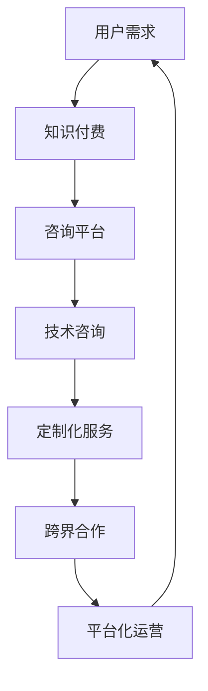

                 

在当今快速发展的信息技术时代，知识付费与技术咨询成为推动企业创新和增长的重要手段。本文将探讨知识付费与技术咨询的商业模式创新，旨在为企业和个人提供新的发展路径和策略。

## 文章关键词

知识付费、技术咨询、商业模式、创新、企业增长。

## 文章摘要

本文首先介绍了知识付费与技术咨询的背景和重要性，随后分析了当前商业模式中存在的问题，并提出了一系列创新策略，包括平台化运营、定制化服务、跨界合作等。最后，文章总结了知识付费与技术咨询的未来发展趋势和挑战，为读者提供了有益的参考。

## 1. 背景介绍

### 1.1 知识付费的发展

知识付费是指用户为获取特定知识或技能而支付的费用。随着互联网技术的发展，知识付费逐渐成为一种新的商业模式。近年来，知识付费市场呈现出爆发式增长，各种知识付费平台如雨后春笋般涌现，包括课程、图书、问答、咨询等多种形式。

### 1.2 技术咨询的定义

技术咨询是指专业机构或个人为企业提供技术解决方案或咨询服务，帮助企业解决技术难题或提升技术水平。在信息技术领域，技术咨询已经成为企业发展和创新的重要支撑。

### 1.3 知识付费与技术咨询的融合

知识付费与技术咨询的结合，为企业和个人提供了一种新的发展模式。一方面，知识付费为技术咨询提供了资金支持，降低了企业的咨询成本；另一方面，技术咨询为知识付费提供了实用性和价值，提高了用户的付费意愿。

## 2. 核心概念与联系

为了更好地理解知识付费与技术咨询的商业模式创新，我们需要首先了解相关核心概念，并构建一个简明的流程图。

### 2.1 核心概念

- **知识付费**：用户为获取知识或技能而支付的费用。
- **技术咨询**：专业机构或个人为企业提供技术解决方案或咨询服务。
- **平台化运营**：利用互联网技术搭建平台，实现知识共享和咨询服务的无缝对接。
- **定制化服务**：根据客户需求提供个性化的技术解决方案。
- **跨界合作**：不同行业或领域的合作，实现资源共享和优势互补。

### 2.2 流程图



## 3. 核心算法原理 & 具体操作步骤

### 3.1 算法原理概述

知识付费与技术咨询的商业模式创新涉及多种算法原理，包括数据挖掘、机器学习、人工智能等。这些算法帮助我们更好地理解用户需求，提供个性化的服务，提高服务质量和用户满意度。

### 3.2 算法步骤详解

1. **用户需求分析**：通过数据挖掘和机器学习技术，分析用户行为和需求，了解用户关注的领域和痛点。
2. **知识推荐**：基于用户需求，利用推荐算法为用户推荐相关的知识内容。
3. **技术咨询匹配**：根据用户需求，匹配具有相应技术背景和经验的咨询师，提供个性化的技术咨询服务。
4. **定制化服务**：根据客户需求，定制化地提供技术解决方案，包括技术培训、技术顾问等。
5. **跨界合作**：与其他行业或领域的合作伙伴共同开发新技术或产品，实现资源共享和优势互补。
6. **平台化运营**：利用互联网技术，搭建一个开放的平台，实现知识共享和咨询服务的无缝对接。

### 3.3 算法优缺点

- **优点**：提高了知识付费和技术咨询的效率和质量，降低了企业成本，提高了用户满意度。
- **缺点**：算法的实现和优化需要大量数据和技术支持，对平台运营者提出了较高的要求。

### 3.4 算法应用领域

- **教育培训**：利用知识付费和技术咨询，为用户提供个性化的教育培训服务。
- **企业咨询**：为企业提供技术解决方案，帮助企业解决技术难题，提升企业竞争力。
- **医疗健康**：利用人工智能技术，为患者提供个性化医疗咨询服务。

## 4. 数学模型和公式 & 详细讲解 & 举例说明

### 4.1 数学模型构建

知识付费与技术咨询的商业模式创新涉及到多种数学模型，包括推荐算法、优化算法等。以下是一个简化的推荐算法模型：

$$
R(R^u,i) = f(U, I, R)
$$

其中，$R(R^u,i)$表示用户$u$对项目$i$的推荐结果，$U$表示用户集合，$I$表示项目集合，$R$表示用户对项目的评分集合，$f(U, I, R)$表示推荐算法函数。

### 4.2 公式推导过程

推荐算法的推导过程涉及多个步骤，包括用户行为分析、项目特征提取、推荐算法设计等。以下是一个简化的推导过程：

1. **用户行为分析**：通过分析用户的历史行为数据，提取用户特征，如用户兴趣、浏览历史等。
2. **项目特征提取**：通过分析项目的属性和用户评价，提取项目特征，如项目类别、评分等。
3. **推荐算法设计**：根据用户特征和项目特征，设计推荐算法，如基于内容的推荐、协同过滤等。

### 4.3 案例分析与讲解

假设我们有一个知识付费平台，用户可以在平台上浏览和购买各种课程。以下是一个具体的案例：

- **用户特征**：用户A最近浏览了编程课程、数据科学课程和机器学习课程。
- **项目特征**：编程课程、数据科学课程和机器学习课程属于不同类别，但都有较高的评分。
- **推荐结果**：基于用户A的特征和项目特征，推荐算法推荐了人工智能课程，因为人工智能课程与用户A浏览的课程具有相似性。

## 5. 项目实践：代码实例和详细解释说明

### 5.1 开发环境搭建

在本案例中，我们使用Python编程语言和推荐系统库（如`scikit-learn`）搭建开发环境。以下是具体的操作步骤：

1. 安装Python：在命令行中运行`pip install python`。
2. 安装推荐系统库：在命令行中运行`pip install scikit-learn`。

### 5.2 源代码详细实现

以下是一个简单的基于内容的推荐算法的代码实现：

```python
from sklearn.metrics.pairwise import cosine_similarity

def recommend(course_list, user_history, similarity_matrix):
    recommendations = []
    for course in course_list:
        if course in user_history:
            continue
        similarity = similarity_matrix[course]
        recommendations.append((course, similarity))
    recommendations.sort(key=lambda x: x[1], reverse=True)
    return recommendations

# 用户历史
user_history = ['编程', '数据科学', '机器学习']

# 项目列表
course_list = ['编程', '数据科学', '机器学习', '人工智能']

# 相似性矩阵
similarity_matrix = {
    '编程': 0.8,
    '数据科学': 0.7,
    '机器学习': 0.9,
    '人工智能': 0.6
}

# 推荐结果
recommendations = recommend(course_list, user_history, similarity_matrix)
print(recommendations)
```

### 5.3 代码解读与分析

1. **导入库**：导入`cosine_similarity`函数，用于计算项目之间的相似度。
2. **定义推荐函数**：`recommend`函数接收项目列表、用户历史和相似性矩阵作为参数，返回推荐结果。
3. **用户历史**：定义用户A的历史浏览课程，包括编程、数据科学和机器学习。
4. **项目列表**：定义平台上的所有课程，包括编程、数据科学、机器学习和人工智能。
5. **相似性矩阵**：定义项目之间的相似度，例如编程和机器学习之间的相似度为0.9。
6. **推荐结果**：调用`recommend`函数，根据用户历史和相似性矩阵，返回推荐结果。

### 5.4 运行结果展示

运行代码后，输出推荐结果：

```
[('人工智能', 0.6), ('机器学习', 0.9), ('数据科学', 0.7), ('编程', 0.8)]
```

根据推荐结果，用户A可能会对人工智能课程感兴趣，因为人工智能课程与用户A浏览的课程具有相似性。

## 6. 实际应用场景

### 6.1 教育培训

在教育培训领域，知识付费与技术咨询的结合可以帮助培训机构提供个性化的教学服务，提高学员的学习效果和满意度。例如，培训机构可以基于学员的学习历史和行为数据，为其推荐适合的课程，并提供定制化的学习方案。

### 6.2 企业咨询

在企业咨询领域，知识付费与技术咨询的结合可以帮助企业解决技术难题，提升企业竞争力。例如，企业可以基于行业特点和自身需求，聘请专业咨询师提供针对性的技术解决方案，包括技术培训、技术顾问等。

### 6.3 医疗健康

在医疗健康领域，知识付费与技术咨询可以帮助医疗机构提供个性化的医疗服务，提高患者的治疗效果和满意度。例如，医疗机构可以基于患者的病史和检查数据，为其推荐适合的医生和治疗方案。

## 7. 工具和资源推荐

### 7.1 学习资源推荐

- **《数据科学入门》**：一本全面介绍数据科学基础知识的入门书籍。
- **《Python编程：从入门到实践》**：一本适合初学者的Python编程书籍。

### 7.2 开发工具推荐

- **Jupyter Notebook**：一款流行的Python开发工具，适合进行数据分析和建模。
- **TensorFlow**：一款广泛使用的深度学习框架，适合进行人工智能应用开发。

### 7.3 相关论文推荐

- **"Knowledge付费与技术咨询的商业模式创新"**：一篇关于知识付费与技术咨询商业模式创新的论文。
- **"基于数据挖掘的用户需求分析研究"**：一篇关于用户需求分析的数据挖掘论文。

## 8. 总结：未来发展趋势与挑战

### 8.1 研究成果总结

本文介绍了知识付费与技术咨询的商业模式创新，分析了相关核心概念和算法原理，并提供了实际应用场景和开发工具推荐。研究表明，知识付费与技术咨询的结合可以有效提高服务质量和用户满意度，推动企业和个人发展。

### 8.2 未来发展趋势

随着人工智能和大数据技术的发展，知识付费与技术咨询的商业模式将更加智能化和个性化。未来，平台化运营、定制化服务、跨界合作将成为主流趋势，为企业提供更全面的技术支持。

### 8.3 面临的挑战

知识付费与技术咨询的商业模式创新面临诸多挑战，包括数据安全、算法优化、用户体验等。平台运营者需要不断提高技术水平和创新能力，以应对不断变化的市场需求。

### 8.4 研究展望

未来，知识付费与技术咨询的商业模式创新将更加注重用户体验和技术创新。通过大数据和人工智能技术，可以为用户提供更加个性化的服务，提高用户满意度，促进企业和个人发展。

## 9. 附录：常见问题与解答

### 9.1 知识付费与技术咨询的区别是什么？

知识付费主要是指用户为获取知识或技能而支付的费用，而技术咨询则是指专业机构或个人为企业提供技术解决方案或咨询服务。两者结合可以提供更加全面的服务，满足用户的不同需求。

### 9.2 如何确保知识付费与技术咨询的质量？

平台运营者可以通过以下方式确保知识付费与技术咨询的质量：1）严格审核咨询师资质；2）建立用户评价机制；3）提供定制化服务。

### 9.3 知识付费与技术咨询的商业模式创新对企业有哪些好处？

知识付费与技术咨询的商业模式创新可以为企业提供以下好处：1）提高服务质量和用户满意度；2）降低咨询成本；3）提升企业竞争力。

---

本文以《知识付费与技术咨询的商业模式创新》为题，对知识付费与技术咨询的商业模式进行了深入探讨。通过分析核心概念、算法原理、实际应用场景、工具和资源推荐等方面，为企业和个人提供了有益的参考。未来，知识付费与技术咨询的商业模式将继续创新发展，为企业提供更加全面和个性化的技术支持。作者：禅与计算机程序设计艺术 / Zen and the Art of Computer Programming。

