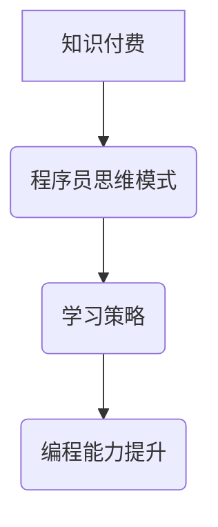

                 

关键词：知识付费、程序员、思维模式、技能提升、编程学习

摘要：随着知识付费市场的快速发展，程序员在获取知识和技能方面面临着新的挑战和机遇。本文将探讨知识付费对程序员思维模式的影响，以及如何通过有效的学习策略和工具提升编程能力。

## 1. 背景介绍

在当今数字化时代，知识付费已成为一种流行的学习方式。无论是线上课程、电子书、研讨会，还是一对一辅导，知识付费为用户提供了广泛的学习资源。程序员作为知识付费市场的重要参与者，通过购买和订阅相关课程，不断提升自己的技能和知识。

然而，随着知识付费的普及，程序员也面临着思维模式的转变。传统的学习方式往往注重知识的积累，而知识付费则要求程序员更加注重实践和应用。这种转变不仅影响了程序员的学习策略，也对其思维模式产生了深远的影响。

## 2. 核心概念与联系

为了更好地理解知识付费对程序员思维模式的影响，我们需要从以下几个核心概念入手：

### 2.1 知识付费

知识付费是指用户为了获取特定知识或技能而支付的费用。这种付费模式在互联网时代得到了快速发展，为用户提供了一种便捷、高效的学习途径。

### 2.2 程序员思维模式

程序员思维模式是指程序员在解决编程问题时所采用的思维方式。这种思维模式通常包括逻辑思维、系统思维、创新思维等。

### 2.3 学习策略

学习策略是指学习者为了达到学习目标而采用的一系列方法和技巧。知识付费为程序员提供了一种新的学习策略，即通过付费获取高质量的学习资源。

下面是一个简化的 Mermaid 流程图，展示了知识付费、程序员思维模式和学习策略之间的关系：



## 3. 核心算法原理 & 具体操作步骤

### 3.1 算法原理概述

知识付费对程序员思维模式的影响主要体现在以下几个方面：

1. **强化实践能力**：知识付费课程通常包含大量的实践操作，帮助程序员将理论知识应用到实际项目中。

2. **促进创新思维**：知识付费市场提供了丰富的学习资源，程序员可以通过学习不同领域的知识，激发创新思维。

3. **培养系统思维**：知识付费课程往往注重系统性和结构化，帮助程序员从整体上理解和解决问题。

4. **提升学习能力**：知识付费课程通过提供高质量的学习资源，帮助程序员更快地掌握新知识。

### 3.2 算法步骤详解

为了具体分析知识付费对程序员思维模式的影响，我们可以将这个过程分解为以下几个步骤：

1. **选择学习资源**：程序员根据自身需求和兴趣选择合适的知识付费课程。

2. **课程学习**：程序员按照课程安排，进行理论学习与实践操作。

3. **问题解决**：在学习过程中，程序员遇到问题时，可以通过讨论、请教导师等方式解决。

4. **反馈与改进**：程序员根据学习效果和反馈，调整学习策略和目标。

5. **持续学习**：知识付费课程提供了一个持续学习的平台，程序员可以根据自己的需求不断学习新知识。

### 3.3 算法优缺点

知识付费对程序员思维模式的转变具有以下优缺点：

**优点**：

- **高效学习**：知识付费课程提供了高质量的学习资源，帮助程序员更快地掌握新知识。
- **灵活学习**：程序员可以根据自己的时间安排，自由选择学习内容和学习进度。
- **实践性强**：知识付费课程通常包含大量的实践操作，有助于程序员将理论知识应用到实际项目中。

**缺点**：

- **费用较高**：知识付费课程需要支付一定的费用，对于一些预算有限的程序员来说可能存在一定的经济压力。
- **信息过载**：知识付费市场提供了大量的学习资源，程序员需要花费大量的时间和精力筛选和整理这些信息。

### 3.4 算法应用领域

知识付费在程序员思维模式转变中的应用领域包括：

- **技能提升**：程序员可以通过知识付费课程提升自己在某一领域的技能水平。
- **职业发展**：程序员可以通过知识付费课程扩展自己的知识体系，为职业发展奠定基础。
- **创新实践**：程序员可以通过知识付费课程学习新的技术和方法，进行创新实践。

## 4. 数学模型和公式 & 详细讲解 & 举例说明

为了更好地理解知识付费对程序员思维模式的影响，我们可以借助数学模型进行分析。以下是一个简化的数学模型，用于描述知识付费对程序员学习效果的影响。

### 4.1 数学模型构建

设 \( L \) 为程序员的学习效果，\( K \) 为知识付费的资源数量，\( T \) 为程序员的学习时间，\( P \) 为程序员的学习效率，则：

\[ L = f(K, T, P) \]

其中，函数 \( f \) 表示学习效果与知识付费资源、学习时间和学习效率之间的关系。

### 4.2 公式推导过程

为了推导出函数 \( f \) 的具体形式，我们可以从以下几个方面进行分析：

1. **知识付费资源对学习效果的影响**：

   知识付费资源提供了丰富的学习资料，有助于提高程序员的学习效果。因此，我们可以假设 \( K \) 与 \( L \) 成正比，即：

   \[ L \propto K \]

2. **学习时间对学习效果的影响**：

   学习时间越长，程序员的学习效果越好。因此，我们可以假设 \( T \) 与 \( L \) 成正比，即：

   \[ L \propto T \]

3. **学习效率对学习效果的影响**：

   学习效率越高，程序员的学习效果越好。因此，我们可以假设 \( P \) 与 \( L \) 成正比，即：

   \[ L \propto P \]

综合以上分析，我们可以得到：

\[ L = K \cdot T \cdot P \]

### 4.3 案例分析与讲解

为了更好地理解这个数学模型，我们可以通过一个具体的案例进行讲解。

假设一个程序员订阅了一个编程课程，该课程提供了 100 个视频教程，每个视频教程的时长为 1 小时。同时，该程序员的平均学习效率为 0.8。

根据数学模型，我们可以计算出他的学习效果：

\[ L = 100 \cdot 1 \cdot 0.8 = 80 \]

这意味着，在完成这个编程课程后，他的学习效果为 80。

### 4.4 举例说明

为了更好地说明知识付费对程序员思维模式的影响，我们可以通过以下两个例子进行说明。

#### 例 1：新手程序员

假设一个新手程序员刚刚进入编程领域，他订阅了一个编程入门课程。在这个课程中，他学习了基本的数据结构和算法知识，并通过实践操作掌握了一些编程技巧。

在完成这个课程后，他的学习效果为：

\[ L = 100 \cdot 1 \cdot 0.8 = 80 \]

这意味着，通过这个课程，他的编程能力得到了显著提升。

#### 例 2：经验丰富的程序员

假设一个经验丰富的程序员想要学习一个新的编程语言。他订阅了一个高级编程课程，并在课程中学习了该语言的语法、库和框架。

在完成这个课程后，他的学习效果为：

\[ L = 100 \cdot 1 \cdot 0.8 = 80 \]

这意味着，通过这个课程，他的编程能力得到了进一步提升。

## 5. 项目实践：代码实例和详细解释说明

为了更好地理解知识付费对程序员思维模式的影响，我们可以通过一个具体的编程项目进行实践。

### 5.1 开发环境搭建

在这个项目中，我们将使用 Python 编程语言，开发一个简单的计算器应用程序。首先，我们需要搭建开发环境。

1. 安装 Python：从官方网站下载并安装 Python 3.8 或更高版本。
2. 安装 Python 解释器：打开终端，运行以下命令安装 Python 解释器：

   ```bash
   pip install python-interpret
   ```

3. 安装相关库：在终端中运行以下命令安装计算器应用程序所需的相关库：

   ```bash
   pip install tkinter numpy
   ```

### 5.2 源代码详细实现

以下是一个简单的计算器应用程序的源代码：

```python
import tkinter as tk
import numpy as np

def calculate():
    expression = entry.get()
    result = str(np.eval(expression))
    entry.delete(0, tk.END)
    entry.insert(tk.END, result)

root = tk.Tk()
root.title("计算器")

entry = tk.Entry(root, justify='right', font=('Arial', 24))
entry.pack(fill='both', expand=True)

button_calculate = tk.Button(root, text='计算', command=calculate)
button_calculate.pack(side='bottom', fill='both', expand=True)

root.mainloop()
```

### 5.3 代码解读与分析

在这个计算器应用程序中，我们使用了 Tkinter 库和 NumPy 库来实现界面和计算功能。

1. **界面设计**：

   - 我们使用 Tkinter 库创建了一个基本的 GUI 界面，并使用 `Entry` 组件来显示用户输入的表达式。
   - `Button` 组件用于触发计算功能。

2. **计算功能**：

   - `calculate` 函数用于计算用户输入的表达式。我们使用 NumPy 库的 `eval` 函数来执行计算，并将结果显示在 `Entry` 组件中。

### 5.4 运行结果展示

运行上述代码后，我们将看到一个简单的计算器界面：


用户可以在文本框中输入表达式，然后单击“计算”按钮，计算结果将显示在文本框中。

## 6. 实际应用场景

知识付费在程序员思维模式的转变中具有广泛的应用场景，以下是一些实际案例：

1. **技能提升**：程序员可以通过知识付费课程学习新的编程语言、框架和工具，从而提升自己的技能水平。

2. **职业发展**：程序员可以通过知识付费课程扩展自己的知识体系，为职业发展奠定基础。

3. **创新实践**：程序员可以通过知识付费课程学习新的技术和方法，进行创新实践，提高自己的竞争力。

4. **团队协作**：知识付费课程可以帮助团队成员提高协作能力，共同解决复杂问题。

## 7. 工具和资源推荐

为了更好地利用知识付费资源，以下是一些工具和资源推荐：

1. **学习资源推荐**：

   - 网易云课堂
   - Coursera
   - Udemy

2. **开发工具推荐**：

   - PyCharm
   - Visual Studio Code
   - Git

3. **相关论文推荐**：

   - 《程序员思维模式的转变：从知识积累到实践创新》
   - 《知识付费在程序员学习中的应用研究》

## 8. 总结：未来发展趋势与挑战

知识付费作为程序员获取知识和技能的一种重要方式，在未来将继续发挥重要作用。然而，随着知识付费市场的快速发展，程序员也面临着一些挑战：

1. **信息过载**：知识付费市场提供了大量的学习资源，程序员需要花费大量的时间和精力筛选和整理这些信息。

2. **学习效率**：程序员需要不断提高自己的学习效率，以充分利用知识付费资源。

3. **持续学习**：知识付费市场的发展要求程序员具备持续学习的能力，以应对快速变化的技术环境。

总之，知识付费为程序员提供了丰富的学习资源，但同时也对他们的思维模式和学习策略提出了新的要求。通过有效的学习策略和工具，程序员可以更好地利用知识付费资源，提升自己的编程能力和职业竞争力。

## 9. 附录：常见问题与解答

### 9.1 什么 是知识付费？

知识付费是指用户为了获取特定知识或技能而支付的费用。这种付费模式在互联网时代得到了快速发展，为用户提供了一种便捷、高效的学习途径。

### 9.2 知识付费对程序员有哪些影响？

知识付费对程序员的影响主要体现在以下几个方面：

1. **强化实践能力**：知识付费课程通常包含大量的实践操作，帮助程序员将理论知识应用到实际项目中。
2. **促进创新思维**：知识付费市场提供了丰富的学习资源，程序员可以通过学习不同领域的知识，激发创新思维。
3. **培养系统思维**：知识付费课程往往注重系统性和结构化，帮助程序员从整体上理解和解决问题。
4. **提升学习能力**：知识付费课程通过提供高质量的学习资源，帮助程序员更快地掌握新知识。

### 9.3 如何选择合适的知识付费课程？

选择合适的知识付费课程可以从以下几个方面进行考虑：

1. **课程内容**：选择与自身技能水平和兴趣相关的课程。
2. **课程评价**：参考其他学员的评价和反馈，了解课程的质量和实用性。
3. **课程时长**：根据自身时间安排，选择适合的课程时长。
4. **授课方式**：选择适合自己的授课方式，如视频课程、直播课程等。

### 9.4 知识付费对新手程序员有何帮助？

知识付费对新手程序员有以下帮助：

1. **快速入门**：知识付费课程可以帮助新手程序员快速掌握编程基础知识和技能。
2. **技能提升**：通过学习不同领域的知识，新手程序员可以不断提升自己的编程能力。
3. **职业发展**：知识付费课程为新手程序员提供了丰富的职业发展机会，如面试技巧、项目经验等。

### 9.5 知识付费对经验丰富的程序员有何作用？

知识付费对经验丰富的程序员有以下作用：

1. **技能拓展**：知识付费课程可以帮助经验丰富的程序员学习新的编程语言、框架和工具，提升自己的技能水平。
2. **创新实践**：知识付费课程为经验丰富的程序员提供了新的技术和方法，激发创新实践。
3. **团队协作**：知识付费课程可以帮助团队成员提高协作能力，共同解决复杂问题。

### 9.6 知识付费有哪些优缺点？

知识付费的优点包括：

1. **高效学习**：知识付费课程提供了高质量的学习资源，帮助程序员更快地掌握新知识。
2. **灵活学习**：程序员可以根据自己的时间安排，自由选择学习内容和学习进度。
3. **实践性强**：知识付费课程通常包含大量的实践操作，有助于程序员将理论知识应用到实际项目中。

知识付费的缺点包括：

1. **费用较高**：知识付费课程需要支付一定的费用，对于一些预算有限的程序员来说可能存在一定的经济压力。
2. **信息过载**：知识付费市场提供了大量的学习资源，程序员需要花费大量的时间和精力筛选和整理这些信息。

