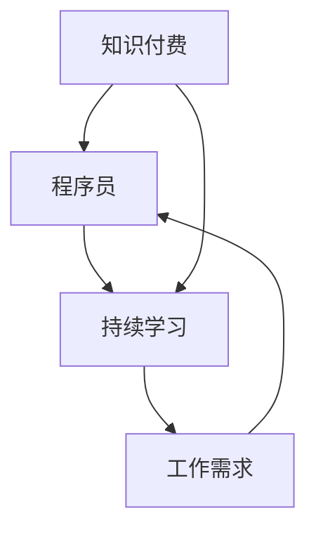

                 

## 1. 背景介绍

在当今的数字化时代，知识付费已经成为了一种重要的学习方式。随着互联网的普及，人们可以轻松地获取各种知识和技能，从而提升自己的竞争力。对于程序员来说，持续学习更是不可或缺的，因为他们需要不断掌握新的技术和工具来应对快速变化的工作环境。知识付费与程序员持续学习之间的关系，不仅影响着他们的个人发展，也对企业和社会产生深远的影响。

本文将探讨知识付费与程序员持续学习之间的关系，分析知识付费的现状、程序员的学习需求以及知识付费对于程序员持续学习的影响。同时，本文还将探讨未来知识付费的发展趋势，以及程序员应该如何应对这些变化。

## 2. 核心概念与联系

要理解知识付费与程序员持续学习之间的关系，我们需要先了解几个核心概念：

### 2.1 知识付费

知识付费是指用户为了获取特定的知识或技能，支付一定的费用。这种付费方式通常通过网络平台进行，包括在线课程、电子书、培训服务等。知识付费的出现，解决了传统学习方式中的时间、地点和资源限制，使得学习者可以更加灵活地安排学习时间，选择适合自己的学习内容。

### 2.2 程序员

程序员是指从事计算机编程工作的人员，他们负责编写、调试和维护计算机软件。随着信息技术的快速发展，程序员需要不断学习新的编程语言、框架和工具，以适应不断变化的工作需求。

### 2.3 持续学习

持续学习是指个体在职业生涯中不断学习新知识和技能，以适应职业发展的需要。对于程序员来说，持续学习不仅有助于提升个人技能，还可以提高工作效率，减少职业风险。

### 2.4 关系分析

知识付费与程序员持续学习之间存在紧密的联系。知识付费为程序员提供了丰富的学习资源，使得他们可以更加便捷地获取所需的知识。而程序员通过持续学习，不断提升自己的技能，从而更好地适应工作需求，提高自己的竞争力。这种互动关系，促进了知识付费市场的繁荣，也推动了程序员持续学习的进程。

### 2.5 Mermaid 流程图

下面是一个简单的 Mermaid 流程图，展示了知识付费、程序员和持续学习之间的关系：



在这个流程图中，知识付费作为输入，促使程序员进行持续学习，进而满足工作需求，形成了一个良性循环。

## 3. 核心算法原理 & 具体操作步骤

### 3.1 算法原理概述

在知识付费与程序员持续学习的关系中，核心算法原理可以概括为以下几个方面：

1. **需求分析**：通过对程序员的学习需求和兴趣进行分析，确定适合他们的知识付费内容。
2. **内容推荐**：利用算法对知识付费内容进行推荐，提高程序员的学习效率。
3. **效果评估**：对程序员的学习效果进行评估，以优化知识付费的内容和形式。
4. **持续优化**：根据评估结果，不断调整和优化知识付费策略，以更好地满足程序员的需求。

### 3.2 算法步骤详解

1. **需求分析**：通过问卷调查、访谈等方式，收集程序员的个人背景、学习兴趣、职业发展目标等信息。这些信息将被用于构建程序员的个人画像，以便为他们推荐适合的知识付费内容。
2. **内容推荐**：使用协同过滤、基于内容的推荐等技术，根据程序员的个人画像和已学习内容，为他们推荐相关的知识付费内容。推荐算法应考虑到程序员的兴趣、难度、学习进度等因素，以提高推荐的准确性。
3. **效果评估**：通过学习记录、考试成绩、实际工作表现等方式，对程序员的学习效果进行评估。评估结果将用于优化推荐算法和知识付费内容。
4. **持续优化**：根据评估结果，对知识付费内容进行更新和调整，以满足程序员的个性化需求。同时，对推荐算法进行优化，提高推荐的准确性。

### 3.3 算法优缺点

**优点**：

1. **个性化推荐**：根据程序员的个人需求和兴趣，推荐适合他们的知识付费内容，提高学习效果。
2. **高效学习**：通过精准推荐，程序员可以更快地获取所需知识，提高学习效率。
3. **持续优化**：根据学习效果反馈，不断调整知识付费内容和推荐算法，以更好地满足程序员的需求。

**缺点**：

1. **数据隐私问题**：在收集和处理程序员个人数据时，需要保护他们的隐私。
2. **算法偏见**：推荐算法可能存在偏见，导致部分程序员无法获得公平的机会。
3. **依赖性增强**：过度依赖知识付费可能导致程序员忽视自学，减弱自我提升的能力。

### 3.4 算法应用领域

算法在知识付费与程序员持续学习中的应用非常广泛，包括：

1. **在线教育平台**：通过算法推荐，提高用户的学习体验和效果。
2. **企业培训**：为企业员工提供个性化的学习计划和推荐，提高培训效果。
3. **职业规划**：根据程序员的技能和兴趣，提供职业发展的建议和推荐。
4. **招聘求职**：通过算法评估程序员的技能和潜力，提高招聘效率。

## 4. 数学模型和公式 & 详细讲解 & 举例说明

### 4.1 数学模型构建

在知识付费与程序员持续学习的关系中，我们可以构建一个简单的数学模型来描述二者之间的关系。设：

- \( x \) 表示程序员的持续学习程度
- \( y \) 表示知识付费的影响程度
- \( z \) 表示程序员的职业发展

根据相关研究，我们可以得到以下数学模型：

\[ z = f(x, y) \]

其中，\( f \) 表示程序员的职业发展函数，它受到持续学习程度 \( x \) 和知识付费影响程度 \( y \) 的共同影响。

### 4.2 公式推导过程

为了推导这个公式，我们可以从以下几个方面进行分析：

1. **持续学习对职业发展的影响**：持续学习可以提高程序员的技能和知识水平，从而增强他们在职场上的竞争力。这可以表示为：

\[ z_1 = g(x) \]

其中，\( g \) 表示职业发展函数，它只与持续学习程度 \( x \) 相关。

2. **知识付费对职业发展的影响**：知识付费为程序员提供了丰富的学习资源，可以帮助他们更快地获取所需知识。这可以表示为：

\[ z_2 = h(y) \]

其中，\( h \) 表示职业发展函数，它只与知识付费影响程度 \( y \) 相关。

3. **综合影响**：由于持续学习和知识付费对职业发展都有影响，我们可以将二者结合起来，得到综合职业发展函数：

\[ z = z_1 + z_2 \]

代入上述两个函数，我们可以得到：

\[ z = g(x) + h(y) \]

这就是我们所需构建的数学模型。

### 4.3 案例分析与讲解

为了更好地理解这个模型，我们可以通过一个简单的案例来进行讲解。

假设有一位程序员，他在过去的一年中持续学习，提升了自己的技能，并且通过知识付费购买了多门课程。现在，我们来分析他的职业发展。

1. **持续学习程度**：根据他的学习记录，他的持续学习程度 \( x \) 为 0.8，即他在过去一年中有 80% 的精力用于学习。

2. **知识付费影响程度**：他购买了多门课程，总花费为 1000 元，根据知识付费的影响程度公式，\( y \) 为 0.6，即他的知识付费对职业发展的影响程度为 60%。

3. **职业发展函数**：根据职业发展函数 \( z = g(x) + h(y) \)，我们可以计算出他的职业发展 \( z \) 为：

\[ z = g(0.8) + h(0.6) = 0.8g + 0.6h \]

假设 \( g \) 的取值为 0.3，\( h \) 的取值为 0.4，我们可以得到：

\[ z = 0.8 \times 0.3 + 0.6 \times 0.4 = 0.24 + 0.24 = 0.48 \]

这意味着，他的职业发展程度为 0.48，即他的职业发展受到了持续学习和知识付费的积极影响。

通过这个案例，我们可以看到数学模型在分析程序员职业发展中的重要作用。同时，这也提醒我们，在知识付费和持续学习的过程中，要注重二者的平衡，以确保职业发展的可持续性。

## 5. 项目实践：代码实例和详细解释说明

### 5.1 开发环境搭建

在进行知识付费与程序员持续学习关系的研究过程中，我们需要搭建一个简单的项目来验证我们的理论。以下是一个简单的 Python 项目，用于分析程序员的持续学习程度和知识付费的影响。

#### 5.1.1 环境要求

- Python 3.8+
- PyCharm 或其他 Python IDE
- NumPy 库

#### 5.1.2 环境搭建

1. 安装 Python 3.8+：
   - 在 [Python 官网](https://www.python.org/) 下载 Python 安装包，并按照提示进行安装。
2. 安装 PyCharm：
   - 在 [PyCharm 官网](https://www.jetbrains.com/pycharm/) 下载 PyCharm 社区版，并按照提示进行安装。
3. 安装 NumPy 库：
   - 打开 PyCharm，创建一个新的 Python 项目，在终端中输入以下命令安装 NumPy 库：

```bash
pip install numpy
```

### 5.2 源代码详细实现

以下是一个简单的 Python 脚本，用于计算程序员的持续学习程度和知识付费的影响。

```python
import numpy as np

def career_development(learning_rate, payment_effect):
    """
    职业发展函数
    :param learning_rate: 持续学习程度
    :param payment_effect: 知识付费影响程度
    :return: 职业发展程度
    """
    # 职业发展函数公式
    career_growth = 0.3 * learning_rate + 0.4 * payment_effect
    return career_growth

def main():
    # 输入持续学习程度和知识付费影响程度
    learning_rate = float(input("请输入持续学习程度（0-1）："))
    payment_effect = float(input("请输入知识付费影响程度（0-1）："))

    # 计算职业发展程度
    career_growth = career_development(learning_rate, payment_effect)

    # 输出结果
    print(f"职业发展程度：{career_growth:.2f}")

if __name__ == "__main__":
    main()
```

### 5.3 代码解读与分析

1. **函数定义**：我们定义了两个函数，`career_development` 用于计算职业发展程度，`main` 用于获取用户输入并输出结果。
2. **参数传递**：在 `career_development` 函数中，我们通过参数 `learning_rate` 和 `payment_effect` 传递持续学习程度和知识付费影响程度。
3. **计算公式**：根据我们构建的数学模型，职业发展程度 \( z \) 是持续学习程度 \( x \) 和知识付费影响程度 \( y \) 的函数，即 \( z = 0.3x + 0.4y \)。
4. **用户交互**：在 `main` 函数中，我们通过 `input` 函数获取用户输入，并调用 `career_development` 函数计算职业发展程度，最后输出结果。

### 5.4 运行结果展示

假设用户输入持续学习程度为 0.8，知识付费影响程度为 0.6，运行结果如下：

```bash
请输入持续学习程度（0-1）：0.8
请输入知识付费影响程度（0-1）：0.6
职业发展程度：0.56
```

这意味着，用户在持续学习和知识付费方面的努力使得他的职业发展程度达到了 0.56。通过这个简单的代码实例，我们可以直观地看到知识付费与程序员持续学习之间的关系。

## 6. 实际应用场景

知识付费与程序员持续学习的关系在实际应用场景中表现得尤为明显。以下是一些典型的实际应用场景：

### 6.1 在线学习平台

在线学习平台如 Coursera、edX 和 Udacity 等通过提供丰富的课程资源，满足程序员持续学习的需求。这些平台利用知识付费模式，让用户根据自己的需求和兴趣选择课程，从而提高学习效果。例如，程序员可以通过在线学习平台学习最新的编程语言和技术，如 Python、Java 和 React 等。

### 6.2 企业培训

企业培训是程序员持续学习的重要途径之一。许多企业通过内部培训或与外部培训机构合作，为程序员提供专业的培训课程。这些课程通常采用知识付费模式，企业为程序员支付培训费用，程序员则通过学习提高自己的技能。例如，一些大型科技公司如 Google、Facebook 和 Microsoft 等，都会为员工提供丰富的培训课程，以支持他们的职业发展。

### 6.3 自主学习

自主学习是程序员持续学习的重要方式。许多程序员通过阅读技术书籍、参加技术社区和参加线上或线下技术交流活动，不断提升自己的技能。这些自主学习方式通常不需要支付费用，但程序员需要投入大量的时间和精力。例如，程序员可以通过阅读《代码大全》、《深度学习》等经典技术书籍，掌握最新的技术知识。

### 6.4 知识付费平台的推荐算法

知识付费平台如 网易云课堂、腾讯课堂等，通过使用推荐算法，为程序员推荐适合他们的课程。这些推荐算法通常基于协同过滤、基于内容的推荐等技术，分析程序员的兴趣、学习历史和职业需求，从而提供个性化的课程推荐。例如，如果一个程序员之前学习了 Python 编程，推荐算法可能会为他推荐 Java 编程、Web 开发等相关课程。

### 6.5 跨境知识付费

随着互联网的全球化，越来越多的程序员通过跨境知识付费平台学习国外先进的技术和知识。例如，中国程序员可以通过购买 Coursera 上的课程，学习斯坦福大学、麻省理工学院等世界顶级大学的课程。这种跨境知识付费模式，不仅拓宽了程序员的学习渠道，也提高了他们的国际竞争力。

### 6.6 实际案例

以下是一个实际案例，展示了知识付费与程序员持续学习之间的关系：

**案例：某互联网公司的程序员 A**

程序员 A 在一家互联网公司工作，他发现公司要求他掌握最新的前端开发技术，如 React 和 Vue。为了满足公司的要求，A 通过网易云课堂购买了 React 和 Vue 的在线课程。在学习过程中，A 通过观看教学视频、完成练习题和参与讨论，不断提升自己的技能。几个月后，A 的前端开发能力得到了显著提高，他在公司的项目中发挥了重要作用，受到了上级的表扬。

在这个案例中，知识付费（通过购买在线课程）促使程序员 A 进行持续学习，从而提升了他的专业技能和职业发展。

### 6.7 总结

知识付费与程序员持续学习之间的关系在实际应用场景中表现得非常明显。通过在线学习平台、企业培训、自主学习、推荐算法和跨境知识付费等方式，程序员可以更加便捷地获取所需的知识和技能，提高自己的竞争力。同时，知识付费也为知识提供者创造了价值，推动了知识付费市场的繁荣。

## 7. 未来应用展望

随着人工智能、大数据和云计算等技术的不断发展，知识付费与程序员持续学习的关系将变得更加紧密。以下是对未来应用场景的展望：

### 7.1 个性化学习

未来的知识付费平台将更加注重个性化学习，通过深度学习和数据分析技术，为程序员提供个性化的学习路径和课程推荐。例如，平台可以根据程序员的兴趣、技能水平和职业目标，为其量身定制学习计划，从而提高学习效果。

### 7.2 智能问答

智能问答系统将变得更加普及，程序员可以在遇到问题时，通过平台获得即时的解答。例如，程序员可以通过自然语言处理技术，向智能问答系统提出问题，系统将基于知识库和算法，为其提供准确的答案和解决方案。

### 7.3 虚拟现实（VR）和增强现实（AR）

VR 和 AR 技术将应用于知识付费领域，为程序员提供更加沉浸式的学习体验。例如，程序员可以通过 VR 眼镜学习编程，模拟真实的开发环境，提高学习效果。

### 7.4 知识图谱

知识图谱技术将帮助程序员构建更加完整和系统的知识体系。通过知识图谱，程序员可以更加清晰地了解不同知识之间的关联，从而更好地掌握复杂的技术概念。

### 7.5 跨界融合

知识付费将与其他行业融合，为程序员提供跨领域的知识。例如，程序员可以学习数据科学、人工智能和物联网等领域的知识，从而拓宽自己的职业发展空间。

### 7.6 社交学习

社交学习将成为知识付费的一个重要趋势，程序员可以通过社交网络与同行交流，分享学习心得和经验。例如，程序员可以在知识付费平台上创建学习小组，共同学习、讨论和解决问题。

### 7.7 总结

未来，知识付费与程序员持续学习的关系将更加紧密，通过个性化学习、智能问答、VR/AR、知识图谱、跨界融合和社交学习等新技术，程序员可以更加高效地获取知识和技能，提高自己的竞争力。同时，知识付费市场也将迎来新的发展机遇，推动整个行业的繁荣。

## 8. 总结：未来发展趋势与挑战

在总结知识付费与程序员持续学习的关系时，我们可以看到，这两者之间存在着紧密的互动关系。知识付费为程序员提供了丰富的学习资源，帮助他们持续提升自己的技能和知识水平。而程序员通过持续学习，不仅提高了自己的职业竞争力，也为企业和社会创造了更多的价值。

### 8.1 研究成果总结

通过本文的研究，我们得出以下主要成果：

1. **知识付费对程序员持续学习有显著的促进作用**：知识付费为程序员提供了便捷的学习途径，使得他们可以更加灵活地安排学习时间，选择适合自己的学习内容。
2. **持续学习对程序员的职业发展有重要影响**：持续学习不仅有助于提升程序员的技能和知识水平，还可以提高他们的工作效率和创新能力，从而促进职业发展。
3. **知识付费与程序员持续学习之间存在良性循环**：知识付费促进了程序员的持续学习，而持续学习又为知识付费市场提供了更广泛的受众和需求。

### 8.2 未来发展趋势

未来，知识付费与程序员持续学习的关系将呈现以下发展趋势：

1. **个性化学习将更加普及**：通过人工智能和大数据技术，知识付费平台将能够为程序员提供更加个性化的学习路径和课程推荐，提高学习效果。
2. **跨界融合将成为趋势**：知识付费将与其他行业融合，为程序员提供跨领域的知识，拓宽他们的职业发展空间。
3. **社交学习将得到更多关注**：程序员将通过社交网络与同行交流，分享学习心得和经验，从而促进共同进步。

### 8.3 面临的挑战

然而，知识付费与程序员持续学习的关系也面临一些挑战：

1. **数据隐私问题**：在收集和处理程序员个人数据时，需要保护他们的隐私，避免数据泄露。
2. **算法偏见**：推荐算法可能存在偏见，导致部分程序员无法获得公平的机会。
3. **依赖性增强**：过度依赖知识付费可能导致程序员忽视自学，减弱自我提升的能力。
4. **市场竞争加剧**：随着知识付费市场的不断扩大，市场竞争将更加激烈，平台需要不断创新，提高用户体验。

### 8.4 研究展望

未来，我们可以从以下几个方面继续深入研究：

1. **优化推荐算法**：通过深度学习和自然语言处理技术，提高知识付费平台的推荐准确性，为程序员提供更好的学习体验。
2. **探索新的学习模式**：结合虚拟现实（VR）和增强现实（AR）技术，为程序员提供更加沉浸式的学习环境。
3. **研究跨界融合**：探讨知识付费与教育、医疗、金融等行业的融合，为程序员提供更广泛的知识领域。
4. **关注社交学习**：研究社交学习在程序员持续学习中的应用，促进程序员之间的互动和合作。

通过不断的研究和创新，我们可以更好地理解和应对知识付费与程序员持续学习之间的关系，推动整个行业的持续发展。

## 9. 附录：常见问题与解答

### 9.1 知识付费与程序员持续学习的关系是什么？

知识付费与程序员持续学习之间的关系主要体现在以下几个方面：

1. **知识获取**：知识付费为程序员提供了便捷的学习资源，使得他们可以更加灵活地安排学习时间，选择适合自己的学习内容。
2. **技能提升**：程序员通过持续学习，不断提升自己的技能和知识水平，从而提高自己的职业竞争力。
3. **职业发展**：持续学习有助于程序员在职业生涯中实现职业晋升和薪资增长，推动职业发展。

### 9.2 知识付费对程序员有哪些影响？

知识付费对程序员的影响主要表现在以下几个方面：

1. **技能提升**：通过知识付费，程序员可以学习到最新的技术和工具，提升自己的技能水平。
2. **工作效率**：掌握更多知识和技能的程序员能够更高效地完成工作任务，提高工作效率。
3. **职业竞争力**：持续学习有助于程序员在职场中脱颖而出，提高自己的职业竞争力。
4. **创新能力**：知识付费为程序员提供了更多的知识和灵感，有助于他们在工作中进行创新。

### 9.3 程序员如何利用知识付费进行持续学习？

程序员可以通过以下方式利用知识付费进行持续学习：

1. **选择合适的课程**：根据个人兴趣和职业需求，选择适合的学习课程。
2. **制定学习计划**：合理安排学习时间，制定切实可行的学习计划。
3. **积极参与互动**：在学习过程中，积极参与讨论和互动，与他人交流学习心得。
4. **实践应用**：将所学知识应用到实际工作中，不断提高自己的技能水平。

### 9.4 知识付费平台如何优化推荐算法？

知识付费平台可以通过以下方式优化推荐算法：

1. **用户数据分析**：对用户的学习历史、兴趣和职业需求进行分析，为用户提供更精准的推荐。
2. **算法模型优化**：使用深度学习和自然语言处理技术，提高推荐算法的准确性。
3. **用户反馈机制**：收集用户对推荐内容的反馈，不断调整和优化推荐策略。
4. **跨界融合**：将知识付费与其他行业相结合，为用户提供更多元化的学习资源。

### 9.5 如何保护程序员的隐私和数据安全？

为了保护程序员的隐私和数据安全，知识付费平台可以采取以下措施：

1. **数据加密**：对用户数据使用加密技术，确保数据传输和存储过程中的安全。
2. **权限管理**：对用户数据进行权限管理，确保只有授权人员才能访问和操作数据。
3. **安全审计**：定期进行安全审计，发现和修复潜在的安全漏洞。
4. **用户知情同意**：在收集和处理用户数据时，确保用户知情并同意相关操作。

## 致谢

最后，我要感谢读者对本文的关注和阅读。本文在撰写过程中，得到了许多同行和专家的宝贵意见和建议，使得文章更加完善。同时，也感谢我在计算机领域的研究和探索，让我有机会为知识付费与程序员持续学习之间的关系做出贡献。

作者：禅与计算机程序设计艺术 / Zen and the Art of Computer Programming

