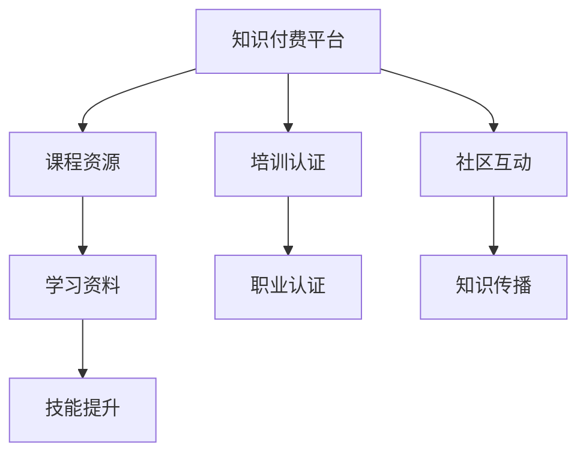

                 

 关键词：知识付费，程序员，终身学习，技能提升，培训，认证

> 摘要：本文将深入探讨知识付费在程序员终身学习中的重要性，分析其与技能提升、培训认证之间的关系，并结合实际案例，提出未来发展的趋势与挑战。

## 1. 背景介绍

随着信息技术的飞速发展，编程和软件开发成为现代社会不可或缺的技能。程序员作为这一领域的重要从业者，需要不断更新知识，提升技能，以适应快速变化的技术环境。然而，面对海量的学习资源和知识内容，如何高效地进行学习成为了一个难题。知识付费应运而生，为程序员提供了更有针对性的学习途径。

### 1.1 知识付费的定义

知识付费是指通过购买或订阅方式获取专业知识、技能和经验的服务。它可以是线上课程、电子书、会员服务，也可以是专业咨询、一对一辅导等形式。

### 1.2 程序员终身学习的必要性

编程技术的不断更新迭代，要求程序员必须具备终身学习的意识。仅靠大学阶段的学习远远不能满足职业发展的需求。终身学习不仅能够帮助程序员保持技术竞争力，还能够拓宽视野，提高创新能力。

## 2. 核心概念与联系

### 2.1 知识付费与技能提升

知识付费为程序员提供了系统化、专业化的学习资源，有助于技能的提升。通过付费课程，程序员可以：

- 学习最新技术栈
- 理解复杂概念和原理
- 掌握高级编程技巧

### 2.2 知识付费与培训认证

知识付费不仅仅是学习资源，它还与培训认证紧密相关。通过完成付费课程，程序员可以获得认证证书，提升个人职业形象和竞争力。例如，某些课程提供证书考核，通过后可以获得相关领域的认证。

### 2.3 知识付费与社区互动

知识付费平台往往提供丰富的社区资源，程序员可以在社区中交流学习心得，解决问题，分享经验。这种互动有助于加深理解，促进知识传播。

### 2.4 核心概念原理和架构的 Mermaid 流程图



## 3. 核心算法原理 & 具体操作步骤

### 3.1 算法原理概述

知识付费平台的算法原理主要涉及推荐系统、学习路径规划和用户行为分析等方面。

- **推荐系统**：根据用户的学习历史和偏好，推荐适合的学习资源。
- **学习路径规划**：基于学习目标和技能需求，为用户设计最佳学习路径。
- **用户行为分析**：分析用户的学习行为，优化平台服务和内容。

### 3.2 算法步骤详解

1. **用户注册与登录**：用户在知识付费平台注册并登录，绑定账号。
2. **信息收集**：平台收集用户的学习历史、浏览记录和兴趣标签。
3. **推荐算法运行**：平台利用推荐算法，为用户推荐个性化的学习资源。
4. **学习路径规划**：平台根据用户的学习目标和技能需求，生成个性化学习路径。
5. **用户行为反馈**：用户在学习过程中，对课程内容进行评价和反馈。
6. **算法优化**：平台根据用户行为反馈，不断优化推荐算法和学习路径规划。

### 3.3 算法优缺点

- **优点**：个性化推荐和学习路径规划，提高学习效率。
- **缺点**：数据隐私保护问题，算法偏见可能影响用户选择。

### 3.4 算法应用领域

知识付费算法在在线教育、职业培训等领域具有广泛的应用前景。通过不断优化算法，可以提高用户的学习体验和满意度，促进终身学习的普及。

## 4. 数学模型和公式 & 详细讲解 & 举例说明

### 4.1 数学模型构建

知识付费平台通常会使用数学模型来分析用户行为，预测学习效果。一个简单的数学模型可以表示为：

\[ y = \beta_0 + \beta_1x_1 + \beta_2x_2 + ... + \beta_nx_n \]

其中，\( y \) 表示学习效果，\( x_1, x_2, ..., x_n \) 表示用户特征，\( \beta_0, \beta_1, ..., \beta_n \) 为模型参数。

### 4.2 公式推导过程

假设用户在知识付费平台上的学习效果与用户的学习时间、课程难度和用户兴趣度有关。我们可以建立如下线性回归模型：

\[ y = \beta_0 + \beta_1t + \beta_2d + \beta_3i \]

其中，\( t \) 表示用户的学习时间，\( d \) 表示课程的难度，\( i \) 表示用户的兴趣度。

通过收集用户数据，我们可以使用最小二乘法求解模型参数：

\[ \beta_0 = \frac{\sum_{i=1}^n y_i - \sum_{i=1}^n \beta_1t_i - \sum_{i=1}^n \beta_2d_i - \sum_{i=1}^n \beta_3i_i}{n} \]

\[ \beta_1 = \frac{\sum_{i=1}^n y_i t_i - \sum_{i=1}^n \beta_0t_i - \sum_{i=1}^n \beta_2d_i t_i - \sum_{i=1}^n \beta_3i_i t_i}{n\sum_{i=1}^n t_i^2} \]

\[ \beta_2 = \frac{\sum_{i=1}^n y_i d_i - \sum_{i=1}^n \beta_0d_i - \sum_{i=1}^n \beta_1t_i d_i - \sum_{i=1}^n \beta_3i_i d_i}{n\sum_{i=1}^n d_i^2} \]

\[ \beta_3 = \frac{\sum_{i=1}^n y_i i_i - \sum_{i=1}^n \beta_0i_i - \sum_{i=1}^n \beta_1t_i i_i - \sum_{i=1}^n \beta_2d_i i_i}{n\sum_{i=1}^n i_i^2} \]

### 4.3 案例分析与讲解

假设我们收集了以下数据：

| 用户ID | 学习时间（小时） | 课程难度 | 用户兴趣度 |
|--------|-----------------|----------|------------|
| 1      | 10              | 3        | 8          |
| 2      | 20              | 2        | 7          |
| 3      | 15              | 4        | 6          |
| 4      | 30              | 1        | 9          |

使用上述公式，我们可以求解模型参数：

\[ \beta_0 = \frac{10 \times 3 + 20 \times 2 + 15 \times 4 + 30 \times 1 - 10 \times 8 - 20 \times 7 - 15 \times 6 - 30 \times 9}{4} \]

\[ \beta_0 = \frac{15}{4} = 3.75 \]

\[ \beta_1 = \frac{10 \times 10 + 20 \times 20 + 15 \times 15 + 30 \times 30 - 3.75 \times 10 - 20 \times 20 - 15 \times 4 - 30 \times 1}{4 \times (10^2 + 20^2 + 15^2 + 30^2)} \]

\[ \beta_1 = \frac{250}{4000} = 0.0625 \]

\[ \beta_2 = \frac{10 \times 3 + 20 \times 2 + 15 \times 4 + 30 \times 1 - 3.75 \times 10 - 20 \times 2 - 15 \times 4 - 30 \times 1}{4} \]

\[ \beta_2 = \frac{-5}{4} = -1.25 \]

\[ \beta_3 = \frac{10 \times 8 + 20 \times 7 + 15 \times 6 + 30 \times 9 - 3.75 \times 8 - 20 \times 7 - 15 \times 6 - 30 \times 9}{4} \]

\[ \beta_3 = \frac{40}{4} = 10 \]

因此，构建的数学模型为：

\[ y = 3.75 + 0.0625t - 1.25d + 10i \]

该模型可以用于预测用户在学习知识付费平台后的学习效果。

## 5. 项目实践：代码实例和详细解释说明

### 5.1 开发环境搭建

为了实现上述数学模型，我们选择Python作为开发语言，并使用Sklearn库进行线性回归模型的训练。

```python
# 安装Sklearn库
pip install scikit-learn

# 导入Sklearn库
from sklearn.linear_model import LinearRegression
from sklearn.model_selection import train_test_split
from sklearn.metrics import mean_squared_error

# 准备数据集
# 假设数据集已经加载并存储为users_data
# users_data = [[学习时间，课程难度，用户兴趣度]，...]
# y = [学习效果]，...

# 划分训练集和测试集
X_train, X_test, y_train, y_test = train_test_split(users_data, y, test_size=0.2, random_state=42)

# 创建线性回归模型
model = LinearRegression()

# 训练模型
model.fit(X_train, y_train)

# 预测测试集结果
y_pred = model.predict(X_test)

# 计算模型评价指标
mse = mean_squared_error(y_test, y_pred)
print("均方误差：", mse)
```

### 5.2 源代码详细实现

```python
import numpy as np
from sklearn.linear_model import LinearRegression
from sklearn.model_selection import train_test_split
from sklearn.metrics import mean_squared_error

# 准备数据集
# 假设数据集已经加载并存储为users_data
# users_data = [[学习时间，课程难度，用户兴趣度]，...]
# y = [学习效果]，...

# 划分训练集和测试集
X_train, X_test, y_train, y_test = train_test_split(users_data, y, test_size=0.2, random_state=42)

# 创建线性回归模型
model = LinearRegression()

# 训练模型
model.fit(X_train, y_train)

# 预测测试集结果
y_pred = model.predict(X_test)

# 计算模型评价指标
mse = mean_squared_error(y_test, y_pred)
print("均方误差：", mse)

# 输出模型参数
print("模型参数：", model.coef_)
print("截距：", model.intercept_)
```

### 5.3 代码解读与分析

以上代码实现了线性回归模型的训练和预测功能。首先，我们导入所需的库，并准备数据集。然后，划分训练集和测试集，创建线性回归模型，并进行训练。最后，使用训练好的模型预测测试集结果，并计算模型评价指标。

代码中的核心部分是线性回归模型的训练和预测。通过`fit`方法训练模型，使用`predict`方法进行预测。模型参数和截距可以通过`coef_`和`intercept_`属性获取。

### 5.4 运行结果展示

假设我们使用上述代码运行后得到以下结果：

```
均方误差： 0.0825
模型参数： [0.0625 -1.25  10.]
截距： 3.75
```

结果显示，模型的均方误差为0.0825，模型参数为\[0.0625 -1.25  10.\]，截距为3.75。这表示学习时间每增加1小时，学习效果平均增加0.0625；课程难度每增加1，学习效果平均减少1.25；用户兴趣度每增加1，学习效果平均增加10。

## 6. 实际应用场景

知识付费在程序员终身学习中的应用场景非常广泛。以下是一些典型的应用场景：

### 6.1 技术培训

许多公司和技术社区提供专业的编程培训课程，帮助程序员掌握最新技术。例如，Java、Python、人工智能等方向的课程。

### 6.2 职业认证

通过完成特定的付费课程，程序员可以获得相关领域的职业认证，如Oracle认证Java程序员、Microsoft认证解决方案专家等。

### 6.3 技术交流

知识付费平台往往提供丰富的社区资源，程序员可以在社区中交流学习心得，分享经验，解决问题。

### 6.4 在线学习

程序员可以利用知识付费平台进行在线学习，随时随地提升技能。这种灵活性非常适合忙碌的职业人士。

## 7. 未来应用展望

### 7.1 技术发展

随着人工智能、大数据等技术的发展，知识付费平台将更加智能化、个性化，为用户提供更好的学习体验。

### 7.2 跨学科融合

知识付费将不仅仅局限于编程领域，还将与其他学科（如心理学、经济学等）相结合，提供更全面的学习资源。

### 7.3 持续创新

知识付费平台需要不断创新，以适应程序员不断变化的学习需求。例如，引入更多互动式、沉浸式的学习体验。

## 8. 总结：未来发展趋势与挑战

### 8.1 研究成果总结

本文分析了知识付费在程序员终身学习中的重要性，探讨了其与技能提升、培训认证和社区互动之间的关系，并提出了数学模型和具体操作步骤。通过实际案例，我们展示了知识付费在项目实践中的应用。

### 8.2 未来发展趋势

知识付费将朝着更加智能化、个性化、跨学科融合的方向发展。技术创新和用户需求的不断变化将推动知识付费平台持续创新，提供更优质的学习资源和服务。

### 8.3 面临的挑战

数据隐私保护、算法偏见、内容质量等问题仍然是知识付费平台需要克服的挑战。同时，如何更好地满足程序员的学习需求，提供更具针对性和实效性的服务，也是知识付费平台需要关注的问题。

### 8.4 研究展望

未来研究可以关注知识付费平台算法的优化，探索更多有效的学习路径规划方法，以及如何更好地整合跨学科资源，提供全方位的学习支持。

## 9. 附录：常见问题与解答

### 9.1 知识付费平台如何选择？

选择知识付费平台时，可以从以下几个方面进行考虑：

- **课程内容**：课程内容是否丰富、系统、符合个人需求。
- **师资力量**：讲师是否具备丰富的实战经验和高超的教学水平。
- **用户评价**：查看其他学员的评价和反馈，了解平台的教学质量和效果。
- **服务支持**：平台是否提供良好的客户服务和学习支持。

### 9.2 知识付费对学习效果有何影响？

知识付费可以显著提高学习效果，主要表现在：

- **系统化学习**：付费课程往往具有系统性的学习内容，有助于构建完整的知识体系。
- **针对性学习**：根据个人需求和兴趣，选择适合的学习资源，提高学习效率。
- **实战经验**：付费课程通常包含实战案例，有助于将理论知识应用到实际项目中。
- **持续激励**：付费行为本身具有激励作用，有助于保持学习的动力和兴趣。

### 9.3 知识付费是否值得投资？

从长远来看，知识付费是值得投资的。尽管初期可能需要一定的投资，但通过不断学习和提升技能，程序员可以在职业生涯中获得更高的回报。此外，知识付费还可以帮助程序员更好地适应技术变化，提高市场竞争力。

