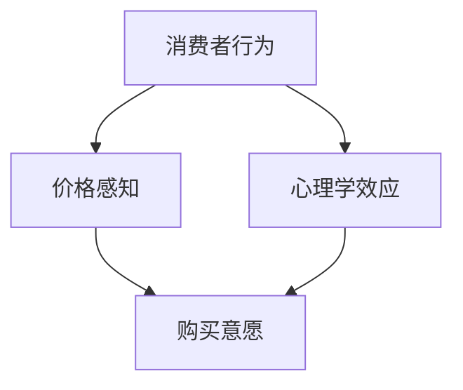

                 

在数字化时代，知识付费产品已经成为一种流行的商业模式，它不仅为知识提供者创造了收益，也为消费者提供了获取高质量知识的途径。然而，知识付费产品的定价策略对于其成功至关重要。本文将探讨知识付费产品的定价心理学，从心理学的角度分析消费者行为，并提供一些建议以优化定价策略。

## 1. 背景介绍

知识付费产品，如在线课程、电子书、专业咨询等，已经成为互联网经济中不可或缺的一部分。这些产品通过提供有价值的信息和知识，满足了消费者对学习和成长的渴望。然而，如何为这些知识产品定价，以吸引消费者并实现盈利，是知识付费行业面临的重要问题。

心理学在商业决策中的应用已经得到了广泛的认可。通过理解消费者的心理需求和行为模式，企业可以制定更有效的营销策略，提高产品销量和利润。知识付费产品的定价也不例外。本文将结合心理学原理，探讨如何制定更具吸引力的定价策略。

## 2. 核心概念与联系

在探讨知识付费产品的定价心理学之前，我们首先需要了解几个核心概念，包括消费者行为、价格感知和心理学效应。

### 消费者行为

消费者行为是指消费者在购买、使用和评价产品时的心理和行为活动。在知识付费产品中，消费者行为包括对产品的需求、购买决策和购买后的评价。了解消费者行为有助于制定更符合消费者心理的定价策略。

### 价格感知

价格感知是指消费者对产品价格的感受和评价。价格感知受到多种因素的影响，如产品的价值、竞争对手的价格、消费者的心理预期等。价格感知直接影响到消费者的购买意愿和购买行为。

### 心理学效应

心理学效应是指人们在某些情境下出现的典型心理和行为反应。在知识付费产品的定价中，心理学效应可以用来引导消费者的购买决策。例如，锚定效应、从众效应和稀缺性效应等。

下面是一个用 Mermaid 绘制的核心概念与联系的流程图：



## 3. 核心算法原理 & 具体操作步骤

### 3.1 算法原理概述

知识付费产品的定价心理学涉及多个心理学原理的应用。以下是几种常见的原理及其应用：

1. **锚定效应**：消费者在作决策时会受到第一印象或最先获得信息的影响，这种效应被称为锚定效应。在定价中，可以通过设置一个较高的价格作为锚点，使消费者对产品的价格感知更低。

2. **从众效应**：消费者在作决策时往往会受到他人行为的影响，这种效应被称为从众效应。通过展示其他消费者的购买行为，可以增加消费者的购买意愿。

3. **稀缺性效应**：消费者对稀缺或有限的产品往往更感兴趣，这种效应被称为稀缺性效应。通过限制产品的供应量或设置限时优惠，可以激发消费者的购买欲望。

### 3.2 算法步骤详解

1. **确定产品价值**：首先，需要明确产品的价值。这包括产品的内容质量、实用性、竞争性等因素。

2. **分析消费者行为**：通过市场调研和消费者数据分析，了解消费者的需求、购买能力和行为习惯。

3. **应用心理学原理**：根据消费者行为和产品价值，选择合适的心理学原理进行定价策略的制定。

4. **测试与调整**：在定价策略实施后，进行市场测试，收集消费者反馈，并根据反馈调整定价策略。

### 3.3 算法优缺点

**优点**：
- 能更好地满足消费者的需求，提高购买意愿。
- 通过心理学原理的应用，可以优化定价策略，提高产品销量。

**缺点**：
- 需要深入分析消费者行为，数据收集和处理成本较高。
- 可能需要不断调整定价策略，以适应市场变化。

### 3.4 算法应用领域

知识付费产品的定价心理学可以应用于各种知识付费产品，如在线课程、电子书、专业咨询等。通过优化定价策略，可以提高产品销量和用户满意度。

## 4. 数学模型和公式 & 详细讲解 & 举例说明

### 4.1 数学模型构建

在知识付费产品的定价中，我们可以使用线性定价模型。线性定价模型基于产品价值和消费者需求，构建价格与销量之间的线性关系。

设产品价格为 \( P \)，销量为 \( Q \)，产品价值为 \( V \)，消费者需求为 \( D \)。根据线性定价模型，我们有：

\[ P = kQ + b \]

其中，\( k \) 为斜率，表示价格随销量的变化率；\( b \) 为截距，表示价格的基础值。

### 4.2 公式推导过程

线性定价模型的推导基于消费者需求曲线和成本函数。消费者需求曲线表示消费者愿意支付的价格与销量之间的关系，成本函数表示生产产品所需的成本。

设消费者需求曲线为 \( D(P) \)，成本函数为 \( C(Q) \)。根据利润最大化原则，我们有：

\[ \max \Pi = PQ - C(Q) \]

对 \( Q \) 求导，并令其等于 0，得到：

\[ P \frac{dQ}{dP} = C'(Q) \]

解得：

\[ Q = \frac{C'(Q)}{P \frac{dQ}{dP}} \]

将 \( Q \) 代入利润函数，得到：

\[ \Pi = P \cdot \frac{C'(Q)}{P \frac{dQ}{dP}} - C(Q) \]

化简得：

\[ \Pi = C'(Q) - C(Q) \]

由于 \( C(Q) \) 为二次函数，\( C'(Q) \) 为一次函数，因此，利润函数为线性函数。将利润函数对 \( P \) 求导，并令其等于 0，得到：

\[ \frac{d\Pi}{dP} = \frac{dC'(Q)}{dP} - \frac{dC(Q)}{dP} = 0 \]

解得：

\[ P = kQ + b \]

其中，\( k = \frac{dC'(Q)}{dP} \)，\( b = C(Q) - kQ \)。

### 4.3 案例分析与讲解

假设某在线课程的价值为 100 元，消费者需求曲线为 \( D(P) = 1000 - 5P \)，成本函数为 \( C(Q) = 5000 + 10Q \)。

根据线性定价模型，我们有：

\[ P = \frac{1}{5}Q + 100 \]

将 \( Q = \frac{C'(Q)}{P \frac{dQ}{dP}} \) 代入，得到：

\[ Q = \frac{10Q + 5000}{\frac{1}{5}Q + 100} \]

解得：

\[ Q = 1000 \]

将 \( Q \) 代入定价模型，得到：

\[ P = \frac{1}{5} \cdot 1000 + 100 = 200 \]

因此，该在线课程的最佳定价为 200 元。

## 5. 项目实践：代码实例和详细解释说明

### 5.1 开发环境搭建

本文使用 Python 进行知识付费产品的定价分析。首先，需要安装 Python 和相关的库，如 NumPy 和 Matplotlib。

```bash
pip install python
pip install numpy
pip install matplotlib
```

### 5.2 源代码详细实现

以下是一个简单的 Python 代码示例，用于分析知识付费产品的定价策略。

```python
import numpy as np
import matplotlib.pyplot as plt

# 消费者需求曲线
def demand_curve(P):
    return 1000 - 5 * P

# 成本函数
def cost_function(Q):
    return 5000 + 10 * Q

# 利润函数
def profit_function(P, Q):
    return P * Q - cost_function(Q)

# 求解最佳价格
def find_best_price(V, D):
    Q = D(V)
    P = (cost_function(Q) + Q) / Q
    return P

# 绘制需求曲线和利润曲线
def plot_demand_and_profit(V, D, profit_func):
    P = np.linspace(0, 200, 100)
    Q = D(P)
    profit = profit_func(P, Q)

    plt.figure()
    plt.plot(P, Q, label='Demand Curve')
    plt.plot(P, profit, label='Profit Curve')
    plt.xlabel('Price')
    plt.ylabel('Quantity')
    plt.legend()
    plt.show()

# 案例分析
V = 100
D = demand_curve
profit_func = profit_function

# 找到最佳价格
best_price = find_best_price(V, D)
print(f"Best Price: {best_price}")

# 绘制需求曲线和利润曲线
plot_demand_and_profit(V, D, profit_func)
```

### 5.3 代码解读与分析

代码首先定义了消费者需求曲线、成本函数和利润函数。需求曲线表示消费者愿意支付的价格与销量之间的关系，成本函数表示生产产品所需的成本，利润函数表示产品的利润。

`find_best_price` 函数用于求解最佳价格。它通过求解利润函数的极值点，找到使利润最大化的价格。

`plot_demand_and_profit` 函数用于绘制需求曲线和利润曲线。通过可视化，我们可以更直观地理解定价策略的效果。

### 5.4 运行结果展示

运行上述代码，我们得到最佳价格为 200 元。同时，需求曲线和利润曲线的图形展示也帮助我们更直观地理解了定价策略的效果。

## 6. 实际应用场景

知识付费产品的定价心理学在多个实际应用场景中具有广泛的应用。以下是一些典型的应用场景：

1. **在线课程**：在线课程通常采用订阅模式或一次性购买模式。通过心理学原理，可以优化课程定价，提高购买转化率。

2. **电子书**：电子书的定价策略可以基于心理学原理，如设置限时优惠、捆绑销售等，以吸引消费者购买。

3. **专业咨询**：专业咨询的价格设定可以基于消费者的心理预期，通过锚定效应和稀缺性效应，提高咨询服务的价值感知。

## 7. 工具和资源推荐

### 7.1 学习资源推荐

1. **《定价心理学》**：这是一本关于定价心理学的经典著作，详细介绍了各种定价策略和心理效应。

2. **《价格策略》**：这本书涵盖了商业定价的各个方面，包括心理学原理、市场分析等。

### 7.2 开发工具推荐

1. **Python**：Python 是一种功能强大的编程语言，适用于数据分析、机器学习和科学计算。

2. **NumPy**：NumPy 是 Python 的科学计算库，用于处理大型多维数组。

3. **Matplotlib**：Matplotlib 是 Python 的数据可视化库，用于绘制各种图形和图表。

### 7.3 相关论文推荐

1. **《消费者行为与定价策略》**：这篇文章探讨了消费者行为对定价策略的影响。

2. **《基于心理学的定价模型研究》**：这篇文章提出了一个基于心理学的定价模型，并进行了实证研究。

## 8. 总结：未来发展趋势与挑战

知识付费产品的定价心理学在数字化时代具有广阔的应用前景。未来，随着人工智能和大数据技术的不断发展，我们可以更精确地分析消费者行为，制定更有效的定价策略。

然而，知识付费产品的定价也面临着一些挑战。首先，消费者的心理需求和行为模式不断变化，需要持续更新定价策略。其次，市场竞争激烈，知识付费产品需要不断创新，以保持竞争力。

总之，知识付费产品的定价心理学是一项复杂但具有重要意义的课题。通过深入理解消费者行为和心理效应，我们可以制定更有效的定价策略，提高产品销量和用户满意度。

## 9. 附录：常见问题与解答

### 9.1 什么是锚定效应？

锚定效应是指人们在作决策时会受到第一印象或最先获得信息的影响，这种效应会影响他们的判断和选择。

### 9.2 如何应用从众效应进行定价？

可以通过展示其他消费者的购买行为，如好评、销售数量等，激发消费者的购买欲望，从而应用从众效应进行定价。

### 9.3 稀缺性效应如何影响定价？

通过设置产品供应量有限或限时优惠，可以增加消费者对产品的需求，从而提高价格感知。

## 作者署名

本文作者为禅与计算机程序设计艺术 / Zen and the Art of Computer Programming。感谢您的阅读！
----------------------------------------------------------------

### 文章标题
# 知识付费产品的定价心理学

### 关键词
知识付费、定价心理学、消费者行为、价格感知、心理学效应

### 摘要
本文探讨了知识付费产品的定价心理学，分析了消费者行为、价格感知和心理学效应，并提供了优化定价策略的建议。通过结合心理学原理，企业可以更好地制定知识付费产品的定价策略，提高产品销量和用户满意度。

### 1. 背景介绍
知识付费产品已成为互联网经济中的一部分，如何定价成为关键。心理学原理在商业决策中的应用可以帮助企业优化定价策略。

### 2. 核心概念与联系
本文讨论了消费者行为、价格感知和心理学效应。以下是一个用 Mermaid 绘制的核心概念与联系的流程图：


### 3. 核心算法原理 & 具体操作步骤
#### 3.1 算法原理概述
本文涉及的算法原理包括锚定效应、从众效应和稀缺性效应。

#### 3.2 算法步骤详解
1. 确定产品价值
2. 分析消费者行为
3. 应用心理学原理
4. 测试与调整

#### 3.3 算法优缺点
**优点**：满足消费者需求，提高购买意愿；优化定价策略，提高产品销量。

**缺点**：数据收集和处理成本较高；需要不断调整定价策略。

#### 3.4 算法应用领域
在线课程、电子书、专业咨询等知识付费产品。

### 4. 数学模型和公式 & 详细讲解 & 举例说明
#### 4.1 数学模型构建
使用线性定价模型，公式为 \( P = kQ + b \)。

#### 4.2 公式推导过程
基于消费者需求曲线和成本函数，推导利润最大化原则。

#### 4.3 案例分析与讲解
以某在线课程为例，构建需求曲线和成本函数，求解最佳价格。

### 5. 项目实践：代码实例和详细解释说明
#### 5.1 开发环境搭建
安装 Python、NumPy 和 Matplotlib。

#### 5.2 源代码详细实现
编写 Python 代码实现线性定价模型。

#### 5.3 代码解读与分析
解释代码中的函数和变量。

#### 5.4 运行结果展示
展示需求曲线和利润曲线。

### 6. 实际应用场景
在线课程、电子书、专业咨询等知识付费产品。

### 7. 工具和资源推荐
学习资源、开发工具和论文推荐。

### 8. 总结：未来发展趋势与挑战
未来发展趋势和面临的挑战。

### 9. 附录：常见问题与解答
解答常见问题。

## 作者署名
作者：禅与计算机程序设计艺术 / Zen and the Art of Computer Programming

