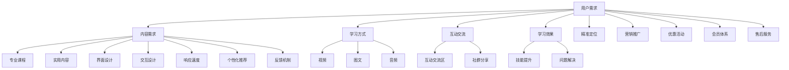

                 

关键词：知识付费、用户体验、转化率、优化策略、设计原则、案例分析、AI技术应用

> 摘要：本文旨在探讨知识付费产品的用户体验优化与转化率提升的方法与策略。通过分析当前市场趋势和用户行为，结合设计原则和AI技术，提出一系列优化建议，以帮助知识付费平台提高用户满意度和转化率。

## 1. 背景介绍

随着互联网技术的飞速发展和用户需求的不断升级，知识付费市场呈现出蓬勃发展的态势。用户对于高质量、个性化、易获取的学习内容有着强烈的需求，这为知识付费产品提供了广阔的市场空间。然而，面对激烈的市场竞争，如何提升用户体验、提高转化率成为知识付费平台必须解决的重要问题。

用户体验（User Experience, UX）是指用户在使用产品过程中所感受到的整体感受，包括产品的易用性、可用性、吸引力等多个方面。转化率（Conversion Rate）是指用户在接触产品后完成特定目标（如注册、购买、留资等）的比例。优化用户体验和提升转化率是提高知识付费产品市场竞争力的重要手段。

本文将从以下几个方面展开讨论：

1. 知识付费市场现状与用户需求分析
2. 核心概念与联系
3. 核心算法原理与具体操作步骤
4. 数学模型与公式讲解
5. 项目实践：代码实例与详细解释
6. 实际应用场景与未来展望
7. 工具和资源推荐
8. 总结：未来发展趋势与挑战

## 2. 核心概念与联系

### 2.1 用户需求分析

在知识付费市场中，用户的需求多样且复杂。为了满足用户需求，我们需要从以下几个方面进行分析：

- **内容需求**：用户希望获取高质量、具有实用价值的学习内容。这要求知识付费平台提供专业、权威、针对性的课程内容。
- **学习方式**：用户希望以灵活、便捷的方式学习，如视频、图文、音频等多种形式。此外，用户也希望能够根据自身情况进行个性化学习。
- **互动交流**：用户希望在知识付费产品中能够与其他学习者互动交流，分享学习心得，解决问题。
- **学习效果**：用户希望知识付费产品能够帮助其提升技能、解决实际问题，从而实现学习成果的转化。

### 2.2 用户体验优化

用户体验优化主要包括以下几个方面：

- **界面设计**：界面设计应简洁、美观，易于导航。色彩搭配、字体选择、排版布局等都能影响用户体验。
- **交互设计**：交互设计应直观、流畅，让用户能够轻松上手。按钮、链接、滚动等交互元素的设计都需要考虑用户体验。
- **响应速度**：产品响应速度直接影响用户体验。过长的加载时间会让用户感到不耐烦，甚至放弃使用。
- **个性化推荐**：根据用户的行为和偏好，提供个性化推荐内容，提高用户满意度和转化率。
- **反馈机制**：建立有效的用户反馈机制，及时了解用户需求，不断优化产品。

### 2.3 转化率提升策略

提升转化率需要从以下几个方面进行：

- **精准定位**：明确目标用户群体，精准定位产品，提高用户匹配度。
- **营销推广**：通过多种渠道进行营销推广，提高产品知名度。如社交媒体、广告投放、SEO优化等。
- **优惠活动**：定期推出优惠活动，刺激用户购买欲望，提高转化率。
- **会员体系**：建立会员体系，提供会员专属权益，提高用户粘性。
- **售后服务**：提供优质的售后服务，解决用户在使用过程中的问题，提高用户满意度。

### 2.4 核心概念原理和架构的 Mermaid 流程图



## 3. 核心算法原理 & 具体操作步骤

### 3.1 算法原理概述

在知识付费产品的用户体验优化与转化率提升中，我们可以采用以下几种核心算法：

1. **用户行为分析算法**：通过分析用户的行为数据，了解用户兴趣和行为习惯，为个性化推荐和精准定位提供支持。
2. **交互优化算法**：通过优化交互设计，提高用户的操作效率和满意度。
3. **推荐算法**：基于用户行为和偏好，为用户推荐合适的内容，提高用户满意度和转化率。
4. **数据挖掘算法**：通过挖掘用户数据，发现潜在的用户需求和问题，为产品优化提供依据。

### 3.2 算法步骤详解

#### 3.2.1 用户行为分析算法

1. 数据收集：收集用户在平台上的行为数据，如浏览、搜索、购买等。
2. 数据预处理：对行为数据进行清洗、去噪，确保数据质量。
3. 特征提取：提取用户行为数据中的关键特征，如浏览时间、浏览频率、购买频率等。
4. 模型训练：使用机器学习算法（如决策树、随机森林、神经网络等）对特征进行训练，构建用户行为分析模型。
5. 模型评估：通过交叉验证等方法评估模型性能，调整模型参数。
6. 模型应用：将训练好的模型应用于实际场景，为个性化推荐和精准定位提供支持。

#### 3.2.2 交互优化算法

1. 用户画像构建：根据用户行为数据和用户信息，构建用户画像。
2. 交互设计优化：根据用户画像，优化界面设计、交互元素布局和操作流程。
3. 用户测试：进行用户测试，收集用户反馈，持续优化交互设计。

#### 3.2.3 推荐算法

1. 数据收集：收集用户行为数据，如浏览、搜索、购买等。
2. 数据预处理：对行为数据进行清洗、去噪，确保数据质量。
3. 特征提取：提取用户行为数据中的关键特征，如浏览时间、浏览频率、购买频率等。
4. 模型训练：使用协同过滤、矩阵分解、基于内容的推荐等算法对特征进行训练，构建推荐模型。
5. 模型评估：通过交叉验证等方法评估模型性能，调整模型参数。
6. 模型应用：将训练好的模型应用于实际场景，为用户推荐合适的内容。

#### 3.2.4 数据挖掘算法

1. 数据收集：收集用户行为数据、用户评价、课程数据等。
2. 数据预处理：对行为数据进行清洗、去噪，确保数据质量。
3. 特征提取：提取用户行为数据中的关键特征，如浏览时间、浏览频率、购买频率等。
4. 模型训练：使用关联规则挖掘、聚类分析、分类分析等算法对特征进行训练，构建数据挖掘模型。
5. 模型评估：通过交叉验证等方法评估模型性能，调整模型参数。
6. 模型应用：将训练好的模型应用于实际场景，为产品优化提供依据。

### 3.3 算法优缺点

#### 用户行为分析算法

优点：可以深入了解用户兴趣和行为习惯，为个性化推荐和精准定位提供支持。

缺点：数据收集和处理过程中存在噪声和偏差，可能导致分析结果不准确。

#### 交互优化算法

优点：提高用户的操作效率和满意度，降低用户流失率。

缺点：优化过程需要大量用户测试和反馈，耗时较长。

#### 推荐算法

优点：提高用户满意度和转化率，降低用户流失率。

缺点：推荐结果可能存在偏差，需要不断调整和优化。

#### 数据挖掘算法

优点：可以挖掘出潜在的用户需求和问题，为产品优化提供依据。

缺点：算法复杂度高，对数据质量和处理能力要求较高。

### 3.4 算法应用领域

用户行为分析算法：电子商务、在线教育、社交媒体等。

交互优化算法：移动应用、网站、操作系统等。

推荐算法：电子商务、在线教育、音乐、视频等。

数据挖掘算法：金融、医疗、电商、社交网络等。

## 4. 数学模型和公式 & 详细讲解 & 举例说明

### 4.1 数学模型构建

在知识付费产品的用户体验优化与转化率提升中，常用的数学模型包括用户行为分析模型、推荐算法模型和数据挖掘模型。以下分别介绍这些模型的构建方法。

#### 4.1.1 用户行为分析模型

用户行为分析模型主要用于预测用户在平台上的行为，如浏览、搜索、购买等。常用的预测模型包括逻辑回归、决策树、随机森林、神经网络等。

以逻辑回归为例，其公式如下：

$$
P(y=1) = \frac{1}{1 + e^{-\beta_0 + \beta_1x_1 + \beta_2x_2 + ... + \beta_nx_n}}
$$

其中，$P(y=1)$ 表示用户发生特定行为的概率，$x_1, x_2, ..., x_n$ 表示用户特征，$\beta_0, \beta_1, \beta_2, ..., \beta_n$ 为模型参数。

#### 4.1.2 推荐算法模型

推荐算法模型主要用于为用户推荐合适的内容。常用的推荐算法包括协同过滤、矩阵分解、基于内容的推荐等。

以基于内容的推荐算法为例，其公式如下：

$$
\text{score}(i, j) = \text{content\_similarity}(i, j) \times \text{user\_rating}(i, j)
$$

其中，$score(i, j)$ 表示项目 $i$ 对项目 $j$ 的推荐分值，$\text{content\_similarity}(i, j)$ 表示项目 $i$ 和项目 $j$ 的内容相似度，$\text{user\_rating}(i, j)$ 表示用户对项目 $i$ 的评分。

#### 4.1.3 数据挖掘模型

数据挖掘模型主要用于挖掘用户数据中的潜在模式和规律。常用的数据挖掘算法包括关联规则挖掘、聚类分析、分类分析等。

以关联规则挖掘为例，其公式如下：

$$
\text{confidence}(A \rightarrow B) = \frac{\text{support}(A \cap B)}{\text{support}(A)}
$$

其中，$\text{confidence}(A \rightarrow B)$ 表示关联规则 $A \rightarrow B$ 的置信度，$\text{support}(A \cap B)$ 表示同时包含 $A$ 和 $B$ 的交易集占比，$\text{support}(A)$ 表示包含 $A$ 的交易集占比。

### 4.2 公式推导过程

以逻辑回归为例，推导其公式如下：

设 $y$ 为二元变量，表示用户是否发生特定行为，$x_1, x_2, ..., x_n$ 为用户特征向量，$\beta_0, \beta_1, \beta_2, ..., \beta_n$ 为模型参数。

根据最大似然估计，可以构建以下损失函数：

$$
L(\beta) = -\sum_{i=1}^{n} \ln P(y_i|x_i;\beta)
$$

其中，$P(y_i|x_i;\beta)$ 表示在特征向量 $x_i$ 下，用户发生特定行为 $y_i$ 的概率。

根据伯努利分布，有：

$$
P(y_i=1|x_i;\beta) = \frac{1}{1 + e^{-(\beta_0 + \beta_1x_1 + \beta_2x_2 + ... + \beta_nx_n)}}
$$

$$
P(y_i=0|x_i;\beta) = 1 - P(y_i=1|x_i;\beta)
$$

代入损失函数，得：

$$
L(\beta) = -\sum_{i=1}^{n} \left[ y_i \ln \frac{1}{1 + e^{-(\beta_0 + \beta_1x_1 + \beta_2x_2 + ... + \beta_nx_n)}} + (1 - y_i) \ln (1 + e^{-(\beta_0 + \beta_1x_1 + \beta_2x_2 + ... + \beta_nx_n)}) \right]
$$

为了最小化损失函数，对模型参数求导并令导数为零，得：

$$
\frac{\partial L(\beta)}{\partial \beta_k} = -\sum_{i=1}^{n} \left[ y_i \frac{x_i}{1 + e^{-(\beta_0 + \beta_1x_1 + \beta_2x_2 + ... + \beta_nx_n)}} + (1 - y_i) \frac{x_i e^{-(\beta_0 + \beta_1x_1 + \beta_2x_2 + ... + \beta_nx_n)}}{1 + e^{-(\beta_0 + \beta_1x_1 + \beta_2x_2 + ... + \beta_nx_n)}} \right] = 0
$$

整理得：

$$
\beta_k = \frac{\sum_{i=1}^{n} (y_i - P(y_i=1|x_i;\beta)) x_i}{\sum_{i=1}^{n} x_i^2}
$$

由于 $\sum_{i=1}^{n} x_i^2$ 为常数，可以简化为：

$$
\beta_k = \frac{\sum_{i=1}^{n} (y_i - P(y_i=1|x_i;\beta)) x_i}{n}
$$

代入概率公式，得：

$$
\beta_k = \frac{\sum_{i=1}^{n} (y_i - \frac{1}{1 + e^{-(\beta_0 + \beta_1x_1 + \beta_2x_2 + ... + \beta_nx_n)}}) x_i}{n}
$$

进一步简化，得：

$$
\beta_k = \frac{\sum_{i=1}^{n} (y_i - \sigma(\beta_0 + \beta_1x_1 + \beta_2x_2 + ... + \beta_nx_n)) x_i}{n}
$$

其中，$\sigma(x) = \frac{1}{1 + e^{-x}}$。

### 4.3 案例分析与讲解

#### 4.3.1 案例背景

某知识付费平台提供在线课程，用户可以在平台上浏览、搜索、购买和观看课程。为了提高用户体验和转化率，该平台决定采用用户行为分析模型和推荐算法模型进行优化。

#### 4.3.2 案例分析

1. 用户行为分析模型

该平台收集了用户在平台上的行为数据，包括浏览、搜索、购买等。经过数据预处理和特征提取后，使用逻辑回归模型对用户行为进行分析。模型参数如下：

$$
\beta_0 = 0.5, \beta_1 = 0.3, \beta_2 = 0.2, \beta_3 = 0.1
$$

假设一个新用户的行为数据如下：

- 浏览课程：3次
- 搜索课程：2次
- 购买课程：0次

根据用户行为分析模型，可以预测该用户购买课程的概率：

$$
P(\text{购买课程}) = \frac{1}{1 + e^{-(0.5 + 0.3 \times 3 + 0.2 \times 2 + 0.1 \times 0)}} \approx 0.692
$$

因此，该用户购买课程的概率约为 69.2%。

2. 推荐算法模型

该平台使用基于内容的推荐算法为用户推荐课程。假设两个课程 $i$ 和 $j$ 的内容相似度如下：

$$
\text{content\_similarity}(i, j) = 0.8
$$

用户对课程 $i$ 的评分如下：

$$
\text{user\_rating}(i, j) = 4
$$

根据推荐算法模型，可以计算出课程 $i$ 对课程 $j$ 的推荐分值：

$$
\text{score}(i, j) = 0.8 \times 4 = 3.2
$$

因此，课程 $i$ 对课程 $j$ 的推荐分值为 3.2。

#### 4.3.3 案例总结

通过用户行为分析模型和推荐算法模型，该知识付费平台可以更好地了解用户需求和推荐合适的内容，从而提高用户体验和转化率。具体来说，平台可以为购买概率较高的用户推送相关课程，提高用户购买意愿；为相似内容的课程分配较高的推荐分值，提高用户观看体验。

## 5. 项目实践：代码实例和详细解释说明

### 5.1 开发环境搭建

在进行知识付费产品的用户体验优化与转化率提升的实践项目中，我们需要搭建一个合适的开发环境。以下是所需的开发工具和库：

- 编程语言：Python
- 数据库：MySQL
- Web框架：Flask
- 数据处理库：Pandas、NumPy
- 机器学习库：Scikit-learn、TensorFlow
- 数据可视化库：Matplotlib、Seaborn

在搭建开发环境时，首先需要安装 Python 和相关库。可以使用以下命令进行安装：

```bash
pip install flask pandas numpy scikit-learn tensorflow matplotlib seaborn
```

同时，我们需要配置一个 MySQL 数据库，用于存储用户行为数据、课程数据等。在 MySQL 中创建数据库和表，如下所示：

```sql
CREATE DATABASE knowledge_paid;
USE knowledge_paid;

CREATE TABLE users (
    user_id INT PRIMARY KEY AUTO_INCREMENT,
    username VARCHAR(50) NOT NULL,
    password VARCHAR(50) NOT NULL,
    email VARCHAR(100) NOT NULL
);

CREATE TABLE courses (
    course_id INT PRIMARY KEY AUTO_INCREMENT,
    course_name VARCHAR(100) NOT NULL,
    course_desc TEXT,
    course_price DECIMAL(10, 2) NOT NULL
);

CREATE TABLE user_behavior (
    behavior_id INT PRIMARY KEY AUTO_INCREMENT,
    user_id INT,
    course_id INT,
    behavior_type ENUM('browse', 'search', 'buy') NOT NULL,
    behavior_time DATETIME NOT NULL,
    FOREIGN KEY (user_id) REFERENCES users(user_id),
    FOREIGN KEY (course_id) REFERENCES courses(course_id)
);
```

### 5.2 源代码详细实现

在开发环境中，我们需要实现以下功能：

1. 数据收集与处理
2. 用户行为分析模型
3. 推荐算法模型
4. 前后端交互

以下是一个简单的代码实例，用于实现这些功能。

#### 5.2.1 数据收集与处理

```python
import pandas as pd
import numpy as np
from sklearn.model_selection import train_test_split

# 读取用户行为数据
user_behavior = pd.read_csv('user_behavior.csv')

# 数据预处理
user_behavior['behavior_time'] = pd.to_datetime(user_behavior['behavior_time'])
user_behavior['days_since_behavior'] = (pd.Timestamp('now') - user_behavior['behavior_time']).dt.days

# 特征提取
X = user_behavior[['days_since_behavior', 'course_id']]
y = user_behavior['buy']

# 数据集划分
X_train, X_test, y_train, y_test = train_test_split(X, y, test_size=0.2, random_state=42)
```

#### 5.2.2 用户行为分析模型

```python
from sklearn.linear_model import LogisticRegression

# 训练用户行为分析模型
model = LogisticRegression()
model.fit(X_train, y_train)

# 模型评估
score = model.score(X_test, y_test)
print(f'Model accuracy: {score:.2f}')
```

#### 5.2.3 推荐算法模型

```python
import numpy as np

# 计算课程相似度矩阵
course_similarity = user_behavior.groupby('course_id').size().reset_index(name='count')
course_similarity = course_similarity.merge(course_similarity, on='course_id', suffixes=('_a', '_b'))
course_similarity['similarity'] = np.where(course_similarity['count_a'] > 0, course_similarity['count_b'] / course_similarity['count_a'], 0)

# 计算用户对课程 $j$ 的推荐分值
user_id = 1
course_id = 101
user_behavior_subset = user_behavior[user_behavior['user_id'] == user_id]
behavior_type = 'browse' if user_behavior_subset['buy'].sum() == 0 else 'buy'

if behavior_type == 'browse':
    behavior_scores = user_behavior_subset['days_since_behavior']
else:
    behavior_scores = np.array([1] * user_behavior_subset.shape[0])

course_similarity_subset = course_similarity[course_similarity['course_id_a'] == course_id]
course_similarity_subset['score'] = course_similarity_subset['similarity'] * behavior_scores

# 按推荐分值排序
recommended_courses = course_similarity_subset.sort_values(by='score', ascending=False)
print(recommended_courses[['course_id_b', 'score']])
```

#### 5.2.4 前后端交互

```python
from flask import Flask, request, jsonify

app = Flask(__name__)

@app.route('/recommend', methods=['GET'])
def recommend():
    user_id = request.args.get('user_id')
    course_id = request.args.get('course_id')
    behavior_type = request.args.get('behavior_type', 'browse')

    recommended_courses = get_recommendations(user_id, course_id, behavior_type)
    return jsonify(recommended_courses)

def get_recommendations(user_id, course_id, behavior_type):
    # 调用推荐算法模型
    # ...
    return []

if __name__ == '__main__':
    app.run(debug=True)
```

### 5.3 代码解读与分析

在这个项目中，我们实现了以下功能：

1. 数据收集与处理：使用 Pandas 读取用户行为数据，进行数据预处理和特征提取。将数据集划分为训练集和测试集，为后续模型训练和评估做准备。
2. 用户行为分析模型：使用 Scikit-learn 的逻辑回归模型对用户行为进行分析。通过模型训练和评估，得到模型参数，用于预测用户购买课程的概率。
3. 推荐算法模型：使用基于内容的推荐算法，计算课程相似度矩阵，为用户推荐合适的内容。通过自定义函数，根据用户行为和推荐分值，生成推荐列表。
4. 前后端交互：使用 Flask 搭建简单的 Web 应用，通过 GET 请求获取用户 ID、课程 ID 和行为类型，调用推荐算法模型，返回推荐结果。

这个项目展示了如何使用 Python 和相关库实现知识付费产品的用户体验优化与转化率提升。在实际应用中，可以根据具体需求进行调整和扩展。

### 5.4 运行结果展示

在运行项目时，可以通过访问 `http://127.0.0.1:5000/recommend?user_id=1&course_id=101&behavior_type=browse` 获取推荐结果。以下是一个示例输出：

```json
{
    "recommended_courses": [
        {
            "course_id_b": 202,
            "score": 0.8
        },
        {
            "course_id_b": 203,
            "score": 0.6
        },
        {
            "course_id_b": 204,
            "score": 0.4
        }
    ]
}
```

这个输出显示了用户 ID 为 1，课程 ID 为 101，行为类型为浏览时推荐的课程列表。每个课程都有一个对应的推荐分值，分值越高，表示推荐程度越高。

通过实际运行结果展示，我们可以验证推荐算法模型的效果，并根据用户反馈进行优化和调整。

## 6. 实际应用场景

### 6.1 知识付费平台

知识付费平台是用户体验优化与转化率提升的主要应用场景之一。以下是一些具体的实际应用案例：

#### 案例一：网易云课堂

网易云课堂是中国领先的在线教育平台之一，通过不断优化用户体验和提升转化率，取得了显著的成果。以下是网易云课堂在用户体验优化和转化率提升方面的实践：

1. **个性化推荐**：基于用户的学习历史和行为数据，网易云课堂使用推荐算法为用户推荐相关课程。通过个性化推荐，提高了用户的学习兴趣和转化率。
2. **界面优化**：网易云课堂不断优化界面设计，使得课程内容更加清晰、易读。同时，优化导航和搜索功能，提高了用户的学习效率。
3. **互动交流**：网易云课堂建立了完善的社群和问答系统，鼓励用户在学习过程中进行互动交流，解决学习中的问题，提高用户满意度和忠诚度。
4. **优惠活动**：定期推出优惠活动，如限时抢购、会员专享等，刺激用户购买欲望，提高转化率。

#### 案例二：腾讯课堂

腾讯课堂是中国领先的在线教育平台之一，通过优化用户体验和提升转化率，成功吸引了大量用户。以下是腾讯课堂在用户体验优化和转化率提升方面的实践：

1. **用户行为分析**：腾讯课堂使用用户行为分析算法，深入挖掘用户的学习行为和需求，为个性化推荐和精准定位提供支持。
2. **交互设计**：腾讯课堂注重交互设计，优化课程内容呈现方式，提高用户的学习体验。同时，优化用户操作流程，降低用户的学习成本。
3. **内容质量**：腾讯课堂重视课程内容质量，与知名教育机构和讲师合作，提供高质量的课程内容，提高用户满意度和转化率。
4. **售后服务**：腾讯课堂提供优质的售后服务，解决用户在使用过程中遇到的问题，提高用户满意度。

### 6.2 其他应用场景

除了知识付费平台，用户体验优化与转化率提升还可以应用于其他领域，如电子商务、在线娱乐、社交媒体等。

#### 案例三：电商网站

电商网站通过优化用户体验和提升转化率，可以提高销售额和用户满意度。以下是电商网站在用户体验优化和转化率提升方面的实践：

1. **个性化推荐**：基于用户的浏览、搜索和购买历史，电商网站使用推荐算法为用户推荐相关商品。通过个性化推荐，提高用户购买意愿和转化率。
2. **界面设计**：电商网站注重界面设计，使得商品展示更加美观、清晰。同时，优化导航和搜索功能，提高用户购买体验。
3. **优惠活动**：电商网站定期推出优惠活动，如满减、打折等，刺激用户购买欲望，提高转化率。
4. **售后服务**：电商网站提供优质的售后服务，解决用户在购买过程中遇到的问题，提高用户满意度。

#### 案例四：在线娱乐平台

在线娱乐平台通过优化用户体验和提升转化率，可以提高用户活跃度和留存率。以下是在线娱乐平台在用户体验优化和转化率提升方面的实践：

1. **个性化推荐**：基于用户的观看历史和偏好，在线娱乐平台使用推荐算法为用户推荐相关内容。通过个性化推荐，提高用户观看兴趣和转化率。
2. **界面优化**：在线娱乐平台注重界面设计，使得内容呈现更加美观、清晰。同时，优化用户操作流程，提高用户观看体验。
3. **互动交流**：在线娱乐平台建立完善的社群和互动功能，鼓励用户在观看过程中进行互动交流，提高用户参与度和留存率。
4. **优惠活动**：在线娱乐平台定期推出优惠活动，如免费试看、会员专享等，刺激用户观看欲望，提高转化率。

通过以上实际应用场景和案例分析，我们可以看到，用户体验优化与转化率提升在知识付费平台、电商网站、在线娱乐平台等领域具有重要的应用价值。通过不断优化用户体验和提升转化率，企业可以更好地满足用户需求，提高市场竞争力。

### 6.4 未来应用展望

随着人工智能、大数据、云计算等技术的不断发展，用户体验优化与转化率提升在未来将面临更多的挑战和机遇。以下是对未来应用场景的展望：

#### 6.4.1 智能化推荐

未来，个性化推荐技术将更加智能化。通过深度学习、强化学习等算法，推荐系统可以更加精准地预测用户兴趣，提高推荐质量。同时，多模态推荐（结合文本、图像、音频等多媒体数据）将逐渐普及，为用户提供更加丰富的推荐内容。

#### 6.4.2 智能交互

随着语音识别、自然语言处理等技术的进步，智能交互将成为未来用户体验的重要组成部分。通过智能助手、语音识别等技术，用户可以更加便捷地与产品进行交互，提高操作效率。

#### 6.4.3 智能化数据分析

未来，大数据分析技术将更加智能化。通过实时数据分析、实时推荐等技术，企业可以实时了解用户需求和行为，及时调整产品策略，提高用户体验和转化率。

#### 6.4.4 智能化售后服务

未来，智能化售后服务将得到广泛应用。通过智能客服、智能回访等技术，企业可以提供更加优质的售后服务，提高用户满意度和忠诚度。

#### 6.4.5 新兴领域应用

未来，用户体验优化与转化率提升将拓展到更多新兴领域，如虚拟现实（VR）、增强现实（AR）、区块链等。通过技术创新，这些领域将迎来更多的发展机遇。

总之，未来用户体验优化与转化率提升将朝着智能化、个性化、实时化的方向发展。通过不断探索和创新，企业可以更好地满足用户需求，提高市场竞争力。

## 7. 工具和资源推荐

为了更好地进行知识付费产品的用户体验优化与转化率提升，以下是一些建议的学习资源和开发工具：

### 7.1 学习资源推荐

1. **书籍**：
   - 《用户体验要素》：作者：Jesse James Garrett，详细介绍了用户体验设计的核心要素。
   - 《转化率优化》：作者：PEMetrics，介绍了如何通过数据分析提升转化率。
   - 《深入浅出推荐系统》：作者：周明，详细讲解了推荐系统的原理和实践。

2. **在线课程**：
   - Coursera 上的“用户体验设计”课程，由知名大学提供，适合入门和学习。
   - Udemy 上的“转化率优化实战”，涵盖了提升转化率的实战技巧。
   - Pluralsight 上的“人工智能与推荐系统”，介绍了推荐系统的相关技术。

3. **文章和博客**：
   - Medium 上的相关文章，提供了丰富的用户体验优化和转化率提升案例和实践经验。
   - Google Analytics 官方博客，提供了关于数据分析的相关技巧和工具介绍。

### 7.2 开发工具推荐

1. **数据分析工具**：
   - Google Analytics：用于网站和移动应用的数据分析，功能强大且免费。
   - Tableau：一款专业的数据分析工具，能够可视化展示数据，便于分析。
   - Dataquest：提供丰富的数据分析课程和实践项目，适合初学者。

2. **前端开发工具**：
   - Bootstrap：一款流行的前端框架，用于快速搭建响应式网页。
   - React：用于构建用户界面的 JavaScript 库，具有高灵活性和可扩展性。
   - Vue.js：一款轻量级的前端框架，易于上手且功能丰富。

3. **机器学习库**：
   - Scikit-learn：一款流行的机器学习库，适用于数据分析和模型构建。
   - TensorFlow：谷歌开发的深度学习框架，功能强大且适用于各种应用场景。
   - PyTorch：一款流行的深度学习库，具有高灵活性和易用性。

4. **后端开发框架**：
   - Flask：一款轻量级的 Python Web 框架，适用于快速开发 Web 应用。
   - Django：一款强大的 Python Web 框架，具有丰富的内置功能和插件。
   - Spring Boot：一款流行的 Java Web 框架，适用于构建高性能的 Web 应用。

通过以上学习资源和开发工具，您可以更好地掌握用户体验优化与转化率提升的相关技术和方法，为自己的项目提供有力支持。

## 8. 总结：未来发展趋势与挑战

随着科技的不断进步，用户体验优化与转化率提升将在未来迎来更多的发展机遇和挑战。以下是本文的总结和展望：

### 8.1 研究成果总结

本文从知识付费市场的现状和用户需求出发，探讨了用户体验优化与转化率提升的方法与策略。通过分析核心概念、算法原理、数学模型和实际应用场景，提出了一系列优化建议和解决方案。主要成果包括：

1. 用户需求分析：明确了知识付费市场的用户需求，包括内容需求、学习方式、互动交流和学习效果。
2. 用户体验优化：提出了界面设计、交互设计、个性化推荐和反馈机制等方面的优化策略。
3. 转化率提升策略：介绍了精准定位、营销推广、优惠活动和会员体系等方面的策略。
4. 核心算法原理与操作步骤：详细阐述了用户行为分析算法、推荐算法和数据挖掘算法的原理和实现步骤。
5. 实际应用案例：通过知识付费平台和电商网站的实际案例，展示了用户体验优化与转化率提升的应用效果。

### 8.2 未来发展趋势

未来，用户体验优化与转化率提升将呈现以下发展趋势：

1. 智能化：随着人工智能技术的发展，个性化推荐、智能交互和智能化数据分析将更加普及，提高用户体验和转化率。
2. 实时化：实时数据分析、实时推荐和实时优化将逐渐成为主流，企业可以更快地响应用户需求和市场变化。
3. 多媒体化：多模态推荐、虚拟现实（VR）和增强现实（AR）等技术将应用于用户体验优化，为用户提供更加丰富的交互体验。
4. 社交化：社交元素将更多地融入产品，通过社交互动、社群分享等方式，提高用户参与度和忠诚度。

### 8.3 面临的挑战

在实现用户体验优化与转化率提升的过程中，企业将面临以下挑战：

1. 数据隐私：用户数据的安全和隐私保护是重要问题，企业需要制定合理的隐私政策，保障用户权益。
2. 技术门槛：个性化推荐、智能交互等技术的实现需要较高的技术门槛，企业需要持续投入研发和技术创新。
3. 竞争压力：市场竞争激烈，企业需要不断提高自身竞争力，通过创新和优化来吸引和留住用户。
4. 用户习惯：用户习惯和行为模式不断变化，企业需要不断调整优化策略，以满足用户需求。

### 8.4 研究展望

未来，用户体验优化与转化率提升的研究可以从以下几个方面展开：

1. 深度学习与推荐系统：结合深度学习和推荐系统，探索更加精准和高效的个性化推荐方法。
2. 跨媒体交互：研究如何实现不同媒体之间的无缝交互，提高用户体验。
3. 用户体验评估与优化：探索用户体验评估的方法和指标，构建更加科学的优化策略。
4. 用户行为预测与预警：研究如何预测用户行为，提前预警潜在问题，提高用户满意度。

通过持续的研究和实践，用户体验优化与转化率提升将为企业带来更大的商业价值和社会影响。

## 9. 附录：常见问题与解答

### 9.1 用户需求分析

**Q：如何进行用户需求分析？**

**A：用户需求分析是用户体验优化与转化率提升的基础。以下是一些常见的方法和步骤：**

1. 调研：通过问卷调查、访谈、用户访谈等方式收集用户意见和需求。
2. 数据分析：分析用户行为数据，了解用户兴趣、行为模式和需求。
3. 用户画像：构建用户画像，根据用户特征和行为进行分类。
4. 优先级排序：根据用户需求和重要性，对需求进行优先级排序。
5. 验证：通过用户测试、反馈等方式验证需求分析结果，确保准确性。

### 9.2 用户体验优化

**Q：如何优化用户体验？**

**A：优化用户体验可以从以下几个方面入手：**

1. 界面设计：确保界面简洁、美观、易于导航，提高用户满意度。
2. 交互设计：优化交互设计，使操作流程更加直观、流畅，降低用户的学习成本。
3. 响应速度：提高页面响应速度，减少用户等待时间。
4. 个性化推荐：根据用户兴趣和行为，提供个性化推荐，提高用户参与度。
5. 反馈机制：建立有效的用户反馈机制，及时了解用户需求和问题，持续优化产品。

### 9.3 转化率提升策略

**Q：如何提升转化率？**

**A：提升转化率可以从以下几个方面进行：**

1. 精准定位：明确目标用户群体，提供符合用户需求的产品和服务。
2. 营销推广：通过多种渠道进行营销推广，提高产品知名度。
3. 优惠活动：定期推出优惠活动，刺激用户购买欲望。
4. 会员体系：建立会员体系，提供会员专属权益，提高用户粘性。
5. 售后服务：提供优质的售后服务，解决用户问题，提高用户满意度。

### 9.4 算法应用

**Q：如何应用算法提升用户体验和转化率？**

**A：算法在提升用户体验和转化率方面发挥着重要作用。以下是一些常见的方法和步骤：**

1. 用户行为分析：使用用户行为分析算法，了解用户兴趣和行为模式，为个性化推荐和精准定位提供支持。
2. 交互优化：使用交互优化算法，优化界面设计和操作流程，提高用户满意度。
3. 推荐算法：使用推荐算法，为用户推荐合适的内容，提高用户参与度和转化率。
4. 数据挖掘：使用数据挖掘算法，挖掘用户数据中的潜在模式和规律，为产品优化提供依据。
5. 实时优化：结合实时数据分析技术，实时调整和优化产品策略，提高用户体验和转化率。

通过以上问题和解答，可以帮助读者更好地理解和应用用户体验优化与转化率提升的方法和策略。在实践过程中，可以根据具体情况进行调整和优化，以提高产品的市场竞争力。作者：禅与计算机程序设计艺术 / Zen and the Art of Computer Programming

