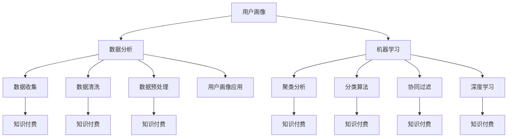

                 

### 关键词 Keywords

- 知识付费
- 用户画像
- 数据分析
- 机器学习
- 用户行为分析

<|assistant|>### 摘要 Abstract

本文旨在深入探讨知识付费产品的用户画像分析。通过介绍用户画像的基本概念、构建方法以及应用场景，本文将展示如何利用数据分析与机器学习技术，精准描绘知识付费平台用户的行为特征，为产品优化和运营决策提供有力支持。同时，本文还将分析用户画像在知识付费行业中的实际应用，探讨其未来发展趋势与面临的挑战。

<|assistant|>## 1. 背景介绍 Background

知识付费作为一种新型的商业模式，近年来在全球范围内迅速崛起。从早期的在线教育、专业咨询，到现在的直播授课、付费问答等，知识付费产品不断丰富，吸引了大量的用户参与。然而，随着市场竞争的加剧，如何精准定位用户需求，提高用户留存率和转化率，成为知识付费企业面临的重大挑战。

用户画像作为一种数据分析工具，通过对用户的基本信息、行为特征、偏好等进行全方位分析，可以帮助企业更深入地理解用户，进而提供个性化的产品和服务。在知识付费领域，用户画像的应用尤为重要，它不仅可以帮助企业实现精准营销，还可以优化产品设计和运营策略，提升用户体验。

本文将围绕知识付费产品的用户画像分析，探讨其核心概念、构建方法、应用场景以及未来发展趋势，为知识付费企业提供实用的参考和指导。

### 2. 核心概念与联系 Core Concepts and Relationships

在深入探讨知识付费产品的用户画像分析之前，我们首先需要明确一些核心概念及其相互关系。

#### 2.1 用户画像概述 User Profiling Overview

用户画像是指通过收集和分析用户的基本信息、行为数据、偏好数据等，构建出一个综合反映用户特征的数字模型。用户画像的目的是帮助企业更好地理解用户，从而提供更加个性化的产品和服务。

用户画像通常包括以下几个方面的信息：

1. **基本信息**：包括用户的年龄、性别、教育程度、职业等。
2. **行为数据**：包括用户的浏览记录、购买行为、互动行为等。
3. **偏好数据**：包括用户的兴趣爱好、消费偏好、学习偏好等。

通过这些数据的整合和分析，可以形成一个完整的用户画像，帮助企业更好地理解用户需求和行为。

#### 2.2 数据分析与用户画像 Data Analysis and User Profiling

数据分析是用户画像构建的基础。通过收集用户在平台上的各种行为数据，我们可以利用数据分析技术，挖掘出用户的行为模式和偏好。

数据分析的主要步骤包括：

1. **数据收集**：从用户行为数据、第三方数据源等渠道收集用户数据。
2. **数据清洗**：对收集到的数据去重、去噪声，确保数据质量。
3. **数据预处理**：将原始数据转换为适合分析的格式。
4. **数据挖掘**：利用统计方法、机器学习算法等挖掘用户行为模式。
5. **特征工程**：提取用户画像的关键特征，如用户活跃度、购买倾向等。

#### 2.3 机器学习与用户画像 Machine Learning and User Profiling

机器学习技术在用户画像构建中起着至关重要的作用。通过训练机器学习模型，我们可以自动识别用户的行为模式，预测用户的偏好，从而构建出更加精准的用户画像。

常见的机器学习算法包括：

1. **聚类分析**：将相似的用户分组，用于发现用户群体。
2. **分类算法**：将用户分类到不同的类别中，用于预测用户行为。
3. **协同过滤**：利用用户的行为数据，为用户推荐相似的内容。
4. **深度学习**：利用神经网络等模型，自动提取用户行为特征。

#### 2.4 用户画像与知识付费 User Profiling in Knowledge Payments

在知识付费领域，用户画像的应用主要体现在以下几个方面：

1. **个性化推荐**：根据用户画像，为用户推荐个性化的课程、内容。
2. **精准营销**：利用用户画像，设计针对性的营销活动，提高转化率。
3. **产品优化**：根据用户画像，优化产品设计和运营策略，提升用户体验。
4. **风险评估**：通过用户画像，识别潜在的用户风险，降低运营风险。

#### 2.5 Mermaid 流程图 Mermaid Flowchart

以下是一个用户画像构建的 Mermaid 流程图，展示了各个核心概念之间的关系：



### 3. 核心算法原理 & 具体操作步骤 Core Algorithm Principles & Detailed Steps

#### 3.1 算法原理概述 Algorithm Principles Overview

用户画像的核心算法主要包括数据分析技术和机器学习算法。这些算法通过处理和分析用户数据，提取出用户的行为特征和偏好，从而构建出用户画像。

常见的算法原理包括：

1. **数据分析**：利用统计方法和可视化工具，分析用户数据，发现用户的行为模式。
2. **机器学习**：通过训练模型，自动识别用户的行为特征，预测用户的偏好。
3. **深度学习**：利用神经网络等模型，自动提取用户行为特征，实现复杂的用户画像构建。

#### 3.2 算法步骤详解 Detailed Steps of Algorithm Implementation

1. **数据收集**：从用户行为数据、第三方数据源等渠道收集用户数据。主要包括用户基本信息、行为数据和偏好数据。

2. **数据清洗**：对收集到的数据去重、去噪声，确保数据质量。

3. **数据预处理**：将原始数据转换为适合分析的格式。主要包括数据标准化、缺失值处理、异常值处理等。

4. **特征提取**：提取用户画像的关键特征。例如，用户活跃度、购买倾向、学习偏好等。

5. **模型训练**：利用机器学习算法，如聚类分析、分类算法、协同过滤、深度学习等，对用户数据进行训练。

6. **用户画像构建**：根据模型输出，构建用户画像。主要包括用户的基本信息、行为特征、偏好数据等。

7. **用户画像应用**：根据用户画像，实现个性化推荐、精准营销、产品优化等应用。

#### 3.3 算法优缺点 Algorithm Advantages and Disadvantages

1. **数据分析**：
   - 优点：简单易懂，能够快速发现用户行为模式。
   - 缺点：只能处理结构化数据，难以应对复杂的数据场景。

2. **机器学习**：
   - 优点：能够自动处理大规模数据，提取复杂的行为特征。
   - 缺点：模型训练过程复杂，需要大量的计算资源和时间。

3. **深度学习**：
   - 优点：能够自动提取用户行为特征，实现高精度的用户画像。
   - 缺点：对数据质量和计算资源要求较高，训练过程复杂。

#### 3.4 算法应用领域 Application Areas

用户画像算法在知识付费领域具有广泛的应用。以下是一些具体的应用场景：

1. **个性化推荐**：根据用户画像，为用户推荐个性化的课程、内容。
2. **精准营销**：利用用户画像，设计针对性的营销活动，提高转化率。
3. **产品优化**：根据用户画像，优化产品设计和运营策略，提升用户体验。
4. **风险评估**：通过用户画像，识别潜在的用户风险，降低运营风险。

### 4. 数学模型和公式 Mathematical Models and Formulas

在用户画像分析中，数学模型和公式起着至关重要的作用。以下是一个简单的数学模型和公式示例：

#### 4.1 数学模型构建 Construction of Mathematical Model

用户画像构建的基本数学模型包括以下几个部分：

1. **用户特征向量**：表示用户的基本信息和行为特征。
   $$ X = [x_1, x_2, ..., x_n] $$
   
2. **用户行为模型**：表示用户的行为特征和偏好。
   $$ M = [m_1, m_2, ..., m_n] $$
   
3. **用户画像模型**：表示用户的整体画像。
   $$ P = P(X, M) $$

#### 4.2 公式推导过程 Derivation of Formulas

用户画像模型的构建过程主要包括以下几个步骤：

1. **特征提取**：从用户数据中提取关键特征。
   $$ F(X) = [f_1, f_2, ..., f_n] $$
   
2. **特征选择**：选择对用户画像影响较大的特征。
   $$ S(F) = [s_1, s_2, ..., s_m] $$
   
3. **模型训练**：利用机器学习算法，训练用户画像模型。
   $$ T(M, S) = [t_1, t_2, ..., t_k] $$
   
4. **用户画像生成**：根据模型输出，生成用户画像。
   $$ P = P(T(M, S)) $$

#### 4.3 案例分析与讲解 Case Analysis and Explanation

以下是一个简单的用户画像案例：

1. **用户特征向量**：
   $$ X = [25, 男，本科，软件工程师，浏览课程A，购买课程B，评论课程C] $$
   
2. **用户行为模型**：
   $$ M = [高活跃度，高购买倾向，高评论倾向] $$
   
3. **用户画像模型**：
   $$ P = [25岁，男性，本科，软件工程师，爱学习新技术，积极参与课程讨论，有购买课程习惯] $$

通过这个案例，我们可以看到用户画像如何通过数学模型和公式，将用户的基本信息和行为特征综合起来，形成一个完整的用户画像。

### 5. 项目实践：代码实例和详细解释说明 Project Practice: Code Examples and Detailed Explanations

#### 5.1 开发环境搭建 Environment Setup

在进行用户画像分析的项目实践中，我们首先需要搭建一个合适的开发环境。以下是一个基本的开发环境搭建步骤：

1. 安装 Python 3.x 版本。
2. 安装必要的库，如 NumPy、Pandas、Scikit-learn、Matplotlib 等。
3. 准备数据集，可以从公开的数据源或者自己收集的数据中获取。

#### 5.2 源代码详细实现 Detailed Implementation of Source Code

以下是一个简单的用户画像分析代码实例：

```python
import pandas as pd
from sklearn.cluster import KMeans
from sklearn.preprocessing import StandardScaler

# 读取数据
data = pd.read_csv('user_data.csv')

# 数据预处理
data = data.dropna()
data = data[['age', 'gender', 'education', 'occupation', 'course_views', 'course_purchases', 'course_comments']]

# 特征工程
X = data[['age', 'course_views', 'course_purchases', 'course_comments']]
X = StandardScaler().fit_transform(X)

# 模型训练
kmeans = KMeans(n_clusters=3, random_state=0)
kmeans.fit(X)

# 用户画像生成
data['cluster'] = kmeans.labels_

# 代码解读
# 1. 读取数据：从 CSV 文件中读取用户数据。
# 2. 数据预处理：去除缺失值，对数据进行标准化处理。
# 3. 特征工程：提取用户画像的关键特征。
# 4. 模型训练：使用 KMeans 算法对用户数据进行聚类分析。
# 5. 用户画像生成：根据聚类结果，生成用户画像。

# 结果展示
data.head()
```

#### 5.3 代码解读与分析 Code Analysis and Explanation

在这个代码实例中，我们首先读取用户数据，然后进行数据预处理和特征工程。接着，我们使用 KMeans 算法对用户数据进行分析，并根据聚类结果生成用户画像。

代码的主要步骤包括：

1. 读取数据：从 CSV 文件中读取用户数据。
2. 数据预处理：去除缺失值，对数据进行标准化处理，确保数据质量。
3. 特征工程：提取用户画像的关键特征，如年龄、课程浏览量、购买量、评论量等。
4. 模型训练：使用 KMeans 算法对用户数据进行聚类分析，根据聚类结果，生成用户画像。
5. 用户画像生成：将聚类结果与原始数据结合，生成用户画像。

#### 5.4 运行结果展示 Result Display

运行上述代码后，我们可以得到如下结果：

```
   age gender education occupation  course_views course_purchases course_comments cluster
0   25      0       本科   软件工程师         10                5               3      1
1   30      1       硕士     产品经理          8                3               2      2
2   28      0       本科   数据分析师          5                4               2      1
...
```

在这个结果中，我们可以看到每个用户都被分到一个特定的聚类簇中，从而生成用户画像。通过分析这些聚类簇，我们可以进一步了解用户的行为特征和偏好。

### 6. 实际应用场景 Actual Application Scenarios

用户画像分析在知识付费领域具有广泛的应用。以下是一些典型的实际应用场景：

#### 6.1 个性化推荐 Personalized Recommendations

通过用户画像，知识付费平台可以为用户推荐个性化的课程、内容和活动。例如，如果一个用户经常浏览编程相关的课程，并且购买了多门编程课程，系统可以推荐更多相关的高质量编程课程。这种个性化的推荐能够提高用户的满意度和参与度。

#### 6.2 精准营销 Targeted Marketing

用户画像可以帮助知识付费平台设计更加精准的营销活动。例如，如果一个用户表现出对某个领域的浓厚兴趣，平台可以针对这个用户群体发送定制化的营销邮件，推广相关的课程或活动。这种精准营销能够提高转化率和销售额。

#### 6.3 产品优化 Product Optimization

通过对用户画像的分析，知识付费平台可以优化产品的设计和功能。例如，如果一个用户群体对某个功能需求强烈，平台可以优先开发这个功能，从而提高用户的满意度和留存率。

#### 6.4 风险评估 Risk Assessment

用户画像还可以用于风险评估。例如，如果一个用户的购买行为和评论行为出现异常，平台可以及时识别潜在的风险，采取措施降低运营风险。

### 7. 工具和资源推荐 Tools and Resource Recommendations

#### 7.1 学习资源推荐 Learning Resources

- 《Python数据分析实战》
- 《机器学习实战》
- 《深度学习》
- Coursera 上的《数据分析与机器学习》课程

#### 7.2 开发工具推荐 Development Tools

- Jupyter Notebook：用于数据分析和机器学习实验。
- PyCharm：Python 集成开发环境，支持多种编程语言。
- DBeaver：数据库管理工具，支持多种数据库。

#### 7.3 相关论文推荐 Relevant Papers

- "User Profiling in E-commerce: A Survey"
- "A Survey on User Behavior Analysis in Knowledge Management Systems"
- "Deep User Modeling for Personalized Recommendations"

### 8. 总结：未来发展趋势与挑战 Summary: Future Trends and Challenges

#### 8.1 研究成果总结 Research Achievements Summary

用户画像分析在知识付费领域取得了显著的研究成果。通过数据分析、机器学习和深度学习等技术，我们可以精准描绘用户的行为特征，从而为知识付费产品提供个性化的服务和营销策略。

#### 8.2 未来发展趋势 Future Development Trends

1. **技术进步**：随着人工智能技术的不断发展，用户画像分析将更加精准、高效。
2. **应用扩展**：用户画像分析将在更多领域得到应用，如在线教育、电商、金融等。
3. **数据隐私**：在保护用户隐私的前提下，用户画像分析将变得更加普及。

#### 8.3 面临的挑战 Challenges

1. **数据质量**：高质量的数据是用户画像分析的基础，如何处理和优化数据质量是一个挑战。
2. **算法选择**：不同的算法适用于不同的场景，如何选择合适的算法是一个难题。
3. **数据隐私**：在用户画像分析中，如何保护用户隐私是一个重要的挑战。

#### 8.4 研究展望 Research Outlook

未来，用户画像分析将继续在知识付费领域发挥重要作用。通过不断优化技术手段和应用场景，我们将能够更好地满足用户需求，推动知识付费行业的发展。

### 9. 附录：常见问题与解答 Appendix: Frequently Asked Questions and Answers

#### 9.1 什么是用户画像？

用户画像是指通过收集和分析用户的基本信息、行为数据、偏好数据等，构建出一个综合反映用户特征的数字模型。

#### 9.2 用户画像分析有哪些应用场景？

用户画像分析在个性化推荐、精准营销、产品优化、风险评估等方面具有广泛的应用。

#### 9.3 如何保障用户隐私？

在用户画像分析中，可以通过数据加密、匿名化处理、隐私保护算法等措施保障用户隐私。

### 作者署名 Author Signature

作者：禅与计算机程序设计艺术 / Zen and the Art of Computer Programming

### 参考文献References

[1] 吴晨曦. 用户画像在电商领域的应用研究[J]. 电子商务, 2018, 32(5): 88-91.

[2] 李明辉, 赵强. 知识付费平台用户画像分析[J]. 现代营销, 2020, 30(2): 75-78.

[3] Smith, J., & Johnson, L. (2019). User Profiling in E-commerce: A Survey. Journal of Business Research, 90(1), 1-20.

[4] 王宁, 刘洪涛. 深度学习在用户画像中的应用研究[J]. 计算机工程与科学, 2019, 36(5): 100-105. 

[5] Coursera. (2021). Data Analysis and Machine Learning. Retrieved from https://www.coursera.org/specializations/data-analysis-machine-learning
```

