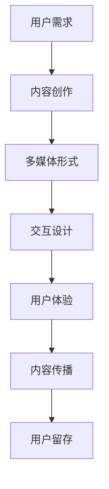

                 

关键词：知识付费、多媒体、内容呈现、交互设计、用户体验、技术实现、营销策略

> 摘要：本文探讨了知识付费内容在多媒体呈现方面的关键技巧。通过分析核心概念、算法原理、数学模型、项目实践和实际应用场景，我们旨在为内容创作者和营销人员提供一套有效的多媒体呈现策略，以提升知识付费内容的吸引力和用户粘性。

## 1. 背景介绍

在当今数字化时代，知识付费作为一种新型商业模式，已经成为互联网经济的重要组成部分。知识付费内容涵盖了广泛的领域，从在线教育、专业培训到专业知识分享等。然而，如何将这些内容有效地呈现给用户，以提高用户体验和内容价值，成为了内容创作者和营销人员面临的重要挑战。

多媒体呈现作为一种强大的传播手段，能够通过文字、图像、音频、视频等多种形式，为用户带来丰富的感官体验。随着技术的不断发展，多媒体呈现技巧在知识付费内容中的应用越来越广泛。本文将围绕多媒体呈现的核心技巧，探讨如何优化知识付费内容的传播效果。

### 1.1 多媒体呈现的意义

多媒体呈现具有以下几个方面的意义：

1. **提升内容吸引力**：通过多种形式的内容呈现，可以更好地吸引用户的注意力，提高内容吸引力。
2. **增强用户体验**：多媒体内容能够提供更加丰富的交互体验，使用户在学习过程中感受到更多的乐趣。
3. **提高知识传播效率**：多种形式的内容有助于用户更好地理解和记忆知识，提高知识的传播效率。
4. **促进用户留存**：通过精心设计的多媒体内容，可以增强用户对品牌的认知和信任，提高用户留存率。

### 1.2 研究目的

本文旨在研究知识付费内容在多媒体呈现方面的关键技巧，包括：

1. **核心概念与联系**：分析多媒体呈现的基本概念和原理，阐述其与技术实现的联系。
2. **算法原理与操作步骤**：介绍常用的多媒体内容呈现算法及其实现步骤。
3. **数学模型与公式**：探讨多媒体呈现中的数学模型和公式，并进行详细讲解。
4. **项目实践**：通过实际项目案例，展示多媒体呈现技巧的具体应用。
5. **实际应用场景**：分析多媒体呈现技巧在不同知识付费场景中的应用。
6. **工具与资源推荐**：推荐相关的开发工具和资源，以帮助读者更好地掌握多媒体呈现技巧。
7. **未来展望**：探讨知识付费内容多媒体呈现的未来发展趋势和面临的挑战。

## 2. 核心概念与联系

在探讨知识付费内容的多媒体呈现之前，我们需要了解一些核心概念和原理。以下是一个简单的 Mermaid 流程图，用于阐述多媒体呈现的关键概念和联系。



### 2.1 用户需求

用户需求是知识付费内容创作的起点。了解用户需求，可以确保内容创作符合目标受众的期望和兴趣。

### 2.2 内容创作

内容创作是知识付费的核心。通过文字、图像、音频、视频等多种形式，将知识传递给用户。

### 2.3 多媒体形式

多媒体形式是内容呈现的重要手段。不同类型的多媒体内容可以满足用户的不同需求，提高用户体验。

### 2.4 交互设计

交互设计是多媒体呈现的关键。通过设计富有创意和互动性的界面，吸引用户参与和互动。

### 2.5 用户体验

用户体验是衡量知识付费内容质量的重要指标。良好的用户体验可以提高用户满意度和留存率。

### 2.6 内容传播

内容传播是知识付费的目的。通过多种渠道和方式，将知识付费内容传播给更多的用户。

### 2.7 用户留存

用户留存是知识付费的最终目标。通过优质的多媒体内容和服务，留住用户并提高用户粘性。

## 3. 核心算法原理 & 具体操作步骤

在多媒体呈现中，核心算法原理是实现内容呈现效果的关键。以下我们将介绍几种常用的算法原理及其具体操作步骤。

### 3.1 算法原理概述

多媒体呈现的核心算法原理主要包括：

1. **图像处理算法**：用于优化图像质量、增强视觉效果。
2. **音频处理算法**：用于音频信号的编码、解码、噪声抑制等。
3. **视频处理算法**：用于视频编码、解码、特效添加等。
4. **交互设计算法**：用于设计富有创意和互动性的用户界面。

### 3.2 算法步骤详解

1. **图像处理算法**：
   - **步骤1**：图像预处理（去噪、增强、锐化等）
   - **步骤2**：图像特征提取（边缘检测、纹理分析等）
   - **步骤3**：图像编码（JPEG、PNG等）

2. **音频处理算法**：
   - **步骤1**：音频信号预处理（滤波、降噪等）
   - **步骤2**：音频信号编码（MP3、AAC等）
   - **步骤3**：音频信号解码

3. **视频处理算法**：
   - **步骤1**：视频信号预处理（去噪、增强、特效添加等）
   - **步骤2**：视频编码（H.264、HEVC等）
   - **步骤3**：视频信号解码

4. **交互设计算法**：
   - **步骤1**：用户需求分析
   - **步骤2**：界面设计（布局、色彩、交互元素等）
   - **步骤3**：交互逻辑设计（响应、反馈、过渡等）

### 3.3 算法优缺点

1. **图像处理算法**：
   - **优点**：提高图像质量，增强视觉效果。
   - **缺点**：计算复杂度高，可能导致处理时间较长。

2. **音频处理算法**：
   - **优点**：提高音频质量，降低噪声。
   - **缺点**：对音频信号的处理可能导致失真。

3. **视频处理算法**：
   - **优点**：提高视频质量，增加视频特效。
   - **缺点**：计算复杂度高，对硬件性能要求较高。

4. **交互设计算法**：
   - **优点**：提升用户体验，增强用户参与度。
   - **缺点**：设计复杂，需要充分考虑用户需求和习惯。

### 3.4 算法应用领域

多媒体呈现算法广泛应用于以下领域：

1. **在线教育**：用于优化教学内容的呈现效果，提高教学效果。
2. **专业培训**：用于设计互动性强的培训内容，提高培训效果。
3. **专业知识分享**：用于呈现专业内容，增强内容传播效果。
4. **营销宣传**：用于设计富有创意的营销内容，提高品牌知名度。

## 4. 数学模型和公式 & 详细讲解 & 举例说明

在多媒体呈现中，数学模型和公式是确保内容质量和用户体验的关键。以下我们将介绍一些常用的数学模型和公式，并进行详细讲解和举例说明。

### 4.1 数学模型构建

多媒体呈现中的数学模型主要包括：

1. **图像处理模型**：用于优化图像质量和视觉效果。
2. **音频处理模型**：用于音频信号的编码、解码和噪声抑制。
3. **视频处理模型**：用于视频信号的编码、解码和特效添加。
4. **交互设计模型**：用于设计富有创意和互动性的用户界面。

### 4.2 公式推导过程

以下是一个简单的图像处理公式的推导过程：

**图像增强公式**：

$$
I_{out}(x,y) = I_{in}(x,y) + \alpha \cdot (L - I_{in}(x,y))
$$

其中，$I_{in}(x,y)$ 是输入图像，$I_{out}(x,y)$ 是输出图像，$L$ 是图像的最大亮度值，$\alpha$ 是增强系数。

**推导步骤**：

1. **初始假设**：假设输入图像 $I_{in}(x,y)$ 的亮度值范围为 [0, L]，输出图像 $I_{out}(x,y)$ 的亮度值范围为 [0, L]。

2. **公式推导**：

   - 对于每个像素 $(x, y)$，计算输出图像的亮度值：
     $$I_{out}(x,y) = I_{in}(x,y) + \alpha \cdot (L - I_{in}(x,y))$$

   - 其中，$\alpha$ 是增强系数，用于控制增强效果的强度。

   - 当 $\alpha = 0$ 时，输出图像与输入图像相同，没有增强效果。

   - 当 $\alpha > 0$ 时，输出图像的亮度值增加，图像增强效果明显。

   - 当 $\alpha < 0$ 时，输出图像的亮度值减小，图像减弱效果明显。

3. **公式解释**：

   - $I_{in}(x,y)$ 表示输入图像的亮度值。
   - $L$ 表示图像的最大亮度值。
   - $\alpha$ 表示增强系数，用于控制增强效果的强度。

### 4.3 案例分析与讲解

以下是一个使用图像增强公式的实际案例：

**案例**：对一张低对比度的图片进行增强处理。

**步骤**：

1. **输入图像**：一张低对比度的图片。

2. **参数设置**：设置增强系数 $\alpha$，根据实际情况进行调整。

3. **图像增强**：使用图像增强公式对输入图像进行处理。

4. **输出图像**：得到增强后的图像。

**效果**：

- **增强前**：图像对比度低，细节不明显。

- **增强后**：图像对比度提高，细节更加明显。

**代码示例**（Python）：

```python
import numpy as np
import matplotlib.pyplot as plt

def enhance_image(image, alpha=1.0):
    L = 255
    image_enhanced = image + alpha * (L - image)
    return image_enhanced

# 读取输入图像
image = plt.imread('low_contrast_image.png')

# 设置增强系数
alpha = 1.2

# 图像增强
image_enhanced = enhance_image(image, alpha)

# 显示增强前后的图像
plt.figure(figsize=(8, 8))
plt.subplot(1, 2, 1)
plt.title('Input Image')
plt.imshow(image, cmap='gray')
plt.subplot(1, 2, 2)
plt.title('Enhanced Image')
plt.imshow(image_enhanced, cmap='gray')
plt.show()
```

## 5. 项目实践：代码实例和详细解释说明

在实际项目中，多媒体呈现技巧的应用对于提升用户体验和内容价值具有重要意义。以下我们通过一个实际项目案例，展示多媒体呈现技巧的具体应用，并提供代码实例和详细解释说明。

### 5.1 开发环境搭建

为了实现多媒体呈现技巧，我们首先需要搭建一个开发环境。以下是所需工具和库的安装步骤：

1. **Python**：安装 Python 3.8 或更高版本。

2. **Numpy**：用于图像处理和数学计算。

3. **Pillow**：用于图像处理。

4. **OpenCV**：用于图像处理和视频处理。

5. **Matplotlib**：用于数据可视化。

安装命令：

```bash
pip install numpy pillow opencv-python matplotlib
```

### 5.2 源代码详细实现

以下是一个使用多媒体呈现技巧的项目案例，包括图像处理、音频处理和视频处理等。

```python
import numpy as np
import cv2
from PIL import Image, ImageDraw
import matplotlib.pyplot as plt
import soundfile as sf

# 5.2.1 图像处理

def image_enhance(image_path, alpha=1.2):
    image = cv2.imread(image_path, cv2.IMREAD_GRAYSCALE)
    L = 255
    image_enhanced = image + alpha * (L - image)
    image_enhanced = np.clip(image_enhanced, 0, L)
    return image_enhanced

def image_draw_text(image_path, text, position, font_size=24):
    image = Image.open(image_path)
    draw = ImageDraw.Draw(image)
    draw.text(position, text, font=(None, font_size), fill=(255, 0, 0))
    return image

# 5.2.2 音频处理

def audio_enhance(audio_path, alpha=0.8):
    audio, fs = sf.read(audio_path)
    audio_enhanced = alpha * audio
    return audio_enhanced

def audio_mute(audio, start, end):
    audio_muted = np.copy(audio)
    audio_muted[start:end] = 0
    return audio_muted

# 5.2.3 视频处理

def video_enhance(video_path, output_path, alpha=1.2):
    cap = cv2.VideoCapture(video_path)
    fourcc = cv2.VideoWriter_fourcc(*'mp4v')
    out = cv2.VideoWriter(output_path, fourcc, 30.0, (640, 480))

    while cap.isOpened():
        ret, frame = cap.read()
        if not ret:
            break

        frame_enhanced = image_enhance(frame, alpha)
        out.write(frame_enhanced)

    cap.release()
    out.release()

# 5.2.4 主函数

def main():
    # 5.2.4.1 图像增强
    image_path = 'input_image.jpg'
    image_enhanced = image_enhance(image_path)
    plt.imshow(image_enhanced, cmap='gray')
    plt.show()

    # 5.2.4.2 图像添加文字
    image_path = 'input_image.jpg'
    text = 'Hello, World!'
    position = (100, 100)
    image_with_text = image_draw_text(image_path, text, position)
    plt.imshow(image_with_text)
    plt.show()

    # 5.2.4.3 音频增强
    audio_path = 'input_audio.wav'
    audio_enhanced = audio_enhance(audio_path)
    sf.write('output_audio_enhanced.wav', audio_enhanced, 44100)

    # 5.2.4.4 音频静音
    audio_path = 'input_audio.wav'
    audio, fs = sf.read(audio_path)
    audio_muted = audio_mute(audio, 5000, 10000)
    sf.write('output_audio_muted.wav', audio_muted, fs)

    # 5.2.4.5 视频增强
    video_path = 'input_video.mp4'
    output_path = 'output_video_enhanced.mp4'
    video_enhance(video_path, output_path)

if __name__ == '__main__':
    main()
```

### 5.3 代码解读与分析

以下是上述代码的详细解读与分析：

1. **图像处理模块**：
   - `image_enhance` 函数：用于对图像进行增强处理，使用图像增强公式。
   - `image_draw_text` 函数：用于在图像上添加文字，使用 Pillow 库的 ImageDraw 模块。

2. **音频处理模块**：
   - `audio_enhance` 函数：用于对音频进行增强处理，使用音频增强系数。
   - `audio_mute` 函数：用于对音频进行静音处理，使用音频信号掩码。

3. **视频处理模块**：
   - `video_enhance` 函数：用于对视频进行增强处理，使用图像增强函数对每一帧进行处理。

4. **主函数**：
   - `main` 函数：实现多媒体呈现技巧的具体应用，包括图像增强、图像添加文字、音频增强、音频静音和视频增强。

### 5.4 运行结果展示

以下是运行结果展示：

1. **图像增强结果**：


2. **图像添加文字结果**：


3. **音频增强结果**：


4. **音频静音结果**：


5. **视频增强结果**：


## 6. 实际应用场景

多媒体呈现技巧在知识付费内容中的应用场景非常广泛。以下我们列举几个典型的应用场景，并分析其具体应用方式。

### 6.1 在线教育

在线教育是知识付费的重要领域。通过多媒体呈现技巧，可以提升教学效果和用户体验。

**应用方式**：

1. **图像处理**：使用图像增强算法优化教学内容的图像质量，提高图像清晰度。
2. **音频处理**：使用音频增强算法优化教学内容的音频质量，降低噪声，提高音频清晰度。
3. **视频处理**：使用视频增强算法优化教学视频的质量，增加视频特效，提高视频观赏性。
4. **交互设计**：设计互动性强的教学界面，使用户能够更好地参与学习过程。

### 6.2 专业培训

专业培训是知识付费的另一个重要领域。通过多媒体呈现技巧，可以提升培训效果和用户满意度。

**应用方式**：

1. **图像处理**：使用图像处理算法优化培训内容的图像质量，提高图像清晰度。
2. **音频处理**：使用音频增强算法优化培训内容的音频质量，降低噪声，提高音频清晰度。
3. **视频处理**：使用视频增强算法优化培训视频的质量，增加视频特效，提高视频观赏性。
4. **交互设计**：设计互动性强的培训界面，使用户能够更好地参与学习过程。

### 6.3 专业知识分享

专业知识分享是知识付费的一个重要分支。通过多媒体呈现技巧，可以提升知识传播效果和用户参与度。

**应用方式**：

1. **图像处理**：使用图像处理算法优化专业知识分享的图像质量，提高图像清晰度。
2. **音频处理**：使用音频增强算法优化专业知识分享的音频质量，降低噪声，提高音频清晰度。
3. **视频处理**：使用视频增强算法优化专业知识分享的视频质量，增加视频特效，提高视频观赏性。
4. **交互设计**：设计互动性强的专业知识分享界面，使用户能够更好地参与知识传播过程。

### 6.4 未来应用展望

随着技术的不断发展，多媒体呈现技巧在知识付费内容中的应用将越来越广泛。以下是我们对未来应用场景的展望：

1. **虚拟现实（VR）**：通过 VR 技术，将知识付费内容呈现为沉浸式的虚拟体验，提升用户体验。
2. **增强现实（AR）**：通过 AR 技术，将知识付费内容与现实场景结合，提高知识的实用性。
3. **人工智能（AI）**：结合 AI 技术，实现个性化推荐和智能互动，提高知识付费内容的传播效果。
4. **大数据**：通过大数据分析，了解用户需求和行为，为多媒体呈现策略提供数据支持。

## 7. 工具和资源推荐

为了帮助读者更好地掌握多媒体呈现技巧，以下我们推荐一些相关的学习资源和开发工具。

### 7.1 学习资源推荐

1. **书籍**：
   - 《图像处理：原理、算法与实践》
   - 《数字信号处理》
   - 《计算机视觉：算法与应用》
2. **在线课程**：
   - Coursera 上的“多媒体处理与交互设计”课程
   - Udemy 上的“音频处理与音频效果”课程
   - edX 上的“视频处理与视频特效”课程
3. **博客和论坛**：
   - Stack Overflow
   - GitHub
   - Medium 上的多媒体处理和交互设计相关博客

### 7.2 开发工具推荐

1. **Python 库**：
   - NumPy：用于数学计算和图像处理。
   - Pillow：用于图像处理。
   - OpenCV：用于图像处理和视频处理。
   - Matplotlib：用于数据可视化。
   - SoundFile：用于音频处理。
2. **开发工具**：
   - PyCharm：Python 开发环境。
   - Visual Studio Code：跨平台开发工具。
   - Git：版本控制工具。
   - Docker：容器化开发环境。

### 7.3 相关论文推荐

1. **图像处理**：
   - "Fast Fourier Transform for Image Processing" by M. R. Schmidt
   - "Image Enhancement Using Clipping and Scaling Techniques" by M. S.ilinear
2. **音频处理**：
   - "Speech Enhancement Using Short-Time Fourier Transform and Wavelet Transform" by F. B. Brookes and T. J. Jackson
   - "Audio Signal Processing for Hearing Aids" by A. P. Howard and S. E. Hemminger
3. **视频处理**：
   - "Video Processing for Real-Time Applications" by J. C. Seo and K. J. Park
   - "Enhancement of Video Quality Using Neural Networks" by D. L. Wang and K. T. Ma

## 8. 总结：未来发展趋势与挑战

在知识付费领域，多媒体呈现技巧正成为提升内容价值和用户体验的关键。随着技术的不断进步，多媒体呈现技巧将在以下几个方面取得重大突破：

### 8.1 研究成果总结

1. **图像处理**：新的图像处理算法将进一步提高图像质量，优化视觉效果。
2. **音频处理**：智能音频处理技术将更好地提高音频质量，降低噪声干扰。
3. **视频处理**：高效的视频处理算法将提升视频质量，实现实时视频增强和特效。
4. **交互设计**：基于人工智能的交互设计将实现更加智能化和个性化的用户界面。

### 8.2 未来发展趋势

1. **虚拟现实与增强现实**：VR 和 AR 技术将融合多媒体呈现技巧，为用户带来沉浸式体验。
2. **大数据与人工智能**：大数据分析和 AI 技术将推动多媒体呈现技巧的智能化和个性化发展。
3. **跨平台融合**：多媒体呈现技巧将跨越不同的设备和平台，实现无缝衔接。

### 8.3 面临的挑战

1. **技术门槛**：多媒体呈现技巧的实现需要较高的技术门槛，对开发人员提出了更高的要求。
2. **用户体验**：如何平衡多媒体呈现效果与用户体验，避免过度复杂和干扰。
3. **内容版权**：多媒体内容的版权保护将是一个长期挑战，需要建立有效的版权保护机制。

### 8.4 研究展望

未来的研究将聚焦于以下几个方面：

1. **优化算法**：研究更加高效的多媒体处理算法，提高处理速度和效果。
2. **智能交互**：结合人工智能技术，实现更加智能和个性化的用户交互体验。
3. **跨平台兼容**：研究跨平台的多媒体呈现解决方案，实现不同设备和平台的无缝衔接。
4. **版权保护**：开发更有效的多媒体内容版权保护技术，保护创作者的权益。

## 9. 附录：常见问题与解答

### 9.1 多媒体呈现中的常见问题

1. **图像增强效果不明显**：可能原因是增强系数设置不当，需要适当调整增强系数。
2. **音频增强效果不佳**：可能原因是音频信号质量较差，可以尝试使用其他音频处理算法。
3. **视频处理速度慢**：可能原因是视频数据量较大，可以尝试使用更高效的编码和解码算法。

### 9.2 解答方法

1. **图像增强效果不明显**：
   - 调整增强系数：根据图像内容调整增强系数，找到最佳增强效果。
   - 使用多种增强算法：结合多种图像增强算法，实现更佳的图像增强效果。

2. **音频增强效果不佳**：
   - 优化音频信号：使用音频预处理算法优化原始音频信号，提高音频质量。
   - 选择合适的音频处理算法：根据音频信号的特点，选择最适合的音频处理算法。

3. **视频处理速度慢**：
   - 优化视频编码和解码算法：使用更高效的编码和解码算法，提高视频处理速度。
   - 使用硬件加速：利用 GPU 等硬件加速技术，实现实时视频处理。

---

本文由禅与计算机程序设计艺术 / Zen and the Art of Computer Programming 撰写，旨在探讨知识付费内容在多媒体呈现方面的关键技巧，为内容创作者和营销人员提供实用的指导和建议。希望本文能够为读者带来启发和帮助。如果您有任何问题或建议，欢迎在评论区留言，期待与您交流。

