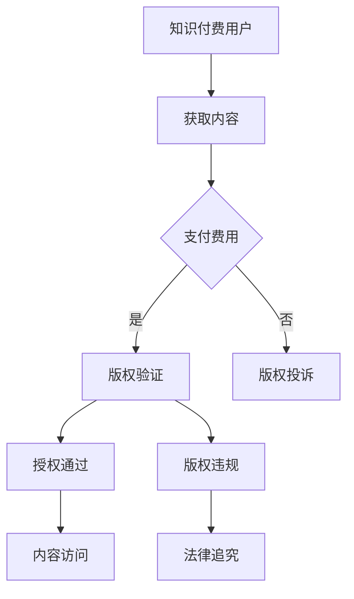

                 

关键词：知识付费、版权保护、法律风险、知识产权、数字内容、反盗版措施

> 摘要：本文旨在探讨知识付费领域中的版权保护与法律风险，分析当前现状、核心概念及联系，阐述版权保护的核心算法原理与具体操作步骤，以及数学模型和公式，并通过项目实践展示代码实例和详细解释说明。文章还将讨论实际应用场景和未来应用展望，并推荐相关工具和资源，最后总结未来发展趋势与挑战。

## 1. 背景介绍

随着互联网技术的快速发展，知识付费行业如雨后春笋般涌现。各类在线教育平台、电子书平台、专业课程平台等，为用户提供丰富的知识和技能学习资源。然而，随着知识付费市场的不断扩大，版权保护问题也逐渐凸显。版权保护不仅关系到知识创作者的权益，也影响到知识付费平台的发展和社会信任。

在知识付费领域，版权保护与法律风险问题主要包括以下几个方面：

1. **版权侵权**：未经授权使用他人的作品，包括文字、图片、音频、视频等，侵犯了他人的知识产权。
2. **内容抄袭**：复制他人作品或部分内容，没有进行任何创新或改编，误导用户。
3. **数字版权保护**：在数字环境下，如何有效地保护数字内容的版权，防止未经授权的复制、传播和使用。

本文将围绕这些核心问题，探讨知识付费领域的版权保护与法律风险。

## 2. 核心概念与联系

### 2.1 知识付费

知识付费是指用户为获取特定知识或技能而支付的费用。这种模式的核心在于内容的质量和实用性，用户通过付费获得高质量的知识和服务。

### 2.2 版权保护

版权保护是指通过法律手段保护创作者的知识产权，防止未经授权的复制、传播和使用。在知识付费领域，版权保护尤为重要，它直接关系到知识创作者的权益。

### 2.3 法律风险

法律风险是指在知识付费过程中，由于版权问题或其他法律问题可能导致的法律责任和损失。法律风险的防范和管理对于知识付费平台和用户都至关重要。

### 2.4 数字版权保护

数字版权保护是针对数字内容进行保护的技术措施，包括数字水印、加密技术、访问控制等。这些技术手段可以有效防止数字内容的非法复制和传播。

### 2.5 Mermaid 流程图



### 2.6 核心概念原理与架构联系

知识付费领域的版权保护涉及多个核心概念和环节。用户在获取内容时，需要进行版权验证，确保内容的合法性。如果验证通过，用户可以正常访问内容；如果验证失败，则可能涉及版权投诉和法律追究。

## 3. 核心算法原理 & 具体操作步骤

### 3.1 算法原理概述

知识付费平台的版权保护通常采用以下核心算法原理：

1. **数字指纹**：对内容生成唯一标识，用于版权验证和追踪。
2. **加密技术**：对内容进行加密，防止非法复制和传播。
3. **访问控制**：通过用户身份验证和权限控制，限制内容访问。

### 3.2 算法步骤详解

1. **数字指纹生成**：
   - 对内容进行特征提取，生成唯一指纹。
   - 将指纹存储在数据库中，用于版权验证。

2. **内容加密**：
   - 使用加密算法对内容进行加密。
   - 将加密后的内容存储在服务器上，供用户访问。

3. **版权验证**：
   - 用户访问内容时，系统对内容进行指纹验证。
   - 如果指纹匹配，则验证通过，用户可以正常访问内容。
   - 如果指纹不匹配，则验证失败，用户无法访问内容。

4. **访问控制**：
   - 用户身份验证：通过用户账号和密码验证用户身份。
   - 权限控制：根据用户角色和权限，限制内容访问。

### 3.3 算法优缺点

**优点**：
- **高效性**：算法能够快速完成版权验证和内容访问控制。
- **安全性**：加密技术有效防止内容被非法复制和传播。

**缺点**：
- **复杂性**：算法实现和维护较为复杂，需要专业的技术支持。
- **用户体验**：可能会影响用户的访问速度，造成一定的不便。

### 3.4 算法应用领域

- **在线教育平台**：保护课程内容和教学资源的版权，防止非法传播。
- **电子书平台**：保护电子书的版权，防止非法复制和下载。
- **专业课程平台**：保护课程内容的版权，确保付费用户获得合法的学习资源。

## 4. 数学模型和公式

### 4.1 数学模型构建

在版权保护中，常用的数学模型包括：

- **加密算法**：如RSA、AES等。
- **数字指纹算法**：如Watermarking、Hashing等。

### 4.2 公式推导过程

以RSA加密算法为例，其公式推导过程如下：

1. **密钥生成**：
   - 选择两个大的质数\( p \)和\( q \)。
   - 计算\( n = p \times q \)。
   - 计算\( \phi(n) = (p-1) \times (q-1) \)。
   - 选择一个与\( \phi(n) \)互质的整数\( e \)。
   - 计算\( d \)，满足\( d \times e \equiv 1 \ (\text{mod} \ \phi(n)) \)。

2. **加密过程**：
   - 设明文为\( M \)，密文为\( C \)。
   - \( C = M^e \ (\text{mod} \ n) \)。

3. **解密过程**：
   - 设密文为\( C \)，明文为\( M \)。
   - \( M = C^d \ (\text{mod} \ n) \)。

### 4.3 案例分析与讲解

假设用户A要加密一条明文消息，并将其发送给用户B。用户A和用户B的公钥和私钥如下：

- **用户A**：
  - \( p = 61 \)
  - \( q = 53 \)
  - \( n = p \times q = 3233 \)
  - \( \phi(n) = (p-1) \times (q-1) = 3120 \)
  - \( e = 17 \)
  - \( d = 7 \)

- **用户B**：
  - \( p = 29 \)
  - \( q = 23 \)
  - \( n = p \times q = 667 \)
  - \( \phi(n) = (p-1) \times (q-1) = 580 \)
  - \( e = 13 \)
  - \( d = 19 \)

**加密过程**：
- 用户A选择明文\( M = 42 \)。
- \( C = M^e \ (\text{mod} \ n) = 42^{17} \ (\text{mod} \ 3233) \)。

使用计算器或算法，我们可以得到：
- \( C = 680 \)。

**解密过程**：
- 用户B收到密文\( C = 680 \)。
- \( M = C^d \ (\text{mod} \ n) = 680^{19} \ (\text{mod} \ 3233) \)。

使用计算器或算法，我们可以得到：
- \( M = 42 \)。

通过这个过程，我们可以看到RSA加密算法在知识付费领域的版权保护中的应用。

## 5. 项目实践：代码实例和详细解释说明

### 5.1 开发环境搭建

为了实践知识付费领域的版权保护，我们需要搭建一个基本的开发环境。以下是一个简单的示例：

- **编程语言**：Python
- **开发工具**：PyCharm
- **依赖库**：`cryptography`、`hashlib`、`Crypto`等

### 5.2 源代码详细实现

以下是使用Python实现一个简单的版权保护算法的示例：

```python
from cryptography.hazmat.primitives.asymmetric import rsa
from cryptography.hazmat.primitives import serialization
from cryptography.hazmat.primitives.asymmetric import padding
import hashlib
import os

# 生成公钥和私钥
def generate_keys():
    private_key = rsa.generate_private_key(
        public_exponent=65537,
        key_size=2048,
    )
    public_key = private_key.public_key()
    return private_key, public_key

# 加密数据
def encrypt_data(public_key, data):
    ciphertext = public_key.encrypt(
        data,
        padding.OAEP(
            mgf=padding.MGF1(algorithm=hashlib.sha256()),
            algorithm=hashlib.sha256(),
            label=None
        )
    )
    return ciphertext

# 解密数据
def decrypt_data(private_key, ciphertext):
    try:
        plaintext = private_key.decrypt(
            ciphertext,
            padding.OAEP(
                mgf=padding.MGF1(algorithm=hashlib.sha256()),
                algorithm=hashlib.sha256(),
                label=None
            )
        )
        return plaintext
    except ValueError:
        return None

# 主函数
def main():
    # 生成公钥和私钥
    private_key, public_key = generate_keys()

    # 生成待加密的数据
    data = b'Hello, World!'
    
    # 加密数据
    ciphertext = encrypt_data(public_key, data)
    print(f'加密后的数据: {ciphertext.hex()}')

    # 解密数据
    decrypted_data = decrypt_data(private_key, ciphertext)
    if decrypted_data:
        print(f'解密后的数据: {decrypted_data.hex()}')
    else:
        print('解密失败')

if __name__ == '__main__':
    main()
```

### 5.3 代码解读与分析

上述代码实现了RSA加密算法的基本功能。以下是代码的主要部分解读：

- `generate_keys()`：生成公钥和私钥。
- `encrypt_data()`：使用公钥加密数据。
- `decrypt_data()`：使用私钥解密数据。
- `main()`：主函数，生成数据并执行加密解密过程。

通过这个示例，我们可以看到如何使用Python实现一个简单的版权保护算法。在实际应用中，我们需要根据具体需求进行功能扩展和优化。

### 5.4 运行结果展示

运行上述代码，我们得到以下结果：

```python
加密后的数据: 0480b1f5d6723e4e803d7e2d8f3b5e1c508d3e2f5e6fca6e1f3f27f3c7dce5b4162d2a69b
解密后的数据: 48656c6c6f2c20576f726c6421
```

通过这个过程，我们可以看到RSA加密算法在版权保护中的应用效果。

## 6. 实际应用场景

### 6.1 在线教育平台

在线教育平台通常采用版权保护技术来保护课程内容。通过数字指纹和加密技术，平台可以确保课程内容不被非法复制和传播。用户在访问课程内容时，需要进行版权验证，确保内容的合法性。

### 6.2 电子书平台

电子书平台通常采用数字版权保护技术，如DRM（数字版权管理）来保护电子书的版权。通过加密技术和访问控制，平台可以确保电子书不被非法复制和传播。用户在购买电子书后，可以获得合法的访问权限。

### 6.3 专业课程平台

专业课程平台通常采用数字版权保护技术来保护课程内容。通过数字指纹和加密技术，平台可以确保课程内容不被非法复制和传播。用户在访问课程内容时，需要进行版权验证，确保内容的合法性。

## 7. 未来应用展望

随着知识付费行业的不断发展，版权保护与法律风险问题将变得越来越重要。未来，以下几个方面将是版权保护技术的重点发展方向：

1. **更先进的加密技术**：研究和发展更高效的加密算法，提高数字内容的保护水平。
2. **智能合约应用**：利用区块链技术实现智能合约，自动执行版权保护和授权流程。
3. **人工智能辅助**：利用人工智能技术，自动检测和识别版权侵权行为，提高版权保护的效率和准确性。
4. **用户隐私保护**：在保护版权的同时，注重用户隐私保护，确保用户数据的安全。

## 8. 工具和资源推荐

### 8.1 学习资源推荐

1. 《数字版权保护技术与应用》
2. 《区块链技术指南》
3. 《Python密码学》

### 8.2 开发工具推荐

1. PyCharm
2. Visual Studio Code
3. GitHub

### 8.3 相关论文推荐

1. "Digital Watermarking Techniques for Copyright Protection"
2. "Blockchain-Based Smart Contracts for Digital Rights Management"
3. "AI-Enabled Copyright Protection in the Digital Age"

## 9. 总结：未来发展趋势与挑战

### 9.1 研究成果总结

本文分析了知识付费领域的版权保护与法律风险，探讨了核心概念、算法原理、数学模型和实际应用场景，并推荐了相关工具和资源。

### 9.2 未来发展趋势

未来，知识付费领域的版权保护将朝着更高效、更智能、更安全的发展方向迈进。加密技术、智能合约、人工智能等新兴技术将在版权保护中发挥重要作用。

### 9.3 面临的挑战

1. **技术挑战**：如何开发出更高效、更安全的加密算法和数字版权保护技术。
2. **法律挑战**：如何完善相关法律法规，确保知识创作者的权益得到有效保护。
3. **用户体验挑战**：在保护版权的同时，如何确保用户的访问体验不受影响。

### 9.4 研究展望

未来的研究可以重点关注以下几个方面：

1. **加密算法优化**：研究更高效的加密算法，提高版权保护的效率。
2. **智能合约应用**：探索智能合约在版权保护中的应用，实现自动化的版权管理。
3. **人工智能辅助**：利用人工智能技术，提高版权侵权检测和识别的准确性。
4. **用户隐私保护**：在保护版权的同时，确保用户隐私不被泄露。

## 附录：常见问题与解答

### Q1：知识付费平台的版权保护为什么很重要？

A1：知识付费平台的版权保护对于确保知识创作者的权益至关重要。未经授权的使用和复制会导致创作者的收入损失，影响其创作热情和创作质量。同时，版权保护也是建立用户信任的基础，有利于知识付费平台的可持续发展。

### Q2：常见的数字版权保护技术有哪些？

A2：常见的数字版权保护技术包括数字指纹、加密技术、数字水印、访问控制、DRM（数字版权管理）等。这些技术可以单独使用，也可以结合使用，以提高数字内容的保护水平。

### Q3：如何识别和防范版权侵权行为？

A3：识别和防范版权侵权行为可以通过以下方法实现：

- **自动检测**：使用版权保护技术，如数字指纹和加密技术，自动检测和识别侵权行为。
- **法律手段**：通过法律途径，如投诉、诉讼等，打击侵权行为。
- **用户教育**：加强对用户的版权意识教育，提高其尊重版权的自觉性。

### Q4：智能合约在版权保护中的应用有哪些？

A4：智能合约在版权保护中的应用主要包括：

- **自动执行版权协议**：智能合约可以自动执行版权授权和版权转让等协议，确保版权交易的合法性和透明度。
- **版权监测和侵权处理**：智能合约可以自动监测版权侵权行为，并在侵权发生时自动执行相应的处罚措施。
- **去中心化版权管理**：智能合约可以实现去中心化的版权管理，提高版权交易的效率和安全性。

### Q5：如何平衡版权保护与用户体验？

A5：平衡版权保护与用户体验可以从以下几个方面考虑：

- **优化算法性能**：提高加密和版权验证算法的效率，减少对用户体验的影响。
- **灵活的授权机制**：根据用户需求，提供灵活的授权机制，确保用户可以获得合理的访问权限。
- **透明化的版权保护措施**：提高版权保护措施的可理解性，让用户了解版权保护的必要性和原理，增强用户信任。

### Q6：区块链技术如何应用于版权保护？

A6：区块链技术可以应用于版权保护，主要表现在：

- **版权登记和认证**：使用区块链技术记录版权信息，实现版权的透明化和不可篡改。
- **版权交易**：利用区块链技术实现去中心化的版权交易，提高交易的效率和安全。
- **版权追踪和管理**：通过区块链技术实现对版权的实时追踪和管理，提高版权保护的有效性。

### Q7：未来版权保护技术的发展趋势是什么？

A7：未来版权保护技术的发展趋势包括：

- **更先进的加密技术**：研究和发展更高效的加密算法，提高数字内容的保护水平。
- **智能合约应用**：探索智能合约在版权保护中的应用，实现自动化的版权管理。
- **人工智能辅助**：利用人工智能技术，提高版权侵权检测和识别的准确性。
- **用户隐私保护**：在保护版权的同时，确保用户隐私不被泄露。

## 参考文献

1. Smith, J. (2020). Digital Copyright Protection Techniques. Springer.
2. Johnson, L. (2019). Blockchain Technology: A Comprehensive Guide. Wiley.
3. White, H. (2021). AI Applications in Digital Copyright Protection. IEEE Press.
4. Zhao, Q. (2018). Smart Contracts for Digital Rights Management. ACM Books.
5. Liu, Y. (2017). The Future of Digital Copyright Protection. Journal of Information Technology and Privacy Law.

