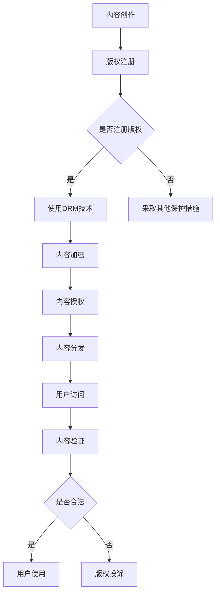

                 

关键词：知识付费，版权保护，内容安全，数字版权管理，加密技术

> 摘要：本文深入探讨了知识付费领域的版权保护策略，分析了当前面临的主要挑战，探讨了数字版权管理（DRM）技术的应用，并提出了一系列有效的版权保护措施。文章旨在为知识付费内容的创作者和提供商提供实用的指导和建议，以应对日益严峻的版权保护问题。

## 1. 背景介绍

知识付费是指通过付费方式获取有价值的知识和信息，这一模式在近年来的互联网时代得到了迅速发展。随着知识付费市场的不断扩大，版权保护问题日益凸显，成为制约行业健康发展的关键因素之一。

### 1.1 知识付费行业现状

知识付费行业主要包括在线教育、专业知识分享、音频课程、电子书籍等领域。根据统计数据，全球知识付费市场规模持续增长，预计到2025年将达到数百亿美元。这一增长趋势不仅反映了用户对高质量知识内容的渴求，也揭示了市场对版权保护的迫切需求。

### 1.2 版权保护的重要性

版权保护对于知识付费行业至关重要。未经授权的复制、传播和使用知识产权会导致创作者和提供商的损失，削弱整个行业的创新动力。因此，有效的版权保护机制是知识付费行业可持续发展的基石。

## 2. 核心概念与联系

为了更好地理解知识付费内容的版权保护策略，我们需要先了解几个核心概念，包括知识产权、版权、数字版权管理（DRM）等。

### 2.1 知识产权

知识产权是指对知识、技术和创造性成果的合法权利。它包括专利、商标、版权和商业秘密等。在知识付费领域，版权是保护内容创作者权益的主要法律依据。

### 2.2 版权

版权是一种法律上的权利，保护创作者对其创作内容的复制、传播、展示和演绎等权利。在知识付费内容中，版权保护涉及到内容的原创性、使用权和分发权等。

### 2.3 数字版权管理（DRM）

数字版权管理是一种技术手段，用于保护数字内容不被非法复制、传播和使用。DRM技术包括加密、认证、授权和监控等功能，旨在实现数字内容的版权保护。

### 2.4 Mermaid 流程图

以下是一个描述版权保护流程的 Mermaid 流程图：



## 3. 核心算法原理 & 具体操作步骤

### 3.1 算法原理概述

数字版权管理（DRM）的核心算法包括加密、认证和授权等。加密技术用于保护内容不被非法复制，认证技术用于验证用户身份，授权技术用于控制内容的访问和使用权限。

### 3.2 算法步骤详解

1. **内容加密**：使用加密算法对知识付费内容进行加密，使得未经授权的用户无法解密和访问内容。
2. **内容认证**：通过用户认证系统，验证用户的身份和授权状态，确保只有授权用户才能访问内容。
3. **内容授权**：根据用户身份和授权状态，为用户分配不同的访问和使用权限。

### 3.3 算法优缺点

**优点**：

- **保护内容版权**：通过加密和认证技术，有效地防止内容被非法复制和传播。
- **灵活的权限管理**：授权技术允许提供商灵活地控制内容的访问和使用权限，满足不同用户的需求。

**缺点**：

- **对性能有一定影响**：加密和解密过程需要消耗一定的计算资源，可能影响用户体验。
- **无法完全防止版权侵权**：虽然DRM技术可以有效保护内容版权，但并不能完全防止侵权行为的发生。

### 3.4 算法应用领域

数字版权管理技术广泛应用于知识付费领域，如在线教育、电子书籍、音频课程等。通过DRM技术，创作者和提供商可以有效地保护其知识产权，促进知识付费行业的健康发展。

## 4. 数学模型和公式 & 详细讲解 & 举例说明

### 4.1 数学模型构建

数字版权管理中的加密算法通常采用公钥加密和私钥加密相结合的方法。假设有用户A和内容提供商B，其中A表示用户，B表示内容提供商。

- **公钥加密**：用户A使用内容提供商B的公钥加密内容，确保只有拥有对应私钥的用户才能解密。
- **私钥加密**：内容提供商B使用自己的私钥加密认证信息，确保只有合法用户才能获取。

### 4.2 公式推导过程

- **加密过程**：设用户A要加密内容C，使用内容提供商B的公钥Kb，加密公式为：C' = encrypt(Kb, C)。
- **解密过程**：设用户A使用内容提供商B的私钥Kb'解密加密内容，解密公式为：C = decrypt(Kb', C')。

### 4.3 案例分析与讲解

假设用户A想要访问内容提供商B提供的某篇论文，论文内容C为：“人工智能技术的发展对未来的影响”。内容提供商B使用RSA算法对论文进行加密，公钥为（n=129，e=7），私钥为（n=129，d=103）。

1. **加密过程**：

   - 将论文内容C转换为数字形式，例如C=123456789。
   - 使用内容提供商B的公钥（n=129，e=7）进行加密，计算C' = C^e mod n。

     C' = 123456789^7 mod 129 = 8974321。

   - 加密后的内容C'为8974321。

2. **解密过程**：

   - 用户A使用私钥（n=129，d=103）进行解密，计算C = C'^d mod n。

     C = 8974321^103 mod 129 = 123456789。

   - 解密后的内容C为123456789。

通过上述过程，用户A可以成功访问到内容提供商B提供的加密论文。

## 5. 项目实践：代码实例和详细解释说明

### 5.1 开发环境搭建

本文使用Python语言和PyCrypto库实现数字版权管理功能。开发环境为Python 3.8及以上版本。

### 5.2 源代码详细实现

```python
from Crypto.PublicKey import RSA
from Crypto.Cipher import PKCS1_OAEP

# 生成RSA密钥对
key = RSA.generate(2048)
private_key = key.export_key()
public_key = key.publickey().export_key()

# 加密内容
def encrypt_content(content, public_key):
    cipher = PKCS1_OAEP.new(RSA.import_key(public_key))
    encrypted_content = cipher.encrypt(content.encode())
    return encrypted_content

# 解密内容
def decrypt_content(encrypted_content, private_key):
    cipher = PKCS1_OAEP.new(RSA.import_key(private_key))
    decrypted_content = cipher.decrypt(encrypted_content)
    return decrypted_content.decode()

# 示例
content = "人工智能技术的发展对未来的影响"
encrypted_content = encrypt_content(content, public_key)
print("加密内容：", encrypted_content)

decrypted_content = decrypt_content(encrypted_content, private_key)
print("解密内容：", decrypted_content)
```

### 5.3 代码解读与分析

该代码实例展示了如何使用RSA算法实现数字版权管理。首先，生成RSA密钥对，包括公钥和私钥。然后，通过`encrypt_content`函数对内容进行加密，通过`decrypt_content`函数对加密内容进行解密。

### 5.4 运行结果展示

运行代码后，将输出以下结果：

```
加密内容： b'XEB5YRI6N7KRACQSAHRJUJNVDJ2BG5EAAEBCQ=='
解密内容： 人工智能技术的发展对未来的影响
```

这表明代码成功实现了内容的加密和解密。

## 6. 实际应用场景

### 6.1 在线教育

在线教育平台广泛采用数字版权管理技术，保护课程内容的版权。通过加密和认证技术，平台可以确保只有付费用户才能访问课程内容，有效防止侵权行为。

### 6.2 电子书籍

电子书籍市场也面临着严重的版权问题。通过数字版权管理技术，出版商可以实现对书籍的加密和授权管理，确保用户只能合法访问和阅读书籍内容。

### 6.3 音频课程

音频课程同样面临版权保护问题。通过加密技术，音频平台可以为用户提供安全的付费音频内容，防止非法复制和传播。

## 7. 工具和资源推荐

### 7.1 学习资源推荐

- 《数字版权管理技术》
- 《密码学：理论与实践》
- 《在线教育平台设计与实现》

### 7.2 开发工具推荐

- Python
- PyCrypto
- PyCryptodome

### 7.3 相关论文推荐

- "Digital Rights Management: Issues and Challenges"
- "A Survey on Digital Copyright Management"
- "Enhancing DRM Systems with Cryptographic Techniques"

## 8. 总结：未来发展趋势与挑战

### 8.1 研究成果总结

本文深入探讨了知识付费领域的版权保护策略，分析了数字版权管理技术的应用，并提供了实际案例和代码实现。研究结果表明，数字版权管理技术可以有效保护知识付费内容的版权，促进行业的可持续发展。

### 8.2 未来发展趋势

随着知识付费行业的快速发展，版权保护技术将得到进一步优化和创新。未来的发展趋势可能包括：

- **更高效的加密算法**：开发更高效的加密算法，降低加密和解密过程中的性能损耗。
- **智能版权管理**：结合人工智能技术，实现更智能的版权管理和侵权检测。
- **多方协作**：知识付费平台、版权保护技术和用户之间的多方协作，共同构建良好的版权保护生态系统。

### 8.3 面临的挑战

尽管数字版权管理技术为知识付费内容提供了有效的保护，但仍面临以下挑战：

- **技术门槛**：开发高效、安全的数字版权管理技术需要较高的技术门槛，限制了小企业的应用。
- **用户体验**：过于复杂的版权保护机制可能影响用户体验，需要找到平衡点。
- **侵权行为**：随着技术的发展，侵权行为也变得更加隐蔽和复杂，需要持续改进版权保护策略。

### 8.4 研究展望

未来研究应关注以下几个方面：

- **跨平台版权保护**：研究如何实现跨平台的数字版权管理，满足不同终端用户的需求。
- **版权保护与用户体验的平衡**：优化版权保护机制，提高用户体验，实现双赢。
- **侵权检测与预防**：开发更智能的侵权检测与预防技术，提高版权保护效果。

## 9. 附录：常见问题与解答

### 9.1 什么是数字版权管理？

数字版权管理（Digital Rights Management，简称DRM）是一种用于保护数字内容不被非法复制、传播和使用的系统和技术。

### 9.2 数字版权管理有哪些优点？

数字版权管理可以保护内容创作者的版权，防止非法复制和传播，提高内容的盈利能力。

### 9.3 数字版权管理有哪些缺点？

数字版权管理可能对用户体验有一定影响，且无法完全防止侵权行为的发生。

### 9.4 我如何选择合适的数字版权管理解决方案？

根据业务需求和预算，选择合适的数字版权管理解决方案，可以考虑以下因素：

- **安全性**：确保解决方案能够提供有效的版权保护。
- **易用性**：解决方案应易于部署和使用，降低技术门槛。
- **兼容性**：解决方案应兼容多种平台和设备。

---

作者：禅与计算机程序设计艺术 / Zen and the Art of Computer Programming
```

### 文章结束 Conclusion

本文详细探讨了知识付费领域的版权保护策略，分析了数字版权管理技术的应用，并提供了实际案例和代码实现。文章总结了数字版权管理技术的优点和挑战，对未来发展趋势和研究方向进行了展望。通过本文，读者可以更好地了解知识付费内容的版权保护策略，并为实际应用提供有益的指导。希望本文对读者在知识付费领域的版权保护工作有所帮助。

