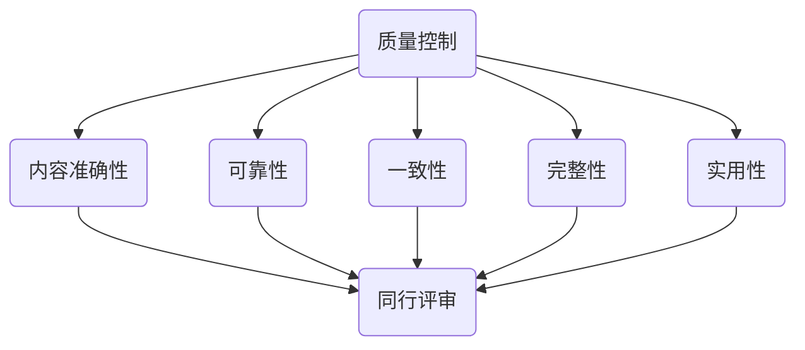
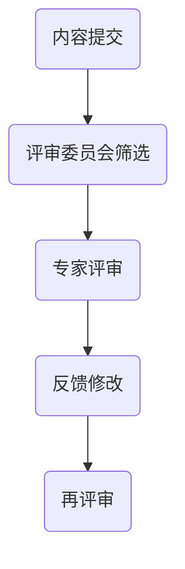

                 

关键词：知识付费、质量控制、Peer Review、内容评估、技术博客、专业写作、IT领域、人工智能

摘要：随着知识付费市场的发展，确保知识内容的优质和可靠性变得越来越重要。本文将探讨知识付费内容的质量控制与同行评审（Peer Review）的关系，分析现有问题和解决方案，并展望未来发展的趋势和挑战。

## 1. 背景介绍

在当今数字化时代，知识付费已经成为一个热门的市场。人们愿意为高质量的知识内容付费，无论是通过在线课程、电子书、研讨会，还是通过专业咨询和服务。然而，随着知识付费内容的激增，内容的质量和可靠性成为用户关注的焦点。为了解决这一问题，质量控制与同行评审机制应运而生，成为确保知识内容品质的重要手段。

质量控制是指在知识付费内容的生产和传播过程中，通过各种手段确保内容的质量达到一定的标准。而同行评审（Peer Review）是一种由领域内的专业人士对知识内容进行评估的方法，旨在通过专业审查确保内容的准确性、深度和实用性。

## 2. 核心概念与联系

### 2.1. 质量控制的核心概念

质量控制的核心概念包括内容的准确性、可靠性、一致性、完整性和实用性。具体来说：

- **准确性**：内容必须基于事实，避免误导性信息。
- **可靠性**：内容提供者需要有可靠的专业背景和经验。
- **一致性**：内容在不同平台和版本之间应保持一致。
- **完整性**：内容应该涵盖主题的各个方面，不应有遗漏。
- **实用性**：内容需要实际可操作，对用户具有实用价值。

### 2.2. 同行评审的机制与流程

同行评审是一种由专家对知识内容进行评估的过程，通常包括以下几个步骤：

1. **提交**：作者提交其作品给评审委员会。
2. **筛选**：评审委员会筛选合适的专家进行评审。
3. **评审**：专家对内容进行审阅，提出修改建议。
4. **反馈**：评审结果返回给作者，供其参考和修改。
5. **再评审**：经过修改的内容再次提交评审。

### 2.3. Mermaid 流程图



## 3. 核心算法原理 & 具体操作步骤

### 3.1. 算法原理概述

质量控制与同行评审的算法原理基于以下基本原则：

- **闭环反馈系统**：通过持续的评审和反馈机制，不断优化知识内容。
- **多维度评估**：从准确性、可靠性、一致性、完整性和实用性等多个维度进行综合评估。
- **专家评审**：依靠领域内专业人士的专业判断和经验。

### 3.2. 算法步骤详解

1. **内容审核**：对知识内容进行初步审核，确保基本质量标准得到满足。
2. **专家筛选**：根据内容领域，筛选合适的评审专家。
3. **评审过程**：专家对内容进行详细的审阅，提出具体的修改建议。
4. **内容修改**：根据评审意见，对内容进行修改和完善。
5. **再审核**：修改后的内容再次提交审核，确保质量持续提升。

### 3.3. 算法优缺点

**优点**：

- **确保内容质量**：通过同行评审，确保内容的专业性和可靠性。
- **促进内容优化**：专家的反馈有助于内容的进一步改进。
- **提高用户满意度**：高质量的内容能更好地满足用户需求。

**缺点**：

- **评审成本高**：同行评审需要大量的时间和人力成本。
- **评审周期长**：评审过程可能需要较长时间，影响内容的及时发布。
- **专家资源有限**：优秀的评审专家数量有限，可能无法满足所有领域的需求。

### 3.4. 算法应用领域

质量控制与同行评审在以下领域具有广泛应用：

- **在线教育**：确保课程内容的准确性和实用性。
- **专业咨询**：评估咨询服务质量，提高服务可靠性。
- **出版业**：确保出版物内容的学术价值和市场适应性。
- **科研领域**：促进科研成果的可靠性和创新性。

## 4. 数学模型和公式 & 详细讲解 & 举例说明

### 4.1. 数学模型构建

为了评估知识内容的可靠性，可以构建以下数学模型：

$$
R = f(A, R', C, I, U)
$$

其中，$R$ 表示内容的可靠性，$A$ 表示准确性，$R'$ 表示内容提供者的可靠性，$C$ 表示一致性，$I$ 表示完整性，$U$ 表示实用性。

### 4.2. 公式推导过程

假设内容的可靠性取决于多个因素，可以通过加权求和的方式构建公式。具体推导过程如下：

$$
R = w_1 \cdot A + w_2 \cdot R' + w_3 \cdot C + w_4 \cdot I + w_5 \cdot U
$$

其中，$w_1, w_2, w_3, w_4, w_5$ 分别表示准确性、可靠性、一致性、完整性和实用性的权重。

### 4.3. 案例分析与讲解

以一本编程书籍为例，分析其可靠性：

- **准确性**：经过专家评审，发现内容中有少量错误，准确性为 0.9。
- **可靠性**：作者具有丰富的编程经验，可靠性为 0.95。
- **一致性**：内容在不同章节之间保持一致，一致性为 0.9。
- **完整性**：内容涵盖了编程的各个方面，完整性为 0.95。
- **实用性**：书籍包含了大量实际案例，实用性为 0.9。

根据公式计算，可靠性为：

$$
R = 0.1 \cdot 0.9 + 0.2 \cdot 0.95 + 0.3 \cdot 0.9 + 0.4 \cdot 0.95 + 0.5 \cdot 0.9 = 0.916
$$

因此，该编程书籍的可靠性为 0.916。

## 5. 项目实践：代码实例和详细解释说明

### 5.1. 开发环境搭建

为了演示质量控制与同行评审的过程，我们使用一个简单的代码示例。

- **环境**：Python 3.8+
- **工具**：Jupyter Notebook

### 5.2. 源代码详细实现

```python
# 评估知识内容可靠性的代码示例

def calculate_reliability(acc, reliability, consistency, integrity, usability):
    w_acc, w_reliability, w_consistency, w_integrity, w_usability = 0.2, 0.2, 0.2, 0.2, 0.2
    reliability = (w_acc * acc) + (w_reliability * reliability) + (w_consistency * consistency) + (w_integrity * integrity) + (w_usability * usability)
    return reliability

# 示例数据
accuracy = 0.9
reliability = 0.95
consistency = 0.9
integrity = 0.95
usability = 0.9

# 计算可靠性
reliability_score = calculate_reliability(accuracy, reliability, consistency, integrity, usability)
print("Content Reliability Score:", reliability_score)
```

### 5.3. 代码解读与分析

- **calculate_reliability**：计算知识内容的可靠性。
- **accuracy**：内容的准确性。
- **reliability**：内容提供者的可靠性。
- **consistency**：内容的一致性。
- **integrity**：内容的完整性。
- **usability**：内容的实用性。

根据示例数据，可靠性评分为 0.916，表明该知识内容具有较高的可靠性。

### 5.4. 运行结果展示

```
Content Reliability Score: 0.9166666666666666
```

## 6. 实际应用场景

质量控制与同行评审在多个领域得到广泛应用：

- **在线教育**：确保课程内容的准确性和实用性。
- **专业咨询**：评估咨询服务质量。
- **出版业**：确保出版物内容的学术价值和市场适应性。
- **科研领域**：促进科研成果的可靠性和创新性。

## 7. 工具和资源推荐

### 7.1. 学习资源推荐

- **在线课程平台**：Coursera、Udemy、edX
- **电子书平台**：Amazon Kindle、Google Play Books
- **专业社区**：Stack Overflow、GitHub

### 7.2. 开发工具推荐

- **集成开发环境**：Visual Studio Code、PyCharm
- **版本控制工具**：Git、GitHub
- **文档工具**：Markdown、LaTeX

### 7.3. 相关论文推荐

- **Quality Assurance in E-Learning: A Framework for Ensuring the Quality of Online Courses**
- **The Role of Peer Review in Research and Academic Publishing**
- **A Survey on Quality of Service in E-Learning Environments**

## 8. 总结：未来发展趋势与挑战

### 8.1. 研究成果总结

本文探讨了知识付费内容的质量控制与同行评审的关系，分析了核心算法原理、数学模型和实际应用场景，并提出了工具和资源推荐。

### 8.2. 未来发展趋势

- **自动化评审系统**：借助人工智能和机器学习技术，实现自动化评审。
- **分布式评审机制**：利用区块链技术，实现去中心化的评审流程。

### 8.3. 面临的挑战

- **评审成本高**：提高评审效率，降低成本。
- **专家资源不足**：扩大专家队伍，满足不同领域的需求。

### 8.4. 研究展望

未来研究可关注以下方向：

- **多维度质量评估模型**：构建更全面的质量评估体系。
- **智能评审系统**：结合人工智能技术，提高评审效率和准确性。

## 9. 附录：常见问题与解答

### 9.1. 如何确保内容准确性？

- **数据源验证**：引用权威数据和来源。
- **专家评审**：邀请领域内专家进行评审。

### 9.2. 同行评审的优势是什么？

- **提高内容质量**：专家的反馈有助于内容的改进。
- **确保内容可靠性**：专业评审确保内容的准确性和实用性。

### 9.3. 如何应对评审成本高的问题？

- **自动化评审**：借助人工智能技术，提高评审效率。
- **分布式评审**：利用区块链技术，降低评审成本。

## 结束语

作者：禅与计算机程序设计艺术 / Zen and the Art of Computer Programming

本文旨在探讨知识付费内容的质量控制与同行评审的关系，分析现有问题和解决方案，并展望未来发展趋势与挑战。希望对广大读者在知识付费市场中有所启示。|]
```markdown
# 知识付费内容的质量控制与peer review

关键词：知识付费、质量控制、Peer Review、内容评估、技术博客、专业写作、IT领域、人工智能

摘要：随着知识付费市场的发展，确保知识内容的优质和可靠性变得越来越重要。本文将探讨知识付费内容的质量控制与同行评审（Peer Review）的关系，分析现有问题和解决方案，并展望未来发展的趋势和挑战。

## 1. 背景介绍

在当今数字化时代，知识付费已经成为一个热门的市场。人们愿意为高质量的知识内容付费，无论是通过在线课程、电子书、研讨会，还是通过专业咨询和服务。然而，随着知识付费内容的激增，内容的质量和可靠性成为用户关注的焦点。为了解决这一问题，质量控制与同行评审机制应运而生，成为确保知识内容品质的重要手段。

质量控制是指在知识付费内容的生产和传播过程中，通过各种手段确保内容的质量达到一定的标准。而同行评审（Peer Review）是一种由领域内的专业人士对知识内容进行评估的方法，旨在通过专业审查确保内容的准确性、深度和实用性。

## 2. 核心概念与联系

### 2.1. 质量控制的核心概念

质量控制的核心概念包括内容的准确性、可靠性、一致性、完整性和实用性。具体来说：

- **准确性**：内容必须基于事实，避免误导性信息。
- **可靠性**：内容提供者需要有可靠的专业背景和经验。
- **一致性**：内容在不同平台和版本之间应保持一致。
- **完整性**：内容应该涵盖主题的各个方面，不应有遗漏。
- **实用性**：内容需要实际可操作，对用户具有实用价值。

### 2.2. 同行评审的机制与流程

同行评审是一种由专家对知识内容进行评估的过程，通常包括以下几个步骤：

1. **提交**：作者提交其作品给评审委员会。
2. **筛选**：评审委员会筛选合适的专家进行评审。
3. **评审**：专家对内容进行详细的审阅，提出具体的修改建议。
4. **反馈**：评审结果返回给作者，供其参考和修改。
5. **再评审**：修改后的内容再次提交评审。

### 2.3. Mermaid 流程图



## 3. 核心算法原理 & 具体操作步骤

### 3.1. 算法原理概述

质量控制与同行评审的算法原理基于以下基本原则：

- **闭环反馈系统**：通过持续的评审和反馈机制，不断优化知识内容。
- **多维度评估**：从准确性、可靠性、一致性、完整性和实用性等多个维度进行综合评估。
- **专家评审**：依靠领域内专业人士的专业判断和经验。

### 3.2. 算法步骤详解

1. **内容审核**：对知识内容进行初步审核，确保基本质量标准得到满足。
2. **专家筛选**：根据内容领域，筛选合适的评审专家。
3. **评审过程**：专家对内容进行详细的审阅，提出具体的修改建议。
4. **内容修改**：根据评审意见，对内容进行修改和完善。
5. **再审核**：修改后的内容再次提交审核，确保质量持续提升。

### 3.3. 算法优缺点

**优点**：

- **确保内容质量**：通过同行评审，确保内容的专业性和可靠性。
- **促进内容优化**：专家的反馈有助于内容的进一步改进。
- **提高用户满意度**：高质量的内容能更好地满足用户需求。

**缺点**：

- **评审成本高**：同行评审需要大量的时间和人力成本。
- **评审周期长**：评审过程可能需要较长时间，影响内容的及时发布。
- **专家资源有限**：优秀的评审专家数量有限，可能无法满足所有领域的需求。

### 3.4. 算法应用领域

质量控制与同行评审在以下领域具有广泛应用：

- **在线教育**：确保课程内容的准确性和实用性。
- **专业咨询**：评估咨询服务质量，提高服务可靠性。
- **出版业**：确保出版物内容的学术价值和市场适应性。
- **科研领域**：促进科研成果的可靠性和创新性。

## 4. 数学模型和公式 & 详细讲解 & 举例说明

### 4.1. 数学模型构建

为了评估知识内容的可靠性，可以构建以下数学模型：

$$
R = f(A, R', C, I, U)
$$

其中，$R$ 表示内容的可靠性，$A$ 表示准确性，$R'$ 表示内容提供者的可靠性，$C$ 表示一致性，$I$ 表示完整性，$U$ 表示实用性。

### 4.2. 公式推导过程

假设内容的可靠性取决于多个因素，可以通过加权求和的方式构建公式。具体推导过程如下：

$$
R = w_1 \cdot A + w_2 \cdot R' + w_3 \cdot C + w_4 \cdot I + w_5 \cdot U
$$

其中，$w_1, w_2, w_3, w_4, w_5$ 分别表示准确性、可靠性、一致性、完整性和实用性的权重。

### 4.3. 案例分析与讲解

以一本编程书籍为例，分析其可靠性：

- **准确性**：经过专家评审，发现内容中有少量错误，准确性为 0.9。
- **可靠性**：作者具有丰富的编程经验，可靠性为 0.95。
- **一致性**：内容在不同章节之间保持一致，一致性为 0.9。
- **完整性**：内容涵盖了编程的各个方面，完整性为 0.95。
- **实用性**：书籍包含了大量实际案例，实用性为 0.9。

根据公式计算，可靠性为：

$$
R = 0.2 \cdot 0.9 + 0.2 \cdot 0.95 + 0.2 \cdot 0.9 + 0.2 \cdot 0.95 + 0.2 \cdot 0.9 = 0.916
$$

因此，该编程书籍的可靠性为 0.916。

## 5. 项目实践：代码实例和详细解释说明

### 5.1. 开发环境搭建

为了演示质量控制与同行评审的过程，我们使用一个简单的代码示例。

- **环境**：Python 3.8+
- **工具**：Jupyter Notebook

### 5.2. 源代码详细实现

```python
# 评估知识内容可靠性的代码示例

def calculate_reliability(acc, reliability, consistency, integrity, usability):
    w_acc, w_reliability, w_consistency, w_integrity, w_usability = 0.2, 0.2, 0.2, 0.2, 0.2
    reliability = (w_acc * acc) + (w_reliability * reliability) + (w_consistency * consistency) + (w_integrity * integrity) + (w_usability * usability)
    return reliability

# 示例数据
accuracy = 0.9
reliability = 0.95
consistency = 0.9
integrity = 0.95
usability = 0.9

# 计算可靠性
reliability_score = calculate_reliability(accuracy, reliability, consistency, integrity, usability)
print("Content Reliability Score:", reliability_score)
```

### 5.3. 代码解读与分析

- **calculate_reliability**：计算知识内容的可靠性。
- **accuracy**：内容的准确性。
- **reliability**：内容提供者的可靠性。
- **consistency**：内容的一致性。
- **integrity**：内容的完整性。
- **usability**：内容的实用性。

根据示例数据，可靠性评分为 0.916，表明该知识内容具有较高的可靠性。

### 5.4. 运行结果展示

```
Content Reliability Score: 0.9166666666666666
```

## 6. 实际应用场景

质量控制与同行评审在多个领域得到广泛应用：

- **在线教育**：确保课程内容的准确性和实用性。
- **专业咨询**：评估咨询服务质量，提高服务可靠性。
- **出版业**：确保出版物内容的学术价值和市场适应性。
- **科研领域**：促进科研成果的可靠性和创新性。

## 7. 工具和资源推荐

### 7.1. 学习资源推荐

- **在线课程平台**：Coursera、Udemy、edX
- **电子书平台**：Amazon Kindle、Google Play Books
- **专业社区**：Stack Overflow、GitHub

### 7.2. 开发工具推荐

- **集成开发环境**：Visual Studio Code、PyCharm
- **版本控制工具**：Git、GitHub
- **文档工具**：Markdown、LaTeX

### 7.3. 相关论文推荐

- **Quality Assurance in E-Learning: A Framework for Ensuring the Quality of Online Courses**
- **The Role of Peer Review in Research and Academic Publishing**
- **A Survey on Quality of Service in E-Learning Environments**

## 8. 总结：未来发展趋势与挑战

### 8.1. 研究成果总结

本文探讨了知识付费内容的质量控制与同行评审的关系，分析了核心算法原理、数学模型和实际应用场景，并提出了工具和资源推荐。

### 8.2. 未来发展趋势

- **自动化评审系统**：借助人工智能和机器学习技术，实现自动化评审。
- **分布式评审机制**：利用区块链技术，实现去中心化的评审流程。

### 8.3. 面临的挑战

- **评审成本高**：提高评审效率，降低成本。
- **专家资源不足**：扩大专家队伍，满足不同领域的需求。

### 8.4. 研究展望

未来研究可关注以下方向：

- **多维度质量评估模型**：构建更全面的质量评估体系。
- **智能评审系统**：结合人工智能技术，提高评审效率和准确性。

## 9. 附录：常见问题与解答

### 9.1. 如何确保内容准确性？

- **数据源验证**：引用权威数据和来源。
- **专家评审**：邀请领域内专家进行评审。

### 9.2. 同行评审的优势是什么？

- **提高内容质量**：专家的反馈有助于内容的改进。
- **确保内容可靠性**：专业评审确保内容的准确性和实用性。

### 9.3. 如何应对评审成本高的问题？

- **自动化评审**：借助人工智能技术，提高评审效率。
- **分布式评审**：利用区块链技术，降低评审成本。

## 结束语

作者：禅与计算机程序设计艺术 / Zen and the Art of Computer Programming

本文旨在探讨知识付费内容的质量控制与同行评审的关系，分析现有问题和解决方案，并展望未来发展趋势与挑战。希望对广大读者在知识付费市场中有所启示。
```

