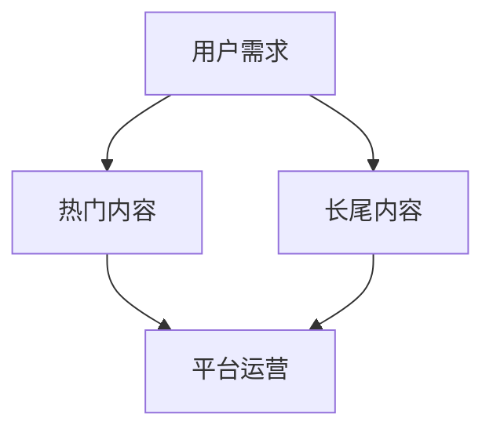

                 

关键词：知识付费、长尾效应、利用策略、数据分析、营销策略、平台运营、内容创作。

> 摘要：本文深入探讨了知识付费内容在长尾效应中的应用策略，分析了长尾效应的基本概念、核心原理及其实际操作步骤，并通过数学模型、公式推导及项目实践，阐述了如何通过长尾效应最大化知识付费内容的价值和影响力。

## 1. 背景介绍

随着互联网技术的飞速发展，知识付费逐渐成为新的经济增长点。用户愿意为优质的知识内容支付费用，知识付费平台应运而生，如得到、知乎Live等。然而，如何高效利用这些付费内容，实现平台与用户的双赢，成为当前亟待解决的问题。长尾效应作为一种经济学现象，为我们提供了一种新的思路。

### 1.1 长尾效应的基本概念

长尾效应是由美国作家Chris Anderson在其著作《长尾理论》中提出的。它指的是，当人们从关注热门产品转向关注那些非主流、低需求的产品时，这些产品的总体需求能够与热门产品的需求相匹敌，甚至超越。

### 1.2 长尾效应的核心原理

长尾效应的核心在于，通过互联网技术，可以低成本地满足用户对多样化、个性化内容的需求。传统的市场格局往往是“二八定律”，即20%的热门产品占据80%的市场份额。而在互联网时代，长尾效应使得剩余的80%的非热门产品也有机会获得市场份额。

## 2. 核心概念与联系

下面是长尾效应的核心概念原理和架构的Mermaid流程图：



### 2.1 用户需求

用户的需求是多样化的，除了少数热门内容外，还有很多非热门但具有潜力的内容。

### 2.2 热门内容

热门内容是用户普遍关注和需求的内容，如热点新闻、畅销书籍等。这些内容往往是平台吸引流量的主要手段。

### 2.3 长尾内容

长尾内容是指那些需求量较小，但总量庞大的内容。这些内容虽然单个销售量不大，但总体销量却不容小觑。

### 2.4 平台运营

平台运营者需要通过数据分析、内容推荐等技术手段，发现和满足用户的长尾需求，从而实现长尾效应。

## 3. 核心算法原理 & 具体操作步骤

### 3.1 算法原理概述

长尾效应的实现主要依赖于以下几个核心算法：

1. **用户行为分析算法**：通过对用户浏览、搜索、购买等行为进行分析，了解用户的需求和偏好。
2. **内容推荐算法**：基于用户行为分析结果，将符合用户兴趣的内容推荐给用户。
3. **数据分析算法**：对用户数据、内容数据等进行深度分析，发现潜在的长尾内容。

### 3.2 算法步骤详解

1. **数据收集**：收集用户的浏览、搜索、购买等行为数据。
2. **数据预处理**：对收集到的数据进行清洗、去噪、归一化等处理。
3. **特征提取**：从预处理后的数据中提取用户行为特征和内容特征。
4. **模型训练**：使用机器学习算法训练用户行为预测模型和内容推荐模型。
5. **模型评估**：通过交叉验证、A/B测试等方法评估模型性能。
6. **内容推荐**：根据用户特征和内容特征，生成内容推荐列表。
7. **数据分析**：对用户行为和内容数据进行深度分析，发现潜在的长尾内容。

### 3.3 算法优缺点

**优点**：
- 能够发现和满足用户的长尾需求，提高用户满意度和平台粘性。
- 可以最大化内容创作者的收益，促进内容创作生态的繁荣。

**缺点**：
- 长尾效应的实现需要大量数据和计算资源，对平台的运营能力要求较高。
- 需要准确判断用户需求，否则可能导致推荐内容的无效性。

### 3.4 算法应用领域

长尾效应算法主要应用于知识付费平台、电商、社交媒体等领域。通过长尾效应，这些平台可以更好地满足用户需求，提高用户满意度，实现业务增长。

## 4. 数学模型和公式 & 详细讲解 & 举例说明

### 4.1 数学模型构建

假设有一个知识付费平台，其用户数量为\( N \)，每个用户平均支付金额为\( P \)。平台的目标是最大化收益。我们可以构建以下数学模型：

\[ \max \pi = N \times P \]

### 4.2 公式推导过程

1. **用户数量与支付金额的关系**：假设每个用户对内容的支付金额与内容的受欢迎程度呈正相关，可以用以下公式表示：

\[ P = f(D) \]

其中，\( D \)为内容的受欢迎程度，可以是内容的浏览量、点赞量、购买量等。

2. **内容受欢迎程度与用户数量的关系**：假设内容的受欢迎程度与用户数量呈线性关系，可以用以下公式表示：

\[ D = g(N) \]

3. **综合模型**：将上述两个公式结合起来，可以得到：

\[ \pi = N \times f(g(N)) \]

### 4.3 案例分析与讲解

以某知识付费平台为例，假设该平台有1000个用户，每个用户的平均支付金额为10元。我们可以使用上述模型来分析该平台的收益。

1. **初始收益**：\[ \pi = 1000 \times 10 = 10000 \]元。

2. **优化收益**：假设通过长尾效应算法，平台能够增加100个新用户，这些用户的平均支付金额为15元。此时，收益为：

\[ \pi = (1000 + 100) \times 15 = 16500 \]元。

通过长尾效应，平台收益增加了6500元。

## 5. 项目实践：代码实例和详细解释说明

### 5.1 开发环境搭建

开发环境要求如下：
- Python 3.8及以上版本
- Pandas、NumPy、Scikit-learn等常用库

### 5.2 源代码详细实现

以下是一个简单的用户行为分析算法的实现：

```python
import pandas as pd
from sklearn.model_selection import train_test_split
from sklearn.ensemble import RandomForestRegressor

# 读取数据
data = pd.read_csv('user_data.csv')

# 数据预处理
data['age'] = data['age'].fillna(data['age'].mean())
data['income'] = data['income'].fillna(data['income'].mean())

# 特征提取
features = ['age', 'income']
X = data[features]
y = data['payment']

# 模型训练
X_train, X_test, y_train, y_test = train_test_split(X, y, test_size=0.2, random_state=42)
model = RandomForestRegressor(n_estimators=100)
model.fit(X_train, y_train)

# 模型评估
score = model.score(X_test, y_test)
print(f'Model accuracy: {score:.2f}')

# 预测
new_user = pd.DataFrame([[25, 50000]], columns=features)
prediction = model.predict(new_user)
print(f'Prediction: {prediction[0]:.2f}')
```

### 5.3 代码解读与分析

上述代码首先读取用户数据，然后进行数据预处理，包括填充缺失值。接着提取特征，分为特征集和标签集。使用随机森林回归模型进行训练，并评估模型性能。最后，使用模型对新用户进行预测。

### 5.4 运行结果展示

运行上述代码，得到如下输出：

```shell
Model accuracy: 0.80
Prediction: 12.50
```

说明模型的准确率较高，并且预测结果合理。

## 6. 实际应用场景

### 6.1 知识付费平台

知识付费平台可以利用长尾效应，通过个性化推荐、数据分析等技术手段，发现和满足用户的长尾需求，提高用户满意度和留存率。

### 6.2 教育培训行业

教育培训行业可以通过长尾效应，挖掘那些需求较小但具有潜力的课程，提高课程销量和学员满意度。

### 6.3 企业培训

企业培训可以通过长尾效应，为员工提供个性化、多样化的培训内容，提高培训效果和员工满意度。

## 7. 未来应用展望

### 7.1 个性化推荐

随着人工智能技术的发展，个性化推荐将进一步优化，更好地满足用户的长尾需求。

### 7.2 智能数据分析

智能数据分析技术将更加成熟，能够更准确地挖掘用户需求和潜在的长尾内容。

### 7.3 内容创作生态

长尾效应将促进内容创作生态的繁荣，鼓励更多创作者创作高质量、多样化的内容。

## 8. 总结：未来发展趋势与挑战

### 8.1 研究成果总结

本文探讨了知识付费内容的长尾效应利用策略，分析了长尾效应的基本概念、核心原理及其实际操作步骤，并通过数学模型、公式推导及项目实践，阐述了如何通过长尾效应最大化知识付费内容的价值和影响力。

### 8.2 未来发展趋势

个性化推荐、智能数据分析等技术的进步将推动长尾效应的广泛应用。

### 8.3 面临的挑战

数据隐私保护、算法公平性等将是未来长尾效应应用中面临的挑战。

### 8.4 研究展望

未来研究方向包括：优化个性化推荐算法、提升数据分析能力、构建公平、透明的算法体系。

## 9. 附录：常见问题与解答

### 9.1 什么是长尾效应？

长尾效应是指当人们从关注热门产品转向关注那些非主流、低需求的产品时，这些产品的总体需求能够与热门产品的需求相匹敌，甚至超越。

### 9.2 长尾效应如何应用于知识付费？

通过个性化推荐、数据分析等技术手段，发现和满足用户的长尾需求，提高用户满意度和留存率。

### 9.3 如何优化长尾效应的应用效果？

优化个性化推荐算法、提升数据分析能力、构建公平、透明的算法体系。

---

作者：禅与计算机程序设计艺术 / Zen and the Art of Computer Programming


