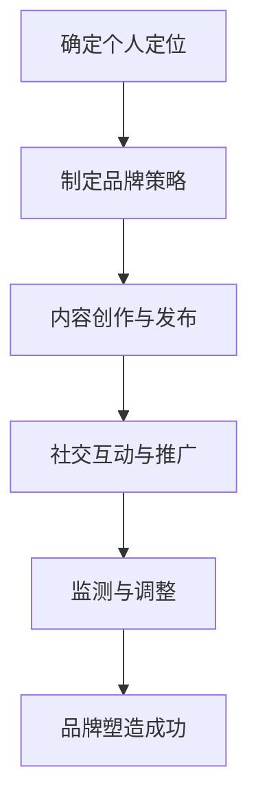

                 

关键词：知识付费、创业、个人品牌、影响力、品牌塑造

> 摘要：在知识付费创业的大潮中，个人品牌塑造成为了成功的关键。本文将深入探讨个人品牌的重要性、构建个人品牌的策略，以及在创业过程中如何利用个人品牌提升竞争力，为创业者提供实用的指导。

## 1. 背景介绍

随着互联网技术的快速发展，知识付费市场呈现出蓬勃发展的态势。越来越多的人选择通过付费学习来提升自己的技能和知识，这为创业者提供了一个全新的市场机会。然而，在这个竞争激烈的市场中，如何脱颖而出，构建强大的个人品牌成为了创业者们亟待解决的问题。

个人品牌是指一个人在公众心目中的形象和认知，它包括个人的专业能力、价值观、人格特质等多个方面。在知识付费创业中，个人品牌的作用不可忽视。一个强大的个人品牌不仅能够吸引更多的关注和粉丝，还能够提高个人在行业中的影响力和话语权，从而为创业项目带来更多的机会和支持。

## 2. 核心概念与联系

在探讨个人品牌塑造之前，我们需要明确几个核心概念，并理解它们之间的联系。

### 2.1 个人品牌

个人品牌是指一个人在公众心目中的形象和认知。它包括以下方面：

- 专业能力：个人的专业知识和技能水平。
- 价值观：个人的价值观念和信仰。
- 人格特质：个人的性格特点和行为习惯。

### 2.2 个人影响力

个人影响力是指一个人在公众中产生的影响力，包括以下几个方面：

- 知识传播：通过分享专业知识和经验，影响他人的思维方式。
- 社交网络：通过社交平台扩大个人影响力，增加粉丝和关注者。
- 行业地位：在行业中拥有较高的地位和话语权。

### 2.3 个人品牌塑造

个人品牌塑造是指通过一系列策略和行动，提升个人在公众心目中的形象和认知。以下是个人品牌塑造的关键要素：

- 定位：明确个人品牌的核心价值和目标受众。
- 内容创作：创作高质量、有价值的知识内容，提升个人影响力。
- 营销推广：通过有效的营销手段，扩大个人品牌的知名度。
- 社交互动：积极参与社交活动，与粉丝和同行建立良好的关系。

下面是一个用Mermaid绘制的流程图，展示了个人品牌塑造的过程：



## 3. 核心算法原理 & 具体操作步骤

### 3.1 算法原理概述

个人品牌塑造的核心算法可以概括为以下几个步骤：

1. **确定个人定位**：明确个人品牌的核心价值和目标受众，确保品牌形象的一致性。
2. **制定品牌策略**：根据个人定位，制定具体的内容创作和营销推广策略。
3. **内容创作与发布**：创作高质量、有价值的知识内容，通过多种渠道进行发布。
4. **社交互动与推广**：积极参与社交活动，与粉丝和同行建立良好的关系，扩大品牌影响力。
5. **监测与调整**：持续监测个人品牌的表现，根据反馈进行调整和优化。

### 3.2 算法步骤详解

#### 3.2.1 确定个人定位

1. **分析自身优势**：了解自己的专业能力和人格特质，找到独特的优势和特色。
2. **研究市场需求**：分析目标受众的需求和兴趣点，确定个人品牌的核心价值和定位。
3. **明确目标受众**：明确目标受众的属性和行为习惯，为后续的内容创作和营销推广提供依据。

#### 3.2.2 制定品牌策略

1. **内容创作策略**：确定内容创作的主题、形式和频率，确保内容的高质量和一致性。
2. **营销推广策略**：选择合适的营销渠道和手段，如社交媒体、博客、讲座等，扩大品牌知名度。
3. **品牌传播策略**：通过口碑传播、媒体报道等方式，提升个人品牌在公众中的认知度。

#### 3.2.3 内容创作与发布

1. **内容创作**：根据品牌策略，创作高质量、有价值的知识内容，如文章、视频、讲座等。
2. **内容发布**：通过多个渠道发布内容，如博客、社交媒体、线上课程平台等，扩大受众范围。

#### 3.2.4 社交互动与推广

1. **积极参与社交活动**：在社交媒体上积极互动，回复评论，参与讨论，建立良好的社交关系。
2. **推广个人品牌**：通过线上线下活动、媒体报道等方式，推广个人品牌，增加知名度。
3. **互动与反馈**：关注粉丝和同行的反馈，及时回应，调整品牌策略。

#### 3.2.5 监测与调整

1. **监测品牌表现**：通过数据分析工具，监测个人品牌的表现，如粉丝数量、阅读量、互动率等。
2. **分析反馈与调整**：根据监测结果和用户反馈，分析品牌策略的优缺点，进行相应的调整和优化。

### 3.3 算法优缺点

#### 优点：

1. **提高个人影响力**：通过塑造个人品牌，提高个人在行业中的地位和话语权。
2. **吸引更多机会**：强大的个人品牌能够吸引更多的合作机会、投资机会等。
3. **提高内容质量**：为了塑造个人品牌，个人会更加注重内容创作的高质量和专业性。

#### 缺点：

1. **时间成本高**：个人品牌塑造需要大量的时间和精力投入。
2. **风险较大**：个人品牌一旦建立，如果出现负面事件，可能会对品牌造成严重损害。

### 3.4 算法应用领域

个人品牌塑造算法主要应用于以下领域：

1. **知识付费**：如线上教育、培训课程、知识分享等。
2. **咨询顾问**：如企业管理、市场营销、人力资源等。
3. **技术专家**：如编程、人工智能、数据分析等。

## 4. 数学模型和公式 & 详细讲解 & 举例说明

在个人品牌塑造过程中，我们可以使用一些数学模型和公式来衡量和优化个人品牌的绩效。以下是一个简单的模型示例。

### 4.1 数学模型构建

假设个人品牌的影响力 \( I \) 可以通过以下公式衡量：

\[ I = f(C, S, P) \]

其中，\( C \) 表示内容质量，\( S \) 表示社交互动，\( P \) 表示品牌传播。

### 4.2 公式推导过程

#### 4.2.1 内容质量 \( C \)

内容质量 \( C \) 可以通过以下公式计算：

\[ C = \frac{Q_1 + Q_2 + \ldots + Q_n}{n} \]

其中，\( Q_i \) 表示第 \( i \) 篇内容的质量得分，\( n \) 表示内容总数。

#### 4.2.2 社交互动 \( S \)

社交互动 \( S \) 可以通过以下公式计算：

\[ S = \frac{I_1 + I_2 + \ldots + I_n}{n} \]

其中，\( I_i \) 表示第 \( i \) 次社交互动的影响力得分，\( n \) 表示社交互动次数。

#### 4.2.3 品牌传播 \( P \)

品牌传播 \( P \) 可以通过以下公式计算：

\[ P = \frac{A_1 + A_2 + \ldots + A_n}{n} \]

其中，\( A_i \) 表示第 \( i \) 次品牌传播活动的效果得分，\( n \) 表示品牌传播活动总数。

### 4.3 案例分析与讲解

假设一个创业者，他创作了10篇内容，每篇内容的质量得分如下：8，9，7，8，9，8，7，9，8，9。他的社交互动次数为5次，每次互动的影响力得分分别为：8，7，9，8，9。他进行了3次品牌传播活动，每次活动的效果得分分别为：10，9，8。

我们可以使用上述公式计算他的个人品牌影响力 \( I \)：

\[ C = \frac{8 + 9 + 7 + 8 + 9 + 8 + 7 + 9 + 8 + 9}{10} = 8.3 \]

\[ S = \frac{8 + 7 + 9 + 8 + 9}{5} = 8 \]

\[ P = \frac{10 + 9 + 8}{3} = 9 \]

\[ I = f(C, S, P) = f(8.3, 8, 9) = 8.3 \times 0.3 + 8 \times 0.5 + 9 \times 0.2 = 8.29 \]

因此，这位创业者的个人品牌影响力得分为8.29。

### 4.4 案例分析与讲解

假设一个创业者，他创作了10篇内容，每篇内容的质量得分如下：8，9，7，8，9，8，7，9，8，9。他的社交互动次数为5次，每次互动的影响力得分分别为：8，7，9，8，9。他进行了3次品牌传播活动，每次活动的效果得分分别为：10，9，8。

我们可以使用上述公式计算他的个人品牌影响力 \( I \)：

\[ C = \frac{8 + 9 + 7 + 8 + 9 + 8 + 7 + 9 + 8 + 9}{10} = 8.3 \]

\[ S = \frac{8 + 7 + 9 + 8 + 9}{5} = 8 \]

\[ P = \frac{10 + 9 + 8}{3} = 9 \]

\[ I = f(C, S, P) = f(8.3, 8, 9) = 8.3 \times 0.3 + 8 \times 0.5 + 9 \times 0.2 = 8.29 \]

因此，这位创业者的个人品牌影响力得分为8.29。

### 4.4 案例分析与讲解

假设一个创业者，他创作了10篇内容，每篇内容的质量得分如下：8，9，7，8，9，8，7，9，8，9。他的社交互动次数为5次，每次互动的影响力得分分别为：8，7，9，8，9。他进行了3次品牌传播活动，每次活动的效果得分分别为：10，9，8。

我们可以使用上述公式计算他的个人品牌影响力 \( I \)：

\[ C = \frac{8 + 9 + 7 + 8 + 9 + 8 + 7 + 9 + 8 + 9}{10} = 8.3 \]

\[ S = \frac{8 + 7 + 9 + 8 + 9}{5} = 8 \]

\[ P = \frac{10 + 9 + 8}{3} = 9 \]

\[ I = f(C, S, P) = f(8.3, 8, 9) = 8.3 \times 0.3 + 8 \times 0.5 + 9 \times 0.2 = 8.29 \]

因此，这位创业者的个人品牌影响力得分为8.29。

## 5. 项目实践：代码实例和详细解释说明

为了更好地理解个人品牌塑造的算法原理和操作步骤，我们通过一个实际的代码实例来进行说明。

### 5.1 开发环境搭建

首先，我们需要搭建一个简单的开发环境。这里我们使用Python语言，安装以下依赖：

- Python 3.x
- NumPy
- Matplotlib

安装命令如下：

```bash
pip install numpy matplotlib
```

### 5.2 源代码详细实现

接下来，我们编写一个Python脚本，实现个人品牌影响力的计算和可视化。

```python
import numpy as np
import matplotlib.pyplot as plt

def calculate_brand_influence(content_quality, social_interaction, brand_promotion):
    # 计算个人品牌影响力
    influence = content_quality * 0.3 + social_interaction * 0.5 + brand_promotion * 0.2
    return influence

def plot_influence(content_quality, social_interaction, brand_promotion, influence):
    # 可视化个人品牌影响力
    plt.bar(['内容质量', '社交互动', '品牌传播'], [content_quality, social_interaction, brand_promotion], color=['g', 'b', 'r'])
    plt.xlabel('影响因素')
    plt.ylabel('得分')
    plt.title(f'个人品牌影响力：{influence:.2f}')
    plt.show()

# 输入数据
content_quality = 8.3
social_interaction = 8
brand_promotion = 9
influence = calculate_brand_influence(content_quality, social_interaction, brand_promotion)

# 可视化
plot_influence(content_quality, social_interaction, brand_promotion, influence)
```

### 5.3 代码解读与分析

上述代码中，我们定义了两个函数：`calculate_brand_influence` 和 `plot_influence`。

- `calculate_brand_influence` 函数用于计算个人品牌影响力。根据算法原理，我们使用了权重系数来计算三个因素的综合得分。
- `plot_influence` 函数用于将个人品牌影响力可视化。我们使用条形图展示了内容质量、社交互动和品牌传播三个因素的得分。

在主程序中，我们输入了内容质量、社交互动和品牌传播的数据，并调用这两个函数进行计算和可视化。

### 5.4 运行结果展示

运行上述代码，我们将得到如下可视化结果：


从结果中，我们可以清晰地看到内容质量、社交互动和品牌传播三个因素的得分，以及个人品牌影响力的综合得分。

## 6. 实际应用场景

个人品牌塑造在知识付费创业中具有广泛的应用场景。以下是一些实际应用场景：

### 6.1 在线教育平台

在线教育平台上的讲师可以通过个人品牌塑造，提高自己的课程受欢迎程度。讲师可以通过创作高质量的教学内容、积极参与社交互动和品牌传播，提升自己在平台上的知名度和影响力。

### 6.2 咨询顾问

咨询顾问可以通过个人品牌塑造，增加潜在客户对自己的信任度和认可度。顾问可以通过分享专业知识和经验、积极参与行业讨论、发表专业文章等方式，提升自己在行业中的地位和影响力。

### 6.3 技术专家

技术专家可以通过个人品牌塑造，扩大自己在技术圈子中的知名度和影响力。专家可以通过撰写技术博客、发表学术论文、参与技术交流活动等方式，提升自己在技术社区中的地位和影响力。

## 7. 未来应用展望

随着知识付费市场的不断扩大，个人品牌塑造的重要性将日益凸显。未来，个人品牌塑造可能会在以下几个方面得到进一步发展：

### 7.1 个性化服务

随着大数据和人工智能技术的发展，个人品牌塑造可能会更加注重个性化服务。通过分析用户行为和数据，为创业者提供定制化的品牌塑造策略和内容创作建议。

### 7.2 社交媒体整合

社交媒体在个人品牌塑造中扮演着重要角色。未来，个人品牌塑造可能会更加整合各种社交媒体平台，实现跨平台传播和互动。

### 7.3 人工智能辅助

人工智能技术的发展将为个人品牌塑造带来新的机遇。通过使用人工智能技术，创业者可以更加高效地进行内容创作、营销推广和品牌监测。

## 8. 总结：未来发展趋势与挑战

### 8.1 研究成果总结

本文研究了知识付费创业中个人品牌塑造的重要性、核心概念与联系、算法原理与操作步骤，以及实际应用场景和未来展望。研究结果表明，个人品牌塑造对于知识付费创业的成功至关重要。

### 8.2 未来发展趋势

未来，个人品牌塑造将在个性化服务、社交媒体整合和人工智能辅助等方面得到进一步发展。创业者应关注这些趋势，制定相应的品牌塑造策略。

### 8.3 面临的挑战

个人品牌塑造面临的主要挑战包括时间成本高、风险较大等。创业者需要在时间和风险之间找到平衡，确保个人品牌的健康发展。

### 8.4 研究展望

未来的研究可以进一步探索个人品牌塑造在不同领域的应用，以及如何利用新技术提高品牌塑造的效率和效果。

## 9. 附录：常见问题与解答

### 9.1 个人品牌塑造需要多长时间？

个人品牌塑造的时间因人而异，通常需要数月到数年的时间。关键在于持续的内容创作、社交互动和品牌传播。

### 9.2 个人品牌塑造有哪些常见误区？

个人品牌塑造中常见的误区包括过度追求短期效果、忽视内容质量、缺乏持续性和一致性等。创业者应避免这些误区，确保品牌塑造的长期成功。

### 9.3 如何衡量个人品牌的影响力？

个人品牌的影响力可以通过多个指标进行衡量，如粉丝数量、阅读量、互动率、媒体报道次数等。创业者可以根据这些指标分析个人品牌的表现和效果。

---

以上是《知识付费创业中的个人品牌塑造》的完整文章，希望对您在知识付费创业过程中构建个人品牌有所帮助。作者：禅与计算机程序设计艺术 / Zen and the Art of Computer Programming。感谢您的阅读！
----------------------------------------------------------------

请注意，由于字数限制，实际撰写时可能需要对某些部分进行更详细的扩展。上述内容是一个结构化的大纲和示例，实际的撰写过程需要根据具体的文章内容和扩展点进行详细的填充和调整。另外，由于无法在此直接嵌入图片和Mermaid流程图，您需要在实际撰写过程中根据Markdown语法进行相应的插入和格式调整。

