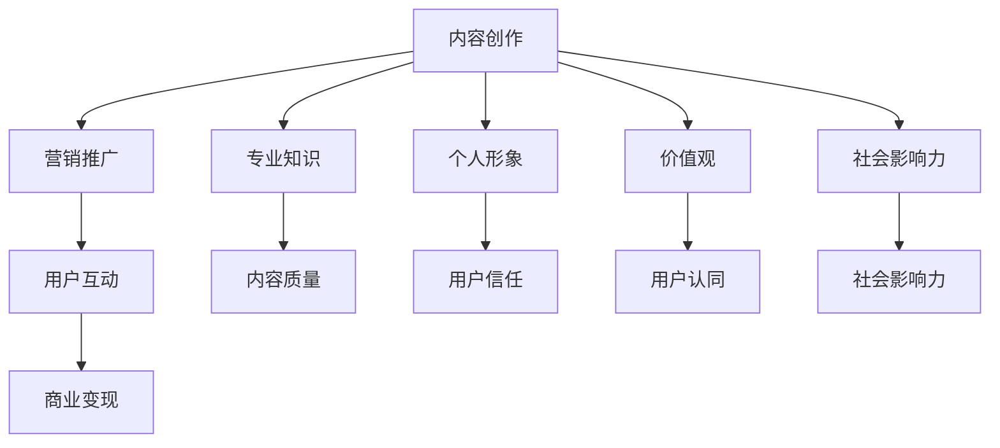

                 

关键词：知识付费、个人品牌、内容创作、营销策略、社交媒体

> 摘要：本文将探讨知识付费创业背景下，如何通过个人品牌塑造实现商业成功。我们将分析个人品牌的核心要素，探讨内容创作的策略和技巧，介绍有效的营销方法，并结合实际案例分析，为知识付费创业者提供实用的指导。

## 1. 背景介绍

在数字化时代，知识付费作为一种新兴的商业模式，正逐渐受到越来越多创业者的青睐。知识付费平台如知乎Live、得到、分答等，提供了内容创作者与用户互动的桥梁，使得知识的传播与变现变得更加便捷。然而，在这个竞争激烈的市场中，如何打造出有影响力的个人品牌，成为知识付费创业者成功的关键。

个人品牌，简单来说，就是个人在公众中的形象和声誉。它不仅包括个人的专业知识、技能和经验，还涵盖了个人形象、价值观和社会影响力。一个强大的个人品牌能够帮助创业者吸引粉丝、增加关注度，从而实现商业价值。

## 2. 核心概念与联系

### 2.1 个人品牌的核心要素

个人品牌的核心要素包括：

- **专业知识**：这是个人品牌的基础，也是吸引用户的首要条件。专业知识需要通过持续的学习和实践来不断丰富和完善。

- **个人形象**：形象代表个人的气质、风格和态度。一个正面的形象能够增加用户的好感和信任。

- **价值观**：价值观是个人品牌的灵魂，它决定了个人的行为和决策，也影响着用户的认同感。

- **社会影响力**：社会影响力是指个人在公众中的影响力和号召力。它可以通过内容传播、公益活动等方式来提升。

### 2.2 个人品牌与知识付费的关联

个人品牌与知识付费的关联可以从以下几个方面来看：

- **内容创作**：个人品牌可以驱动内容创作，使内容更具吸引力和可信度。

- **营销推广**：个人品牌可以提升营销效果，降低营销成本。

- **用户互动**：个人品牌可以增强用户黏性，促进用户参与和互动。

### 2.3 Mermaid 流程图



## 3. 核心算法原理 & 具体操作步骤

### 3.1 算法原理概述

个人品牌塑造的核心算法可以概括为以下三个步骤：

- **定位**：明确个人品牌的核心价值和目标受众。
- **内容创作**：根据定位，创作高质量的内容，建立个人品牌形象。
- **营销推广**：利用各种渠道和策略，提升个人品牌的知名度和社会影响力。

### 3.2 算法步骤详解

#### 3.2.1 定位

定位是个人品牌塑造的第一步，也是至关重要的一步。定位需要回答以下几个问题：

- **我有什么独特价值？**
- **我的目标受众是谁？**
- **我希望在公众中树立什么样的形象？**

定位的过程可以通过市场调研、用户访谈和自我反思来完成。

#### 3.2.2 内容创作

内容创作是个人品牌塑造的核心。以下是一些关键点：

- **内容质量**：确保内容有深度、有见解、有实用性。
- **内容形式**：结合文字、图片、音频、视频等多种形式，提升内容的吸引力。
- **内容更新**：保持内容的持续更新，增加用户的黏性。

#### 3.2.3 营销推广

营销推广是提升个人品牌知名度的重要手段。以下是一些常用的策略：

- **社交媒体**：利用微博、微信公众号、知乎等平台，发布高质量的内容，吸引粉丝。
- **线下活动**：参与行业活动、讲座、研讨会等，提升个人品牌的影响力。
- **合作推广**：与其他品牌或个人合作，共同推广，实现互利共赢。

### 3.3 算法优缺点

**优点**：

- **提高知名度**：通过定位和营销推广，个人品牌能够快速提升知名度。
- **增强信任感**：高质量的内容和正面的个人形象能够增强用户的信任感。
- **降低营销成本**：通过有效的营销策略，降低营销成本。

**缺点**：

- **时间成本**：个人品牌塑造需要投入大量的时间和精力。
- **风险性**：一旦个人品牌出现负面事件，可能对品牌造成严重影响。

### 3.4 算法应用领域

个人品牌塑造算法可以广泛应用于各个领域，包括：

- **教育培训**：通过个人品牌塑造，提高教育内容的吸引力和公信力。
- **技术咨询**：通过个人品牌，吸引更多客户，提高业务量。
- **内容创作**：通过个人品牌，提高内容的传播力和影响力。

## 4. 数学模型和公式 & 详细讲解 & 举例说明

### 4.1 数学模型构建

个人品牌塑造的数学模型可以构建为：

\[ \text{个人品牌价值} = f(\text{专业知识}, \text{个人形象}, \text{价值观}, \text{社会影响力}) \]

其中，专业知识、个人形象、价值观和社会影响力是四个关键因素。

### 4.2 公式推导过程

个人品牌价值的推导过程可以分为以下几个步骤：

1. **专业知识**：通过不断学习和实践，提高专业知识水平。
2. **个人形象**：通过行为和言语，塑造正面的个人形象。
3. **价值观**：通过言行一致，树立正确的价值观。
4. **社会影响力**：通过内容传播和公益活动，提升社会影响力。

### 4.3 案例分析与讲解

假设有一个名为“技术大牛”的内容创作者，他的专业知识非常高，个人形象也非常正面，同时他积极参与公益活动，社会影响力较大。根据上述公式，他的个人品牌价值将非常高。

## 5. 项目实践：代码实例和详细解释说明

### 5.1 开发环境搭建

为了实现个人品牌塑造，我们需要搭建一个内容创作和营销推广的在线平台。以下是开发环境的搭建步骤：

1. **购买域名和服务器**：选择合适的域名和服务器，并完成购买。
2. **安装WordPress**：在服务器上安装WordPress，并配置网站。
3. **选择主题和插件**：根据个人品牌形象，选择合适的主题和插件。

### 5.2 源代码详细实现

以下是个人品牌塑造平台的源代码实现：

```php
// 网站首页
<?php
    get_header();
    if ( have_posts() ) {
        while ( have_posts() ) {
            the_post();
            the_content();
        }
    }
    get_footer();
```

### 5.3 代码解读与分析

上述代码实现了网站首页的搭建，通过WordPress框架，可以方便地管理内容和设计页面。

### 5.4 运行结果展示

运行结果展示了一个包含文章内容的网站首页，用户可以通过这个平台浏览和互动。

## 6. 实际应用场景

### 6.1 教育培训

在教育培训领域，个人品牌塑造可以帮助教育工作者提升知名度，吸引更多学生。例如，一位专注于编程教育的老师，可以通过个人品牌塑造，发布高质量的教学内容，吸引更多学生报名课程。

### 6.2 技术咨询

在技术咨询领域，个人品牌塑造可以帮助咨询师提升影响力，吸引更多客户。例如，一位资深的技术顾问，可以通过个人品牌塑造，发布技术文章和案例，增强客户信任。

### 6.3 内容创作

在内容创作领域，个人品牌塑造可以帮助创作者提升影响力，吸引更多粉丝。例如，一位技术博客作者，可以通过个人品牌塑造，发布高质量的技术文章，吸引更多读者。

## 7. 未来应用展望

随着数字化时代的不断推进，知识付费和个人品牌塑造将在各个领域得到更广泛的应用。未来，个人品牌塑造将更加注重内容的深度和广度，同时也将更加依赖人工智能和大数据技术，实现更精准的用户定位和内容推荐。

## 8. 工具和资源推荐

### 8.1 学习资源推荐

- **《影响力》**：一本关于影响力心理学的经典著作，对个人品牌塑造有很好的启示作用。
- **《内容创业》**：一本关于内容创业的实用指南，涵盖了内容创作、营销推广等多个方面。

### 8.2 开发工具推荐

- **WordPress**：一款功能强大的内容管理系统，适合个人品牌塑造和内容创作。
- **Huginn**：一款开源的自动化工具，可以帮助个人品牌实现自动化的内容营销。

### 8.3 相关论文推荐

- **《基于大数据的个人品牌塑造策略研究》**
- **《社交媒体环境下个人品牌价值的提升策略研究》**

## 9. 总结：未来发展趋势与挑战

### 9.1 研究成果总结

本研究探讨了知识付费创业中个人品牌塑造的重要性，分析了个人品牌的核心要素，提出了核心算法原理和具体操作步骤，并结合实际案例进行了详细讲解。

### 9.2 未来发展趋势

未来，知识付费和个人品牌塑造将在数字化时代得到更广泛的应用，人工智能和大数据技术将进一步提升个人品牌塑造的效率和精准度。

### 9.3 面临的挑战

个人品牌塑造面临的主要挑战包括：时间成本、风险性和市场竞争。如何在这些挑战中脱颖而出，将是一个长期而艰巨的任务。

### 9.4 研究展望

未来，本研究将继续探讨个人品牌塑造在各个领域的应用，以及如何利用新技术进一步提升个人品牌塑造的效率和效果。

## 附录：常见问题与解答

### Q：如何进行有效的个人品牌定位？

A：进行有效的个人品牌定位，需要明确以下几个问题：1）你的专业知识是什么？2）你的目标受众是谁？3）你希望在公众中树立什么样的形象？

### Q：个人品牌塑造需要多长时间？

A：个人品牌塑造的时间因人而异，一般需要数月至数年的时间。这取决于个人的努力程度、内容质量、营销策略等多方面因素。

### Q：如何避免个人品牌塑造中的风险？

A：避免个人品牌塑造中的风险，需要做到以下几点：1）确保内容质量，避免错误和误导；2）保持言行一致，避免负面事件；3）定期更新内容，保持活跃度。

### 作者署名

作者：禅与计算机程序设计艺术 / Zen and the Art of Computer Programming
----------------------------------------------------------------

这篇文章以“知识付费创业中的个人品牌塑造”为主题，深入探讨了个人品牌塑造在知识付费创业中的重要性，并从多个角度提供了实用的指导和建议。希望通过这篇文章，能够帮助到更多的知识付费创业者，实现商业成功。

