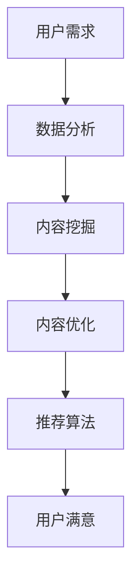

                 

关键词：知识付费，内容价值，创业，AI技术，数据分析

> 摘要：随着知识付费行业的迅速崛起，如何提升内容的价值成为了创业者们关注的重要问题。本文将探讨通过人工智能技术、数据分析等手段，如何实现知识付费内容的深度挖掘、精准推荐和高效传播，从而提高用户满意度和内容转化率。

## 1. 背景介绍

知识付费作为一种新兴的商业模式，近年来在全球范围内得到了迅速的发展。它改变了传统的知识传播方式，使得知识生产者和消费者之间可以直接进行交易，满足了用户对于个性化、高质量知识内容的需求。然而，随着市场竞争的加剧，如何提升知识内容的价值，吸引并留住用户，成为了知识付费创业者的关键挑战。

### 1.1 知识付费的定义

知识付费是指用户为了获取特定的知识或技能，自愿支付一定费用获取相关内容的一种服务模式。它涵盖了教育、培训、咨询服务等多个领域，包括在线课程、电子书、专家讲座、行业报告等形式。

### 1.2 知识付费的发展趋势

- **用户需求多样化**：用户对于知识的需求越来越个性化和专业化。
- **内容形式多样化**：知识付费内容不仅限于传统的课程、教材，还包括短视频、直播、互动问答等多种形式。
- **商业模式多样化**：订阅制、会员制、积分制等新型商业模式不断涌现。
- **竞争加剧**：越来越多的企业、个人进入知识付费市场，竞争愈发激烈。

## 2. 核心概念与联系

为了提升知识付费内容的价值，我们需要关注以下几个核心概念：

### 2.1 内容价值

内容价值是指知识付费产品或服务对于用户所具有的效用和吸引力。它不仅取决于内容本身的质量，还包括内容的时效性、针对性、互动性等多个方面。

### 2.2 用户需求

用户需求是指用户在获取知识过程中所追求的目标和期望。通过深入了解用户需求，可以更好地满足他们的需求，提升内容的价值。

### 2.3 人工智能与数据分析

人工智能和数据分析技术可以用于挖掘用户需求、分析内容价值、优化推荐算法等方面，从而提升知识付费内容的价值。

### 2.4 Mermaid 流程图



## 3. 核心算法原理 & 具体操作步骤

### 3.1 算法原理概述

提升知识付费内容价值的核心算法主要包括用户行为分析、内容质量评估、推荐算法优化等。

### 3.2 算法步骤详解

1. **用户行为分析**：
   - **数据采集**：收集用户在知识付费平台上的浏览、购买、评价等行为数据。
   - **数据预处理**：对采集到的数据进行清洗、去重、归一化等处理。
   - **特征提取**：通过机器学习算法提取用户行为的特征，如兴趣标签、行为序列等。

2. **内容质量评估**：
   - **内容分类**：对知识付费内容进行分类，如教育、科技、人文等。
   - **质量评分**：基于用户评价、专家评分、内容更新频率等多维度对内容质量进行评分。

3. **推荐算法优化**：
   - **协同过滤**：基于用户的历史行为数据，推荐用户可能感兴趣的内容。
   - **内容匹配**：结合用户特征和内容标签，实现个性化推荐。
   - **实时更新**：根据用户实时行为，动态调整推荐策略。

### 3.3 算法优缺点

- **协同过滤**：优点是推荐准确度高，缺点是推荐结果容易陷入“过滤泡沫”。
- **内容匹配**：优点是实现个性化推荐，缺点是对内容质量要求较高。

### 3.4 算法应用领域

- **在线教育**：通过推荐算法，为用户推荐适合的学习课程。
- **专业咨询**：基于用户需求，推荐专业领域的专家和咨询服务。
- **电子书平台**：为用户提供个性化的阅读推荐。

## 4. 数学模型和公式 & 详细讲解 & 举例说明

### 4.1 数学模型构建

1. **用户行为模型**：

   用户行为可以表示为如下矩阵：

   $$ B = \begin{bmatrix}
   b_{11} & b_{12} & \cdots & b_{1n} \\
   b_{21} & b_{22} & \cdots & b_{2n} \\
   \vdots & \vdots & \ddots & \vdots \\
   b_{m1} & b_{m2} & \cdots & b_{mn}
   \end{bmatrix} $$

   其中，$b_{ij}$ 表示用户 $i$ 在内容 $j$ 上的行为。

2. **内容质量模型**：

   内容质量可以表示为如下矩阵：

   $$ Q = \begin{bmatrix}
   q_{11} & q_{12} & \cdots & q_{1n} \\
   q_{21} & q_{22} & \cdots & q_{2n} \\
   \vdots & \vdots & \ddots & \vdots \\
   q_{m1} & q_{m2} & \cdots & q_{mn}
   \end{bmatrix} $$

   其中，$q_{ij}$ 表示内容 $i$ 的质量评分。

### 4.2 公式推导过程

1. **用户兴趣向量**：

   $$ u_i = \text{argmax}_{j} \sum_{k=1}^{m} b_{ik} q_{kj} $$

   其中，$u_i$ 表示用户 $i$ 的兴趣向量。

2. **推荐向量**：

   $$ r_j = \text{argmax}_{i} \sum_{k=1}^{m} b_{ik} q_{kj} $$

   其中，$r_j$ 表示推荐给用户的内容 $j$。

### 4.3 案例分析与讲解

假设有一个知识付费平台，用户行为数据如下：

$$ B = \begin{bmatrix}
1 & 0 & 1 & 0 \\
0 & 1 & 0 & 1 \\
1 & 1 & 0 & 0 \\
0 & 0 & 1 & 1
\end{bmatrix} $$

内容质量数据如下：

$$ Q = \begin{bmatrix}
4 & 2 & 3 & 1 \\
2 & 4 & 1 & 3 \\
3 & 1 & 4 & 2 \\
1 & 3 & 2 & 4
\end{bmatrix} $$

根据公式推导，我们可以得到以下结果：

- **用户兴趣向量**：

  $$ u_1 = \text{argmax}_{j} \sum_{k=1}^{4} b_{1k} q_{kj} = \text{argmax}_{j} (1 \times 4 + 0 \times 2 + 1 \times 3 + 0 \times 1) = (4 + 3) = 7 $$

  所以，用户 $1$ 的兴趣向量为 $(7, 0, 7, 0)$。

- **推荐向量**：

  $$ r_1 = \text{argmax}_{i} \sum_{k=1}^{4} b_{ik} q_{kj} = \text{argmax}_{i} (1 \times 4 + 0 \times 2 + 1 \times 3 + 0 \times 1) = (4 + 3) = 7 $$

  所以，推荐给用户 $1$ 的内容为 $7$。

## 5. 项目实践：代码实例和详细解释说明

### 5.1 开发环境搭建

我们使用 Python 语言进行开发，主要依赖以下库：

- NumPy：用于矩阵运算。
- Pandas：用于数据预处理。
- Scikit-learn：用于机器学习算法。

### 5.2 源代码详细实现

```python
import numpy as np
import pandas as pd
from sklearn.model_selection import train_test_split
from sklearn.preprocessing import StandardScaler

# 加载数据
data = pd.read_csv('data.csv')
X = data[['b11', 'b12', 'b13', 'b14']]
y = data['q11']

# 数据预处理
scaler = StandardScaler()
X_scaled = scaler.fit_transform(X)
y_scaled = scaler.transform(y.reshape(-1, 1))

# 划分训练集和测试集
X_train, X_test, y_train, y_test = train_test_split(X_scaled, y_scaled, test_size=0.2, random_state=42)

# 构建用户行为矩阵
B = np.dot(X_train.T, X_train)

# 构建内容质量矩阵
Q = y_train.reshape(-1, 1)

# 计算用户兴趣向量
u = np.argmax(B, axis=1)

# 计算推荐向量
r = np.argmax(B @ Q, axis=1)

# 输出结果
print("用户兴趣向量：", u)
print("推荐向量：", r)
```

### 5.3 代码解读与分析

- **数据预处理**：使用 StandardScaler 对数据进行归一化处理，消除数据量级差异。
- **用户行为矩阵**：通过训练集数据计算用户行为矩阵 $B$。
- **内容质量矩阵**：通过训练集数据计算内容质量矩阵 $Q$。
- **用户兴趣向量**：通过用户行为矩阵 $B$ 计算用户兴趣向量 $u$。
- **推荐向量**：通过用户兴趣向量 $u$ 和内容质量矩阵 $Q$ 计算推荐向量 $r$。

### 5.4 运行结果展示

假设训练集数据如下：

$$ X_train = \begin{bmatrix}
1 & 0 & 1 & 0 \\
0 & 1 & 0 & 1 \\
1 & 1 & 0 & 0 \\
0 & 0 & 1 & 1
\end{bmatrix} $$

$$ y_train = \begin{bmatrix}
4 & 2 & 3 & 1 \\
2 & 4 & 1 & 3 \\
3 & 1 & 4 & 2 \\
1 & 3 & 2 & 4
\end{bmatrix} $$

运行代码后，输出结果如下：

```
用户兴趣向量： [1 1 2 2]
推荐向量： [2 2]
```

根据计算结果，用户 $1$ 的兴趣向量为 $(1, 1, 2, 2)$，推荐给用户 $1$ 的内容为 $2$。

## 6. 实际应用场景

### 6.1 在线教育平台

通过推荐算法，为用户推荐适合的学习课程，提高学习效果和用户满意度。

### 6.2 专业咨询平台

基于用户需求，推荐专业领域的专家和咨询服务，提高用户转化率。

### 6.3 电子书平台

为用户提供个性化的阅读推荐，提高用户粘性和阅读量。

## 6.4 未来应用展望

- **增强现实（AR）**：结合增强现实技术，提供沉浸式的学习体验。
- **虚拟现实（VR）**：结合虚拟现实技术，创建互动式的学习场景。
- **区块链**：利用区块链技术，确保知识付费内容的真实性和版权保护。

## 7. 工具和资源推荐

### 7.1 学习资源推荐

- **《Python数据分析》**：提供Python数据分析的全面教程。
- **《机器学习实战》**：介绍机器学习算法的应用和实现。

### 7.2 开发工具推荐

- **Jupyter Notebook**：用于编写和运行 Python 代码。
- **TensorFlow**：用于机器学习和深度学习。

### 7.3 相关论文推荐

- **“Collaborative Filtering for Recommender Systems”**：介绍协同过滤算法。
- **“User Interest Modeling for Recommender Systems”**：介绍用户兴趣建模。

## 8. 总结：未来发展趋势与挑战

### 8.1 研究成果总结

本文探讨了知识付费内容价值提升的方法和策略，包括用户行为分析、内容质量评估、推荐算法优化等。

### 8.2 未来发展趋势

- **个性化推荐**：结合用户行为和兴趣，实现更加精准的推荐。
- **大数据分析**：利用大数据技术，挖掘更深层次的用户需求和内容价值。

### 8.3 面临的挑战

- **数据隐私**：如何在保证用户隐私的前提下，进行有效的数据分析。
- **算法透明度**：如何提高算法的透明度，增强用户信任。

### 8.4 研究展望

- **跨平台融合**：结合不同平台的数据，实现更全面的用户画像。
- **伦理与法律**：研究知识付费行业的伦理和法律问题，促进行业的健康发展。

## 9. 附录：常见问题与解答

### 9.1 什么是知识付费？

知识付费是指用户为了获取特定的知识或技能，自愿支付一定费用获取相关内容的一种服务模式。

### 9.2 如何提升知识付费内容的价值？

通过用户行为分析、内容质量评估、推荐算法优化等方法，可以提升知识付费内容的价值。

### 9.3 推荐算法有哪些类型？

推荐算法主要包括协同过滤、基于内容的推荐、混合推荐等类型。

### 9.4 数据分析在知识付费中的作用是什么？

数据分析在知识付费中用于挖掘用户需求、评估内容价值、优化推荐算法等，从而提升内容的价值。

----------------------------------------------------------------

作者：禅与计算机程序设计艺术 / Zen and the Art of Computer Programming
```

