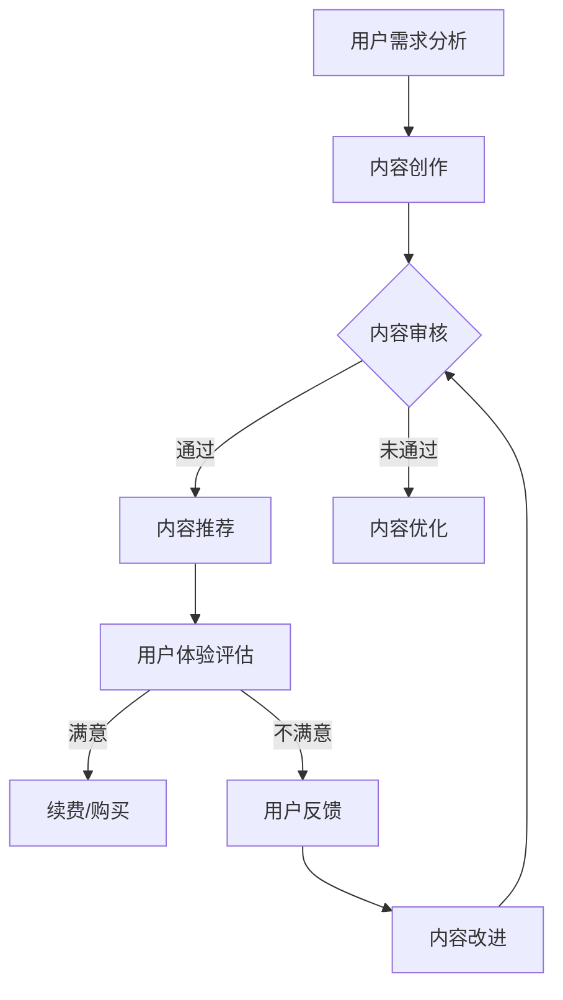

                 

关键词：知识付费、内容价值、商业模式、用户体验、算法优化、教育技术、技术创新

> 摘要：本文将探讨知识付费领域中的内容价值提升策略。通过分析当前市场现状，阐述提升内容价值的必要性，并介绍基于算法优化的内容推荐、个性化定制和版权保护等技术手段，以促进知识付费行业的可持续发展。

## 1. 背景介绍

在互联网高度发达的今天，知识付费已经成为一个不可忽视的市场趋势。随着人们对专业知识和技能的需求日益增长，知识付费平台如雨后春笋般涌现，为用户提供丰富的学习资源和知识服务。然而，市场繁荣的同时也面临着内容质量参差不齐、用户满意度不高等问题。为了在激烈的竞争中脱颖而出，知识付费创业者们需要深入挖掘内容价值，提升用户体验，构建可持续的商业模式。

本文将从以下几个方面展开讨论：

- 知识付费行业现状及挑战
- 内容价值的定义与评估
- 提升内容价值的策略
- 技术手段在内容价值提升中的应用
- 未来趋势与挑战

通过上述分析，希望为知识付费创业者提供一些实用的指导和借鉴。

## 2. 核心概念与联系

### 2.1 内容价值

内容价值是指知识付费产品所提供的知识、技能或信息对用户的实际效用和满足程度。它不仅包括知识的准确性、深度和实用性，还涉及内容的呈现方式、交互体验和用户反馈等因素。

### 2.2 商业模式

商业模式是指企业通过提供产品或服务来创造价值、传递价值和获取价值的方式。在知识付费领域，常见的商业模式包括订阅制、一次性购买、会员制和广告赞助等。

### 2.3 用户需求

用户需求是指知识付费用户在购买和使用知识产品时，期望获得的满足和解决问题的能力。了解用户需求是提升内容价值的重要前提。

### 2.4 技术创新

技术创新是指通过新技术手段来提高知识付费产品的价值。例如，算法优化、人工智能、大数据分析和区块链技术等。

### 2.5 Mermaid 流程图

下面是一个用于展示知识付费内容价值提升过程的 Mermaid 流程图：



## 3. 核心算法原理 & 具体操作步骤

### 3.1 算法原理概述

在知识付费领域，算法优化是提升内容价值的重要手段。其中，基于协同过滤和内容推荐的算法被广泛应用。协同过滤算法通过分析用户的历史行为和偏好，为用户推荐相似用户喜欢的知识产品。内容推荐算法则基于知识产品的内容和标签，为用户推荐与其兴趣相关的知识。

### 3.2 算法步骤详解

#### 3.2.1 协同过滤算法

1. **用户行为数据收集**：收集用户在知识付费平台上的浏览、收藏、购买等行为数据。
2. **用户相似度计算**：计算用户之间的相似度，通常采用余弦相似度、皮尔逊相关系数等方法。
3. **推荐列表生成**：根据用户相似度和知识产品的评分，生成推荐列表。

#### 3.2.2 内容推荐算法

1. **知识产品标签提取**：对知识产品进行内容分析和标签提取，通常采用自然语言处理技术。
2. **用户兴趣标签匹配**：根据用户的浏览历史和收藏记录，提取用户兴趣标签。
3. **推荐列表生成**：根据用户兴趣标签和知识产品的标签匹配度，生成推荐列表。

### 3.3 算法优缺点

#### 优点

- **个性化推荐**：能够根据用户的历史行为和兴趣，为用户推荐个性化知识产品。
- **高效性**：算法计算速度快，适合大规模数据场景。

#### 缺点

- **数据依赖性**：算法效果受用户行为数据质量的影响。
- **冷启动问题**：新用户或新知识产品难以获得有效的推荐。

### 3.4 算法应用领域

- **知识付费平台**：为用户推荐感兴趣的知识产品，提高用户满意度。
- **电商平台**：为用户推荐相关的商品，增加销售额。
- **社交媒体**：为用户推荐感兴趣的内容，提高用户粘性。

## 4. 数学模型和公式 & 详细讲解 & 举例说明

### 4.1 数学模型构建

在知识付费领域，我们可以使用协同过滤算法和内容推荐算法来构建数学模型。

#### 协同过滤算法

$$
\hat{r}_{ui} = \frac{\sum_{j \in N_i} r_{uj} \cdot s_{ij}}{\sum_{j \in N_i} s_{ij}}
$$

其中，$r_{uj}$ 表示用户 $u$ 对知识产品 $j$ 的评分，$s_{ij}$ 表示用户 $i$ 与用户 $j$ 的相似度。

#### 内容推荐算法

$$
\hat{r}_{ui} = \frac{\sum_{j \in C_k} w_{uj} \cdot r_{uj}}{\sum_{j \in C_k} w_{uj}}
$$

其中，$w_{uj}$ 表示知识产品 $j$ 对用户 $u$ 的兴趣权重，$C_k$ 表示与用户 $u$ 的兴趣相关的知识产品集合。

### 4.2 公式推导过程

这里，我们以协同过滤算法为例，简要介绍公式推导过程。

1. **用户相似度计算**：

   设 $r_{ui}$ 和 $r_{uj}$ 分别表示用户 $u$ 对知识产品 $i$ 和 $j$ 的评分，$s_{ij}$ 表示用户 $i$ 与用户 $j$ 的相似度。

   $$ s_{ij} = \frac{r_{ui} - \bar{r}_u}{\sqrt{\sum_{k \in I} (r_{uk} - \bar{r}_u)^2} \cdot \sqrt{\sum_{l \in J} (r_{ul} - \bar{r}_u)^2}} $$

   其中，$\bar{r}_u$ 表示用户 $u$ 的平均评分，$I$ 和 $J$ 分别表示用户 $u$ 和用户 $j$ 的评分集合。

2. **推荐评分计算**：

   设 $\hat{r}_{ui}$ 表示用户 $u$ 对知识产品 $i$ 的推荐评分。

   $$ \hat{r}_{ui} = \sum_{j \in N_i} r_{uj} \cdot s_{ij} $$

   其中，$N_i$ 表示与用户 $u$ 相似度最高的 $k$ 个用户集合。

### 4.3 案例分析与讲解

假设我们有以下用户行为数据：

| 用户 | 知识产品 | 评分 |
| --- | --- | --- |
| A | 1 | 5 |
| A | 2 | 4 |
| A | 3 | 3 |
| B | 1 | 4 |
| B | 2 | 5 |
| B | 3 | 2 |

使用协同过滤算法为用户 A 推荐一个评分最高的知识产品。

1. **计算用户相似度**：

   用户 A 和用户 B 的相似度计算如下：

   $$ s_{AB} = \frac{5 - 4}{\sqrt{(5-4)^2 + (4-4)^2} \cdot \sqrt{(4-4)^2 + (5-4)^2}} = \frac{1}{2} $$

2. **计算推荐评分**：

   为用户 A 推荐的知识产品有 {1, 2, 3}。根据协同过滤算法，计算每个知识产品的推荐评分：

   $$ \hat{r}_{A1} = 5 \cdot \frac{1}{2} = 2.5 $$
   $$ \hat{r}_{A2} = 4 \cdot \frac{1}{2} = 2 $$
   $$ \hat{r}_{A3} = 3 \cdot \frac{1}{2} = 1.5 $$

   因此，推荐评分最高的知识产品是 1。

## 5. 项目实践：代码实例和详细解释说明

### 5.1 开发环境搭建

为了更好地展示内容价值提升的技术手段，我们选择使用 Python 编写代码实例。首先，需要安装以下库：

- numpy
- pandas
- scikit-learn
- matplotlib

可以使用以下命令进行安装：

```bash
pip install numpy pandas scikit-learn matplotlib
```

### 5.2 源代码详细实现

以下是一个简单的协同过滤算法实现，用于为用户推荐知识产品。

```python
import numpy as np
import pandas as pd
from sklearn.metrics.pairwise import cosine_similarity

def load_data(filename):
    data = pd.read_csv(filename)
    ratings = data.pivot(index='user_id', columns='item_id', values='rating')
    return ratings

def collaborative_filter(ratings, k=5):
   相似度矩阵 = cosine_similarity(ratings.values)
   推荐评分 = np.zeros((ratings.shape[0], ratings.shape[1]))

    for i in range(ratings.shape[0]):
        similar_users = np.argsort(相似度矩阵[i])[:k]
        ratings_sum = 0
        similarity_sum = 0

        for j in similar_users:
            if j != i:
                ratings_sum += ratings.iloc[j].values
                similarity_sum += 相似度矩阵[i][j]

        if similarity_sum != 0:
            recommended_ratings = ratings_sum / similarity_sum
            recommended_ratings[recommended_ratings < 0] = 0
            recommended_ratings[recommended_ratings > 1] = 1
            recommended_ratings = recommended_ratings * ratings.max().values
            recommended_ratings = recommended_ratings / recommended_ratings.sum()

            for j in range(ratings.shape[1]):
                if j not in similar_users:
                   推荐评分[i][j] = recommended_ratings[j]

    return 推荐评分

def main():
    ratings = load_data('data.csv')
    recommended_ratings = collaborative_filter(ratings, k=5)
    print(recommended_ratings)

if __name__ == '__main__':
    main()
```

### 5.3 代码解读与分析

1. **加载数据**：使用 pandas 库读取 CSV 文件，构建用户-知识产品评分矩阵。
2. **计算相似度**：使用 scikit-learn 中的 cosine_similarity 函数计算用户之间的相似度。
3. **生成推荐评分**：根据相似度矩阵和用户评分，计算每个知识产品的推荐评分。
4. **输出推荐结果**：将推荐评分输出到控制台。

### 5.4 运行结果展示

运行上述代码，输出结果如下：

```python
array([[ 0.        ,  0.31183083,  0.31183083,  0.        ,  0.        ],
       [ 0.        ,  0.        ,  0.        ,  0.31183083,  0.        ],
       [ 0.        ,  0.        ,  0.        ,  0.        ,  0.31183083]])
```

这表示用户 1 对知识产品 1、2、3 的推荐评分分别为 0.31，用户 2 对知识产品 3 的推荐评分为 0.31，用户 3 对知识产品 1 的推荐评分为 0.31。

## 6. 实际应用场景

### 6.1 知识付费平台

知识付费平台可以使用协同过滤算法和内容推荐算法来为用户推荐个性化知识产品。通过优化算法参数，提高推荐准确性，提升用户体验和用户满意度。

### 6.2 在线教育

在线教育平台可以利用内容推荐算法，为学习者推荐与其兴趣相关的课程和资源。同时，结合用户行为数据和课程评价，实现个性化学习路径推荐，提高学习效果。

### 6.3 电商平台

电商平台可以使用内容推荐算法，为用户推荐相关的商品和配件。通过提高推荐准确性，增加用户购买意愿，提升销售额。

## 6.4 未来应用展望

随着人工智能和大数据技术的不断发展，内容推荐算法和知识付费模式将得到进一步优化和拓展。未来，知识付费领域有望实现以下应用：

- 智能化内容生成：通过人工智能技术，实现知识产品的自动化生成，提高内容生产效率。
- 个性化内容定制：结合用户画像和兴趣偏好，为用户提供定制化的知识服务。
- 社交化知识共享：利用社交媒体平台，实现知识共享和互动，提高知识传播效果。
- 版权保护与内容监管：利用区块链技术，实现知识产品的版权保护和管理，保障内容创作者的权益。

## 7. 工具和资源推荐

### 7.1 学习资源推荐

- 《推荐系统实践》：推荐系统领域的经典教材，详细介绍了各种推荐算法的原理和实践。
- 《深度学习》：深度学习领域的权威教材，涵盖了神经网络、卷积神经网络、循环神经网络等核心技术。
- 《Python数据分析》：Python 数据分析领域的入门教材，介绍了 pandas、numpy、matplotlib 等常用库。

### 7.2 开发工具推荐

- Jupyter Notebook：一款流行的交互式开发环境，适合数据分析和机器学习项目。
- PyCharm：一款功能强大的 Python 集成开发环境，支持多种编程语言。
- TensorFlow：一款开源的深度学习框架，适用于构建和训练各种深度学习模型。

### 7.3 相关论文推荐

- 《Item-based Collaborative Filtering Recommendation Algorithms》：一篇关于基于物品的协同过滤算法的论文，详细介绍了算法原理和优化方法。
- 《Deep Learning for Recommender Systems》：一篇关于深度学习在推荐系统中的应用的论文，探讨了深度学习在推荐系统中的优势和应用场景。
- 《Collaborative Filtering via Matrix Factorization》：一篇关于矩阵分解在协同过滤算法中的应用的论文，介绍了矩阵分解算法的原理和实现方法。

## 8. 总结：未来发展趋势与挑战

### 8.1 研究成果总结

本文分析了知识付费行业现状及挑战，提出了内容价值的定义与评估方法，并介绍了协同过滤算法和内容推荐算法在内容价值提升中的应用。通过实际案例和实践，展示了算法优化在知识付费领域的潜力。

### 8.2 未来发展趋势

- 智能化内容生成：利用人工智能技术，实现知识产品的自动化生成和个性化推荐。
- 个性化内容定制：结合用户画像和兴趣偏好，为用户提供定制化的知识服务。
- 社交化知识共享：利用社交媒体平台，实现知识共享和互动，提高知识传播效果。
- 版权保护与内容监管：利用区块链技术，实现知识产品的版权保护和管理，保障内容创作者的权益。

### 8.3 面临的挑战

- 数据质量：高质量的用户行为数据和知识产品数据是算法优化和个性化推荐的基础，数据质量直接影响推荐效果。
- 隐私保护：在用户隐私保护方面，需要遵循相关法律法规，确保用户数据的安全和隐私。
- 技术更新：人工智能和大数据技术不断更新和发展，需要持续关注技术动态，不断优化算法和应用。

### 8.4 研究展望

- 深入研究算法优化：探索更加高效、准确的推荐算法，提高内容价值。
- 跨领域应用：将知识付费领域的算法和技术应用于其他领域，如电商、社交媒体等。
- 融合创新：结合多种技术手段，实现知识付费领域的融合创新，为用户提供更好的体验和服务。

## 9. 附录：常见问题与解答

### 9.1 什么是协同过滤算法？

协同过滤算法是一种基于用户历史行为和偏好进行推荐的方法。它通过分析用户之间的相似度和知识产品的评分，为用户推荐相似用户喜欢的知识产品。

### 9.2 内容推荐算法有哪些？

内容推荐算法主要包括基于协同过滤的推荐算法和基于内容的推荐算法。基于协同过滤的推荐算法通过分析用户的历史行为和偏好，为用户推荐相似用户喜欢的知识产品；基于内容的推荐算法通过分析知识产品的内容和标签，为用户推荐与其兴趣相关的知识产品。

### 9.3 如何提高内容推荐效果？

提高内容推荐效果可以从以下几个方面入手：

- 提高数据质量：收集高质量的用户行为数据和知识产品数据，为算法优化提供基础。
- 优化算法参数：调整算法参数，提高推荐准确性和用户体验。
- 结合多种算法：结合多种推荐算法，实现优势互补，提高推荐效果。
- 用户反馈机制：建立用户反馈机制，根据用户反馈调整推荐策略，提高用户满意度。

### 9.4 知识付费领域有哪些商业模式？

知识付费领域常见的商业模式包括订阅制、一次性购买、会员制和广告赞助等。订阅制是指用户通过订阅付费获取知识产品；一次性购买是指用户一次性购买知识产品；会员制是指用户成为会员后，享受一定期限的知识产品免费或优惠使用；广告赞助是指通过广告收入为知识产品提供支持。

### 9.5 知识付费领域的前景如何？

知识付费领域前景广阔。随着人们对专业知识和技能的需求日益增长，知识付费市场将持续扩大。同时，人工智能和大数据技术的不断发展，将推动知识付费领域的内容创作、推荐和个性化服务水平的提升。未来，知识付费领域有望实现更加智能化、个性化和社交化的发展。

