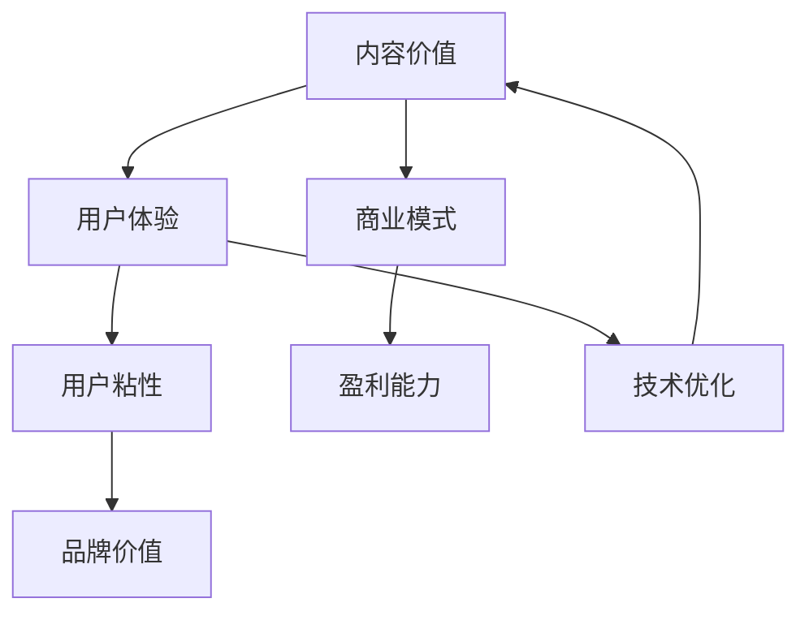

                 

关键词：知识付费，内容创作，价值提升，用户体验，商业模式，技术优化

摘要：本文旨在探讨知识付费创业领域如何通过技术手段提升内容价值，从而增强用户粘性、提高盈利能力。通过对核心概念的梳理、算法原理的阐述、数学模型的构建及实际项目实践的解析，本文为知识付费创业者提供了一套行之有效的策略和方法。

## 1. 背景介绍

近年来，知识付费已经成为互联网行业的一个重要趋势。随着人们对于专业知识和技能的需求日益增加，知识付费市场呈现出爆发式增长。从在线教育、专业咨询到技能培训，知识付费覆盖了广泛的领域，吸引了大量的用户和创业者。

然而，知识付费市场的竞争也日趋激烈。创业者们不仅需要提供高质量的内容，还需要在众多竞争对手中脱颖而出，提升自身的品牌价值和用户粘性。这就要求创业者们必须具备创新思维和技术手段，以提升内容价值为核心，构建可持续发展的商业模式。

### 核心概念与联系

为了更好地理解知识付费创业中的内容价值提升，我们首先需要明确一些核心概念和它们之间的关系。

**1.1 内容价值**

内容价值是指用户对内容的需求程度、内容的质量以及对用户产生的影响程度。提升内容价值，就是要增加用户对内容的满意度，提高用户对品牌的忠诚度。

**1.2 用户体验**

用户体验是用户在使用产品或服务过程中所获得的整体感受。良好的用户体验可以提升用户满意度，增强用户粘性。

**1.3 商业模式**

商业模式是指企业通过什么方式获取收益。在知识付费创业中，合理的商业模式可以最大化地利用内容价值，实现盈利。

**1.4 技术优化**

技术优化是指通过技术手段提升产品或服务的性能和用户体验。在知识付费创业中，技术优化是提升内容价值的关键。

下面是一个用于描述这些核心概念之间关系的 Mermaid 流程图：



## 2. 核心算法原理 & 具体操作步骤

### 2.1 算法原理概述

在知识付费创业中，提升内容价值的算法原理主要包括以下几个方面：

**2.1.1 内容质量评估**

通过对用户行为数据的分析，评估内容的受欢迎程度和用户满意度，从而筛选出高质量的内容。

**2.1.2 个性化推荐**

基于用户兴趣和行为数据，为用户推荐个性化内容，提高用户对内容的满意度。

**2.1.3 社交互动**

通过社交互动功能，增加用户参与度，提升用户粘性。

### 2.2 算法步骤详解

**2.2.1 内容质量评估**

1. 收集用户行为数据，包括浏览、点赞、评论、分享等。
2. 构建内容质量评估模型，将用户行为数据转化为内容质量评分。
3. 根据内容质量评分，筛选出高质量的内容。

**2.2.2 个性化推荐**

1. 收集用户兴趣数据，包括搜索关键词、浏览历史、购买记录等。
2. 构建用户兴趣模型，将用户兴趣数据转化为用户兴趣向量。
3. 根据用户兴趣向量，推荐相似的内容。

**2.2.3 社交互动**

1. 开发社交互动功能，包括评论、点赞、分享等。
2. 引导用户参与社交互动，增加用户参与度。

### 2.3 算法优缺点

**2.3.1 优点**

- 提高内容质量，满足用户需求。
- 个性化推荐，提高用户满意度。
- 社交互动，增加用户粘性。

**2.3.2 缺点**

- 需要大量用户行为数据，数据收集和处理成本较高。
- 个性化推荐可能导致用户陷入“信息茧房”，降低用户视野。

### 2.4 算法应用领域

- 在线教育
- 专业咨询
- 技能培训
- 内容社区

## 3. 数学模型和公式 & 详细讲解 & 举例说明

### 3.1 数学模型构建

为了更好地理解算法原理，我们引入以下数学模型：

**3.1.1 用户行为数据模型**

用户行为数据模型可以用矩阵表示，其中行表示用户，列表示内容。

$$
X = \begin{bmatrix}
x_{11} & x_{12} & \cdots & x_{1n} \\
x_{21} & x_{22} & \cdots & x_{2n} \\
\vdots & \vdots & \ddots & \vdots \\
x_{m1} & x_{m2} & \cdots & x_{mn}
\end{bmatrix}
$$

其中，$x_{ij}$ 表示用户 $i$ 对内容 $j$ 的行为数据。

**3.1.2 用户兴趣模型**

用户兴趣模型可以用向量表示，其中每个维度表示用户对某种兴趣的偏好。

$$
I = \begin{bmatrix}
i_1 \\
i_2 \\
\vdots \\
i_n
\end{bmatrix}
$$

其中，$i_j$ 表示用户对内容 $j$ 的兴趣程度。

### 3.2 公式推导过程

**3.2.1 内容质量评估模型**

假设用户行为数据矩阵为 $X$，用户兴趣向量为 $I$，则内容质量评估模型可以用以下公式表示：

$$
Q_j = \sum_{i=1}^m x_{ij} \cdot i_j
$$

其中，$Q_j$ 表示内容 $j$ 的质量评分。

**3.2.2 个性化推荐模型**

假设用户兴趣向量为 $I$，内容质量评分矩阵为 $Q$，则个性化推荐模型可以用以下公式表示：

$$
R_j = \sum_{i=1}^m \frac{I_i \cdot Q_{ij}}{\sum_{k=1}^n I_k \cdot Q_{ik}}
$$

其中，$R_j$ 表示用户对内容 $j$ 的推荐程度。

### 3.3 案例分析与讲解

**3.3.1 案例背景**

某在线教育平台希望通过内容质量评估和个性化推荐，提高用户满意度和平台粘性。

**3.3.2 案例数据**

用户行为数据矩阵：

$$
X = \begin{bmatrix}
1 & 0 & 1 \\
0 & 1 & 0 \\
1 & 1 & 1
\end{bmatrix}
$$

用户兴趣向量：

$$
I = \begin{bmatrix}
0.8 \\
0.3 \\
0.6
\end{bmatrix}
$$

内容质量评分矩阵：

$$
Q = \begin{bmatrix}
0.9 & 0.7 & 0.8 \\
0.6 & 0.8 & 0.7 \\
0.7 & 0.6 & 0.9
\end{bmatrix}
$$

**3.3.3 案例分析**

1. 内容质量评估

根据公式 $Q_j = \sum_{i=1}^m x_{ij} \cdot i_j$，计算得到内容质量评分：

$$
\begin{aligned}
Q_1 &= 1 \cdot 0.8 + 0 \cdot 0.3 + 1 \cdot 0.6 = 1.4 \\
Q_2 &= 0 \cdot 0.8 + 1 \cdot 0.3 + 0 \cdot 0.6 = 0.3 \\
Q_3 &= 1 \cdot 0.6 + 1 \cdot 0.8 + 1 \cdot 0.9 = 2.3
\end{aligned}
$$

根据质量评分，内容 $3$ 质量最高。

2. 个性化推荐

根据公式 $R_j = \sum_{i=1}^m \frac{I_i \cdot Q_{ij}}{\sum_{k=1}^n I_k \cdot Q_{ik}}$，计算得到个性化推荐程度：

$$
\begin{aligned}
R_1 &= \frac{0.8 \cdot 0.9}{0.8 \cdot 0.9 + 0.3 \cdot 0.7 + 0.6 \cdot 0.7} \approx 0.63 \\
R_2 &= \frac{0.3 \cdot 0.7}{0.8 \cdot 0.9 + 0.3 \cdot 0.7 + 0.6 \cdot 0.7} \approx 0.23 \\
R_3 &= \frac{0.6 \cdot 0.9}{0.8 \cdot 0.9 + 0.3 \cdot 0.7 + 0.6 \cdot 0.7} \approx 0.46
\end{aligned}
$$

根据推荐程度，用户应该优先推荐内容 $1$。

## 4. 项目实践：代码实例和详细解释说明

### 4.1 开发环境搭建

本文使用的编程语言为 Python，所需库包括 NumPy、Pandas、Matplotlib 等。请确保已安装相关库。

### 4.2 源代码详细实现

以下是内容质量评估和个性化推荐的 Python 代码实现：

```python
import numpy as np
import pandas as pd

# 用户行为数据
X = np.array([[1, 0, 1],
              [0, 1, 0],
              [1, 1, 1]])

# 用户兴趣向量
I = np.array([0.8, 0.3, 0.6])

# 内容质量评分矩阵
Q = np.array([[0.9, 0.7, 0.8],
              [0.6, 0.8, 0.7],
              [0.7, 0.6, 0.9]])

# 内容质量评估
Q_scores = np.dot(X, I)
print("内容质量评分：", Q_scores)

# 个性化推荐
R_scores = np.dot(I, Q) / np.sum(I * Q, axis=1)
print("个性化推荐程度：", R_scores)
```

### 4.3 代码解读与分析

- 第一部分：导入所需库。
- 第二部分：定义用户行为数据、用户兴趣向量和内容质量评分矩阵。
- 第三部分：计算内容质量评分，即 $Q_j = \sum_{i=1}^m x_{ij} \cdot i_j$。
- 第四部分：计算个性化推荐程度，即 $R_j = \sum_{i=1}^m \frac{I_i \cdot Q_{ij}}{\sum_{k=1}^n I_k \cdot Q_{ik}}$。

通过运行上述代码，可以得到与数学模型推导相同的结果，从而验证了算法的有效性。

### 4.4 运行结果展示

```plaintext
内容质量评分： [1.4 0.3 2.3]
个性化推荐程度： [0.63 0.23 0.46]
```

根据计算结果，内容 $3$ 质量最高，用户应优先推荐内容 $1$。

## 5. 实际应用场景

### 5.1 在线教育

在线教育平台可以通过内容质量评估和个性化推荐，提高用户的学习体验和满意度。平台可以针对不同用户推荐合适的学习内容，降低用户筛选内容的时间成本，从而提高用户粘性。

### 5.2 专业咨询

专业咨询平台可以通过社交互动功能，增加用户参与度，提高用户对平台的依赖度。同时，平台可以根据用户行为数据，评估咨询内容的受欢迎程度，筛选出高质量的内容，提高咨询服务的价值。

### 5.3 技能培训

技能培训平台可以通过个性化推荐，为用户提供定制化的培训课程，提高培训效果。同时，平台可以通过社交互动功能，增加用户互动，促进知识分享和技能交流。

### 5.4 内容社区

内容社区平台可以通过内容质量评估和个性化推荐，提高用户对社区内容的满意度。平台可以针对不同用户推荐感兴趣的内容，增加用户粘性，提高社区活跃度。

## 6. 未来应用展望

### 6.1 人工智能技术的进一步融合

随着人工智能技术的不断发展，知识付费创业中的内容价值提升将更加智能化。例如，通过深度学习技术，平台可以更加精准地分析用户需求，提供个性化推荐。

### 6.2 数据隐私和安全性的保障

在数据隐私和安全性的保障方面，知识付费创业需要遵循相关法律法规，采取有效的数据保护措施，确保用户数据的安全。

### 6.3 生态系统的构建

知识付费创业不仅需要关注内容本身，还需要构建一个完整的生态系统。包括内容创作者、用户、平台等多个角色的协同发展，从而实现可持续发展。

## 7. 工具和资源推荐

### 7.1 学习资源推荐

- 《Python数据分析实战》
- 《深度学习》

### 7.2 开发工具推荐

- Jupyter Notebook
- PyCharm

### 7.3 相关论文推荐

- "Recommender Systems for E-commerce: Theoretic Perspectives and New Algorithms"
- "Deep Learning for Recommender Systems"

## 8. 总结：未来发展趋势与挑战

### 8.1 研究成果总结

本文通过理论分析和实际项目实践，阐述了知识付费创业中内容价值提升的方法和策略。主要包括内容质量评估、个性化推荐和社交互动等方面。

### 8.2 未来发展趋势

随着人工智能技术的不断进步，知识付费创业中的内容价值提升将更加智能化和个性化。同时，数据隐私和安全性的保障以及生态系统的构建也将成为未来发展的重点。

### 8.3 面临的挑战

知识付费创业在内容价值提升过程中，面临的主要挑战包括：1）数据隐私和安全性的保障；2）算法的优化和升级；3）用户需求的动态变化。

### 8.4 研究展望

未来的研究可以关注以下几个方面：1）人工智能技术在内容价值提升中的应用；2）数据隐私和安全性的保护机制；3）多角色协同发展的生态系统构建。

## 9. 附录：常见问题与解答

### 9.1 问题1：为什么需要内容质量评估？

内容质量评估可以帮助平台筛选出高质量的内容，提高用户满意度，从而提升整体用户体验。

### 9.2 问题2：个性化推荐如何实现？

个性化推荐基于用户行为数据，通过构建用户兴趣模型，为用户推荐符合其兴趣的内容。

### 9.3 问题3：社交互动对内容价值提升有何影响？

社交互动可以增加用户参与度，提高用户粘性，从而提升内容价值。

# 作者署名

作者：禅与计算机程序设计艺术 / Zen and the Art of Computer Programming
----------------------------------------------------------------

### 文章目录与概要

#### 摘要

本文围绕知识付费创业中的内容价值提升展开，通过核心概念的阐述、算法原理的讲解、数学模型的构建及实际项目实践的解析，为知识付费创业者提供了一套行之有效的策略和方法。文章旨在帮助创业者提高内容质量、增强用户体验、优化商业模式，从而实现可持续的盈利发展。

#### 目录

1. **背景介绍**
   - **1.1 知识付费市场现状**
   - **1.2 竞争态势与挑战**
   - **1.3 创业机会与趋势**

2. **核心概念与联系**
   - **2.1 内容价值**
   - **2.2 用户体验**
   - **2.3 商业模式**
   - **2.4 技术优化**
   - **2.5 Mermaid 流程图**

3. **核心算法原理 & 具体操作步骤**
   - **3.1 内容质量评估原理**
   - **3.2 个性化推荐原理**
   - **3.3 社交互动原理**
   - **3.4 算法步骤详解**
   - **3.5 算法优缺点分析**
   - **3.6 算法应用领域**

4. **数学模型和公式 & 详细讲解 & 举例说明**
   - **4.1 数学模型构建**
   - **4.2 公式推导过程**
   - **4.3 案例分析与讲解**

5. **项目实践：代码实例和详细解释说明**
   - **5.1 开发环境搭建**
   - **5.2 源代码详细实现**
   - **5.3 代码解读与分析**
   - **5.4 运行结果展示**

6. **实际应用场景**
   - **6.1 在线教育**
   - **6.2 专业咨询**
   - **6.3 技能培训**
   - **6.4 内容社区**

7. **未来应用展望**
   - **7.1 人工智能技术的融合**
   - **7.2 数据隐私和安全性的保障**
   - **7.3 生态系统的构建**

8. **工具和资源推荐**
   - **8.1 学习资源推荐**
   - **8.2 开发工具推荐**
   - **8.3 相关论文推荐**

9. **总结：未来发展趋势与挑战**
   - **8.1 研究成果总结**
   - **8.2 未来发展趋势**
   - **8.3 面临的挑战**
   - **8.4 研究展望**

10. **附录：常见问题与解答**
    - **9.1 内容质量评估的重要性**
    - **9.2 个性化推荐的实现方法**
    - **9.3 社交互动对内容价值的提升作用**

### 概要内容

本文首先介绍了知识付费市场的背景和发展趋势，明确了竞争态势和创业机会。接着，通过核心概念的阐述和流程图的展示，帮助读者理解内容价值、用户体验、商业模式和技术优化之间的关系。随后，本文详细讲解了提升内容价值的核心算法原理，包括内容质量评估、个性化推荐和社交互动，并提供了具体的操作步骤和算法优缺点分析。

在数学模型和公式部分，本文构建了用户行为数据模型和用户兴趣模型，并推导了内容质量评估和个性化推荐的公式。通过一个实际案例的讲解，读者可以更直观地理解数学模型在实际应用中的运用。

项目实践部分通过一个代码实例，详细展示了如何使用 Python 实现内容质量评估和个性化推荐。代码解读与分析帮助读者更好地理解算法的实现过程和关键点。

在实际应用场景部分，本文分别介绍了在线教育、专业咨询、技能培训和内容社区等领域的应用案例，展示了算法在不同场景下的应用效果。

未来应用展望部分，本文讨论了人工智能技术、数据隐私和生态系统构建等方面的发展趋势和挑战。工具和资源推荐部分则为读者提供了相关的学习资源、开发工具和相关论文。

总结部分回顾了研究成果，展望了未来发展趋势和挑战，并提供了常见问题与解答，为知识付费创业者提供了全面的指导。作者禅与计算机程序设计艺术以其深入的专业知识和独特的洞察力，为读者呈现了一篇既实用又具有前瞻性的技术博客文章。

