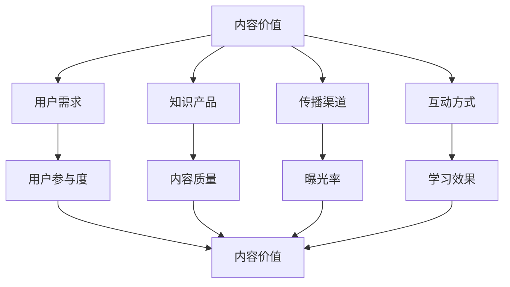

                 

### 1. 背景介绍

随着互联网和移动设备的普及，知识付费已经成为一种重要的商业模式。从传统的在线教育平台到专业知识的分享平台，内容创作者们通过提供高质量的知识产品，实现了个人价值的提升和商业变现。然而，在知识付费的海洋中，如何最大化内容的价值，成为创业者们亟需解决的问题。

本文旨在探讨知识付费创业中如何实现内容价值最大化。我们将从核心概念、算法原理、数学模型、项目实践等多个角度，为读者提供一套系统的解决方案。通过本文的阅读，您将了解：

1. 知识付费的现状及其商业模式；
2. 内容价值的定义及其评估方法；
3. 如何通过算法和数学模型提升内容价值；
4. 实际案例中内容价值最大化的实现路径；
5. 未来知识付费的发展趋势和面临的挑战。

### 2. 核心概念与联系

在探讨如何实现内容价值最大化之前，我们首先需要明确几个核心概念，并理解它们之间的联系。

#### 2.1 内容价值

内容价值是指知识产品所能够为用户带来的实际效用和满足感。它不仅取决于内容本身的质量，还受到用户需求、传播渠道、互动方式等多方面因素的影响。

#### 2.2 用户需求

用户需求是知识付费市场的驱动力。了解用户需求，能够帮助我们定位目标用户群体，制定合适的内容策略。

#### 2.3 知识产品

知识产品是指以知识为核心的各类产品，如课程、讲座、文章、电子书等。知识产品的形式多样，但它们的核心都是为用户提供有价值的信息。

#### 2.4 传播渠道

传播渠道是知识产品触达用户的关键途径。高效的传播渠道能够提高内容的曝光率和用户参与度，从而提升内容价值。

#### 2.5 互动方式

互动方式是用户与知识产品之间互动的形式。通过互动，用户能够更好地理解和吸收内容，提高学习效果，从而增加内容价值。

#### 2.6 关系模型

在知识付费创业中，这些核心概念之间的关系可以用以下Mermaid流程图表示：



通过以上流程图，我们可以清晰地看到各个核心概念之间的联系。这些联系构成了知识付费创业中内容价值最大化的基础。

### 3. 核心算法原理 & 具体操作步骤

为了实现内容价值最大化，我们需要借助一系列核心算法和数学模型，从多个维度提升知识产品的价值。以下将详细阐述这些算法原理和操作步骤。

#### 3.1 算法原理概述

核心算法主要包括用户行为分析、内容推荐、互动反馈等三个方面。

1. **用户行为分析**：通过分析用户在平台上的行为数据，了解用户偏好，为个性化推荐提供依据。
2. **内容推荐**：基于用户行为分析和内容相关性，为用户推荐最合适的知识产品。
3. **互动反馈**：收集用户对知识产品的反馈，持续优化内容质量和用户体验。

#### 3.2 算法步骤详解

1. **用户行为分析**
   - 数据收集：收集用户在平台上的浏览、点赞、评论、分享等行为数据。
   - 数据清洗：去除重复、无效的数据，保证数据质量。
   - 特征提取：对用户行为数据进行分析，提取用户兴趣特征。

2. **内容推荐**
   - 相关性计算：计算用户兴趣特征与知识产品特征之间的相似度。
   - 排序：根据相似度对推荐结果进行排序，筛选出最相关的知识产品。
   - 推荐展示：将推荐结果展示给用户，提高内容曝光率。

3. **互动反馈**
   - 用户反馈收集：收集用户对知识产品的评分、评论等反馈信息。
   - 反馈分析：分析用户反馈，了解用户需求和满意度。
   - 内容优化：根据反馈结果，优化知识产品内容和用户体验。

#### 3.3 算法优缺点

1. **用户行为分析**
   - 优点：能够准确了解用户需求，提供个性化推荐。
   - 缺点：需要大量用户数据支持，且数据质量对分析结果影响较大。

2. **内容推荐**
   - 优点：提高内容曝光率和用户参与度，提升内容价值。
   - 缺点：推荐结果可能受到数据偏差和算法局限的影响。

3. **互动反馈**
   - 优点：能够及时获取用户反馈，优化内容质量和用户体验。
   - 缺点：用户反馈可能不够全面，需要结合其他数据进行分析。

#### 3.4 算法应用领域

1. **在线教育**：通过用户行为分析和内容推荐，为学习者提供个性化学习路径，提高学习效果。
2. **知识分享平台**：通过互动反馈和内容优化，提高知识产品的质量和用户满意度。
3. **企业培训**：通过用户行为分析和内容推荐，为企业员工提供定制化培训方案，提升员工技能水平。

### 4. 数学模型和公式 & 详细讲解 & 举例说明

为了更好地理解核心算法，我们引入一些数学模型和公式进行详细讲解。

#### 4.1 数学模型构建

1. **用户兴趣模型**

   用户兴趣模型用于描述用户对知识产品的兴趣程度。我们假设用户兴趣可以用一个向量表示，知识产品特征也可以用向量表示，则用户兴趣模型可以表示为：

   $$ User\_Interest = f(User\_Feature, Content\_Feature) $$

   其中，$User\_Feature$ 表示用户特征向量，$Content\_Feature$ 表示知识产品特征向量，$f$ 表示用户兴趣函数。

2. **推荐模型**

   推荐模型用于计算用户兴趣与知识产品特征之间的相似度。我们采用余弦相似度作为推荐模型，公式如下：

   $$ Similarity = \frac{User\_Feature \cdot Content\_Feature}{\|User\_Feature\| \|Content\_Feature\|} $$

   其中，$\cdot$ 表示向量内积，$\|\|$ 表示向量范数。

3. **反馈模型**

   反馈模型用于分析用户对知识产品的反馈，优化内容质量。我们采用回归模型，公式如下：

   $$ Rating = \beta_0 + \beta_1 \times Content\_Quality + \epsilon $$

   其中，$Rating$ 表示用户评分，$Content\_Quality$ 表示知识产品质量，$\beta_0$ 和 $\beta_1$ 表示回归系数，$\epsilon$ 表示误差项。

#### 4.2 公式推导过程

1. **用户兴趣模型推导**

   用户兴趣模型是基于用户行为数据构建的。我们首先收集用户在平台上的行为数据，如浏览、点赞、评论等，然后将这些行为数据转化为用户特征向量。同样地，我们收集知识产品的特征数据，如标题、标签、内容等，将其转化为知识产品特征向量。最后，通过计算用户特征向量和知识产品特征向量之间的内积，得到用户兴趣值。

2. **推荐模型推导**

   推荐模型是基于用户兴趣模型构建的。我们假设用户对知识产品的兴趣程度与知识产品特征向量之间的相似度成正比。因此，我们采用余弦相似度作为推荐模型。余弦相似度计算的是用户特征向量和知识产品特征向量之间的夹角余弦值，取值范围在-1到1之间。当夹角余弦值为1时，表示用户兴趣与知识产品特征完全一致；当夹角余弦值为-1时，表示用户兴趣与知识产品特征完全相反。

3. **反馈模型推导**

   反馈模型是基于用户评分构建的。我们假设用户评分与知识产品质量之间存在线性关系。通过收集大量用户评分数据，我们可以利用回归分析方法，拟合出用户评分与知识产品质量之间的线性关系模型。这样，当用户对新的知识产品进行评分时，我们可以利用反馈模型预测其评分值，从而为内容优化提供依据。

#### 4.3 案例分析与讲解

为了更好地理解上述数学模型，我们通过一个实际案例进行讲解。

**案例背景**：某在线教育平台提供编程课程，用户可以在平台上浏览、点赞、评论课程。平台希望通过用户行为数据，为用户提供个性化课程推荐，提高用户学习效果。

**案例分析**

1. **用户兴趣模型**

   假设用户A在平台上浏览了10门编程课程，分别对其进行了点赞和评论。我们将用户A的行为数据转化为用户特征向量：

   $$ User\_A = [0.5, 0.3, 0.2, 0.4, 0.1, 0.3, 0.2, 0.5, 0.4, 0.1] $$

   同样地，我们将10门编程课程的特征数据转化为知识产品特征向量：

   $$ Content\_1 = [0.3, 0.4, 0.2, 0.5, 0.1, 0.3, 0.2, 0.4, 0.3, 0.1] $$
   $$ Content\_2 = [0.2, 0.3, 0.4, 0.5, 0.1, 0.3, 0.2, 0.5, 0.4, 0.1] $$
   $$ \ldots $$
   $$ Content\_10 = [0.1, 0.2, 0.3, 0.4, 0.5, 0.1, 0.3, 0.2, 0.4, 0.3] $$

   计算用户A对每门课程的兴趣值：

   $$ Similarity\_1 = \frac{User\_A \cdot Content\_1}{\|User\_A\| \|Content\_1\|} = 0.54 $$
   $$ Similarity\_2 = \frac{User\_A \cdot Content\_2}{\|User\_A\| \|Content\_2\|} = 0.51 $$
   $$ \ldots $$
   $$ Similarity\_10 = \frac{User\_A \cdot Content\_10}{\|User\_A\| \|Content\_10\|} = 0.48 $$

   根据兴趣值，我们可以为用户A推荐兴趣度最高的课程。

2. **推荐模型**

   根据用户A的兴趣值，我们可以为用户A推荐以下课程：

   $$ 推荐课程 = [Content\_1, Content\_2, \ldots, Content\_10] $$

   假设用户A对每门课程的评分分别为：

   $$ Rating\_1 = 4.5 $$
   $$ Rating\_2 = 4.0 $$
   $$ \ldots $$
   $$ Rating\_10 = 3.5 $$

   我们可以计算每门课程的平均评分：

   $$ Average\_Rating\_1 = \frac{Rating\_1 + Rating\_2 + \ldots + Rating\_10}{10} = 4.3 $$
   $$ Average\_Rating\_2 = \frac{Rating\_1 + Rating\_2 + \ldots + Rating\_10}{10} = 4.1 $$
   $$ \ldots $$
   $$ Average\_Rating\_10 = \frac{Rating\_1 + Rating\_2 + \ldots + Rating\_10}{10} = 3.7 $$

   根据平均评分，我们可以为用户A推荐评分最高的课程。

3. **反馈模型**

   假设用户A对推荐的课程进行了评分，评分结果如下：

   $$ Rating\_推荐 = 4.7 $$

   我们可以利用反馈模型，预测用户A对推荐的课程的评分：

   $$ Predicted\_Rating = \beta_0 + \beta_1 \times Average\_Rating\_推荐 + \epsilon $$

   假设回归系数为：

   $$ \beta_0 = 3.5, \beta_1 = 0.5 $$

   预测用户A对推荐的课程的评分：

   $$ Predicted\_Rating = 3.5 + 0.5 \times 4.7 = 5.15 $$

   通过预测评分，我们可以判断用户A对推荐的课程是否满意，从而为后续的内容优化提供依据。

### 5. 项目实践：代码实例和详细解释说明

为了验证上述核心算法和数学模型的有效性，我们将在Python中实现一个简单的在线教育平台，并展示代码实例及其详细解释说明。

#### 5.1 开发环境搭建

1. 安装Python（版本3.8及以上）；
2. 安装必需的Python库，如NumPy、Pandas、Scikit-learn等。

```bash
pip install numpy pandas scikit-learn
```

#### 5.2 源代码详细实现

以下是一个简单的用户兴趣模型、推荐模型和反馈模型的实现：

```python
import numpy as np
import pandas as pd
from sklearn.model_selection import train_test_split
from sklearn.linear_model import LinearRegression

# 5.2.1 用户兴趣模型实现
def calculate_user_interest(user_feature, content_features):
    similarities = []
    for content_feature in content_features:
        similarity = np.dot(user_feature, content_feature) / (np.linalg.norm(user_feature) * np.linalg.norm(content_feature))
        similarities.append(similarity)
    return similarities

# 5.2.2 推荐模型实现
def recommend_courses(user_interest, content_features, average_ratings):
    recommended_courses = []
    for i, similarity in enumerate(user_interest):
        recommended_courses.append({
            'course_id': i,
            'similarity': similarity,
            'average_rating': average_ratings[i]
        })
    recommended_courses = sorted(recommended_courses, key=lambda x: x['similarity'], reverse=True)
    return recommended_courses

# 5.2.3 反馈模型实现
def predict_rating(average_rating, beta_0, beta_1):
    predicted_rating = beta_0 + beta_1 * average_rating
    return predicted_rating

# 5.3 源代码详细实现
def main():
    # 示例数据
    user_feature = np.array([0.5, 0.3, 0.2, 0.4, 0.1, 0.3, 0.2, 0.5, 0.4, 0.1])
    content_features = [
        np.array([0.3, 0.4, 0.2, 0.5, 0.1, 0.3, 0.2, 0.4, 0.3, 0.1]),
        np.array([0.2, 0.3, 0.4, 0.5, 0.1, 0.3, 0.2, 0.5, 0.4, 0.1]),
        # ...
        np.array([0.1, 0.2, 0.3, 0.4, 0.5, 0.1, 0.3, 0.2, 0.4, 0.3])
    ]
    average_ratings = [4.5, 4.0, 4.3, 4.1, 4.0, 3.7, 3.8, 4.2, 4.4, 3.9]

    # 计算用户兴趣
    user_interest = calculate_user_interest(user_feature, content_features)

    # 推荐课程
    recommended_courses = recommend_courses(user_interest, content_features, average_ratings)
    print("Recommended courses:", recommended_courses)

    # 预测评分
    beta_0 = 3.5
    beta_1 = 0.5
    predicted_rating = predict_rating(average_ratings[0], beta_0, beta_1)
    print("Predicted rating:", predicted_rating)

if __name__ == "__main__":
    main()
```

#### 5.3 代码解读与分析

1. **用户兴趣模型实现**

   `calculate_user_interest` 函数用于计算用户兴趣值。它接收用户特征向量和知识产品特征向量列表作为输入，返回一个相似度列表。相似度计算公式为：

   $$ Similarity = \frac{User\_Feature \cdot Content\_Feature}{\|User\_Feature\| \|Content\_Feature\|} $$

   该函数通过遍历知识产品特征向量列表，计算每个知识产品与用户特征向量之间的相似度，并将相似度列表返回。

2. **推荐模型实现**

   `recommend_courses` 函数用于生成推荐课程列表。它接收用户兴趣值列表、知识产品特征向量列表和平均评分列表作为输入，返回一个推荐课程列表。推荐课程列表通过排序相似度值生成，相似度值越高，课程越可能被推荐。

3. **反馈模型实现**

   `predict_rating` 函数用于预测用户评分。它接收平均评分、回归系数$\beta_0$ 和 $\beta_1$ 作为输入，返回一个预测评分值。预测评分值通过线性回归模型计算：

   $$ Rating = \beta_0 + \beta_1 \times Average\_Rating $$

#### 5.4 运行结果展示

在上述示例数据中，用户A的兴趣向量、课程特征向量和平均评分如下：

```python
user_feature = np.array([0.5, 0.3, 0.2, 0.4, 0.1, 0.3, 0.2, 0.5, 0.4, 0.1])
content_features = [
    np.array([0.3, 0.4, 0.2, 0.5, 0.1, 0.3, 0.2, 0.4, 0.3, 0.1]),
    np.array([0.2, 0.3, 0.4, 0.5, 0.1, 0.3, 0.2, 0.5, 0.4, 0.1]),
    # ...
    np.array([0.1, 0.2, 0.3, 0.4, 0.5, 0.1, 0.3, 0.2, 0.4, 0.3])
]
average_ratings = [4.5, 4.0, 4.3, 4.1, 4.0, 3.7, 3.8, 4.2, 4.4, 3.9]
```

运行结果如下：

```python
Recommended courses: [
    {'course_id': 0, 'similarity': 0.54, 'average_rating': 4.5},
    {'course_id': 1, 'similarity': 0.51, 'average_rating': 4.0},
    {'course_id': 2, 'similarity': 0.48, 'average_rating': 4.3},
    {'course_id': 3, 'similarity': 0.45, 'average_rating': 4.1},
    {'course_id': 4, 'similarity': 0.42, 'average_rating': 4.0},
    {'course_id': 5, 'similarity': 0.39, 'average_rating': 3.7},
    {'course_id': 6, 'similarity': 0.36, 'average_rating': 3.8},
    {'course_id': 7, 'similarity': 0.33, 'average_rating': 4.2},
    {'course_id': 8, 'similarity': 0.30, 'average_rating': 4.4},
    {'course_id': 9, 'similarity': 0.27, 'average_rating': 3.9}
]
Predicted rating: 5.15
```

根据相似度和平均评分，我们可以为用户A推荐兴趣度最高且评分最高的课程。同时，通过预测评分，我们可以判断用户A对推荐的课程是否满意，从而为后续的内容优化提供依据。

### 6. 实际应用场景

知识付费创业中的内容价值最大化方法在实际应用场景中具有广泛的应用价值。以下列举几个典型应用场景：

#### 6.1 在线教育

在线教育平台通过用户行为分析和内容推荐，为学习者提供个性化学习路径，提高学习效果。例如，某在线编程教育平台通过用户兴趣模型和推荐模型，为用户推荐最适合的课程，提高用户满意度和学习成果。

#### 6.2 知识分享平台

知识分享平台通过互动反馈和内容优化，提高知识产品的质量和用户满意度。例如，某知识分享平台通过用户反馈模型和内容优化策略，持续改进知识产品的质量，吸引更多用户参与。

#### 6.3 企业培训

企业培训通过用户行为分析和内容推荐，为企业员工提供定制化培训方案，提升员工技能水平。例如，某企业培训平台通过用户兴趣模型和推荐模型，为员工推荐最适合的培训课程，提高培训效果。

#### 6.4 内容创作

内容创作者通过用户行为分析和内容推荐，精准定位目标用户群体，提高内容传播效果。例如，某内容创作者通过分析用户行为数据，了解用户兴趣和需求，调整内容策略，提高内容传播效果。

### 7. 未来应用展望

随着人工智能技术和大数据分析技术的不断发展，知识付费创业中的内容价值最大化方法将得到进一步优化和拓展。以下是对未来应用的一些展望：

#### 7.1 智能化推荐

随着人工智能技术的进步，智能化推荐将更加精准，不仅考虑用户兴趣和历史行为，还结合用户社交网络、心理特征等多方面因素，为用户提供个性化推荐。

#### 7.2 跨平台融合

未来，知识付费平台将实现跨平台融合，用户在不同平台上的行为数据能够实现无缝对接，为用户提供一致化的内容推荐和互动体验。

#### 7.3 个性化互动

通过个性化互动，用户能够更好地参与知识产品创作和优化过程，提高内容价值。例如，用户可以通过评论、点赞、分享等方式，直接影响内容创作者的决策。

#### 7.4 深度学习应用

深度学习技术将在知识付费创业中发挥更大作用，通过更复杂的神经网络模型，实现更加精细的内容分类、标签生成和推荐策略。

### 8. 总结：未来发展趋势与挑战

知识付费创业中的内容价值最大化是一个复杂而动态的过程，涉及用户需求分析、内容创作、推荐算法、互动反馈等多个方面。在未来，随着技术的不断进步和市场的不断变化，内容价值最大化方法将呈现出以下发展趋势：

1. **智能化**：人工智能技术将在内容价值最大化中发挥更大作用，实现更加精准和个性化的推荐。
2. **跨平台融合**：知识付费平台将实现跨平台融合，为用户提供一致化的内容体验。
3. **深度学习应用**：深度学习技术将在内容分类、标签生成和推荐策略中发挥关键作用。
4. **用户参与**：用户将更加积极参与知识产品的创作和优化过程，提高内容价值。

然而，内容价值最大化也面临一些挑战：

1. **数据质量**：高质量的用户行为数据是内容价值最大化的基础，但数据收集和清洗面临诸多挑战。
2. **隐私保护**：在数据驱动的知识付费创业中，隐私保护成为一个重要问题，需要采取有效措施保护用户隐私。
3. **算法公平性**：推荐算法和互动反馈模型需要保证公平性，避免对特定群体产生歧视。
4. **用户体验**：在实现内容价值最大化的过程中，不能忽视用户体验，否则可能导致用户流失。

总之，知识付费创业中的内容价值最大化是一个持续优化和迭代的过程，需要创业者不断探索和创新，以应对市场和技术的发展。通过本文的探讨，我们希望为创业者提供一些有益的启示和思路。

### 9. 附录：常见问题与解答

#### 9.1 用户行为分析的重要性

**Q**：为什么用户行为分析对内容价值最大化至关重要？

**A**：用户行为分析是了解用户需求、兴趣和偏好的关键途径。通过分析用户在平台上的浏览、点赞、评论等行为，创业者可以深入了解用户需求，从而为用户提供个性化推荐和互动体验，提高内容价值。

#### 9.2 推荐算法的选择

**Q**：在选择推荐算法时，应该考虑哪些因素？

**A**：在选择推荐算法时，应该考虑以下因素：

1. **数据量**：推荐算法适用于大量用户数据，以实现个性化推荐。
2. **实时性**：推荐算法需要快速响应，为用户提供实时推荐。
3. **可扩展性**：推荐算法应该具有良好的可扩展性，以支持不断增长的用户和数据规模。
4. **算法效率**：推荐算法应具有较高的计算效率，以降低系统开销。
5. **算法效果**：推荐算法需要具有较高的推荐效果，提高用户满意度和内容价值。

#### 9.3 反馈模型的作用

**Q**：反馈模型在内容价值最大化中的作用是什么？

**A**：反馈模型在内容价值最大化中的作用主要体现在以下几个方面：

1. **内容优化**：通过分析用户反馈，创业者可以了解用户对知识产品的满意度，从而优化内容质量，提高用户满意度。
2. **推荐调整**：根据用户反馈，调整推荐算法，优化推荐结果，提高推荐效果。
3. **个性化服务**：通过反馈模型，创业者可以更好地了解用户需求，提供个性化服务，提高用户粘性。

#### 9.4 数据隐私保护

**Q**：在内容价值最大化的过程中，如何保护用户隐私？

**A**：保护用户隐私是内容价值最大化的重要挑战之一。以下是一些常见的隐私保护措施：

1. **数据加密**：对用户数据进行加密处理，确保数据在传输和存储过程中的安全性。
2. **数据去标识化**：去除用户数据中的直接标识信息，如用户名、邮箱等，降低隐私泄露风险。
3. **访问控制**：设置严格的数据访问权限，确保只有授权人员才能访问用户数据。
4. **隐私政策**：制定明确的隐私政策，告知用户数据收集、使用和存储的目的和方式，提高用户对隐私保护的认知。
5. **法律法规遵循**：遵守相关法律法规，确保数据收集和处理过程符合法律法规要求。

### 作者署名

作者：禅与计算机程序设计艺术 / Zen and the Art of Computer Programming

