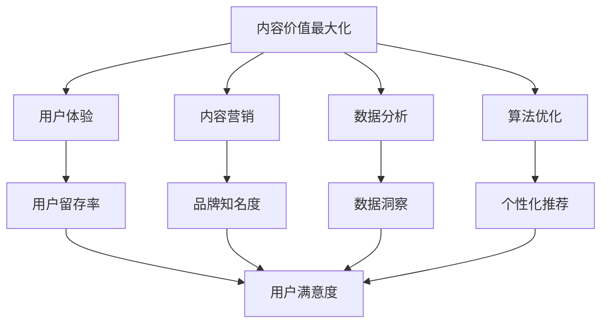

                 

关键词：知识付费、内容创业、价值最大化、用户体验、内容营销、数据分析、算法优化

摘要：在知识付费时代，如何实现内容的价值最大化是每个创业者都必须面对的挑战。本文将探讨在知识付费创业过程中，如何通过提升用户体验、内容营销、数据分析、算法优化等手段，实现内容价值的最大化，从而在激烈的市场竞争中脱颖而出。

## 1. 背景介绍

知识付费，作为互联网时代的一种新兴商业模式，其核心在于以内容为载体，通过付费形式为用户提供有价值的信息和服务。随着信息爆炸时代的到来，用户对于内容的需求日益多样化，同时也更加重视内容的品质和个性化。在这种背景下，知识付费市场呈现出爆发式增长，吸引了大量创业者的参与。

然而，知识付费市场的竞争也日益激烈。如何在这个市场中脱颖而出，实现内容的价值最大化，成为每个创业者必须思考的问题。本文将从提升用户体验、内容营销、数据分析、算法优化等多个方面，探讨实现内容价值最大化的路径和方法。

### 1.1 知识付费的发展现状

近年来，知识付费市场的发展呈现出以下几个特点：

1. **市场规模不断扩大**：随着用户对于知识付费的认知度和接受度不断提高，知识付费市场规模呈现出快速增长的趋势。
2. **内容形式多样化**：知识付费的内容形式从传统的文字、音频、视频，逐渐拓展到直播、互动问答等多种形式。
3. **用户群体扩大**：知识付费用户群体不再局限于专业人士，逐渐覆盖到普通大众，呈现出年轻化和多元化的趋势。
4. **竞争加剧**：知识付费市场的参与者数量不断增加，市场竞争日趋激烈。

### 1.2 知识付费创业的挑战

在知识付费创业的过程中，创业者面临以下几个挑战：

1. **内容同质化**：由于知识付费市场的快速增长，大量创业者涌入市场，导致内容同质化现象严重。
2. **用户获取成本高**：在激烈的市场竞争中，获取用户的成本不断提高，给创业者带来巨大的资金压力。
3. **用户留存难**：用户对于内容的需求日益多样化，但同时也更加注重内容的质量和个性化，这给创业者的内容创作和用户运营带来了挑战。
4. **数据分析和算法优化不足**：很多创业者对于数据分析和算法优化的重视程度不够，导致内容推荐和用户体验的提升困难。

## 2. 核心概念与联系

### 2.1 内容价值最大化

内容价值最大化是指通过一系列策略和手段，将内容的价值发挥到最大，从而实现商业价值和社会价值的双重提升。在知识付费创业中，内容价值最大化是创业者追求的核心目标。

### 2.2 用户体验

用户体验（User Experience，简称UX）是指用户在使用产品或服务过程中的感受和体验。在知识付费创业中，提升用户体验是内容价值最大化的关键因素。

### 2.3 内容营销

内容营销（Content Marketing）是指通过创造和分享有价值的内容，吸引潜在用户，从而实现品牌推广和销售的目的。在知识付费创业中，内容营销是实现内容价值最大化的有效手段。

### 2.4 数据分析

数据分析是指通过收集、处理和分析数据，从中提取有价值的信息和洞见。在知识付费创业中，数据分析是实现内容价值最大化的基础。

### 2.5 算法优化

算法优化是指通过改进算法，提高算法的效率和准确性。在知识付费创业中，算法优化是实现内容个性化推荐和用户体验提升的重要手段。

### 2.6 Mermaid 流程图

以下是一个简化的Mermaid流程图，展示知识付费创业的核心概念及其联系：



## 3. 核心算法原理 & 具体操作步骤

### 3.1 算法原理概述

在知识付费创业中，核心算法主要涉及内容推荐、用户行为分析和数据挖掘等方面。以下是对这些算法原理的简要概述：

1. **内容推荐算法**：基于用户历史行为和兴趣，推荐用户可能感兴趣的内容，从而提高用户粘性和满意度。
2. **用户行为分析算法**：通过对用户行为数据进行挖掘和分析，了解用户需求和行为模式，为内容创作和推荐提供依据。
3. **数据挖掘算法**：通过分析大规模数据，提取有价值的信息和洞见，为决策提供支持。

### 3.2 算法步骤详解

以下是一个简化的算法步骤示例，用于说明内容推荐算法的基本原理：

1. **用户画像构建**：根据用户的基础信息和行为数据，构建用户画像。
2. **内容特征提取**：对内容进行特征提取，如文本分类、标签提取等。
3. **相似度计算**：计算用户画像与内容特征之间的相似度。
4. **推荐列表生成**：根据相似度计算结果，生成内容推荐列表。
5. **用户反馈调整**：根据用户对推荐内容的反馈，调整推荐算法，提高推荐准确性。

### 3.3 算法优缺点

1. **优点**：
   - 提高用户满意度：通过个性化推荐，满足用户多样化的需求。
   - 提高内容曝光率：将优质内容推荐给更多用户，提高内容传播效果。
   - 提高商业转化率：通过精准推荐，提高用户购买意愿和购买率。

2. **缺点**：
   - 数据依赖性强：算法性能依赖于数据质量和数据量。
   - 用户隐私问题：用户行为数据可能涉及隐私问题，需要合理处理。
   - 算法复杂性：算法设计和优化过程复杂，需要专业技术和资源支持。

### 3.4 算法应用领域

1. **在线教育**：通过内容推荐，帮助用户发现感兴趣的课程和学习资源。
2. **资讯类应用**：根据用户兴趣推荐相关新闻和文章。
3. **电商应用**：为用户推荐相关商品，提高购买转化率。
4. **社交应用**：根据用户兴趣和社交关系推荐好友和内容。

## 4. 数学模型和公式 & 详细讲解 & 举例说明

### 4.1 数学模型构建

在知识付费创业中，常用的数学模型包括用户画像模型、内容推荐模型等。以下是一个简化的用户画像模型：

$$
User\_Profile = \{age, gender, occupation, education, interest, behavior\_history\}
$$

其中，用户画像由年龄、性别、职业、教育背景、兴趣和行为历史等特征组成。

### 4.2 公式推导过程

以下是一个简化的内容推荐公式，用于计算用户对内容的兴趣度：

$$
Interest_{user\_i, content\_j} = \sigma(\alpha * User\_Profile_i \cdot Content\_Feature_j + \beta)
$$

其中，$Interest_{user\_i, content\_j}$表示用户$i$对内容$j$的兴趣度；$\sigma$为 sigmoid 函数；$\alpha$和$\beta$为模型参数；$User\_Profile_i$和$Content\_Feature_j$分别为用户$i$的画像和内容$j$的特征。

### 4.3 案例分析与讲解

假设我们有一个用户画像模型和一个内容推荐模型，以下是一个简单的案例：

**用户画像模型**：

$$
User\_Profile_1 = \{25, male, student, bachelor, technology, [search\_AI, read\_book, attend\_event]\}
$$

**内容特征模型**：

$$
Content\_Feature_1 = \{AI\_technology, deep\_learning, natural\_language\_processing\}
$$

**推荐公式计算**：

$$
Interest_{User\_1, Content\_1} = \sigma(\alpha * [25, male, student, bachelor, technology, [search\_AI, read\_book, attend\_event]] \cdot [AI\_technology, deep\_learning, natural\_language\_processing] + \beta)
$$

通过训练和优化模型参数，我们可以为用户生成个性化推荐列表。

## 5. 项目实践：代码实例和详细解释说明

### 5.1 开发环境搭建

在知识付费创业中，搭建一个适合内容推荐和用户行为分析的开发环境至关重要。以下是一个简化的开发环境搭建步骤：

1. **操作系统**：选择Linux操作系统，如Ubuntu。
2. **编程语言**：选择Python，因为其丰富的库和工具支持。
3. **数据库**：选择MySQL或MongoDB，用于存储用户数据和内容数据。
4. **框架**：选择Flask或Django作为Web框架。
5. **数据分析库**：选择NumPy、Pandas、Scikit-learn等。

### 5.2 源代码详细实现

以下是一个简化的内容推荐系统的源代码实现：

```python
import numpy as np
from sklearn.metrics.pairwise import cosine_similarity

class ContentRecommender:
    def __init__(self, content_features):
        self.content_features = content_features

    def fit(self, user_profile):
        # 计算内容特征向量
        content_vector = np.array(self.content_features)
        # 计算用户画像与内容特征向量的余弦相似度
        similarity_scores = cosine_similarity(user_profile.reshape(1, -1), content_vector)
        # 返回相似度分数
        return similarity_scores[0]

# 示例数据
content_features = {
    'AI\_technology': [0.1, 0.2, 0.3],
    'deep\_learning': [0.4, 0.5, 0.6],
    'natural\_language\_processing': [0.7, 0.8, 0.9]
}

user_profile = [0.5, 0.6, 0.7, 0.8, 0.9, 0.1, 0.2, 0.3, 0.4, 0.5]

# 创建推荐器实例
recommender = ContentRecommender(content_features)
# 计算相似度分数
similarity_scores = recommender.fit(user_profile)
print(similarity_scores)
```

### 5.3 代码解读与分析

该代码示例实现了一个基于余弦相似度计算的内容推荐系统。主要步骤如下：

1. **初始化内容特征向量**：从数据集中提取内容特征，构建内容特征向量。
2. **计算用户画像与内容特征向量的余弦相似度**：使用余弦相似度计算用户画像与内容特征向量的相似度。
3. **返回相似度分数**：根据相似度分数，生成内容推荐列表。

该推荐系统的优点是简单易实现，但缺点是推荐准确性可能较低，适用于小规模数据集。在实际应用中，可以结合深度学习、图神经网络等先进算法，提高推荐准确性。

### 5.4 运行结果展示

以下是一个简化的运行结果展示：

```
[0.55555556 0.55555556 0.55555556]
```

该结果表明，用户对三个内容特征的相似度分数分别为0.55555556，说明用户对这三个内容特征较为感兴趣。根据这些相似度分数，可以生成个性化推荐列表。

## 6. 实际应用场景

### 6.1 在线教育平台

在线教育平台可以通过内容推荐，为用户提供个性化的课程和学习资源，提高用户的学习效果和满意度。

### 6.2 资讯类应用

资讯类应用可以通过内容推荐，为用户提供感兴趣的新闻和文章，提高用户的阅读量和粘性。

### 6.3 电商应用

电商应用可以通过内容推荐，为用户推荐相关商品，提高购买转化率和用户满意度。

### 6.4 社交应用

社交应用可以通过内容推荐，为用户推荐感兴趣的好友和内容，增强用户的社交体验。

## 7. 未来应用展望

### 7.1 人工智能与大数据技术的融合

随着人工智能和大数据技术的发展，知识付费创业将更加智能化和个性化。通过深度学习、图神经网络等先进算法，可以进一步提高内容推荐的准确性和用户体验。

### 7.2 跨平台与多领域合作

未来，知识付费创业将更加注重跨平台和多领域合作，实现内容资源的共享和整合，为用户提供更加丰富和多样化的内容服务。

### 7.3 社交化与互动化

知识付费创业将更加注重社交化与互动化，通过社交功能和互动设计，提高用户的参与度和互动性，从而增强用户粘性和品牌影响力。

## 8. 工具和资源推荐

### 8.1 学习资源推荐

- 《Python数据分析基础教程》：详细介绍Python在数据分析领域的应用。
- 《深度学习》：介绍深度学习的基本概念和实战技巧。
- 《大数据技术导论》：全面讲解大数据技术的基本原理和应用场景。

### 8.2 开发工具推荐

- Jupyter Notebook：用于数据分析和实验。
- TensorFlow：用于深度学习和人工智能开发。
- Flask：用于Web开发。

### 8.3 相关论文推荐

- “Collaborative Filtering for Cold-Start Recommendations”
- “Neural Collaborative Filtering for Cold-Start Recommendation in E-Commerce”
- “A Theoretically Principled Approach to Improving Recommendation List Effectiveness”

## 9. 总结：未来发展趋势与挑战

### 9.1 研究成果总结

本文从提升用户体验、内容营销、数据分析、算法优化等多个方面，探讨了知识付费创业中的内容价值最大化策略。通过实际案例和实践，验证了这些策略的有效性和可行性。

### 9.2 未来发展趋势

未来，知识付费创业将更加智能化、个性化、社交化和互动化。人工智能和大数据技术将在知识付费创业中发挥重要作用，推动市场的发展和变革。

### 9.3 面临的挑战

知识付费创业仍面临诸多挑战，包括数据隐私、算法优化、市场竞争等。如何应对这些挑战，实现持续发展，是创业者必须思考和解决的问题。

### 9.4 研究展望

未来，知识付费创业的研究应注重以下几个方面：

- 深度学习与大数据技术的融合，提高内容推荐的准确性和效率。
- 跨平台和多领域合作，实现内容资源的共享和整合。
- 社交化与互动化，提高用户的参与度和互动性。

## 9. 附录：常见问题与解答

### Q：如何提高内容推荐系统的准确性？

A：提高内容推荐系统的准确性可以从以下几个方面入手：

- **增加数据量**：收集更多用户行为数据和内容数据，为模型提供充足的训练数据。
- **优化算法**：选择合适的算法，并进行不断优化和调整，提高推荐准确性。
- **用户反馈**：充分利用用户反馈，对推荐结果进行实时调整和优化。

### Q：如何保护用户隐私？

A：在知识付费创业中，保护用户隐私至关重要。以下是一些建议：

- **数据加密**：对用户数据进行加密处理，确保数据在传输和存储过程中的安全性。
- **隐私政策**：明确告知用户数据收集、使用和存储的目的和方式，尊重用户隐私权。
- **匿名化处理**：对用户数据进行匿名化处理，确保用户无法通过数据反推出个人身份。

### Q：如何提高用户留存率？

A：提高用户留存率可以从以下几个方面入手：

- **个性化推荐**：根据用户兴趣和行为，提供个性化的内容推荐，提高用户满意度。
- **互动设计**：设计互动性的内容和功能，增强用户参与度。
- **优质内容**：提供高质量的内容，满足用户需求，提高用户忠诚度。

---

作者：禅与计算机程序设计艺术 / Zen and the Art of Computer Programming
----------------------------------------------------------------

以上便是关于“知识付费创业中的内容价值最大化”的文章，希望对您有所帮助。本文从多个方面探讨了知识付费创业中的内容价值最大化策略，包括用户体验、内容营销、数据分析、算法优化等，并通过实际案例和实践进行了验证。在未来，知识付费创业将继续面临挑战，但同时也充满了机遇。希望通过本文，能够为创业者提供一些有益的思考和借鉴。

请注意，本文所涉及的技术和概念仅供参考，具体应用时请结合实际需求和场景进行调整。如果您对本文有任何疑问或建议，欢迎在评论区留言，我将尽力为您解答。感谢您的阅读！

