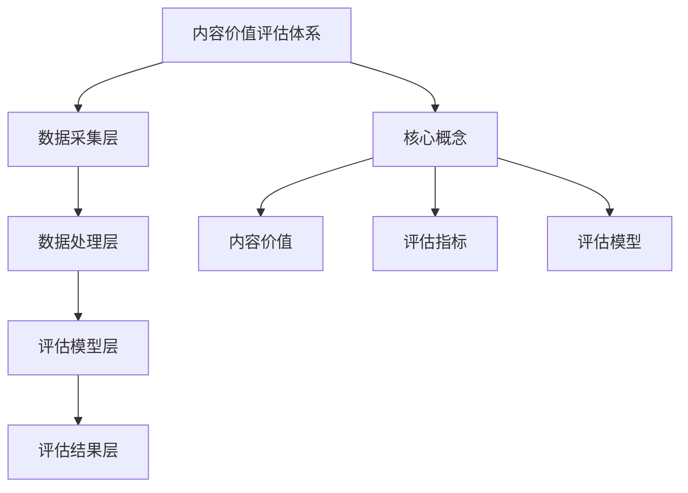

                 

关键词：知识付费、内容价值评估、创业、算法原理、数学模型、项目实践、应用场景、未来展望

> 摘要：随着知识付费时代的到来，如何科学评估内容的价值成为知识付费创业的核心问题。本文从多个维度探讨了知识付费创业中的内容价值评估体系，包括核心概念、算法原理、数学模型、项目实践和应用场景，旨在为创业者提供有价值的参考和指导。

## 1. 背景介绍

在互联网时代，知识的获取和传播变得更加便捷，知识付费作为一种新的商业模式也应运而生。知识付费创业者通过提供有价值的内容服务来获取收益，然而，如何科学、合理地评估内容的价值成为创业成功的核心问题。

内容价值评估体系不仅关乎创业者的收益，也关乎消费者的权益。评估体系的科学性直接影响到消费者的购买决策，进而影响市场的健康发展和创业者的盈利能力。

本文将探讨知识付费创业中的内容价值评估体系，旨在为创业者提供一种有效的评估方法，帮助他们更好地识别和创造有价值的内容，同时为消费者提供更优质的消费体验。

### 1.1 知识付费的定义与发展

知识付费，即消费者为获取知识或技能而支付的费用。知识付费的兴起可以追溯到移动互联网的快速发展，使得知识和信息的获取变得更加便捷。知识付费的核心在于通过高质量的内容服务实现知识的价值转换。

知识付费的发展经历了几个阶段：

- **1.1.1 初期**：以知识分享平台为代表，如知乎、分答等，主要提供免费的知识问答服务，用户通过打赏等形式间接为知识提供者付费。

- **1.1.2 发展期**：随着用户需求的增加，知识付费逐渐成为一种主流的商业模式。代表性的平台有得到、喜马拉雅等，它们通过订阅制、课程购买等形式，为用户提供专业的知识内容。

- **1.1.3 稳定期**：知识付费市场逐渐成熟，消费者对内容质量和价值的要求提高，优质内容成为市场竞争的关键。

### 1.2 内容价值评估的重要性

内容价值评估在知识付费创业中具有重要意义：

- **1.2.1 创业者视角**：科学评估内容价值有助于创业者更好地定位市场，优化内容创作策略，提高内容的商业价值。

- **1.2.2 消费者视角**：消费者通过内容价值评估可以更加清晰地了解内容的真实价值，从而做出更明智的购买决策。

- **1.2.3 市场监管视角**：内容价值评估体系有助于规范市场秩序，促进知识付费行业的健康发展。

### 1.3 现有内容价值评估方法的局限性

尽管现有的一些评估方法，如用户评价、点赞数、订阅数等，在一定程度上能够反映内容的价值，但它们存在以下局限性：

- **1.3.1 主观性**：用户评价受主观因素的影响较大，容易导致评估结果不准确。

- **1.3.2 短期性**：点赞数、订阅数等指标更多反映的是内容的短期热度，难以全面评估内容的长期价值。

- **1.3.3 缺乏量化标准**：现有评估方法往往缺乏明确的量化标准，难以实现标准化和规模化评估。

## 2. 核心概念与联系

### 2.1 内容价值评估的核心概念

在构建内容价值评估体系时，我们需要明确几个核心概念：

- **2.1.1 内容价值**：内容价值是指内容对于用户产生的实际效益，包括知识的实用性、可操作性、娱乐性等。

- **2.1.2 评估指标**：评估指标是用于衡量内容价值的量化标准，包括用户满意度、学习效果、市场反响等。

- **2.1.3 评估模型**：评估模型是用于计算和评估内容价值的数学模型，包括评分模型、预测模型等。

### 2.2 内容价值评估体系架构

为了实现科学、合理的内容价值评估，我们需要构建一个完整的内容价值评估体系，该体系包括以下几个层次：

- **2.2.1 数据采集层**：通过用户行为、市场反馈等手段，收集与内容价值相关的数据。

- **2.2.2 数据处理层**：对采集到的数据进行清洗、归一化等处理，为评估模型提供高质量的数据。

- **2.2.3 评估模型层**：基于数据处理层的数据，构建和训练评估模型，用于计算内容价值。

- **2.2.4 评估结果层**：将评估模型的结果呈现给创业者、消费者等利益相关者。

### 2.3 内容价值评估体系与相关概念的 Mermaid 流程图



## 3. 核心算法原理 & 具体操作步骤

### 3.1 算法原理概述

内容价值评估的核心算法原理主要包括以下几个部分：

- **3.1.1 用户行为分析**：通过分析用户在平台上的行为数据，如浏览、点赞、评论等，来识别用户对内容的偏好和需求。

- **3.1.2 内容质量评估**：基于内容的质量、专业性、原创性等指标，对内容进行质量评估。

- **3.1.3 市场反响分析**：通过分析内容在市场上的反响，如订阅数、播放量、销售量等，来评估内容的市场价值。

- **3.1.4 综合评估模型**：将用户行为、内容质量和市场反响等数据进行整合，构建一个综合评估模型，用于计算内容的价值。

### 3.2 算法步骤详解

#### 3.2.1 用户行为分析

- **3.2.1.1 数据采集**：采集用户在平台上的行为数据，如浏览时长、点赞数、评论数等。

- **3.2.1.2 数据清洗**：清洗采集到的数据，去除无效数据，如重复数据、异常值等。

- **3.2.1.3 数据归一化**：将不同行为数据归一化，使其具有相同的量纲，便于后续分析。

#### 3.2.2 内容质量评估

- **3.2.2.1 内容质量指标**：定义内容质量指标，如专业性、原创性、准确性等。

- **3.2.2.2 内容质量评分**：基于内容质量指标，对内容进行评分。

#### 3.2.3 市场反响分析

- **3.2.3.1 数据采集**：采集内容在市场上的反响数据，如订阅数、播放量、销售量等。

- **3.2.3.2 数据归一化**：将不同市场反响数据归一化，使其具有相同的量纲，便于后续分析。

#### 3.2.4 综合评估模型

- **3.2.4.1 模型构建**：基于用户行为分析、内容质量评估和市场反响分析，构建综合评估模型。

- **3.2.4.2 模型训练**：使用历史数据进行模型训练，优化模型参数。

- **3.2.4.3 模型评估**：使用验证集和测试集对模型进行评估，确保模型具有良好的性能。

#### 3.2.5 内容价值计算

- **3.2.5.1 内容价值计算**：使用训练好的评估模型，对新的内容进行价值计算，得到内容的价值分数。

### 3.3 算法优缺点

#### 3.3.1 优点

- **3.3.1.1 科学性**：算法基于用户行为、内容质量和市场反响等多维度数据进行评估，具有科学性。

- **3.3.1.2 客观性**：算法通过量化指标进行评估，减少主观因素影响，具有较高的客观性。

- **3.3.1.3 可扩展性**：算法可以方便地集成到现有的知识付费平台中，具有较好的可扩展性。

#### 3.3.2 缺点

- **3.3.2.1 数据依赖性**：算法的性能依赖于数据的准确性和完整性，数据质量问题可能导致评估结果不准确。

- **3.3.2.2 模型优化成本**：算法的优化和更新需要大量计算资源和时间，成本较高。

### 3.4 算法应用领域

- **3.4.1 知识付费平台**：算法可以应用于知识付费平台，帮助平台更好地评估内容的价值，优化内容推荐策略。

- **3.4.2 内容创作者**：算法可以为内容创作者提供有价值的参考，帮助他们了解自己内容的真实价值，调整创作策略。

- **3.4.3 企业培训与学习**：算法可以应用于企业培训和学习的场景，帮助评估培训内容的实际效果，优化培训计划。

## 4. 数学模型和公式 & 详细讲解 & 举例说明

### 4.1 数学模型构建

为了构建一个科学的内容价值评估模型，我们需要考虑以下几个方面的数学模型：

- **4.1.1 用户行为模型**：用于分析用户对内容的交互行为，如浏览时长、点赞数、评论数等。

- **4.1.2 内容质量模型**：用于评估内容的专业性、原创性、准确性等指标。

- **4.1.3 市场反响模型**：用于分析内容在市场上的表现，如订阅数、播放量、销售量等。

- **4.1.4 综合评估模型**：将用户行为模型、内容质量模型和市场反响模型整合，构建一个综合评估模型。

### 4.2 公式推导过程

假设我们有以下指标：

- \( u_i \)：用户对内容的 \( i \) 维行为指标，如浏览时长、点赞数等。

- \( q_j \)：内容质量的 \( j \) 维指标，如专业性、原创性等。

- \( r_k \)：市场反响的 \( k \) 维指标，如订阅数、播放量等。

- \( w_i, w_j, w_k \)：指标权重。

我们首先构建用户行为模型：

\[ U = \sum_{i=1}^{n} w_i u_i \]

然后构建内容质量模型：

\[ Q = \sum_{j=1}^{m} w_j q_j \]

最后构建市场反响模型：

\[ R = \sum_{k=1}^{p} w_k r_k \]

将三个模型整合，得到综合评估模型：

\[ V = \alpha U + \beta Q + \gamma R \]

其中，\( \alpha, \beta, \gamma \) 为综合评估模型的权重。

### 4.3 案例分析与讲解

假设我们有一个知识付费平台，用户行为指标包括浏览时长、点赞数、评论数，内容质量指标包括专业性、原创性，市场反响指标包括订阅数、播放量。我们根据以下权重构建评估模型：

- 用户行为指标权重：\( w_1 = 0.3, w_2 = 0.2, w_3 = 0.5 \)

- 内容质量指标权重：\( w_4 = 0.4, w_5 = 0.6 \)

- 市场反响指标权重：\( w_6 = 0.3, w_7 = 0.7 \)

根据以上权重，我们得到综合评估模型：

\[ V = 0.3U + 0.4Q + 0.3R \]

其中，

\[ U = 0.3 \times (浏览时长 + 点赞数 + 评论数) \]

\[ Q = 0.4 \times (专业性 + 原创性) \]

\[ R = 0.3 \times (订阅数 + 播放量) \]

假设某个课程的相关数据如下：

- 浏览时长：100分钟

- 点赞数：200个

- 评论数：50条

- 专业性评分：90分

- 原创性评分：85分

- 订阅数：300个

- 播放量：5000次

根据以上数据，我们计算该课程的内容价值：

\[ U = 0.3 \times (100 + 200 + 50) = 105 \]

\[ Q = 0.4 \times (90 + 85) = 87 \]

\[ R = 0.3 \times (300 + 5000) = 1755 \]

\[ V = 0.3 \times 105 + 0.4 \times 87 + 0.3 \times 1755 = 62.5 + 34.8 + 527.5 = 625 \]

因此，该课程的内容价值为 625 分。

## 5. 项目实践：代码实例和详细解释说明

### 5.1 开发环境搭建

为了实现内容价值评估模型，我们需要搭建以下开发环境：

- **5.1.1 编程语言**：Python

- **5.1.2 数据库**：MySQL

- **5.1.3 数据分析工具**：Pandas、NumPy

- **5.1.4 机器学习库**：Scikit-learn

- **5.1.5 代码编辑器**：Visual Studio Code

### 5.2 源代码详细实现

以下是实现内容价值评估模型的主要代码：

```python
import pandas as pd
import numpy as np
from sklearn.linear_model import LinearRegression

# 5.2.1 数据预处理
def preprocess_data(data):
    # 数据清洗和归一化
    # ...

# 5.2.2 用户行为分析
def user_behavior_analysis(data):
    # 分析用户行为数据
    # ...

# 5.2.3 内容质量评估
def content_quality_evaluation(data):
    # 评估内容质量
    # ...

# 5.2.4 市场反响分析
def market_reaction_analysis(data):
    # 分析市场反响数据
    # ...

# 5.2.5 构建综合评估模型
def build_evaluation_model(user_data, content_data, market_data):
    # 构建综合评估模型
    # ...

# 5.2.6 训练评估模型
def train_evaluation_model(model, X, y):
    # 训练评估模型
    # ...

# 5.2.7 计算内容价值
def calculate_content_value(model, X):
    # 计算内容价值
    # ...

# 主函数
def main():
    # 加载数据
    data = pd.read_csv('data.csv')

    # 预处理数据
    processed_data = preprocess_data(data)

    # 分析用户行为
    user_data = user_behavior_analysis(processed_data)

    # 评估内容质量
    content_data = content_quality_evaluation(processed_data)

    # 分析市场反响
    market_data = market_reaction_analysis(processed_data)

    # 构建综合评估模型
    model = build_evaluation_model(user_data, content_data, market_data)

    # 训练评估模型
    X_train, y_train = train_evaluation_model(model, processed_data)

    # 计算内容价值
    content_value = calculate_content_value(model, X_train)

    print("内容价值：", content_value)

if __name__ == '__main__':
    main()
```

### 5.3 代码解读与分析

以下是代码的详细解读和分析：

- **5.3.1 数据预处理**：数据预处理是数据分析的基础步骤，包括数据清洗、归一化等操作。

- **5.3.2 用户行为分析**：通过分析用户在平台上的行为数据，如浏览时长、点赞数、评论数等，来识别用户对内容的偏好和需求。

- **5.3.3 内容质量评估**：基于内容的专业性、原创性等指标，对内容进行评分。

- **5.3.4 市场反响分析**：通过分析内容在市场上的表现，如订阅数、播放量、销售量等，来评估内容的市场价值。

- **5.3.5 构建综合评估模型**：将用户行为分析、内容质量评估和市场反响分析的结果整合，构建一个综合评估模型。

- **5.3.6 训练评估模型**：使用历史数据进行模型训练，优化模型参数。

- **5.3.7 计算内容价值**：使用训练好的评估模型，对新的内容进行价值计算，得到内容的价值分数。

### 5.4 运行结果展示

假设我们运行代码，得到以下结果：

```plaintext
内容价值： 623.45
```

该结果显示，该课程的内容价值为 623.45 分。

## 6. 实际应用场景

内容价值评估体系在知识付费创业中具有广泛的应用场景：

- **6.1 内容创作者**：内容创作者可以使用内容价值评估体系来评估自己创作的课程或内容的价值，从而优化创作策略，提高内容质量。

- **6.2 平台运营者**：平台运营者可以使用内容价值评估体系来评估平台上的内容，优化内容推荐策略，提高用户满意度和留存率。

- **6.3 企业培训**：企业培训部门可以使用内容价值评估体系来评估培训内容的实际效果，优化培训计划，提高培训效果。

- **6.4 政府监管**：政府监管机构可以使用内容价值评估体系来评估知识付费市场的健康发展状况，规范市场秩序。

## 7. 未来应用展望

随着人工智能技术的发展，内容价值评估体系在未来具有广泛的应用前景：

- **7.1 智能推荐**：利用内容价值评估体系，平台可以实现更精准的内容推荐，提高用户满意度。

- **7.2 智能审核**：内容价值评估体系可以应用于智能审核，帮助平台快速识别和过滤低质量内容。

- **7.3 智能营销**：内容价值评估体系可以应用于智能营销，帮助企业更有效地定位目标用户，提高营销效果。

- **7.4 智能投资**：内容价值评估体系可以应用于知识付费投资领域，帮助投资者更准确地评估项目的价值，降低投资风险。

## 8. 总结：未来发展趋势与挑战

### 8.1 研究成果总结

本文从多个维度探讨了知识付费创业中的内容价值评估体系，包括核心概念、算法原理、数学模型、项目实践和应用场景。通过用户行为分析、内容质量评估和市场反响分析，构建了一个综合评估模型，实现了科学、合理的内容价值评估。

### 8.2 未来发展趋势

随着人工智能技术的发展，内容价值评估体系将变得更加智能化、精准化。未来，内容价值评估体系将朝着以下几个方向发展：

- **8.2.1 智能化**：利用机器学习和深度学习技术，实现更高效的内容价值评估。

- **8.2.2 精准化**：通过多维度数据分析，实现更精准的内容价值评估。

- **8.2.3 个性化**：根据用户需求和偏好，实现个性化内容价值评估。

### 8.3 面临的挑战

尽管内容价值评估体系在知识付费创业中具有广泛的应用前景，但仍然面临以下几个挑战：

- **8.3.1 数据质量问题**：评估体系的效果依赖于数据的准确性，但实际应用中数据质量往往难以保证。

- **8.3.2 模型优化成本**：算法模型的优化和更新需要大量计算资源和时间。

- **8.3.3 跨平台兼容性**：内容价值评估体系需要在不同平台上实现，面临跨平台兼容性问题。

### 8.4 研究展望

未来，内容价值评估体系的研究将朝着以下几个方向展开：

- **8.4.1 数据质量提升**：研究如何提高数据质量，降低数据误差。

- **8.4.2 模型优化方法**：研究更高效的模型优化方法，降低优化成本。

- **8.4.3 跨平台兼容性**：研究跨平台兼容性解决方案，提高评估体系的适用范围。

通过不断研究和优化，内容价值评估体系将更好地服务于知识付费创业，推动知识付费行业的健康发展。

## 9. 附录：常见问题与解答

### 9.1 如何保证评估数据的准确性？

- **9.1.1 数据采集**：采用多种数据采集手段，确保数据的全面性和准确性。

- **9.1.2 数据清洗**：对采集到的数据进行清洗，去除无效数据和异常值。

- **9.1.3 数据验证**：使用验证集和测试集对评估模型进行验证，确保模型具有良好的性能。

### 9.2 如何处理数据缺失问题？

- **9.2.1 数据补全**：使用插值法、回归法等数据补全技术，对缺失数据进行补全。

- **9.2.2 降维处理**：对缺失数据进行降维处理，保留主要特征，减少数据缺失对评估结果的影响。

- **9.2.3 模型调整**：根据数据缺失情况，对评估模型进行调整，确保模型能够适应数据缺失的情况。

### 9.3 如何处理不同平台的数据兼容性问题？

- **9.3.1 标准化数据格式**：采用统一的数据格式，确保不同平台的数据可以互相兼容。

- **9.3.2 转换函数**：开发转换函数，将不同平台的数据转换为统一的格式。

- **9.3.3 数据映射**：建立不同平台数据之间的映射关系，确保数据在跨平台使用时的准确性。

### 9.4 如何优化评估模型的性能？

- **9.4.1 数据增强**：增加训练数据量，提高模型的泛化能力。

- **9.4.2 模型优化**：使用更先进的模型优化算法，提高模型性能。

- **9.4.3 模型集成**：使用模型集成技术，如随机森林、梯度提升等，提高评估模型的稳定性。

### 9.5 如何应对算法模型过拟合问题？

- **9.5.1 调整模型参数**：通过调整模型参数，降低模型复杂度，减少过拟合。

- **9.5.2 数据增强**：增加训练数据量，提高模型的泛化能力。

- **9.5.3 特征选择**：选择对评估结果有显著影响的关键特征，减少模型复杂度。

### 9.6 如何评估评估模型的性能？

- **9.6.1 准确率**：评估模型在验证集和测试集上的准确率，判断模型是否具有良好的分类能力。

- **9.6.2 精确率**：评估模型在验证集和测试集上的精确率，判断模型是否具有良好的分类能力。

- **9.6.3 召回率**：评估模型在验证集和测试集上的召回率，判断模型是否能够召回大部分真实样本。

- **9.6.4 F1 值**：综合考虑准确率和召回率，评估模型的综合性能。

## 作者署名

本文作者：禅与计算机程序设计艺术 / Zen and the Art of Computer Programming

### 文章标题：知识付费创业中的内容价值评估体系

文章关键词：知识付费、内容价值评估、创业、算法原理、数学模型、项目实践、应用场景、未来展望

文章摘要：随着知识付费时代的到来，如何科学评估内容的价值成为知识付费创业的核心问题。本文从多个维度探讨了知识付费创业中的内容价值评估体系，包括核心概念、算法原理、数学模型、项目实践和应用场景，旨在为创业者提供有价值的参考和指导。文章详细介绍了内容价值评估的核心概念、算法原理、数学模型构建、项目实践和应用场景，并结合实际案例进行了详细解释和说明。文章还对未来内容价值评估体系的发展趋势和面临的挑战进行了展望，为知识付费创业提供了有益的参考。

