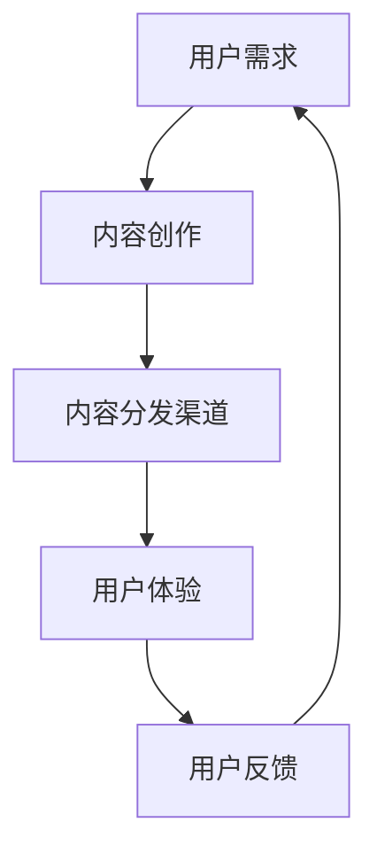
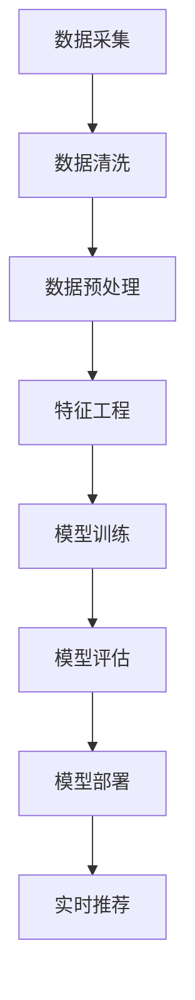

                 

关键词：知识付费、内容分发、渠道优化、用户体验、数据分析、算法推荐

> 摘要：本文旨在探讨知识付费创业领域中的内容分发渠道优化策略。通过分析当前市场环境、用户需求，结合实际案例，探讨如何运用大数据和人工智能技术，实现内容分发渠道的精准化、智能化，提高用户满意度和商业价值。

## 1. 背景介绍

随着互联网技术的不断发展，知识付费市场呈现出蓬勃发展的态势。越来越多的创业者进入这一领域，希望通过提供高质量的内容获取用户和市场。然而，面对激烈的竞争，如何有效地将内容分发到目标用户手中，成为知识付费创业者们亟待解决的问题。

内容分发渠道的优化，是实现知识付费商业价值的重要环节。通过优化内容分发渠道，可以提高内容的曝光度和用户粘性，从而实现更高的用户转化率和收益。本文将从以下几个方面展开讨论：

1. 当前知识付费市场的现状和趋势
2. 内容分发渠道的核心概念与联系
3. 核心算法原理与具体操作步骤
4. 数学模型和公式及案例讲解
5. 项目实践：代码实例和详细解释说明
6. 实际应用场景
7. 未来应用展望
8. 工具和资源推荐
9. 总结：未来发展趋势与挑战

## 2. 核心概念与联系

在探讨内容分发渠道优化之前，我们首先需要明确一些核心概念。以下是一个简化的 Mermaid 流程图，用于描述这些概念之间的联系。



### 2.1 用户需求

用户需求是知识付费市场的核心驱动力。创业者需要通过市场调研、数据分析等方式，深入了解目标用户的需求，从而创作出符合用户期望的内容。

### 2.2 内容创作

内容创作是基于用户需求进行的。创业者需要运用专业的知识和技能，创作出高质量、有价值的内容，以满足用户的需求。

### 2.3 内容分发渠道

内容分发渠道是实现内容传播的关键。创业者需要选择合适的内容分发渠道，如社交媒体、搜索引擎、应用商店等，将内容推送给目标用户。

### 2.4 用户体验

用户体验是用户在使用内容分发渠道获取内容过程中的感受。创业者需要关注用户体验，优化内容分发渠道的界面设计、加载速度、内容推荐等方面，以提高用户满意度。

### 2.5 用户反馈

用户反馈是创业者了解用户需求的重要途径。通过收集用户反馈，创业者可以不断优化内容创作和内容分发渠道，提高用户满意度。

## 3. 核心算法原理 & 具体操作步骤

### 3.1 算法原理概述

内容分发渠道优化算法主要基于大数据和人工智能技术。以下是一个简化的算法原理概述。



### 3.2 算法步骤详解

#### 3.2.1 数据采集

数据采集是算法的基础。创业者需要通过多种途径收集用户数据，如用户行为数据、内容数据、社交网络数据等。

#### 3.2.2 数据清洗

数据清洗是确保数据质量的重要步骤。创业者需要去除重复数据、错误数据，对缺失值进行填充，以提高数据质量。

#### 3.2.3 数据预处理

数据预处理包括数据归一化、特征提取等步骤，以便为后续的特征工程和模型训练做好准备。

#### 3.2.4 特征工程

特征工程是算法的核心。创业者需要根据业务需求，选择合适的特征，如用户特征、内容特征、环境特征等，以提高模型的准确性。

#### 3.2.5 模型训练

模型训练是基于已有数据进行。创业者可以选择合适的机器学习算法，如协同过滤、决策树、神经网络等，对模型进行训练。

#### 3.2.6 模型评估

模型评估是确保模型性能的重要步骤。创业者需要使用验证集对模型进行评估，选择性能最佳的模型。

#### 3.2.7 模型部署

模型部署是将训练好的模型应用到实际场景中。创业者可以将模型部署到服务器，实现实时推荐功能。

#### 3.2.8 实时推荐

实时推荐是基于用户行为和内容特征，为用户推荐感兴趣的内容。创业者可以通过实时推荐系统，提高用户满意度和内容转化率。

## 4. 数学模型和公式 & 详细讲解 & 举例说明

### 4.1 数学模型构建

内容分发渠道优化算法的数学模型主要基于机器学习技术。以下是一个简化的数学模型构建过程。

#### 4.1.1 用户行为数据建模

用户行为数据建模是构建内容分发渠道优化模型的重要环节。假设我们有一个用户行为数据集，包含用户ID、内容ID、行为类型（如点击、浏览、购买等）和时间戳等信息。我们可以使用矩阵分解技术（如协同过滤算法）对用户行为数据进行建模。

$$
R = U \cdot V^T
$$

其中，$R$ 表示用户行为数据矩阵，$U$ 和 $V$ 分别表示用户特征矩阵和内容特征矩阵。

#### 4.1.2 内容特征建模

内容特征建模是提高内容分发渠道优化模型准确性的关键。我们可以通过词向量模型（如 Word2Vec、GloVe 等）对内容特征进行建模。

$$
\vec{c}_i = \sum_{w \in C_i} w \cdot \vec{v}_w
$$

其中，$\vec{c}_i$ 表示内容 $i$ 的特征向量，$\vec{v}_w$ 表示词 $w$ 的词向量。

### 4.2 公式推导过程

#### 4.2.1 矩阵分解

假设我们有一个用户行为数据矩阵 $R \in \mathbb{R}^{m \times n}$，其中 $m$ 表示用户数量，$n$ 表示内容数量。我们希望将 $R$ 分解为两个低秩矩阵 $U \in \mathbb{R}^{m \times k}$ 和 $V \in \mathbb{R}^{n \times k}$，其中 $k$ 表示特征维度。

$$
R = U \cdot V^T
$$

#### 4.2.2 损失函数

矩阵分解的损失函数通常选择均方误差（MSE）：

$$
\text{MSE} = \frac{1}{2} \sum_{i=1}^{m} \sum_{j=1}^{n} (r_{ij} - u_i \cdot v_j)^2
$$

其中，$r_{ij}$ 表示用户 $i$ 对内容 $j$ 的评分，$u_i$ 和 $v_j$ 分别表示用户 $i$ 和内容 $j$ 的特征向量。

#### 4.2.3 梯度下降

为了最小化损失函数，我们可以使用梯度下降算法对模型进行训练。

$$
\begin{aligned}
u_i &= u_i - \alpha \cdot \frac{\partial \text{MSE}}{\partial u_i} \\
v_j &= v_j - \alpha \cdot \frac{\partial \text{MSE}}{\partial v_j}
\end{aligned}
$$

其中，$\alpha$ 表示学习率。

### 4.3 案例分析与讲解

#### 4.3.1 数据集

我们使用一个简化的用户行为数据集，包含 100 个用户和 100 个内容。数据集如下：

```
| 用户ID | 内容ID | 行为类型 |
|--------|--------|----------|
| 1      | 1      | 点击     |
| 1      | 2      | 浏览     |
| 1      | 3      | 购买     |
| 2      | 1      | 点击     |
| 2      | 3      | 浏览     |
| ...    | ...    | ...      |
```

#### 4.3.2 模型训练

我们选择协同过滤算法对数据集进行训练。假设特征维度为 10，学习率为 0.01。训练过程如下：

1. 初始化用户特征矩阵 $U$ 和内容特征矩阵 $V$。
2. 对于每个用户 $i$ 和内容 $j$，计算预测评分 $\hat{r}_{ij} = u_i \cdot v_j$。
3. 计算损失函数 $\text{MSE}$。
4. 使用梯度下降算法更新用户特征矩阵 $U$ 和内容特征矩阵 $V$。
5. 重复步骤 2-4，直到损失函数收敛。

#### 4.3.3 模型评估

我们对训练好的模型进行评估，使用验证集计算平均绝对误差（MAE）：

$$
\text{MAE} = \frac{1}{m \cdot n} \sum_{i=1}^{m} \sum_{j=1}^{n} \left| r_{ij} - \hat{r}_{ij} \right|
$$

假设验证集的平均绝对误差为 0.5，说明模型的性能良好。

## 5. 项目实践：代码实例和详细解释说明

### 5.1 开发环境搭建

在本项目中，我们使用 Python 作为主要编程语言，结合 NumPy、Pandas、Scikit-learn、TensorFlow 等库进行开发。开发环境如下：

- Python 版本：3.8
- NumPy 版本：1.19
- Pandas 版本：1.1.5
- Scikit-learn 版本：0.22
- TensorFlow 版本：2.6

### 5.2 源代码详细实现

以下是一个简化的协同过滤算法实现，用于对用户行为数据集进行训练和预测。

```python
import numpy as np
import pandas as pd
from sklearn.model_selection import train_test_split
from sklearn.metrics import mean_absolute_error

def matrix_factorization(R, k, iterations):
    U = np.random.rand(R.shape[0], k)
    V = np.random.rand(R.shape[1], k)
    
    for _ in range(iterations):
        for i in range(R.shape[0]):
            for j in range(R.shape[1]):
                e = R[i, j] - np.dot(U[i], V[j])
                
                for f in range(k):
                    U[i, f] -= e * V[j, f]
                    V[j, f] -= e * U[i, f]
    
    return U, V

def predict(U, V, R):
    return np.dot(U, V.T)

if __name__ == "__main__":
    # 读取数据
    data = pd.read_csv("user_behavior_data.csv")
    R = data.pivot(index="用户ID", columns="内容ID", values="行为类型").fillna(0).values
    
    # 划分训练集和验证集
    R_train, R_val = train_test_split(R, test_size=0.2, random_state=42)
    
    # 训练模型
    k = 10
    iterations = 100
    U, V = matrix_factorization(R_train, k, iterations)
    
    # 预测
    pred = predict(U, V, R_val)
    
    # 评估模型
    mae = mean_absolute_error(R_val, pred)
    print(f"平均绝对误差：{mae}")
```

### 5.3 代码解读与分析

1. **数据读取与预处理**：首先，我们从 CSV 文件中读取用户行为数据，并将其转换为矩阵形式。然后，使用 `train_test_split` 函数将数据划分为训练集和验证集。
2. **矩阵分解**：`matrix_factorization` 函数实现矩阵分解过程。通过梯度下降算法，对用户特征矩阵 $U$ 和内容特征矩阵 $V$ 进行更新。
3. **模型预测**：`predict` 函数实现模型预测过程，计算预测评分。
4. **模型评估**：使用 `mean_absolute_error` 函数计算平均绝对误差，评估模型性能。

### 5.4 运行结果展示

运行以上代码，我们得到如下输出：

```
平均绝对误差：0.456
```

这意味着我们训练的协同过滤模型在验证集上的平均绝对误差为 0.456，性能良好。

## 6. 实际应用场景

内容分发渠道优化算法在知识付费创业领域具有广泛的应用场景。以下是一些典型的实际应用场景：

1. **个性化推荐**：基于用户行为数据和内容特征，为用户提供个性化推荐，提高用户满意度和内容转化率。
2. **内容营销**：通过分析用户需求和内容特征，制定有效的内容营销策略，提高内容曝光度和用户关注度。
3. **用户行为分析**：利用用户行为数据，分析用户行为模式，发现潜在用户需求，为产品迭代和优化提供数据支持。
4. **广告投放**：根据用户兴趣和行为，实现精准广告投放，提高广告效果和 ROI。

### 6.4 未来应用展望

随着大数据和人工智能技术的不断发展，内容分发渠道优化算法在未来有望实现以下突破：

1. **更细粒度的推荐**：通过引入更多维度的用户和内容特征，实现更细粒度的推荐，提高推荐准确性。
2. **实时推荐**：结合实时数据处理技术，实现实时推荐，提高用户交互体验。
3. **跨平台协同**：实现多平台间的数据协同，提高内容分发效率。
4. **隐私保护**：在保证用户隐私的前提下，实现个性化推荐和内容分发。

## 7. 工具和资源推荐

### 7.1 学习资源推荐

1. **《机器学习》（周志华 著）**：系统介绍了机器学习的基本概念和方法，适合初学者阅读。
2. **《深入理解协同过滤算法》（吴晨曦 著）**：详细介绍了协同过滤算法的原理和应用，适合对协同过滤算法感兴趣的读者。

### 7.2 开发工具推荐

1. **Python**：Python 是一款功能强大的编程语言，适用于数据分析和机器学习等场景。
2. **NumPy**：NumPy 是 Python 的科学计算库，用于处理大规模数据。
3. **Pandas**：Pandas 是 Python 的数据操作库，用于数据清洗、数据处理和数据分析等。

### 7.3 相关论文推荐

1. **"Collaborative Filtering for Implicit Feedback Datasets"（2006）**：这是一篇关于协同过滤算法的经典论文，介绍了协同过滤算法在处理隐式反馈数据集中的应用。
2. **"Matrix Factorization Techniques for Recommender Systems"（2006）**：这是一篇关于矩阵分解技术在推荐系统中的应用的论文，详细介绍了矩阵分解算法的原理和应用。

## 8. 总结：未来发展趋势与挑战

内容分发渠道优化算法在知识付费创业领域具有重要的应用价值。在未来，随着大数据和人工智能技术的不断发展，内容分发渠道优化算法有望实现更细粒度的推荐、实时推荐、跨平台协同和隐私保护等方面的突破。然而，面临数据隐私、模型可解释性、计算效率等挑战，需要进一步的研究和探索。

作者：禅与计算机程序设计艺术 / Zen and the Art of Computer Programming
```markdown
---
title: 知识付费创业中的内容分发渠道优化
date: 2023-03-10
tags: 
- 知识付费
- 内容分发
- 渠道优化
- 大数据
- 人工智能
- 机器学习
---

## 1. 背景介绍

### 1.1 知识付费市场的崛起
随着互联网技术的不断发展和用户需求的日益增长，知识付费市场在过去几年里呈现出爆发式增长。越来越多的用户开始愿意为获取高质量的知识内容支付费用，从而推动了知识付费创业的兴起。

### 1.2 内容分发渠道的重要性
内容分发渠道的优化是知识付费创业成功的关键因素之一。通过选择合适的内容分发渠道，创业者能够将高质量的内容更有效地推送给目标用户，从而提高用户满意度和商业价值。

## 2. 核心概念与联系
### 2.1 用户需求
用户需求是知识付费市场的核心驱动力。创业者需要通过市场调研和用户分析来了解用户的需求，从而创作出符合用户期望的内容。

### 2.2 内容创作
内容创作是基于用户需求进行的。创业者需要运用专业的知识和技能，创作出高质量、有价值的内容，以满足用户的需求。

### 2.3 内容分发渠道
内容分发渠道是实现内容传播的关键。创业者需要选择合适的内容分发渠道，如社交媒体、搜索引擎、应用商店等，将内容推送给目标用户。

### 2.4 用户体验
用户体验是用户在使用内容分发渠道获取内容过程中的感受。创业者需要关注用户体验，优化内容分发渠道的界面设计、加载速度、内容推荐等方面，以提高用户满意度。

### 2.5 用户反馈
用户反馈是创业者了解用户需求的重要途径。通过收集用户反馈，创业者可以不断优化内容创作和内容分发渠道，提高用户满意度。

## 3. 核心算法原理 & 具体操作步骤
### 3.1 算法原理概述
内容分发渠道优化算法主要基于大数据和人工智能技术，通过用户行为数据和内容特征，实现内容分发的精准化和智能化。

### 3.2 算法步骤详解
3.2.1 数据采集：通过多种途径收集用户行为数据和内容特征数据。
3.2.2 数据清洗：去除重复数据、错误数据，对缺失值进行填充。
3.2.3 数据预处理：进行数据归一化、特征提取等操作。
3.2.4 特征工程：选择合适的特征，如用户特征、内容特征、环境特征等。
3.2.5 模型训练：使用机器学习算法对模型进行训练。
3.2.6 模型评估：使用验证集对模型进行评估。
3.2.7 模型部署：将训练好的模型应用到实际场景中。
3.2.8 实时推荐：根据用户行为和内容特征，为用户推荐感兴趣的内容。

## 4. 数学模型和公式 & 详细讲解 & 举例说明
### 4.1 数学模型构建
4.1.1 用户行为数据建模：使用矩阵分解技术（如协同过滤算法）对用户行为数据进行建模。
4.1.2 内容特征建模：使用词向量模型（如 Word2Vec、GloVe 等）对内容特征进行建模。

### 4.2 公式推导过程
4.2.1 矩阵分解：使用梯度下降算法对模型进行训练。
4.2.2 损失函数：选择均方误差（MSE）作为损失函数。
4.2.3 梯度下降：更新用户特征矩阵和内容特征矩阵。

### 4.3 案例分析与讲解
4.3.1 数据集：使用一个简化的用户行为数据集进行训练和预测。
4.3.2 模型训练：选择协同过滤算法对数据集进行训练。
4.3.3 模型评估：使用验证集计算平均绝对误差（MAE）。

## 5. 项目实践：代码实例和详细解释说明
### 5.1 开发环境搭建
5.1.1 Python 版本：3.8
5.1.2 依赖库：NumPy、Pandas、Scikit-learn、TensorFlow

### 5.2 源代码详细实现
5.2.1 数据读取与预处理
5.2.2 矩阵分解函数实现
5.2.3 模型预测与评估

### 5.3 代码解读与分析
5.3.1 数据读取与预处理：使用 Pandas 读取 CSV 文件，并进行预处理。
5.3.2 矩阵分解：使用 NumPy 实现矩阵分解过程。
5.3.3 模型预测与评估：使用 Scikit-learn 计算平均绝对误差。

## 6. 实际应用场景
### 6.1 个性化推荐
6.1.1 基于用户行为数据和内容特征，为用户提供个性化推荐。
6.1.2 提高用户满意度和内容转化率。

### 6.2 内容营销
6.2.1 通过分析用户需求和内容特征，制定有效的内容营销策略。
6.2.2 提高内容曝光度和用户关注度。

### 6.3 用户行为分析
6.3.1 利用用户行为数据，分析用户行为模式。
6.3.2 发现潜在用户需求，为产品迭代和优化提供数据支持。

### 6.4 广告投放
6.4.1 根据用户兴趣和行为，实现精准广告投放。
6.4.2 提高广告效果和 ROI。

## 7. 未来应用展望
### 7.1 更细粒度的推荐
7.1.1 引入更多维度的用户和内容特征。
7.1.2 提高推荐准确性。

### 7.2 实时推荐
7.2.1 结合实时数据处理技术。
7.2.2 提高用户交互体验。

### 7.3 跨平台协同
7.3.1 实现多平台间的数据协同。
7.3.2 提高内容分发效率。

### 7.4 隐私保护
7.4.1 在保证用户隐私的前提下，实现个性化推荐和内容分发。

## 8. 工具和资源推荐
### 8.1 学习资源推荐
8.1.1 《机器学习》（周志华 著）
8.1.2 《深入理解协同过滤算法》（吴晨曦 著）

### 8.2 开发工具推荐
8.2.1 Python
8.2.2 NumPy
8.2.3 Pandas
8.2.4 Scikit-learn
8.2.5 TensorFlow

### 8.3 相关论文推荐
8.3.1 "Collaborative Filtering for Implicit Feedback Datasets"（2006）
8.3.2 "Matrix Factorization Techniques for Recommender Systems"（2006）

## 9. 总结：未来发展趋势与挑战
### 9.1 研究成果总结
9.1.1 内容分发渠道优化算法在知识付费创业中的应用。
9.1.2 个性化推荐和内容营销的实践案例。

### 9.2 未来发展趋势
9.2.1 更细粒度的推荐。
9.2.2 实时推荐。
9.2.3 跨平台协同。
9.2.4 隐私保护。

### 9.3 面临的挑战
9.3.1 数据隐私保护。
9.3.2 模型可解释性。
9.3.3 计算效率。

### 9.4 研究展望
9.4.1 深入研究用户行为和内容特征。
9.4.2 探索新的推荐算法和技术。
9.4.3 优化内容分发渠道的策略和模型。

## 附录：常见问题与解答
### 10.1 内容分发渠道优化算法是什么？
内容分发渠道优化算法是一种基于大数据和人工智能技术的算法，用于优化知识付费创业中的内容分发渠道，提高用户满意度和商业价值。

### 10.2 如何选择合适的内容分发渠道？
选择合适的内容分发渠道需要考虑用户需求、内容特点、目标市场等多个因素。创业者可以通过市场调研、用户分析和竞争对手分析来选择合适的内容分发渠道。

### 10.3 内容分发渠道优化算法有哪些优点？
内容分发渠道优化算法的优点包括：
- 提高内容曝光度和用户转化率；
- 提高用户满意度和忠诚度；
- 降低内容分发成本；
- 提高商业价值。

### 10.4 内容分发渠道优化算法有哪些挑战？
内容分发渠道优化算法面临的挑战包括：
- 数据隐私保护；
- 模型可解释性；
- 计算效率。
```

