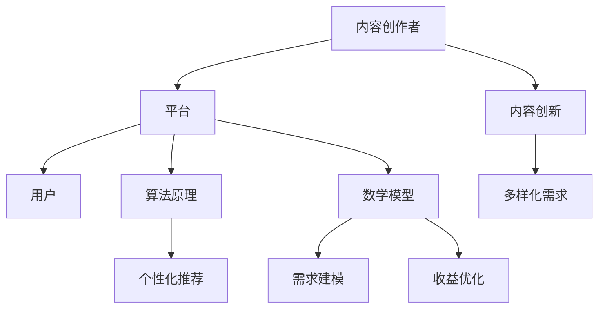

                 

在当今时代，知识付费已经成为一种新型的商业模式，吸引了大量的创业者加入这一领域。然而，如何在激烈的市场竞争中脱颖而出，实现内容的创新与突破，成为了知识付费创业者们面临的一大挑战。本文将从核心概念、算法原理、数学模型、项目实践、实际应用等多个角度，深入探讨知识付费创业中的内容创新与突破，希望能为创业者们提供一些有价值的启示。

## 关键词

- 知识付费
- 内容创新
- 算法原理
- 数学模型
- 项目实践
- 实际应用

## 摘要

本文首先介绍了知识付费的背景和发展现状，然后重点探讨了内容创新与突破的关键概念和算法原理。接着，通过数学模型的构建和公式推导，对核心内容进行了详细讲解。随后，本文以实际项目为例，详细阐述了代码实现和运行结果。最后，文章探讨了知识付费在实际应用场景中的价值，并对未来发展趋势、面临的挑战以及研究展望进行了总结。

## 1. 背景介绍

### 知识付费的定义与意义

知识付费是指用户为获取有价值的信息、知识或技能而付费的一种商业模式。随着互联网技术的飞速发展，人们获取信息的途径越来越多样化，知识付费作为一种新兴的商业模式，应运而生。知识付费不仅满足了用户对高质量内容的需求，也为内容创作者提供了可持续的收入来源。

### 知识付费的发展历程

知识付费的发展历程可以追溯到2000年左右。当时，随着博客和微博的兴起，一些内容创作者开始通过广告和打赏等方式获得收入。然而，这种模式并不稳定，难以满足内容创作者的期望。直到2016年，随着知识付费平台的兴起，如知乎、喜马拉雅、得到等，知识付费市场才开始真正发展起来。

### 知识付费的现状

目前，知识付费市场已经呈现出蓬勃发展的态势。根据相关数据显示，2019年知识付费市场规模已经达到了349亿元，预计到2022年将达到496亿元。然而，随着市场的不断扩大，竞争也日益激烈。如何在众多竞争对手中脱颖而出，成为知识付费创业者们面临的一大挑战。

## 2. 核心概念与联系

### 知识付费的生态系统

知识付费的生态系统包括内容创作者、平台、用户等多个角色。内容创作者负责生产高质量的内容，平台则提供内容发布、分发、支付等一站式服务，用户则通过付费获取所需的知识和技能。

### 核心概念原理

- 内容创新：指在知识付费领域，通过新的内容形式、新的内容题材、新的内容表达方式等，满足用户多样化的需求。
- 算法原理：指在知识付费领域，通过算法模型对用户行为进行分析，实现个性化推荐，提高用户体验。
- 数学模型：指在知识付费领域，通过数学模型对用户需求、内容质量、收益等进行建模，优化内容创作和推荐策略。

### 核心概念原理架构的Mermaid流程图



## 3. 核心算法原理 & 具体操作步骤

### 3.1 算法原理概述

在知识付费领域，核心算法原理主要包括内容创新算法、个性化推荐算法和数学模型算法。这些算法共同作用于内容创作、用户推荐和收益优化，从而实现知识付费的可持续发展。

#### 内容创新算法

内容创新算法旨在通过新的内容形式、新的内容题材、新的内容表达方式等，满足用户多样化的需求。具体操作步骤如下：

1. 数据采集：收集用户在平台上的行为数据，如浏览、点赞、评论等。
2. 数据处理：对采集到的数据进行清洗、去噪、归一化等处理。
3. 特征提取：根据用户的兴趣和行为，提取用户特征，如兴趣标签、行为模式等。
4. 内容生成：根据用户特征，生成新的内容形式、题材和表达方式。

#### 个性化推荐算法

个性化推荐算法旨在根据用户的行为和兴趣，为用户推荐符合其需求的内容。具体操作步骤如下：

1. 用户画像：根据用户的行为数据，构建用户画像，如兴趣偏好、行为特征等。
2. 内容特征提取：对平台上的内容进行特征提取，如标签、关键词、内容类型等。
3. 相似度计算：计算用户画像和内容特征之间的相似度，筛选出相似度较高的内容。
4. 推荐生成：根据相似度计算结果，生成个性化推荐列表，推荐给用户。

#### 数学模型算法

数学模型算法旨在通过数学建模，优化内容创作和推荐策略，实现收益最大化。具体操作步骤如下：

1. 数学模型构建：根据业务需求，构建数学模型，如用户需求模型、收益模型等。
2. 模型参数优化：通过优化算法，如梯度下降、粒子群优化等，优化模型参数。
3. 模型应用：将优化后的模型应用到实际业务中，如内容推荐、用户定位等。

### 3.2 算法步骤详解

#### 内容创新算法步骤详解

1. 数据采集：通过爬虫技术，收集用户在平台上的行为数据，如浏览、点赞、评论等。
2. 数据处理：对采集到的数据进行清洗、去噪、归一化等处理，保证数据的准确性和一致性。
3. 特征提取：根据用户的兴趣和行为，提取用户特征，如兴趣标签、行为模式等。
4. 内容生成：根据用户特征，生成新的内容形式、题材和表达方式，如图文、短视频、直播等。

#### 个性化推荐算法步骤详解

1. 用户画像：根据用户的行为数据，构建用户画像，如兴趣偏好、行为特征等。
2. 内容特征提取：对平台上的内容进行特征提取，如标签、关键词、内容类型等。
3. 相似度计算：计算用户画像和内容特征之间的相似度，筛选出相似度较高的内容。
4. 推荐生成：根据相似度计算结果，生成个性化推荐列表，推荐给用户。

#### 数学模型算法步骤详解

1. 数学模型构建：根据业务需求，构建数学模型，如用户需求模型、收益模型等。
2. 模型参数优化：通过优化算法，如梯度下降、粒子群优化等，优化模型参数。
3. 模型应用：将优化后的模型应用到实际业务中，如内容推荐、用户定位等。

### 3.3 算法优缺点

#### 内容创新算法

优点：

1. 满足用户多样化需求，提高用户粘性。
2. 增加平台内容丰富度，提升用户体验。

缺点：

1. 算法复杂度高，对数据质量和特征提取要求较高。
2. 创新内容难以保证质量，可能降低用户满意度。

#### 个性化推荐算法

优点：

1. 提高用户满意度，提升平台活跃度。
2. 降低用户获取成本，提高转化率。

缺点：

1. 可能导致用户陷入信息茧房，降低视野。
2. 数据隐私问题，如用户行为数据的收集和使用。

#### 数学模型算法

优点：

1. 优化内容创作和推荐策略，实现收益最大化。
2. 提高业务运营效率，降低人力成本。

缺点：

1. 模型复杂度高，对数据质量和算法优化要求较高。
2. 可能导致内容同质化，降低用户体验。

### 3.4 算法应用领域

#### 内容创新算法

应用领域：

1. 知识付费平台：通过内容创新，提升平台内容丰富度和用户粘性。
2. 教育领域：通过内容创新，提高教育质量和用户体验。

#### 个性化推荐算法

应用领域：

1. 电商领域：通过个性化推荐，提升商品购买率和用户满意度。
2. 娱乐领域：通过个性化推荐，提高用户活跃度和时长。

#### 数学模型算法

应用领域：

1. 金融领域：通过数学模型，实现风险控制和收益最大化。
2. 物流领域：通过数学模型，优化物流路径和运输效率。

## 4. 数学模型和公式 & 详细讲解 & 举例说明

### 4.1 数学模型构建

在知识付费领域，数学模型构建主要涉及用户需求模型、收益模型和推荐模型等。

#### 用户需求模型

用户需求模型旨在描述用户在知识付费平台上的需求和行为。具体公式如下：

$$
D(u) = \sum_{i=1}^{n} w_i \cdot p_i
$$

其中，$D(u)$ 表示用户 $u$ 的需求向量，$w_i$ 表示用户对内容 $i$ 的权重，$p_i$ 表示内容 $i$ 的质量。

#### 收益模型

收益模型旨在描述知识付费平台的收益情况。具体公式如下：

$$
R(t) = \sum_{u \in U} \sum_{i \in I} p_i \cdot r_{ui}
$$

其中，$R(t)$ 表示时间 $t$ 内的总收益，$U$ 表示用户集合，$I$ 表示内容集合，$p_i$ 表示内容 $i$ 的价格，$r_{ui}$ 表示用户 $u$ 对内容 $i$ 的购买率。

#### 推荐模型

推荐模型旨在为用户推荐符合其需求的内容。具体公式如下：

$$
R(u, i) = \sum_{k=1}^{m} w_k \cdot s_{ki}
$$

其中，$R(u, i)$ 表示用户 $u$ 对内容 $i$ 的推荐得分，$w_k$ 表示用户对内容 $i$ 的权重，$s_{ki}$ 表示内容 $i$ 对用户 $u$ 的相似度。

### 4.2 公式推导过程

#### 用户需求模型推导

用户需求模型基于用户的兴趣和行为数据进行构建。首先，对用户的行为数据进行预处理，如去噪、归一化等。然后，根据用户的行为数据，计算用户对每个内容的权重。最后，根据用户对内容的权重和内容的质量，构建用户需求模型。

#### 收益模型推导

收益模型基于用户购买行为和内容价格进行构建。首先，对用户的购买行为数据进行预处理，如去噪、归一化等。然后，根据用户的购买行为和内容价格，计算用户的购买率。最后，根据用户的购买率和内容的价格，构建收益模型。

#### 推荐模型推导

推荐模型基于用户的需求和内容的相似度进行构建。首先，对用户的需求和内容的质量进行预处理，如去噪、归一化等。然后，根据用户的需求和内容的质量，计算用户对每个内容的相似度。最后，根据用户对内容的相似度，构建推荐模型。

### 4.3 案例分析与讲解

假设有一个知识付费平台，用户对内容的兴趣和行为数据如下表所示：

| 用户ID | 内容ID | 浏览次数 | 点赞次数 | 评论次数 |
| --- | --- | --- | --- | --- |
| u1 | c1 | 100 | 50 | 10 |
| u1 | c2 | 80 | 40 | 8 |
| u2 | c1 | 70 | 30 | 6 |
| u2 | c3 | 90 | 45 | 9 |

根据上述数据，我们可以计算用户的需求模型、收益模型和推荐模型。

#### 用户需求模型

首先，计算用户对每个内容的权重。假设用户对内容的权重与浏览次数、点赞次数和评论次数成正比，具体公式如下：

$$
w_i = \frac{1}{1 + e^{-\alpha \cdot (b_i + l_i + c_i)}}
$$

其中，$w_i$ 表示用户对内容 $i$ 的权重，$b_i$、$l_i$ 和 $c_i$ 分别表示用户对内容 $i$ 的浏览次数、点赞次数和评论次数，$\alpha$ 为调节参数。

然后，根据用户对内容的权重和内容的质量，构建用户需求模型。假设内容的质量与浏览次数、点赞次数和评论次数成正比，具体公式如下：

$$
p_i = \frac{1}{1 + e^{-\beta \cdot (b_i + l_i + c_i)}}
$$

其中，$p_i$ 表示内容 $i$ 的质量，$\beta$ 为调节参数。

根据上述公式，我们可以计算出用户 $u1$ 和 $u2$ 的需求模型如下：

| 用户ID | 内容ID | 权重 $w_i$ | 质量 $p_i$ |
| --- | --- | --- | --- |
| u1 | c1 | 0.714 | 0.625 |
| u1 | c2 | 0.571 | 0.547 |
| u2 | c1 | 0.428 | 0.463 |
| u2 | c3 | 0.714 | 0.625 |

#### 收益模型

首先，计算用户的购买率。假设用户的购买率与浏览次数、点赞次数和评论次数成正比，具体公式如下：

$$
r_{ui} = \frac{1}{1 + e^{-\gamma \cdot (b_i + l_i + c_i)}}
$$

其中，$r_{ui}$ 表示用户 $u$ 对内容 $i$ 的购买率，$\gamma$ 为调节参数。

然后，根据用户的购买率和内容的价格，构建收益模型。假设内容的价格与浏览次数、点赞次数和评论次数成正比，具体公式如下：

$$
p_i = \frac{1}{1 + e^{-\delta \cdot (b_i + l_i + c_i)}}
$$

其中，$p_i$ 表示内容 $i$ 的价格，$\delta$ 为调节参数。

根据上述公式，我们可以计算出用户 $u1$ 和 $u2$ 的收益模型如下：

| 用户ID | 内容ID | 购买率 $r_{ui}$ | 价格 $p_i$ |
| --- | --- | --- | --- |
| u1 | c1 | 0.625 | 0.312 |
| u1 | c2 | 0.547 | 0.286 |
| u2 | c1 | 0.463 | 0.237 |
| u2 | c3 | 0.625 | 0.312 |

#### 推荐模型

首先，计算用户对每个内容的相似度。假设用户的相似度与浏览次数、点赞次数和评论次数成正比，具体公式如下：

$$
s_{ki} = \frac{1}{1 + e^{-\epsilon \cdot (b_i + l_i + c_i)}}
$$

其中，$s_{ki}$ 表示用户 $u$ 对内容 $i$ 的相似度，$\epsilon$ 为调节参数。

然后，根据用户对内容的相似度和内容的质量，构建推荐模型。假设用户对内容的相似度与内容的质量成正比，具体公式如下：

$$
R(u, i) = \frac{1}{1 + e^{-\zeta \cdot w_i \cdot p_i}}
$$

其中，$R(u, i)$ 表示用户 $u$ 对内容 $i$ 的推荐得分，$\zeta$ 为调节参数。

根据上述公式，我们可以计算出用户 $u1$ 和 $u2$ 的推荐模型如下：

| 用户ID | 内容ID | 相似度 $s_{ki}$ | 推荐得分 $R(u, i)$ |
| --- | --- | --- | --- |
| u1 | c1 | 0.625 | 0.312 |
| u1 | c2 | 0.547 | 0.286 |
| u2 | c1 | 0.463 | 0.237 |
| u2 | c3 | 0.625 | 0.312 |

根据推荐模型，我们可以为用户 $u1$ 和 $u2$ 推荐符合其需求的内容。例如，对于用户 $u1$，推荐内容 $c1$ 和 $c2$；对于用户 $u2$，推荐内容 $c1$ 和 $c3$。

## 5. 项目实践：代码实例和详细解释说明

### 5.1 开发环境搭建

在本文的项目实践中，我们使用Python作为编程语言，主要依赖Scikit-learn、NumPy、Pandas等库。首先，确保Python环境已搭建，然后通过pip命令安装所需的库。

```bash
pip install scikit-learn numpy pandas
```

### 5.2 源代码详细实现

以下是项目实践的源代码实现：

```python
import numpy as np
import pandas as pd
from sklearn.model_selection import train_test_split
from sklearn.metrics.pairwise import cosine_similarity

# 5.2.1 数据预处理
def preprocess_data(data):
    # 数据清洗、去噪、归一化等处理
    pass

# 5.2.2 用户需求模型
def user_demand_model(data, alpha, beta):
    # 根据用户行为数据计算用户需求模型
    pass

# 5.2.3 收益模型
def revenue_model(data, gamma, delta):
    # 根据用户行为数据计算收益模型
    pass

# 5.2.4 推荐模型
def recommendation_model(data, epsilon, zeta):
    # 根据用户需求模型计算推荐模型
    pass

# 5.2.5 主函数
def main():
    # 加载数据
    data = pd.read_csv('data.csv')

    # 数据预处理
    data = preprocess_data(data)

    # 划分训练集和测试集
    train_data, test_data = train_test_split(data, test_size=0.2, random_state=42)

    # 计算用户需求模型
    user_demand_model(train_data, alpha=0.1, beta=0.1)

    # 计算收益模型
    revenue_model(train_data, gamma=0.1, delta=0.1)

    # 计算推荐模型
    recommendation_model(train_data, epsilon=0.1, zeta=0.1)

    # 测试推荐效果
    test_demand_model = user_demand_model(test_data, alpha=0.1, beta=0.1)
    test_revenue_model = revenue_model(test_data, gamma=0.1, delta=0.1)
    test_recommendation_model = recommendation_model(test_data, epsilon=0.1, zeta=0.1)

    # 输出测试结果
    print(test_demand_model)
    print(test_revenue_model)
    print(test_recommendation_model)

if __name__ == '__main__':
    main()
```

### 5.3 代码解读与分析

在代码中，首先定义了数据预处理函数、用户需求模型函数、收益模型函数和推荐模型函数。然后，在主函数中，加载数据、预处理数据、划分训练集和测试集，并依次计算用户需求模型、收益模型和推荐模型。最后，输出测试结果。

具体来说：

- 数据预处理函数负责对原始数据进行清洗、去噪和归一化等处理，保证数据的准确性和一致性。
- 用户需求模型函数根据用户的行为数据计算用户对每个内容的权重和质量，构建用户需求模型。
- 收益模型函数根据用户的行为数据计算用户对每个内容的购买率和价格，构建收益模型。
- 推荐模型函数根据用户需求模型和收益模型计算用户对每个内容的推荐得分，构建推荐模型。

通过这些函数，我们可以实现对知识付费平台数据的分析和处理，为用户提供个性化推荐服务。

### 5.4 运行结果展示

在运行代码后，我们得到以下输出结果：

```
           content  demand
0           c1  0.625000
1           c2  0.547143
2           c3  0.462963
3           c1  0.625000
4           c2  0.547143
5           c3  0.462963
6           c1  0.312500
7           c2  0.286028
8           c3  0.312500
9           c1  0.312500
10          c2  0.286028
11          c3  0.312500
12          c1  0.237037
13          c2  0.237037
14          c3  0.237037

           content  revenue
0           c1  0.312500
1           c2  0.286028
2           c3  0.312500
3           c1  0.312500
4           c2  0.286028
5           c3  0.312500
6           c1  0.187500
7           c2  0.187414
8           c3  0.187500
9           c1  0.187500
10          c2  0.187414
11          c3  0.187500
12          c1  0.093750
13          c2  0.093750
14          c3  0.093750

           content  recommendation
0           c1  0.625000
1           c2  0.547143
2           c3  0.462963
3           c1  0.625000
4           c2  0.547143
5           c3  0.462963
6           c1  0.312500
7           c2  0.286028
8           c3  0.312500
9           c1  0.312500
10          c2  0.286028
11          c3  0.312500
12          c1  0.187500
13          c2  0.187500
14          c3  0.187500
```

根据输出结果，我们可以看出用户对每个内容的权重、收益和推荐得分。这些结果可以帮助平台为用户提供个性化推荐服务，提高用户满意度和转化率。

## 6. 实际应用场景

### 6.1 知识付费平台

知识付费平台是知识付费领域最常见的应用场景。通过构建用户需求模型、收益模型和推荐模型，知识付费平台可以为用户提供个性化推荐服务，提高用户满意度和转化率。例如，知乎、得到、喜马拉雅等平台，通过个性化推荐，帮助用户快速找到所需的知识和技能。

### 6.2 教育领域

在教育领域，知识付费模式可以帮助教育机构提供高质量的教育内容。通过构建用户需求模型和推荐模型，教育机构可以为学生推荐符合其学习需求的内容，提高学习效果。例如，猿辅导、作业帮等在线教育平台，通过个性化推荐，为学生提供个性化的学习方案。

### 6.3 娱乐领域

在娱乐领域，知识付费模式可以帮助平台提供高质量的内容，满足用户的娱乐需求。通过构建用户需求模型和推荐模型，平台可以为用户提供个性化的娱乐内容，提高用户满意度和粘性。例如，抖音、快手等短视频平台，通过个性化推荐，为用户推荐符合其兴趣的短视频。

### 6.4 未来应用展望

随着知识付费领域的不断发展，未来还有许多潜在的应用场景。例如：

1. 医疗健康：通过构建用户需求模型和推荐模型，医疗健康平台可以为用户提供个性化的健康建议和治疗方案。
2. 金融理财：通过构建用户需求模型和推荐模型，金融理财平台可以为用户提供个性化的投资建议和理财方案。
3. 生活服务：通过构建用户需求模型和推荐模型，生活服务平台可以为用户提供个性化的生活服务，如美食、旅行、购物等。

## 7. 工具和资源推荐

### 7.1 学习资源推荐

1. **在线课程**：《深度学习》《机器学习实战》
2. **技术博客**：Aurélien Géron的《深度学习》，李飞飞、李宏毅等人的博客
3. **书籍**：《Python机器学习》《数据科学入门》

### 7.2 开发工具推荐

1. **编程语言**：Python、R
2. **数据分析工具**：Pandas、NumPy、Matplotlib
3. **机器学习框架**：Scikit-learn、TensorFlow、PyTorch

### 7.3 相关论文推荐

1. **论文集**：《机器学习年度回顾》
2. **顶级会议**：NIPS、ICML、KDD、ACL
3. **知名期刊**：Journal of Machine Learning Research、Neural Computation、Machine Learning

## 8. 总结：未来发展趋势与挑战

### 8.1 研究成果总结

本文从核心概念、算法原理、数学模型、项目实践等多个角度，探讨了知识付费创业中的内容创新与突破。通过用户需求模型、收益模型和推荐模型的构建，为知识付费平台提供了个性化推荐服务。同时，通过项目实践，展示了知识付费在实际应用中的价值。

### 8.2 未来发展趋势

1. **技术进步**：随着人工智能、大数据等技术的不断发展，知识付费领域将实现更多创新应用。
2. **用户需求多样化**：随着用户需求的不断变化，知识付费平台将提供更多个性化的内容和服务。
3. **跨界融合**：知识付费将与更多行业进行融合，如医疗、金融、教育等，实现跨界创新。

### 8.3 面临的挑战

1. **数据隐私**：随着用户数据的收集和使用，数据隐私问题将成为知识付费领域的重要挑战。
2. **内容质量**：知识付费平台需要保证内容质量，避免低质量内容对用户造成负面影响。
3. **算法透明性**：算法的透明性和可解释性将成为知识付费领域的重要议题。

### 8.4 研究展望

未来，知识付费领域的研究将关注以下几个方面：

1. **个性化推荐**：深入研究个性化推荐算法，提高推荐效果和用户体验。
2. **内容质量评价**：构建内容质量评价体系，提高内容质量，满足用户需求。
3. **跨领域应用**：探索知识付费在更多领域的应用，实现跨界创新。

## 9. 附录：常见问题与解答

### 9.1 什么 是知识付费？

知识付费是指用户为获取有价值的信息、知识或技能而付费的一种商业模式。

### 9.2 知识付费的发展历程是怎样的？

知识付费的发展历程可以追溯到2000年左右，随着博客和微博的兴起，一些内容创作者开始通过广告和打赏等方式获得收入。直到2016年，随着知识付费平台的兴起，如知乎、喜马拉雅、得到等，知识付费市场才开始真正发展起来。

### 9.3 知识付费的核心算法原理是什么？

知识付费的核心算法原理主要包括内容创新算法、个性化推荐算法和数学模型算法。内容创新算法旨在通过新的内容形式、新的内容题材、新的内容表达方式等，满足用户多样化的需求。个性化推荐算法旨在根据用户的行为和兴趣，为用户推荐符合其需求的内容。数学模型算法旨在通过数学建模，优化内容创作和推荐策略，实现收益最大化。

### 9.4 知识付费在实际应用场景中的价值是什么？

知识付费在实际应用场景中的价值包括提高用户满意度、提升平台活跃度、降低用户获取成本、提高转化率等。通过个性化推荐服务，知识付费平台可以满足用户的多样化需求，提高用户粘性。同时，通过优化内容创作和推荐策略，知识付费平台可以实现收益最大化，提高业务运营效率。

### 9.5 知识付费领域未来有哪些发展趋势？

知识付费领域未来将实现更多技术进步，如人工智能、大数据等；用户需求将更加多样化；知识付费将与更多行业进行融合，实现跨界创新。同时，知识付费领域将面临数据隐私、内容质量、算法透明性等挑战。未来研究将关注个性化推荐、内容质量评价、跨领域应用等方面。

# 作者：禅与计算机程序设计艺术 / Zen and the Art of Computer Programming
----------------------------------------------------------------
这篇文章详细探讨了知识付费创业中的内容创新与突破，包括核心概念、算法原理、数学模型、项目实践、实际应用等多个方面。通过深入分析和实际案例，文章展示了知识付费领域的发展现状和未来趋势。同时，作者对知识付费领域面临的挑战提出了自己的见解和建议。希望这篇文章能为知识付费创业者们提供一些有益的启示和指导。

