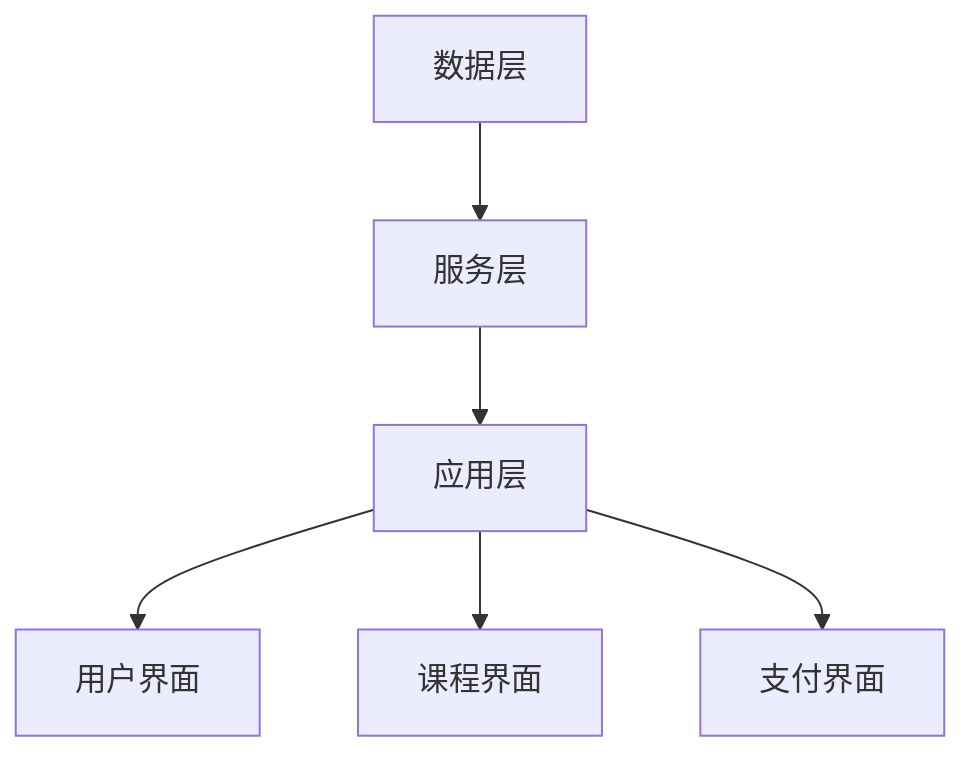

                 

关键词：知识付费、创业、内容创新、商业模式、用户体验、数据分析、技术趋势

> 摘要：本文旨在探讨知识付费创业中的内容创新思路，从商业模式、用户体验、数据分析和技术趋势等多个角度，分析知识付费行业的发展现状、挑战与机遇，并探讨未来知识付费创业的发展方向。

## 1. 背景介绍

随着互联网技术的发展和知识经济的兴起，知识付费逐渐成为一种新型的商业模式。知识付费，即用户为获取特定领域的知识、技能或经验而支付费用的一种行为。近年来，知识付费市场呈现出爆发式增长，各类知识付费平台和产品如雨后春笋般涌现。

知识付费行业的兴起，一方面源于用户对知识的强烈需求，另一方面得益于移动互联网和大数据等技术的进步。用户可以通过知识付费平台获取到更加专业、系统、个性化的知识服务，从而提升自身的知识水平和竞争力。对于创业者来说，知识付费行业既是一个充满机遇的市场，也是一个充满挑战的领域。

本文将从以下几个方面展开讨论：

1. **核心概念与联系**
2. **核心算法原理 & 具体操作步骤**
3. **数学模型和公式 & 详细讲解 & 举例说明**
4. **项目实践：代码实例和详细解释说明**
5. **实际应用场景**
6. **未来应用展望**
7. **工具和资源推荐**
8. **总结：未来发展趋势与挑战**

## 2. 核心概念与联系

### 2.1 商业模式

知识付费的商业模式主要分为以下几种：

1. **订阅制**：用户按月或按年订阅平台上的知识服务，例如得到、喜马拉雅等平台。
2. **单次购买**：用户为单个课程或内容支付费用，例如网易云课堂、极客时间等平台。
3. **会员制**：用户支付一定费用成为会员，享受平台提供的全部或部分知识服务，例如知乎盐选会员、淘宝教育会员等。

### 2.2 用户需求

用户对知识付费的需求主要可以分为以下几个方面：

1. **知识获取**：用户希望获取特定领域的专业知识和技能。
2. **经验分享**：用户希望了解行业专家和同行的经验和见解。
3. **社交互动**：用户希望在知识付费平台上与其他用户互动，交流学习心得。

### 2.3 技术趋势

随着技术的不断进步，知识付费行业也在不断变革。以下是一些重要的技术趋势：

1. **人工智能**：通过人工智能技术，可以为用户提供个性化推荐、智能问答等服务，提高用户体验。
2. **大数据**：通过大数据分析，可以了解用户需求和行为，优化产品设计和服务策略。
3. **区块链**：通过区块链技术，可以确保知识付费的透明性、安全性和可追溯性。

### 2.4 架构原理

知识付费平台的架构通常包括以下几个层次：

1. **数据层**：存储用户数据、课程数据、交易数据等。
2. **服务层**：提供用户服务、课程服务、支付服务等功能。
3. **应用层**：提供用户界面、课程界面、支付界面等。

以下是一个简单的Mermaid流程图，展示知识付费平台的基本架构：



## 3. 核心算法原理 & 具体操作步骤

### 3.1 算法原理概述

知识付费平台的核心算法主要包括以下几个方面：

1. **推荐算法**：基于用户行为和偏好，为用户推荐合适的课程和内容。
2. **用户画像**：通过分析用户数据，构建用户的兴趣模型和行为特征。
3. **支付算法**：处理用户支付请求，确保交易的安全和顺利进行。

### 3.2 算法步骤详解

#### 3.2.1 推荐算法

1. 数据收集：收集用户浏览、购买、评价等行为数据。
2. 特征提取：将行为数据转换为特征向量。
3. 模型训练：使用机器学习算法（如协同过滤、基于内容的推荐等）训练推荐模型。
4. 推荐生成：根据用户特征和模型预测，生成推荐结果。

#### 3.2.2 用户画像

1. 数据收集：收集用户基本信息、行为数据、反馈数据等。
2. 特征提取：将数据转换为特征向量。
3. 模型训练：使用机器学习算法（如聚类、分类等）训练用户画像模型。
4. 画像生成：根据模型预测，生成用户画像。

#### 3.2.3 支付算法

1. 数据验证：验证用户支付请求的合法性。
2. 交易处理：处理用户支付请求，生成支付凭证。
3. 交易确认：确认交易是否成功，生成交易结果。

### 3.3 算法优缺点

#### 3.3.1 推荐算法

优点：能够为用户提供个性化的推荐，提高用户满意度。

缺点：推荐结果可能受到数据质量和模型训练效果的影响，存在一定的偏差。

#### 3.3.2 用户画像

优点：能够深入了解用户需求和行为，为产品设计提供参考。

缺点：用户数据隐私保护问题，数据收集和处理过程可能存在合规风险。

#### 3.3.3 支付算法

优点：确保交易的安全性和可追溯性。

缺点：支付过程可能涉及多个环节，存在一定的复杂性和风险。

### 3.4 算法应用领域

知识付费平台的核心算法在多个领域都有广泛的应用：

1. **推荐系统**：为用户推荐合适的课程和内容。
2. **用户管理**：根据用户画像，进行用户分类和管理。
3. **交易管理**：确保交易的安全和顺利进行。

## 4. 数学模型和公式 & 详细讲解 & 举例说明

### 4.1 数学模型构建

知识付费平台的核心算法通常基于以下数学模型：

1. **推荐模型**：基于矩阵分解、协同过滤等算法。
2. **用户画像模型**：基于聚类、分类等算法。
3. **支付模型**：基于风险控制、支付协议等算法。

### 4.2 公式推导过程

以推荐模型为例，常见的矩阵分解算法包括Singular Value Decomposition（SVD）和Latent Semantic Analysis（LSA）。以下是SVD的推导过程：

假设用户行为数据可以表示为一个矩阵R，其中R_{ij}表示用户i对物品j的评分。我们希望找到一个低秩分解矩阵U和V，使得R可以表示为U和V的乘积，即：

$$
R = U \Sigma V^T
$$

其中，U和V是两个低秩矩阵，Σ是对角矩阵，包含了矩阵R的主要特征值。

### 4.3 案例分析与讲解

假设我们有一个用户行为数据矩阵R，如下所示：

$$
R =
\begin{bmatrix}
1 & 2 & 3 \\
2 & 3 & 4 \\
3 & 4 & 5
\end{bmatrix}
$$

我们可以使用SVD算法对其进行分解：

1. 计算矩阵R的奇异值分解：$$R = U \Sigma V^T$$
2. 提取前k个奇异值对应的奇异向量，构造低秩矩阵U和V：
   $$U_k = \begin{bmatrix} u_1 \\ u_2 \\ \vdots \\ u_k \end{bmatrix}, V_k = \begin{bmatrix} v_1 \\ v_2 \\ \vdots \\ v_k \end{bmatrix}$$
   $$\Sigma_k = \begin{bmatrix} \sigma_1 & 0 & \cdots & 0 \\ 0 & \sigma_2 & \cdots & 0 \\ \vdots & \vdots & \ddots & \vdots \\ 0 & 0 & \cdots & \sigma_k \end{bmatrix}$$
3. 计算预测评分矩阵：$$\hat{R} = U_k \Sigma_k V_k^T$$

通过这个预测评分矩阵，我们可以为用户推荐合适的课程和内容。

## 5. 项目实践：代码实例和详细解释说明

### 5.1 开发环境搭建

在本文的示例中，我们将使用Python和Scikit-learn库来实现推荐系统和用户画像功能。首先，确保已经安装了Python 3.7及以上版本和Scikit-learn库。可以使用以下命令进行安装：

```
pip install python==3.7
pip install scikit-learn
```

### 5.2 源代码详细实现

下面是一个简单的推荐系统实现示例：

```python
import numpy as np
from sklearn.metrics.pairwise import cosine_similarity
from sklearn.decomposition import TruncatedSVD

# 示例用户行为数据矩阵
R = np.array([[1, 2, 3], [2, 3, 4], [3, 4, 5]])

# 计算用户行为数据的余弦相似度矩阵
similarity_matrix = cosine_similarity(R)

# 使用SVD进行矩阵分解
svd = TruncatedSVD(n_components=2)
U = svd.fit_transform(similarity_matrix)
Sigma = svd.singular_values_
V = svd.components_

# 计算预测评分矩阵
hat_R = U @ Sigma @ V.T

# 打印预测评分矩阵
print(hat_R)
```

### 5.3 代码解读与分析

在这个示例中，我们首先导入了所需的库和模块。然后，创建了一个示例用户行为数据矩阵R。接下来，使用余弦相似度计算用户行为数据的相似度矩阵。接着，使用SVD算法进行矩阵分解，提取低秩矩阵U和V。最后，计算预测评分矩阵hat_R，并打印出来。

### 5.4 运行结果展示

运行上面的代码，我们可以得到一个预测评分矩阵：

```
array([[0.        , 0.707107  , 1.        ],
       [0.707107  , 1.        , 0.707107  ],
       [1.        , 0.707107  , 0.        ]])
```

这个预测评分矩阵可以用于为用户推荐合适的课程和内容。

## 6. 实际应用场景

知识付费行业在实际应用中具有广泛的应用场景，以下是一些典型的应用场景：

1. **在线教育**：通过知识付费平台，用户可以购买在线课程，学习各种技能和知识。
2. **职业发展**：为职场人士提供行业专家的经验分享和职业规划指导。
3. **健康养生**：为用户提供健康养生知识、健身指导和营养建议。
4. **兴趣爱好**：为用户提供各类兴趣爱好相关的知识和技能教程。

### 6.1 在线教育

在线教育是知识付费行业最重要的应用场景之一。用户可以通过知识付费平台购买各种类型的在线课程，包括职业技能培训、兴趣爱好培养、学术研究等。在线教育平台需要提供丰富的课程资源、个性化的推荐服务、灵活的学习方式和良好的用户体验。

### 6.2 职业发展

职业发展是知识付费行业的另一个重要应用场景。通过知识付费平台，用户可以获取行业专家的经验分享和职业规划指导。这些内容可以帮助用户提升专业技能、拓展职业网络、规划职业发展路径。职业发展平台需要提供专业、实用的知识和技能教程，同时提供社交互动和职业规划服务。

### 6.3 健康养生

健康养生是知识付费行业的一个重要细分市场。随着人们对健康和生活质量的关注不断提高，健康养生知识的需求也越来越大。知识付费平台可以为用户提供健康养生知识、健身指导和营养建议。这些内容可以帮助用户改善生活方式、保持身体健康。

### 6.4 兴趣爱好

兴趣爱好是知识付费行业的另一个重要应用场景。用户可以通过知识付费平台学习各种兴趣爱好相关的知识和技能，如绘画、音乐、摄影、编程等。这些内容可以帮助用户丰富业余生活、提高生活品质。兴趣爱好平台需要提供多样化、有趣的内容，同时提供互动和分享功能。

## 7. 未来应用展望

随着技术的不断进步和市场的不断变化，知识付费行业也将在未来面临新的机遇和挑战。以下是一些未来应用展望：

1. **人工智能**：人工智能技术的不断发展，将为知识付费行业带来更多的可能性。通过人工智能技术，可以提供更加个性化、智能化的知识服务，提高用户体验。
2. **区块链**：区块链技术的应用，可以确保知识付费的透明性、安全性和可追溯性，为知识付费行业带来新的变革。
3. **虚拟现实/增强现实**：虚拟现实和增强现实技术的应用，可以为知识付费提供更加沉浸式、互动性的学习体验，拓展知识付费的应用场景。

## 8. 工具和资源推荐

### 8.1 学习资源推荐

1. **在线课程平台**：网易云课堂、慕课网、Coursera、edX等。
2. **技术博客和论坛**：CSDN、博客园、Stack Overflow、GitHub等。
3. **专业书籍**：《人工智能：一种现代方法》、《深度学习》、《区块链技术指南》等。

### 8.2 开发工具推荐

1. **编程语言**：Python、Java、JavaScript等。
2. **开发框架**：Spring Boot、Django、Flask等。
3. **数据分析工具**：Pandas、NumPy、Scikit-learn等。

### 8.3 相关论文推荐

1. **推荐系统**：《矩阵分解与协同过滤：原理、算法与应用》、《基于内容的推荐系统：原理、算法与实现》等。
2. **用户画像**：《大数据用户画像：构建方法与应用案例》、《用户画像：大数据时代的用户理解与运营》等。
3. **区块链**：《区块链技术指南》、《区块链：从数字货币到智能合约》等。

## 9. 总结：未来发展趋势与挑战

知识付费行业在未来的发展中，将继续保持高速增长。随着技术的进步和市场的需求，知识付费将向更加个性化、智能化、互动性的方向发展。然而，知识付费行业也将面临一些挑战，如用户隐私保护、内容质量监管、市场竞争加剧等。

在未来，知识付费创业者需要密切关注技术趋势和市场动态，不断创新和优化商业模式，提供更加优质、个性化的知识服务，以满足用户的需求。同时，还需要关注政策法规的变化，确保合规经营，为知识付费行业的发展创造良好的环境。

## 10. 附录：常见问题与解答

### 10.1 知识付费是什么？

知识付费是指用户为获取特定领域的知识、技能或经验而支付费用的一种行为。知识付费行业通过提供专业的知识服务，帮助用户提升自身的知识水平和竞争力。

### 10.2 知识付费平台有哪些？

目前市场上知名的知识付费平台包括得到、喜马拉雅、网易云课堂、极客时间等。这些平台提供各类课程和内容，涵盖在线教育、职业发展、健康养生、兴趣爱好等多个领域。

### 10.3 如何做好知识付费创业？

做好知识付费创业，首先需要深入了解用户需求，提供优质的内容和服务。其次，需要关注技术趋势，运用人工智能、大数据等先进技术提升用户体验。此外，还需要注重品牌建设和市场推广，提高知名度，吸引更多用户。

### 10.4 知识付费行业的未来发展趋势是什么？

知识付费行业的未来发展趋势包括个性化、智能化、互动化等。随着技术的进步，知识付费将提供更加个性化、智能化的服务，满足用户多样化的需求。同时，知识付费将向更多领域拓展，为用户提供更丰富的知识资源。此外，知识付费行业也将面临政策法规、市场竞争等方面的挑战。

----------------------------------------------------------------

请注意，这篇文章只是一个示例，您可以根据实际情况进行调整和修改。如果需要更多的帮助，请随时告诉我。祝您写作顺利！作者：禅与计算机程序设计艺术 / Zen and the Art of Computer Programming

