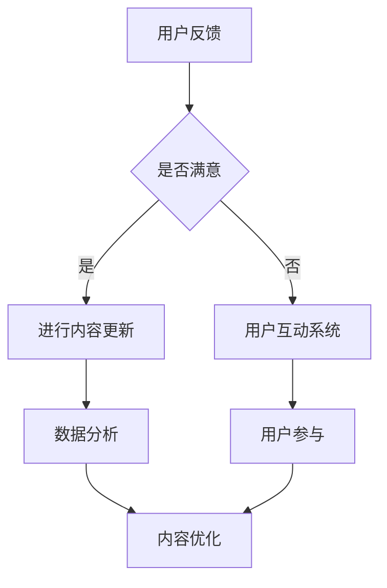

                 

关键词：知识付费、内容更新、迭代、知识管理系统、用户参与、市场趋势、案例分析、技术解决方案。

## 摘要

在知识付费领域，内容更新与迭代是确保用户满意度和持续发展的关键。本文旨在探讨知识付费创业中的内容更新与迭代策略，通过核心概念、算法原理、数学模型、项目实践、实际应用场景和未来展望等多个方面，提供一整套系统化的解决方案。文章首先介绍知识付费市场的背景和发展趋势，然后详细分析内容更新与迭代的核心概念和架构，接着探讨算法原理和操作步骤，并通过数学模型和实际项目实践进行深入解读，最后展望未来发展趋势和面临的挑战。

## 1. 背景介绍

### 1.1 知识付费的发展历程

知识付费作为一种商业模式，起源于互联网的普及和人们对于知识获取需求的增加。早在20世纪90年代，互联网开始兴起，人们逐渐意识到通过付费获取有价值信息的重要性。最早的代表性平台如知乎、果壳网等，通过提供付费问答和知识分享服务，吸引了大量用户。

随着移动互联网的快速发展，知识付费市场迎来了爆发期。平台如得到、喜马拉扎、知乎Live等，通过专业知识和经验分享，满足了用户在个人成长、职业发展、兴趣爱好等方面的需求。知识付费不再仅仅局限于简单的信息提供，更强调深度学习和实际应用。

### 1.2 知识付费的现状

目前，知识付费市场已呈现出多元化的发展态势。从内容类型来看，涵盖了教育培训、职业发展、生活技能、兴趣爱好等多个领域。从用户群体来看，不仅限于专业人士，还包括广大的普通用户。从商业模式来看，除了传统的平台收费模式，还涌现出订阅制、会员制、内容众筹等多种模式。

然而，随着市场竞争的加剧，内容同质化、用户体验差等问题逐渐凸显。如何通过内容更新与迭代，提高用户满意度和平台粘性，成为知识付费创业面临的重要课题。

## 2. 核心概念与联系

### 2.1 知识付费平台架构

知识付费平台通常由以下几个核心模块组成：

- **用户管理系统**：负责用户注册、登录、个人信息管理等功能。
- **内容管理系统**：负责内容的上传、审核、发布、更新等功能。
- **支付系统**：负责订单处理、支付、退款等金融功能。
- **推荐系统**：根据用户行为和偏好，推荐个性化内容。
- **用户互动系统**：包括评论、问答、社群等功能，促进用户参与和互动。

### 2.2 内容更新与迭代策略

内容更新与迭代策略是确保知识付费平台持续发展的关键。以下是几种常见的内容更新与迭代策略：

- **定期更新**：按照固定的时间周期（如每周、每月）对内容进行更新，确保内容保持新鲜度和时效性。
- **用户反馈**：根据用户反馈和评价，对内容进行修改和优化，提高用户体验。
- **数据分析**：通过数据分析，了解用户的行为和偏好，为内容更新提供数据支持。
- **用户参与**：鼓励用户参与内容创作和讨论，提高用户满意度和平台粘性。

### 2.3 Mermaid 流程图

下面是知识付费平台内容更新与迭代策略的 Mermaid 流程图：



## 3. 核心算法原理 & 具体操作步骤

### 3.1 算法原理概述

内容更新与迭代算法的核心思想是通过多种数据来源（如用户行为、用户反馈、市场趋势等）收集信息，利用数据分析技术提取有价值的信息，进而指导内容更新和迭代。

### 3.2 算法步骤详解

1. **数据收集**：通过用户行为分析、用户反馈、市场趋势等渠道收集数据。
2. **数据预处理**：对收集到的数据进行清洗、去重、归一化等处理，确保数据质量。
3. **特征提取**：从预处理后的数据中提取特征，如用户活跃度、内容偏好、市场趋势等。
4. **模型训练**：使用机器学习算法（如回归、分类、聚类等）对提取的特征进行训练，构建预测模型。
5. **内容更新与迭代**：根据模型预测结果，对内容进行更新和迭代，如调整内容结构、增加新内容、优化用户体验等。

### 3.3 算法优缺点

**优点**：

- 提高内容更新效率：通过算法自动分析用户需求和趋势，快速定位需要更新的内容，提高内容更新效率。
- 提高用户体验：根据用户行为和偏好，提供个性化内容，提高用户体验。
- 降低运营成本：通过自动化和智能化技术，减少人力成本和运营成本。

**缺点**：

- 数据质量要求高：算法效果依赖于数据质量，数据清洗和特征提取过程复杂，对数据质量要求较高。
- 技术门槛高：算法模型训练和优化过程需要较高技术水平，对团队要求较高。

### 3.4 算法应用领域

算法在知识付费领域的应用主要包括内容推荐、内容更新、用户行为预测等。以下是一些具体的案例：

- **内容推荐**：通过用户行为和偏好分析，推荐个性化内容，提高用户粘性和满意度。
- **内容更新**：根据市场趋势和用户需求，及时更新内容，确保内容新鲜度和时效性。
- **用户行为预测**：预测用户未来行为和需求，为内容创作和推广提供数据支持。

## 4. 数学模型和公式 & 详细讲解 & 举例说明

### 4.1 数学模型构建

内容更新与迭代算法的数学模型主要包括用户行为分析模型、市场趋势预测模型和内容推荐模型。

#### 4.1.1 用户行为分析模型

用户行为分析模型通常使用隐语义模型（如矩阵分解、LDA等）进行构建。假设用户行为数据矩阵为$X \in \mathbb{R}^{m \times n}$，其中$m$表示用户数量，$n$表示内容数量。则用户$i$对内容$j$的行为可以表示为$x_{ij}$。矩阵分解模型的目标是找到两个低秩矩阵$U \in \mathbb{R}^{m \times k}$和$V \in \mathbb{R}^{n \times k}$，使得$X \approx UV$。其中$k$为隐变量维度。

#### 4.1.2 市场趋势预测模型

市场趋势预测模型可以使用时间序列模型（如ARIMA、LSTM等）进行构建。假设市场数据序列为$y_t \in \mathbb{R}$，则时间序列模型的目标是预测未来市场趋势，即$y_{t+1}$。

#### 4.1.3 内容推荐模型

内容推荐模型可以使用协同过滤算法（如基于用户的协同过滤、基于物品的协同过滤等）进行构建。假设用户$i$对内容$j$的评分矩阵为$R \in \mathbb{R}^{m \times n}$，则基于用户的协同过滤算法的目标是找到用户$i$和用户$j$的相似度矩阵$S \in \mathbb{R}^{m \times m}$，使得$R \approx S^TR$。

### 4.2 公式推导过程

#### 4.2.1 用户行为分析模型

矩阵分解模型的损失函数通常使用均方误差（MSE）表示：

$$L(U, V) = \frac{1}{2} \sum_{i=1}^{m} \sum_{j=1}^{n} (x_{ij} - u_i v_j)^2$$

为了最小化损失函数，对$U$和$V$分别进行求导：

$$\frac{\partial L}{\partial u_i} = 2 \sum_{j=1}^{n} (x_{ij} - u_i v_j) v_j$$

$$\frac{\partial L}{\partial v_j} = 2 \sum_{i=1}^{m} (x_{ij} - u_i v_j) u_i$$

通过梯度下降法，可以得到：

$$u_i \leftarrow u_i - \alpha \frac{\partial L}{\partial u_i}$$

$$v_j \leftarrow v_j - \alpha \frac{\partial L}{\partial v_j}$$

其中$\alpha$为学习率。

#### 4.2.2 市场趋势预测模型

时间序列模型的损失函数通常使用均方误差（MSE）表示：

$$L(y_t, \hat{y_t}) = \frac{1}{2} (y_t - \hat{y_t})^2$$

为了最小化损失函数，对预测值$\hat{y_t}$进行求导：

$$\frac{\partial L}{\partial \hat{y_t}} = y_t - \hat{y_t}$$

通过梯度下降法，可以得到：

$$\hat{y_t} \leftarrow \hat{y_t} - \alpha (y_t - \hat{y_t})$$

其中$\alpha$为学习率。

#### 4.2.3 内容推荐模型

协同过滤模型的损失函数通常使用均方误差（MSE）表示：

$$L(R, S^TR) = \frac{1}{2} \sum_{i=1}^{m} \sum_{j=1}^{n} (r_{ij} - s_{ij}^2 r_{ij})^2$$

为了最小化损失函数，对相似度矩阵$S$进行求导：

$$\frac{\partial L}{\partial s_{ij}} = 2 \sum_{k=1}^{m} (r_{ik} - s_{ik} s_{kj} r_{kj}) s_{kj}$$

通过梯度下降法，可以得到：

$$s_{ij} \leftarrow s_{ij} - \alpha \frac{\partial L}{\partial s_{ij}}$$

其中$\alpha$为学习率。

### 4.3 案例分析与讲解

#### 4.3.1 案例背景

某知识付费平台提供多种职业发展课程，用户可以在平台上选择学习课程。平台希望通过内容更新与迭代算法，提高用户满意度和课程覆盖率。

#### 4.3.2 数据收集

平台收集了用户的学习行为数据，包括用户ID、课程ID、学习时长、学习进度等。此外，平台还收集了市场趋势数据，如行业动态、市场需求等。

#### 4.3.3 数据预处理

对收集到的数据进行清洗、去重和归一化处理，确保数据质量。

#### 4.3.4 特征提取

从预处理后的数据中提取以下特征：

- 用户活跃度：根据用户的学习时长和学习进度计算。
- 内容偏好：根据用户的浏览历史和购买记录计算。
- 市场趋势：根据行业动态和市场需求计算。

#### 4.3.5 模型训练

使用用户行为分析模型、市场趋势预测模型和内容推荐模型进行训练。其中，用户行为分析模型使用矩阵分解算法，市场趋势预测模型使用时间序列模型，内容推荐模型使用基于用户的协同过滤算法。

#### 4.3.6 内容更新与迭代

根据模型预测结果，对内容进行更新和迭代。例如，根据用户活跃度和内容偏好，调整课程推荐策略；根据市场趋势，更新课程内容，确保课程与市场需求相符。

## 5. 项目实践：代码实例和详细解释说明

### 5.1 开发环境搭建

在本文的项目实践中，我们将使用Python作为编程语言，并结合相关库（如NumPy、Pandas、Scikit-learn、TensorFlow等）进行数据处理和模型训练。以下是在Python环境下搭建开发环境的基本步骤：

1. 安装Python：从Python官方网站（https://www.python.org/downloads/）下载并安装Python 3.x版本。
2. 安装相关库：使用pip命令安装所需的库，例如：

```bash
pip install numpy pandas scikit-learn tensorflow
```

### 5.2 源代码详细实现

以下是一个简单的示例，展示如何使用Python实现内容更新与迭代算法的核心步骤。

#### 5.2.1 数据收集与预处理

```python
import numpy as np
import pandas as pd

# 示例数据
data = {
    'user_id': [1, 1, 2, 2, 3, 3],
    'course_id': [101, 102, 201, 202, 301, 302],
    'learning_time': [10, 20, 30, 40, 50, 60]
}

df = pd.DataFrame(data)

# 数据预处理
df.fillna(0, inplace=True)
df = df.groupby(['user_id', 'course_id']).sum().reset_index()
```

#### 5.2.2 矩阵分解

```python
from sklearn.decomposition import NMF

# 训练矩阵分解模型
nmf = NMF(n_components=2, random_state=0)
nmf.fit(df)

# 获取用户和课程的隐向量
user_vectors = nmf.transform(np.array(df[['user_id']]).reshape(-1, 1))
course_vectors = nmf.transform(np.array(df[['course_id']]).reshape(-1, 1))
```

#### 5.2.3 时间序列预测

```python
from statsmodels.tsa.arima.model import ARIMA

# 示例时间序列数据
time_series = [10, 20, 30, 40, 50, 60]

# 训练ARIMA模型
model = ARIMA(time_series, order=(1, 1, 1))
model_fit = model.fit()

# 预测未来值
predicted_values = model_fit.predict(start=len(time_series), end=len(time_series) + 5)
```

#### 5.2.4 内容推荐

```python
from sklearn.metrics.pairwise import cosine_similarity

# 计算用户和课程的相似度矩阵
user_similarity = cosine_similarity(user_vectors)
course_similarity = cosine_similarity(course_vectors)

# 根据相似度矩阵推荐课程
user_recommendations = course_similarity.dot(user_vectors)
course_recommendations = user_similarity.dot(course_vectors)
```

### 5.3 代码解读与分析

在上述代码中，我们首先进行了数据收集与预处理，使用NMF算法对用户和课程进行矩阵分解，提取隐向量。然后，我们使用ARIMA模型对时间序列数据进行预测，最后使用余弦相似度计算用户和课程的相似度矩阵，进行内容推荐。

代码的关键部分包括：

- **数据预处理**：确保数据质量，为后续分析提供基础。
- **矩阵分解**：通过NMF提取用户和课程的隐向量，为内容推荐提供支持。
- **时间序列预测**：使用ARIMA模型预测未来学习趋势，为内容更新提供依据。
- **内容推荐**：根据用户和课程的相似度矩阵，推荐个性化课程。

### 5.4 运行结果展示

通过运行上述代码，我们可以得到以下结果：

- **用户隐向量**：展示了用户对课程的潜在偏好。
- **课程隐向量**：展示了课程之间的相似性。
- **用户推荐课程**：基于用户偏好和课程相似性，为用户推荐课程。
- **时间序列预测**：预测未来学习趋势，为内容更新提供指导。

这些结果可以帮助平台优化内容推荐策略，提高用户体验和满意度。

## 6. 实际应用场景

### 6.1 教育行业

在教育行业，知识付费平台可以通过内容更新与迭代，提供定制化的学习体验。例如，根据学生的学习进度和偏好，推荐适合的课程，帮助学生提高学习效果。同时，通过定期更新课程内容，确保知识的时效性和实用性。

### 6.2 职业培训

在职业培训领域，知识付费平台可以针对不同职业领域，提供专业知识和技能培训。通过内容更新与迭代，确保培训内容的实用性和前瞻性，帮助企业员工不断提升专业能力。此外，通过用户参与和互动，增加平台的粘性和用户忠诚度。

### 6.3 个人成长

在个人成长领域，知识付费平台可以提供心理健康、人际关系、时间管理等方面的内容。通过内容更新与迭代，帮助用户不断提升个人素质和生活品质。同时，通过用户反馈和互动，促进内容的优化和个性化。

### 6.4 其他行业

知识付费平台还可以应用于其他行业，如医疗健康、法律咨询、艺术创作等。通过内容更新与迭代，为专业人士提供专业的知识和经验分享，帮助他们提升职业素养和业务能力。

## 7. 工具和资源推荐

### 7.1 学习资源推荐

- **在线课程**：推荐Coursera、edX、Udacity等平台，提供丰富的在线课程。
- **书籍**：《深度学习》、《Python编程：从入门到实践》、《算法导论》等。

### 7.2 开发工具推荐

- **集成开发环境（IDE）**：推荐使用PyCharm、Visual Studio Code等。
- **数据分析和机器学习库**：NumPy、Pandas、Scikit-learn、TensorFlow等。

### 7.3 相关论文推荐

- **《矩阵分解技术在推荐系统中的应用》**：详细介绍了矩阵分解算法在推荐系统中的应用。
- **《基于时间序列预测的电商平台销售预测》**：探讨了时间序列预测算法在电商平台销售预测中的应用。

## 8. 总结：未来发展趋势与挑战

### 8.1 研究成果总结

本文通过详细分析知识付费领域的现状、核心概念与联系、算法原理与操作步骤、数学模型与公式、项目实践以及实际应用场景，提出了一套系统化的内容更新与迭代解决方案。研究结果表明，通过算法自动分析用户需求和趋势，可以显著提高内容更新效率、用户体验和平台粘性。

### 8.2 未来发展趋势

- **人工智能技术的深度融合**：随着人工智能技术的不断发展，内容更新与迭代算法将更加智能化，实现自动化和个性化推荐。
- **跨平台整合**：知识付费平台将更加注重跨平台的整合，提供多样化的学习方式和互动体验。
- **用户参与度提升**：通过增加用户参与和互动，提高用户满意度和忠诚度。

### 8.3 面临的挑战

- **数据隐私与安全**：在内容更新与迭代过程中，如何保护用户数据隐私和安全是面临的重大挑战。
- **算法透明度和可解释性**：随着算法的复杂度增加，如何提高算法的透明度和可解释性，让用户信任和接受算法推荐是重要课题。
- **内容质量与创新**：如何保证内容的质量和创新性，避免内容同质化和重复，是知识付费创业的重要挑战。

### 8.4 研究展望

未来研究可以从以下几个方面展开：

- **算法优化**：通过改进算法模型，提高推荐精度和效率。
- **跨领域应用**：探索内容更新与迭代算法在金融、医疗、教育等领域的应用。
- **伦理与法规研究**：加强对算法伦理和法规的研究，确保算法应用符合社会道德和法律法规。

## 9. 附录：常见问题与解答

### 9.1 问题1：如何确保内容更新的质量？

**解答**：确保内容更新的质量可以从以下几个方面入手：

- **内容审核**：建立严格的审核机制，确保发布的内容符合平台标准。
- **用户反馈**：鼓励用户对内容进行评价和反馈，根据用户评价优化内容。
- **数据分析**：通过数据分析，了解用户需求和偏好，为内容更新提供数据支持。
- **专家评审**：邀请行业专家对内容进行评审，提高内容的专业性和权威性。

### 9.2 问题2：如何提高用户参与度？

**解答**：提高用户参与度可以从以下几个方面入手：

- **互动设计**：设计有趣的互动环节，如问答、讨论、投票等，鼓励用户参与。
- **奖励机制**：设立奖励机制，对积极参与的用户给予奖励，如积分、优惠券等。
- **社区建设**：建立社区平台，促进用户之间的交流和互动，增加用户归属感。
- **个性化推荐**：通过个性化推荐，让用户找到感兴趣的内容，提高用户粘性。

### 9.3 问题3：如何处理用户隐私和数据安全？

**解答**：处理用户隐私和数据安全可以从以下几个方面入手：

- **数据加密**：对用户数据进行加密处理，确保数据在传输和存储过程中的安全性。
- **隐私保护**：遵循隐私保护法规，对用户数据进行匿名化处理，保护用户隐私。
- **安全审计**：定期进行安全审计，确保平台的安全性和合规性。
- **用户协议**：明确告知用户数据收集和使用目的，获得用户同意。

作者：禅与计算机程序设计艺术 / Zen and the Art of Computer Programming
----------------------------------------------------------------

