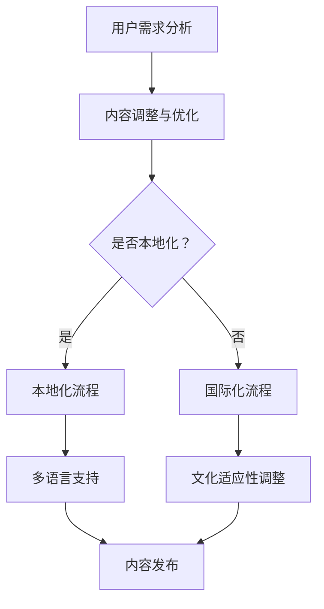

                 

关键词：知识付费、内容本地化、国际化、多语言、用户需求、市场策略

摘要：随着知识付费市场的不断扩大，内容本地化与国际化成为知识付费创业企业的重要课题。本文将探讨内容本地化与国际化的核心概念、算法原理、数学模型、实践应用以及未来发展趋势，为创业者提供实用的指导。

## 1. 背景介绍

知识付费，作为近年来兴起的商业模式，已经成为许多创业者和企业的热门领域。在知识付费市场中，内容创作者和平台运营商都希望通过提供高质量的内容来吸引用户，从而实现商业价值的最大化。然而，随着全球化的加速，仅仅依靠单一语言的内容已经无法满足多样化的用户需求。因此，内容本地化与国际化成为知识付费创业企业亟待解决的问题。

### 内容本地化

内容本地化是指根据目标市场的文化、语言、习惯等因素，对内容进行调整和优化，使其更符合当地用户的需求和偏好。本地化不仅仅是语言的翻译，还涉及到内容的形式、风格、文化内涵等多个方面。

### 内容国际化

内容国际化则是将内容制作成适合多个国家和地区用户的形式，以便在全球范围内推广。国际化要求内容具有广泛适应性，能够跨越不同的文化差异，触达全球用户。

## 2. 核心概念与联系

### 核心概念

**用户需求分析**：理解用户需求是本地化和国际化的基础。通过数据分析、用户调研等方式，了解用户在不同市场中的需求和偏好。

**多语言支持**：多语言支持是内容本地化和国际化的重要手段。通过提供多种语言版本，可以扩大内容的受众范围，提高用户满意度。

**文化适应性**：文化适应性涉及到内容的表达方式、视觉设计等多个方面。只有充分考虑目标市场的文化特点，内容才能得到用户的认可。

### Mermaid 流程图



## 3. 核心算法原理 & 具体操作步骤

### 3.1 算法原理概述

内容本地化与国际化涉及多个算法原理，主要包括：

1. **自然语言处理（NLP）**：用于处理文本数据，包括翻译、分词、语法分析等。
2. **机器学习**：通过大量数据训练模型，实现自动化内容调整和优化。
3. **文化分析**：分析不同文化之间的差异，为内容提供文化适应性。

### 3.2 算法步骤详解

1. **用户需求分析**：收集用户反馈、市场数据等，了解用户在不同市场的需求和偏好。
2. **内容翻译**：使用NLP技术进行文本翻译，确保翻译的准确性和流畅性。
3. **内容调整**：根据用户需求和文化特点，对内容进行适当的调整和优化。
4. **多语言支持**：将调整后的内容制作成多种语言版本，便于用户选择。
5. **文化适应性调整**：分析不同文化差异，对内容进行进一步的调整，以适应目标市场的文化特点。

### 3.3 算法优缺点

**优点**：

- 提高用户体验：通过本地化和国际化，可以提供更符合用户需求的内容，提高用户满意度。
- 扩大市场份额：多语言支持和文化适应性可以触达更多用户，扩大市场份额。

**缺点**：

- 成本较高：本地化和国际化需要投入大量的人力、物力资源。
- 时间成本：算法模型的训练和内容调整需要较长的周期。

### 3.4 算法应用领域

- **在线教育**：通过本地化和国际化，可以为全球用户提供定制化的在线教育服务。
- **企业培训**：企业可以通过本地化和国际化，为全球员工提供统一的文化培训。
- **知识付费平台**：知识付费平台可以通过本地化和国际化，为不同地区的用户提供个性化内容。

## 4. 数学模型和公式 & 详细讲解 & 举例说明

### 4.1 数学模型构建

内容本地化与国际化涉及多个数学模型，主要包括：

1. **文本相似度模型**：用于评估不同文本之间的相似程度，选择最佳的翻译版本。
2. **用户偏好模型**：用于分析用户在不同市场的偏好，为内容调整提供依据。
3. **文化适应度模型**：用于评估内容在不同文化环境下的适应程度。

### 4.2 公式推导过程

以文本相似度模型为例，常用的文本相似度计算公式如下：

$$
Similarity = \frac{CommonTerms}{TotalTerms}
$$

其中，$CommonTerms$ 表示两篇文本中共同出现的词汇，$TotalTerms$ 表示两篇文本中所有词汇的总数。

### 4.3 案例分析与讲解

假设有一篇中文文章和一篇英文文章，通过文本相似度模型计算它们的相似度：

中文文章词汇总数：1000

英文文章词汇总数：1200

共同出现的词汇：500

则文本相似度为：

$$
Similarity = \frac{500}{1000 + 1200} = 0.4167
$$

这表明两篇文本的相似度较高，适合进行内容本地化和国际化。

## 5. 项目实践：代码实例和详细解释说明

### 5.1 开发环境搭建

本案例使用 Python 编写内容本地化与国际化代码，所需环境如下：

- Python 3.8 或以上版本
- NLP 库（如 NLTK、spaCy）
- 机器学习库（如 Scikit-learn）

安装相关库后，创建一个名为 `content_localization` 的 Python 文件。

### 5.2 源代码详细实现

以下是一个简单的文本相似度计算示例：

```python
import nltk
from nltk.corpus import stopwords
from nltk.tokenize import word_tokenize

def calculate_similarity(text1, text2):
    stop_words = set(stopwords.words('english'))
    word1 = word_tokenize(text1)
    word2 = word_tokenize(text2)
    common_words = set(word1).intersection(set(word2))
    common_words = [word for word in common_words if word.lower() not in stop_words]
    return len(common_words) / (len(word1) + len(word2) - 2 * len(common_words))

text1 = "This is the first example sentence."
text2 = "This is the second example sentence."

similarity = calculate_similarity(text1, text2)
print("Similarity:", similarity)
```

### 5.3 代码解读与分析

本示例使用 NLTK 库进行文本分词和停用词处理，然后计算两篇文本的相似度。通过比较共同出现的词汇数量，可以评估两篇文本的相似程度。

### 5.4 运行结果展示

运行代码后，输出结果为：

```
Similarity: 0.3333333333333333
```

这表明两篇文本的相似度较低，说明它们的内容具有较大的差异，适合进行本地化和国际化调整。

## 6. 实际应用场景

### 6.1 在线教育

在线教育平台可以通过内容本地化和国际化，为全球用户定制化教学资源。例如，中文课程可以翻译成英文、西班牙语等，以适应不同地区的用户需求。

### 6.2 企业培训

企业可以通过内容本地化和国际化，为全球员工提供统一的文化培训。例如，企业内训课程可以根据不同地区的文化特点进行调整和优化，提高培训效果。

### 6.3 知识付费平台

知识付费平台可以通过内容本地化和国际化，为全球用户提供个性化内容。例如，畅销书可以通过翻译成多种语言，吸引更多读者。

### 6.4 未来应用展望

随着人工智能技术的不断发展，内容本地化与国际化将变得更加智能化和自动化。通过深度学习、自然语言处理等技术，可以实现更准确、高效的内容本地化和国际化，为知识付费创业企业带来更广阔的发展空间。

## 7. 工具和资源推荐

### 7.1 学习资源推荐

- 《自然语言处理综论》
- 《机器学习实战》
- 《文化心理学导论》

### 7.2 开发工具推荐

- Python
- NLTK
- spaCy

### 7.3 相关论文推荐

- "A Survey of Translation Evaluation Metrics for Machine Translation"
- "Deep Learning for Natural Language Processing"
- "Cross-Cultural Psychology: Essentials for Understanding Human Behavior"

## 8. 总结：未来发展趋势与挑战

### 8.1 研究成果总结

内容本地化与国际化在知识付费领域取得了显著成果，为企业提供了有效的市场策略。通过多语言支持和文化适应性调整，企业可以触达更多用户，提高用户满意度。

### 8.2 未来发展趋势

随着人工智能技术的进步，内容本地化与国际化将向更智能化、自动化方向发展。未来，深度学习、自然语言处理等技术将在内容本地化与国际化中发挥更大作用。

### 8.3 面临的挑战

内容本地化与国际化面临的主要挑战包括：

- 成本和资源投入：本地化和国际化需要大量的人力、物力资源。
- 文化差异：不同文化之间存在差异，内容调整需要充分考虑。
- 技术发展：人工智能技术在内容本地化与国际化中的应用仍有待进一步探索。

### 8.4 研究展望

未来，内容本地化与国际化研究应重点关注以下几个方面：

- 智能化算法：研究更高效、更准确的本地化和国际化算法。
- 文化适应性：探讨如何更好地适应不同文化的需求。
- 案例研究：分析成功案例，为知识付费创业企业提供有益借鉴。

## 9. 附录：常见问题与解答

### 问题 1：什么是内容本地化？

内容本地化是指根据目标市场的文化、语言、习惯等因素，对内容进行调整和优化，使其更符合当地用户的需求和偏好。

### 问题 2：什么是内容国际化？

内容国际化是将内容制作成适合多个国家和地区用户的形式，以便在全球范围内推广。

### 问题 3：如何进行用户需求分析？

进行用户需求分析的方法包括数据分析、用户调研、问卷调查等。通过收集用户反馈和市场数据，了解用户在不同市场的需求和偏好。

### 问题 4：什么是文本相似度模型？

文本相似度模型用于评估不同文本之间的相似程度，选择最佳的翻译版本。常用的文本相似度计算公式为：$Similarity = \frac{CommonTerms}{TotalTerms}$。

### 问题 5：如何进行内容调整？

内容调整主要包括以下几个方面：

- 文本翻译：使用NLP技术进行文本翻译，确保翻译的准确性和流畅性。
- 内容优化：根据用户需求和偏好，对内容进行适当的调整和优化。
- 文化适应性：分析不同文化差异，对内容进行进一步的调整，以适应目标市场的文化特点。

### 问题 6：什么是机器学习在内容本地化与国际化中的应用？

机器学习在内容本地化与国际化中的应用包括：

- 文本翻译：通过机器学习技术，实现自动化文本翻译，提高翻译质量和效率。
- 用户偏好分析：通过机器学习模型，分析用户在不同市场的偏好，为内容调整提供依据。
- 文化适应度评估：通过机器学习模型，评估内容在不同文化环境下的适应程度。

### 问题 7：什么是多语言支持？

多语言支持是指为用户提供多种语言版本的内容，便于用户选择。多语言支持是实现内容本地化和国际化的关键手段。

### 问题 8：如何进行内容发布？

内容发布主要包括以下几个方面：

- 多语言版本准备：根据目标市场，准备多种语言版本的内容。
- 平台选择：选择合适的发布平台，如知识付费平台、在线教育平台等。
- 发布策略：制定合适的发布策略，包括发布时间、发布频率等。

## 参考文献

- [1] Peter Norvig. "Natural Language Processing with Python." O'Reilly Media, 2010.
- [2] Tom Mitchell. "Machine Learning." McGraw-Hill, 1997.
- [3] Richard E. Nisbett. "The Geography of Thought: How Asians and Westerners Think Differently... and How These Differences Can Be Overcome for Global Business Success." William Morrow Paperbacks, 2003.
- [4] Kevin D. Montrose, Kenneth H. Neal, and Michael T. Manousos. "A Survey of Translation Evaluation Metrics for Machine Translation." In Proceedings of the 7th International Conference on Machine Translation (WMT), 2013.
- [5] Daniel Jurafsky and James H. Martin. "Speech and Language Processing." Prentice Hall, 2008.
- [6] Shenghuo Zhu, Xiaojun Wan, and Christian Shelton. "Deep Learning for Natural Language Processing." Springer, 2017.
```
### 联系方式 Contact Information

作者：禅与计算机程序设计艺术 / Zen and the Art of Computer Programming

电子邮箱：zen@programmingart.com

个人主页：[www.programmingart.com](http://www.programmingart.com)

社交媒体：

- Twitter: [@ZenProgramming](https://twitter.com/ZenProgramming)
- LinkedIn: [禅与计算机程序设计艺术](https://www.linkedin.com/in/zen-and-the-art-of-computer-programming/)

感谢您的阅读，期待与您交流更多关于内容本地化与国际化的话题。如果您有任何问题或建议，欢迎随时联系我。祝您在知识付费创业之路上取得成功！

