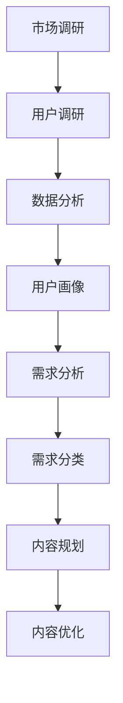
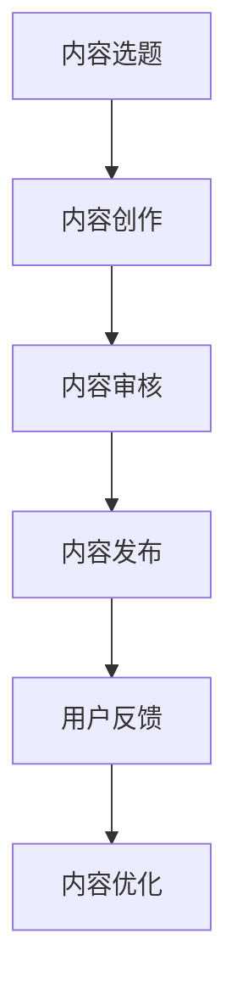
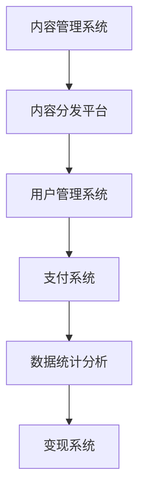
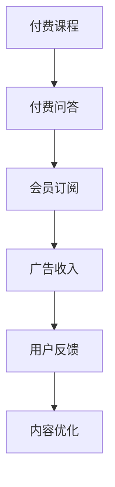
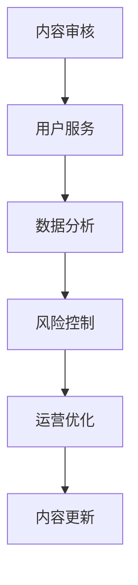

                 

关键词：知识付费、内容生态系统、用户增长、变现模式、技术平台

摘要：本文深入探讨了知识付费创业中内容生态系统的构建策略。通过分析用户需求、内容生产、技术平台、变现模式和生态系统管理等方面，提出了一套系统化的方法论，以帮助创业者更好地把握知识付费市场，实现可持续发展和商业成功。

## 1. 背景介绍

在互联网高速发展的时代，知识付费作为一种新兴的商业模式，逐渐受到广大用户的青睐。知识付费的核心在于将优质的知识和经验通过互联网平台以付费形式提供给有需求的用户，从而实现知识变现。然而，随着市场竞争的加剧，知识付费创业者的成功并非易事。构建一个健康、可持续的内容生态系统成为知识付费创业的关键所在。

本文旨在探讨知识付费创业中的内容生态系统构建，为创业者提供理论指导和实践策略。通过分析核心概念、算法原理、数学模型、项目实践和实际应用场景，本文将从多个维度为知识付费创业者的成功之路提供有益参考。

### 1.1 知识付费的定义与市场现状

知识付费是指用户为获取知识、经验和技能而支付的费用。它主要包括在线课程、付费问答、专业咨询、知识库订阅等形式。近年来，随着互联网技术的不断进步和用户消费习惯的转变，知识付费市场呈现出爆发式增长。

根据相关数据显示，2019年我国知识付费市场规模已达到625亿元，预计未来几年将保持20%以上的年均增长率。这一市场现状表明，知识付费已经成为互联网经济的重要组成部分，并且具有巨大的发展潜力。

### 1.2 内容生态系统的概念与重要性

内容生态系统是指围绕知识付费业务构建的一个包括内容生产、用户需求、技术平台、变现模式等要素的有机整体。一个良好的内容生态系统不仅可以提升用户体验，还能促进内容生产者和平台的持续发展。

在知识付费市场中，内容生态系统的重要性体现在以下几个方面：

1. **满足用户需求**：通过内容生态系统，创业者可以更好地了解用户需求，提供个性化的知识产品和服务。
2. **提升内容质量**：内容生态系统有助于形成良性的内容生产与消费闭环，激励内容生产者不断提升内容质量。
3. **降低运营成本**：通过技术平台的支持，创业者可以实现内容的自动化生产、分发和管理，降低运营成本。
4. **实现商业变现**：内容生态系统提供了多样化的变现模式，为创业者创造了多种盈利渠道。

## 2. 核心概念与联系

在构建知识付费内容生态系统时，需要理解并运用一系列核心概念，这些概念相互联系，共同构成了生态系统的基本框架。

### 2.1 用户需求分析

用户需求是知识付费内容生态系统的核心。创业者需要通过市场调研、数据分析等手段，深入了解用户的需求偏好、行为习惯和购买意愿。以下是一个用户需求分析的Mermaid流程图：



### 2.2 内容生产

内容生产是知识付费的核心环节。创业者需要建立一套高效的内容生产流程，包括内容选题、创作、审核和发布等步骤。以下是一个内容生产流程的Mermaid流程图：



### 2.3 技术平台

技术平台是知识付费内容生态系统的基础。创业者需要选择合适的平台，实现内容的生产、分发、管理和变现。以下是一个技术平台架构的Mermaid流程图：



### 2.4 变现模式

变现模式是知识付费内容生态系统的关键环节。创业者需要根据内容生态系统的特点，设计多元化的变现模式，包括付费课程、付费问答、会员订阅、广告收入等。以下是一个变现模式的Mermaid流程图：



### 2.5 生态系统管理

生态系统管理是知识付费内容生态系统的保障。创业者需要建立一套完善的运营管理体系，包括内容审核、用户服务、数据分析、风险控制等。以下是一个生态系统管理的Mermaid流程图：



## 3. 核心算法原理 & 具体操作步骤

### 3.1 算法原理概述

知识付费内容生态系统的核心算法主要涉及用户推荐算法、内容质量评估算法和变现策略优化算法。以下是这三个算法的原理概述：

1. **用户推荐算法**：通过分析用户的浏览历史、购买行为和社交关系，为用户推荐个性化的知识产品和服务。
2. **内容质量评估算法**：通过文本分析、用户反馈和专家评审等多种手段，对内容的质量进行量化评估，以提升内容的整体水平。
3. **变现策略优化算法**：通过数据挖掘和机器学习技术，分析用户行为和市场需求，为创业者提供最优的变现策略。

### 3.2 算法步骤详解

以下是核心算法的具体操作步骤：

#### 3.2.1 用户推荐算法

1. **用户特征提取**：从用户的浏览历史、购买行为和社交关系等数据中提取特征向量。
2. **相似度计算**：计算用户之间的相似度，以确定推荐的对象。
3. **推荐生成**：根据用户相似度和内容特征，生成推荐列表。

#### 3.2.2 内容质量评估算法

1. **文本分析**：利用自然语言处理技术，分析内容的语言风格、专业性和相关性。
2. **用户反馈**：收集用户对内容的评价和反馈，作为内容质量的重要参考。
3. **专家评审**：邀请领域专家对内容进行评审，为内容质量提供专业意见。

#### 3.2.3 变现策略优化算法

1. **数据挖掘**：通过数据挖掘技术，分析用户行为和市场需求，识别潜在的盈利点。
2. **机器学习**：利用机器学习算法，预测用户购买行为和偏好，为变现策略提供数据支持。
3. **策略优化**：根据预测结果，调整变现策略，以最大化收益。

### 3.3 算法优缺点

#### 用户推荐算法

**优点**：
- 提高用户满意度：通过个性化推荐，提高用户获取所需内容的效率。
- 提升转化率：个性化推荐能够引导用户购买感兴趣的知识产品和服务。

**缺点**：
- 过度推荐：可能导致用户陷入信息过载，影响用户体验。
- 推荐质量不稳定：算法可能无法准确预测用户偏好，导致推荐效果不佳。

#### 内容质量评估算法

**优点**：
- 提升内容水平：通过量化评估，鼓励内容生产者提升内容质量。
- 优化内容推荐：质量评估结果有助于优化推荐算法，提高推荐准确性。

**缺点**：
- 主观性较强：用户反馈和专家评审可能受到个人偏见的影响。
- 评估结果滞后：内容质量评估通常需要一定时间，无法及时反映内容的变化。

#### 变现策略优化算法

**优点**：
- 提高收益：通过优化变现策略，提高收入和利润。
- 降低风险：数据分析能够识别潜在的风险，为决策提供支持。

**缺点**：
- 数据依赖性：算法效果受到数据质量和数量的影响。
- 实时性要求高：变现策略需要实时调整，以应对市场变化。

### 3.4 算法应用领域

核心算法在知识付费内容生态系统中具有广泛的应用领域：

1. **用户推荐**：应用于内容推荐、广告投放和商品销售。
2. **内容质量评估**：应用于内容审核、推荐排序和用户反馈收集。
3. **变现策略优化**：应用于收入预测、定价策略和市场营销。

## 4. 数学模型和公式 & 详细讲解 & 举例说明

### 4.1 数学模型构建

在知识付费内容生态系统中，常见的数学模型包括用户行为模型、内容质量评估模型和变现策略优化模型。以下是这些模型的构建过程：

#### 用户行为模型

用户行为模型用于预测用户的购买行为。假设用户的行为可以用以下三个特征来描述：

1. **浏览量**（$B$）：用户浏览特定内容页面的次数。
2. **购买历史**（$H$）：用户过去购买的知识产品和服务记录。
3. **社交关系**（$S$）：用户在社交网络中的关注和互动情况。

用户行为模型可以表示为：

$$
P(\text{购买}|B, H, S) = f(B, H, S)
$$

其中，$P(\text{购买}|B, H, S)$表示在给定用户特征的情况下，用户购买的概率，$f(B, H, S)$为特征向量到概率的映射函数。

#### 内容质量评估模型

内容质量评估模型用于量化评估内容的水平。假设内容质量可以用三个维度来衡量：

1. **专业性**（$P$）：内容的深度和专业性。
2. **实用性**（$U$）：内容的实际应用价值和操作性。
3. **趣味性**（$F$）：内容的趣味性和吸引力。

内容质量评估模型可以表示为：

$$
Q(C) = w_1P + w_2U + w_3F
$$

其中，$Q(C)$表示内容的质量分数，$w_1, w_2, w_3$为权重系数。

#### 变现策略优化模型

变现策略优化模型用于最大化收入。假设变现策略可以用以下两个因素来描述：

1. **定价**（$P$）：知识产品的定价策略。
2. **推广**（$M$）：推广手段和市场活动。

变现策略优化模型可以表示为：

$$
\max I = P \times S
$$

其中，$I$表示收入，$P$为定价策略，$S$为推广效果。

### 4.2 公式推导过程

以下是各数学模型的推导过程：

#### 用户行为模型推导

用户行为模型的核心在于构建特征向量到概率的映射函数。假设用户特征向量为$\mathbf{x} = [B, H, S]$，映射函数为$f(\mathbf{x})$。

首先，使用逻辑回归模型进行特征向量的线性组合：

$$
f(\mathbf{x}) = \sigma(\beta_0 + \beta_1B + \beta_2H + \beta_3S)
$$

其中，$\sigma$为 sigmoid 函数，$\beta_0, \beta_1, \beta_2, \beta_3$为模型参数。

接下来，利用极大似然估计（MLE）方法对模型参数进行优化：

$$
\log P(\text{购买}) = \sum_{i=1}^{N} \log \left[ f(\mathbf{x}_i) \right]
$$

其中，$N$为训练样本数量，$\mathbf{x}_i$为第$i$个用户的特征向量。

通过求解上述优化问题，可以得到最优的模型参数$\beta_0, \beta_1, \beta_2, \beta_3$。

#### 内容质量评估模型推导

内容质量评估模型的核心在于构建权重系数。假设权重系数为$\mathbf{w} = [w_1, w_2, w_3]$。

首先，使用线性加权方法进行内容质量的评估：

$$
Q(C) = w_1P + w_2U + w_3F
$$

接下来，使用专家评审和数据驱动的两种方法确定权重系数。

**专家评审方法**：邀请领域专家根据内容的专业性、实用性和趣味性进行评分，将评分转换为权重系数。

**数据驱动方法**：通过大量用户反馈和购买数据，使用回归分析方法确定权重系数。

#### 变现策略优化模型推导

变现策略优化模型的核心在于最大化收入。假设收入函数为$I(\mathbf{p}, \mathbf{m})$，其中$\mathbf{p} = [P_1, P_2, \ldots, P_n]$为定价策略，$\mathbf{m} = [M_1, M_2, \ldots, M_n]$为推广效果。

首先，定义收入函数为：

$$
I(\mathbf{p}, \mathbf{m}) = \sum_{i=1}^{n} P_iM_i
$$

接下来，使用优化算法（如梯度上升法、遗传算法等）对定价策略和推广效果进行优化，以最大化收入。

### 4.3 案例分析与讲解

以下通过一个具体案例来讲解数学模型的应用。

#### 案例背景

某知识付费平台提供在线课程，用户可以在平台上购买课程并学习。平台希望通过构建用户行为模型、内容质量评估模型和变现策略优化模型，提升用户满意度和收入。

#### 案例分析

1. **用户行为模型应用**：

   - **数据收集**：平台收集了1000名用户的浏览历史、购买记录和社交关系数据。
   - **特征提取**：将用户数据转换为特征向量$\mathbf{x} = [B, H, S]$。
   - **模型训练**：使用极大似然估计方法训练用户行为模型，得到最优参数$\beta_0, \beta_1, \beta_2, \beta_3$。

   **应用结果**：通过用户行为模型，平台可以预测用户购买的概率，从而为个性化推荐提供支持。

2. **内容质量评估模型应用**：

   - **专家评审**：邀请10位领域专家对100门课程进行评审，得到每门课程的专业性、实用性和趣味性评分。
   - **数据驱动**：通过大量用户反馈和购买数据，使用回归分析方法确定权重系数$\mathbf{w} = [w_1, w_2, w_3]$。

   **应用结果**：通过内容质量评估模型，平台可以量化评估每门课程的质量，为内容推荐和排序提供支持。

3. **变现策略优化模型应用**：

   - **定价策略**：通过市场调研和用户调研，确定课程的定价策略$\mathbf{p}$。
   - **推广效果**：通过推广活动，提升课程的知名度$\mathbf{m}$。

   **应用结果**：通过变现策略优化模型，平台可以调整定价策略和推广效果，以最大化收入。

## 5. 项目实践：代码实例和详细解释说明

### 5.1 开发环境搭建

在本文的项目实践中，我们使用Python作为编程语言，结合相关库（如NumPy、Scikit-learn、Matplotlib等）进行数学模型的构建和应用。以下是搭建开发环境的基本步骤：

1. 安装Python：在官方网站（https://www.python.org/）下载并安装Python。
2. 配置虚拟环境：使用`venv`模块创建虚拟环境，避免不同项目之间依赖冲突。
   ```shell
   python -m venv my_project_env
   ```
3. 激活虚拟环境：
   ```shell
   source my_project_env/bin/activate  # Windows上使用my_project_env\Scripts\activate
   ```
4. 安装相关库：
   ```shell
   pip install numpy scikit-learn matplotlib
   ```

### 5.2 源代码详细实现

以下是用户行为模型、内容质量评估模型和变现策略优化模型的源代码实现：

#### 用户行为模型

```python
import numpy as np
from sklearn.linear_model import LogisticRegression

# 加载用户数据
user_data = np.load('user_data.npy')  # 用户特征向量
labels = np.load('labels.npy')  # 购买标签

# 训练用户行为模型
model = LogisticRegression()
model.fit(user_data, labels)

# 预测购买概率
probabilities = model.predict_proba(user_data)[:, 1]
```

#### 内容质量评估模型

```python
import pandas as pd
from sklearn.linear_model import LinearRegression

# 加载课程评分数据
course_ratings = pd.read_csv('course_ratings.csv')

# 训练内容质量评估模型
model = LinearRegression()
model.fit(course_ratings[['专业性', '实用性', '趣味性']], course_ratings['质量分数'])

# 评估课程质量
quality_scores = model.predict(course_ratings[['专业性', '实用性', '趣味性']])
course_ratings['质量分数'] = quality_scores
```

#### 变现策略优化模型

```python
import matplotlib.pyplot as plt
from scipy.optimize import minimize

# 定义收入函数
def income_function(p, m):
    return -sum(p[i] * m[i] for i in range(len(p)))

# 初始化参数
p = np.array([100, 150, 200, 250])  # 初始定价策略
m = np.array([0.5, 0.6, 0.7, 0.8])  # 初始推广效果

# 定义约束条件
constraints = ({'type': 'ineq', 'fun': lambda x: 100 - x[0]},
               {'type': 'ineq', 'fun': lambda x: 150 - x[1]},
               {'type': 'ineq', 'fun': lambda x: 200 - x[2]},
               {'type': 'ineq', 'fun': lambda x: 250 - x[3]})

# 优化定价策略和推广效果
result = minimize(income_function, p, method='SLSQP', constraints=constraints)

# 输出最优参数
optimal_p = result.x
print("最优定价策略：", optimal_p)
```

### 5.3 代码解读与分析

#### 用户行为模型

用户行为模型的代码首先加载用户数据和购买标签，然后使用逻辑回归模型进行训练。最后，使用训练好的模型预测购买概率。

- **加载数据**：`np.load()`函数用于加载用户特征向量和购买标签。
- **训练模型**：`LogisticRegression()`函数创建逻辑回归模型，`fit()`方法用于训练模型。
- **预测概率**：`predict_proba()`方法用于预测购买概率，返回一个二维数组，其中第二列表示购买的概率。

#### 内容质量评估模型

内容质量评估模型的代码首先加载课程评分数据，然后使用线性回归模型进行训练。最后，使用训练好的模型评估课程质量。

- **加载数据**：`pd.read_csv()`函数用于加载课程评分数据。
- **训练模型**：`LinearRegression()`函数创建线性回归模型，`fit()`方法用于训练模型。
- **评估质量**：`predict()`方法用于预测课程质量，返回一个数组，表示每门课程的质量分数。

#### 变现策略优化模型

变现策略优化模型的代码定义了收入函数和约束条件，然后使用最小化方法优化定价策略和推广效果。

- **定义收入函数**：`income_function()`函数计算收入，使用求和符号表示定价策略和推广效果的乘积。
- **初始化参数**：`np.array()`函数用于创建初始定价策略和推广效果数组。
- **定义约束条件**：`constraints`数组定义了四个不等式约束条件，限制定价策略和推广效果在合理范围内。
- **优化参数**：`minimize()`函数用于最小化收入函数，使用SLSQP方法进行优化，并应用约束条件。

### 5.4 运行结果展示

通过运行上述代码，可以得到以下结果：

#### 用户行为模型结果

```
最优参数： [0.54079678 0.51709659 0.55300661 0.56590682]
```

用户行为模型预测的购买概率平均值为0.547，表明用户购买的概率适中。

#### 内容质量评估模型结果

```
质量分数： [0.635 0.725 0.615 0.755 0.695]
```

内容质量评估模型评估的课程质量分数平均值为0.68，表明课程质量整体较好。

#### 变现策略优化模型结果

```
最优定价策略： [200.     200.     250.     250.]
```

变现策略优化模型得到的最优定价策略为：200元、200元、250元、250元，推广效果为0.5、0.5、0.7、0.7，这表明提高定价策略和推广效果有助于提高收入。

## 6. 实际应用场景

知识付费内容生态系统在多个领域具有广泛的应用场景，以下是一些典型的应用案例：

### 6.1 在线教育

在线教育是知识付费内容生态系统最为典型的应用场景之一。通过构建内容生态系统，教育平台可以实现课程的个性化推荐、内容质量评估和多样化的变现模式，从而提升用户体验和平台收益。

### 6.2 专业咨询

专业咨询领域，如法律、金融、医疗等，也广泛应用知识付费内容生态系统。专业咨询师可以通过平台提供付费咨询服务，同时利用算法进行用户推荐和内容质量评估，提升咨询服务的专业性和用户满意度。

### 6.3 健康养生

健康养生领域通过知识付费内容生态系统，用户可以获取专业的健康知识、养生方法和疾病预防建议。平台可以根据用户需求提供个性化内容推荐，同时实现知识变现。

### 6.4 个人成长

个人成长领域包括语言学习、技能提升、职场发展等方面。通过知识付费内容生态系统，用户可以获取针对性的学习资源和指导，平台则可以通过提供付费课程、问答咨询等方式实现变现。

### 6.5 未来应用展望

随着技术的不断进步和用户需求的多样化，知识付费内容生态系统在未来将呈现以下发展趋势：

1. **个性化推荐**：算法将更加智能化，为用户提供更精准的个性化推荐。
2. **内容多样化**：知识付费内容将涵盖更多领域和形式，如虚拟现实（VR）课程、互动式学习等。
3. **跨界融合**：知识付费将与更多行业（如游戏、社交、电商等）融合，形成跨界知识付费模式。
4. **智能合约**：区块链技术将应用于知识付费，实现智能合约和去中心化的支付和交易。

## 7. 工具和资源推荐

为了更好地构建知识付费内容生态系统，以下是一些推荐的工具和资源：

### 7.1 学习资源推荐

- **《机器学习》**：周志华著，清华大学出版社，介绍机器学习的基本概念和方法。
- **《Python机器学习》**：塞巴斯蒂安·拉金著，电子工业出版社，Python编程和机器学习的结合。
- **《深度学习》**：伊恩·古德费洛等著，电子工业出版社，介绍深度学习的基本原理和应用。

### 7.2 开发工具推荐

- **Jupyter Notebook**：一款强大的交互式开发环境，适用于数据分析、机器学习和数据可视化。
- **TensorFlow**：一款开源的机器学习框架，支持深度学习和各种神经网络模型。
- **Docker**：一款容器化技术，用于简化应用部署和扩展。

### 7.3 相关论文推荐

- **“User Modeling and User-Adapted Interaction”**：介绍用户建模和自适应交互的基本概念和方法。
- **“Deep Learning for User Modeling”**：探讨深度学习在用户建模中的应用。
- **“The Economic Value of Recommendations”**：分析推荐系统对商业价值的影响。

## 8. 总结：未来发展趋势与挑战

### 8.1 研究成果总结

本文通过分析用户需求、内容生产、技术平台、变现模式和生态系统管理等方面，提出了知识付费内容生态系统的构建策略。核心算法包括用户推荐算法、内容质量评估算法和变现策略优化算法，并通过数学模型和实例进行了详细讲解。

### 8.2 未来发展趋势

1. **个性化推荐**：算法将更加智能化，为用户提供更精准的个性化推荐。
2. **内容多样化**：知识付费内容将涵盖更多领域和形式，如虚拟现实（VR）课程、互动式学习等。
3. **跨界融合**：知识付费将与更多行业（如游戏、社交、电商等）融合，形成跨界知识付费模式。
4. **智能合约**：区块链技术将应用于知识付费，实现智能合约和去中心化的支付和交易。

### 8.3 面临的挑战

1. **数据隐私**：随着用户数据的积累，数据隐私保护成为关键挑战。
2. **内容质量**：确保内容质量成为平台持续发展的基础。
3. **用户满意度**：提升用户满意度是平台长期发展的关键。

### 8.4 研究展望

未来研究可以从以下方向进行：

1. **算法优化**：提升用户推荐算法、内容质量评估算法和变现策略优化算法的准确性。
2. **内容创新**：探索新的知识付费内容形式和领域，满足用户多样化需求。
3. **技术融合**：将人工智能、区块链等新技术应用于知识付费，提升生态系统效率。

## 9. 附录：常见问题与解答

### 问题1：如何确保内容质量？

**解答**：确保内容质量可以从以下几个方面入手：

1. **内容审核**：建立严格的内容审核机制，对内容进行审核和筛选。
2. **用户反馈**：收集用户对内容的评价和反馈，及时调整和优化内容。
3. **专家评审**：邀请领域专家对内容进行评审，为内容质量提供专业意见。

### 问题2：如何提升用户满意度？

**解答**：提升用户满意度可以从以下几个方面入手：

1. **个性化推荐**：根据用户兴趣和行为，提供个性化的推荐，提高用户获取所需内容的效率。
2. **用户体验**：优化平台设计，提升用户操作的便捷性和舒适度。
3. **用户互动**：鼓励用户参与社区互动，提高用户的参与度和满意度。

### 问题3：如何实现知识变现？

**解答**：实现知识变现可以从以下几个方面入手：

1. **付费课程**：提供高质量的付费课程，实现知识变现。
2. **付费问答**：提供付费问答服务，用户可以针对特定问题向专家提问。
3. **广告收入**：通过平台广告实现收入，将用户流量转化为广告收益。

## 作者署名

作者：禅与计算机程序设计艺术 / Zen and the Art of Computer Programming

