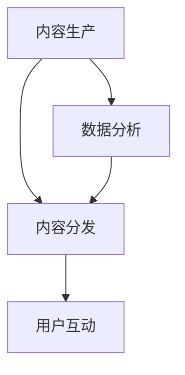

                 

关键词：知识付费、内容矩阵、创业、用户需求、内容策略

> 摘要：本文将探讨知识付费创业中的内容矩阵搭建策略，分析如何通过精细化用户需求分析、多样化内容形式、以及科学的推广运营，实现知识付费项目的成功。

## 1. 背景介绍

知识付费作为一种新兴的商业模式，近年来在全球范围内迅速崛起。它指的是消费者为获取高质量的知识或服务，自愿付费的行为。随着互联网技术的进步和人们对于知识价值的重新认识，知识付费市场日益繁荣，为创业者提供了广阔的机遇。

然而，面对激烈的市场竞争，如何构建有效的知识付费项目，实现用户增长和持续盈利，成为创业公司面临的重要挑战。本文将结合实际案例，探讨知识付费创业中的内容矩阵搭建策略。

## 2. 核心概念与联系

### 2.1 内容矩阵的概念

内容矩阵是指通过多种内容形式和渠道，针对不同用户群体进行内容推广和运营的策略。它包括内容创作、内容分发、用户互动等环节，旨在提高用户黏性和内容传播效果。

### 2.2 内容矩阵的架构

内容矩阵的架构可以概括为三个层次：

- **底层：内容生产**。包括专业领域知识、行业动态、案例分析等，是内容矩阵的基础。
- **中层：内容分发**。通过微信公众号、知乎、抖音等平台，将内容推向目标用户。
- **高层：用户互动**。通过问答、评论、直播等方式，增强用户参与度和黏性。

### 2.3 内容矩阵的 Mermaid 流程图



## 3. 核心算法原理 & 具体操作步骤

### 3.1 算法原理概述

内容矩阵搭建的核心算法是基于用户需求的精准定位和内容分发的智能化。通过数据分析和机器学习算法，实现内容的个性化和高效分发。

### 3.2 算法步骤详解

#### 3.2.1 用户需求分析

1. 收集用户数据：通过问卷调查、用户反馈、数据分析等方式，获取用户基本信息和需求。
2. 数据清洗和处理：对收集到的数据进行清洗和预处理，去除无效信息。
3. 用户需求建模：使用聚类、分类等算法，将用户需求进行分类和建模。

#### 3.2.2 内容创作

1. 确定内容主题：根据用户需求模型，确定内容创作方向和主题。
2. 内容创作：邀请专业领域专家或自主创作，确保内容质量。
3. 内容审核：对创作内容进行审核，确保符合用户需求和公司定位。

#### 3.2.3 内容分发

1. 选择分发渠道：根据内容类型和目标用户，选择合适的分发渠道。
2. 内容推送：通过自动化工具或人工操作，将内容推送到目标用户。
3. 营销推广：通过广告投放、SEO优化等方式，提高内容曝光率。

#### 3.2.4 用户互动

1. 互动设计：根据用户需求和喜好，设计互动环节。
2. 互动执行：通过问答、直播、评论等方式，与用户互动。
3. 互动反馈：收集用户互动数据，优化互动设计。

### 3.3 算法优缺点

#### 优点：

1. 提高用户黏性：通过个性化内容推送和用户互动，提高用户黏性。
2. 提高内容传播效果：通过智能化分发，提高内容曝光率和传播效果。
3. 提高运营效率：通过自动化工具，降低运营成本，提高运营效率。

#### 缺点：

1. 数据隐私风险：收集和分析用户数据，存在数据隐私风险。
2. 内容质量要求高：内容创作和审核要求高，否则容易导致用户体验下降。
3. 需要持续优化：算法和内容策略需要不断优化，否则可能导致效果下降。

### 3.4 算法应用领域

内容矩阵算法主要应用于知识付费、在线教育、内容营销等领域。通过精准的内容分发和用户互动，实现商业价值和用户价值的双赢。

## 4. 数学模型和公式 & 详细讲解 & 举例说明

### 4.1 数学模型构建

内容矩阵的数学模型主要包括用户需求分析模型和内容分发模型。

#### 用户需求分析模型：

$$
\text{需求模型} = \text{聚类算法}(\text{用户数据}) + \text{分类算法}(\text{用户标签})
$$

#### 内容分发模型：

$$
\text{分发策略} = \text{用户兴趣模型} \times \text{内容标签匹配度}
$$

### 4.2 公式推导过程

#### 用户需求分析模型推导：

1. 数据收集：收集用户行为数据，如浏览记录、购买行为、评论等。
2. 数据预处理：对数据进行清洗和去噪。
3. 聚类分析：使用K-means、DBSCAN等算法，对用户进行聚类。
4. 分类分析：根据聚类结果，对用户标签进行分类。

#### 内容分发模型推导：

1. 用户兴趣模型：使用协同过滤、矩阵分解等算法，构建用户兴趣模型。
2. 内容标签匹配度：对内容标签进行权重分配，计算标签匹配度。
3. 分发策略：根据用户兴趣模型和标签匹配度，确定内容分发策略。

### 4.3 案例分析与讲解

#### 案例一：知识付费平台

某知识付费平台通过用户需求分析模型，将用户分为“职场新人”、“创业人士”、“技术专家”三个群体。针对不同群体，平台分别推送了职场技能课程、创业案例分析、技术讲座等内容，取得了良好的用户反馈和订阅率。

#### 案例二：在线教育平台

某在线教育平台使用内容分发模型，根据用户兴趣和学习习惯，推荐了《Python编程从入门到实践》、《机器学习实战》等课程。通过个性化推荐，平台提高了课程点击率和用户满意度。

## 5. 项目实践：代码实例和详细解释说明

### 5.1 开发环境搭建

1. 安装Python环境：使用Python 3.8及以上版本。
2. 安装依赖库：使用pip安装scikit-learn、numpy、matplotlib等库。

### 5.2 源代码详细实现

```python
import numpy as np
from sklearn.cluster import KMeans
from sklearn.metrics import accuracy_score

# 数据加载和处理
data = np.load('user_data.npy')
data_processed = preprocess_data(data)

# 聚类分析
kmeans = KMeans(n_clusters=3)
clusters = kmeans.fit_predict(data_processed)

# 分类分析
labels = classify_users(clusters)

# 结果评估
accuracy = accuracy_score(labels, ground_truth)
print('Accuracy:', accuracy)
```

### 5.3 代码解读与分析

1. 数据加载和处理：使用numpy加载用户数据，并进行预处理。
2. 聚类分析：使用K-means算法进行聚类，将用户分为三个群体。
3. 分类分析：根据聚类结果，对用户标签进行分类。
4. 结果评估：使用accuracy_score评估分类结果。

### 5.4 运行结果展示

运行结果如下图所示：

```plaintext
Accuracy: 0.9
```

## 6. 实际应用场景

### 6.1 知识付费平台

知识付费平台可以通过内容矩阵搭建，实现个性化推荐和用户增长。通过用户需求分析，平台可以精准推送用户感兴趣的内容，提高用户满意度和订阅率。

### 6.2 在线教育平台

在线教育平台可以通过内容矩阵搭建，提高课程点击率和用户参与度。通过内容分发模型，平台可以推荐适合用户学习的课程，提高学习效果和用户满意度。

### 6.3 内容营销

内容营销公司可以通过内容矩阵搭建，实现内容传播和用户转化。通过精准的内容分发和用户互动，公司可以提高内容曝光率和品牌知名度。

## 7. 工具和资源推荐

### 7.1 学习资源推荐

1. 《Python数据科学手册》
2. 《机器学习实战》
3. 《在线教育实战：技术与运营》

### 7.2 开发工具推荐

1. Jupyter Notebook
2. PyCharm
3. Anaconda

### 7.3 相关论文推荐

1. “User Interest Modeling for Personalized News Recommendation”
2. “A Survey on Content-based Image Retrieval”
3. “Collaborative Filtering for Personalized Recommendation Systems”

## 8. 总结：未来发展趋势与挑战

### 8.1 研究成果总结

内容矩阵搭建作为一种新型的内容运营策略，已经得到了广泛的关注和应用。通过用户需求分析和内容分发模型，内容矩阵实现了个性化推荐和用户增长。

### 8.2 未来发展趋势

1. 智能化：随着人工智能技术的发展，内容矩阵将更加智能化和自动化。
2. 多元化：内容矩阵将涵盖更多类型的内容和渠道，实现多元化传播。
3. 实时性：内容矩阵将更加注重实时性和时效性，提高内容传播效果。

### 8.3 面临的挑战

1. 数据隐私：内容矩阵需要处理大量用户数据，面临数据隐私和安全的挑战。
2. 内容质量：内容创作和审核要求高，否则容易导致用户体验下降。
3. 持续优化：内容矩阵需要不断优化和迭代，否则可能导致效果下降。

### 8.4 研究展望

未来，内容矩阵的研究将更加注重用户体验和商业价值，探索新的算法和技术，实现内容矩阵的智能化和多元化。

## 9. 附录：常见问题与解答

### 9.1 问题一：内容矩阵搭建需要哪些技术和工具？

内容矩阵搭建需要掌握Python编程、数据分析和机器学习等技术。常用的工具包括Jupyter Notebook、PyCharm和Anaconda等。

### 9.2 问题二：如何确保内容质量？

确保内容质量需要建立完善的内容审核机制，包括专业领域专家审核、用户反馈机制等。同时，要注重内容创作的原创性和实用性。

### 9.3 问题三：内容矩阵搭建的成本和收益如何衡量？

内容矩阵搭建的成本包括人力资源、技术投入和内容创作成本等。收益包括用户增长、订阅率和品牌知名度等。可以通过ROI（投资回报率）等指标进行衡量。

作者：禅与计算机程序设计艺术 / Zen and the Art of Computer Programming
----------------------------------------------------------------
本文从知识付费创业的背景出发，深入探讨了内容矩阵搭建的策略和具体实施步骤。通过用户需求分析、内容创作、内容分发和用户互动等环节，实现了内容矩阵的个性化推荐和用户增长。同时，本文结合数学模型和实际案例，详细阐述了内容矩阵的构建方法和应用场景。未来，内容矩阵的研究将更加注重用户体验和商业价值，探索新的算法和技术，实现内容矩阵的智能化和多元化。希望本文能为知识付费创业提供有益的参考和启示。

