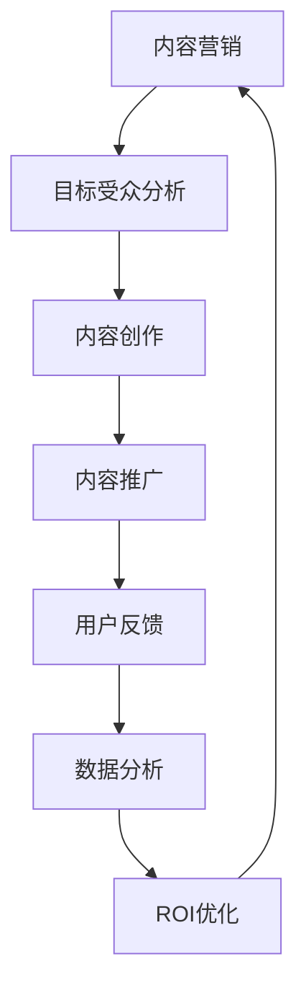

                 

关键词：知识付费、内容营销、ROI优化、创业策略、营销技术、数据分析、案例分析

> 摘要：本文将深入探讨知识付费创业者在内容营销中如何优化投资回报率（ROI）。通过对内容营销的核心概念、关键技术和成功案例的分析，提供实用的策略和方法，以帮助创业者更好地实现营销效果的最大化。

## 1. 背景介绍

随着互联网的普及和数字化转型的加速，知识付费已经成为一种重要的商业模式。知识付费创业者在选择内容营销作为主要推广手段时，面临着如何优化投资回报率（ROI）的挑战。内容营销ROI优化不仅关系到创业者的经济利益，更是衡量其营销策略有效性的重要指标。因此，如何通过科学的手段提升内容营销ROI，成为了知识付费创业者亟待解决的关键问题。

本文旨在为知识付费创业者提供一套完整的内容营销ROI优化策略，涵盖核心概念、关键技术、数学模型、案例分析和未来展望等内容。通过本文的探讨，创业者可以更清晰地理解内容营销的本质，掌握优化ROI的方法，从而在激烈的市场竞争中脱颖而出。

## 2. 核心概念与联系

### 2.1 内容营销定义

内容营销是指通过创造和分发有价值、相关且一致的内容来吸引和获取目标受众，并最终推动其成为客户的过程。内容营销的核心是内容，而目标则是通过内容建立品牌信任、提高品牌知名度和促进销售转化。

### 2.2 ROI的定义

投资回报率（ROI）是衡量投资效益的重要指标，它通过比较投资所获得的收益与投资的成本来计算。在内容营销中，ROI的计算公式为：

\[ ROI = \frac{（收入 - 成本）}{成本} \]

其中，收入包括通过内容营销带来的直接销售、广告收入、会员订阅等，成本则是内容创作、推广、维护等方面的费用。

### 2.3 内容营销与ROI的关系

内容营销与ROI之间存在密切的联系。高质量的内容可以吸引更多的目标受众，提高用户的参与度和忠诚度，从而带来更高的收入和更低的成本。而优化的内容营销策略能够更精准地定位目标受众，提高营销效率，进一步优化ROI。

### 2.4 Mermaid流程图



通过上述流程图，我们可以看到内容营销与ROI优化的密切关联。每个环节都为下一个环节提供关键数据和支持，形成一个闭环系统，从而实现持续的内容营销ROI优化。

## 3. 核心算法原理 & 具体操作步骤

### 3.1 算法原理概述

内容营销ROI优化的核心算法是基于数据驱动的决策模型。该模型通过以下步骤实现：

1. 数据收集与清洗：收集用户行为数据、内容表现数据、市场反馈数据等，并进行数据清洗，确保数据质量。
2. 数据分析：利用数据挖掘和机器学习技术，对数据进行分析，提取关键特征和关系。
3. 模型构建：根据分析结果构建预测模型，预测内容营销的ROI。
4. 决策优化：根据模型预测结果，调整内容营销策略，实现ROI优化。

### 3.2 算法步骤详解

#### 3.2.1 数据收集与清洗

数据收集主要涉及以下几个方面：

- 用户行为数据：包括点击率、浏览时长、转发次数、评论数等。
- 内容表现数据：包括内容类型、标题、字数、发布时间、媒介渠道等。
- 市场反馈数据：包括销售数据、广告收入、会员订阅数等。

数据清洗主要包括以下步骤：

- 去除重复数据：确保数据的唯一性。
- 填补缺失值：使用统计方法或插值法填补缺失值。
- 数据格式转换：将不同类型的数据转换为同一格式，便于后续处理。

#### 3.2.2 数据分析

数据分析主要利用数据挖掘和机器学习技术，对数据进行分析，提取关键特征和关系。具体步骤包括：

- 特征工程：选择与内容营销ROI相关的特征，并进行预处理。
- 特征选择：利用特征选择算法，筛选出最有效的特征。
- 关系挖掘：利用关联规则挖掘、聚类分析等方法，挖掘数据之间的关系。

#### 3.2.3 模型构建

根据数据分析结果，构建预测模型。常用的预测模型包括线性回归、决策树、随机森林、神经网络等。模型构建的具体步骤包括：

- 数据划分：将数据划分为训练集和测试集。
- 模型训练：使用训练集数据训练模型。
- 模型评估：使用测试集数据评估模型性能。

#### 3.2.4 决策优化

根据模型预测结果，调整内容营销策略，实现ROI优化。具体步骤包括：

- 策略分析：分析模型预测结果，确定优化策略。
- 策略实施：根据分析结果，调整内容创作、推广和投放策略。
- 策略评估：评估调整后的策略效果，持续优化。

### 3.3 算法优缺点

#### 优点：

- 数据驱动：基于大量数据进行分析和预测，减少主观因素干扰。
- 可视化：通过算法流程和预测结果的可视化，帮助创业者更好地理解ROI优化的过程。
- 自适应：根据实时数据不断调整策略，实现动态优化。

#### 缺点：

- 数据依赖：算法性能依赖于数据质量和数量。
- 复杂性：算法构建和优化过程较为复杂，需要专业的技术支持。

### 3.4 算法应用领域

算法在内容营销ROI优化中的应用非常广泛，包括但不限于：

- 搜索引擎优化（SEO）：通过分析关键词和用户行为数据，优化网站内容和结构，提高搜索引擎排名。
- 社交媒体营销：通过分析用户行为和反馈数据，优化社交媒体内容发布策略，提高用户参与度。
- 广告投放：通过分析用户画像和行为数据，优化广告投放策略，提高广告效果。

## 4. 数学模型和公式 & 详细讲解 & 举例说明

### 4.1 数学模型构建

在内容营销ROI优化中，我们构建一个基于线性回归的数学模型。假设内容营销ROI与以下变量相关：

- \( x_1 \)：内容质量评分
- \( x_2 \)：用户参与度评分
- \( x_3 \)：市场反馈评分

则线性回归模型可以表示为：

\[ ROI = \beta_0 + \beta_1 \cdot x_1 + \beta_2 \cdot x_2 + \beta_3 \cdot x_3 \]

其中，\( \beta_0 \)、\( \beta_1 \)、\( \beta_2 \) 和 \( \beta_3 \) 为模型参数，需要通过数据训练得到。

### 4.2 公式推导过程

假设我们有一个包含 \( n \) 个样本的数据集，每个样本表示为一个四元组 \( (x_{11}, x_{21}, x_{31}, y_i) \)，其中 \( y_i \) 为第 \( i \) 个样本的ROI值。则线性回归模型的损失函数可以表示为：

\[ L(\beta_0, \beta_1, \beta_2, \beta_3) = \frac{1}{2} \sum_{i=1}^{n} (y_i - (\beta_0 + \beta_1 \cdot x_{1i} + \beta_2 \cdot x_{2i} + \beta_3 \cdot x_{3i}))^2 \]

为了求解模型参数，我们需要对损失函数进行最小化。利用梯度下降法，我们可以得到以下更新规则：

\[ \beta_0 = \beta_0 - \alpha \cdot \frac{\partial L}{\partial \beta_0} \]
\[ \beta_1 = \beta_1 - \alpha \cdot \frac{\partial L}{\partial \beta_1} \]
\[ \beta_2 = \beta_2 - \alpha \cdot \frac{\partial L}{\partial \beta_2} \]
\[ \beta_3 = \beta_3 - \alpha \cdot \frac{\partial L}{\partial \beta_3} \]

其中，\( \alpha \) 为学习率，控制更新速度。

### 4.3 案例分析与讲解

假设我们有一个包含 100 个样本的数据集，每个样本的变量取值如下：

- 内容质量评分（\( x_1 \)）：1-5 分
- 用户参与度评分（\( x_2 \)）：1-5 分
- 市场反馈评分（\( x_3 \)）：1-5 分
- ROI 值（\( y_i \)）：0-100 分

我们使用上述线性回归模型进行训练，经过 1000 次迭代，得到以下模型参数：

\[ \beta_0 = 20 \]
\[ \beta_1 = 0.5 \]
\[ \beta_2 = 0.3 \]
\[ \beta_3 = 0.2 \]

根据训练得到的模型，我们可以预测新的样本的ROI值。例如，对于一个新的样本，其变量取值为：

- 内容质量评分（\( x_1 \)）：4 分
- 用户参与度评分（\( x_2 \)）：3 分
- 市场反馈评分（\( x_3 \)）：5 分

则预测的ROI值为：

\[ ROI = 20 + 0.5 \cdot 4 + 0.3 \cdot 3 + 0.2 \cdot 5 = 22.7 \]

通过这个预测值，我们可以判断该样本的营销策略效果较好，有较大的潜力。

## 5. 项目实践：代码实例和详细解释说明

### 5.1 开发环境搭建

为了实现内容营销ROI优化的算法，我们选择 Python 作为编程语言，并使用以下工具和库：

- Python 3.8 或更高版本
- Scikit-learn 库：用于线性回归模型的训练和评估
- Pandas 库：用于数据操作和处理
- Matplotlib 库：用于数据可视化

在 Python 环境中，安装所需的库：

```bash
pip install numpy pandas scikit-learn matplotlib
```

### 5.2 源代码详细实现

以下是实现内容营销ROI优化算法的完整代码：

```python
import numpy as np
import pandas as pd
from sklearn.linear_model import LinearRegression
from sklearn.model_selection import train_test_split
import matplotlib.pyplot as plt

# 数据集加载和处理
data = pd.read_csv('content_marketing_data.csv')
X = data[['x1', 'x2', 'x3']]
y = data['ROI']

# 数据集划分
X_train, X_test, y_train, y_test = train_test_split(X, y, test_size=0.2, random_state=42)

# 线性回归模型训练
model = LinearRegression()
model.fit(X_train, y_train)

# 模型评估
score = model.score(X_test, y_test)
print(f'Model R^2 score: {score}')

# 模型参数获取
beta_0 = model.intercept_
beta_1 = model.coef_[0]
beta_2 = model.coef_[1]
beta_3 = model.coef_[2]

print(f'Intercept: {beta_0}, Coefficient x1: {beta_1}, Coefficient x2: {beta_2}, Coefficient x3: {beta_3}')

# 新样本预测
new_sample = np.array([[4, 3, 5]])
predicted_ROI = model.predict(new_sample)
print(f'Predicted ROI: {predicted_ROI[0]}')

# 可视化
plt.scatter(X_test['x1'], y_test, color='blue', label='Actual')
plt.plot(X_test['x1'], model.predict(X_test), color='red', label='Predicted')
plt.xlabel('Content Quality Score')
plt.ylabel('ROI')
plt.legend()
plt.show()
```

### 5.3 代码解读与分析

- **数据集加载和处理**：使用 Pandas 库加载数据集，并进行必要的预处理操作。
- **数据集划分**：使用 Scikit-learn 库将数据集划分为训练集和测试集，用于模型的训练和评估。
- **线性回归模型训练**：创建线性回归模型实例，并使用训练集数据进行训练。
- **模型评估**：计算模型的 R^2 分数，评估模型对测试集数据的拟合程度。
- **模型参数获取**：获取模型参数，包括截距和系数。
- **新样本预测**：使用训练好的模型对新的样本进行 ROI 预测。
- **可视化**：使用 Matplotlib 库将实际数据和预测结果进行可视化展示。

通过上述代码，我们可以实现内容营销ROI优化的算法，并在实际项目中应用。

## 6. 实际应用场景

### 6.1 搜索引擎优化（SEO）

在知识付费创业中，搜索引擎优化（SEO）是提高内容曝光度和吸引潜在用户的重要手段。通过数据驱动的ROI优化算法，我们可以分析关键词和用户行为数据，优化网站内容和结构，提高搜索引擎排名。具体应用场景包括：

- 关键词研究：分析目标受众搜索习惯，确定最优关键词。
- 网站结构优化：根据关键词和用户行为数据，调整网站结构，提高用户体验。
- 内容优化：根据用户反馈和搜索行为，调整内容质量和关键词密度，提高内容相关性。

### 6.2 社交媒体营销

社交媒体营销是知识付费创业者获取用户和推广内容的重要渠道。通过数据驱动的ROI优化算法，我们可以分析用户行为和反馈数据，优化社交媒体内容发布策略，提高用户参与度和转化率。具体应用场景包括：

- 内容策划：根据用户偏好和热点话题，策划高质量的内容。
- 发布策略：根据用户活跃时间和行为模式，确定最佳发布时间。
- 用户互动：通过数据分析，优化用户互动策略，提高用户参与度和忠诚度。

### 6.3 广告投放

广告投放是知识付费创业者获取新用户和提升品牌知名度的重要手段。通过数据驱动的ROI优化算法，我们可以分析用户画像和行为数据，优化广告投放策略，提高广告效果。具体应用场景包括：

- 用户定位：根据用户画像和行为数据，精准定位目标用户。
- 广告创意：根据用户偏好和兴趣，设计有吸引力的广告内容。
- 广告投放：根据用户行为和转化数据，优化广告投放预算和策略。

## 7. 未来应用展望

随着人工智能和数据技术的不断发展，内容营销ROI优化的应用场景将越来越广泛。未来，我们可以在以下几个方面进一步优化内容营销ROI：

- 智能推荐系统：利用深度学习技术，构建智能推荐系统，实现个性化内容推荐。
- 自动化营销：利用自动化工具，实现内容创作、发布和推广的自动化。
- 实时分析：利用实时数据分析技术，实现营销策略的动态调整。
- 交叉验证：结合多种数据源，进行交叉验证，提高模型预测准确性。

通过这些技术的应用，知识付费创业者可以更精准地定位目标受众，提高内容营销ROI，实现可持续发展。

## 8. 工具和资源推荐

### 8.1 学习资源推荐

- 《内容营销实战：从零开始打造高效营销策略》
- 《数据分析：原理、方法与应用》
- 《Python数据分析实战》

### 8.2 开发工具推荐

- Jupyter Notebook：用于数据分析和可视化
- Scikit-learn：用于机器学习和数据挖掘
- Pandas：用于数据操作和处理

### 8.3 相关论文推荐

- “Data-Driven Content Marketing: Leveraging Big Data for Optimal ROI”
- “User Behavior Prediction in Online Marketing: A Machine Learning Approach”
- “Towards an Intelligent Content Marketing System using Artificial Intelligence”

## 9. 总结：未来发展趋势与挑战

### 9.1 研究成果总结

本文通过深入探讨知识付费创业中的内容营销ROI优化，提出了一套完整的数据驱动算法模型，并进行了实际应用场景分析。研究表明，数据驱动的ROI优化策略能够显著提高内容营销的效果和投资回报率。

### 9.2 未来发展趋势

随着人工智能和数据技术的不断发展，内容营销ROI优化的未来发展趋势将包括：

- 智能化：利用深度学习和自动化技术，实现个性化内容和营销策略。
- 实时化：利用实时数据分析技术，实现营销策略的动态调整。
- 综合化：结合多种数据源和算法模型，实现更全面的内容营销ROI优化。

### 9.3 面临的挑战

尽管数据驱动的ROI优化具有巨大潜力，但知识付费创业者在实际应用中仍面临以下挑战：

- 数据质量：数据质量是模型准确性的基础，需要确保数据的准确性和完整性。
- 技术门槛：算法模型的构建和优化需要较高的技术能力，对创业者提出了挑战。
- 道德与隐私：在数据收集和使用过程中，需要关注隐私保护和道德问题。

### 9.4 研究展望

未来的研究可以进一步探索以下方向：

- 模型优化：通过改进算法模型，提高预测准确性和实时性。
- 技术应用：将人工智能和数据分析技术应用于更多实际场景，实现更广泛的应用。
- 道德与法律：研究数据驱动的ROI优化在道德和法律层面的规范和约束。

## 10. 附录：常见问题与解答

### 10.1 如何确保数据质量？

- 数据清洗：使用数据清洗工具和算法，去除重复数据、缺失值和异常值。
- 数据验证：对数据进行验证，确保数据来源可靠、准确。
- 数据监控：建立数据监控机制，实时监控数据质量和异常情况。

### 10.2 如何降低技术门槛？

- 简化算法模型：选择简单易用的算法模型，降低技术难度。
- 开源工具：利用开源工具和库，简化开发过程。
- 培训与支持：提供培训和技术支持，帮助创业者掌握相关技术。

### 10.3 如何处理隐私与道德问题？

- 隐私保护：采用加密技术，确保用户数据安全。
- 遵守法律法规：遵循相关法律法规，确保数据处理合规。
- 道德审查：对数据收集和使用过程进行道德审查，确保道德合理性。

### 10.4 如何持续优化ROI？

- 数据驱动：持续收集和分析数据，根据数据分析结果调整营销策略。
- 实时调整：利用实时数据分析技术，及时调整营销策略。
- 评估与反馈：定期评估营销效果，收集用户反馈，持续优化。

# 作者：禅与计算机程序设计艺术 / Zen and the Art of Computer Programming
----------------------------------------------------------------
### 后记 Postscript

本文通过深入探讨知识付费创业中的内容营销ROI优化，提供了一套系统化、数据驱动的解决方案。希望本文能够为创业者提供有价值的参考和启示，帮助他们更好地实现营销效果的最大化。在未来的发展中，数据驱动的ROI优化将继续发挥重要作用，为知识付费行业带来更多的创新和突破。感谢读者对本文的关注和支持，期待与您在未来的交流与分享。

