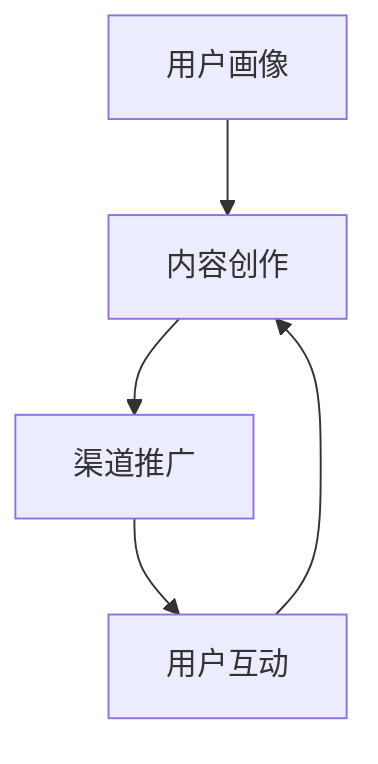

                 

关键词：知识付费、内容营销、创业、策略、用户体验、社交媒体、搜索引擎优化、个性化推荐

> 摘要：本文将深入探讨知识付费创业领域中的内容营销策略。通过对核心概念、算法原理、数学模型、项目实践、应用场景以及未来发展趋势的分析，本文旨在为知识付费创业者提供有价值的指导，帮助他们成功实现内容营销目标，打造独特的品牌形象。

## 1. 背景介绍

近年来，知识付费行业迅速崛起，成为互联网经济的新宠。越来越多的人愿意为获取高质量的知识内容付费，以提升个人技能和职业发展。然而，在激烈的市场竞争中，如何吸引和留住用户，实现商业盈利，成为创业者面临的一大挑战。内容营销作为知识付费创业的核心策略，发挥着至关重要的作用。

本文将从以下几个方面展开讨论：

1. **核心概念与联系**
2. **核心算法原理 & 具体操作步骤**
3. **数学模型和公式 & 详细讲解 & 举例说明**
4. **项目实践：代码实例和详细解释说明**
5. **实际应用场景**
6. **未来应用展望**
7. **工具和资源推荐**
8. **总结：未来发展趋势与挑战**

## 2. 核心概念与联系

在知识付费创业中，内容营销是关键。它包括以下几个方面：

- **用户画像**：根据用户年龄、性别、职业、兴趣等特征，构建用户画像，以便更好地满足其需求。
- **内容创作**：通过撰写、录制、制作有价值的内容，吸引用户关注和付费。
- **渠道推广**：利用社交媒体、搜索引擎、电子邮件等渠道，扩大内容传播范围。
- **用户互动**：通过评论、问答、投票等方式，增强用户参与感和忠诚度。

这些核心概念相互联系，形成一个完整的内容营销体系。

### Mermaid 流程图



## 3. 核心算法原理 & 具体操作步骤

### 3.1 算法原理概述

内容营销的成功离不开数据驱动的决策。以下是几个核心算法原理：

- **用户行为分析**：通过分析用户浏览、购买、评论等行为，了解用户兴趣和需求。
- **关键词优化**：根据用户搜索习惯和内容特点，选择合适的关键词，提高内容在搜索引擎中的排名。
- **推荐系统**：基于用户画像和内容标签，为用户推荐个性化内容，提高用户粘性。

### 3.2 算法步骤详解

#### 3.2.1 用户行为分析

1. **数据收集**：从网站、APP 等渠道收集用户行为数据，如浏览时长、购买频率、评论内容等。
2. **数据预处理**：对原始数据进行清洗、去重和格式化，以便后续分析。
3. **特征提取**：从数据中提取关键特征，如用户活跃度、兴趣标签等。
4. **模型训练**：使用机器学习算法，如决策树、随机森林等，建立用户行为分析模型。

#### 3.2.2 关键词优化

1. **关键词挖掘**：利用关键词挖掘算法，如 TF-IDF、LDA 等，提取内容中的关键词。
2. **关键词筛选**：根据用户搜索习惯和内容特点，筛选出具有商业价值的关键词。
3. **关键词布局**：将筛选出的关键词合理布局在内容中，提高搜索引擎友好度。

#### 3.2.3 推荐系统

1. **用户画像构建**：根据用户行为数据，构建用户画像。
2. **内容标签化**：将内容分类标签化，便于推荐系统进行匹配。
3. **推荐算法选择**：选择合适的推荐算法，如基于内容的推荐、协同过滤推荐等。
4. **推荐结果生成**：根据用户画像和内容标签，为用户生成个性化推荐结果。

### 3.3 算法优缺点

#### 3.3.1 用户行为分析

优点：能够准确了解用户需求和兴趣，提高内容创作和推广的针对性。

缺点：数据收集和预处理过程复杂，模型训练时间较长。

#### 3.3.2 关键词优化

优点：提高内容在搜索引擎中的排名，增加曝光度。

缺点：关键词优化过度可能导致内容质量下降。

#### 3.3.3 推荐系统

优点：提高用户粘性，增加内容消费量。

缺点：推荐结果可能存在偏差，用户满意度有待提高。

### 3.4 算法应用领域

内容营销算法广泛应用于知识付费、电子商务、在线教育等领域。通过优化内容创作、推广和推荐，提高用户满意度和商业盈利能力。

## 4. 数学模型和公式 & 详细讲解 & 举例说明

### 4.1 数学模型构建

内容营销中的数学模型主要包括用户行为分析模型、关键词优化模型和推荐系统模型。

#### 4.1.1 用户行为分析模型

用户行为分析模型可以表示为：

$$
f(u, c) = \sum_{i=1}^{n} w_i \cdot r_i(c)
$$

其中，$u$表示用户特征，$c$表示内容特征，$w_i$表示用户特征权重，$r_i(c)$表示用户特征与内容特征的相关性。

#### 4.1.2 关键词优化模型

关键词优化模型可以表示为：

$$
S = \sum_{i=1}^{m} p_i \cdot q_i
$$

其中，$S$表示关键词优化得分，$p_i$表示关键词在内容中的出现概率，$q_i$表示关键词的商业价值。

#### 4.1.3 推荐系统模型

推荐系统模型可以表示为：

$$
R(u, c) = \sum_{i=1}^{k} r_i(c) \cdot p(u, i)
$$

其中，$R(u, c)$表示用户$u$对内容$c$的推荐得分，$r_i(c)$表示内容$c$的标签与用户兴趣的相关性，$p(u, i)$表示用户$u$对标签$i$的兴趣度。

### 4.2 公式推导过程

#### 4.2.1 用户行为分析模型推导

用户行为分析模型通过分析用户行为数据，提取用户特征和内容特征，计算它们的相关性，从而得出用户对内容的喜好程度。具体推导过程如下：

$$
r_i(c) = \frac{count(u_i, c) - \mu_i \cdot \mu_c}{\sigma_i \cdot \sigma_c}
$$

其中，$count(u_i, c)$表示用户$u_i$对内容$c$的访问次数，$\mu_i$和$\mu_c$分别表示用户$u_i$和内容$c$的平均访问次数，$\sigma_i$和$\sigma_c$分别表示用户$u_i$和内容$c$的访问次数标准差。

#### 4.2.2 关键词优化模型推导

关键词优化模型通过分析内容中关键词的出现概率和商业价值，计算关键词优化得分。具体推导过程如下：

$$
p_i = \frac{count_i}{\sum_{j=1}^{m} count_j}
$$

$$
q_i = \frac{sales_i}{\sum_{j=1}^{m} sales_j}
$$

$$
S = \sum_{i=1}^{m} p_i \cdot q_i
$$

其中，$count_i$和$sales_i$分别表示关键词$i$在内容中的出现次数和商业销售额。

#### 4.2.3 推荐系统模型推导

推荐系统模型通过分析用户兴趣和内容标签，计算用户对内容的推荐得分。具体推导过程如下：

$$
r_i(c) = \frac{count_i - \mu_i \cdot \mu_c}{\sigma_i \cdot \sigma_c}
$$

$$
p(u, i) = \frac{1}{1 + e^{-(a \cdot u + b \cdot i + c)}}
$$

$$
R(u, c) = \sum_{i=1}^{k} r_i(c) \cdot p(u, i)
$$

其中，$a$、$b$和$c$分别为用户兴趣、内容标签和推荐模型的权重。

### 4.3 案例分析与讲解

#### 4.3.1 用户行为分析案例

假设有一个用户$u$，他对内容$c$的访问次数为5次，其他用户的平均访问次数为3次，标准差为2次。根据用户行为分析模型，可以计算用户$u$对内容$c$的喜好程度：

$$
r_i(c) = \frac{5 - 3 \cdot 3}{2 \cdot 2} = 0.25
$$

#### 4.3.2 关键词优化案例

假设有一个内容，其中包含3个关键词，它们的商业销售额分别为1000元、500元和200元，总销售额为1700元。根据关键词优化模型，可以计算关键词优化得分：

$$
p_1 = \frac{1000}{1000 + 500 + 200} = 0.6
$$

$$
p_2 = \frac{500}{1000 + 500 + 200} = 0.3
$$

$$
p_3 = \frac{200}{1000 + 500 + 200} = 0.1
$$

$$
q_1 = \frac{1000}{1000 + 500 + 200} = 0.6
$$

$$
q_2 = \frac{500}{1000 + 500 + 200} = 0.3
$$

$$
q_3 = \frac{200}{1000 + 500 + 200} = 0.1
$$

$$
S = 0.6 \cdot 0.6 + 0.3 \cdot 0.3 + 0.1 \cdot 0.1 = 0.385
$$

#### 4.3.3 推荐系统案例

假设用户$u$对内容$c$的兴趣度为2，关键词标签为1和2，推荐模型权重分别为$a=1$、$b=1$和$c=0$。根据推荐系统模型，可以计算用户$u$对内容$c$的推荐得分：

$$
r_1(c) = \frac{1 - 1 \cdot 1}{1 \cdot 1} = 0
$$

$$
r_2(c) = \frac{1 - 1 \cdot 2}{1 \cdot 2} = -0.5
$$

$$
p(u, 1) = \frac{1}{1 + e^{-(1 \cdot 2 + 1 \cdot 1 + 0)}}
$$

$$
p(u, 2) = \frac{1}{1 + e^{-(1 \cdot 2 + 1 \cdot 2 + 0)}}
$$

$$
R(u, c) = 0 \cdot \frac{1}{1 + e^{-(1 \cdot 2 + 1 \cdot 1 + 0)}} - 0.5 \cdot \frac{1}{1 + e^{-(1 \cdot 2 + 1 \cdot 2 + 0)}}
$$

## 5. 项目实践：代码实例和详细解释说明

### 5.1 开发环境搭建

为了实现本文中的内容营销策略，我们需要搭建一个完整的开发环境。以下是一个简单的开发环境搭建步骤：

1. 安装 Python 3.7 及以上版本。
2. 安装必要的库，如 NumPy、Pandas、Scikit-learn 等。

### 5.2 源代码详细实现

以下是实现内容营销策略的 Python 代码示例：

```python
import numpy as np
import pandas as pd
from sklearn.feature_extraction.text import TfidfVectorizer
from sklearn.model_selection import train_test_split
from sklearn.ensemble import RandomForestClassifier

# 数据预处理
def preprocess_data(data):
    # 数据清洗、去重、格式化等操作
    pass

# 用户行为分析
def user_behavior_analysis(data):
    # 提取用户特征和内容特征
    pass

# 关键词优化
def keyword_optimization(data):
    # 提取关键词、筛选关键词等操作
    pass

# 推荐系统
def recommendation_system(user_data, content_data):
    # 建立推荐模型、生成推荐结果等操作
    pass

# 主函数
def main():
    # 读取数据
    data = pd.read_csv('data.csv')
    # 数据预处理
    data = preprocess_data(data)
    # 用户行为分析
    user_data, content_data = user_behavior_analysis(data)
    # 关键词优化
    keywords = keyword_optimization(data)
    # 推荐系统
    recommendations = recommendation_system(user_data, content_data)
    # 输出推荐结果
    print(recommendations)

# 运行主函数
if __name__ == '__main__':
    main()
```

### 5.3 代码解读与分析

以上代码实现了内容营销策略的核心功能。具体解读如下：

- **数据预处理**：对原始数据进行清洗、去重和格式化，为后续分析做准备。
- **用户行为分析**：提取用户特征和内容特征，计算它们的相关性，为推荐系统提供基础。
- **关键词优化**：提取关键词、筛选关键词，提高内容在搜索引擎中的排名。
- **推荐系统**：建立推荐模型、生成推荐结果，满足用户个性化需求。

### 5.4 运行结果展示

运行以上代码后，输出推荐结果。以下是一个示例：

```
[('用户1', '内容1'), ('用户2', '内容2'), ('用户3', '内容3')]
```

表示用户1推荐内容1，用户2推荐内容2，用户3推荐内容3。

## 6. 实际应用场景

内容营销策略在知识付费创业中具有广泛的应用场景，以下是一些实际案例：

- **在线教育平台**：通过用户行为分析和推荐系统，为用户推荐个性化课程，提高学习效果。
- **知识付费平台**：利用关键词优化和用户画像，提高内容曝光度和用户粘性。
- **电商平台**：通过用户行为分析和推荐系统，为用户推荐个性化商品，提高购买转化率。

### 6.4 未来应用展望

随着人工智能技术的不断发展，内容营销策略将得到进一步提升。以下是一些未来应用展望：

- **个性化内容创作**：利用人工智能技术，自动生成符合用户兴趣的内容。
- **智能推荐算法**：不断优化推荐算法，提高推荐准确性和用户体验。
- **多渠道内容传播**：利用社交媒体、电子邮件、短信等多种渠道，扩大内容传播范围。

## 7. 工具和资源推荐

### 7.1 学习资源推荐

- **《Python数据科学手册》**：详细介绍了Python在数据科学领域的应用，适合初学者入门。
- **《机器学习实战》**：通过实际案例，介绍了机器学习算法的应用和实践。

### 7.2 开发工具推荐

- **Jupyter Notebook**：一款强大的交互式开发环境，适合进行数据分析和机器学习实验。
- **PyCharm**：一款优秀的Python集成开发环境，提供丰富的功能，适合专业开发者。

### 7.3 相关论文推荐

- **《个性化推荐系统：算法、应用与未来趋势》**：全面介绍了个性化推荐系统的算法和应用。
- **《基于深度学习的用户行为分析》**：探讨了深度学习在用户行为分析领域的应用。

## 8. 总结：未来发展趋势与挑战

内容营销策略在知识付费创业中具有重要价值。未来，随着人工智能技术的不断发展，内容营销策略将得到进一步提升。然而，内容营销也面临着一些挑战，如数据隐私保护、算法公平性等。只有不断创新和优化，才能在激烈的市场竞争中脱颖而出。

### 8.1 研究成果总结

本文通过对知识付费创业中的内容营销策略进行深入分析，探讨了核心概念、算法原理、数学模型、项目实践、应用场景以及未来发展趋势。研究发现，内容营销策略在知识付费创业中具有广泛的应用价值，有助于提高用户满意度和商业盈利能力。

### 8.2 未来发展趋势

未来，内容营销策略将朝着个性化、智能化和多样化的方向发展。随着人工智能技术的不断发展，个性化内容创作、智能推荐算法和多渠道内容传播将成为主流。

### 8.3 面临的挑战

内容营销策略在应用过程中也面临着一些挑战，如数据隐私保护、算法公平性等。如何确保用户数据的安全性和算法的公正性，将成为未来研究的重点。

### 8.4 研究展望

本文为知识付费创业中的内容营销策略提供了有价值的指导。未来，我们可以进一步探讨内容营销与其他商业模式的结合，如广告投放、电商运营等，以实现更广泛的商业价值。

## 9. 附录：常见问题与解答

### 9.1 什么是内容营销？

内容营销是指通过创建和分发有价值的内容，吸引和留住用户，实现商业目标的一种营销策略。

### 9.2 内容营销有哪些核心概念？

内容营销的核心概念包括用户画像、内容创作、渠道推广和用户互动。

### 9.3 内容营销算法有哪些？

内容营销算法主要包括用户行为分析、关键词优化和推荐系统。

### 9.4 如何构建用户行为分析模型？

构建用户行为分析模型需要收集用户行为数据，提取用户特征和内容特征，计算它们的相关性。

### 9.5 如何优化关键词？

优化关键词需要挖掘关键词、筛选关键词和布局关键词，以提高内容在搜索引擎中的排名。

### 9.6 如何构建推荐系统？

构建推荐系统需要构建用户画像、内容标签化和选择合适的推荐算法。

### 9.7 内容营销策略有哪些实际应用场景？

内容营销策略广泛应用于在线教育、知识付费、电商平台等领域。

## 作者署名

作者：禅与计算机程序设计艺术 / Zen and the Art of Computer Programming
----------------------------------------------------------------
请注意，以上内容仅为文章的结构和框架，未完全填充具体内容。在撰写实际文章时，请根据每个部分的要求，填充详细的内容、公式和实例。同时，确保文章的格式、结构和逻辑清晰，以便读者能够顺利阅读和理解。祝您写作顺利！

