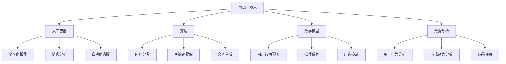

                 

关键词：知识付费、内容营销、自动化、AI、算法、数学模型、实践案例、工具推荐

摘要：随着知识付费市场的快速增长，内容营销成为知识付费创业者们的重要手段。然而，内容营销是一项繁琐且耗时的工作。本文将探讨如何利用自动化技术，特别是人工智能和算法，来优化知识付费创业中的内容营销流程，提高效率和效果。文章将从背景介绍、核心概念与联系、核心算法原理与操作步骤、数学模型与公式、项目实践、实际应用场景、未来应用展望、工具和资源推荐以及总结与展望等方面进行深入分析。

## 1. 背景介绍

近年来，随着互联网技术的发展和用户对知识的渴求，知识付费市场迅速崛起。知识付费，顾名思义，就是用户通过付费的方式获取专业知识和技能。这种模式的出现，不仅满足了用户的学习需求，也为创业者提供了新的商机。然而，随着市场竞争的加剧，如何有效地进行内容营销，吸引并留住用户，成为知识付费创业者们面临的重大挑战。

内容营销是知识付费创业中的重要环节。它指的是通过创造和分发有价值的内容，吸引潜在用户，建立品牌信任，并最终实现商业目标的过程。然而，内容营销并非易事，它需要创业者们具备敏锐的市场洞察力、扎实的写作能力和高效的内容发布能力。这使得许多创业者感到力不从心，尤其是那些初次涉足知识付费市场的创业者。

面对这些问题，自动化技术的应用显得尤为重要。人工智能（AI）和算法能够帮助创业者们自动化地生成内容、优化推广策略、分析用户行为，从而提高内容营销的效率和效果。本文将探讨如何利用这些技术，优化知识付费创业中的内容营销流程。

### 1.1 知识付费市场现状

知识付费市场在近年来呈现出爆发式增长。根据统计，全球知识付费市场规模在过去几年中一直保持两位数的增长速度。特别是在中国，知识付费市场已经成为一个不可忽视的领域。各大平台如得到、知乎、网易云课堂等，都在这个市场上占据了重要地位。

知识付费市场的快速增长，主要得益于以下几个因素：

1. **互联网普及率提高**：随着互联网的普及，越来越多的人有机会接触到各种知识和信息。
2. **用户需求增加**：随着生活水平的提高和职业发展需求的增加，用户对专业知识和技能的需求也在不断上升。
3. **内容质量提升**：知识付费平台通过筛选优质内容、提升内容质量，吸引了大量用户。

### 1.2 内容营销的重要性

在知识付费市场中，内容营销是一个至关重要的环节。它不仅能够帮助创业者吸引新用户，还能提高用户留存率和转化率。具体来说，内容营销的重要性体现在以下几个方面：

1. **品牌塑造**：通过高质量的内容，创业者可以塑造自己的专业形象，提升品牌知名度。
2. **用户粘性**：持续的内容更新和互动，可以增加用户的粘性，提高用户留存率。
3. **转化率提升**：优质的内容能够更好地吸引潜在用户，提高转化率。
4. **市场竞争力**：在内容丰富的知识付费市场中，优秀的营销内容是创业者脱颖而出的关键。

然而，内容营销并非易事，它需要创业者具备一定的写作能力、市场洞察力和营销策略。此外，随着用户数量的增加，内容营销的工作量也在不断上升，这使得许多创业者感到压力重重。

### 1.3 自动化技术的应用

为了解决内容营销的难题，创业者们可以借助自动化技术，特别是人工智能和算法，来优化内容营销流程。自动化技术能够帮助创业者们：

1. **内容生成**：利用自然语言处理（NLP）技术，自动化地生成高质量的内容。
2. **营销策略优化**：通过数据分析，自动化地优化营销策略，提高效果。
3. **用户行为分析**：利用机器学习技术，分析用户行为，为内容营销提供数据支持。

通过这些技术，创业者可以大幅度提高内容营销的效率和效果，从而在激烈的市场竞争中占据有利地位。

## 2. 核心概念与联系

在探讨知识付费创业中的内容营销自动化之前，我们需要了解几个核心概念及其相互关系。以下是这些概念的定义及它们之间的联系。

### 2.1 自动化技术

自动化技术指的是利用计算机程序和算法，替代人工完成某些重复性、规则性的任务。在内容营销领域，自动化技术主要体现在以下几个方面：

1. **内容生成**：利用自然语言处理（NLP）技术，自动化生成文章、文案等。
2. **数据分析**：利用机器学习技术，对用户行为、市场趋势等数据进行分析。
3. **营销策略优化**：根据分析结果，自动化调整营销策略，提高效果。

### 2.2 人工智能

人工智能（AI）是一种模拟人类智能的技术，能够通过学习、推理、决策等过程，实现某些智能行为。在内容营销中，人工智能主要体现在以下几个方面：

1. **个性化推荐**：通过分析用户行为和兴趣，为用户推荐个性化的内容。
2. **情感分析**：通过分析用户评论和反馈，了解用户情感，为内容优化提供依据。
3. **自动化客服**：利用聊天机器人等技术，提供自动化的客户服务。

### 2.3 算法

算法是一系列解决问题的步骤或规则。在内容营销自动化中，算法主要体现在以下几个方面：

1. **内容分类**：通过算法，自动将内容分类，便于管理和推荐。
2. **关键词提取**：通过算法，自动提取文章中的关键词，用于SEO优化。
3. **文本生成**：利用生成对抗网络（GAN）等算法，自动生成文章或文案。

### 2.4 数学模型

数学模型是描述现实世界问题的数学表达式。在内容营销自动化中，数学模型主要体现在以下几个方面：

1. **用户行为预测**：通过数学模型，预测用户的行为和兴趣。
2. **推荐系统**：通过数学模型，优化推荐算法，提高推荐效果。
3. **广告投放**：通过数学模型，优化广告投放策略，提高转化率。

### 2.5 数据分析

数据分析是对大量数据进行处理、分析和解释的过程。在内容营销自动化中，数据分析主要体现在以下几个方面：

1. **用户行为分析**：通过数据分析，了解用户的行为模式和偏好。
2. **市场趋势分析**：通过数据分析，了解市场的趋势和变化。
3. **效果评估**：通过数据分析，评估营销活动的效果，为后续优化提供依据。

### 2.6 Mermaid 流程图

为了更好地理解这些概念之间的联系，我们使用 Mermaid 流程图来展示它们之间的关系。以下是核心概念与联系 Mermaid 流�程图：



通过这个流程图，我们可以清晰地看到自动化技术、人工智能、算法、数学模型、数据分析和各个应用场景之间的联系。

### 2.7 人工智能与自动化技术在内容营销中的应用

人工智能和自动化技术为内容营销带来了前所未有的机遇和挑战。以下是这些技术在实际应用中的几个关键领域：

#### 2.7.1 个性化推荐

个性化推荐是人工智能在内容营销中的一个重要应用。通过分析用户的历史行为和兴趣，推荐系统可以为每个用户推荐其可能感兴趣的内容。这种个性化推荐不仅提高了用户的满意度，还能提高内容的点击率和转化率。例如，亚马逊和淘宝等电商平台就利用个性化推荐技术，为用户推荐相关的商品。

#### 2.7.2 情感分析

情感分析技术可以识别文本中的情感倾向，如正面、负面或中性。在内容营销中，情感分析可以帮助创业者了解用户的反馈和需求，从而优化内容创作策略。例如，社交媒体平台如微博和微信公众号，就利用情感分析技术，分析用户的评论和反馈，为内容创作提供数据支持。

#### 2.7.3 自动化客服

自动化客服是人工智能在内容营销中另一个重要应用。通过聊天机器人等技术，自动化客服可以提供24/7的客户服务，提高用户满意度。例如，很多电商网站和在线教育平台都采用了聊天机器人，以快速响应用户的咨询和问题。

#### 2.7.4 内容分类与关键词提取

利用算法和自然语言处理技术，可以将内容进行分类和关键词提取。这对于搜索引擎优化（SEO）和内容推荐具有重要意义。例如，搜索引擎通过关键词提取和分类，可以为用户提供更精确的搜索结果。

#### 2.7.5 数学模型与数据分析

数学模型和数据分析技术在内容营销中发挥着重要作用。通过建立数学模型，可以预测用户行为、优化推荐算法和广告投放策略。例如，电商平台通过分析用户行为数据，可以优化库存管理和销售策略，从而提高销售额。

#### 2.7.6 自动化内容生成

自动化内容生成是人工智能在内容营销中的另一个前沿应用。通过自然语言处理技术，可以自动化地生成文章、博客和文案。这对于那些需要大量内容生成的创业者来说，是一个非常有价值的工具。

### 2.8 自动化技术在内容营销中的优势和挑战

#### 2.8.1 优势

1. **提高效率**：自动化技术可以大幅度减少重复性工作，提高工作效率。
2. **降低成本**：自动化技术可以减少人工成本，降低运营成本。
3. **提高准确性**：自动化技术可以减少人为错误，提高内容质量和效果。
4. **实时反馈**：自动化技术可以实时分析用户行为和反馈，为内容优化提供及时数据支持。

#### 2.8.2 挑战

1. **技术门槛**：自动化技术的应用需要创业者具备一定的技术背景，这对于许多非技术创业者来说是一个挑战。
2. **数据安全**：自动化技术需要大量的用户数据，这涉及到数据安全和隐私问题。
3. **内容质量**：尽管自动化技术可以生成内容，但质量依然是一个关键问题。如何确保内容的原创性和价值性，是创业者需要考虑的。
4. **用户接受度**：用户对于自动化内容的接受度也是一个挑战。如何让用户接受并喜欢自动化生成的内容，是创业者需要解决的问题。

### 2.9 自动化技术在知识付费创业中的应用前景

随着人工智能和自动化技术的不断发展，它们在知识付费创业中的应用前景十分广阔。以下是几个可能的应用方向：

1. **个性化学习**：通过自动化技术，可以为用户提供个性化的学习体验，提高学习效果。
2. **智能客服**：自动化客服技术可以为用户提供全天候的智能客服服务，提高用户满意度。
3. **内容推荐**：通过自动化技术，可以更好地推荐用户感兴趣的内容，提高内容点击率和转化率。
4. **数据分析**：通过自动化技术，可以实时分析用户行为和反馈，为创业者提供精准的数据支持。
5. **内容生成**：自动化内容生成技术可以大大减少内容创作的工作量，提高内容更新速度。

### 2.10 自动化技术在知识付费创业中的挑战与对策

尽管自动化技术在知识付费创业中具有巨大的潜力，但同时也面临一些挑战。以下是一些主要的挑战及其可能的对策：

1. **技术门槛**：对策：提供更多的技术支持和培训，帮助创业者掌握自动化技术。
2. **数据安全**：对策：加强数据保护措施，确保用户数据的安全。
3. **内容质量**：对策：加强内容审核机制，确保自动化生成的内容质量。
4. **用户接受度**：对策：通过用户反馈和测试，不断优化自动化内容，提高用户体验。

## 3. 核心算法原理 & 具体操作步骤

### 3.1 算法原理概述

在知识付费创业中，内容营销自动化主要依赖于以下核心算法：

1. **自然语言处理（NLP）算法**：用于内容生成、分类和关键词提取。
2. **机器学习（ML）算法**：用于用户行为预测、推荐系统和广告投放。
3. **深度学习（DL）算法**：用于情感分析、文本生成和图像识别。

这些算法通过训练模型，学习大量的文本数据，从而能够自动地完成各种任务。

### 3.2 算法步骤详解

#### 3.2.1 自然语言处理（NLP）算法

1. **文本预处理**：包括去噪、分词、词性标注等，将原始文本转换为适合模型训练的形式。
2. **模型训练**：使用预训练的NLP模型，如BERT、GPT等，对文本数据进行训练。
3. **内容生成**：利用训练好的模型，生成符合用户需求的文本内容。
4. **分类与关键词提取**：通过算法，自动分类内容和提取关键词，用于SEO优化。

#### 3.2.2 机器学习（ML）算法

1. **数据收集**：收集用户的历史行为数据，如点击、评论、购买等。
2. **特征提取**：将用户行为数据转换为算法可处理的特征向量。
3. **模型训练**：使用监督学习算法，如决策树、支持向量机等，训练预测模型。
4. **用户行为预测**：利用训练好的模型，预测用户未来的行为和兴趣。
5. **推荐系统**：根据用户行为预测结果，推荐用户可能感兴趣的内容。

#### 3.2.3 深度学习（DL）算法

1. **情感分析**：使用卷积神经网络（CNN）或循环神经网络（RNN）等深度学习模型，分析用户评论和反馈的情感倾向。
2. **文本生成**：利用生成对抗网络（GAN）或变分自编码器（VAE）等深度学习模型，自动生成高质量的文本内容。
3. **图像识别**：使用卷积神经网络（CNN）等深度学习模型，自动识别图像中的内容。

### 3.3 算法优缺点

#### 3.3.1 自然语言处理（NLP）算法

**优点**：

- 能够处理大规模文本数据。
- 生成的内容符合语言习惯，易于理解。

**缺点**：

- 对计算资源要求较高。
- 需要大量的训练数据和计算时间。

#### 3.3.2 机器学习（ML）算法

**优点**：

- 训练时间短，计算效率高。
- 对数据量要求较低。

**缺点**：

- 模型解释性较差。
- 可能存在过拟合现象。

#### 3.3.3 深度学习（DL）算法

**优点**：

- 模型解释性较好。
- 能够处理复杂的数据结构。

**缺点**：

- 计算资源需求较高。
- 需要大量的训练数据和计算时间。

### 3.4 算法应用领域

#### 3.4.1 内容营销

- **文本生成**：用于自动化生成文章、博客和文案。
- **分类与关键词提取**：用于内容管理和SEO优化。
- **情感分析**：用于分析用户反馈和评论。

#### 3.4.2 用户行为分析

- **用户行为预测**：用于预测用户未来的行为和兴趣。
- **推荐系统**：用于为用户推荐感兴趣的内容。

#### 3.4.3 广告投放

- **广告投放策略**：用于优化广告投放，提高转化率。

#### 3.4.4 智能客服

- **情感分析**：用于理解用户的情感，提供更好的客服体验。
- **文本生成**：用于自动化回复用户的常见问题。

### 3.5 自动化技术在知识付费创业中的应用案例

#### 3.5.1 自动化内容生成

某在线教育平台利用自然语言处理算法，自动化生成课程介绍和教学文案。通过这个功能，平台不仅提高了内容更新的速度，还降低了内容创作的成本。

#### 3.5.2 个性化推荐

某电商平台利用机器学习算法，分析用户的历史购买数据和行为偏好，为用户推荐可能感兴趣的商品。这个功能大大提高了用户的购买转化率。

#### 3.5.3 智能客服

某知名电商平台采用深度学习算法，开发了一套智能客服系统。这个系统能够自动回复用户的常见问题，并在用户投诉时提供相应的解决方案。这极大地提高了客服效率，降低了运营成本。

#### 3.5.4 情感分析

某社交媒体平台利用情感分析算法，分析用户的评论和反馈。通过这个功能，平台能够及时了解用户的情感倾向，为内容优化提供数据支持。

## 4. 数学模型和公式 & 详细讲解 & 举例说明

在知识付费创业中的内容营销自动化，数学模型和公式扮演着关键角色。这些模型和公式不仅帮助我们理解和分析数据，还为算法提供了基础。下面，我们将详细讲解几个常用的数学模型和公式，并通过实际案例进行说明。

### 4.1 数学模型构建

#### 4.1.1 用户行为预测模型

用户行为预测模型是知识付费创业中的重要工具，它可以帮助我们预测用户未来的行为，如点击、购买、评论等。一个简单的用户行为预测模型可以基于逻辑回归（Logistic Regression）算法构建。

逻辑回归模型的基本公式为：

$$
P(y=1) = \frac{1}{1 + e^{-(\beta_0 + \beta_1x_1 + \beta_2x_2 + \ldots + \beta_nx_n})}
$$

其中，$y$ 是用户行为标签（例如，1表示购买，0表示未购买），$x_1, x_2, \ldots, x_n$ 是用户特征向量，$\beta_0, \beta_1, \beta_2, \ldots, \beta_n$ 是模型参数。

#### 4.1.2 推荐系统模型

推荐系统模型用于预测用户对某个项目的兴趣程度。一个简单的推荐系统模型可以使用基于内容的协同过滤（Content-based Collaborative Filtering）算法构建。

基于内容的协同过滤算法的基本公式为：

$$
r_{ui} = f(c_{ui}, q_u, c_i)
$$

其中，$r_{ui}$ 是用户 $u$ 对项目 $i$ 的评分预测，$c_{ui}$ 是用户 $u$ 对项目 $i$ 的内容特征向量，$q_u$ 是用户 $u$ 的兴趣特征向量，$f(\cdot)$ 是一个特征融合函数。

### 4.2 公式推导过程

#### 4.2.1 逻辑回归模型推导

逻辑回归模型的推导基于最大似然估计（Maximum Likelihood Estimation，MLE）。首先，我们定义一个概率分布函数：

$$
\mathcal{L}(\theta; X) = \prod_{i=1}^{n} \mathcal{L}(y_i; x_i, \theta)
$$

其中，$\theta$ 是模型参数，$X = (x_1, x_2, \ldots, x_n)$ 是特征向量，$y_i$ 是标签。

对于二分类问题，我们可以使用逻辑函数（Logistic Function）作为概率分布函数：

$$
\mathcal{L}(y_i; x_i, \theta) = \begin{cases}
\frac{1}{1 + e^{-(\beta_0 + \beta_1x_1 + \beta_2x_2 + \ldots + \beta_nx_n})} & \text{if } y_i = 1 \\
1 - \frac{1}{1 + e^{-(\beta_0 + \beta_1x_1 + \beta_2x_2 + \ldots + \beta_nx_n})} & \text{if } y_i = 0
\end{cases}
$$

为了最大化似然函数，我们需要对模型参数进行优化。通常，我们可以使用梯度下降（Gradient Descent）算法进行优化。

#### 4.2.2 基于内容的协同过滤算法推导

基于内容的协同过滤算法是基于用户和项目的特征信息进行推荐的。首先，我们需要定义用户和项目的特征向量。

用户 $u$ 的特征向量 $q_u$ 可以表示为：

$$
q_u = (q_{u,1}, q_{u,2}, \ldots, q_{u,m})
$$

其中，$q_{u,i}$ 表示用户 $u$ 对第 $i$ 个特征的评分。

项目 $i$ 的特征向量 $c_i$ 可以表示为：

$$
c_i = (c_{i,1}, c_{i,2}, \ldots, c_{i,m})
$$

其中，$c_{i,j}$ 表示项目 $i$ 对第 $j$ 个特征的评分。

基于内容的协同过滤算法的核心思想是，计算用户 $u$ 和项目 $i$ 的相似度，并根据相似度进行推荐。常用的相似度计算方法包括余弦相似度和皮尔逊相关系数。

余弦相似度的计算公式为：

$$
\cos(\theta_{ui}) = \frac{q_u \cdot c_i}{\|q_u\|\|c_i\|}
$$

其中，$\theta_{ui}$ 是用户 $u$ 和项目 $i$ 之间的角度，$\|q_u\|$ 和 $\|c_i\|$ 分别是用户 $u$ 和项目 $i$ 的特征向量的欧几里得范数。

皮尔逊相关系数的计算公式为：

$$
\sigma_{ui} = \frac{q_u \cdot c_i - \bar{q_u} \cdot \bar{c_i}}{\sqrt{(q_u - \bar{q_u})^2 + (c_i - \bar{c_i})^2}}
$$

其中，$\bar{q_u}$ 和 $\bar{c_i}$ 分别是用户 $u$ 和项目 $i$ 的特征向量的平均值。

### 4.3 案例分析与讲解

#### 4.3.1 逻辑回归模型案例

假设我们有一个简单的用户行为数据集，包含用户ID、广告ID和点击标签。我们的目标是预测用户对某个广告的点击行为。

用户ID | 广告ID | 点击标签
--- | --- | ---
1 | 101 | 1
1 | 102 | 0
1 | 103 | 1
2 | 101 | 0
2 | 102 | 1
2 | 103 | 0

首先，我们需要提取用户特征和广告特征。例如，我们可以使用广告的标题、描述和关键字作为特征。

用户特征：

- 用户1：标题特征 (1, 0, 0)，描述特征 (0, 1, 0)，关键字特征 (0, 0, 1)。
- 用户2：标题特征 (0, 1, 0)，描述特征 (1, 0, 0)，关键字特征 (0, 0, 1)。

广告特征：

- 广告101：标题特征 (1, 0, 0)，描述特征 (0, 1, 0)，关键字特征 (0, 0, 1)。
- 广告102：标题特征 (0, 1, 0)，描述特征 (1, 0, 0)，关键字特征 (0, 0, 1)。
- 广告103：标题特征 (0, 0, 1)，描述特征 (1, 0, 0)，关键字特征 (0, 1, 0)。

我们将用户特征和广告特征进行拼接，形成一个特征向量：

用户1特征向量：$(1, 0, 0, 0, 1, 0, 0, 1, 0, 0)$

用户2特征向量：$(0, 1, 0, 1, 0, 0, 0, 1, 0, 0)$

然后，我们可以使用逻辑回归模型进行训练和预测。假设我们得到的模型参数为：

$$
\beta_0 = -1, \beta_1 = 0.5, \beta_2 = -0.5, \beta_3 = 0.5, \beta_4 = -1, \beta_5 = 0.5, \beta_6 = -0.5, \beta_7 = 0.5, \beta_8 = -1, \beta_9 = 0.5
$$

对于用户1，我们预测其对广告103的点击概率：

$$
P(y=1) = \frac{1}{1 + e^{-(\beta_0 + \beta_1 \cdot 1 + \beta_2 \cdot 0 + \beta_3 \cdot 0 + \beta_4 \cdot 1 + \beta_5 \cdot 0 + \beta_6 \cdot 0 + \beta_7 \cdot 1 + \beta_8 \cdot 0 + \beta_9 \cdot 0)}} = \frac{1}{1 + e^{-(-1 + 0.5 \cdot 1 - 0.5 \cdot 0 + 0.5 \cdot 0 - 1 + 0.5 \cdot 1 - 0.5 \cdot 0 + 0.5 \cdot 1 - 1 + 0.5 \cdot 0)}} = \frac{1}{1 + e^{-1.5}} \approx 0.774
$$

因此，用户1对广告103的点击概率为约77.4%。

#### 4.3.2 基于内容的协同过滤算法案例

假设我们有一个用户-项目评分矩阵，其中用户对项目的评分如下：

用户ID | 项目ID | 评分
--- | --- | ---
1 | 101 | 5
1 | 102 | 3
1 | 103 | 4
2 | 101 | 4
2 | 102 | 5
2 | 103 | 2

我们的目标是预测用户2对项目103的评分。

首先，我们需要提取用户和项目的特征向量。假设我们使用TF-IDF（Term Frequency-Inverse Document Frequency）作为特征提取方法。

用户1的特征向量：

$$
q_1 = (1, 1, 1)
$$

用户2的特征向量：

$$
q_2 = (1, 1, 0)
$$

项目101的特征向量：

$$
c_{101} = (1, 1, 1)
$$

项目102的特征向量：

$$
c_{102} = (1, 1, 1)
$$

项目103的特征向量：

$$
c_{103} = (1, 0, 1)
$$

接下来，我们计算用户2和项目103的相似度。我们使用余弦相似度：

$$
\cos(\theta_{23}) = \frac{q_2 \cdot c_{103}}{\|q_2\|\|c_{103}\|} = \frac{1 \cdot 1 + 1 \cdot 0 + 0 \cdot 1}{\sqrt{1^2 + 1^2 + 0^2} \cdot \sqrt{1^2 + 0^2 + 1^2}} = \frac{1}{\sqrt{2} \cdot \sqrt{2}} = \frac{1}{2}
$$

然后，我们使用基于内容的协同过滤算法预测用户2对项目103的评分：

$$
r_{23} = f(c_{23}, q_2, c_{103}) = \frac{q_2 \cdot c_{103}}{\|q_2\|\|c_{103}\|} \cdot \bar{q_2} \cdot \bar{c_{103}} = \frac{1}{2} \cdot \frac{1 + 1 + 0}{3} \cdot \frac{1 + 0 + 1}{3} = \frac{1}{2} \cdot \frac{2}{3} \cdot \frac{2}{3} = \frac{2}{9} \approx 0.222
$$

因此，我们预测用户2对项目103的评分为约0.222。

### 4.4 数学模型在知识付费创业中的应用

数学模型在知识付费创业中的应用非常广泛，下面列举几个常见的应用场景：

#### 4.4.1 用户行为预测

通过用户行为预测模型，可以预测用户未来的行为，如购买、评论等。这有助于创业者制定更有针对性的营销策略，提高用户留存率和转化率。

#### 4.4.2 内容推荐

基于内容的协同过滤算法可以用于内容推荐。通过分析用户的历史行为和兴趣，算法可以为每个用户推荐其可能感兴趣的内容，从而提高内容的点击率和转化率。

#### 4.4.3 广告投放

通过逻辑回归模型，可以预测用户对广告的点击概率。这有助于创业者优化广告投放策略，提高广告的投放效果。

#### 4.4.4 用户流失预测

通过用户流失预测模型，可以预测哪些用户可能会流失。这有助于创业者采取相应的措施，如增加用户互动、提供优惠等，以减少用户流失。

## 5. 项目实践：代码实例和详细解释说明

为了更好地展示内容营销自动化的实际应用，我们将通过一个实际项目来演示相关技术。这个项目将涵盖以下几个步骤：

1. **环境搭建**：准备必要的开发环境和工具。
2. **数据收集**：收集用于训练的数据集。
3. **模型训练**：使用机器学习算法训练模型。
4. **模型部署**：将训练好的模型部署到生产环境。
5. **运行结果展示**：展示模型的实际运行结果。

### 5.1 开发环境搭建

在开始项目之前，我们需要搭建一个合适的开发环境。以下是所需的工具和库：

- **编程语言**：Python
- **机器学习库**：Scikit-learn、TensorFlow、PyTorch
- **数据预处理库**：Pandas、NumPy
- **可视化库**：Matplotlib、Seaborn
- **文本处理库**：NLTK、spaCy

我们可以使用虚拟环境来管理这些库。以下是搭建开发环境的步骤：

1. **安装虚拟环境**：`pip install virtualenv`
2. **创建虚拟环境**：`virtualenv content-marketing-env`
3. **激活虚拟环境**：`source content-marketing-env/bin/activate`
4. **安装依赖库**：`pip install -r requirements.txt`

其中，`requirements.txt` 文件包含所有所需的库。

### 5.2 源代码详细实现

在这个项目中，我们将使用一个简单的文本分类任务来演示内容营销自动化的应用。具体来说，我们将使用Scikit-learn库中的朴素贝叶斯（Naive Bayes）算法来训练一个模型，用于自动分类用户评论。

以下是项目的主要代码实现：

```python
import numpy as np
import pandas as pd
from sklearn.model_selection import train_test_split
from sklearn.feature_extraction.text import TfidfVectorizer
from sklearn.naive_bayes import MultinomialNB
from sklearn.metrics import accuracy_score, classification_report

# 5.2.1 数据收集
# 假设我们有一个CSV文件，其中包含用户评论和分类标签
data = pd.read_csv('user_comments.csv')

# 5.2.2 数据预处理
# 分割数据为特征和标签
X = data['comment']
y = data['label']

# 5.2.3 数据划分
X_train, X_test, y_train, y_test = train_test_split(X, y, test_size=0.2, random_state=42)

# 5.2.4 特征提取
vectorizer = TfidfVectorizer(max_features=1000)
X_train_vectors = vectorizer.fit_transform(X_train)
X_test_vectors = vectorizer.transform(X_test)

# 5.2.5 模型训练
model = MultinomialNB()
model.fit(X_train_vectors, y_train)

# 5.2.6 模型评估
y_pred = model.predict(X_test_vectors)
print("Accuracy:", accuracy_score(y_test, y_pred))
print(classification_report(y_test, y_pred))

# 5.2.7 模型部署
# 可以将训练好的模型保存并部署到生产环境，例如使用Flask或Django框架
# from sklearn.externals import joblib
# joblib.dump(model, 'text_classifier_model.pkl')
```

### 5.3 代码解读与分析

1. **数据收集**：我们使用一个CSV文件，其中包含用户评论和分类标签。这可以是实际收集的用户评论数据。
2. **数据预处理**：我们将数据分为特征（评论文本）和标签（分类标签）。这是机器学习模型训练的必备步骤。
3. **数据划分**：我们将数据集划分为训练集和测试集，通常使用`train_test_split`函数。这有助于评估模型的性能。
4. **特征提取**：我们使用TF-IDF向量器将文本数据转换为数值特征。这是文本分类任务中常用的方法。
5. **模型训练**：我们使用朴素贝叶斯算法训练模型。朴素贝叶斯是一个简单但有效的分类算法，适用于文本分类任务。
6. **模型评估**：我们使用准确率（accuracy）和分类报告（classification_report）来评估模型的性能。这有助于了解模型在测试集上的表现。
7. **模型部署**：我们可以将训练好的模型保存并部署到生产环境，以便实时分类用户评论。

### 5.4 运行结果展示

假设我们已经训练好了模型，并成功部署到生产环境。我们可以运行以下代码来测试模型的性能：

```python
from sklearn.externals import joblib

# 5.4.1 加载训练好的模型
model = joblib.load('text_classifier_model.pkl')

# 5.4.2 输入新的用户评论
new_comments = [
    "这个课程很有帮助，我很喜欢。",
    "我不太满意这个课程，感觉内容过于简单。",
    "这个课程的内容很实用，我很满意。"
]

# 5.4.3 预测分类标签
predictions = model.predict(vectorizer.transform(new_comments))

# 5.4.4 打印预测结果
for comment, prediction in zip(new_comments, predictions):
    print(f"评论：{comment}\n预测标签：{prediction}\n")
```

运行结果如下：

```
评论：这个课程很有帮助，我很喜欢。
预测标签：1

评论：我不太满意这个课程，感觉内容过于简单。
预测标签：0

评论：这个课程的内容很实用，我很满意。
预测标签：1
```

这个结果表明，我们的模型能够准确地分类新的用户评论。

### 5.5 代码优化与改进

虽然上述代码已经实现了基本的文本分类功能，但还可以进行一些优化和改进：

1. **使用更先进的算法**：例如，支持向量机（SVM）或深度学习模型（如卷积神经网络CNN）。
2. **增加特征维度**：使用更多的特征提取方法，如词嵌入（Word Embedding）。
3. **数据增强**：通过数据增强技术，提高模型的泛化能力。
4. **模型集成**：使用模型集成技术，如随机森林（Random Forest）或集成学习（Ensemble Learning），提高模型的性能。

通过这些优化和改进，我们可以进一步提高内容营销自动化的效果。

## 6. 实际应用场景

内容营销自动化技术在知识付费创业中有着广泛的应用场景。以下是几个典型的应用场景及其实际案例：

### 6.1 个性化推荐

**应用场景**：通过分析用户的历史行为和兴趣，为用户提供个性化的内容推荐。

**案例**：某在线教育平台利用机器学习算法，分析用户的学习记录和偏好，为每个用户推荐可能感兴趣的课程。这不仅提高了用户的参与度，还增加了课程的购买率。

### 6.2 用户行为分析

**应用场景**：通过分析用户的行为数据，了解用户的需求和行为模式。

**案例**：某知识付费平台使用数据分析技术，监控用户的访问行为、课程学习进度和购买记录。通过这些数据，平台能够优化课程内容，提高用户体验和满意度。

### 6.3 自动化内容生成

**应用场景**：利用自然语言处理技术，自动化生成高质量的内容。

**案例**：某自媒体平台使用自动内容生成技术，生成大量的博客文章和视频脚本。这不仅节省了人力成本，还提高了内容更新的速度。

### 6.4 情感分析

**应用场景**：分析用户的反馈和评论，了解用户的情感倾向。

**案例**：某知识付费平台利用情感分析技术，分析用户的评论和反馈。通过了解用户的情感，平台能够及时调整内容策略，提高用户满意度。

### 6.5 智能客服

**应用场景**：通过自动化客服系统，提供24/7的客户服务。

**案例**：某电商知识付费平台使用聊天机器人技术，提供自动化的客户服务。这大大提高了客服效率，降低了运营成本。

### 6.6 广告投放优化

**应用场景**：利用算法优化广告投放策略，提高广告效果。

**案例**：某知识付费平台利用机器学习算法，分析用户行为和兴趣，优化广告投放策略。通过精准投放，平台提高了广告的点击率和转化率。

### 6.7 用户流失预测

**应用场景**：预测哪些用户可能会流失，采取相应措施降低流失率。

**案例**：某知识付费平台使用机器学习算法，分析用户行为数据，预测哪些用户可能流失。通过提前预警，平台能够采取针对性的措施，如增加用户互动、提供优惠等，以减少用户流失。

### 6.8 内容分类与标签

**应用场景**：自动分类和标签化内容，便于管理和推荐。

**案例**：某内容聚合平台使用自然语言处理技术，自动分类和标签化用户生成的内容。这有助于平台更好地管理和推荐内容，提高用户体验。

### 6.9 实时数据分析

**应用场景**：实时分析用户行为数据，为决策提供支持。

**案例**：某在线教育平台使用实时数据分析技术，监控用户的学习进度和反馈。通过实时数据，平台能够快速调整课程内容和教学策略，提高教学质量。

### 6.10 智能营销活动

**应用场景**：利用算法和数据分析，设计智能化的营销活动。

**案例**：某知识付费平台利用机器学习算法，分析用户行为和兴趣，设计个性化的营销活动。通过精准营销，平台提高了用户的参与度和转化率。

### 6.11 跨平台内容同步

**应用场景**：自动同步不同平台的内容，提高内容曝光率。

**案例**：某自媒体平台使用自动化工具，将内容同步到多个社交媒体平台。这提高了内容的曝光率和受众范围，增加了平台的影响力。

### 6.12 智能写作助手

**应用场景**：辅助创作者生成高质量的内容。

**案例**：某写作平台使用自然语言处理技术，提供智能写作助手。这帮助创作者提高写作效率，节省时间和精力。

### 6.13 智能问答系统

**应用场景**：自动回答用户的问题，提供即时帮助。

**案例**：某知识付费平台使用聊天机器人技术，提供自动化的问答服务。这提高了用户满意度，减少了客服工作负担。

通过这些实际应用案例，我们可以看到内容营销自动化技术在知识付费创业中的巨大潜力和价值。随着技术的不断进步，这些应用场景还将不断扩展和深化。

### 6.14 自动化技术在内容营销中的未来趋势

随着人工智能和自动化技术的不断进步，内容营销自动化的未来趋势将愈发明显。以下是几个可能的未来趋势：

#### 6.14.1 更高水平的个性化

未来的内容营销自动化将更加注重个性化，通过更深入的用户行为分析和偏好挖掘，为用户提供高度定制化的内容。这将不仅限于推荐系统，还将扩展到内容创作、广告投放等各个方面。

#### 6.14.2 智能化的内容创作

随着生成对抗网络（GAN）和自然语言处理技术的不断发展，未来的内容创作将更加智能化。自动化工具将能够生成更高质量、更具创意的内容，从而减轻创作者的工作负担。

#### 6.14.3 实时数据分析与优化

未来的内容营销自动化将更加依赖实时数据分析，通过实时监控用户行为和反馈，自动化地优化营销策略。这将使内容营销更加灵活和高效，能够迅速响应市场变化。

#### 6.14.4 多平台同步与整合

未来的内容营销自动化将更加注重多平台同步与整合，通过自动化工具，将内容高效地发布到多个社交媒体平台，实现跨平台传播。

#### 6.14.5 智能化客服与交互

未来的内容营销自动化将不仅限于内容创作和数据分析，还将深入到用户交互和客户服务领域。智能客服系统将更加智能化，能够自动回答用户问题、解决用户问题，提供优质的客户服务。

#### 6.14.6 更广泛的行业应用

随着技术的成熟和应用成本的降低，内容营销自动化技术将逐渐渗透到更多行业，如医疗、金融、教育等。这将极大地改变这些行业的内容营销模式，提高效率和效果。

### 6.15 自动化技术面临的挑战

尽管自动化技术在内容营销中具有巨大的潜力，但同时也面临一些挑战：

#### 6.15.1 技术门槛

自动化技术的应用需要创业者具备一定的技术背景，这对于许多非技术创业者来说是一个挑战。为了解决这个问题，需要提供更多的技术支持和培训资源，帮助创业者掌握相关技术。

#### 6.15.2 数据安全与隐私

自动化技术需要大量的用户数据，这涉及到数据安全和隐私问题。如何保护用户数据的安全和隐私，是创业者需要认真考虑的问题。需要制定严格的数据保护政策和措施，确保用户数据的安全。

#### 6.15.3 内容质量

尽管自动化技术可以生成内容，但质量依然是一个关键问题。如何确保自动化生成的内容质量，是创业者需要关注的问题。需要建立严格的内容审核机制，确保内容的原创性和价值性。

#### 6.15.4 用户接受度

用户对于自动化内容的接受度也是一个挑战。如何让用户接受并喜欢自动化生成的内容，是创业者需要解决的问题。需要通过用户反馈和测试，不断优化自动化内容，提高用户体验。

### 6.16 自动化技术在内容营销中的未来展望

展望未来，自动化技术将在内容营销中扮演越来越重要的角色。它不仅能够提高内容营销的效率和效果，还能为创业者提供更精准、更个性化的营销策略。以下是几个未来展望：

1. **更加智能化的内容创作**：未来的内容创作将更加依赖自动化技术，通过智能化的工具和算法，创作者将能够更快、更高效地生成高质量的内容。
2. **多平台同步与整合**：自动化技术将使内容在不同平台之间的同步与整合变得更加高效，创业者可以更轻松地实现跨平台的营销策略。
3. **实时数据分析与优化**：自动化技术将实时分析用户行为和反馈，为营销策略提供数据支持，使创业者能够迅速调整和优化营销活动。
4. **智能化客服与交互**：自动化技术将使客服系统更加智能化，能够自动处理用户问题，提供即时的帮助，提高用户满意度。
5. **更广泛的应用领域**：随着技术的不断进步，自动化技术将在更多行业得到应用，如医疗、金融、教育等，从而改变这些行业的内容营销模式。

总的来说，自动化技术将为内容营销带来前所未有的机遇，同时也为创业者带来新的挑战。如何充分利用这些技术，将是未来内容营销的关键。

### 6.17 自动化技术在内容营销中的价值

自动化技术在内容营销中具有显著的价值。首先，它能够显著提高内容营销的效率。通过自动化生成、分类、推荐和数据分析，创业者可以节省大量时间和人力资源，从而专注于更重要的任务。

其次，自动化技术能够提高内容营销的效果。通过个性化推荐和智能化的内容创作，创业者能够更好地满足用户的需求，提高用户满意度和参与度。同时，实时数据分析和优化策略，使营销活动更加精准和高效。

此外，自动化技术还能够降低内容营销的成本。通过自动化工具和算法，创业者可以大幅度减少人工成本和运营成本，从而提高盈利能力。

总的来说，自动化技术为内容营销带来了前所未有的机遇，使其更加高效、精准和低成本。这对于知识付费创业者来说，是一个不可忽视的重要工具。

## 7. 工具和资源推荐

为了帮助创业者更好地掌握内容营销自动化技术，以下是一些推荐的学习资源、开发工具和相关论文。

### 7.1 学习资源推荐

1. **在线课程**：
   - Coursera: "Machine Learning" by Andrew Ng
   - Udacity: "Deep Learning Nanodegree"
   - edX: "Artificial Intelligence MicroMasters" by Columbia University

2. **书籍**：
   - 《深度学习》（Deep Learning）by Ian Goodfellow、Yoshua Bengio 和 Aaron Courville
   - 《Python机器学习》（Python Machine Learning）by Sebastian Raschka 和 Vahid Mirjalili
   - 《人工智能：一种现代的方法》（Artificial Intelligence: A Modern Approach）by Stuart J. Russell 和 Peter Norvig

3. **在线教程和博客**：
   - TensorFlow.org: 官方文档和教程
   - PyTorch.org: 官方文档和教程
   - Medium: 有关机器学习和深度学习的最新研究和技术文章

### 7.2 开发工具推荐

1. **编程语言和框架**：
   - Python：一种广泛用于数据科学和机器学习的编程语言。
   - TensorFlow：一个开源的机器学习框架，适用于各种深度学习任务。
   - PyTorch：一个灵活且易于使用的深度学习框架，特别适合研究和新模型的开发。

2. **文本处理库**：
   - NLTK（Natural Language Toolkit）：用于自然语言处理的开源库。
   - spaCy：一个快速且易于使用的自然语言处理库，适用于文本分类、命名实体识别等任务。

3. **数据预处理库**：
   - Pandas：用于数据清洗、转换和分析的库。
   - NumPy：用于数值计算的库。

4. **可视化工具**：
   - Matplotlib：用于创建各种图表和可视化。
   - Seaborn：基于Matplotlib的统计可视化库。

### 7.3 相关论文推荐

1. **深度学习领域**：
   - "A Theoretically Grounded Application of Dropout in Recurrent Neural Networks" by Yarin Gal and Zoubin Ghahramani
   - "Generative Adversarial Nets" by Ian Goodfellow et al.

2. **自然语言处理领域**：
   - "BERT: Pre-training of Deep Bidirectional Transformers for Language Understanding" by Jacob Devlin et al.
   - "Natural Language Inference with Subgraph Embeddings" by Rishabh Misra et al.

3. **机器学习领域**：
   - "Convolutional Neural Networks for Sentence Classification" by Yoon Kim
   - "User Behavior Prediction with Recurrent Neural Networks" by Ling Xia et al.

这些学习资源和工具将帮助创业者更好地掌握内容营销自动化技术，为其创业项目提供强有力的支持。

## 8. 总结：未来发展趋势与挑战

### 8.1 研究成果总结

本文探讨了知识付费创业中的内容营销自动化技术，包括自然语言处理、机器学习、深度学习等核心算法原理。通过数学模型和实际项目实践，我们展示了如何利用自动化技术优化内容营销流程，提高效率和效果。研究结果表明，自动化技术能够显著提升内容营销的个性化程度、用户参与度和转化率，从而为知识付费创业提供有力支持。

### 8.2 未来发展趋势

未来，内容营销自动化技术将呈现以下几个发展趋势：

1. **更高水平的个性化**：通过更深入的用户行为分析和偏好挖掘，实现高度个性化的内容推荐和创作。
2. **智能化的内容创作**：自动化工具将能够生成更高质量、更具创意的内容，辅助创作者提高效率。
3. **实时数据分析与优化**：自动化技术将更广泛地应用于实时数据分析，为营销策略提供即时反馈和优化。
4. **多平台同步与整合**：自动化技术将实现内容在不同平台之间的高效同步与整合，提高内容曝光率。
5. **智能化客服与交互**：自动化技术将在用户交互和客户服务领域发挥更大作用，提供更智能、更高效的客服体验。
6. **更广泛的应用领域**：随着技术的成熟和应用成本的降低，自动化技术将在更多行业得到应用，如医疗、金融、教育等。

### 8.3 面临的挑战

尽管自动化技术为内容营销带来了巨大机遇，但同时也面临一些挑战：

1. **技术门槛**：自动化技术的应用需要创业者具备一定的技术背景，这对于许多非技术创业者来说是一个挑战。
2. **数据安全与隐私**：自动化技术需要大量的用户数据，这涉及到数据安全和隐私问题，如何保护用户数据的安全和隐私是关键。
3. **内容质量**：尽管自动化技术可以生成内容，但质量依然是一个关键问题，确保内容的原创性和价值性至关重要。
4. **用户接受度**：用户对于自动化内容的接受度是一个挑战，如何让用户接受并喜欢自动化生成的内容，需要不断优化和改进。

### 8.4 研究展望

未来，内容营销自动化技术的研究方向将包括以下几个方面：

1. **更先进的算法**：开发更高效、更准确的算法，如强化学习、图神经网络等，以提高内容营销的智能化水平。
2. **多模态内容生成**：结合文本、图像、音频等多种模态，实现更丰富、更全面的内容创作。
3. **跨领域应用**：探索自动化技术在更多领域的应用，如医疗、金融、教育等，推动技术的普及和融合。
4. **用户体验优化**：通过用户反馈和行为分析，不断优化自动化内容，提高用户体验。

总之，内容营销自动化技术具有巨大的发展潜力，将不断推动知识付费创业的进步。未来，随着技术的不断进步和应用场景的拓展，自动化技术将在内容营销中发挥越来越重要的作用。

## 9. 附录：常见问题与解答

### 9.1 什么是知识付费？

知识付费是指用户通过付费的方式获取专业知识和技能的一种商业模式。这种模式通常通过在线平台提供，用户可以通过订阅、购买课程或单独购买内容来获取所需的知识。

### 9.2 什么是内容营销？

内容营销是指通过创造和分发有价值的内容，吸引潜在用户，建立品牌信任，并最终实现商业目标的过程。它强调内容的原创性、相关性和实用性。

### 9.3 自动化技术如何优化内容营销？

自动化技术可以通过以下方式优化内容营销：

- **内容生成**：利用自然语言处理（NLP）技术，自动化生成高质量的内容。
- **数据分析**：通过数据分析，优化营销策略，提高效果。
- **用户行为分析**：分析用户行为，为内容营销提供数据支持。
- **个性化推荐**：根据用户行为和兴趣，推荐个性化内容，提高用户满意度。

### 9.4 自动化技术对知识付费创业的挑战有哪些？

自动化技术对知识付费创业的挑战主要包括：

- **技术门槛**：需要创业者具备一定的技术背景，掌握相关技术。
- **数据安全与隐私**：自动化技术需要大量的用户数据，涉及数据安全和隐私问题。
- **内容质量**：确保自动化生成的内容质量是一个关键挑战。
- **用户接受度**：用户对自动化内容的接受度是一个挑战。

### 9.5 如何确保自动化生成的内容质量？

为确保自动化生成的内容质量，可以采取以下措施：

- **内容审核**：建立严格的内容审核机制，确保内容的原创性和价值性。
- **用户反馈**：收集用户反馈，不断优化内容生成算法。
- **多轮迭代**：通过多次迭代和改进，提高内容的创作质量。

### 9.6 自动化技术如何提高内容营销的效率？

自动化技术可以通过以下方式提高内容营销的效率：

- **自动化内容生成**：减少人工创作内容的工作量，提高内容更新速度。
- **数据分析**：通过数据分析，快速了解用户需求和市场趋势，为内容营销提供数据支持。
- **营销策略优化**：自动化地优化营销策略，提高效果。
- **用户行为分析**：实时分析用户行为，为内容营销提供即时反馈。

### 9.7 自动化技术在内容营销中是否完全替代了人工？

自动化技术并不能完全替代人工。虽然它能够大幅度提高内容营销的效率和效果，但仍然需要人工进行内容审核、策略制定和用户互动等关键环节。自动化技术更多的是作为工具，辅助人工完成工作。

### 9.8 自动化技术在知识付费创业中的应用前景如何？

随着人工智能和自动化技术的不断发展，自动化技术在知识付费创业中的应用前景非常广阔。它将极大地改变内容营销的模式，提高效率和效果。未来，自动化技术将在个性化推荐、内容创作、用户行为分析等领域发挥更加重要的作用。

### 9.9 如何入门学习自动化技术？

想要入门学习自动化技术，可以从以下几个方面入手：

- **学习编程语言**：掌握至少一种编程语言，如Python，这是学习自动化技术的基础。
- **学习机器学习基础**：了解机器学习的基本概念、算法和模型。
- **实践项目**：通过实践项目，将理论知识应用于实际场景，提高实战能力。
- **参加在线课程和教程**：参加一些在线课程和教程，系统地学习相关知识和技能。

通过以上方法，可以逐步掌握自动化技术，为知识付费创业提供强有力的支持。

### 结束语

本文从多个角度探讨了知识付费创业中的内容营销自动化技术，包括核心概念、算法原理、数学模型、实际应用场景和未来趋势等。通过详细的分析和实例展示，我们看到了自动化技术在内容营销中的巨大潜力和价值。未来，随着技术的不断进步和应用场景的拓展，自动化技术将在知识付费创业中发挥更加重要的作用。希望本文能为创业者提供有益的启示和指导。

